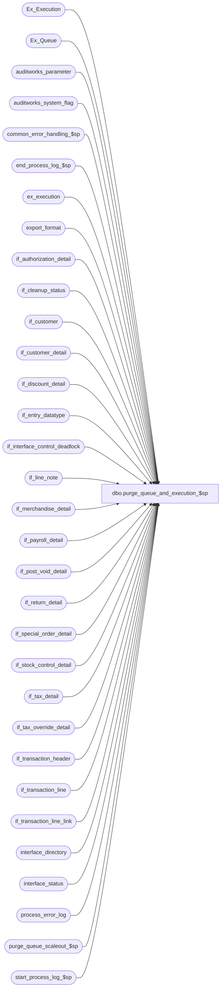

# dbo.purge_queue_and_execution_$sp

**Database:** auditworks  
**Server:** bedrockdb01  

## Architecture Diagram



## Table Dependencies

| Referenced Table |
|---|
| Ex_Execution |
| Ex_Queue |
| auditworks_parameter |
| auditworks_system_flag |
| common_error_handling_$sp |
| end_process_log_$sp |
| ex_execution |
| export_format |
| if_authorization_detail |
| if_cleanup_status |
| if_customer |
| if_customer_detail |
| if_discount_detail |
| if_entry_datatype |
| if_interface_control_deadlock |
| if_line_note |
| if_merchandise_detail |
| if_payroll_detail |
| if_post_void_detail |
| if_return_detail |
| if_special_order_detail |
| if_stock_control_detail |
| if_tax_detail |
| if_tax_override_detail |
| if_transaction_header |
| if_transaction_line |
| if_transaction_line_link |
| interface_directory |
| interface_status |
| process_error_log |
| purge_queue_scaleout_$sp |
| start_process_log_$sp |

## Stored Procedure Code

```sql
CREATE proc [dbo].[purge_queue_and_execution_$sp] @process_id binary(16)
   
AS


/* Proc_name: purge_queue_and_execution_$sp
   Desc:To delete transactions in Ex_Queue and interface tables once all
	applicable interfaces have been posted.
	Called by day_end_posting_$sp once a night if the param smartview_cleanup = 0 in table if_cleanup_status.
	That param setting option should only be used when the Foundation Housekeeping job is not configured to run on a scheduled basis
	because that job already calls purge_queue_$sp in SA after Foundation cleans up Ex_Execution.

   Same version of this proc can be used for SA5.0 and SA5.1 due to partitioning parameter.

   Note : Archive partitioning is only available as of SA 2018.1 for mssql. Non-existence of the partitioning parameter in table
	auditworks_system_flag causes system behavior to default to non-partitioning as in SA5.0.

HISTORY:
Date     Name         Def# Desc
Mar16,18 Terri	 DAOM-2866 Correction on comments and notes
Sep13,17 Sean/Terri DAOM-2537Removal of incorrect comments and modified partitioning check so that the IF tables can be 
                           cleaned up since IF tables are currently not partitioned.
Dec01,16 Serguei DAOM-1758  WFM-ESA-100 Do not ignore history days (equivalent to SmartView keep hours);  
                            Only look at interface IDs that are set for pre-audit, post-audit or Avalara (since these are the only ones that use the queue tables).
                            Add cleanup of interfaces that have been turned off.
Aug13,14 Vicci   TFS-68371 Use message ID to support categorization and UI display when logging process error.
Apr23,10 Paul    117332 When using partitioning, do not log a warning message in this proc.
Aug31,09 Paul    111900 update if_cleanup_status to handle the scaleout consolidated environment, handle possible timing issues (Currently only in Oracle)
Apr26,07 Paul   DV-1363 moved drop statement
Jan17,07 Tim    DV-1351 Apply 78255 to SA5
Nov29,05 Paul   DV-1324 Call purge_queue_scaleout_$sp
Sep09,05 Paul   DV-1312 update history block
Apr29,05 Maryam DV-1202 Delete if_transaction_line_link, use if_entry_datatype (Paul)
Dec14,04 David  DV-1191 Improve performance by adding hints.
Oct07,04 David  DV-1146 Handle new column user_id.
Sep09,04 Maryam DV-1120 Log more info in message re txns unposted to interfaces, apply 39945 to SA5
May07,04 Maryam DV-1071 Receive @process_id
Oct06,06 Vicci    78255 Do not remove interface table entries for transactions whose
                        posting has failed.
Aug17,04 Daphna 1-WE0SC
                 /39945 Log more info in message re txns unposted to interfaces
May08,02 Winnie 1-C2Q5L Add abort logic to dayend.
Apr25,02 Phu    1-C9P5S Remove entry in if_tax_detail
Apr23,02 Phu    1-CKO55 Error handling
Oct30,01 Paul      8883 select min(key_1) - 1 to avoid deleting one row too many
Sep19,01 Shapoor   8755 Use the 'rows_per_batch' parameter to determine the batch size for each delete.
Aug13,01 Winnie	   8034 Log invalid transaction information to process_error_log.
Jul19,01 Henry     8372 Clean up entries for interfaces which have been turned off
Mar30,01 Paul      7497 Look for all queue_id, not just queue_id < 100
May25,00 John G	   5864 Change '= NULL' to 'IS NULL' where applicable to mirror Oracle.
Mar03,00 Sab	   5988 Will log a warning message to process_log if interface tables are NOT cleaning up
Mar01,00 Phu	   5900 Change @@fetch_status > 0 to @@fetch_status <> 0 for MS SQL compatibility
Feb28,00 Sab	   5984 Purging of Ex_Queue and Ex_Execution NOT working
Oct08,97 Sab            Author
*/

DECLARE @abort_flag		tinyint,
	@cleanup_interfaces	tinyint,
	@current_date		smalldatetime,
	@cursor_open		tinyint,
	@errmsg			nvarchar(2000),
	@errno			int,
	@from_serial_no		numeric(14,0),
	@interface_cleanup_date	smalldatetime,
	@max_if_entry_no		if_entry_datatype,
	@min_if_entry_cleanup	if_entry_datatype,
	@message_id		int,
	@object_id		int,
	@object_name		nvarchar(255),
	@operation_name		nvarchar(100),
	@partitioning_in_use	int,
	@process_name		nvarchar(100),
	@queue_id		int,
	@process_log_entry	tinyint,
	@process_no 		smallint,
	@process_timestamp 	float,
	@rows 			int,
	@to_serial_no		numeric(14,0),
	@transaction_count 	int,
	@rows_count             int,
	@rows_per_batch         integer,
	@history_days				int,
	@history_cutoff_serial_no	int,
	@tax_export                 int;        

SELECT  @process_no = 41,
	@transaction_count = 0,
	@max_if_entry_no = 0,
	@cleanup_interfaces = 1,
	@cursor_open = 0,
	@current_date = CONVERT(smalldatetime, CONVERT(nchar(8),getdate(),112)),
	@message_id = 201068,
	@process_name = 'purge_queue_and_execution_$sp',
	@abort_flag = 0

-- will only be present in SA5.1 environments
SELECT @partitioning_in_use = flag_numeric_value
  FROM auditworks_system_flag
 WHERE flag_name = 'partitioning_in_use'

SELECT @errno = @@error, @rows_count = @@rowcount
IF @errno <> 0
BEGIN
  SELECT @errmsg = 'Failed to select partitioning_in_use',
         @object_name = 'auditworks_system_flag',
         @operation_name = 'SELECT'
  GOTO error
END

IF @rows_count = 0
  SELECT @partitioning_in_use = 0

EXEC start_process_log_$sp @process_no, @process_timestamp OUTPUT, @errmsg OUTPUT

SELECT @errno = @@error
IF @errno <> 0
BEGIN
  SELECT @errmsg = @errmsg + 'Unable to execute start_process_log_$sp',
         @object_name = 'start_process_log_$sp',
         @operation_name = 'EXECUTE'
  GOTO error
END

SELECT @process_log_entry = 1

SELECT @tax_export = 1
 FROM interface_directory d
      INNER JOIN export_format f
             ON d.interface_id = f.interface_id
            AND d.ascii_export = f.export_format
            AND f.export_procedure_name <> 'avalara_tax_master_request_$sp'  --implies tax transactions are not exported, only a tax-master import request is being exported. 
WHERE d.interface_id = 12  --Tax
  AND d.update_timing > 0  --note:  must be 6 for Avalara export since it uses tax_detail
  AND d.ascii_export > 0;
  
SELECT @tax_export = COALESCE(@tax_export, 0)


CREATE TABLE #invalid_transaction (
	if_entry_no 			numeric(14,0)	not null, -- if_entry_datatype
	interface_control_flag 		numeric(14,0) 	not null,
	queue_id 			numeric(10,0) 	not null )

SELECT @errno = @@error
IF @errno <> 0 
BEGIN
  SELECT @errmsg = 'Failed to create temp table.',
         @object_name = '#invalid_transaction',
         @operation_name = 'CREATE'
  GOTO error  
END

INSERT INTO #invalid_transaction
SELECT key_1, key_2, eq.queue_id
  FROM Ex_Execution ee, Ex_Queue eq
 WHERE ee.status_code = 1 -- posting error
   AND eq.serial_no >= ee.from_serial_no
   AND eq.serial_no <= ee.to_serial_no
   AND eq.queue_id = ee.queue_id
  
SELECT @errno = @@error, @rows_count = @@rowcount
IF @errno <> 0
BEGIN
  SELECT @errmsg = 'Failed to insert temp table #invalid_transaction',
	 @object_name = '#invalid_transaction',
	 @operation_name = 'INSERT'
  GOTO error
END

/* Log warning a warning message for each transaction that smartview exports skipped without posting due to data errors.
   The transactions would still be accessible in the transaction archive or current for investigation purposes
     using transaction_id from table process_error_log. */

IF @rows_count > 0
  BEGIN
    INSERT process_error_log 
           (process_no, 
            error_code, 
            message_id,
            error_timestamp, 
            process_id,
            verified, 
            verified_by_user_id,
            error_msg,
            user_id, 
            memo1, 
            memo2, 
            memo3,
            memo_date, 
            memo_date2, 
            memo_date3, 
            transaction_id)
    SELECT  @process_no,
            201784,
            201784,
            getdate(),
            @process_id, 
            0, 
            NULL,
            'Transaction could not be posted to interface: ' + CONVERT(nvarchar, queue_id) +
            ', store = ' + CONVERT(nvarchar, store_no) + ', reg = ' + CONVERT(nvarchar, register_no)
            + ', txn = ' + CONVERT(nvarchar,transaction_no) + '/' + transaction_series + 
            ', date = ' + CONVERT(nvarchar, transaction_date, 107) + 
            'for interface control flag = ' + convert(nvarchar, interface_control_flag) + CASE WHEN last_modified_date_time IS NOT NULL THEN
            ', last modified = ' + CONVERT(nvarchar, getdate(), 109) ELSE ' ' END,
            NULL,
            CONVERT(nvarchar,transaction_no) + '/' + transaction_series, 
            CONVERT(nvarchar,store_no)+ '/' + CONVERT(nvarchar,register_no),
            CONVERT(nvarchar,it.queue_id) + '/' + CONVERT(nvarchar,interface_control_flag),
            transaction_date, 
            COALESCE(last_modified_date_time, entry_date_time),
            entry_date_time, 
            ih.transaction_id
       FROM #invalid_transaction it WITH (NOLOCK), if_transaction_header ih WITH (NOLOCK)
      WHERE it.if_entry_no = ih.if_entry_no

    SELECT @errno = @@error
    IF @errno <> 0
    BEGIN
      SELECT @errmsg = 'Failed to INSERT process_error_log.',
             @object_name = 'process_error_log',
             @operation_name = 'INSERT'
      GOTO error
    END
  END -- if @rows_count > 0

  --
  -- Determine highest if_entry_no in case all Ex_Queue rows get purged by this proc
  --

   SELECT @max_if_entry_no = MAX(key_1)
     FROM Ex_Queue

  -- only update if Ex_Queue still contains rows

  IF @max_if_entry_no IS NOT NULL -- THEN
  BEGIN
    UPDATE if_cleanup_status
       SET max_if_entry_no = @max_if_entry_no

    SELECT @errno = @@error
    IF @errno <> 0
    BEGIN
      SELECT @errmsg = 'Failed to update if_cleanup_status',
             @object_name = 'if_cleanup_status',
             @operation_name = 'UPDATE'
      GOTO error
    END
  END -- If @max_if_entry_no is not null

/* If using scaleout, then remove Ex_queue entries from peripheral for interfaces that will be posted on consolidated */

EXEC purge_queue_scaleout_$sp

SELECT @errno = @@error
IF @errno <> 0
  BEGIN
    SELECT @errmsg = 'Unable exec purge_queue_scaleout_$sp',
           @object_name = 'purge_queue_scaleout_$sp',
           @operation_name = 'EXECUTE'
    GOTO error
  END

--Get the batch size for each of the DELETE's
SELECT @rows_per_batch = CONVERT(integer,ISNULL(par_value,'10000'))
  FROM auditworks_parameter
 WHERE par_name = 'rows_per_batch'

SELECT @errno = @@error
IF @errno <> 0
BEGIN
  SELECT @errmsg = 'Unable to select from auditworks_parameter (rows_per_batch)',
    @object_name = 'auditworks_parameter',
         @operation_name = 'SELECT'
  GOTO error
END

-- This section will delete records from Ex_Queue where update_in_progress = 50 

DECLARE int_directory_crsr CURSOR FAST_FORWARD 
    FOR
 SELECT	interface_id,
	object_id,
	COALESCE(history_days, 0)
   FROM interface_directory
    WHERE update_timing IN (1, 2)
		OR (interface_id = 12 AND @tax_export = 1)
 UNION 
	SELECT d.interface_id,
       d.object_id,
       0  --don't keep history for deactivated interfaces
	FROM interface_directory d
       INNER JOIN interface_status s
          ON d.interface_id = s.interface_id
         AND (d.interface_id IN (1, 3, 4, 21, 23, 28) OR d.interface_id >= 50)
         AND s.last_posting_datetime > GETDATE() - 5
	WHERE d.update_timing = 0;  
  

OPEN int_directory_crsr

SELECT @errno = @@error
IF @errno <> 0
BEGIN
  SELECT @errmsg = 'Unable to open cursor int_directory_crsr',
         @object_name = 'int_directory_crsr',
         @operation_name = 'OPEN'
  GOTO error
END

SELECT @cursor_open = 1
WHILE 1=1
  BEGIN
    FETCH int_directory_crsr INTO
	      @queue_id,
	      @object_id,
	      @history_days

    IF @@fetch_status <> 0
	BREAK

    IF @object_id IS NULL 
    BEGIN
        SELECT @rows = @rows_per_batch
        WHILE @rows = @rows_per_batch
        BEGIN
	      BEGIN TRANSACTION

          UPDATE if_interface_control_deadlock
	         SET function_no = @process_no,
	             status_date = getdate()

          SELECT @errno = @@error
          IF @errno <> 0
          BEGIN
            SELECT @errmsg = 'Failed to update if_interface_control_deadlock',
                   @object_name = 'if_interface_control_deadlock',
                   @operation_name = 'UPDATE'
			GOTO error
          END

          DELETE TOP (@rows_per_batch) FROM Ex_Queue
	       WHERE queue_id = @queue_id
	         AND key_2 = 50
             AND (key_10 IS NULL OR key_10 < GETDATE() - @history_days);  --key_10 = I/F posting datetime (note never null)

          SELECT @errno = @@error, @rows = @@rowcount
          IF @errno <> 0
          BEGIN
            SELECT @errmsg = 'Unable to delete from Ex_Queue',
                   @object_name = 'Ex_Queue',
                   @operation_name = 'DELETE'
            GOTO error
          END

          COMMIT TRANSACTION
        END -- WHILE @rows = @rows_per_batch
      END -- IF @object_id IS NULL 
    ELSE
      BEGIN
		  SELECT @history_cutoff_serial_no = MAX(serial_no)
			 FROM Ex_Queue
			WHERE queue_id = @queue_id
			  AND (key_10 IS NULL OR key_10 < GETDATE() - @history_days  --key_10 = I/F posting datetime (note never null)
			  AND serial_no < (SELECT max(to_serial_no) FROM ex_execution WHERE queue_id = @queue_id));
	          
			  SELECT @errno = @@error, @rows = @@rowcount
			  IF @errno <> 0
			  BEGIN
				SELECT @errmsg = 'Unable to delete from Ex_Queue',
					   @object_name = 'Ex_Queue',
					   @operation_name = 'DELETE'
				GOTO error
			  END      
      
        DECLARE Ex_Execution_crsr CURSOR FAST_FORWARD 
            FOR
         SELECT from_serial_no,
	        to_serial_no
		 FROM Ex_Execution WITH (NOLOCK)
			WHERE queue_id = @queue_id
				AND IsNull(status_code, 0) <> 1  --i.e. exclude failed postings from cleanup 78255
				AND from_serial_no <= @history_cutoff_serial_no   --i.e. range has at least 1 entry old enough to be cleaned up
			ORDER by from_serial_no

		OPEN Ex_Execution_crsr
		SELECT @cursor_open = 2

        WHILE 2=2
        BEGIN
	      FETCH Ex_Execution_crsr INTO
                @from_serial_no,
                @to_serial_no

          IF @@fetch_status <> 0
			BREAK

          BEGIN TRANSACTION

          UPDATE if_interface_control_deadlock
             SET function_no = @process_no,
                 status_date = getdate()

          SELECT @errno = @@error
          IF @errno <> 0
          BEGIN
            SELECT @errmsg = 'Failed to update if_interface_control_deadlock',
                   @object_name = 'if_interface_control_deadlock',
				   @operation_name = 'UPDATE'
            GOTO error
          END

          DELETE TOP (@rows_per_batch) FROM Ex_Queue
           WHERE queue_id = @queue_id
             AND serial_no >= @from_serial_no
             AND serial_no <= @to_serial_no
             AND serial_no <= @history_cutoff_serial_no;              

          SELECT @errno = @@error
          IF @errno <> 0
          BEGIN
            SELECT @errmsg = 'Unable to delete from Ex_Queue (1)',
                   @object_name = 'Ex_Queue',
                   @operation_name = 'DELETE'
            GOTO error
          END

          DELETE TOP (@rows_per_batch) FROM Ex_Execution
           WHERE queue_id = @queue_id
             AND from_serial_no >= @from_serial_no
             AND to_serial_no <= @to_serial_no
             AND to_serial_no <= @history_cutoff_serial_no

          SELECT @errno = @@error
          IF @errno <> 0
          BEGIN
            SELECT @errmsg = 'Unable to delete from Ex_Execution',
                   @object_name = 'Ex_Execution',
                  @operation_name = 'DELETE'
            GOTO error
          END

          COMMIT TRANSACTION
        END -- WHILE 2=2 

     CLOSE Ex_Execution_crsr
        DEALLOCATE Ex_Execution_crsr
        SELECT @cursor_open = 1
      END  --END of ELSE 
  END -- WHILE 1=1 

CLOSE int_directory_crsr
DEALLOCATE int_directory_crsr
SELECT @cursor_open = 0


/* Now that Ex_Queue table is clean, we'll select min remaining if_entry_no.
   We will then delete rows from if_transaction_header where
   if_entry_no <= (min(if_entry_no) - 1). */

SELECT @max_if_entry_no = MIN(key_1) - 1
  FROM Ex_Queue WITH (NOLOCK)
 WHERE key_1 NOT IN (SELECT if_entry_no
                       FROM #invalid_transaction)

SELECT @min_if_entry_cleanup = min_if_entry_cleanup,
	@interface_cleanup_date = interface_cleanup_date
  FROM if_cleanup_status

/* Check for scenario where ex_queue is empty */

IF @max_if_entry_no IS NULL
  BEGIN
    SELECT @max_if_entry_no = max_if_entry_no
      FROM if_cleanup_status

    IF @max_if_entry_no IS NULL OR @max_if_entry_no = 0
      SELECT @cleanup_interfaces = 0
  END

/* Now delete the interface detail attachments (if not using IF partitioning).
     When IF partitioning is turned on, then avoid deleting tran details because partitioning maintenance
      will remove the posted transactions later. 
      IF @cleanup_interfaces = 1 AND COALESCE(@partitioning_in_use,0) = 0 */

IF @cleanup_interfaces = 1 -- Temporary Marker For Above Commented 
BEGIN
  SET ROWCOUNT @rows_per_batch

-- delete entries in if_authorization_detail 
  SELECT @rows = @rows_per_batch
  WHILE @rows = @rows_per_batch
  BEGIN
    DELETE if_authorization_detail
     WHERE if_entry_no <= @max_if_entry_no
        AND if_entry_no NOT IN (SELECT if_entry_no
                                  FROM #invalid_transaction)
     

    SELECT @errno = @@error, @rows = @@rowcount
    IF @errno <> 0
    BEGIN
      SELECT @errmsg = 'Unable to delete from if_authorization_detail',
             @object_name = 'if_authorization_detail',
             @operation_name = 'DELETE'
   GOTO error
    END
  END

-- DELETE  entries in if_customer 
  SELECT @rows = @rows_per_batch
  WHILE @rows = @rows_per_batch
  BEGIN
    DELETE if_customer
     WHERE if_entry_no <= @max_if_entry_no
       AND if_entry_no NOT IN (SELECT if_entry_no
                                 FROM #invalid_transaction)
     

    SELECT @errno = @@error, @rows = @@rowcount
    IF @errno <> 0
    BEGIN
      SELECT @errmsg = 'Unable to delete from if_customer',
             @object_name = 'if_customer',
             @operation_name = 'DELETE'
      GOTO error
    END
  END

-- DELETE  entries in if_customer_detail 
  SELECT @rows = @rows_per_batch
  WHILE @rows = @rows_per_batch
  BEGIN
    DELETE if_customer_detail
     WHERE if_entry_no <= @max_if_entry_no
       AND if_entry_no NOT IN (SELECT if_entry_no
                                 FROM #invalid_transaction)
    SELECT @errno = @@error, @rows = @@rowcount
  IF @errno <> 0
    BEGIN
      SELECT @errmsg = 'Unable to delete from if_customer_detail',
             @object_name = 'if_customer_detail',
             @operation_name = 'DELETE'
      GOTO error
    END
  END

-- DELETE  entries in if_discount_detail 
  SELECT @rows = @rows_per_batch
  WHILE @rows = @rows_per_batch
  BEGIN
    DELETE if_discount_detail
     WHERE if_entry_no <= @max_if_entry_no
       AND if_entry_no NOT IN (SELECT if_entry_no
                                 FROM #invalid_transaction)
    SELECT @errno = @@error, @rows = @@rowcount
    IF @errno <> 0
    BEGIN
      SELECT @errmsg = 'Unable to delete from if_discount_detail',
             @object_name = 'if_discount_detail',
             @operation_name = 'DELETE'
      GOTO error
    END
  END

-- DELETE  entries in if_line_note 
  SELECT @rows = @rows_per_batch
  WHILE @rows = @rows_per_batch
  BEGIN
    DELETE if_line_note
     WHERE if_entry_no <= @max_if_entry_no
       AND if_entry_no NOT IN (SELECT if_entry_no
                                 FROM #invalid_transaction)
    SELECT @errno = @@error, @rows = @@rowcount
    IF @errno <> 0
    BEGIN
      SELECT @errmsg = 'Unable to delete from if_line_note',
             @object_name = 'if_line_note',
             @operation_name = 'DELETE'
      GOTO error
    END
  END

-- DELETE  entries in if_merchandise_detail 
  SELECT @rows = @rows_per_batch
  WHILE @rows = @rows_per_batch
  BEGIN
    DELETE if_merchandise_detail
     WHERE if_entry_no <= @max_if_entry_no
       AND if_entry_no NOT IN (SELECT if_entry_no
                                 FROM #invalid_transaction)
    SELECT @errno = @@error, @rows = @@rowcount
    IF @errno <> 0
    BEGIN
 SELECT @errmsg = 'Unable to delete from if_merchandise_detail',
             @object_name = 'if_merchandise_detail',
             @operation_name = 'DELETE'
      GOTO error
    END
  END

-- DELETE  entries in if_payroll_detail 
  SELECT @rows = @rows_per_batch
  WHILE @rows = @rows_per_batch
  BEGIN
    DELETE if_payroll_detail
     WHERE if_entry_no <= @max_if_entry_no
       AND if_entry_no NOT IN (SELECT if_entry_no
                                 FROM #invalid_transaction)
    SELECT @errno = @@error, @rows = @@rowcount
    IF @errno <> 0
    BEGIN
      SELECT @errmsg = 'Unable to delete from if_payroll_detail',
     @object_name = 'if_payroll_detail',
             @operation_name = 'DELETE'
      GOTO error
    END
  END

-- DELETE  entries in if_post_void_detail 
  SELECT @rows = @rows_per_batch
  WHILE @rows = @rows_per_batch
  BEGIN
    DELETE if_post_void_detail
     WHERE if_entry_no <= @max_if_entry_no
       AND if_entry_no NOT IN (SELECT if_entry_no
                                 FROM #invalid_transaction)
    SELECT @errno = @@error, @rows = @@rowcount
    IF @errno <> 0
    BEGIN
      SELECT @errmsg = 'Unable to delete from if_post_void_detail',
             @object_name = 'if_post_void_detail',
    @operation_name = 'DELETE'
      GOTO error
    END
  END

-- DELETE  entries in if_return_detail 
  SELECT @rows = @rows_per_batch
  WHILE @rows = @rows_per_batch
  BEGIN
    DELETE if_return_detail
     WHERE if_entry_no <= @max_if_entry_no
       AND if_entry_no NOT IN (SELECT if_entry_no
                   FROM #invalid_transaction)
    SELECT @errno = @@error, @rows = @@rowcount
    IF @errno <> 0
    BEGIN
      SELECT @errmsg = 'Unable to delete from if_return_detail',
             @object_name = 'if_return_detail',
      @operation_name = 'DELETE'
 GOTO error
    END
  END

-- DELETE  entries in if_special_order_detail 
  SELECT @rows = @rows_per_batch
  WHILE @rows = @rows_per_batch
  BEGIN
    DELETE if_special_order_detail
     WHERE if_entry_no <= @max_if_entry_no
       AND if_entry_no NOT IN (SELECT if_entry_no
                                 FROM #invalid_transaction)
    SELECT @errno = @@error, @rows = @@rowcount
    IF @errno <> 0
    BEGIN
      SELECT @errmsg = 'Unable to delete from if_special_order_detail',
             @object_name = 'if_special_order_detail',
             @operation_name = 'DELETE'
      GOTO error
    END
END

-- DELETE  entries in if_stock_control_detail 
  SELECT @rows = @rows_per_batch
  WHILE @rows = @rows_per_batch
  BEGIN
    DELETE if_stock_control_detail
     WHERE if_entry_no <= @max_if_entry_no
       AND if_entry_no NOT IN (SELECT if_entry_no
                                 FROM #invalid_transaction)
    SELECT @errno = @@error, @rows = @@rowcount
    IF @errno <> 0
    BEGIN
      SELECT @errmsg = 'Unable to delete from if_stock_control_detail',
             @object_name = 'if_stock_control_detail',
             @operation_name = 'DELETE'
      GOTO error
    END
  END

-- DELETE  entries in if_tax_override_detail 
  SELECT @rows = @rows_per_batch
  WHILE @rows = @rows_per_batch
  BEGIN
    DELETE if_tax_override_detail
     WHERE if_entry_no <= @max_if_entry_no
       AND if_entry_no NOT IN (SELECT if_entry_no
                                 FROM #invalid_transaction)
    SELECT @errno = @@error, @rows = @@rowcount
    IF @errno <> 0
    BEGIN
      SELECT @errmsg = 'Unable to delete from if_tax_override_detail',
             @object_name = 'if_tax_override_detail',
             @operation_name = 'DELETE'
      GOTO error
    END
  END

-- DELETE  entries in if_tax_detail
  SELECT @rows = @rows_per_batch
  WHILE @rows = @rows_per_batch
  BEGIN
    DELETE if_tax_detail
     WHERE if_entry_no <= @max_if_entry_no
       AND if_entry_no NOT IN (SELECT if_entry_no
                                 FROM #invalid_transaction)
   SELECT @errno = @@error, @rows = @@rowcount
    IF @errno <> 0
    BEGIN
      SELECT @errmsg = 'Unable to delete from if_tax_detail',
             @object_name = 'if_tax_detail',
             @operation_name = 'DELETE'
      GOTO error
    END
  END

-- DELETE  entries in if_transaction_line_link 
  SELECT @rows = @rows_per_batch
  WHILE @rows = @rows_per_batch
  BEGIN
    DELETE if_transaction_line_link
     WHERE if_entry_no <= @max_if_entry_no
       AND if_entry_no NOT IN (SELECT if_entry_no
                                 FROM #invalid_transaction)
    SELECT @errno = @@error, @rows = @@rowcount
    IF @errno <> 0
    BEGIN
      SELECT @errmsg = 'Unable to delete from if_transaction_line_link',
             @object_name = 'if_transaction_line_link',
             @operation_name = 'DELETE'
      GOTO error
    END
  END
  
-- DELETE  entries in if_transaction_line 
  SELECT @rows = @rows_per_batch
  WHILE @rows = @rows_per_batch
  BEGIN
    DELETE if_transaction_line
     WHERE if_entry_no <= @max_if_entry_no
       AND if_entry_no NOT IN (SELECT if_entry_no
                                 FROM #invalid_transaction)
    SELECT @errno = @@error, @rows = @@rowcount
    IF @errno <> 0
    BEGIN
      SELECT @errmsg = 'Unable to delete from if_transaction_line',
             @object_name = 'if_transaction_line',
             @operation_name = 'DELETE'
      GOTO error
    END
  END

-- DELETE  entries in if_transaction_header 
  SELECT @rows = @rows_per_batch
  WHILE @rows = @rows_per_batch
  BEGIN
    DELETE if_transaction_header
     WHERE if_entry_no <= @max_if_entry_no
       AND if_entry_no NOT IN (SELECT if_entry_no
                                 FROM #invalid_transaction)
    SELECT @errno = @@error, @rows = @@rowcount
    IF @errno <> 0
    BEGIN
      SELECT @errmsg = 'Unable to delete from if_transaction_header',
             @object_name = 'if_transaction_header',
             @operation_name = 'DELETE'
      GOTO error
    END

    SELECT @transaction_count = @transaction_count + @rows
  END
END -- If @cleanup_interfaces = 1 

SET ROWCOUNT 0

DROP TABLE #invalid_transaction

EXEC end_process_log_$sp @process_no, @process_timestamp, @transaction_count

SELECT @errno = @@error
IF @errno <> 0
  BEGIN
    SELECT @errmsg = 'Unable to execute end_process_log_$sp',
           @object_name = 'end_process_log_$sp',
           @operation_name = 'EXECUTE'
    GOTO error
  END

/* Log a warning message to process_error_log if no rows were cleaned up (when not using partitioning and when some
   transaction processing, e.g. edit, has run since the last time that this cleanup proc ran).
   If using partitioning, partition_purge_if_$sp will instead log a warning message when no partitions were dropped. */

IF @transaction_count = 0 AND @min_if_entry_cleanup = @max_if_entry_no AND @min_if_entry_cleanup IS NOT NULL 
  AND @interface_cleanup_date <> @current_date AND COALESCE(@partitioning_in_use,0) = 0 -- THEN
 BEGIN
   SELECT @errmsg = 'WARNING!! No posted transactions were deleted from the interface tables',
          @errno = 201613,
          @message_id = 201613,
          @abort_flag = 3
   GOTO error
 END

UPDATE if_cleanup_status
  SET min_if_entry_cleanup = @max_if_entry_no,
	 interface_cleanup_date = @current_date

SELECT @errno = @@error
IF @errno <> 0
  BEGIN
    SELECT @errmsg = 'Unable to update if_cleanup_status',
           @object_name = 'if_cleanup_status',
           @operation_name = 'UPDATE'
    GOTO error
  END


RETURN

error:
	SET ROWCOUNT 0

	IF @cursor_open > 0
	BEGIN
	  IF @cursor_open = 2
	  BEGIN
	    CLOSE Ex_Execution_crsr
	    DEALLOCATE Ex_Execution_crsr
	  END

	  CLOSE int_directory_crsr
	  DEALLOCATE int_directory_crsr
	END

	EXEC common_error_handling_$sp @process_no, @errno, @errmsg, @abort_flag, @message_id, 
	@process_name, @object_name, @operation_name, 1,1, @process_log_entry,
        @process_timestamp, @transaction_count, null, null, null, null, null, null, 0, @process_id, null --
        
	RETURN
```

