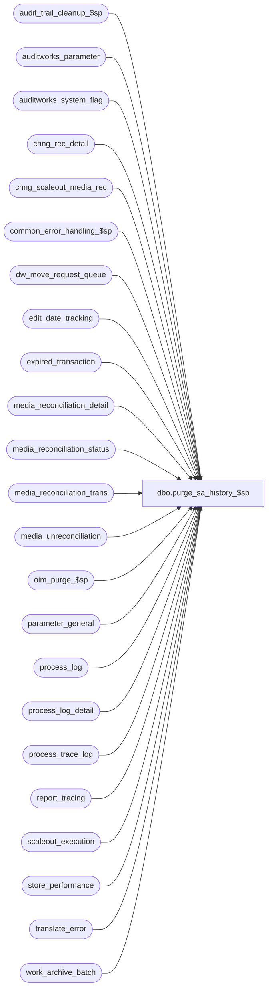

# dbo.purge_sa_history_$sp

**Database:** auditworks  
**Server:** bedrockdb01  

## Architecture Diagram



## Table Dependencies

| Referenced Table |
|---|
| audit_trail_cleanup_$sp |
| auditworks_parameter |
| auditworks_system_flag |
| chng_rec_detail |
| chng_scaleout_media_rec |
| common_error_handling_$sp |
| dw_move_request_queue |
| edit_date_tracking |
| expired_transaction |
| media_reconciliation_detail |
| media_reconciliation_status |
| media_reconciliation_trans |
| media_unreconciliation |
| oim_purge_$sp |
| parameter_general |
| process_log |
| process_log_detail |
| process_trace_log |
| report_tracing |
| scaleout_execution |
| store_performance |
| translate_error |
| work_archive_batch |

## Stored Procedure Code

```sql
CREATE proc  [dbo].[purge_sa_history_$sp] @multiplier	tinyint = 0
 
AS
 /* 
PROC NAME: purge_sa_history_$sp
     DESC: Purges ( deletes ) old entries from media reconciliation tracking tables.
	   Called from day_end_purge_$sp (dayend housekeeping) or from scheduled  
	    partition maintenance job (partition_purge_mr_$sp), if using partitioning (Oracle only currently).
	   This proc purges shared tables that are not populated solely by dayend. The
	   intent is to allow optionally calling this proc on a scheduled basis 
	   (independently of dayend housekeeping) in order to minimize the duration
	   of processing on dayend stream 1.

  NOTE:  This unicode version is suitable for both SA5.0 and SA5.1

HISTORY:
Date     Name         Def#  Desc
Sep13,17 Sean/TerriDAOM-2537Fix typo  
Dec02,16 Serguei  DAOM-1566 More fixing: include looping to limit amount cleaned up per run to 10 million.
Oct20,16 Kiri/Sab DAOM-1566 Clean up chng_rec_detail once done copying to consolidated (a new row is inserted into this table each time a Media Reconciliation posting occurs)
Aug31,15 Vicci  TFS-138534  Correct bad join from media_reconciliation_transaction to media_reconciliation_status (missing parenthese resulting in balancing entity id not being part of join for memo transactions).
                            Also provide variable with datatype match entry_date_time to avoid implicit conversion.
Nov20,14 Paul        93074  added purge of edit_date_tracking
Jan24,14 Paul       147019  author (moved logic from day_end_purge_$sp). Using TOP command for batching.

*/

DECLARE
  @archive_days_retained		smallint,
  @batch_no 			int,
  @current_date_time		datetime,
  @current_period			tinyint,
  @current_year			smallint,
  @employee_purchase_days		smallint,
  @errline			int,
  @errno				int,
  @errmsg			nvarchar(2000),
  @errmsg2			nvarchar(2000),
  @hist_days			smallint,
  @last_date_closed		smalldatetime,
  @max_batch_no	 		int,
  @max_calendar_date		smalldatetime,
  @max_exec_date			smalldatetime,
  @media_category_days		smallint,
  @media_reconciliation_days	smallint,
  @media_rec_transaction_days	smallint,
  @message_id			int,
  @object_name			nvarchar(255),
  @operation_name			nvarchar(100),
  @partitioning_mr_in_use		tinyint,
  @process_name			nvarchar(100),
  @period_end_date		smalldatetime,
  @polling_retention_days		tinyint,
  @process_log_days		smallint,
  @process_no 			smallint,
  @process_timestamp 		float,
  @purge_min_date			smalldatetime,
  @purge_min_tran_date		smalldatetime,
  @purge_min_tran_datetime	datetime,
  @purge_min_status_date		smalldatetime,
  @register_activity_days		smallint,
  @rows				integer,
  @row_count 	                   integer,
  @transaction_date		smalldatetime,
  @batch_count		         integer,
  @sos_cash_days			smallint,
  @sos_credit_days		smallint,
  @store_performance_days		smallint,
  @subledger_periods		smallint,
  @tax_days			smallint,
  @trace_msg			nvarchar(255),
  @transaction_count		int,
  @transactions_per_batch		int, --Could be altered in auditworks_parameter as per client requirement

	--DAOM-1566
	@last_rec_copy_date			smalldatetime,
	@batch_size 				int,
	@more_to_delete 			int,
	@max_loops 				int,  --Since cleanup may not have taken place in a long time, limit how much is done during a particular dayend	
	@loops_done 				int;

SELECT 	@process_no = 16,
	@process_timestamp = 0,
	@transaction_count = 0,
	@message_id = 201068,
	@process_name = 'purge_sa_history_$sp',
	@current_date_time = getdate(),
	@partitioning_mr_in_use = 0,
	@batch_size  = 100000,
	@more_to_delete = 1,
	@max_loops 	= 100,  
	@loops_done = 0;

BEGIN TRY
   SELECT @errmsg = 'Failed to select from auditworks_system_flag.',
 	  @object_name = 'auditworks_system_flag',
	  @operation_name = 'SELECT';

   	SELECT @last_rec_copy_date = flag_datetime_value
  	  FROM auditworks_system_flag
  	 WHERE flag_name = 'last_rec_copy_date';

	IF @last_rec_copy_date IS NOT NULL
	BEGIN
	  SELECT @errmsg = 'Failed to delete from chng_rec_detail.',
 			 @object_name = 'chng_rec_detail',
			 @operation_name = 'DELETE';

	  DELETE FROM chng_rec_detail   
	   WHERE entry_date < @last_rec_copy_date - 1;
    END
    
  IF @last_rec_copy_date IS NOT NULL
    WHILE @loops_done < @max_loops AND @more_to_delete = 1
      BEGIN
		SELECT @loops_done = @loops_done + 1;
      
		SELECT @errmsg = 'Failed to clean up previously executed requests for media rec changes to be copied from peripheral to consolidated',
 			 @object_name = 'chng_rec_detail',
			 @operation_name = 'DELETE';      
      
        DELETE TOP (@batch_size) FROM chng_rec_detail 
         WHERE entry_date < @last_rec_copy_date - 1
           
        SELECT @more_to_delete = SIGN(@@rowcount);
        
        COMMIT;     

      END;
--DAOM-1566  end    
 
   SELECT @errmsg = 'Failed to select from parameter_general.',
 	  @object_name = 'parameter_general',
	 @operation_name = 'SELECT';
SELECT 	@last_date_closed = last_date_closed,
	@period_end_date = period_end_date,
	@employee_purchase_days = employee_purchase_days,
	@media_category_days = media_category_statistics_days,
	@process_log_days = process_log_days,
	@register_activity_days = register_activity_days,
	@sos_cash_days = sos_cash_days,
	@sos_credit_days = sos_credit_days,
	@store_performance_days = store_performance_days,
	@subledger_periods = subledger_periods,
	@tax_days = tax_days,
	@polling_retention_days = polling_retention_days,
	@archive_days_retained = archive_days_retained,
	@hist_days = audit_trail_days
  FROM parameter_general;

SELECT @rows = @@rowcount;
IF @rows = 0
   GOTO business_error;

   SELECT @errmsg = 'Failed to select partitioning_media_rec_in_use from auditworks_system_flag.',
 	  @object_name = 'auditworks_system_flag';
SELECT @partitioning_mr_in_use = COALESCE(flag_numeric_value,0)
  FROM auditworks_system_flag
 WHERE flag_name = 'partitioning_media_rec_in_use';

IF @partitioning_mr_in_use IS NULL
  SELECT @partitioning_mr_in_use = 0;

   SELECT @errmsg = 'Failed to select @media_reconciliation_days.',
	  @object_name = 'auditworks_parameter',
	 @operation_name = 'SELECT';
SELECT @media_reconciliation_days = CONVERT(smallint,par_value)
  FROM auditworks_parameter
WHERE par_name = 'media_rec_days';

SELECT @rows = @@rowcount;
IF @rows = 0
  GOTO business_error;

-- If not set then defaults to null
SELECT @media_rec_transaction_days = CONVERT(smallint,par_value)
  FROM auditworks_parameter
 WHERE par_name = 'media_rec_transaction_days'

/* Determine which media_reconciliation_status dates need to be retained */
SELECT @purge_min_status_date = DATEADD(dd,-1 * @media_reconciliation_days,getdate());
    
IF @purge_min_status_date >= @last_date_closed -- THEN
    SELECT @purge_min_status_date = @last_date_closed;-- safety check to prevent deleting media rec for open periods

/* Determine which transaction dates need to be retained.
   If using media rec partitioning, then media_reconciliation_trans and media_reconciliation_status have already been
    purged at this point because partition_purge_mr_$sp has already been executed by partition_maint_if_susm_$sp. */

IF @media_reconciliation_days > (@multiplier * -1)
BEGIN
 SELECT @trace_msg = ':LOG => Purge: cleanup media_reconciliation_days: ' + CONVERT(nchar, getdate(), 8);
 PRINT @trace_msg;

 SELECT @purge_min_date = DATEADD(dd,@media_reconciliation_days * -1,getdate());
 IF @purge_min_date >= @last_date_closed
   SELECT @purge_min_date = @last_date_closed; -- safety check to prevent deleting media rec for open periods

   SELECT @errmsg = 'Failed to delete from media_reconciliation_detail.',
 	  @object_name = 'media_reconciliation_detail',
	  @operation_name = 'DELETE';
 DELETE FROM media_reconciliation_detail
  WHERE transaction_date < @purge_min_date
    AND (rec_side <= -1 OR rec_date IS NOT NULL); /* avoids deletion of carry-forwards for rarely used balancing_entity_id */

/* Delete media rec transactions that are in closed periods and that are older than the history days parameter.
     If partitionining is in use, then the trans rows will instead be removed by partition_purge_mr_$sp */

 SELECT @purge_min_tran_date = @purge_min_date;

 IF @media_rec_transaction_days < @media_reconciliation_days
   SELECT @purge_min_tran_date = DATEADD(dd,@media_rec_transaction_days * -1,getdate())
 
 IF @purge_min_tran_date >= @last_date_closed
   SELECT @purge_min_tran_date = @last_date_closed; -- safety check to prevent deleting media rec for open periods

 SELECT @purge_min_tran_datetime = DATEADD(dd,2,@purge_min_tran_date) -- set upper search limit for indexed column
 
 SELECT @trace_msg = ':LOG => Purge : media_reconciliation_trans: ' + CONVERT(nchar, getdate(), 8);
 PRINT @trace_msg;

          SELECT @errmsg = 'Failed to delete from media_reconciliation_trans.',
 	  @object_name = 'media_reconciliation_trans',
	  @operation_name = 'DELETE';

  WHILE 2 = 2 AND @partitioning_mr_in_use = 0
   BEGIN
    DELETE TOP (80000) media_reconciliation_trans
     FROM media_reconciliation_trans mrt
     WHERE mrt.transaction_date < @purge_min_tran_date
       AND mrt.entry_date_time < @purge_min_tran_datetime  -- set upper search limit for indexed column
       AND (mrt.rec_side <= -1 -- will never be reconciled
            OR EXISTS
            (SELECT 1 FROM media_reconciliation_status mrs
              WHERE mrs.balancing_entity_id = mrt.balancing_entity_id
                AND (   (mrs.last_reconciliation_date_time > mrt.entry_date_time AND mrs.last_reconciliation_date_time IS NOT NULL)
                     OR (    mrt.rec_amount_subtype = 6  --memo amount such as Z-read or closeout
                         AND mrs.rec_group_line_object <> -2  --i.e. not a closeout which are handled in next deletion below since they cover multiple tenders
                         AND (   mrs.first_unreconciled_date_time IS NULL
                              OR mrs.first_unreconciled_date_time > mrt.entry_date_time))  --i.e. the transaction to be purged did not contribute to the expected amount.
                    )
            ));
   SELECT @row_count = @@rowcount;

   IF @row_count < 80000
      BREAK;

  END; -- While 2=2


  IF @partitioning_mr_in_use = 0 -- THEN
    BEGIN
    SELECT @trace_msg = ':LOG => Purge : media_reconciliation_trans2: ' + CONVERT(nchar, getdate(), 8);
     PRINT @trace_msg;
    END;

  /* The delete above will find most of the old media rec transactions that need to be deleted.
    However, also need to search for a few transactions that could remain due to unusual scenarios. */

-- Oracle has another delete here 5=5

/*
    Since closeout transactions service the reconciliation of all line-objects 
    for a given balancing_entity/method/rec_type but are not reconciled themselves,
    retain only those which are required to support unreconciled amounts for corresponding tenders */

  IF @partitioning_mr_in_use = 0 -- THEN
    BEGIN
     SELECT @trace_msg = ':LOG => Purge : media_reconciliation_trans3: ' + CONVERT(nchar, getdate(), 8);
     PRINT @trace_msg;

    SELECT @errmsg = 'Failed to delete closeouts from media_reconciliation_trans',
 	  @object_name = 'media_reconciliation_trans',
	  @operation_name = 'DELETE';
    DELETE media_reconciliation_trans
      FROM media_reconciliation_trans mrt
     WHERE mrt.transaction_date < @purge_min_tran_date
       AND mrt.entry_date_time < @purge_min_tran_datetime -- set upper search limit for indexed column
       AND EXISTS 
     (SELECT dtl.balancing_entity_id
      FROM (SELECT mrs.balancing_entity_id, MIN(mrsd.first_unreconciled_date_time) first_unreconciled_date_time
              FROM media_reconciliation_status mrs
                   LEFT OUTER JOIN media_reconciliation_status mrsd
                     ON mrs.rec_type = mrsd.rec_type
                                    AND mrs.balancing_method = mrsd.balancing_method
                                    AND mrs.balancing_entity = mrsd.balancing_entity
                                    AND mrsd.rec_group_line_object <> -2 
                                    AND mrsd.first_unreconciled_date_time IS NOT NULL  --i.e. it is a line-object which is reconciled and which has activity that is not yet reconciled
             WHERE mrs.rec_group_line_object = -2  --i.e. it is a closeout 
             GROUP BY mrs.balancing_entity_id) dtl  
     WHERE mrt.balancing_entity_id = dtl.balancing_entity_id
       AND (mrt.entry_date_time < dtl.first_unreconciled_date_time 
            OR dtl.first_unreconciled_date_time IS NULL) );

   /* the following logic also exists inside partition_purge_mr_$sp

      purge scaleout queue table for balancing entity IDs about to be deleted from media_reconciliation_status. */

       SELECT @errmsg = 'Failed to delete from chng_scaleout_media_rec.',
 	  @object_name = 'chng_scaleout_media_rec',
	  @operation_name = 'DELETE';
   DELETE FROM chng_scaleout_media_rec
    WHERE balancing_entity_id IN (SELECT DISTINCT balancing_entity_id
                                     FROM media_reconciliation_status
     				    WHERE last_activity_date_time < @purge_min_status_date
				      AND current_balance_amount = 0);

         SELECT @errmsg = 'Failed to delete from media_reconciliation_status.',
 	  @object_name = 'media_reconciliation_status',
	  @operation_name = 'DELETE';
    DELETE FROM media_reconciliation_status
     WHERE last_activity_date_time < @purge_min_status_date
       AND current_balance_amount = 0;


    /* 142106 start.  Note:  coded this way instead of being done prior to media_reconciliation_status deletion (which would have been more logical) in order
                          to address integrities left behind by the absence of this fix.  Should be reasonable, since media_unreconciliation is small. */
        SELECT @errmsg = 'Failed to delete unreconciled orphans resulting from media_reconciliation_status cleanup from media_reconciliation_trans.',
 	  @object_name = 'media_reconciliation_trans',
	  @operation_name = 'DELETE';
    DELETE FROM media_reconciliation_trans
     WHERE balancing_entity_id IN (SELECT u.balancing_entity_id
        FROM media_unreconciliation u
                                 WHERE u.transaction_date < @purge_min_status_date	--used to limit search to likely orphan candidates
                                   AND u.balancing_entity_id NOT IN (SELECT s.balancing_entity_id --i.e. orphaned
                                                                       FROM media_reconciliation_status s
                                                                      WHERE u.balancing_entity_id = s.balancing_entity_id)); 

       SELECT @errmsg = 'Failed to delete unreconciled orphans resulting from media_reconciliation_status cleanup from media_reconciliation_detail.',
 	  @object_name = 'media_reconciliation_detail',
	  @operation_name = 'DELETE';
    DELETE FROM media_reconciliation_detail
     WHERE balancing_entity_id IN (SELECT u.balancing_entity_id
                                  FROM media_unreconciliation u
                                 WHERE u.transaction_date < @purge_min_status_date	--used to limit search to likely orphan candidates
                                   AND u.balancing_entity_id NOT IN (SELECT s.balancing_entity_id --i.e. orphaned
                                                                       FROM media_reconciliation_status s
                                                                      WHERE u.balancing_entity_id = s.balancing_entity_id)); 

          SELECT @errmsg = 'Failed to delete media_unreconciliation orphans resulting from media_reconciliation_status cleanup.',
 	  @object_name = 'media_unreconciliation',
	  @operation_name = 'DELETE';
    DELETE FROM media_unreconciliation
     WHERE transaction_date < @purge_min_status_date	--used to limit search to likely orphan candidates
       AND balancing_entity_id NOT IN (SELECT s.balancing_entity_id	--i.e. orphaned
                                      FROM media_reconciliation_status s
                                     WHERE media_unreconciliation.balancing_entity_id = s.balancing_entity_id);
     --142106 end.

    END; -- If @partitioning_mr_in_use = 0 
END; -- If @media_reconciliation_days > (@multiplier * -1)


IF @process_log_days > (@multiplier * -1)
BEGIN

 SELECT @trace_msg = ':LOG => Purge: cleanup process_log_days: ' + CONVERT(nchar, getdate(), 8);
 PRINT @trace_msg;

       SELECT @errmsg = 'Failed to delete from process_log.',
	@object_name = 'process_log',
          @operation_name = 'DELETE';
 DELETE FROM process_log
  WHERE process_start_time < @last_date_closed
    AND process_start_time < DATEADD(dd,@process_log_days * -1,getdate());

      SELECT @errmsg = 'Failed to delete on process_log_detail.',
	@object_name = 'process_log_detail';
 DELETE FROM process_log_detail
  WHERE log_entry_datetime < @last_date_closed
    AND log_entry_datetime < DATEADD(dd,@process_log_days * -1,getdate());

  /* remove scaleout move log rows that are more than @process_log_days days old. */

      SELECT @errmsg = 'Failed to delete on dw_move_request_queue.',
	@object_name = 'dw_move_request_queue';
 DELETE FROM dw_move_request_queue
  WHERE move_ended < DATEADD(dd,@process_log_days * -1,getdate())
    AND move_status IN (30, 70);
  


END; -- If @process_log_days > (@multiplier * -1)


IF @store_performance_days > (@multiplier * -1)
BEGIN

 SELECT @trace_msg = ':LOG => Purge: cleanup store_performance_days (batches 5000): ' + CONVERT(nchar, getdate(), 8);
 PRINT @trace_msg;

      SELECT @errmsg = 'Failed to delete on store_performance.',
	@object_name = 'store_performance',
	@operation_name = 'DELETE';

  WHILE 1 = 1 
  BEGIN
    DELETE TOP (80000) store_performance
     WHERE transaction_date < DATEADD(dd,@store_performance_days * -1,getdate());
 
    SELECT @rows = @@rowcount;
 
    IF @rows < 80000
      BREAK;
      
  END;
END; -- If @store_performance_days > (@multiplier * -1)


IF @polling_retention_days > (@multiplier * -1)
BEGIN

  SELECT @trace_msg = ':LOG => Purge: cleanup translate_error (polling_retention_days): ' + CONVERT(nchar, getdate(), 8);
  PRINT @trace_msg;

  /* When tran date was not set, then purge using posting_start_date_time (was set to system datetime during insert) */
	      SELECT @errmsg = 'Failed to delete translate_error',
		@object_name = 'translate_error',
		@operation_name = 'DELETE';
  SELECT @transaction_date = DATEADD(dd,@polling_retention_days * -1,getdate());

  WHILE 1 = 1 
  BEGIN
	  DELETE TOP (80000) translate_error
	   WHERE verified = 1
	     AND (transaction_date < @transaction_date OR posting_start_date_time < @transaction_date);

	  SELECT @rows = @@rowcount;

	  IF @rows < 80000
	    BREAK;
  END;
END; -- If @polling_retention_days > (@multiplier * -1)


SELECT @trace_msg = ':LOG => Purge: cleanup audit_trail: ' + CONVERT(nchar, getdate(), 8);
PRINT @trace_msg;

       SELECT @errmsg = 'Failed to delete on audit_trail_header',
	  @object_name = 'audit_trail_cleanup_$sp',
	  @operation_name = 'EXECUTE';
EXEC audit_trail_cleanup_$sp @hist_days;


SELECT @trace_msg = ':LOG => Purge: cleanup Offline Stock details: ' + CONVERT(nchar, getdate(), 8);
PRINT @trace_msg;

      SELECT @errmsg = 'Failed to execute proc oim_purge_$sp.',
	  @object_name = 'oim_purge_$sp',
	  @operation_name = 'EXECUTE';
EXEC oim_purge_$sp;


/* Purge scaleout status table used by interface posting. Will retain the latest 10 days of entries for support purposes.
   Table will only be populated on the consolidated server in a scaleout environment. */

      SELECT @errmsg = 'Unable to delete from scaleout_execution',
	     @object_name = 'scaleout_execution',
	     @operation_name = 'DELETE';
SELECT @max_exec_date = MAX(posting_date)
  FROM scaleout_execution;

DELETE FROM scaleout_execution
 WHERE posting_date <= DATEADD(dd, -10, @max_exec_date);

IF 7 > (@multiplier * -1) -- THEN
  BEGIN
    /* remove report trace entries that are more than one week old */
    SELECT @transaction_date = DATEADD(dd, -7, getdate());

      SELECT @errmsg = 'Unable to delete from report_tracing',
	     @object_name = 'report_tracing',
	     @operation_name = 'DELETE';
    DELETE FROM report_tracing
     WHERE trace_timestamp < @transaction_date; 

  END; -- If 7 > (@multiplier * -1)


IF 7 > (@multiplier * -1) -- THEN
  BEGIN
    /* remove trace entries that are more than one week old */
    SELECT @transaction_date = DATEADD(dd, -7, getdate());

      SELECT @errmsg = 'Unable to delete from process_trace_log',
	     @object_name = 'process_trace_log',
	     @operation_name = 'DELETE';
    DELETE FROM process_trace_log
     WHERE process_start_time < @transaction_date; 


  END; -- If 7 > (@multiplier * -1)


  /* remove date tracking rows that are more than 90 days old in order to keep the table small for edit missing reg performance */
  SELECT @transaction_date = DATEADD(dd, -90, getdate());

    SELECT @errmsg = 'Unable to delete from process_trace_log',
	     @object_name = 'process_trace_log',
	     @operation_name = 'DELETE';
  DELETE FROM edit_date_tracking
   WHERE sales_date < @transaction_date; 


-- Only reset the identity value if concurrent dayend is active.
IF EXISTS (SELECT 1 FROM work_archive_batch) -- this table is only populated if concurrent dayend is active
AND NOT EXISTS (SELECT 1 FROM expired_transaction) -- no outstanding transactions
BEGIN
    SELECT @errmsg = 'Failed to reset the seed of the identity column batch_no',
           @object_name = 'work_archive_batch',
           @operation_name = 'TRUNCATE';
  TRUNCATE TABLE work_archive_batch;

END;


RETURN;


business_error:   /* Business Rule handler. */

	SELECT @errmsg2 = @errmsg;

	/* Could include similar cleanup code to system error trap when needed (example is from move_store_$sp).
	   However, could also exclude the cleanup code here since the outer system error catch should fire again after the exec below. */

	EXEC common_error_handling_$sp @process_no, @errno, @errmsg, 0, @message_id, 
	  @process_name, @object_name, @operation_name, 1;
	  /* Note: when the exec above raises an error, that action also fires the system error trap (below) */
	RETURN;
END TRY

BEGIN CATCH; -- trap system errors
    /* common error handling. Appending proc name here because a rollback could occur if called within a transaction. */

        SELECT @errno = ERROR_NUMBER(),
		@errline = ERROR_LINE();

        SELECT @errmsg = CONVERT(nvarchar, @errno) + ':' + @process_name + ':' + CONVERT(nvarchar, @errline) + ':'
               + COALESCE(@errmsg, ' ') + ':' + ERROR_MESSAGE();

	 /* this condition will only be true when raise error in traps above fire this general catch */
	IF @errmsg2 IS NOT NULL
	  SELECT @errmsg = @errmsg2;

          /* put cleanup code here that is specific to the proc, e.g. closing cursors. i.e. copy from existing <error> trap */
	  
	EXEC common_error_handling_$sp @process_no, @errno, @errmsg, 0, @message_id, 
	  @process_name, @object_name, @operation_name, 1;

	RETURN;
END CATCH;
```

