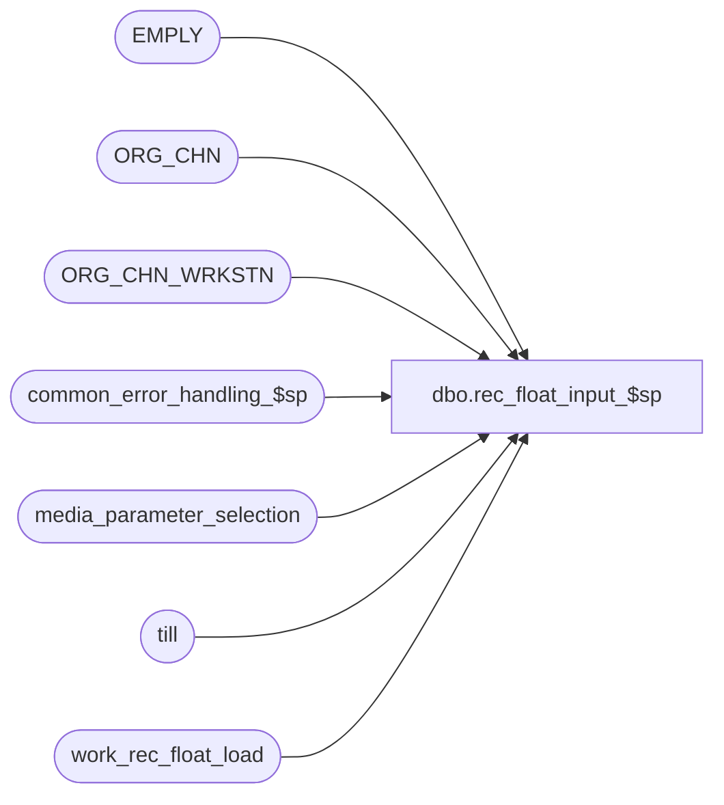

# dbo.rec_float_input_$sp

**Database:** auditworks  
**Server:** bedrockdb01  

## Architecture Diagram



## Table Dependencies

| Referenced Table |
|---|
| EMPLY |
| ORG_CHN |
| ORG_CHN_WRKSTN |
| common_error_handling_$sp |
| media_parameter_selection |
| till |
| work_rec_float_load |

## Stored Procedure Code

```sql
create proc dbo.rec_float_input_$sp @process_id             binary(16),
@user_id                int,
@from_store_no		integer,
@to_store_no		integer,
@media_parameter_set_no	smallint,
@initial_float		money,
@from_register_no	smallint,
@to_register_no		smallint,
@from_cashier_no	integer,
@to_cashier_no		integer,
@from_till_no		smallint,
@to_till_no		smallint,
@from_bank_no		integer,
@to_bank_no		integer,
@errmsg			nvarchar(255) OUTPUT,
@effective_date		datetime = NULL
 
AS

/* 
PROC NAME: rec_float_input_$sp
     DESC: load initial float values

HISTORY:
Date     Name             Def# Desc
Jan05,11 Paul           105313 Use unicode datatypes
Jul31,08 Paul            87777 updated comments, code reviewed
Nov13,06 Paul          DV-1335 added comments
Nov18,04 Maryam        DV-1167 Check active flag for EMPLY (supercedes 66476).
Sep20,04 Maryam        DV-1146 Use user_id.
Aug05,04 Sab	       DV-1071 Changes required for bank tables.
Jun04,04 David         DV-1071 Use ORG_CHN table as the new Store table.
May31,04 Brett         DV-1071 Replace employee table with EMPLY table.
May29,04 Maryam        DV-1071 Use ORG_CHN_WRKSTN instead of register table, no longer outputs the process_id as now it is passed.
Jan24,06 Vicci	         66476 Treat inactive employees as invalid.
Jan27,04 Winnie          22620 correct temp table to allow nulls.
Dec29,03 Winnie, Paul  DV-1007 Leave the factor as null and insert null instead of 0 into 
                                work_rec_float_load, remove select into.
Nov11,03 Winnie        DV-1010 Set the input variables to null if both from/to = 0
Jun04,03 Winnie           9250 Media Reconciliation enhancements.	

*/

DECLARE
  @bank_factor			tinyint,
  @cashier_factor		tinyint,
  @errno			int,
  @message_id			int,
  @object_name			nvarchar(255),
  @operation_name		nvarchar(100),
  @process_name			nvarchar(100),
  @process_no			integer,
  @rows				integer,
  @register_factor		tinyint,
  @store_factor			tinyint,
  @till_factor			tinyint


SELECT @process_name     = 'rec_float_input_$sp',
       @message_id       = 201068,
       @process_no 	 = 73


IF @from_store_no = 0  AND @to_store_no = 0
  SELECT @from_store_no = NULL, 
         @to_store_no = NULL
         
IF @from_register_no = 0 AND @to_register_no = 0
  SELECT @from_register_no = NULL,
         @to_register_no = NULL

IF @from_cashier_no = 0 AND @to_cashier_no = 0
  SELECT @from_cashier_no = NULL,
         @to_cashier_no = NULL

IF @from_till_no = 0 AND @to_till_no = 0
  SELECT @from_till_no = NULL,
         @to_till_no = NULL

IF @from_bank_no = 0 AND @to_bank_no = 0
  SELECT @from_bank_no = NULL,
         @to_bank_no = NULL                    

IF @effective_date IS NULL
  SELECT @effective_date = getdate()

SELECT @store_factor = SIGN(@from_store_no),
       @register_factor = SIGN(@from_register_no),     
       @cashier_factor = SIGN(@from_cashier_no),     
       @till_factor = SIGN(@from_till_no),  
       @bank_factor = SIGN(@from_bank_no)

DELETE FROM work_rec_float_load
 WHERE process_id = @process_id

SELECT @errno = @@error
IF @errno != 0
  BEGIN
    SELECT @errmsg = 'Failed to delete from work_rec_float_load.',
           @object_name = 'work_rec_float_load',
           @operation_name = 'DELETE'
    GOTO error
  END 

CREATE TABLE #rec_selection (
	store_no     int      null,
	register_no  smallint null,
	bank_no      smallint null)

SELECT @errno = @@error
IF @errno != 0
  BEGIN
    SELECT @errmsg = 'Failed to create table #rec_selection.',
           @object_name = '#rec_selection',
           @operation_name = 'CREATE'
    GOTO error
  END

IF @cashier_factor IS NULL AND @till_factor IS NULL
  BEGIN
    INSERT INTO work_rec_float_load
                (process_id,
                 store_no,
  register_no,
                 bank_no,
                 till_no,
                 cashier_no,
                 initial_float_amount)
    SELECT DISTINCT 
  @process_id,
                 s.ORG_CHN_NUM * SIGN(ISNULL(@store_factor,0) + ISNULL(@bank_factor,0)), --since there is no way to override the bank directly in stock control detail, it must be done via the store
                 r.WRKSTN_NUM * @register_factor,
                 s.PRMRY_BANK_ACNT_ID * @bank_factor,
                 NULL,
                 NULL,
                 @initial_float
            FROM ORG_CHN s, ORG_CHN_WRKSTN r, media_parameter_selection p
           WHERE s.ORG_CHN_NUM >= @from_store_no
             AND s.ORG_CHN_NUM <= @to_store_no
             AND s.ORG_CHN_NUM = r.ORG_CHN_NUM
             AND r.WRKSTN_NUM >= ISNULL(@from_register_no, r.WRKSTN_NUM)
             AND r.WRKSTN_NUM <= ISNULL(@to_register_no, r.WRKSTN_NUM)
             AND r.ORG_CHN_NUM = p.store_no
             AND r.WRKSTN_NUM = p.register_no
             AND p.effective_from_date <= @effective_date
             AND (p.effective_until_date > @effective_date
                  OR p.effective_until_date IS NULL)
             AND p.media_parameter_set_no = @media_parameter_set_no     

    SELECT @errno = @@error
    IF @errno != 0
     BEGIN
       SELECT @errmsg = 'Failed to insert work_rec_float_load.',
              @object_name = 'work_rec_float_load',
              @operation_name = 'INSERT'
       GOTO error
     END
  END                             
ELSE
  BEGIN
    INSERT #rec_selection (
	store_no,
	register_no,
	bank_no)
    SELECT DISTINCT s.ORG_CHN_NUM * @store_factor,
                    r.WRKSTN_NUM * @register_factor,
                    s.PRMRY_BANK_ACNT_ID * @bank_factor
               FROM ORG_CHN s, ORG_CHN_WRKSTN r, media_parameter_selection p
              WHERE s.ORG_CHN_NUM >= @from_store_no
                AND s.ORG_CHN_NUM <= @to_store_no
                AND s.ORG_CHN_NUM = r.ORG_CHN_NUM
                AND r.WRKSTN_NUM >= ISNULL(@from_register_no, r.WRKSTN_NUM)
                AND r.WRKSTN_NUM <= ISNULL(@to_register_no, r.WRKSTN_NUM)
                AND r.ORG_CHN_NUM = p.store_no
                AND r.WRKSTN_NUM = p.register_no
                AND p.effective_from_date <= @effective_date
                AND (p.effective_until_date > @effective_date
                     OR p.effective_until_date IS NULL)
                AND p.media_parameter_set_no = @media_parameter_set_no  

    SELECT @errno = @@error
    IF @errno != 0
     BEGIN
       SELECT @errmsg = 'Failed to create #rec_selection',
              @object_name = '#rec_selection',
              @operation_name = 'INSERT'
       GOTO error
     END
  END

IF @cashier_factor = 1 AND @till_factor IS NULL
  BEGIN
    INSERT INTO work_rec_float_load
                (process_id,
                 store_no,
                 register_no,
                 bank_no,
                 till_no,
                 cashier_no,
                 initial_float_amount)
          SELECT @process_id,
                 s.store_no,
                 s.register_no,
                 s.bank_no,
                 NULL,
                 e.EMPLY_NUM,
                 @initial_float
            FROM EMPLY e, #rec_selection s
           WHERE (s.store_no = e.PRMY_ORG_CHN_NUM) -- e.PRMY_ORG_CHN_NUM cannot be null
             AND e.EMPLY_NUM >= @from_cashier_no
             AND e.EMPLY_NUM <= @to_cashier_no
             AND e.ACTV = 1
    SELECT @errno = @@error
    IF @errno != 0
     BEGIN
       SELECT @errmsg = 'Failed to insert work_rec_float_load',
              @object_name = 'work_rec_float_load',
              @operation_name = 'INSERT'
       GOTO error
     END
  END
ELSE
  BEGIN
    IF @cashier_factor IS NULL AND @till_factor = 1
      BEGIN
        INSERT INTO work_rec_float_load
                   (process_id,
                    store_no,
                    register_no,
                    bank_no,
                    till_no,
                    cashier_no,
 initial_float_amount)
             SELECT @process_id,
                    s.store_no,
                    s.register_no,
                    s.bank_no,
                    t.till_no,
		    NULL,
                    @initial_float
            FROM #rec_selection s, till t
           WHERE s.store_no = t.store_no 
             AND t.till_no >= @from_till_no
             AND t.till_no <= @to_till_no

        SELECT @errno = @@error
        IF @errno != 0
         BEGIN
           SELECT @errmsg = 'Failed to insert work_rec_float_load',
                  @object_name = 'work_rec_float_load',
                  @operation_name = 'INSERT'
           GOTO error
         END
      END       
  END

DROP TABLE #rec_selection
SELECT @errno = @@error
IF @errno <> 0
  BEGIN
	SELECT @errmsg = 'Unable to drop table #rec_selection',
	       @object_name = '#rec_selection',
	       @operation_name = 'DROP'
	GOTO error
  END

RETURN

error:

	EXEC common_error_handling_$sp @process_no, @errno, @errmsg, 0, @message_id, 
	@process_name, @object_name, @operation_name, 0, 1, 0, null, 0, null, null, null,
	  null, null, null, 0, @process_id, @user_id
	RETURN
```

