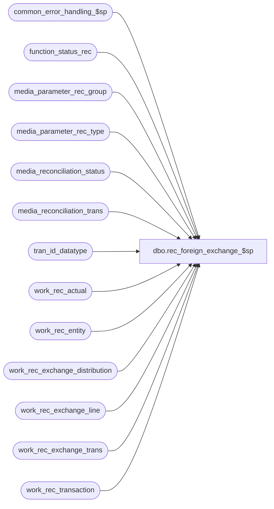

# dbo.rec_foreign_exchange_$sp

**Database:** auditworks  
**Server:** bedrockdb01  

## Architecture Diagram



## Table Dependencies

| Referenced Table |
|---|
| common_error_handling_$sp |
| function_status_rec |
| media_parameter_rec_group |
| media_parameter_rec_type |
| media_reconciliation_status |
| media_reconciliation_trans |
| tran_id_datatype |
| work_rec_actual |
| work_rec_entity |
| work_rec_exchange_distribution |
| work_rec_exchange_line |
| work_rec_exchange_trans |
| work_rec_transaction |

## Stored Procedure Code

```sql
create proc dbo.rec_foreign_exchange_$sp @process_id         binary(16),
@user_id            int,
@process_no         smallint,
@rec_process_id     numeric(12,0),
@try_again          int OUTPUT,
@errmsg             nvarchar(2000) OUTPUT,
@edit_process_no    tinyint,
@rec_status	    tinyint


AS

/* 
PROC NAME: rec_foreign_exchange_$sp
     DESC: To calculate foreign exchange on foreign currency transactions where it is missing 
           (eg: pesos picked up 1000) or on actuals for rec types where convert_to_domestic is
           false.(ie.actuals expressed in foreign currency pesos count 1000)
           NOTE: a count of one rec type expressed in foreign currency may become the expected of
                 another rec type whoes actual will be expressed in domestic currency and whose
                 convert_to_domestic will therefore be true.
          Called by reconciliation_$sp

   Same version can be used for 5.0 and 5.1

 HISTORY: 
Date      Name       Def#    Desc
Nov27,14  Paul   TFS-94103   Use try .. catch to capture errors, removed index hints since edit streams can't use them
Feb28,14  Vicci     148123   To avoid Cannot insert duplicate key row in object 'dbo.media_reconciliation_trans' with unique index 'media_reconciliation_trans_x0' error,
                             wrel must have 1 entry per line so don't group by date_reconciled (multiple_actual_handling_code 4);  also, date_reconciled should
                             only be set for actuals and their carryforwards, not for expecteds when a line simply updates multiple rec-types differently (i.e. count feeding actual activity and expected deposit, for example).
Dec16,13  Vicci     148123   Handle wre lower/upper being just date_reconciled (no time) from new multiple_actual_handling_code 4 (single date reconciliation, count for that single date added regardless of business date).
Sep21,11  Phu       1-46K8UH Fix divided by zero error.
Jun06,11  Vicci     127613   Process foreign exchange in correct sequence to avoid loss of calculated foreign exchange
                             amount when work_rec_actual unreconciled entries are present (actual_flag = 2) since these
                             have a null transaction_date (use lower_date_time instead).
Dec03,10  Vicci     123192   Avoid penny rounding differences.
Oct06,10  Paul      121512   avoid error 2601 by populating till_no into media_reconciliation_trans
Jan29,08  Vicci      97639   uplift 97569 to SA5 (add till_no when populating work_rec_exchange_line and work_rec_transaction)

Jan29,08  Vicci      97569   Add till_no when populating work_rec_exchange_line and work_rec_transaction
Oct18,06  Tim        77870   add column transaction_no to media_reconciliation_trans, work_rec_transaction,
                             work_rec_exchange_line and populate it.
May09,05  Paul       DV-1234 expand transaction_id, rec_id to use tran_id_datatype
Mar03,05  Paul       DV-1216 apply 44596 to Sa5
Sep20,04  Maryam     DV-1146 Change user_name to user_id.
Apr27,04  Maryam     DV-1071 Receive @process_id and @user_name and pass it to common_error_handling_$sp
Mar03,05  Paul         44596 populate reference_type in media_reconciliation_trans
Dec29,03  Paul       DV-1007 shorten begin tran, use fast_forward on cursors, added nolock hints,
                             create new status(24), Moved the delete of work tables to reconciliation_$sp
                             (Maryam) get the rec_amount, exchange_amount, exchange_calculated amounts
                             when inserting into work_rec_exchange_distribution and change the code accordingly.
Jul17,03  Paul         11627 improved performance by adding index hints
Jul10,03  Maryam     1-KL08H Author
*/

DECLARE
  @actual_flag			tinyint,
  @balancing_entity_id          numeric(10,0),
  @convert_to_domestic		tinyint,
  @calculated_exchange_amount   money,
  @cursor_open 			tinyint,
  @errmsg2			nvarchar(2000),
  @errline			int,
  @exchange_rate		float, --numeric(6,4) was causing penny rounding errors
  @expected_amount 		money,
  @expected_exchange_amount     money,
  @expected_amount_calc         money,
  @errno                        int,
  @lower_date_time		datetime,
  @message_id			int,
  @object_name			nvarchar(255),
  @operation_name		nvarchar(100),
  @pass_balancing_entity_id	numeric(10,0),
  @pass_transaction_id          tran_id_datatype,
  @process_name			nvarchar(100),
  @rows				int,
  @rec_id			tran_id_datatype,
  @upper_date_time		datetime,
  @float_type			float,
  @multiple_actual_handling_code smallint;
  
  
  SELECT @process_name = 'rec_foreign_exchange_$sp',
         @message_id   = 201068,
         @cursor_open = 0,
         @float_type = 1,
         @rows = 0;

BEGIN TRY

IF @rec_status = 20
  BEGIN
     SELECT @errmsg = 'Failed to delete work_rec_exchange_line.',
	   @object_name = 'work_rec_exchange_line',
	   @operation_name = 'DELETE';
   DELETE work_rec_exchange_line
    WHERE rec_process_id = @rec_process_id;
  
   /* Since the system must calculate Foreign Exchange on any Actual where convert to domestic is 
      false and on any expected where it is missing, with one exception:
      The Expected with carry forwards of a rec entered in domestic or rec pickups of a domestic
      Determine which transaction lines are foreign currency within the scope of the 
      entities/date-ranges currently being evaluated and require foreign exchange to be 
      calculated by the system either on the Actual (eg. PC Reg where convert to domestic = false i.e.
      count entered in foreign currency or on a transaction contributing to expected but where the
      foreign exchange is not specified(eg regular pickup transactions that just specify the foreign amount regardless of 
      convert to domestic setting which applies only to Actual.  */

     SELECT @errmsg = 'Failed to insert work_rec_exchange_line.',
	   @object_name = 'work_rec_exchange_line',
	   @operation_name = 'INSERT';
   INSERT work_rec_exchange_line(
         rec_process_id,
         transaction_id,
         transaction_no,
         line_id,
         void_flag,
         entry_date_time,
         transaction_category,
         line_object,
         reference_no,
         store_no,
         register_no,
         cashier_no,
         transaction_date,
         tender_total,
         reference_type,
         carryforward_flag,
         min_rec_type,
         till_no)
   SELECT @rec_process_id,
         mrt.transaction_id,
         mrt.transaction_no,
         mrt.line_id,
         mrt.void_flag,
         mrt.entry_date_time,
         mrt.transaction_category,
         mrt.line_object,
         mrt.reference_no,
         mrt.store_no,
         mrt.register_no,
         mrt.cashier_no,
         mrt.transaction_date,
         mrt.tender_total,
         mrt.reference_type,
         1- SIGN(ABS(MIN(mrt.rec_amount_subtype))),
         MIN(wre.rec_type),
         MAX(COALESCE(mrt.till_no,1))
     FROM work_rec_entity wre WITH (NOLOCK), media_reconciliation_trans mrt WITH (NOLOCK)
    WHERE wre.rec_process_id = @rec_process_id
      AND wre.multiple_actual_handling_code <> 4  --148123
      AND wre.foreign_currency_id IS NOT NULL --
      AND wre.balancing_entity_id = mrt.balancing_entity_id
      AND wre.lower_date_time <= mrt.entry_date_time	
      AND wre.upper_date_time >= mrt.entry_date_time
      AND ABS(mrt.void_flag) = 1
      AND mrt.rec_amount <> 0
      AND mrt.rec_amount_type IN (1, 3, 5)
      AND mrt.rec_amount_subtype <> 6
      AND (wre.lower_date_time <> mrt.entry_date_time OR mrt.rec_side <> 1)
      AND ((mrt.rec_side <> 1 AND mrt.rec_amount_subtype <> 0 AND mrt.line_action <> 234) 
           OR wre.convert_to_domestic = 0)
    GROUP BY mrt.transaction_id,
         mrt.transaction_no,
         mrt.line_id,         
	 mrt.void_flag,
         mrt.entry_date_time,
         mrt.transaction_category,
         mrt.line_object,
         mrt.reference_no,
         mrt.store_no,
         mrt.register_no,
         mrt.cashier_no,
         mrt.transaction_date,
         mrt.tender_total,
         mrt.reference_type;
   SELECT @rows = @@rowcount;

     SELECT @errmsg = 'Failed to insert work_rec_exchange_line for multiple_actual_handling_code = 4.',
	   @object_name = 'work_rec_exchange_line',
	   @operation_name = 'INSERT'; 
   INSERT work_rec_exchange_line(
         rec_process_id,
         transaction_id,
         transaction_no,
         line_id,
         void_flag,
         entry_date_time,
         transaction_category,
         line_object,
         reference_no,
         store_no,
         register_no,
         cashier_no,
         transaction_date,
         tender_total,
         reference_type,
         carryforward_flag,
         min_rec_type,
         till_no,
         date_reconciled) ----148123
   SELECT @rec_process_id,
         mrt.transaction_id,
         mrt.transaction_no,
         mrt.line_id,
         mrt.void_flag,
         mrt.entry_date_time,
         mrt.transaction_category,
         mrt.line_object,
         mrt.reference_no,
         mrt.store_no,
         mrt.register_no,
         mrt.cashier_no,
         mrt.transaction_date,
         mrt.tender_total,
         mrt.reference_type,
         1- SIGN(ABS(MIN(mrt.rec_amount_subtype))),
         MIN(wre.rec_type),
         MAX(COALESCE(mrt.till_no,1)),
         MAX(mrt.date_reconciled)  ----148123
     FROM work_rec_entity wre WITH (NOLOCK), media_reconciliation_trans mrt WITH (NOLOCK)
    WHERE wre.rec_process_id = @rec_process_id
      AND wre.multiple_actual_handling_code = 4  --148123
      AND wre.foreign_currency_id IS NOT NULL --
      AND wre.balancing_entity_id = mrt.balancing_entity_id
      AND mrt.entry_date_time >= dateadd(dd, -1, wre.lower_date_time) --148123 Note:  lower/upper is date-reconciled (no time) for multiple_actual_handling_code = 4;  entry_date_time is that of rec overridden by that of period or period-entity-reconciled attachments
      AND mrt.entry_date_time < dateadd(dd, 2, wre.upper_date_time)  --148123 Although entry_date_time is irrelevant for this option, keep using it to give a reasonable range since there is no index on date_reconciled.  Note that if count were entered say 5 days later it would have had to use a period-reconciled attachment which would have made its mrt.entry_date_time the date reconciled.
      AND COALESCE(mrt.date_reconciled, mrt.transaction_date) >= wre.lower_date_time  --148123 Note:  Coalescing because date_reconciled might not be set for dates prior to upgrade.
      AND COALESCE(mrt.date_reconciled, mrt.transaction_date) <= wre.upper_date_time  --148123 Note:  Cross-business-date-rec-trans summation only supported as of upgrade (via period reconciled attachment) but even before, rec on next date could cover several prior business dates' expected which is no longer supported.
      AND ABS(mrt.void_flag) = 1
      AND mrt.rec_amount <> 0
      AND mrt.rec_amount_type IN (1, 3, 5)
      AND mrt.rec_amount_subtype <> 6
      AND (wre.lower_date_time <> mrt.entry_date_time OR mrt.rec_side <> 1)
      AND ((mrt.rec_side <> 1 AND mrt.rec_amount_subtype <> 0 AND mrt.line_action <> 234) 
           OR wre.convert_to_domestic = 0)
    GROUP BY mrt.transaction_id,
         mrt.transaction_no,
         mrt.line_id,         
	 mrt.void_flag,
         mrt.entry_date_time,
         mrt.transaction_category,
         mrt.line_object,
         mrt.reference_no,
         mrt.store_no,
         mrt.register_no,
         mrt.cashier_no,
         mrt.transaction_date,
         mrt.tender_total,
         mrt.reference_type;
   SELECT @rows = @rows + @@rowcount;

   IF @rows = 0 
   BEGIN
        SELECT @errmsg         = 'Failed to SET rec_status to 25.',
               @object_name    = 'function_status_rec',
               @operation_name = 'UPDATE';
     UPDATE function_status_rec
       SET rec_status = 25  
      WHERE rec_process_id = @rec_process_id;

     RETURN;
   END;

      SELECT @errmsg       = 'Failed to SET rec_status to 24.',
             @object_name    = 'function_status_rec',
             @operation_name = 'UPDATE';
   UPDATE function_status_rec
     SET rec_status = 24
    WHERE rec_process_id = @rec_process_id;

  END; -- If @rec_status = 20

    SELECT @errmsg = 'Failed to delete work_rec_exchange_distribution.',
	   @object_name = 'work_rec_exchange_distribution',
	   @operation_name = 'DELETE';
  DELETE work_rec_exchange_distribution
   WHERE rec_process_id = @rec_process_id;

    SELECT @errmsg = 'Failed to delete work_rec_exchange_trans.',
	   @object_name = 'work_rec_exchange_trans',
	   @operation_name = 'DELETE';
  DELETE work_rec_exchange_trans
   WHERE rec_process_id = @rec_process_id;

/* Determine which balancing entities are affected by these lines (includes those not 
   currently being assessed which are side-effected by current entities' exchange rate) */
     SELECT @errmsg = 'Failed to insert into work_rec_exchange_distribution.',
	   @object_name = 'work_rec_exchange_distribution',
	   @operation_name = 'INSERT';
  INSERT work_rec_exchange_distribution(
         rec_process_id,
         transaction_id,
         line_id,
         rec_amount,
         exchange_amount,
         exchange_calculated,
         balancing_entity_id,
         rec_side,     
         rec_amount_subtype)
  SELECT @rec_process_id,
         wrel.transaction_id,   
         wrel.line_id,
         SUM(mrt.rec_amount * (1-ABS(SIGN(mrt.rec_amount_type - 1)))),
         SUM(mrt.rec_amount * (1-ABS(SIGN(mrt.rec_amount_type - 3)))),
         SUM(mrt.rec_amount * (1-ABS(SIGN(mrt.rec_amount_type - 5)))),
         mrt.balancing_entity_id,
         mrt.rec_side,
         mrt.rec_amount_subtype
    FROM work_rec_exchange_line wrel WITH (NOLOCK),
         media_reconciliation_trans mrt WITH (NOLOCK),
         media_reconciliation_status mrs WITH (NOLOCK)
   WHERE wrel.rec_process_id = @rec_process_id
     AND wrel.transaction_id = mrt.transaction_id
     AND wrel.line_id = mrt.line_id
     AND mrt.rec_amount_type IN (1, 3, 5)
     AND mrt.balancing_entity_id = mrs.balancing_entity_id
     AND mrs.rec_type >= wrel.min_rec_type
  GROUP BY wrel.transaction_id,
         wrel.line_id,
         mrt.balancing_entity_id,
         mrt.rec_side,
         mrt.rec_amount_subtype;

/* Determine which transactions have exchange explicitly entered (example trade) and may 
   therefore be used to calculate the exchange-rate, and which have no exchange specified 
   and must therefore be updated with system-calculated exchange: */
     SELECT @errmsg = 'Failed to insert into work_rec_exchange_trans.',
  	    @object_name = 'work_rec_exchange_trans',
	    @operation_name = 'INSERT';
  INSERT work_rec_exchange_trans(
         rec_process_id,
         entry_date_time,
         transaction_id,
         line_object,
         balancing_entity_id,
         rec_side,
         rec_amount_subtype,
         rec_amount,
         exchange_amount,
         calculated_exchange_amount,
         void_flag,
         transaction_category,
         reference_no,
         store_no,
         register_no,
         cashier_no,
         transaction_date,
         tender_total,
         date_reconciled) 
  SELECT @rec_process_id,
         wrel.entry_date_time,
         wrel.transaction_id,
         wrel.line_object,
         wred.balancing_entity_id,
         wred.rec_side,
         wred.rec_amount_subtype,
         SUM(wred.rec_amount),
         SUM(wred.exchange_amount),
         SUM(wred.exchange_calculated),
         wrel.void_flag,
         wrel.transaction_category,
         wrel.reference_no,
wrel.store_no,
         wrel.register_no,
         wrel.cashier_no,
         wrel.transaction_date,
         wrel.tender_total,
         CASE WHEN wred.rec_side = 1 OR wred.rec_amount_subtype = 0 THEN wrel.date_reconciled ELSE NULL END
    FROM work_rec_exchange_distribution wred WITH (NOLOCK),
         work_rec_exchange_line wrel WITH (NOLOCK)
   WHERE wred.rec_process_id = @rec_process_id
     AND wrel.rec_process_id = wred.rec_process_id
     AND wrel.transaction_id = wred.transaction_id
     AND wrel.line_id = wred.line_id
   GROUP BY 
         wrel.entry_date_time,
         wrel.transaction_id,
         wrel.line_object,
         wred.balancing_entity_id,
         wred.rec_side,
         wred.rec_amount_subtype,
         wrel.void_flag,
         wrel.transaction_category,
         wrel.reference_no,
         wrel.store_no,
         wrel.register_no,
         wrel.cashier_no,
	 wrel.transaction_date,
         wrel.tender_total,
         CASE WHEN wred.rec_side = 1 OR wred.rec_amount_subtype = 0 THEN wrel.date_reconciled ELSE NULL END;

    SELECT @errmsg  = 'Unable to open cursor currency_crsr',
           @object_name    = 'currency_crsr',
	  @operation_name = 'OPEN';            
  DECLARE currency_crsr CURSOR FAST_FORWARD
      FOR
   SELECT wra.balancing_entity_id,
          wra.rec_id, --null for unrec entry
          COALESCE(wra.date_reconciled, wra.lower_date_time),  ----148123  for multiple_actual_handling_code = 4 , unrec upper/lower are date_reconciled ranges whereas for actuals they are its entry_date_time repeated twice
	  COALESCE(wra.date_reconciled, wra.period_to_date_time),
          wra.actual_flag,
          wra.convert_to_domestic,
          wra.multiple_actual_handling_code
     FROM work_rec_actual wra WITH (NOLOCK)  
    WHERE wra.rec_process_id = @rec_process_id
      AND wra.foreign_currency_id IS NOT NULL --
   ORDER BY wra.rec_type, COALESCE(wra.date_reconciled, wra.lower_date_time); --since the exchange of one rec_type may contribute to another subsequent rec_type.  Note transaction_date is NULL for unreconciled amounts (actual_flag = 2).

  OPEN currency_crsr;
  SELECT @cursor_open = 1;
 
  WHILE 1 = 1
  BEGIN
    FETCH currency_crsr
       INTO @balancing_entity_id,
            @rec_id,  --null for wra unrec entry
            @lower_date_time,
            @upper_date_time,
            @actual_flag,
            @convert_to_domestic,
            @multiple_actual_handling_code;

    IF @@fetch_status <> 0
      BREAK;
      
   /* Find amounts associated with each (couldn't be done in cursor or batch because one rec may affect next) :
     Find ratio naturally derived from trade transactions if any, and ratio inherited from transfer otherwise. */
    --Note, not quite right for 148123 since actual_flag 2 (unrec) wra entries can cover sometimes cover multiple dates each with different rates but this would apply avg rate to all.
       SELECT @errmsg = 'Failed to select from work_rec_exchange_trans.',
    	      @object_name = 'work_rec_exchange_trans',
	      @operation_name = 'SELECT';
    SELECT @expected_amount = SUM(wret.rec_amount * SIGN(ABS(wret.exchange_amount))),
           @expected_exchange_amount = SUM(wret.exchange_amount),
           @expected_amount_calc = SUM(wret.rec_amount * SIGN(ABS(wret.calculated_exchange_amount))),
           @calculated_exchange_amount = SUM(wret.calculated_exchange_amount)
      FROM work_rec_exchange_trans wret  WITH (NOLOCK)
     WHERE wret.rec_process_id = @rec_process_id
       AND wret.balancing_entity_id = @balancing_entity_id
       AND wret.rec_side = 0
       AND (wret.exchange_amount <> 0 OR wret.calculated_exchange_amount <> 0)
       AND (( @multiple_actual_handling_code <> 4 
              AND wret.entry_date_time >= @lower_date_time				--148123
              AND wret.entry_date_time <= @upper_date_time
              AND (wret.entry_date_time <> @upper_date_time OR @actual_flag = 2))
            OR
            ( @multiple_actual_handling_code = 4 --148123
              AND wret.transaction_date >= @lower_date_time	--148123 Note: @upper/lower are just date reconciled for @multiple_actual_handling_code = 4 actual_flag 1 entries
              AND wret.transaction_date <= @upper_date_time)
           );

-- Calculate exchange rate:
    SELECT @exchange_rate = 1
    
    IF @expected_amount <> 0 AND ISNULL(@expected_exchange_amount, 0) <> 0
      SELECT @exchange_rate = @float_type * @expected_exchange_amount / @expected_amount;
    ELSE	
     BEGIN
      IF @expected_amount_calc <> 0 AND ISNULL(@calculated_exchange_amount, 0) <> 0
	SELECT @exchange_rate = @float_type * @calculated_exchange_amount / @expected_amount_calc;
     END;

    IF @exchange_rate <> 1
    /* Apply exchange rate to any relevant transaction lines where it is missing */
    BEGIN
        SELECT @errmsg = 'Failed to set exchange_rate.',
  	       @object_name = 'work_rec_exchange_line',
	       @operation_name = 'UPDATE';
      UPDATE work_rec_exchange_line
         SET exchange_rate = @exchange_rate
       WHERE rec_process_id = @rec_process_id
         AND (transaction_id * 100000 + line_id) IN
	                            (SELECT wred.transaction_id * 100000 + wred.line_id
	                               FROM work_rec_exchange_trans wret WITH (NOLOCK),
	                                    work_rec_exchange_distribution wred WITH (NOLOCK)
                                      WHERE wret.rec_process_id = @rec_process_id
                                        AND wret.rec_process_id = wred.rec_process_id
                                        AND wret.balancing_entity_id = @balancing_entity_id
                                        AND ((@multiple_actual_handling_code <> 4 --148123
                                              AND wret.entry_date_time >= @lower_date_time
                                              AND wret.entry_date_time <= @upper_date_time
                                              AND (wret.entry_date_time <> @upper_date_time OR @actual_flag = 1)
                                             )
					     OR
					     (@multiple_actual_handling_code = 4 --148123
					      AND COALESCE(wret.date_reconciled, wret.transaction_date) >= @lower_date_time	--148123 Note: @upper/lower are just date reconciled for @multiple_actual_handling_code = 4 actual_flag 1 entries
					      AND COALESCE(wret.date_reconciled, wret.transaction_date) <= @upper_date_time
					     )
					    )
                                        AND wret.exchange_amount = 0
                                        AND (wret.rec_side <> 1 
                                             OR @convert_to_domestic = 0)
           				AND (@float_type * wret.calculated_exchange_amount / (wret.rec_amount + (1-SIGN(ABS(wret.rec_amount))))) <> @exchange_rate
                                        AND wret.balancing_entity_id = wred.balancing_entity_id
                                        AND wret.transaction_id = wred.transaction_id
                                        AND wret.rec_side = wred.rec_side
                                        AND wret.rec_amount_subtype = wred.rec_amount_subtype);

        SELECT @errmsg = 'Failed to set calculated_exchange_amount.',
  	       @object_name = 'work_rec_exchange_trans',
	       @operation_name = 'UPDATE';
      UPDATE work_rec_exchange_trans
         SET calculated_exchange_amount = ROUND (rec_amount * @exchange_rate, 2)
        FROM work_rec_exchange_trans wret
       WHERE rec_process_id = @rec_process_id
         AND (CONVERT(nvarchar, transaction_id) + '/' + CONVERT(nvarchar, wret.balancing_entity_id) 
             + '/' + CONVERT(nvarchar,rec_side) + '/' + CONVERT(nvarchar, rec_amount_subtype)) 
             IN (SELECT CONVERT(nvarchar, wrel.transaction_id) + '/' + CONVERT(nvarchar,wred.balancing_entity_id) + '/' + CONVERT(nvarchar,wred.rec_side) + '/' + CONVERT(nvarchar, wred.rec_amount_subtype)
            FROM work_rec_exchange_distribution wred WITH (NOLOCK),
                       work_rec_exchange_line wrel WITH (NOLOCK)
         WHERE wred.rec_process_id = @rec_process_id
                   AND wrel.rec_process_id = wred.rec_process_id 
                   AND wrel.transaction_id = wred.transaction_id
                   AND wrel.line_id = wred.line_id
                   AND wrel.exchange_rate = @exchange_rate);

        SELECT @errmsg = 'Failed to delete media_reconciliation_trans.',
  	       @object_name = 'media_reconciliation_trans',
	       @operation_name = 'DELETE';
      DELETE media_reconciliation_trans -- prevent duplicate error
        FROM work_rec_exchange_line wrel WITH (NOLOCK), media_reconciliation_trans mrt 
       WHERE wrel.rec_process_id = @rec_process_id
         AND wrel.exchange_rate = @exchange_rate
         AND wrel.transaction_id = mrt.transaction_id
         AND wrel.line_id = mrt.line_id
         AND mrt.rec_amount_type = 5;

        SELECT @errmsg = 'Failed to insert into media_reconciliation_trans.',
  	       @object_name = 'media_reconciliation_trans',
	       @operation_name = 'INSERT';     
      INSERT media_reconciliation_trans(
             balancing_entity_id,
             entry_date_time,
             rec_side,
             transaction_id,
             line_id,
             rec_amount_type,
             rec_amount_subtype,
             rec_amount,
             void_flag,
             transaction_category,
             line_object,
             line_action,
             reference_no,
             store_no,
             register_no,
             cashier_no,
             transaction_date,
             tender_total,
             audit_activity_flag,
             reference_type,
             transaction_no,
             till_no,
             date_reconciled)
      SELECT wred.balancing_entity_id,
             wrel.entry_date_time,
             wred.rec_side,
             wrel.transaction_id,
             wrel.line_id,
             5,
	     wred.rec_amount_subtype,
             ROUND(wred.rec_amount * @exchange_rate, 2),
             wrel.void_flag,
             wrel.transaction_category,
             wrel.line_object,
             245,
             wrel.reference_no,
             wrel.store_no,
             wrel.register_no,
             wrel.cashier_no,
             wrel.transaction_date,
             wrel.tender_total,
             0,
             wrel.reference_type,
             wrel.transaction_no,
             wrel.till_no,
             CASE WHEN wred.rec_side = 1 OR wred.rec_amount_subtype = 0 THEN wrel.date_reconciled ELSE NULL END
        FROM work_rec_exchange_distribution wred WITH (NOLOCK),
             work_rec_exchange_line wrel WITH (NOLOCK)
       WHERE wrel.rec_process_id = @rec_process_id
         AND wrel.exchange_rate = @exchange_rate
         AND wrel.rec_process_id = wred.rec_process_id
        AND wrel.transaction_id = wred.transaction_id
         AND wrel.line_id = wred.line_id
         AND wred.exchange_amount = 0;

     /* Add any side-effected balancing entities / date-ranges not previously on list of 
        reconciliations to be evaluated to a list of changes to be processed upon the next pass */

         SELECT @errmsg         = 'Unable to declare cursor side_effected_crsr',
               @object_name    = 'side_effected_crsr',
               @operation_name = 'OPEN';
      DECLARE side_effected_crsr CURSOR FAST_FORWARD
          FOR
       SELECT DISTINCT
              balancing_entity_id,
              wrel.transaction_id
         FROM work_rec_exchange_distribution wred WITH (NOLOCK),
              work_rec_exchange_line wrel WITH (NOLOCK)
        WHERE wred.rec_process_id = @rec_process_id
          AND wrel.transaction_id = wred.transaction_id
          AND wrel.line_id = wred.line_id
         AND wrel.rec_process_id = wred.rec_process_id
          AND wrel.exchange_rate = @exchange_rate
          AND wred.balancing_entity_id NOT IN 
                                     ( SELECT balancing_entity_id
                                         FROM work_rec_entity wre WITH (NOLOCK)
                                        WHERE wre.rec_process_id = @rec_process_id
                                          AND wred.balancing_entity_id = wre.balancing_entity_id
                                          AND (   (wre.multiple_actual_handling_code <> 4  --148123
                          AND wrel.entry_date_time >= wre.lower_date_time		
                                                   AND wrel.entry_date_time <= wre.upper_date_time
                                                   AND (wrel.entry_date_time <> wre.upper_date_time
                                                        OR wrel.entry_date_time = wre.period_to_date_time --it only needs to reprocess if the transaction wasn't part of the batch (i.e. if it was only picked up because the upper date was extended to the next rec or last activity).
                                                        OR wrel.carryforward_flag = 0))
                                               OR (wre.multiple_actual_handling_code = 4   --148123
                                                   AND COALESCE(wrel.date_reconciled, wrel.transaction_date) >= wre.lower_date_time
                                                   AND COALESCE(wrel.date_reconciled, wrel.transaction_date) <= wre.upper_date_time))
                                     );
     
      OPEN side_effected_crsr;
      SELECT @cursor_open = 2;

      BEGIN TRANSACTION;
                                                    
      WHILE 2 = 2 
      BEGIN
        FETCH side_effected_crsr 
         INTO @pass_balancing_entity_id,
              @pass_transaction_id;
             
        IF @@fetch_status <> 0
          BREAK;
     
        SELECT @try_again = 1,
               @errmsg = 'Failed to SET try_again to 1',
               @object_name = 'function_status_rec',
               @operation_name = 'UPDATE';
      
        UPDATE function_status_rec
           SET try_again = 1 
         WHERE rec_process_id = @rec_process_id;
  
          SELECT @errmsg = 'Failed to insert into work_rec_transaction.',
  	         @object_name = 'work_rec_transaction',
		 @operation_name = 'INSERT';       
        INSERT work_rec_transaction(
               rec_process_id,
               transaction_id,
               transaction_date,
               store_no,
               register_no,
               cashier_no,
               transaction_category,
               line_id,
               line_object,
               line_action,
               reference_no,
               rec_side,
               rec_amount_type,
               rec_amount_subtype,
               tender_total,
               rec_amount,
               rec_quantity,
               rec_exchange,
               void_flag,
               multiple_actual_handling_code, 
	       period_from_date_time,
	       period_to_date_time,
	       balancing_store_no,
	       balancing_register_no,
	       balancing_cashier_no,
	       balancing_till_no,
	       balancing_bank_no, 
               rec_type,
               balancing_method,
               balancing_entity,
               rec_group_line_object,
               foreign_currency_id,
               convert_to_domestic,
               track_qty,
               short_tolerance_amount,
               short_tolerance_qty,
               short_tolerance_percent,
               unrec_tolerance_days,
               unrec_tolerance_amount, 
               store_no_factor,
               register_no_factor,
               till_no_factor,
               cashier_no_factor,
               bank_no_factor,
        posted_flag,
             audit_activity_flag,
               media_parameter_set_no,
               transaction_no, 
               till_no,
               date_reconciled)
        SELECT @rec_process_id,
               mrt.transaction_id,
               mrt.transaction_date,
               mrt.store_no,
               mrt.register_no,
               mrt.cashier_no,
               mrt.transaction_category,
               mrt.line_id,
               mrt.line_object,
               mrt.line_action,
               mrt.reference_no,
               mrt.rec_side,
               mrt.rec_amount_type,
               mrt.rec_amount_subtype,
               mrt.tender_total, 
               (1-ABS(SIGN(mrt.rec_amount_type - 1))) * mrt.rec_amount, 
               ( (1-ABS(SIGN(mrt.rec_amount_type - 1))) * ABS(SIGN(mrt.rec_amount_subtype - 3)) * ABS(SIGN(mrt.rec_amount_subtype)) * ABS(SIGN(mrt.rec_side -1)) * ( 2*SIGN(mrt.void_flag + 1) - 1 ) +
               (1-ABS(SIGN(mrt.rec_amount_type - 2))) * mrt.rec_amount ), 
               ( 1-ABS(SIGN(mrt.rec_amount_type - 3)) + 1-ABS(SIGN(mrt.rec_amount_type - 5))
               ) * mrt.rec_amount,  
               mrt.void_flag,
               mprt.multiple_actual_handling_code, 
	       mrt.entry_date_time,
	       mrt.entry_date_time,
	       mrs.store_no,
	       mrs.register_no,
	       mrs.cashier_no,
	       mrs.till_no,
	       mrs.bank_no, 
               mrs.rec_type,
               mrs.balancing_method,
               mrs.balancing_entity,
               mrs.rec_group_line_object,
               mprg.foreign_currency_id,
               mprg.convert_to_domestic,
               mprg.track_qty,
               mprg.short_tolerance_amount,
               mprg.short_tolerance_qty,
               mprg.short_tolerance_percent,
               mrs.unrec_tolerance_days,
               mrs.unrec_tolerance_amount, 
               SIGN(mrs.store_no),
               SIGN(mrs.register_no),
               SIGN(mrs.till_no),
               SIGN(mrs.cashier_no),
               SIGN(mrs.bank_no),
               1,
               1 - ABS(SIGN(rec_side -1)), /* set if count */
               mrs.media_parameter_set_no,
               mrt.transaction_no,  
               mrt.till_no,
               mrt.date_reconciled
          FROM media_reconciliation_trans mrt WITH (NOLOCK),
               media_reconciliation_status mrs WITH (NOLOCK),
               media_parameter_rec_group mprg WITH (NOLOCK),
               media_parameter_rec_type mprt WITH (NOLOCK)
         WHERE mrt.transaction_id = @pass_transaction_id
           AND mrt.balancing_entity_id = @pass_balancing_entity_id 
           AND mrt.balancing_entity_id = mrs.balancing_entity_id
           AND mrs.media_parameter_set_no = mprg.media_parameter_set_no 
           AND mrs.rec_type = mprg.rec_type 
           AND mrs.rec_group_line_object = mprg.rec_group_line_object
           AND mrs.media_parameter_set_no = mprt.media_parameter_set_no 
           AND mrs.rec_type = mprt.rec_type
           AND mrt.rec_amount_subtype <> 6;

      END; --while side_effected_crsr

      CLOSE side_effected_crsr;
      DEALLOCATE side_effected_crsr;
      SELECT @cursor_open = 1;
   
   --  Apply exchange rate to actual if missing 
      IF @convert_to_domestic = 0
      BEGIN
          SELECT @errmsg = 'Failed to set rec_exchange_calc.',
                 @object_name = 'work_rec_actual',
	         @operation_name = 'UPDATE';
        UPDATE work_rec_actual
           SET rec_exchange_calc = ROUND(rec_amount * @exchange_rate, 2)
         WHERE rec_id = @rec_id
           AND balancing_entity_id = @balancing_entity_id
           AND rec_exchange = 0;
      END; -- IF @convert_to_domestic = 0

        SELECT @errmsg = 'Failed to delete work_rec_exchange_line.',
               @object_name = 'work_rec_exchange_line',
	       @operation_name = 'DELETE';
      DELETE work_rec_exchange_line -- prevents posting again after error
       WHERE rec_process_id = @rec_process_id
         AND exchange_rate = @exchange_rate;

      COMMIT;   
    END; -- IF @exchange rate <> 1

  END; --WHILE currency_crsr

  CLOSE currency_crsr;
  DEALLOCATE currency_crsr;
  SELECT @cursor_open = 0;

      SELECT @errmsg         = 'Failed to SET rec_status to 25.',
             @object_name    = 'function_status_rec',
             @operation_name = 'UPDATE';  
  UPDATE function_status_rec
     SET rec_status = 25
   WHERE rec_process_id = @rec_process_id;
  
  /* work tables are cleaned up in reconciliation_$sp */

RETURN;


business_error:   /* Business Rule handler. */

	SELECT @errmsg2 = @errmsg;

	/* Could include similar cleanup code to system error trap when needed (example is from move_store_$sp).
	   However, could also exclude the cleanup code here since the outer system error catch should fire again after the exec below. */

	EXEC common_error_handling_$sp @process_no, @errno, @errmsg, 0, @message_id, 
	@process_name, @object_name, @operation_name, 1, @edit_process_no, 0, null,
	0, null, null, null, null, null, null, 0, @process_id, @user_id;
	  /* Note: when the exec above raises an error, that action also fires the system error trap (below) */
	RETURN;
END TRY

BEGIN CATCH; -- trap system errors
    /* common error handling. Appending proc name here because a rollback could occur if called within a transaction. */

        SELECT @errno = ERROR_NUMBER(),
		@errline = ERROR_LINE();

        SELECT @errmsg = CONVERT(nvarchar, @errno) + ':' + @process_name + ':' + CONVERT(nvarchar, @errline) + ':'
               + COALESCE(@errmsg, ' ') + ':' + ERROR_MESSAGE();

	 /* this condition will only be true when raise error in traps above fire this general catch */
	IF @errmsg2 IS NOT NULL
	  SELECT @errmsg = @errmsg2;

        IF @cursor_open >= 1
	BEGIN
	  CLOSE currency_crsr;
	  DEALLOCATE currency_crsr;

	  IF @cursor_open = 2
	  BEGIN
            CLOSE side_effected_crsr;    
            DEALLOCATE side_effected_crsr; 
	  END;
	END;
		    
	EXEC common_error_handling_$sp @process_no, @errno, @errmsg, 0, @message_id, 
	@process_name, @object_name, @operation_name, 1, @edit_process_no, 0, null,
	0, null, null, null, null, null, null, 0, @process_id, @user_id;

	RETURN;
END CATCH;
```

