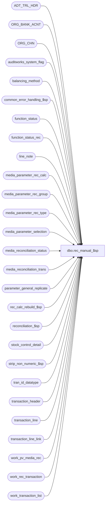

# dbo.rec_manual_$sp

**Database:** auditworks  
**Server:** bedrockdb01  

## Architecture Diagram



## Table Dependencies

| Referenced Table |
|---|
| ADT_TRL_HDR |
| ORG_BANK_ACNT |
| ORG_CHN |
| auditworks_system_flag |
| balancing_method |
| common_error_handling_$sp |
| function_status |
| function_status_rec |
| line_note |
| media_parameter_rec_calc |
| media_parameter_rec_group |
| media_parameter_rec_type |
| media_parameter_selection |
| media_reconciliation_status |
| media_reconciliation_trans |
| parameter_general_replicate |
| rec_calc_rebuild_$sp |
| reconciliation_$sp |
| stock_control_detail |
| strip_non_numeric_$sp |
| tran_id_datatype |
| transaction_header |
| transaction_line |
| transaction_line_link |
| work_pv_media_rec |
| work_rec_transaction |
| work_transaction_list |

## Stored Procedure Code

```sql
CREATE proc  dbo.rec_manual_$sp 
@process_no               smallint,
@process_id		  binary(16),
@rec_process_id           numeric(12,0), -- unique identity value from function_status_rec
@in_out_both_flag         tinyint,
@errmsg                   nvarchar(2000)  OUTPUT,
@recovery_flag            tinyint = 0,
@user_id                  int,
@ENTRY_ID                 binary(16),
@rec_transaction_id       tran_id_datatype = NULL -- if not null then populate work_transaction_list in this proc

AS

/* 
PROC NAME: rec_manual_$sp (rel 5.00 and higher)
     DESC: Calculate media reconciliation totals for balancing entities affected by the
           transactions in work_transaction_list (populated by calling procs when @rec_transaction_id is null).

           @in_out_both_flag values: 1=in (add, modify/void an sa reject, move invalid reg/date)
                                     2=out (delete)
                                     3=in and out (modify/void/move)
           Called by manual functions (always rolls forward).
     Unicode version.
     
HISTORY: 
Date      Name       Def#    Desc
Sep19,16  Vicci    DAOM-1399 Do not transfer zero dollar counts to expected, in order to provide user with method of "expiring"
                             unused float reconciliation entities, avoid clutter of infrequently used tenders/cashiers, etc.
Jul05,16  Vicci     DAOM-292 Recognize Banking Information attachment's bank-acount.
Apr01,16 Vicci      DAOM-292 Record deposit slip and security bag seal.
Nov27,14  Paul   TFS-94103   Use try .. catch to capture errors, removed index hints since edit streams can't use them
Aug13,14  Vicci     148123   Revised handling for mutiple-actual-handing option code 4 to handle weird QA scenario where initial float load 
                             (expected amount) was back-dated using attachment 33  (which normally applies only to counts)  
                             even though this option is not valid for rec-types with carryforwards (since it is single date only).
Apr17,14  Vicci  TFS-71153   In the case of the "out" (delete or modify) log the business date overridden by the date reconciled instead of just the business date.
Dec17,13  Vicci     148123   Log business date overridden by date portion for Period Reconciled / Period Entity Reconciled attachments 
			     to Date Reconciled field of work_rec_transaction for counts for use with multipe-media-counts added option.
Apr04,12  Paul      133087   fix typo due to replace
Feb17,12 Vicci      133087   Remove references to CRDM datatypes from procs installed in multi-stream S/A databases where CRDM is not installed.
Jan17,12 Vicci      132439   Remove references to CRDM user-defined string datatypes from S/A since CRDM is not changing them to support unicode.
Jul11,11  Vicci     128303   Handle process_no 103 (edit post void simulating transaction modify) like process_no 100.
Jan25,11  Paul      120413   scaleout: compare media_rec_rebuild_request date with rec_calc_rebuild_date
Sep24,08  Paul      104042   make index hints compatible with SQL 2005, handle action 56 to match rec_edit_$sp
May28,08  Vicci   1-3Y341F   Do not carry-forward zero dollar counts in order to provide user with method of "expiring"
                             unused tills, avoid clutter of infrequently used tenders/cashiers, etc.
Jan29,08  Vicci      97639   Uplift 97569 to SA5 (add till_no when populating work_rec_transaction and update till in 
                             media_reconciliation_trans if it has been modified but is not part of balancing method).
Nov13,06  Paul       DV-1335 updated comments to match SA4
Oct25,06  Phu        77931   Fix outer join, index hint for SQL 2005 Mode 90.
Oct18,06  Tim        77870   apply 77868 to SA5
Aug25,05  Paul       59056   set rec_process_id in work_pv_media_rec
Jul08,05  Paul       DV-1295 expand reference_no to 80 characters (same as DV-1298)
Apr28,05  Paul       DV-1234 expand transaction_id to use tran_id_datatype
Mar03,05  Paul       DV-1216/46920 Expand column reference_no, allow reversal when set up has changed
Nov17,04  Paul       DV-1167/44504 populate reference_type in work_rec_transaction
Sep20,04  Maryam DV-1146 Change user_name to user_id.
Aug05,04  Paul       DV-1071 log to new audit trail, ORG_BANK changes
Jun07,04  David      DV-1071 Use ORG_CHN table as new the Store table,  change @process_id from int to binary(16)
                pass @process_id, @user_name to the sub procs. Added logic for encrypted credit cards.

Jan29,08  Vicci      97569   Add till_no when populating work_rec_transaction and update till in 
                             media_reconciliation_trans if it has been modified but is not part of balancing method.
Oct16,06  Tim        77868   Add transaction_no when populating work_rec_transaction
Sep22,05  David      DV-1298 Expand column reference_no to nvarchar(80).
Jan10,05  Daphna     46920   allow reversal when set up has changed
Nov17,04  Paul       44504   populate reference_type in work_rec_transaction
Jun07,04  Daphna     30326   Correct insertion order to work_rec_translation for closeout list
Mar16,04  Vicci	     25745   Call rec_calc_rebuild_$sp when rebuild-indicator system flag is
			     missing since otherwise flag will never get created and 
			     media_parameter_rec_calc will never get populated.
Mar10,04  Maryam     25354   fix balancing_entity to default to 1 when till no is not provided and also use the
                             abs(unit) to avoid negative till_no in case of archive transaction modification.
Feb08,04  Maryam     22785   ADD AND (@new_void_flag = @old_void_flag) to the if clause that determines
                             whether there has been an effect on media rec to treat voiding of 0.00$ amount
                             as an effect on media rec.
  (Voiding counts regardless of their amount value causes the entity to be unreconciled)
Jan19,04  Maryam     22004   Fix update from stock-control attachment to apply balancing_entity
                             to reconciliation pickup's contribution to deposit rec and safe rec
                             even though they are not "rec-side 1" nor carryforwards.
Dec29,03  Maryam     DV-1007 Handle Modification of initial float transactions. To properly handle the
                             balancing_entity convert units to int.
				(Paul) pass @rec_status as zero to reconciliation_$sp, remove select into, add nolock hints.
Oct17,03  Maryam     DV-1010 Take contribution_sign into account for calculation of rec_quantity.
                             Changed the date type of @effective_from_date and @effective_until_date
                             to be datetime instead of smalldatetime. change if @rows > 0 to be @rows <>1.
Oct03,03  Maryam     15869   Removed the update of work_rec_transaction where posted_flag = 4
Jul21,03  Paul       11627   corrected recovery logic, improve performance
Jun16,03  Paul       1-KX549 Author
*/

DECLARE
  @action			tinyint,
  @balancing_entity		nvarchar(255),
  @balancing_entity_id		numeric(10,0),
  @cursor_open			tinyint,
  @effective_from_date		datetime,
  @effective_until_date		datetime,
  @entry_date_time		datetime,
  @errmsg2			nvarchar(2000),
  @errline			int,
  @errno			int,
  @flag_alpha_value             int,
  @line_id			numeric(5,0),
  @line_note			nvarchar(250),
  @line_note_stripped		nvarchar(250),
  @line_void_flag		tinyint,
  @media_parameter_set_no	smallint,
  @media_rec_rebuild_date	datetime,
  @media_rec_rebuild_request	datetime,
  @message_id			int,
  @min_transaction_id		tran_id_datatype,
  @new_rec_amount		money,
  @new_rec_exchange		money,
  @new_rec_quantity		smallint,
  @new_tender_total		money,
  @new_void_flag		smallint,
  @object_name			nvarchar(255),
  @old_rec_amount		money,
  @old_rec_exchange		money,
  @old_rec_quantity		smallint,
  @old_tender_total		money,
  @old_void_flag		smallint,
  @new_reference_no             nvarchar(80),
  @old_reference_no             nvarchar(80),
  @operation_name		nvarchar(100),
  @process_name			nvarchar(100),
  @rec_amount_subtype		tinyint,
@rec_amount_type		tinyint,
  @rec_group_line_object	smallint,
  @rec_side			smallint,
  @rec_status			tinyint,
  @rec_type			smallint,
  @register_no		        smallint,
  @rows				int,
  @row_exists			int,
  @rows_inserted		int,
  @store_no			int,
  @transaction_id		tran_id_datatype,
  @TBL_KEY			nvarchar(255),
  @TBL_KEY_RSRC_NAME		nvarchar(255),
  @TBL_KEY_RSRC_PRMS		nvarchar(255),
  @old_till_no			smallint, 
  @new_till_no			smallint,
  @old_deposit_slip 		nvarchar(255),
  @new_deposit_slip 		nvarchar(255),
  @old_security_seal 		nvarchar(255),
  @new_security_seal 		nvarchar(255);  

SELECT        
       @process_name = 'rec_manual_$sp',
       @message_id   = 201068,
       @rows_inserted = 0,
       @rec_status = 0;

BEGIN TRY

IF @in_out_both_flag = 0 -- all trans. are s/a rejects (rare case)
  BEGIN
        SELECT @errmsg = 'Failed to clean up work_transaction_list',
               @object_name = 'work_transaction_list',
               @operation_name = 'DELETE';
    DELETE work_transaction_list
     WHERE rec_process_id = @rec_process_id;

    RETURN;
  END;

    SELECT @errmsg = 'Failed to select flag_alpha_value.',
           @object_name = 'auditworks_system_flag',
	   @operation_name = 'SELECT';
SELECT @flag_alpha_value = CONVERT(int,flag_alpha_value)
  FROM auditworks_system_flag
 WHERE flag_name = 'rec_calc_rebuild_required'; 

  /* Check for rebuild required in a scaleout environment */

IF @flag_alpha_value = 0 -- THEN
  BEGIN
	    SELECT @errmsg = 'Failed to select rec_calc_rebuild_date',
	           @object_name = 'auditworks_system_flag',
		   @operation_name = 'SELECT';
    SELECT @media_rec_rebuild_date = flag_datetime_value
      FROM auditworks_system_flag
     WHERE flag_name = 'rec_calc_rebuild_date';

	    SELECT @errmsg = 'Failed to select media_rec_rebuild_request',
	           @object_name = 'parameter_general_replicate',
		   @operation_name = 'SELECT';
    SELECT @media_rec_rebuild_request = media_rec_rebuild_request
      FROM parameter_general_replicate;

    IF @media_rec_rebuild_request >= COALESCE(@media_rec_rebuild_date, @media_rec_rebuild_request) -- THEN
	SELECT @flag_alpha_value = 1;
  END; -- If Check for rebuild required

IF ISNULL(@flag_alpha_value,1) <> 0
  BEGIN
        SELECT @errmsg = 'Failed to execute rec_calc_rebuild_$sp.',
               @object_name = 'rec_calc_rebuild_$sp',
	      @operation_name = 'EXECUTE';
    EXEC rec_calc_rebuild_$sp @process_id, @user_id, @process_no, @errmsg OUTPUT;
  END;

IF @recovery_flag = 1
  BEGIN
        SELECT @errmsg = 'Failed to select rec_status.',
	       @object_name = 'function_status_rec',
	       @operation_name = 'SELECT';
    SELECT @rec_status = rec_status
      FROM function_status_rec WITH (NOLOCK)
     WHERE rec_process_id = @rec_process_id;

    SELECT @rows = @@rowcount;
    IF @rows = 0 -- media rec complete but work tables may not have been cleaned up
      SELECT @rec_status = 70;

    IF @rec_status = 0 AND @rec_process_id > 0
      BEGIN -- work_rec_transaction may have been partially inserted. clean up before trying to insert.
	    SELECT @errmsg = 'Failed to clean up work_rec_transaction.',
		   @object_name = 'work_rec_transaction',
		   @operation_name = 'DELETE';
	DELETE work_rec_transaction
	 WHERE rec_process_id = @rec_process_id;

	IF @rec_transaction_id IS NOT NULL -- then
	  BEGIN -- clean up before trying to insert a new one
	        SELECT @errmsg = 'Failed to clean up function_status_rec.',
		      @object_name = 'function_status_rec',
		      @operation_name = 'DELETE';
	    DELETE function_status_rec
	     WHERE rec_process_id = @rec_process_id;
	  END;

 END; -- If @rec_status = 0

  END; -- If @recovery_flag = 1

IF @rec_status = 0
BEGIN

IF @rec_transaction_id IS NOT NULL -- add/modify/void/delete tran/edit post void
  BEGIN
    BEGIN TRAN; -- assign rec_process_id
        SELECT @errmsg = 'Failed to insert function_status_rec.',
   	      @object_name = 'function_status_rec',
	      @operation_name = 'INSERT';
    INSERT function_status_rec(
           process_id,
           function_no,
           rec_status,   
           edit_process_no)
    VALUES (@process_id,
           @process_no,
           0,
         null);  

    SELECT @rec_process_id = @@identity;

      SELECT @errmsg = 'Failed to set rec_process_id in function_status',
             @object_name = 'function_status',
	     @operation_name = 'UPDATE';
    UPDATE function_status
    SET rec_process_id = @rec_process_id
     WHERE user_id = @user_id
       AND process_id = @process_id
       AND function_no = @process_no;

    IF @process_no = 103 
    BEGIN
        SELECT @errmsg = 'Failed to set rec_process_id in work_pv_media_rec',
             @object_name = 'work_pv_media_rec',
	     @operation_name = 'UPDATE';
      UPDATE work_pv_media_rec
        SET rec_process_id = @rec_process_id
       WHERE orig_transaction_id = @rec_transaction_id;
    END;

    COMMIT TRAN;

        SELECT @errmsg = 'Failed to insert work_transaction_list',
               @object_name = 'work_transaction_list',
               @operation_name = 'INSERT';
    INSERT work_transaction_list (
           rec_process_id,
           transaction_id)
    VALUES (@rec_process_id,
            @rec_transaction_id);

  END; -- If @rec_transaction_id is not null.

  IF @in_out_both_flag IN (2,3) -- out or both in/out
  BEGIN -- create reversing entries for prior effect of transactions on media rec
        SELECT @errmsg = 'Failed to insert reversals in work_rec_transaction.',
	       @object_name = 'work_rec_transaction',
	       @operation_name = 'INSERT';
    INSERT work_rec_transaction(
           rec_process_id,
           transaction_id,
           transaction_date,
           store_no,
           register_no,
           cashier_no,
           transaction_category,
           line_id,
           line_object,
           line_action,
           reference_no,
           rec_side,
           rec_amount_type,
           rec_amount_subtype,
           tender_total,
           rec_amount,
           rec_quantity,
           rec_exchange,
           void_flag,
           multiple_actual_handling_code,
           period_from_date_time,
           period_to_date_time,
           balancing_store_no,
           balancing_register_no,
           balancing_cashier_no,
           balancing_till_no,
           balancing_bank_no, 
           rec_type,
           balancing_method,
           balancing_entity,
           rec_group_line_object,
           foreign_currency_id,
           convert_to_domestic,
           track_qty,
           short_tolerance_amount,
           short_tolerance_qty,
           short_tolerance_percent,
           unrec_tolerance_days,
           unrec_tolerance_amount, 
           store_no_factor,
           register_no_factor,
           till_no_factor,
           cashier_no_factor,
           bank_no_factor,
           posted_flag,
           audit_activity_flag,
           media_parameter_set_no,
           balancing_entity_id,
           reference_type,
           transaction_no, 
           till_no,
           date_reconciled )
    SELECT
	   @rec_process_id,
	   mrt.transaction_id,
	   mrt.transaction_date,
	   mrt.store_no,
	   mrt.register_no,
	   mrt.cashier_no,
	   mrt.transaction_category,
	   mrt.line_id,
	   mrt.line_object,
	   mrt.line_action,
	   mrt.reference_no,
	   mrt.rec_side,
	   mrt.rec_amount_type,
	   mrt.rec_amount_subtype,
	   mrt.tender_total, 
	   (1-ABS(SIGN(mrt.rec_amount_type - 1))) * mrt.rec_amount * -1,	 
	   (( (1-ABS(SIGN(mrt.rec_amount_type - 1))) * ABS(SIGN(mrt.rec_amount_subtype - 3)) * ABS(SIGN(mrt.rec_amount_subtype)) * ABS(SIGN(mrt.rec_side -1)) * ( 2*SIGN(mrt.void_flag + 1) - 1 ) * SIGN(mrt.rec_amount))
	   + ((1-ABS(SIGN(mrt.rec_amount_type - 2))) * mrt.rec_amount) ) * -1, 
	   (1 - SIGN( ABS(SIGN(mrt.rec_amount_type - 3)) + ABS(SIGN(mrt.rec_amount_type - 5)))) * mrt.rec_amount * -1,  
	   mrt.void_flag,
	   ISNULL(mprt.multiple_actual_handling_code,0),                                 
	   mrt.entry_date_time,  --used for matching later on
	   mrt.entry_date_time,  
	   mrs.store_no,
	   mrs.register_no,
	   mrs.cashier_no,
	   mrs.till_no,
	   mrs.bank_no, 
	   mrs.rec_type,
	   mrs.balancing_method,
	   mrs.balancing_entity,
	   mrs.rec_group_line_object,
	   mprg.foreign_currency_id,
	   ISNULL(mprg.convert_to_domestic,0),
	   ISNULL(mprg.track_qty, 0),
	   ISNULL(mprg.short_tolerance_amount,0),
	   ISNULL(mprg.short_tolerance_qty, 0), 
	   ISNULL(mprg.short_tolerance_percent/100,0),
	   mrs.unrec_tolerance_days,
	   mrs.unrec_tolerance_amount, 
	   SIGN(mrs.store_no),
	   SIGN(mrs.register_no),
	   SIGN(mrs.till_no),
	   SIGN(mrs.cashier_no), 
	   SIGN(mrs.bank_no), 
	   4, 
	   1 - ABS(SIGN(mrt.rec_side -1)), -- set if count
	   mrs.media_parameter_set_no,
	   mrt.balancing_entity_id,
	   mrt.reference_type ,
	   mrt.transaction_no, 
	   mrt.till_no,
	   CASE WHEN mprt.multiple_actual_handling_code = 4 AND (mrt.rec_side = 1 OR mrt.rec_amount_subtype = 0 OR mrt.line_action = 56) THEN COALESCE(mrt.date_reconciled, mrt.transaction_date) ELSE NULL END  --148123, TFS-71153  
      FROM work_transaction_list w WITH (NOLOCK)
           INNER JOIN media_reconciliation_trans mrt WITH (NOLOCK) ON (w.transaction_id = mrt.transaction_id)
           INNER JOIN media_reconciliation_status mrs WITH (NOLOCK) ON (mrt.balancing_entity_id = mrs.balancing_entity_id)
           LEFT JOIN media_parameter_rec_group mprg WITH (NOLOCK) ON (mrs.media_parameter_set_no = mprg.media_parameter_set_no
                                                                      AND mrs.rec_type = mprg.rec_type 
                                                                      AND mrs.rec_group_line_object = mprg.rec_group_line_object)  --outer join so that closeouts are included
           LEFT JOIN media_parameter_rec_type mprt WITH (NOLOCK)  ON (mrs.media_parameter_set_no = mprt.media_parameter_set_no
                                                                 AND mrs.rec_type = mprt.rec_type) -- outerjoin in case setup changed
     WHERE w.rec_process_id = @rec_process_id;

/*   cursor on media_parameter_selection (normally no rows exist).
      reverses effect of txs which change balancing_method */
        SELECT @errmsg        = 'Failed to open bal_method1_crsr on media_parameter_selection',
               @object_name    = 'bal_method1_crsr',
               @operation_name = 'OPEN';
    DECLARE bal_method1_crsr CURSOR FAST_FORWARD
     FOR
     SELECT ms.transaction_id, ms.store_no, ms.register_no, ms.effective_from_date, ms.effective_until_date
       FROM work_transaction_list w WITH (NOLOCK),
            media_parameter_selection ms WITH (NOLOCK)
      WHERE w.rec_process_id = @rec_process_id
        AND w.transaction_id = ms.transaction_id
      ORDER BY ms.effective_from_date;

    OPEN bal_method1_crsr;
    SELECT @cursor_open = 1;

    WHILE 1=1
    BEGIN
      FETCH bal_method1_crsr 
       INTO @transaction_id,
            @store_no,
            @register_no,
            @effective_from_date,
            @effective_until_date;

      IF @@fetch_status <> 0
        BREAK;

       /* fires trigger (cascade delete) so order by is important */
          SELECT @errmsg = 'Failed to delete media_parameter_selection.',
		 @object_name = 'media_parameter_selection',
		 @operation_name = 'DELETE';
      DELETE media_parameter_selection
       WHERE transaction_id = @transaction_id
         AND store_no = @store_no -- allows possible usage of index
         AND register_no = @register_no;

      IF @effective_until_date IS NOT NULL -- then
        BEGIN
           SELECT @errmsg = 'Failed to update media_parameter_selection.',
  		     @object_name = 'media_parameter_selection',
		     @operation_name = 'UPDATE';
          UPDATE media_parameter_selection
            SET effective_until_date = @effective_until_date
           WHERE store_no = @store_no
             AND register_no = @register_no
             AND effective_until_date = @effective_from_date;
        END;
      ELSE
        BEGIN
            SELECT @errmsg = 'Failed to update media_parameter_selection. (2)',
  	           @object_name = 'media_parameter_selection',
		   @operation_name = 'UPDATE';
          UPDATE media_parameter_selection
             SET effective_until_date = NULL 
           WHERE store_no = @store_no
             AND register_no = @register_no
             AND effective_until_date = @effective_from_date;
        END;
      
    END; -- While 1=1

    CLOSE bal_method1_crsr;
    DEALLOCATE bal_method1_crsr;
    SELECT @cursor_open = 0;

  END; -- If @in_out_both_flag IN (2,3)


  /* Process balancing-method changes */

  IF @in_out_both_flag IN (1,3) -- in or both in/out
  BEGIN 
        SELECT @errmsg         = 'Failed to open bal_method2_crsr on line_note',
               @object_name    = 'bal_method2_crsr',
               @operation_name = 'OPEN';
    DECLARE bal_method2_crsr CURSOR FAST_FORWARD
     FOR
     SELECT w.transaction_id,
            ln.line_id,
            ln.line_note
       FROM work_transaction_list w WITH (NOLOCK),
            line_note ln WITH (NOLOCK),
            transaction_header th WITH (NOLOCK)
      WHERE w.rec_process_id = @rec_process_id
        AND w.transaction_id = ln.transaction_id
        AND ln.note_type = 9007
        AND w.transaction_id = th.transaction_id
   ORDER BY th.entry_date_time;

    OPEN bal_method2_crsr;
    SELECT @cursor_open = 2;

    WHILE 2=2
    BEGIN
      FETCH bal_method2_crsr
      INTO @transaction_id,
            @line_id,
            @line_note;

      IF @@fetch_status <> 0
        BREAK;

      IF @line_id > 0
        BEGIN
             SELECT @errmsg       = 'Failed to select line_void_flag from transaction_line',
	           @object_name    = 'transaction_line',
	           @operation_name = 'SELECT';
          SELECT @line_void_flag = line_void_flag
            FROM transaction_line WITH (NOLOCK)
           WHERE transaction_id = @transaction_id
             AND line_id = @line_id;

          SELECT @rows = @@rowcount;
         END;
       ELSE
         SELECT @rows = 1, @line_void_flag = 0;

       IF @rows = 0 OR @line_void_flag > 0
         CONTINUE;

          SELECT @errmsg       = 'Failed to select @store_no from transaction_header',
	        @object_name    = 'transaction_header',
	        @operation_name = 'SELECT';
       SELECT @store_no = store_no,
	      @register_no = register_no,
	      @entry_date_time = ISNULL(s.count_date, h.entry_date_time)
         FROM transaction_header h WITH (NOLOCK)
              LEFT JOIN stock_control_detail s WITH (NOLOCK) ON (h.transaction_id = s.transaction_id AND s.display_def_id = 33 AND s.line_id = @line_id)
        WHERE h.transaction_id = @transaction_id
          AND sa_rejection_flag = 0
          AND transaction_void_flag IN (0,8);
       SELECT @rows = @@rowcount,
              @row_exists = 0;

       IF @rows > 0 -- non void transaction
       BEGIN
         SELECT @line_note_stripped = NULL,
                @errmsg = 'Failed to execute strip_non_numeric_$sp.',
                @object_name = 'strip_non_numeric_$sp',
                @operation_name = 'EXECUTE';
         EXEC strip_non_numeric_$sp @line_note, @line_note_stripped OUTPUT;

         IF LEN(@line_note_stripped) <= 4
           SELECT @media_parameter_set_no = CONVERT(smallint,@line_note_stripped);
         ELSE
           SELECT @media_parameter_set_no = NULL; -- avoid error 247 (overflow)

IF EXISTS (SELECT 1
                      FROM media_parameter_rec_calc WITH (NOLOCK)
                     WHERE media_parameter_set_no = @media_parameter_set_no)
           SELECT @row_exists = 1;
       END;  -- If @rows > 0

       IF @row_exists = 1
       BEGIN -- Log balancing-method changes to media_parameter_selection
           SELECT @errmsg       = 'Failed to set transaction_id in media_parameter_selection',
	          @object_name    = 'media_parameter_selection',
	          @operation_name = 'UPDATE';
         UPDATE media_parameter_selection
            SET media_parameter_set_no = @media_parameter_set_no,
                transaction_id = @transaction_id
          WHERE store_no = @store_no
            AND register_no = @register_no
            AND effective_from_date = @entry_date_time;

         SELECT @rows = @@rowcount;

         IF @rows <> 1
         BEGIN
             SELECT @errmsg       = 'Failed to select min from media_parameter_selection',
	          @object_name    = 'media_parameter_selection',
	          @operation_name = 'SELECT';
             SELECT @effective_until_date = MIN(effective_from_date)
               FROM media_parameter_selection WITH (NOLOCK)
              WHERE store_no = @store_no
                AND register_no = @register_no
                AND effective_from_date > @entry_date_time

             SELECT @effective_from_date = MAX(effective_from_date)
             FROM media_parameter_selection WITH (NOLOCK)
              WHERE store_no = @store_no
                AND register_no = @register_no
                AND effective_from_date < @entry_date_time

             IF @effective_from_date IS NOT NULL /* then */
               BEGIN
                   SELECT @errmsg    = 'Failed to set effective_until_date in media_parameter_selection',
		           @object_name    = 'media_parameter_selection',
		           @operation_name = 'UPDATE';
                UPDATE media_parameter_selection
                  SET effective_until_date = @entry_date_time
                 WHERE store_no = @store_no
                   AND register_no = @register_no 
                   AND effective_from_date = @effective_from_date;

                   SELECT @errmsg       = 'Failed to insert media_parameter_selection',
		           @object_name    = 'media_parameter_selection',
		           @operation_name = 'INSERT';
                INSERT media_parameter_selection(store_no, register_no, effective_from_date, effective_until_date,
                       media_parameter_set_no, transaction_id)
                VALUES(@store_no, @register_no, @entry_date_time, @effective_until_date,
                       @media_parameter_set_no, @transaction_id);
               END;

            END; -- If @rows > 0
         END; -- If @row_exists = 1
     
      END; -- While 2=2

    CLOSE bal_method2_crsr;
    DEALLOCATE bal_method2_crsr;
    SELECT @cursor_open = 0;

  END; -- If @in_out_both_flag IN (1,3)


  /* Find effect of transaction activity currently being processed on reconciliation */

  IF @in_out_both_flag IN (1,3) -- in or both in/out then get list of tender transaction lines
  BEGIN
        SELECT @errmsg = 'Failed to insert current tran in work_rec_transaction (1).',
		@object_name = 'work_rec_transaction',
		@operation_name = 'INSERT';
     INSERT work_rec_transaction(
	 rec_process_id,
	 transaction_id,
	 transaction_date,
	 store_no,
	 register_no,
	 cashier_no,
	 transaction_category,
	 line_id,
	 line_object,
	 line_action,
	 reference_no,
	 rec_side,
	 rec_amount_type,
	 rec_amount_subtype,
	 tender_total,
	 rec_amount,
	 rec_quantity,
	 rec_exchange,
	 void_flag,
	 multiple_actual_handling_code,
	 period_from_date_time,
	 period_to_date_time,
	 balancing_store_no,
	 balancing_register_no,
	 balancing_cashier_no,
	 balancing_till_no,
	 balancing_bank_no, 
	 rec_type,
	 balancing_method,
	 balancing_entity,
	 rec_group_line_object,
	 foreign_currency_id,
	 convert_to_domestic,
	 track_qty,
	 short_tolerance_amount,
	 short_tolerance_qty,
	 short_tolerance_percent,
	 unrec_tolerance_days,
	 unrec_tolerance_amount, 
	 store_no_factor,
	 register_no_factor,
	 till_no_factor,
	 cashier_no_factor,
	 bank_no_factor,
	 posted_flag,
	 audit_activity_flag,
	 media_parameter_set_no,
	 reference_type,
	 transaction_no,  
	 till_no,
	 date_reconciled )
     SELECT @rec_process_id,
	 w.transaction_id,
	 h.transaction_date,
	 h.store_no,
	 h.register_no,
	 h.cashier_no,
	 h.transaction_category,
	 l.line_id,
	 l.line_object,
	 l.line_action,
	 l.reference_no,
	 o.rec_side,
	 o.rec_amount_type,
	 o.rec_amount_subtype,
	 h.tender_total,
	 (1-ABS(SIGN(o.rec_amount_type - 1))) * o.contribution_sign * l.gross_line_amount * l.voiding_reversal_flag, --rec_amount
	 ( (1-ABS(SIGN(o.rec_amount_type - 1))) * ABS(SIGN(rec_side -1)) *
	   ABS(SIGN(o.rec_amount_subtype -3)) * ABS(SIGN(o.rec_amount_subtype)) * 
	   l.voiding_reversal_flag * SIGN(l.gross_line_amount)  * o.contribution_sign) -- contribution_sign required since later matching process upon tranaction modify fails.
	   + ( (1-ABS(SIGN(o.rec_amount_type - 2))) * l.gross_line_amount * l.voiding_reversal_flag ), --rec_quantity
	 (1-ABS(SIGN(o.rec_amount_type - 3))) * o.contribution_sign * l.gross_line_amount * l.voiding_reversal_flag, --rec_exchange
	 (1-SIGN(ABS(SIGN(h.transaction_void_flag - 8)) * SIGN(h.transaction_void_flag)  + l.line_void_flag)) * (ABS(SIGN(h.transaction_void_flag - 8))
	   - (1-ABS(SIGN(h.transaction_void_flag - 8)))),
	 o.multiple_actual_handling_code, 
	 CASE WHEN o.multiple_actual_handling_code = 4 AND o.rec_side = 1 AND (h.entry_date_time < dateadd(dd, -1, h.transaction_date) OR h.entry_date_time >= dateadd(dd, 2, h.transaction_date)) --to handle case of crazy move since mrt.entry_date_time range used in reconciliation_$sp for option 4 counts
	      THEN h.transaction_date
 	      ELSE h.entry_date_time END,
	 CASE WHEN o.multiple_actual_handling_code = 4 AND o.rec_side = 1 AND (h.entry_date_time < dateadd(dd, -1, h.transaction_date) OR h.entry_date_time >= dateadd(dd, 2, h.transaction_date)) --to handle case of crazy move since mrt.entry_date_time range used in reconciliation_$sp for option 4 counts
	      THEN h.transaction_date
 	      ELSE h.entry_date_time END,
	 h.store_no * store_no_factor,
	 h.register_no * register_no_factor,
	 h.cashier_no * cashier_no_factor,
	 ISNULL(h.till_no, 1) * till_no_factor,
	 s.PRMRY_BANK_ACNT_ID * bank_no_factor, 
	 o.rec_type,
	 o.balancing_method,
	 ISNULL(SUBSTRING(CONVERT(nvarchar, h.store_no), store_no_factor, 255 * store_no_factor) 
	   + SUBSTRING(SUBSTRING('.', store_no_factor, 1) + CONVERT(nvarchar, h.register_no), register_no_factor, 255 * register_no_factor)
	   + SUBSTRING(SUBSTRING('.', SIGN(store_no_factor + register_no_factor), 1)
	   + CONVERT(nvarchar, cashier_no), cashier_no_factor, 255 * cashier_no_factor) 
	   + SUBSTRING(SUBSTRING('.', SIGN(store_no_factor + register_no_factor + cashier_no_factor), 1) + CONVERT(nvarchar, ISNULL(h.till_no, 1)), till_no_factor, 255 * till_no_factor)
	   + SUBSTRING(SUBSTRING('.', SIGN(store_no_factor + register_no_factor + cashier_no_factor + till_no_factor), 1)
	   + CONVERT(nvarchar, s.PRMRY_BANK_ACNT_ID), bank_no_factor, 255 * bank_no_factor), ' '), --balancing_entity 
	 o.rec_group_line_object,
	 o.foreign_currency_id,
	 o.convert_to_domestic,
	 o.track_qty,
	 o.short_tolerance_amount,
	 o.short_tolerance_qty,
	 o.short_tolerance_percent,
	 o.unrec_tolerance_days,
	 o.unrec_tolerance_amount, 
	 o.store_no_factor,
	 o.register_no_factor,
	 o.till_no_factor,
	 o.cashier_no_factor,
	 o.bank_no_factor,
	 0,
	 0,
	 p.media_parameter_set_no,
	 l.reference_type,
	 h.transaction_no,  
	 h.till_no,
	 CASE WHEN o.multiple_actual_handling_code = 4 AND (o.rec_side = 1 OR o.rec_amount_subtype = 0 OR l.line_action = 56) THEN h.transaction_date ELSE NULL END  --148123
       FROM work_transaction_list w WITH (NOLOCK), transaction_header h WITH (NOLOCK), transaction_line l WITH (NOLOCK),
            media_parameter_selection p WITH (NOLOCK), media_parameter_rec_calc o WITH (NOLOCK), ORG_CHN s WITH (NOLOCK)
      WHERE w.rec_process_id = @rec_process_id 
        AND w.transaction_id = h.transaction_id
       AND h.date_reject_id = 0
        AND (h.sa_rejection_flag = 0 OR @rec_transaction_id IS NOT NULL)  /* in transaction 
			modify the sa_rejection_flag in transaction header has not yet been 
			updated at this point but the F/E will not allow a S/A rejection to
			go through. */
        AND h.transaction_id = l.transaction_id 
        AND h.store_no = s.ORG_CHN_NUM
        AND h.store_no = p.store_no 
        AND h.register_no = p.register_no 
        AND h.entry_date_time >= p.effective_from_date
        AND (h.entry_date_time < p.effective_until_date OR p.effective_until_date IS NULL) 
        AND p.media_parameter_set_no = o.media_parameter_set_no 
        AND l.line_object = o.line_object
        AND l.line_action = o.line_action
        AND (l.gross_line_amount <> 0 OR o.rec_side <> 0 OR o.rec_amount_subtype NOT IN (0, 3));  --1-3Y341F/DAOM-1399  (not $0 carryforward/transfer)
     SELECT @rows_inserted = @rows_inserted + @@rowcount;

     /* Get list of closeouts if multiple reconciliation actual handling option is closeout dependent */
        SELECT @errmsg = 'Failed to insert work_rec_transaction (closeouts).',
		@object_name = 'work_rec_transaction',
		@operation_name = 'INSERT';
     INSERT work_rec_transaction(
	 rec_process_id,
	 transaction_id,
	 transaction_date,
	 store_no,
	 register_no,
	 cashier_no,
	 transaction_category,
	 line_id,
	 line_object,
	 line_action,
	 reference_no,
	 rec_side,
	 rec_amount_type,
	 rec_amount_subtype,
	 tender_total,
	 rec_amount,
	 rec_quantity,
	 rec_exchange,
	 void_flag,
	 multiple_actual_handling_code,
	 period_from_date_time,
	 period_to_date_time,
	 balancing_store_no,
	 balancing_register_no,
	 balancing_cashier_no,
	 balancing_till_no,
	 balancing_bank_no, 
	 rec_type,
	 balancing_method,
	 balancing_entity,
	 rec_group_line_object,
	 foreign_currency_id,
	 convert_to_domestic,
	 track_qty,
	 short_tolerance_amount,
	 short_tolerance_qty,
	 short_tolerance_percent,
	 unrec_tolerance_days,
	 unrec_tolerance_amount, 
	 store_no_factor,
	 register_no_factor,
	 till_no_factor,
	 cashier_no_factor,
	 bank_no_factor,
	 posted_flag,
	 audit_activity_flag,
	 media_parameter_set_no,
	 reference_type,
	 transaction_no, 
	 till_no   )
     SELECT
	 @rec_process_id,
	 w.transaction_id,
	 h.transaction_date,
	 h.store_no,
	 h.register_no,
	 h.cashier_no,
	 h.transaction_category,
	 0, -- line_id
	 -2, -- line_object
	 38, -- line_action,
	 null,-- reference_no
	 1, -- rec_side
	 0, -- rec_amount_type
	 6, -- rec_amount_subtype
	 0,-- tender_total
	 0 ,-- rec_amount
	 0,
	 0,
	 1, -- void_flag
	 rt.multiple_actual_handling_code, 
	 h.entry_date_time,
	 h.entry_date_time,
	 h.store_no * store_no_factor,
	 h.register_no * register_no_factor,
	 h.cashier_no * cashier_no_factor,
	 ISNULL(h.till_no, 1) * till_no_factor,
	 s.PRMRY_BANK_ACNT_ID * bank_no_factor, 
	 rt.rec_type,
	 rt.balancing_method,
	 ISNULL(SUBSTRING(CONVERT(nvarchar, h.store_no), store_no_factor, 255 * store_no_factor) 
	   + SUBSTRING(SUBSTRING('.', store_no_factor, 1) + CONVERT(nvarchar, h.register_no), register_no_factor, 255 * register_no_factor)
	   + SUBSTRING(SUBSTRING('.', SIGN(store_no_factor + register_no_factor), 1) + CONVERT(nvarchar, h.cashier_no), cashier_no_factor, 255 * cashier_no_factor)
	   + SUBSTRING(SUBSTRING('.', SIGN(store_no_factor + register_no_factor + cashier_no_factor), 1) + CONVERT(nvarchar, ISNULL(h.till_no, 1)), till_no_factor, 255 * till_no_factor)
	   + SUBSTRING(SUBSTRING('.', SIGN(store_no_factor + register_no_factor + cashier_no_factor + till_no_factor), 1)
	   + CONVERT(nvarchar, s.PRMRY_BANK_ACNT_ID), bank_no_factor, 255 * bank_no_factor), ' '),   --balancing_entity
	 -2, -- rec_group_line_object
	null, -- foreign_currency_id
	0, -- convert_to_domestic
	0, -- track_qty
	0, -- short_tolerance_amount
	0, -- short_tolerance_qty
	0, -- short_tolerance_percent
	0, -- unrec_tolerance_days
	0, -- unrec_tolerance_amount
	b.store_no_factor,
	b.register_no_factor,
	b.till_no_factor,
	b.cashier_no_factor,
	b.bank_no_factor,
	0,
	0, -- audit_activity_flag
	p.media_parameter_set_no,
	0, -- reference_type n/a
	h.transaction_no, 
	h.till_no
        FROM work_transaction_list w WITH (NOLOCK), transaction_header h WITH (NOLOCK), media_parameter_selection p WITH (NOLOCK),
             media_parameter_rec_type rt WITH (NOLOCK), ORG_CHN s WITH (NOLOCK), balancing_method b WITH (NOLOCK)
       WHERE w.rec_process_id = @rec_process_id
         AND w.transaction_id = h.transaction_id
         AND h.closeout_flag > 0
         AND h.date_reject_id = 0
         AND h.sa_rejection_flag = 0
         AND h.transaction_void_flag = 0
         AND h.store_no = s.ORG_CHN_NUM
         AND h.store_no = p.store_no
         AND h.register_no = p.register_no
         AND p.effective_from_date <= h.entry_date_time
         AND (p.effective_until_date IS NULL OR p.effective_until_date > h.entry_date_time)
         AND p.media_parameter_set_no = rt.media_parameter_set_no
         AND rt.multiple_actual_handling_code IN (1, 2)
         AND rt.balancing_method = b.balancing_method;

     SELECT @rows_inserted = @rows_inserted + @@rowcount;

     IF @rows_inserted > 0
     BEGIN

       --set banking information for both expected and actuals
       SELECT @errmsg = 'Failed to indicate deposit slip and security bag seal information',
              @object_name = 'work_rec_transaction',
              @operation_name = 'UPDATE';
       UPDATE w  --UPDATE work_rec_transaction
          SET deposit_slip = SUBSTRING(COALESCE(bl.vendor_no, bll.vendor_no, bh.vendor_no), 1, 255), 
              security_seal = SUBSTRING(COALESCE(bl.imrd, bll.imrd, bh.imrd), 1, 255),
              balancing_bank_no = COALESCE(b.BANK_ACNT_ID, w.balancing_bank_no) * w.bank_no_factor  --not necessary when banking import used since it sets originating_store_no in 33 to be one of those depositing into account but added to support a store depositing into more than 1 account or changing accounts.
         FROM work_rec_transaction w
              LEFT OUTER JOIN stock_control_detail bh WITH (NOLOCK)
                 ON w.transaction_id = bh.transaction_id
                AND bh.display_def_id = 57
                AND bh.line_id = 0
              LEFT OUTER JOIN stock_control_detail bl WITH (NOLOCK)
                 ON w.transaction_id = bl.transaction_id
                AND w.line_id = bl.line_id
                AND bl.display_def_id = 57
              LEFT OUTER JOIN transaction_line_link ll WITH (NOLOCK)
                 ON w.transaction_id = ll.transaction_id
                AND w.line_id = ll.line_id
              LEFT OUTER JOIN stock_control_detail bll WITH (NOLOCK)
                 ON ll.transaction_id = bll.transaction_id
                AND ll.linked_line_id = bll.line_id
                AND bll.display_def_id = 57
              LEFT OUTER JOIN ORG_BANK_ACNT b
                ON COALESCE(bl.location_no, bll.location_no, bh.location_no) = b.BANK_ACNT_ID
        WHERE w.rec_process_id = @rec_process_id
          AND w.posted_flag = 0
          AND (   COALESCE(bl.vendor_no, bll.vendor_no, bh.vendor_no) IS NOT NULL
               OR COALESCE(bl.imrd, bll.imrd, bh.imrd) IS NOT NULL
               OR b.BANK_ACNT_ID IS NOT NULL);

     /* If a reconciliation transaction with actual amounts has been entered 'on-behalf' of 
        another store/reg/cashier/till or for a period ending 'as-of' another date/time, adjust
        the balancing entity accordingly */

      --Date update limited to actual to prevent a count done Tuesday morning 
      --from becoming part of Monday's expected bank deposit.  As-of dating cannot logically be
      --applied to Media Balance Rec (count/carryforward/rec-pickup combo) since although the pickup must have physically 
      --occurred on Monday the amount picked-up was not known at that time and did not become until
      --until Tuesday.  The system will treat the reconciliation and its pickup as having occurred
      --on Monday, but leave the contribution of this pickup to the Deposit rec on Weds
      --since this is as close as it can model reality, but the result is that funds are
   --removed from the Balance Rec on Monday but only become part of the Deposit rec on Tues.

        --Header level updates
           SELECT @errmsg = 'Unabled to limit the reconciliation period based on the cut-off date (count_date) specified in the reconciliation (stock_control) attachment. (header level)',
		@object_name = 'work_rec_transaction',
		@operation_name = 'UPDATE';
        UPDATE work_rec_transaction
           SET period_from_date_time = t.count_date,
	       period_to_date_time = t.count_date,
	       transaction_date = CASE WHEN w.multiple_actual_handling_code = 4 AND w.line_action = 56 THEN CONVERT(smalldatetime, CONVERT(nchar(8), t.count_date,112)) ELSE w.transaction_date END, --148123 revision
	       date_reconciled = CASE WHEN w.multiple_actual_handling_code = 4 AND t.count_date < w.transaction_date THEN CONVERT(smalldatetime, CONVERT(nchar(8), t.count_date,112)) ELSE w.date_reconciled END  --148123.  
	                         --Note, the < transaction date is just used to mitigate the problem if an existing client with multiple media coounts added was actually specifying an after midnight time 
	                         --(time is not longer supposed to be set for option 3 in attachments) and wanted to preserve prior functionality where it would be added to other counts for the business date;  
	                         --not perfect since reverse issue might exist, i.e. existing client still setting time closed on D1 9PM and counte again before midnight but had the attachment and yet still wanted it merged with D2 counts.
          FROM work_rec_transaction w, stock_control_detail t WITH (NOLOCK)
         WHERE w.rec_process_id = @rec_process_id
           AND w.posted_flag = 0
           AND w.transaction_id = t.transaction_id
           AND t.line_id = 0
           AND t.display_def_id = 33
           AND t.count_date IS NOT NULL
           AND (w.rec_side = 1 OR w.rec_amount_subtype = 0 OR w.line_action = 56);
           
           SELECT @errmsg = 'Unabled to indicate to which balancing entity the reconciliation applies based on the details specified in the header level reconciliation (stock_control) attachment',
		@object_name = 'work_rec_transaction',
		@operation_name = 'UPDATE';
       UPDATE work_rec_transaction
          SET balancing_store_no = ISNULL(t.originating_store_no * w.store_no_factor, w.balancing_store_no),
	      balancing_register_no = ISNULL(t.location_no * w.register_no_factor, balancing_register_no),  
	      balancing_cashier_no = ISNULL(t.other_store_no * w.cashier_no_factor, w.balancing_cashier_no), 
	      balancing_till_no = ISNULL(ABS(t.units) * w.till_no_factor, w.balancing_till_no),
	      balancing_bank_no = s.PRMRY_BANK_ACNT_ID * w.bank_no_factor,
	      balancing_entity = ISNULL(SUBSTRING(CONVERT(nvarchar, ISNULL(t.originating_store_no, w.balancing_store_no)), store_no_factor, 255 * store_no_factor) 
		 + SUBSTRING(SUBSTRING('.', store_no_factor, 1) + CONVERT(nvarchar, ISNULL(location_no, balancing_register_no)), register_no_factor, 255 * register_no_factor)
		 + SUBSTRING(SUBSTRING('.', SIGN(store_no_factor + register_no_factor), 1) + CONVERT(nvarchar, ISNULL(other_store_no, balancing_cashier_no)), cashier_no_factor, 255 * cashier_no_factor ) 
		 + SUBSTRING(SUBSTRING('.', SIGN(store_no_factor + register_no_factor + cashier_no_factor), 1) + CONVERT(nvarchar, ISNULL(CONVERT(int,ABS(units)), balancing_till_no)), till_no_factor, 255 * till_no_factor)
		 + SUBSTRING(SUBSTRING('.', SIGN(store_no_factor + register_no_factor + cashier_no_factor + till_no_factor), 1) + CONVERT(nvarchar, s.PRMRY_BANK_ACNT_ID), bank_no_factor, 255 * bank_no_factor)
		 , ' ')   --balancing_entity
          FROM work_rec_transaction w, stock_control_detail t WITH (NOLOCK), ORG_CHN s WITH (NOLOCK)
         WHERE w.rec_process_id = @rec_process_id
           AND w.posted_flag = 0
           AND w.transaction_id = t.transaction_id
           AND t.line_id = 0
           AND t.display_def_id IN (33,43)
           AND ISNULL(t.originating_store_no, w.store_no) = s.ORG_CHN_NUM;

	--line level update
           SELECT @errmsg = 'Unabled to limit the reconciliation period based on the cut-off date (count_date) specified in the reconciliation (stock_control) attachment. (line level)',
		@object_name = 'work_rec_transaction',
		@operation_name = 'UPDATE';      
        UPDATE work_rec_transaction
           SET period_from_date_time = t.count_date,
	       period_to_date_time = t.count_date,
	       transaction_date = CASE WHEN w.multiple_actual_handling_code = 4 AND w.line_action = 56 THEN CONVERT(smalldatetime, CONVERT(nchar(8), t.count_date,112)) ELSE w.transaction_date END, --148123 revision
	       date_reconciled = CASE WHEN w.multiple_actual_handling_code = 4 AND t.count_date < w.transaction_date THEN CONVERT(smalldatetime, CONVERT(nchar(8), t.count_date,112)) ELSE w.date_reconciled END  --148123
          FROM work_rec_transaction w, stock_control_detail t WITH (NOLOCK)
         WHERE w.rec_process_id = @rec_process_id
           AND w.posted_flag = 0
           AND w.transaction_id = t.transaction_id
           AND w.line_id = t.line_id 
           AND t.display_def_id = 33
           AND t.count_date IS NOT NULL
           AND (w.rec_side = 1 OR w.rec_amount_subtype = 0 OR w.line_action = 56);

           SELECT @errmsg = 'Unabled to indicate to which balancing entity the reconciliation applies based on the details specified in the line level reconciliation (stock_control) attachment',
		@object_name = 'work_rec_transaction',
		@operation_name = 'UPDATE';
       UPDATE work_rec_transaction
          SET 	balancing_store_no = ISNULL(t.originating_store_no * w.store_no_factor, w.balancing_store_no),
		balancing_register_no = ISNULL(t.location_no * w.register_no_factor, balancing_register_no),  
		balancing_cashier_no = ISNULL(t.other_store_no * w.cashier_no_factor, w.balancing_cashier_no), 
		balancing_till_no = ISNULL(ABS(t.units) * w.till_no_factor, w.balancing_till_no),
		balancing_bank_no = s.PRMRY_BANK_ACNT_ID * w.bank_no_factor,
		balancing_entity = ISNULL(SUBSTRING(CONVERT(nvarchar, ISNULL(t.originating_store_no, w.balancing_store_no)), store_no_factor, 255 * store_no_factor) 
		 + SUBSTRING(SUBSTRING('.', store_no_factor, 1) + CONVERT(nvarchar, ISNULL(location_no, balancing_register_no)), register_no_factor, 255 * register_no_factor)
		 + SUBSTRING(SUBSTRING('.', SIGN(store_no_factor + register_no_factor), 1) + CONVERT(nvarchar, ISNULL(other_store_no, balancing_cashier_no)), cashier_no_factor, 255 * cashier_no_factor ) 
		 + SUBSTRING(SUBSTRING('.', SIGN(store_no_factor + register_no_factor + cashier_no_factor), 1) + CONVERT(nvarchar, ISNULL(convert(int,ABS(units)), balancing_till_no)), till_no_factor, 255 * till_no_factor)
		 + SUBSTRING(SUBSTRING('.', SIGN(store_no_factor + register_no_factor + cashier_no_factor + till_no_factor), 1) + CONVERT(nvarchar, s.PRMRY_BANK_ACNT_ID), bank_no_factor, 255 * bank_no_factor)
		 , ' ')   --balancing_entity
          FROM work_rec_transaction w, stock_control_detail t WITH (NOLOCK),
               ORG_CHN s WITH (NOLOCK)
         WHERE w.rec_process_id = @rec_process_id
           AND w.posted_flag = 0
          AND w.transaction_id = t.transaction_id
           AND w.line_id = t.line_id 
           AND t.display_def_id IN (33,43)
           AND ISNULL(t.originating_store_no, w.store_no) = s.ORG_CHN_NUM;

    END; -- If @rows_inserted > 0

  END; -- If @in_out_both_flag IN (1, 3)


  /* Set posted_flag to appropriately indicate whether a reversal, adjustment, or new entry is being made.
   Not necessary when moving since we already know that store and/or reg and/or date were modified.
   Declare a cursor on matching in/out in order to transform them into an adjustment or eliminate them in the case where nothing has changed */
   /* testing code : */

  IF @in_out_both_flag = 3 AND @rows_inserted > 0 AND @process_no NOT IN (9,109)
  BEGIN -- look for lines that did not change
      SELECT @errmsg       = 'Failed to create table #matched_lines',
           @object_name    = '#matched_lines',
           @operation_name = 'CREATE';
   CREATE TABLE #matched_lines (
	    transaction_id		numeric(14,0) not null, -- tran_id_datatype
	    line_id			numeric(5,0) not null,
	    rec_type			smallint not null,
   	    balancing_entity		nvarchar(255) not null,
	    rec_group_line_object	smallint not null,
	    rec_side			smallint not null,
	    rec_amount_type		tinyint not null,
	    rec_amount_subtype		tinyint not null,
	    old_void_flag		smallint not null,
	    new_void_flag		smallint not null,
	    old_tender_total		money not null,
	    new_tender_total		money not null,
	    old_rec_amount		money not null,
	    new_rec_amount		money not null,
	    old_rec_quantity		smallint not null,
	    new_rec_quantity		smallint not null,
	    old_rec_exchange		money not null,
	    new_rec_exchange		money not null,
	    old_reference_no		nvarchar(80) null,
	    new_reference_no		nvarchar(80) null,
            balancing_entity_id		numeric(10,0) not null,
            old_till_no			smallint null,
            new_till_no			smallint null,
            old_deposit_slip 		nvarchar(255) null,
            new_deposit_slip 		nvarchar(255) null,
            old_security_seal 		nvarchar(255) null,
            new_security_seal 		nvarchar(255) null);

     SELECT @errmsg       = 'Failed to insert #matched_lines',
            @object_name    = '#matched_lines',
            @operation_name = 'INSERT';
     INSERT #matched_lines (
	    transaction_id,
	    line_id,
	    rec_type,
	    balancing_entity,
	    rec_group_line_object,
	    rec_side,
	    rec_amount_type,
	    rec_amount_subtype,
	    old_void_flag,
	    new_void_flag,
	    old_tender_total,
	    new_tender_total,
	    old_rec_amount,
	    new_rec_amount,
	    old_rec_quantity,
	    new_rec_quantity,
	    old_rec_exchange,
	    new_rec_exchange,
	    old_reference_no,
	    new_reference_no,
            balancing_entity_id, 
            old_till_no,  
            new_till_no,
            old_deposit_slip,
            new_deposit_slip,
            old_security_seal,
            new_security_seal  )
   SELECT
	    new.transaction_id,
	    new.line_id,
	    new.rec_type,
	    new.balancing_entity,
	    new.rec_group_line_object,
	    new.rec_side,
	    new.rec_amount_type,
	    new.rec_amount_subtype,
	    old.void_flag,
	    new.void_flag,
	    old.tender_total,
	    new.tender_total,
	    old.rec_amount,
	    new.rec_amount,
	    old.rec_quantity,
	    new.rec_quantity,
	    old.rec_exchange,
	    new.rec_exchange,
	    old.reference_no,
	    new.reference_no,
            mrs.balancing_entity_id, 
            old.till_no,  
            new.till_no,
            old.deposit_slip,
            new.deposit_slip,
     old.security_seal,
            new.security_seal
     FROM work_rec_transaction old WITH (NOLOCK), work_rec_transaction new WITH (NOLOCK),
          media_reconciliation_status mrs WITH (NOLOCK)
    WHERE old.rec_process_id = @rec_process_id
      AND old.rec_amount_type <> 5
      AND old.posted_flag = 4 
      AND new.posted_flag = 0
      AND old.rec_process_id = new.rec_process_id
      AND old.transaction_id = new.transaction_id
      AND old.line_id = new.line_id
      AND old.balancing_entity = new.balancing_entity
      AND old.rec_type = new.rec_type
      AND old.rec_group_line_object = new.rec_group_line_object
      AND old.rec_amount_type = new.rec_amount_type
      AND old.rec_amount_subtype = new.rec_amount_subtype
      AND old.rec_side = new.rec_side
      AND old.period_from_date_time = new.period_from_date_time --entry_date_time overridden by count_date
      AND old.store_no = new.store_no
  AND old.register_no = new.register_no
      AND old.cashier_no = new.cashier_no
      AND old.transaction_date = new.transaction_date
      AND old.line_object = new.line_object
      AND old.line_action = new.line_action
      AND old.transaction_category = new.transaction_category
      AND old.balancing_method = mrs.balancing_method
      AND old.balancing_entity = mrs.balancing_entity
      AND old.rec_type = mrs.rec_type
      AND old.rec_group_line_object = mrs.rec_group_line_object;

      SELECT @errmsg       = 'Failed to open matching_crsr on #matched_lines',
           @object_name    = 'matching_crsr',
           @operation_name = 'OPEN';
   DECLARE matching_crsr CURSOR FAST_FORWARD
   FOR
   SELECT transaction_id,
	  line_id,
	  rec_type,
	  balancing_entity,
	  rec_group_line_object,
	  rec_side,
	  rec_amount_type,
	  rec_amount_subtype,
	  old_void_flag,
	  new_void_flag,
	  old_tender_total,
	  new_tender_total,
	  old_rec_amount,
	  new_rec_amount,
	  old_rec_quantity,
	  new_rec_quantity,
	  old_rec_exchange,
	  new_rec_exchange,
          new_reference_no,
	  old_reference_no,
	  balancing_entity_id,
	  old_till_no,
	  new_till_no,
	  old_deposit_slip,
          new_deposit_slip,
          old_security_seal,
          new_security_seal	   
     FROM #matched_lines;

   OPEN matching_crsr;
   SELECT @cursor_open = 3;

   WHILE 3=3
     BEGIN
       FETCH matching_crsr
        INTO @transaction_id,
	    @line_id,
	    @rec_type,
	    @balancing_entity,
	    @rec_group_line_object,
	    @rec_side,
	    @rec_amount_type,
	    @rec_amount_subtype,
	    @old_void_flag,
	    @new_void_flag,
	    @old_tender_total,
	    @new_tender_total,
	    @old_rec_amount,
	    @new_rec_amount,
	    @old_rec_quantity,
	    @new_rec_quantity,
	    @old_rec_exchange,
	    @new_rec_exchange,
	    @new_reference_no,
	    @old_reference_no,
	    @balancing_entity_id,  
	    @old_till_no,  
	    @new_till_no,
	    @old_deposit_slip,
            @new_deposit_slip,
            @old_security_seal,
            @new_security_seal; 

       IF @@fetch_status <> 0
         BREAK;

       IF (SIGN(@old_void_flag) * (@old_rec_amount + @old_rec_quantity + @old_rec_exchange) +
         SIGN(@new_void_flag) * (@new_rec_amount + @new_rec_quantity + @new_rec_exchange)) = 0
         AND (@new_void_flag = @old_void_flag)
         BEGIN -- no effect on media rec
 SELECT @errmsg       = 'Failed to summarize work_rec_transaction',
                    @object_name    = 'work_rec_transaction',
                    @operation_name = 'DELETE';
          DELETE work_rec_transaction
            FROM work_rec_transaction
           WHERE rec_process_id = @rec_process_id
             AND transaction_id = @transaction_id
             AND line_id = @line_id
             AND rec_type = @rec_type
             AND balancing_entity = @balancing_entity
             AND rec_group_line_object = @rec_group_line_object
             AND rec_side = @rec_side
             AND rec_amount_type = @rec_amount_type
             AND rec_amount_subtype = @rec_amount_subtype;

          IF @old_tender_total <> @new_tender_total OR @old_reference_no <> @new_reference_no OR
             IsNull(@old_till_no, -1) <> IsNull(@new_till_no, -1) OR IsNull(@old_deposit_slip, '-1') <> IsNull(@new_deposit_slip, '-1') OR IsNull(@old_security_seal, '-1') <> IsNull(@new_security_seal, '-1')
          BEGIN
                SELECT @errmsg       = 'Failed to summarize media_reconciliation_trans',
	              @object_name    = 'media_reconciliation_trans',
	              @operation_name = 'UPDATE';
             UPDATE media_reconciliation_trans
                SET tender_total = @new_tender_total,
                    reference_no = @new_reference_no, 
                    till_no = @new_till_no,
                    deposit_slip = @new_deposit_slip,
                    security_seal = @new_security_seal 
              WHERE transaction_id = @transaction_id
                AND line_id = @line_id
                AND balancing_entity_id = @balancing_entity_id
                AND line_object = @rec_group_line_object
                AND rec_side = @rec_side
                AND rec_amount_type = @rec_amount_type
                AND rec_amount_subtype = @rec_amount_subtype;

          END; --IF @old_tender_total <>...
         END; -- If (SIGN(@old_void_flag) ...
       ELSE
         BEGIN -- adjustment to media rec required
            SELECT @errmsg       = 'Failed to update posted_flag in work_rec_transaction',
	           @object_name    = 'work_rec_transaction',
	           @operation_name = 'UPDATE';
          UPDATE work_rec_transaction
	     SET posted_flag = 3, --adjustment
                 balancing_entity_id = @balancing_entity_id
            FROM work_rec_transaction
           WHERE rec_process_id = @rec_process_id
             AND transaction_id = @transaction_id
             AND line_id = @line_id
             AND rec_type = @rec_type
             AND balancing_entity = @balancing_entity
             AND rec_group_line_object = @rec_group_line_object
             AND rec_side = @rec_side
             AND rec_amount_type = @rec_amount_type
             AND rec_amount_subtype = @rec_amount_subtype
             AND posted_flag = 0;

            SELECT @errmsg       = 'Failed to delete posted_flag 4 from work_rec_transaction',
	           @object_name    = 'work_rec_transaction',
	           @operation_name = 'DELETE';
          DELETE work_rec_transaction
            FROM work_rec_transaction
           WHERE rec_process_id = @rec_process_id
             AND transaction_id = @transaction_id
             AND line_id = @line_id
             AND rec_type = @rec_type
             AND balancing_entity = @balancing_entity
             AND rec_group_line_object = @rec_group_line_object
             AND rec_side = @rec_side
             AND rec_amount_type = @rec_amount_type
             AND rec_amount_subtype = @rec_amount_subtype
             AND posted_flag = 4;

         END; -- else - adjustment to media rec required

   END; -- While 3=3

   CLOSE matching_crsr;
   DEALLOCATE matching_crsr;
   SELECT @cursor_open = 0;

   DROP TABLE #matched_lines;

      SELECT @errmsg       = 'Failed to delete work_rec_transaction (rec_amount_type = 5)',
           @object_name = 'work_rec_transaction',
           @operation_name = 'DELETE';
   DELETE work_rec_transaction
    WHERE rec_process_id = @rec_process_id
      AND rec_amount_type = 5
      AND balancing_entity_id NOT IN 
              (SELECT balancing_entity_id
      FROM work_rec_transaction
                WHERE rec_process_id = @rec_process_id
                  AND rec_amount_type <> 5
                  AND foreign_currency_id IS NOT NULL);

  END; -- IF @in_out_both_flag = 3 AND @rows_inserted > 0 AND @process_no NOT IN (9,109)


  -- Log changes made to reconciliation actuals to the audit trail
   SELECT @action = 1;
   IF @process_no IN (100, 102, 103, 110, 151, 154)
     SELECT @action = 2;
   ELSE
     BEGIN
      IF @process_no IN (30, 35, 40)
        SELECT @action = 3;
      ELSE
        IF @process_no IN (9, 109)
   SELECT @action = 5;
     END;

  /* Set function number to 70 in audit trail header for any reconciliation actual added/modified/deleted
  (audit trail header and detail already logged as part of transaction add/delete/modify themselves) */

   BEGIN TRAN;

   IF @ENTRY_ID != 0 AND @process_no IN (100, 102, 103, 110, 150, 151, 154)
     BEGIN
      IF EXISTS ( SELECT 1
                    FROM work_rec_transaction WITH (NOLOCK)
                   WHERE rec_process_id = @rec_process_id
                     AND rec_side = 1 )   
        BEGIN
          SELECT @errmsg = 'Unable to update audit trail header.',
             @object_name = 'ADT_TRL_HDR',
             @operation_name = 'UPDATE';
         UPDATE ADT_TRL_HDR
           SET FNCTN_NUM = 70
          WHERE ENTRY_ID = @ENTRY_ID;
        END;
     END; -- If @ENTRY_ID != 0 ...

       SELECT @errmsg = 'Failed to update function_status_rec.',
	@object_name = 'function_status_rec',
	@operation_name = 'UPDATE';
   UPDATE function_status_rec
     SET rec_status = 1 -- rollforward
    WHERE rec_process_id = @rec_process_id;

    COMMIT TRAN;
   /* leave @rec_status = 0 (indicates not recovery) when calling proc since will be bumped to 1 by reconciliation_$sp */

END; -- If @rec_status = 0

IF @rec_status < 70
  BEGIN -- Process transactions changes affecting reconciliation
      SELECT @errmsg = 'Failed to execute reconciliation_$sp.',
        @object_name = 'reconciliation_$sp',
        @operation_name = 'EXECUTE';
   EXEC reconciliation_$sp @process_no, @process_id, @rec_process_id, @rec_status, @errmsg OUTPUT, @user_id;
  END; -- If @rec_status < 70

/* clean up work tables after media rec successfully posted */
  SELECT @errmsg = 'Failed to clean up work_rec_transaction.',
	 @object_name = 'work_rec_transaction',
	 @operation_name = 'DELETE';
DELETE work_rec_transaction
 WHERE rec_process_id = @rec_process_id;

   SELECT @errmsg = 'Failed to clean up work_transaction_list',
           @object_name = 'work_transaction_list',
           @operation_name = 'DELETE';
DELETE work_transaction_list
 WHERE rec_process_id = @rec_process_id

RETURN;


business_error:   /* Business Rule handler. */

	SELECT @errmsg2 = @errmsg;

	/* Could include similar cleanup code to system error trap when needed (example is from move_store_$sp).
	   However, could also exclude the cleanup code here since the outer system error catch should fire again after the exec below. */

	EXEC common_error_handling_$sp @process_no, @errno, @errmsg, 0, @message_id, 
	@process_name, @object_name, @operation_name, 0, 1, 0, null,
	0, null, null, null, null, null, null, 0, @process_id, @user_id;
	  /* Note: when the exec above raises an error, that action also fires the system error trap (below) */
	RETURN;
END TRY

BEGIN CATCH; -- trap system errors
    /* common error handling. Appending proc name here because a rollback could occur if called within a transaction. */

        SELECT @errno = ERROR_NUMBER(),
		@errline = ERROR_LINE();

        SELECT @errmsg = CONVERT(nvarchar, @errno) + ':' + @process_name + ':' + CONVERT(nvarchar, @errline) + ':'
               + COALESCE(@errmsg, ' ') + ':' + ERROR_MESSAGE();

	 /* this condition will only be true when raise error in traps above fire this general catch */
	IF @errmsg2 IS NOT NULL
	  SELECT @errmsg = @errmsg2;

	IF @cursor_open = 1
	  BEGIN
	   CLOSE bal_method1_crsr;
	   DEALLOCATE bal_method1_crsr;
	  END;

	IF @cursor_open = 2
	  BEGIN
	   CLOSE bal_method2_crsr;
	   DEALLOCATE bal_method2_crsr;
	  END;

	IF @cursor_open = 3
	  BEGIN
	   CLOSE matching_crsr;
	   DEALLOCATE matching_crsr;
	  END; 

	EXEC common_error_handling_$sp @process_no, @errno, @errmsg, 0, @message_id, 
	@process_name, @object_name, @operation_name, 0, 1, 0, null,
	0, null, null, null, null, null, null, 0, @process_id, @user_id;

	RETURN;
END CATCH;
```

