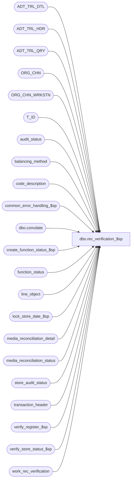

# dbo.rec_verification_$sp

**Database:** auditworks  
**Server:** bedrockdb01  

## Architecture Diagram



## Table Dependencies

| Referenced Table |
|---|
| ADT_TRL_DTL |
| ADT_TRL_HDR |
| ADT_TRL_QRY |
| ORG_CHN |
| ORG_CHN_WRKSTN |
| T_ID |
| audit_status |
| balancing_method |
| code_description |
| common_error_handling_$sp |
| dbo.convdate |
| create_function_status_$sp |
| function_status |
| line_object |
| lock_store_date_$sp |
| media_reconciliation_detail |
| media_reconciliation_status |
| store_audit_status |
| transaction_header |
| verify_register_$sp |
| verify_store_status_$sp |
| work_rec_verification |

## Stored Procedure Code

```sql
create proc dbo.rec_verification_$sp 
@process_id  		binary(16),
@user_id		int,
@verified		tinyint,
@ADT_CMNT		nvarchar(255),
@errmsg			nvarchar(2000) OUTPUT,
@status			tinyint = 1
 
AS

 /* 
PROC NAME: rec_verification_$sp
     DESC: To log verified / unverified balancing entries to audit trail and update audit_status.
           Called by frontend media rec screen.

HISTORY:
Date     Name         Def#  Desc
Aug23,13 Paul       145958  look at returned code when calling lock_store_date_$sp, use try .. catch
Jan18,12 Vicci      132439  Remove references to CRDM user-defined string datatypes from S/A since CRDM is not changing them to support unicode.
Nov26,07 Paul        95520  handle null in CMPTR_NAME
May15,07 Paul      DV-1363  apply 1-3O4563 to SA5
Oct07,05 Paul        60703  default @status to 1, set nocount on for performance
Jun22,05 Paul      DV-1282  receive @ADT_CMNT and log in to ADT_TRL_HDR
Jun13,05 Paul      DV-1273  corrected audit trail logic
Jan10,05 Paul      DV-1191  added nocount, nolock hints
Dec01,04 Paul      DV-1181  log null resource name to audit trail header since no useful info can be logged
Sep20,04 Maryam    DV-1146  Use user_id.
Aug30,04 Maryam    DV-1120  Use convdate function for dates when logging the audit trail, change audit trail query key
Apr20,04 Maryam    DV-1071  change the order of pass in parameters. pass the @process_id to the sub procs.
                            modify the call to lock_store_date_$sp as it no longer outputs the user name.
May15,07 Paul     1-3O4563  added nolock hints, moved where clause to improve query plan
Dec29,03 Paul      DV-1007  removed select into, call lock_store_date_$sp with function_no, removed begin tran,
				added process_id to where clauses
Jul24,03 Paul        11627  added index hints
Jun04,03 Winnie	      9250  Media Reconciliation enhancements.	

*/

DECLARE
  @errno			int,
  @message_id			int,
  @object_name			nvarchar(255),
  @operation_name		nvarchar(100),
  @process_name			nvarchar(100),
  @rows				integer,
  @function_no			integer,
  @store_no			int,
  @register_no			smallint,
  @sales_date			smalldatetime,
  @sep				nchar(1),
  @rec_verified			tinyint,
  @prev_store_no		int,
  @prev_date			smalldatetime,
  @cursor_open			tinyint,
  @entry_datetime		smalldatetime,
  @ret				int,
  @skip_flag			int,
  @lock_count			int,
  @TBL_NAME			nvarchar(255),
  @TBL_KEY			nvarchar(255),
  @TBL_KEY_RSRC_NAME		nvarchar(255),
  @TBL_KEY_RSRC_PRMS		nvarchar(255),
  @ENTRY_ID			T_ID,
  @clmn_name			nvarchar(255)

SET NOCOUNT ON;

SELECT @process_name     = 'rec_verification_$sp',
       @message_id       = 201068,
       @prev_store_no    = -1,
       @prev_date	 = '01/01/1970',
       @entry_datetime   = getdate(),
       @function_no 	 = 72 - @verified,
       @ret		 = 0,
       @skip_flag	 = 0,
       @lock_count	 = 0,
       @ENTRY_ID	 = NEWID(),
       @TBL_KEY		 = NULL,
       @TBL_KEY_RSRC_PRMS = NULL,
       @clmn_name	 = 'AUDIT_ACTIVITY_FLAG',
       @sep = nchar(12), -- audit trail seperator
       @operation_name = 'SELECT';

BEGIN TRY

SELECT @TBL_NAME = 'MEDIA_RECONCILIATION_DETAIL',
       @TBL_KEY_RSRC_NAME = 'TK_STOR_WORK_NO_TRAN_DATE_TRAN_SERI_TRAN_NO_TEND_GROU_RECO_TYPE_BALA_METH_BALA_ENTI';

IF @status = 2 /* error recovery : unlock last processed store-date and resume processing */
  BEGIN 
      SELECT @errmsg = 'Failed to select from function_status.',
        @object_name = 'function_status',
        @operation_name = 'SELECT';
    SELECT @store_no = store_no,
           @sales_date = transaction_date,
           @ADT_CMNT = ADT_CMNT
      FROM function_status
     WHERE user_id = @user_id
       AND process_id = @process_id
       AND function_no = @function_no;

      SELECT @errmsg = 'Failed to update store_audit_status.',
        @object_name = 'store_audit_status',
        @operation_name = 'UPDATE';
    UPDATE store_audit_status
       SET update_in_progress = 0
     WHERE store_no = @store_no
       AND sales_date = @sales_date
       AND date_reject_id = 0
       AND update_in_progress IN (71,72);   
  END;

IF @status = 1
BEGIN
     SELECT @errmsg = 'Failed to execute stored proc create_function_status_$sp',
       @object_name = 'create_function_status_$sp',
       @operation_name = 'EXECUTE';

  EXEC create_function_status_$sp @process_id, @user_id, @function_no, 0, @errmsg OUTPUT;
      
  IF @ADT_CMNT IS NOT NULL
    BEGIN
       SELECT @errmsg = 'Failed to set ADT_CMNT.',
         @object_name = 'function_status',
         @operation_name = 'UPDATE';
     UPDATE function_status
       SET ADT_CMNT = @ADT_CMNT
      WHERE process_id = @process_id
        AND user_id = @user_id
        AND function_no = @function_no;
    END;

     SELECT @errmsg = 'Failed to set new_audit_activity_flag.',
            @object_name = 'work_rec_verification',
            @operation_name = 'UPDATE';
  IF @verified = 1
    BEGIN
     UPDATE work_rec_verification
       SET new_audit_activity_flag	= 20 + audit_activity_flag%10
      WHERE process_id = @process_id;
    END;
  ELSE
    BEGIN
     UPDATE work_rec_verification
       SET new_audit_activity_flag	= audit_activity_flag - 10
      WHERE process_id = @process_id;
    END;

     SELECT @errmsg = 'Failed to set old_activity_descr.';
  UPDATE work_rec_verification
    SET old_activity_descr = c.code_display_descr
    FROM work_rec_verification w, code_description c
   WHERE process_id = @process_id
     AND w.audit_activity_flag = c.code
     AND c.code_type = 79;

     SELECT @errmsg = 'Failed to set new_activity_descr.';
  UPDATE work_rec_verification
    SET new_activity_descr = c.code_display_descr
    FROM work_rec_verification w, code_description c
   WHERE process_id = @process_id
     AND w.new_audit_activity_flag = c.code
     AND c.code_type = 79;

      SELECT @errmsg = 'Unable to insert audit trail header.',
             @object_name = 'ADT_TRL_HDR',
             @operation_name = 'INSERT';
  INSERT ADT_TRL_HDR (
	ENTRY_ID,
	ENTRY_DATE_TIME,
	USER_ID,
	APP_ID,
	ROOT_TBL_NAME,
	ROOT_TBL_KEY,
	ROOT_TBL_KEY_RSRC_NAME,
	ROOT_TBL_KEY_RSRC_PRMS,
	FNCTN_NUM,
	ADT_CMNT)
  SELECT
	@ENTRY_ID,
	getdate(),
	@user_id,
	300,
	@TBL_NAME,
	null, -- log root_tbl_key as null since could affect multiple store/reg/date (BA recommendation)
	null, -- no meaningful ROOT_TBL_KEY_RSRC_NAME for header
	null,
	CONVERT(nvarchar, @function_no),
	@ADT_CMNT;

      SELECT @errmsg = 'Unable to insert audit trail detail.',
             @object_name = 'ADT_TRL_DTL';
  INSERT ADT_TRL_DTL (
		ENTRY_ID,
		TBL_NAME,
		TBL_KEY,
		TBL_KEY_RSRC_NAME,
		TBL_KEY_RSRC_PRMS,
		ACTN_CODE,
		CLMN_NAME,
		OLD_VAL,
		NEW_VAL)
  SELECT DISTINCT
	@ENTRY_ID,
	@TBL_NAME,
	CONVERT(nvarchar,ms.store_no) + @sep + CONVERT(nvarchar,ms.register_no) + @sep
	 + dbo.convdate(h.transaction_date) + @sep + h.transaction_series + @sep
	 + CONVERT(nvarchar,h.transaction_no) + @sep + CONVERT(nvarchar,ms.rec_group_line_object) + @sep
	 + CONVERT(nvarchar,ms.rec_type) + @sep + CONVERT(nvarchar,ms.balancing_method) + @sep
	 + CONVERT(nvarchar,ms.display_balancing_entity),
	@TBL_KEY_RSRC_NAME,
	CONVERT(nvarchar, ms.store_no) + ' - ' + oc.ORG_CHN_NAME + @sep
	+ CONVERT(nvarchar,ms.register_no) + ' - ' + COALESCE(ow.CMPTR_NAME,' ') + @sep
	+ dbo.convdate(h.transaction_date) + @sep + h.transaction_series + @sep
	+ CONVERT(nvarchar,h.transaction_no) + @sep + lo.line_object_description + @sep
	+ c.code_display_descr + @sep + bm.balancing_method_description + @sep
	+ ms.display_balancing_entity_descr,
	'M',
	@clmn_name,
	w.old_activity_descr,
	w.new_activity_descr
   FROM work_rec_verification w WITH (NOLOCK), media_reconciliation_status ms WITH (NOLOCK),
         transaction_header h WITH (NOLOCK), ORG_CHN oc WITH (NOLOCK), balancing_method bm WITH (NOLOCK),
         ORG_CHN_WRKSTN ow WITH (NOLOCK), code_description c WITH (NOLOCK), line_object lo WITH (NOLOCK)
  WHERE w.process_id = @process_id
    AND w.balancing_entity_id = ms.balancing_entity_id
    AND w.rec_id = h.transaction_id
    AND h.store_no = oc.ORG_CHN_NUM
    AND oc.ORG_CHN_NUM = ow.ORG_CHN_NUM
    AND h.register_no = ow.WRKSTN_NUM
    AND ms.balancing_method = bm.balancing_method
    AND ms.rec_type = c.code
    AND c.code_type = 82
    AND ms.rec_group_line_object = lo.line_object;

      SELECT @errmsg = 'Unable to insert audit trail query (query key #1 from).',
             @object_name = 'ADT_TRL_QRY';
  INSERT ADT_TRL_QRY (
	ENTRY_ID,
	QRY_KEY_NUM,
	KEY_PART_VAL_1,
	KEY_PART_VAL_2,
	KEY_PART_VAL_3,
	KEY_PART_VAL_4,
	KEY_PART_VAL_5,
	KEY_PART_VAL_6,
	KEY_PART_VAL_7,
	KEY_PART_VAL_8)
  SELECT DISTINCT
	@ENTRY_ID,
	301,
	CONVERT(nvarchar, h.store_no),
	CONVERT(nvarchar, h.register_no),	
	dbo.convdate(h.transaction_date),
	CONVERT(nvarchar, h.till_no),
	CONVERT(nvarchar, h.transaction_no),
	h.transaction_series,
	CONVERT(nvarchar, h.cashier_no),
	CONVERT(nvarchar, h.transaction_id)
    FROM work_rec_verification w WITH (NOLOCK), transaction_header h WITH (NOLOCK)
   WHERE w.process_id = @process_id
     AND w.rec_id = h.transaction_id;

 BEGIN TRAN;

 IF @verified = 1
    BEGIN
          SELECT @errmsg = 'Failed to update media_reconciliation_detail for verify.',
                 @object_name = 'media_reconciliation_detail',
                 @operation_name = 'UPDATE';
      UPDATE media_reconciliation_detail
         SET audit_activity_flag	= 20 + m.audit_activity_flag%10
        FROM work_rec_verification w WITH (NOLOCK),
             media_reconciliation_detail m WITH (INDEX = media_reconciliation_detail_x1)
       WHERE w.process_id = @process_id
         AND w.rec_id = m.rec_id
         AND w.balancing_entity_id = m.balancing_entity_id
         AND issue_flag = 4
         AND m.audit_activity_flag < 20;
    END;
 ELSE
    BEGIN
          SELECT @errmsg = 'Failed to update media_reconciliation_detail for unverify.';
      UPDATE media_reconciliation_detail
         SET audit_activity_flag	= m.audit_activity_flag - 10
        FROM work_rec_verification w WITH (NOLOCK),
             media_reconciliation_detail m WITH (INDEX = media_reconciliation_detail_x1)
       WHERE w.process_id = @process_id
         AND w.rec_id = m.rec_id
         AND w.balancing_entity_id = m.balancing_entity_id
         AND m.audit_activity_flag >= 20;
    END;

    SELECT @status = 2;
       SELECT @errmsg = 'Failed to update function_status to 2',
               @object_name = 'function_status',
               @operation_name = 'UPDATE';
    UPDATE function_status
       SET status = @status
     WHERE user_id = @user_id
       AND process_id = @process_id 
       AND function_no = @function_no;

    COMMIT; 
END; -- If @status = 1

IF @status =  2 
  BEGIN
        SELECT @errmsg = 'Failed to create table #rec_verification.',
               @object_name = '#rec_verification',
               @operation_name = 'CREATE';
    CREATE TABLE #rec_verification (
	  rec_store_no         int           null,
	  reconciliation_date  smalldatetime null,
	  rec_register_no      smallint      null,
	  media_rec_verified   tinyint       not null,
	  verified             smallint      not null);

        SELECT @errmsg = 'Failed to insert #rec_verification.',
               @operation_name = 'INSERT';
    INSERT #rec_verification (
	  rec_store_no,
	  reconciliation_date,
	  rec_register_no,
	  media_rec_verified,
	  verified )
    SELECT w.rec_store_no,
	  w.reconciliation_date,
	  w.rec_register_no,
	  a.media_rec_verified,
	  MIN(SIGN(1+ SIGN(d.audit_activity_flag -20)))
      FROM work_rec_verification w WITH (NOLOCK)
       INNER JOIN audit_status a WITH (NOLOCK)
          ON (w.process_id = @process_id
         AND w.reconciliation_date = a.sales_date
         AND w.rec_store_no = a.store_no
         AND w.rec_register_no = a.register_no
         AND a.date_reject_id = 0
         AND a.audit_status >= 100
         AND a.audit_status < 400)
       INNER JOIN media_reconciliation_detail d WITH (INDEX = media_reconciliation_detail_x0 NOLOCK)
          ON (w.reconciliation_date = d.transaction_date
         AND w.rec_store_no = d.store_no
         AND w.rec_register_no = d.register_no
         AND w.reconciliation_date = d.rec_date
         AND d.issue_flag = 4
         AND d.rec_side = 1)
    GROUP BY w.rec_store_no, w.reconciliation_date, w.rec_register_no, a.media_rec_verified
    HAVING MIN(SIGN(1+ SIGN(d.audit_activity_flag -20))) <> a.media_rec_verified;


        SELECT @errmsg = 'Unable to open cursor update_audit_status_crsr',
               @object_name = 'update_audit_status_crsr',
               @operation_name = 'OPEN';
    DECLARE update_audit_status_crsr CURSOR FAST_FORWARD
    FOR
    SELECT
  	  rec_store_no,
	  rec_register_no,
	  reconciliation_date,
	  verified
     FROM #rec_verification WITH (NOLOCK)
    ORDER BY rec_store_no, reconciliation_date;

    OPEN update_audit_status_crsr;
    SELECT @cursor_open = 1;

    FETCH update_audit_status_crsr INTO
          @store_no,
          @register_no,
          @sales_date,
          @rec_verified;

    WHILE @@fetch_status = 0
    BEGIN
      IF @prev_store_no <> @store_no OR @prev_date <> @sales_date
        BEGIN
              SELECT @errmsg = 'Failed to update function_status',
                     @object_name = 'function_status',
                     @operation_name = 'UPDATE';
          SELECT @prev_store_no = @store_no,
                 @prev_date = @sales_date,
                 @skip_flag = 0;
            
          UPDATE function_status
             SET store_no = @store_no,
                 transaction_date = @sales_date
           WHERE user_id = @user_id
             AND process_id = @process_id 
             AND function_no = @function_no;

	     SELECT @errmsg = 'Failed to lock the store/date',
	       @object_name = 'lock_store_date_$sp',
		@operation_name = 'EXECUTE';
          EXEC lock_store_date_$sp @process_id, @user_id, @store_no, @sales_date, 0, @function_no, @message_id OUTPUT;

          IF @message_id = 201550
            SELECT @ret = 1,
	          @lock_count = @lock_count + 1,
	          @skip_flag = 1;

          END; -- IF @prev_store_no <> @store_no OR @prev_date <> @sales_date

      IF @ret = 0 AND @skip_flag = 0
        BEGIN
            SELECT @errmsg = 'Failed to update audit_status',
		  @object_name = 'audit_status',
                   @operation_name = 'UPDATE';

          UPDATE audit_status
             SET audit_status = 100,
                 status_date  = @entry_datetime,
                 media_rec_verified = @rec_verified
           WHERE store_no        = @store_no
             AND register_no     = @register_no
             AND sales_date      = @sales_date
             AND date_reject_id  = 0;

              SELECT @errmsg = 'Failed to execute stored procedure verify_register_$sp.',
                     @object_name = 'verify_register_$sp',
                     @operation_name = 'EXECUTE';

          EXEC verify_register_$sp @process_id, @user_id, @store_no, @register_no, @sales_date, 0,
	        @errmsg OUTPUT, 0; -- do not call verify_store_status

        END; -- @ret = 0 AND @skip_flag = 0

      FETCH update_audit_status_crsr INTO
            @store_no,
      	    @register_no,
 	    @sales_date,
	    @rec_verified

      IF (@@fetch_status <> 0 OR @prev_store_no <> @store_no OR @prev_date <> @sales_date) AND
         @ret = 0
        BEGIN
	       SELECT @errmsg = 'Failed to execute verify_store_status_$sp',
    	         @object_name = 'verify_store_status_$sp',
  	         @operation_name = 'EXEC';
          EXEC verify_store_status_$sp @process_id, NULL, @prev_store_no, @prev_date, 0, @errmsg OUTPUT, 3;
        END; -- IF @@fetch_status <> 0 ...

    END; -- while @@fetch_status = 0

    SELECT @status = 3;
        SELECT @errmsg = 'Failed to update audit_status to 3',
               @object_name = 'audit_status',
               @operation_name = 'UPDATE';
    UPDATE function_status
      SET status = @status
     WHERE user_id = @user_id
       AND process_id = @process_id
       AND function_no = @function_no;

       SELECT @errmsg = 'Failed to close update_audit_status_crsr',
               @object_name = 'update_audit_status_crsr',
               @operation_name = 'CLOSE';
    CLOSE update_audit_status_crsr;
    DEALLOCATE update_audit_status_crsr;
    SELECT @cursor_open = 0;

       SELECT @errmsg = 'Failed to clean up #rec_verification',
               @object_name = '#rec_verification',
               @operation_name = 'DROP';
    DROP TABLE #rec_verification;

  END; -- If @status =  2

IF @status = 3
  BEGIN
        SELECT @errmsg = 'Failed to delete work_rec_verification',
               @object_name = 'work_rec_verification',
               @operation_name = 'DELETE';

    DELETE FROM work_rec_verification
     WHERE process_id = @process_id;

        SELECT @errmsg = 'Failed to delete audit_status',
               @object_name = 'audit_status',
               @operation_name = 'DELETE';
    DELETE function_status
     WHERE user_id = @user_id
       AND process_id = @process_id
       AND function_no = @function_no;

  END; -- If @status = 3

IF @lock_count > 0
BEGIN
  SELECT @errno = 201571,
	 @errmsg = 'Could not process all data. Some store-dates were in use.';
  GOTO business_error;
END;

SET NOCOUNT OFF
RETURN;

business_error:
	SELECT @message_id = @errno;

	/* cursor is already closed */
	SET NOCOUNT OFF;

	EXEC common_error_handling_$sp @function_no, @errno, @errmsg, 0, @message_id, 
	@process_name, @object_name, @operation_name, 0, 1, 0, null, 0, null, null, null,
	  null, null, null, 0, @process_id, @user_id;

	RETURN;

END TRY

BEGIN CATCH; -- trap system errors
    /* common error handling */

        SELECT @errno = ERROR_NUMBER(),
		@errmsg = COALESCE(@errmsg, ' ') + ERROR_MESSAGE();

	IF @cursor_open = 1
	  BEGIN
		CLOSE update_audit_status_crsr;
		DEALLOCATE update_audit_status_crsr;
		SELECT @cursor_open = 0;
	  END;
	SET NOCOUNT OFF;

	EXEC common_error_handling_$sp @function_no, @errno, @errmsg, 0, @message_id, 
	@process_name, @object_name, @operation_name, 0, 1, 0, null, 0, null, null, null,
	  null, null, null, 0, @process_id, @user_id;

	RETURN;
END CATCH;
```

