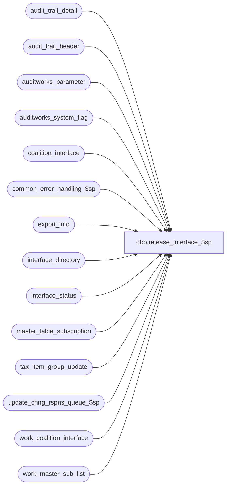

# dbo.release_interface_$sp

**Database:** auditworks  
**Server:** bedrockdb01  

## Architecture Diagram



## Table Dependencies

| Referenced Table |
|---|
| audit_trail_detail |
| audit_trail_header |
| auditworks_parameter |
| auditworks_system_flag |
| coalition_interface |
| common_error_handling_$sp |
| export_info |
| interface_directory |
| interface_status |
| master_table_subscription |
| tax_item_group_update |
| update_chng_rspns_queue_$sp |
| work_coalition_interface |
| work_master_sub_list |

## Stored Procedure Code

```sql
create proc dbo.release_interface_$sp @interface_id                    tinyint,
@clear_outstanding_export_tasks  tinyint = 0,  --0 = don't clear (just removes hold, any outstanding requests would get executed), 1=clear (turns off posting request if any), 2=clear and request full download
@process_id                      binary(16),
@user_id                         int

AS

/* Proc Name: release_interface_$sp
   DESC: To release an ad-hoc interface after the user has placed it on hold
         Called by Front-End.
   

HISTORY
Date     Name    Defect# Desc
Oct07,14 Vicci TFS-87015 Since 'TAX_DEFAULT_EXCEPT_MERGE' reference is too big to fit in code_description.alpha_code, use 'TAX_DFLT_EXCPT_MERGE' instead.
Sep29,14 Vicci     86335 Remove reliance on SET ANSI_NULLS being ON.
Jun16,14 Vicci TFS-75199 If Edit execution of tax default exception merge has been disabled and we are releasing a hold of an interface that subscribes 
                         to taxability changes (and interface 16=Coaltion is inactive and won't be doing the merge itself), then request a merge execution (note that the merge will simply return if no taxability changes were
                         actually made).
Mar20,13 Vicci    142035 Log function to old audit trail since UI will not do so until 5.1.
Mar08,13 Vicci    142400 If a clear-and-full-export has been requested, set immediate_posting_requested to 4 in the case of Coalition.
Feb26,13 Vicci    142088 To avoid deadlocks, lock a shared flag prior to work_master_sub_list deletions.
Apr07,11 Vicci    126078 Take master_table_subscription active flag into account.
Sep14,06 Tim       70648 Add user_id and process_id to input parameters and common error handling
MAR24,06 Vicci	   68918 author
*/


DECLARE
@errmsg				nvarchar(2000),
@errno				INT,
@process_no			int,
@process_name		        nvarchar(100),
@message_id		        int,	
@object_name			nvarchar(255),
@operation_name			nvarchar(255),
@release_datetime		datetime,
@table_key_descr		nvarchar(255),
@rows				int,
@entry_id 			numeric(12,0) ,
@immediate_posting_requested	tinyint, 
@last_retrieval_datetime	datetime,
@retrieval_in_progress		tinyint,
@hold_datetime			datetime,
@new_immediate_post_requested	tinyint, 
@new_last_retrieval_datetime	datetime,
@new_retrieval_in_progress	tinyint,
@new_hold_datetime		datetime

SET CONCAT_NULL_YIELDS_NULL OFF

SELECT @process_name = 'release_interface_$sp',
       @process_no = 0,
       @message_id = 201068,
       @process_id = @@spid,
       @object_name = 'unknown',
       @operation_name = 'unknown',
       @release_datetime = getdate()

SET NOCOUNT ON

SELECT @table_key_descr = interface_description
  FROM interface_directory
 WHERE interface_id = @interface_id
SELECT @errno = @@error
IF @errno <> 0
BEGIN
  SELECT @errmsg = 'Unable to obtain description of interface',
         @object_name = 'interface_directory',
         @operation_name = 'SELECT'
  GOTO error
END    

SELECT @immediate_posting_requested = immediate_posting_requested,
       @last_retrieval_datetime = last_retrieval_datetime,
       @retrieval_in_progress = retrieval_in_progress,
       @hold_datetime = hold_datetime
  FROM interface_status
 WHERE interface_id = @interface_id
SELECT @errno = @@error
IF @errno <> 0
BEGIN
  SELECT @errmsg = 'Unable to obtain prior values of interface_status',
         @object_name = 'interface_status',
         @operation_name = 'SELECT'
  GOTO error
END    
 
BEGIN TRY
INSERT into audit_trail_header(
       entry_date,
       table_name,
       table_key,
       table_key_descr,
       user_name,
       action,
       function_no)
VALUES(@release_datetime,
       'interface_status',
       @interface_id,
       COALESCE(@table_key_descr, convert(nvarchar, @interface_id)), 
       COALESCE(CONVERT(nvarchar, @user_id), suser_sname()),
       2,
       209)
SELECT @entry_id = @@identity
END TRY
BEGIN CATCH
  SELECT @errno = ERROR_NUMBER(), @errmsg = ERROR_MESSAGE()
IF @errno != 0
BEGIN
  SELECT @errmsg = @errmsg + ' -Unable log release of export hold to audit trail header',
         @object_name = 'audit_trail_header',
         @operation_name = 'INSERT'
  GOTO error
END           
END CATCH

BEGIN TRY
INSERT into audit_trail_detail(
       entry_id,
       column_name,
       before_value,
       after_value,
       before_description,
       after_description)
VALUES(@entry_id,
	   'clear_outstanding_export_tasks', 
       convert(nvarchar, @clear_outstanding_export_tasks),
       convert(nvarchar, @clear_outstanding_export_tasks),
       convert(nvarchar, @clear_outstanding_export_tasks),
       convert(nvarchar, @clear_outstanding_export_tasks))
END TRY
BEGIN CATCH
  SELECT @errno = ERROR_NUMBER(), @errmsg = ERROR_MESSAGE()
IF @errno != 0
BEGIN
  SELECT @errmsg = @errmsg + ' -Unable log release of export hold to audit trail detail -@clear_outstanding_export_tasks, for entry_id:  ' + convert(nvarchar, @entry_id) ,
         @object_name = 'audit_trail_detail',
         @operation_name = 'INSERT'
  GOTO error
END           
END CATCH

IF @clear_outstanding_export_tasks >= 1
BEGIN
  DELETE export_info
   WHERE interface_id = @interface_id 
  SELECT @errno = @@error
  IF @errno <> 0
  BEGIN
    SELECT @errmsg = 'Unable to abort current export',
           @object_name = 'export_info',
           @operation_name = 'DELETE'
    GOTO error
  END    

  UPDATE master_table_subscription
     SET export_status = 0, 
         last_export_datetime = last_modification_datetime
   WHERE interface_id = @interface_id
     AND export_status <> 0
     AND active_flag > 0
  SELECT @errno = @@error
  IF @errno <> 0
  BEGIN
    SELECT @errmsg = 'Unable to reset export status in master_table_subscription',
           @object_name = 'master_table_subscription',
           @operation_name = 'UPDATE'
    GOTO error
  END    

  UPDATE master_table_subscription
     SET last_retrieval_datetime = (SELECT MAX(last_modified_date_time) 
                                      FROM tax_item_group_update)
   WHERE update_timing > 0
     AND table_name = 'tax_item_group_update'
     AND last_retrieval_datetime < last_modification_datetime
     AND interface_id = @interface_id
     AND active_flag > 0
  SELECT @errno = @@error
  IF @errno <> 0
  BEGIN
    SELECT @errmsg = 'Unable to reset last_retrieval_datetime in master_table_subscription',
           @object_name = 'master_table_subscription',
           @operation_name = 'UPDATE'
    GOTO error
  END    

  UPDATE interface_status
     SET immediate_posting_requested = 0,
         last_retrieval_datetime = last_posting_datetime,
         retrieval_in_progress = 0
   WHERE interface_id = @interface_id
     AND (immediate_posting_requested <> 0 
          OR last_retrieval_datetime < last_posting_datetime
          OR retrieval_in_progress = 1)
  SELECT @errno = @@error
  IF @errno <> 0
  BEGIN
    SELECT @errmsg = 'Unable to cancel immediate-posting-request',
           @object_name = 'interface_status',
           @operation_name = 'UPDATE'
    GOTO error
  END    

  BEGIN TRANSACTION  --142088
  /* Prevent possible deadlocks when audit trail published change retraction deletion and this export 
     simultaneously attempt to clean up the same work_master_sublist rows, by updating a shared system flag. */ 
  UPDATE auditworks_system_flag
     SET flag_datetime_value = @release_datetime
   WHERE flag_name = 'work_master_sublist_access'
  SELECT @errno = @@error
  IF @errno != 0 
  BEGIN
    SELECT @errmsg = 'Set flag to force concurrent processes to run sequentially',
           @object_name = 'auditworks_system_flag',
           @operation_name = 'UPDATE'
    GOTO error
  END

  DELETE work_master_sub_list
   WHERE interface_id = @interface_id
  SELECT @errno = @@error
  IF @errno <> 0
BEGIN
    SELECT @errmsg = 'Unable to clear list of master table maintenance entries to be exported',
           @object_name = 'work_master_sub_list',
           @operation_name = 'UPDATE'
    GOTO error
  END    
COMMIT

  IF @interface_id = 16
  BEGIN
    TRUNCATE table coalition_interface
    SELECT @errno = @@error
    IF @errno <> 0
    BEGIN
      SELECT @errmsg = 'Unable to clear formatted Coalition export data waiting to be exported',
             @object_name = 'coalition_interface',
             @operation_name = 'TRUNCATE'
      GOTO error
    END    
  
    TRUNCATE table work_coalition_interface
        SELECT @errno = @@error
    IF @errno <> 0
    BEGIN
      SELECT @errmsg = 'Unable to clear formatted Coalition export data for next runtime waiting to be exported',
             @object_name = 'work_coalition_interface',
             @operation_name = 'TRUNCATE'
      GOTO error
    END    

  END

IF @clear_outstanding_export_tasks = 2
BEGIN
  UPDATE interface_status
     SET immediate_posting_requested = CASE WHEN @interface_id = 16 THEN 4 ELSE 1 END
   WHERE interface_id = @interface_id
  SELECT @errno = @@error
  IF @errno <> 0
  BEGIN
    SELECT @errmsg = 'Unable to request full download',
           @object_name = 'interface_status',
           @operation_name = 'UPDATE'
    GOTO error
  END    
END

END  --IF @clear_outstanding_export_tasks >= 1

UPDATE interface_status
   SET hold_datetime = null
 WHERE interface_id = @interface_id
   AND hold_datetime IS NOT null
SELECT @errno = @@error
IF @errno <> 0
BEGIN
  SELECT @errmsg = 'Unable to cancel hold',
         @object_name = 'interface_status',
         @operation_name = 'UPDATE'
  GOTO error
END    

SET NOCOUNT OFF

SELECT @new_immediate_post_requested = immediate_posting_requested,
       @new_last_retrieval_datetime = last_retrieval_datetime,
       @new_retrieval_in_progress = retrieval_in_progress,
       @new_hold_datetime = hold_datetime
  FROM interface_status
 WHERE interface_id = @interface_id
SELECT @errno = @@error
IF @errno <> 0
BEGIN
  SELECT @errmsg = 'Unable to obtain prior values of interface_status',
         @object_name = 'interface_status',
         @operation_name = 'SELECT'
  GOTO error
END    
 
--Note:  log columns even if they did not change because we want to know what they were set to at the time of the release.
BEGIN TRY
  INSERT into audit_trail_detail(
       entry_id,
       column_name,
       before_value,
       after_value,
       before_description,
       after_description)
  VALUES(@entry_id,
       'immediate_posting_requested', 
       convert(nvarchar, @immediate_posting_requested),
       convert(nvarchar, @new_immediate_post_requested),
       convert(nvarchar, @immediate_posting_requested),
       convert(nvarchar, @new_immediate_post_requested))
END TRY
BEGIN CATCH
  SELECT @errno = ERROR_NUMBER(), @errmsg = ERROR_MESSAGE()
IF @errno != 0
BEGIN
  SELECT @errmsg = @errmsg + ' -Unable log release of export hold to audit trail detail -immediate_posting_requested, for entry_id:  ' + convert(nvarchar, @entry_id) ,
         @object_name = 'audit_trail_detail',
         @operation_name = 'INSERT'
  GOTO error
END           
END CATCH

BEGIN TRY
  INSERT into audit_trail_detail(
       entry_id,
       column_name,
       before_value,
       after_value,
       before_description,
       after_description)
  VALUES(@entry_id,
       'retrieval_in_progress', 
       convert(nvarchar, @retrieval_in_progress),
       convert(nvarchar, @new_retrieval_in_progress),
       convert(nvarchar, @retrieval_in_progress),
       convert(nvarchar, @new_retrieval_in_progress))
END TRY
BEGIN CATCH
  SELECT @errno = ERROR_NUMBER(), @errmsg = ERROR_MESSAGE()
IF @errno != 0
BEGIN
  SELECT @errmsg = @errmsg + ' -Unable log release of export hold to audit trail detail -retrieval_in_progress, for entry_id:  ' + convert(nvarchar, @entry_id) ,
         @object_name = 'audit_trail_detail',
         @operation_name = 'INSERT'
  GOTO error
END           
END CATCH
  
BEGIN TRY
  INSERT into audit_trail_detail(
       entry_id,
       column_name,
    before_value,
       after_value,
       before_description,
after_description)
  VALUES(@entry_id,
       'last_retrieval_datetime', 
       convert(nvarchar, @last_retrieval_datetime),
       convert(nvarchar, @new_last_retrieval_datetime),
       convert(nvarchar, @last_retrieval_datetime),
       convert(nvarchar, @new_last_retrieval_datetime))
END TRY
BEGIN CATCH
  SELECT @errno = ERROR_NUMBER(), @errmsg = ERROR_MESSAGE()
IF @errno != 0
BEGIN
  SELECT @errmsg = @errmsg + ' -Unable log release of export hold to audit trail detail -last_retrieval_datetime, for entry_id:  ' + convert(nvarchar, @entry_id) ,
         @object_name = 'audit_trail_detail',
         @operation_name = 'INSERT'
  GOTO error
END           
END CATCH

BEGIN TRY
INSERT into audit_trail_detail(
       entry_id,
       column_name,
       before_value,
       after_value,
       before_description,
       after_description)
VALUES(@entry_id,
       'hold_datetime', 
       convert(nvarchar, @hold_datetime),
       convert(nvarchar, @new_hold_datetime),
       convert(nvarchar, @hold_datetime),
       convert(nvarchar, @new_hold_datetime))
END TRY
BEGIN CATCH
  SELECT @errno = ERROR_NUMBER(), @errmsg = ERROR_MESSAGE()
IF @errno != 0
BEGIN
  SELECT @errmsg = @errmsg + ' -Unable log release of export hold to audit trail detail -hold_datetime, for entry_id:  ' + convert(nvarchar, @entry_id) ,
         @object_name = 'audit_trail_detail',
         @operation_name = 'INSERT'
  GOTO error
END           
END CATCH


IF EXISTS (SELECT 1
	     FROM auditworks_parameter
	    WHERE par_name = 'disable_edit_tax_merge'
	      AND par_value = '1') 
  AND
   EXISTS (SELECT 1
	     FROM master_table_subscription  --i.e. the interface being released subscribes to items affecting the tax default exception merge
	    WHERE interface_id = @interface_id
	      AND table_name IN ('line_object.tax_item_group_id', 'tax_default', 'tax_item_group.line_object', 'taxability_by_item_group')) 
  AND (   @interface_id <> 16  --i.e. will not be running the merge itself since only Coalition does
       OR EXISTS (SELECT 1
	            FROM interface_directory  --i.e. the interface being released is 16 but is not active and will therefore not be running the merge itself
	            WHERE interface_id = @interface_id
	              AND update_timing = 0)
       )
BEGIN
  EXEC update_chng_rspns_queue_$sp 'TAX_DFLT_EXCPT_MERGE'   --ask the revalidation process to run the merge.
  SELECT @errno = @@error
  IF @errno != 0
  BEGIN
    SELECT @errmsg = 'Unable to execute update_chng_rspns_queue_$sp.'  
    GOTO error
  END
END

RETURN

error:
            EXEC common_error_handling_$sp @process_no, @errno, @errmsg, 0, @message_id,
            @process_name, @object_name, @operation_name, 0, 1, 0, null, 0, null, null, null,
            null, null, null, 0, @process_id, @user_id
            RETURN
```

