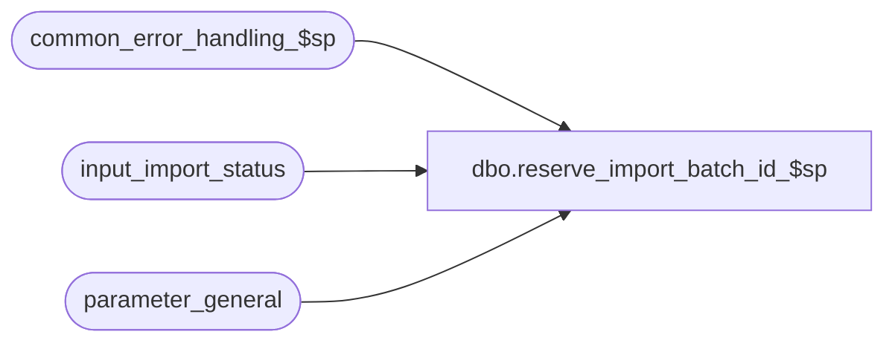

# dbo.reserve_import_batch_id_$sp

**Database:** auditworks  
**Server:** bedrockdb01  

## Architecture Diagram



## Table Dependencies

| Referenced Table |
|---|
| common_error_handling_$sp |
| input_import_status |
| parameter_general |

## Stored Procedure Code

```sql
create proc dbo.reserve_import_batch_id_$sp ( @import_batch_id numeric(12,0) OUTPUT, --identifies the batch of reservations, fulfillments, cancellations about to be interfaced
  @process_no   smallint = 228,  --228=Customer Liability Posting (see import_preloaded_input_$sp)
  @errmsg	nvarchar(255) = NULL OUTPUT)
AS

/* Name: reserve_import_batch_id_$sp
   Desc: This procedure inserts into the input_import_status and returns the new import_batch_id.
         Called from Enterprise Selling.
         Will raise an error if a S/A application upgrade is in progress.

HISTORY:
Date     Name         Defect#  Desc
Jan05,11 Paul          105313  Use unicode datatypes
Mar30,09 Vicci         109078  author

*/

DECLARE
	@errno				int,
	@message_id			int,
	@object_name			nvarchar(255),
	@operation_name			nvarchar(100),
	@process_name			nvarchar(100),
	@process_start_datetime		datetime,
	@processing_message		nvarchar(255),
	@reference_type			tinyint,
	@register_no			smallint,
	@rows				int,
	@store_no			int,
	@transaction_category		smallint,
	@transaction_series		nchar(1)

SELECT @process_name = 'reserve_import_batch_id_$sp',
       @process_start_datetime = getdate(),
       @message_id = 201068

IF EXISTS ( SELECT 1
	      FROM parameter_general
	     WHERE upgrade_in_progress > 0)
BEGIN
  SELECT @message_id = 201036,
         @errno = 201500,
         @errmsg = 'Request denied.  The S/A database is currently being upgraded.  Please try again later.',
         @object_name = 'reserve_import_batch_id_$sp',
         @operation_name = 'EXEC'
  GOTO error
END

INSERT INTO input_import_status (
	process_start_datetime, 
	process_no, 
	processing_message, 
	status  ) 
VALUES (
	@process_start_datetime, 
	@process_no, 
	@processing_message, 
	-2      )

SELECT @errno = @@error
IF @errno != 0 
BEGIN
  SELECT @errmsg = 'Failed to reserve a data import batch ID',
         @object_name = 'input_import_status',
         @operation_name = 'INSERT'
  GOTO error
END  

SELECT @import_batch_id = @@identity


RETURN

error:

	EXEC common_error_handling_$sp @process_no, @errno, @errmsg, 0, @message_id, 
	@process_name, @object_name, @operation_name, 1

	RETURN
```

