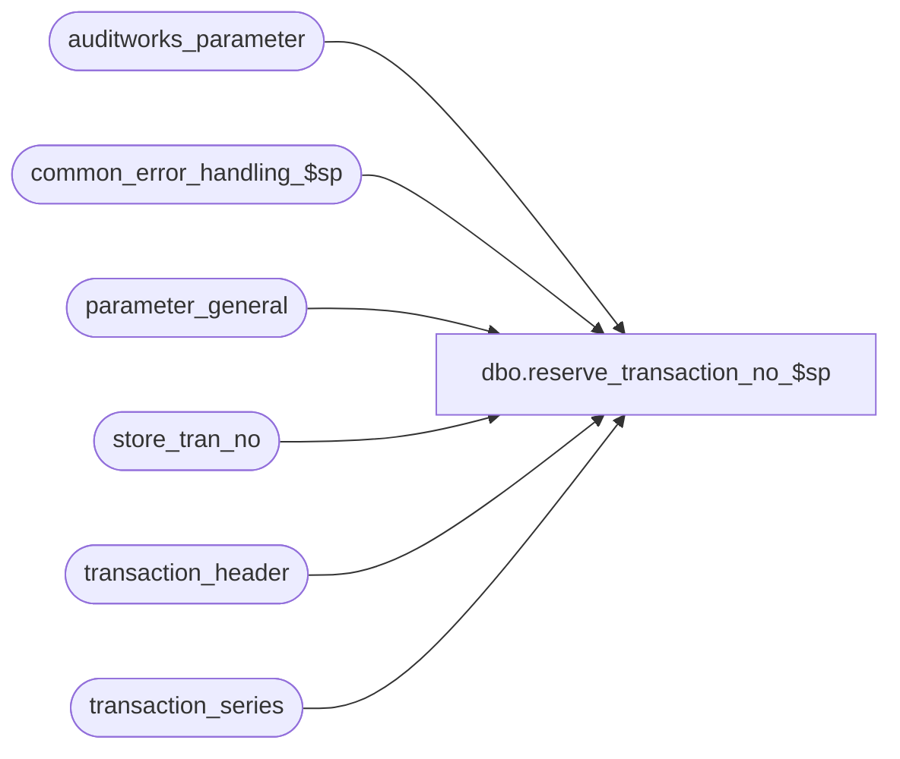

# dbo.reserve_transaction_no_$sp

**Database:** auditworks  
**Server:** bedrockdb01  

## Architecture Diagram



## Table Dependencies

| Referenced Table |
|---|
| auditworks_parameter |
| common_error_handling_$sp |
| parameter_general |
| store_tran_no |
| transaction_header |
| transaction_series |

## Stored Procedure Code

```sql
CREATE proc [dbo].[reserve_transaction_no_$sp] 
  @process_id		binary(16),
  @user_id                 int,
  @process_no              int,
  @store_no                int,
  @register_no             smallint,
  @transaction_series      nchar,
  @trans_qty               int,
  @max_tran_no             int OUTPUT,
  @next_tran_no            int OUTPUT,
  @errmsg	         nvarchar(2000)  OUTPUT,
  @transaction_date        smalldatetime = NULL
  
AS

/* Name: reserve_transaction_no_$sp
   Desc: Find the max transaction no allowed for the transaction_series, also finds
         the next available transaction for the store/register/series in question by looking it 
         up in store_tran_no. This proc must be run only on the consolidated server in a scaleout environment.
         The transaction_series and register_no are passed in but come from the table cust_liab_processing_rule.
         Called from cust_liability_processing_$sp, rec_float_load, and F/E (media rec counts).

HISTORY:
Date     Name          Defect#  Desc
Jan28,14 Paul          147019   Use try catch
Mar16,09 Vicci         106158   Get default @max_tran_no if no override is set in transaction_series table.
Mar27,07 Phu	       84236    Use reject_recurring_trans_number to find next available trans.
Jul07,05 Paul          DV-1295  Added remarks
Sep15,04 IanK          DV-1146  Use user_id
May29,04 Maryam        DV-1071  get @max_tran_no from transaction_series table.
                                modified to receive @process_id as input parameter and 
 			        pass it to the common_error_handling_$sp.
Sep30,03 Maryam        11253/DV-1007  Set @next_tran_no to 1.
Jun03,03 Maryam        9246     Author
*/

DECLARE
	@errmsg2			nvarchar(2000),
	@errline			int,
	@errno			int,
	@iterate_count			int,
	@message_id			int,
	@object_name			nvarchar(255),
	@operation_name			nvarchar(100) ,
	@process_name			nvarchar(100),
	@reject_recurring_trans		tinyint,
	@rows				int,
	@trans_found			int,
	@current_trans_no		int,
	@consecutive_trans_count	int;

  SELECT @process_name = 'reserve_transaction_no_$sp',
         @message_id = 201068,
         @iterate_count = 1,
         @trans_found = 0,
         @consecutive_trans_count = 0,
         @errno = 0;

  BEGIN TRY
    SELECT @errmsg = 'Failed to get reject_recurring_trans_number from auditworks_parameter table ',
           @object_name = 'auditworks_parameter',
           @operation_name = 'SELECT';
  SELECT @reject_recurring_trans = CONVERT(tinyint, ISNULL(MAX(par_value), '0'))
    FROM auditworks_parameter
   WHERE par_name = 'reject_recurring_trans_number';

  -- Find the max_transaction_no allowed
    SELECT @errmsg = 'Failed to get max_transaction_no from transaction_series table ',
           @object_name = 'transaction_series';
  SELECT @max_tran_no = max_tran_num
    FROM transaction_series 
   WHERE transaction_series = @transaction_series;

  IF @max_tran_no IS NULL
    BEGIN
        SELECT @errmsg = 'Failed to get max_transaction_no from parameter general table ',
             @object_name = 'parameter_general';
      SELECT @max_tran_no = max_transaction_no 
        FROM parameter_general; 
    END;

 /* Find the next available transaction for the store/reg/series in question (@next_tran_no) 
    by looking it up in store_tran_no */
      SELECT @errmsg = 'Failed to get next transaction number from store_tran_no',
	@object_name = 'store_tran_no';   
  SELECT @next_tran_no = next_tran_no
    FROM store_tran_no
   WHERE store_no = @store_no
     AND register_no = @register_no
     AND transaction_series = @transaction_series;

  SELECT @rows = @@rowcount;

-- if no row found insert one
  IF @rows = 0
   BEGIN
    SELECT @next_tran_no = 1;
       SELECT @errmsg = 'Failed to insert new values in store_tran_no',
               @object_name = 'store_tran_no',
               @operation_name = 'INSERT';
    INSERT INTO store_tran_no (
           store_no, 
           register_no,
           transaction_series,
           next_tran_no)
    VALUES (@store_no,
            @register_no,
            @transaction_series,
            @next_tran_no);
   END; -- If @rows = 0

  SELECT @current_trans_no = @next_tran_no;

  -- loop at most @max_tran_no to find consecutive transaction numbers that are requested.
  WHILE @iterate_count < @max_tran_no
  BEGIN  
    SELECT @trans_found = 0;

    IF @transaction_date IS NOT NULL --
    BEGIN
      IF @reject_recurring_trans = 0
       BEGIN
        SELECT @errmsg = 'Failed to select transaction_no for transaction_series',
                 @object_name = 'transaction_header',
                 @operation_name = 'SELECT';
        IF EXISTS (SELECT 1 FROM transaction_header
                   WHERE store_no = @store_no
                   AND transaction_date = @transaction_date
                   AND register_no = @register_no
                   AND transaction_no = @current_trans_no
                   AND transaction_series = @transaction_series)
          SELECT @trans_found = 1;  
       END;
      ELSE
       BEGIN
        SELECT @errmsg = 'Failed to select transaction_no without transaction_series',
                 @object_name = 'transaction_header',
                 @operation_name = 'SELECT';
        IF EXISTS (SELECT 1 FROM transaction_header
                   WHERE store_no = @store_no
                   AND transaction_date = @transaction_date
                   AND register_no = @register_no
                   AND transaction_no = @current_trans_no)
          SELECT @trans_found = 1;
       END;
    END; -- else of IF @transaction_date is not null

    -- if transaction already existed, then reset the starting trans.
    IF @trans_found = 1
      BEGIN
       SELECT @next_tran_no = @current_trans_no + 1;
       SELECT @current_trans_no = @next_tran_no, @consecutive_trans_count = 0;
      END;
    ELSE
      SELECT @current_trans_no = @current_trans_no + 1,
             @consecutive_trans_count = @consecutive_trans_count + 1;


    -- if the new transaction number exceeds the @max_tran_no, then reset the starting trans.
    IF @current_trans_no > @max_tran_no AND @consecutive_trans_count < @trans_qty
      BEGIN
       SELECT @next_tran_no = 1;
       SELECT @current_trans_no = @next_tran_no, @consecutive_trans_count = 0;
      END;
            
    IF @consecutive_trans_count >= @trans_qty
      BREAK;
  
    SELECT @iterate_count = @iterate_count + 1;

  END; -- WHILE @iterate_count < @max_tran_no


  -- if all transactions can be reserved then set next_tran_no
  IF @consecutive_trans_count >= @trans_qty
   BEGIN
       SELECT @errmsg = 'Failed to set next_tran_no',
               @object_name = 'store_tran_no',
               @operation_name = 'UPDATE';
    UPDATE store_tran_no
       SET next_tran_no = (@next_tran_no + @trans_qty) - @max_tran_no * (1-SIGN(1+SIGN(@max_tran_no - (@next_tran_no + @trans_qty))))
     WHERE store_no = @store_no 
       AND register_no = @register_no
       AND transaction_series = @transaction_series;

    SELECT @rows = @@rowcount;
    
    IF @rows = 0
      BEGIN
        SELECT @errmsg = 'Unable to determine the max transaction no. Please try again.',
               @message_id = 201677,
               @errno = 201677;
        GOTO business_error;
      END        
   END; -- IF @consecutive_trans_count >= @trans_qty
  ELSE
   BEGIN
    SELECT @errmsg = 'Unable to find consecutive transactions for your request.',
           @message_id = 201677,
           @errno = 201677;
    GOTO business_error;
   END;


RETURN;


business_error:   /* Business Rule handler. */

	SELECT @errmsg2 = @errmsg;

	EXEC common_error_handling_$sp @process_no, @errno, @errmsg, 0, @message_id, 
	  @process_name, @object_name, @operation_name, 0, 1, 0, null, 0, null, null, null,
	  null, null, null, 0, @process_id, @user_id;
	  /* Note: when the exec above raises an error, that action also fires the system error trap (below) */
	RETURN;
END TRY

BEGIN CATCH; -- trap system errors
    /* common error handling. Appending proc name here because a rollback could occur if called within a transaction. */

        SELECT @errno = ERROR_NUMBER(),
		@errline = ERROR_LINE();

        SELECT @errmsg = CONVERT(nvarchar, @errno) + ':' + @process_name + ':' + CONVERT(nvarchar, @errline) + ':'
               + COALESCE(@errmsg, ' ') + ':' + ERROR_MESSAGE();

	 /* this condition will only be true when raise error in traps above fire this general catch */
	IF @errmsg2 IS NOT NULL
	  SELECT @errmsg = @errmsg2;

	EXEC common_error_handling_$sp @process_no, @errno, @errmsg, 0, @message_id, 
	  @process_name, @object_name, @operation_name, 0, 1, 0, null, 0, null, null, null,
	  null, null, null, 0, @process_id, @user_id;
	RETURN;
END CATCH;
```

