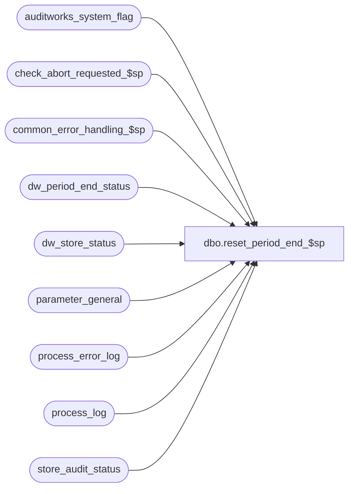

# dbo.reset_period_end_$sp

**Database:** auditworks  
**Server:** bedrockdb01  

## Architecture Diagram



## Table Dependencies

| Referenced Table |
|---|
| auditworks_system_flag |
| check_abort_requested_$sp |
| common_error_handling_$sp |
| dw_period_end_status |
| dw_store_status |
| parameter_general |
| process_error_log |
| process_log |
| store_audit_status |

## Stored Procedure Code

```sql
create proc dbo.reset_period_end_$sp 

AS

/* Proc name:   reset_period_end_$sp
   Description: Reset period_end_status flag to indicate that the period end has been completed. 
		Called by smartload script dayend.ict

   Same version can be used for SA 5.0 and SA 5.1

HISTORY:
Date     Name	        Def# Description
Jan19/15 Paul       TFS-100973 Scaleout: avoid waiting on consolidated (add store_audit_status values 902, 903, 904, 905, 906) to cursor
         Paul         1-4C8RSF Scaleout: avoid waiting on consolidated if a row in dw_store_status has store_status = 1
                                          when store_audit_status is 5/900/901 (a minor integrity error since store_status should be zero).
Jun30/11 Vicci        1-475NTQ Resubmit because version in the repo was missing where clause on the @period_end_requested setting.
Jun09/10 Vicci          117228 Don't reset last date closed / preliminary period end date if period end has not yet
					been run as a result of dayend still having more batches to finish (immediate_dayend_requested = 9).
					Increase timeout to 12 hours since it takes a long time for peripherals to finish dayending
					before they even get to their period end.
May 26/10 Vicci         116866 Check for preliminary period end being NOT null to determine if it has been requested.
					Limit dw_store_status check to dates > last date closed.
					Abort waiting for peripherals if Abort request issued by user.
May 26/10 Vicci         116687 Don't mark period as being closed nor preliminary period-end as being complete if period end failed;
			 		Mark period-end process errors as verified if period-end succeeded.
			 		Wait for period end to complete on peripherals before marking period as been closed on consolidated
			 		since otherwise if one fails the user will not be able to request a period end again.
Apr 19/02 Winnie	     1-CD0IX R3 error handling
Dec 15/99 Henry           5781 Reset the preliminary_period_end_date in parameter_general
Dec 04/99 Kevin B.             author

*/


DECLARE
        @errmsg 			nvarchar(2000),
        @errmsg2			nvarchar(2000),
        @cursor_open		tinyint,
        @errline			int,
        @errno 			int,
        @instance_id                int,
        @message_id		int,	
        @object_name		nvarchar(255),
        @operation_name		nvarchar(100),
        @process_name		nvarchar(100),
        @period_end_failed		tinyint,
        @period_end_requested	tinyint,
        @immediate_dayend_requested tinyint,
        @loop_counter		tinyint,
        @other_streams_incomplete 	tinyint,
        @period_end_date		smalldatetime,
        @scaleout_flag		int,
        @sales_date		smalldatetime,
        @store_no			int,
        @request_time		datetime,
        @rows			int,
        @trace_msg		nvarchar(255),
        @last_date_closed		smalldatetime,
        @process_no 		smallint,
        @process_id		binary(16);
 

SELECT @process_name = 'reset_period_end_$sp',
       @message_id = 201068,
       @period_end_failed = 0,
       @period_end_requested = 0,
       @immediate_dayend_requested = 0,
       @instance_id = NULL,
       @loop_counter = 0,
       @errno = 0,
       @other_streams_incomplete = 1,
       @process_no = 86,
       @process_id = NEWID();

BEGIN TRY

   SELECT @errmsg = 'Failed to select scaleout_flag from auditworks_system_flag',
         @object_name = 'auditworks_system_flag',
         @operation_name = 'SELECT';    
SELECT @scaleout_flag = CONVERT(int,flag_numeric_value)
  FROM auditworks_system_flag
 WHERE flag_name = 'scaleout_flag';

SELECT @rows = @@rowcount;
IF @rows = 0
  GOTO business_error;

   SELECT @errmsg = 'Unable to select from parameter general',
         @object_name = 'parameter_general';
SELECT @period_end_requested = 1,
       @period_end_date = period_end_date,
       @last_date_closed = last_date_closed,
       @immediate_dayend_requested = immediate_dayend_requested 
  FROM parameter_general
 WHERE last_date_closed <> period_end_date OR preliminary_period_end_date IS NOT NULL;


/* scaleout cursor identifies any existing rows in dw_store_status that belong to the current peripheral 
   where the store_status is incorrectly set to 1. */

IF @scaleout_flag = 1 AND @period_end_requested = 1 
    /* check for any store-dates owned by current peripheral that may have store_status set incorrectly to 1
       in dw_store_status and correct them by setting status = 0. Should be uncommon to find such rows. 
       Don't need to check for transactions existing because the dates searched are all <= period_end_date */
  BEGIN
   SELECT @errmsg = 'Failed to select instance_id from auditworks_system_flag',
           @object_name = 'auditworks_system_flag',
	  @operation_name = 'SELECT';
   SELECT @instance_id = CONVERT(int,flag_numeric_value)
     FROM auditworks_system_flag
    WHERE flag_name = 'instance_id';

   IF @instance_id IS NULL
     BEGIN
      SELECT @errmsg = 'Invalid setup. Missing instance_id.';
      GOTO business_error;
     END;

    SELECT @errmsg = 'Failed to open str_date_crsr',
          @object_name = 'str_date_crsr',
          @operation_name = 'OPEN';
   DECLARE str_date_crsr CURSOR FAST_FORWARD
   FOR
   SELECT st.store_no, st.sales_date
    FROM dw_store_status dw, store_audit_status st
   WHERE dw.instance_id = @instance_id
     AND dw.store_status = 1
     AND dw.sales_date > @last_date_closed
     AND dw.sales_date <= @period_end_date
     AND dw.store_no = st.store_no
     AND dw.sales_date = st.sales_date
     AND st.store_audit_status IN (5, 900, 901, 902, 903, 904, 905, 906)
     AND st.date_reject_id = 0
     AND st.sales_date > @last_date_closed
     AND st.sales_date <= @period_end_date
     AND st.sales_date <= DATEADD(dy,-1,getdate()); -- safety check (due to possible simultaneous edit)

   OPEN str_date_crsr;
   SELECT @cursor_open = 1;

   WHILE 3 = 3
    BEGIN
     FETCH str_date_crsr INTO
	@store_no,
	@sales_date;

     IF @@fetch_status <> 0
       BREAK;

      SELECT @errmsg = 'Failed to correct store_status on dw_store_status',
	  @object_name = 'dw_store_status',
	  @operation_name = 'UPDATE';

     UPDATE dw_store_status
	  SET store_status = 0
	 WHERE instance_id = @instance_id 
	   AND sales_date = @sales_date
	   AND store_no   = @store_no
	   AND store_status = 1;

    END; -- while 3=3

    CLOSE str_date_crsr;
    DEALLOCATE str_date_crsr;
    SELECT @cursor_open = 0;

  END; -- If @scaleout_flag = 1 and @period_end_requested = 1


IF @scaleout_flag = 2 AND @period_end_requested = 1 
BEGIN
  /* On consolidated, wait for dayend/period to complete on peripheral servers before marking period as closed.
       Time out to handle aborted dayends. */
    SELECT @errmsg = 'Unable to determine period_end_request_date',
           @object_name = 'auditworks_system_flag',
           @operation_name = 'SELECT';
  SELECT @request_time = flag_datetime_value 
    FROM auditworks_system_flag
   WHERE flag_name = 'period_end_request_date';
	
  SELECT @other_streams_incomplete = 1,
  	 @loop_counter = 0;
  	 
  WAITFOR DELAY '0:00:01'; -- initial wait for 1 second
  	
  WHILE @other_streams_incomplete = 1
  BEGIN
    SELECT @other_streams_incomplete = 0,
           @errmsg = 'Unable to determine if other streams are incomplete',
           @object_name = 'dw_store_status',
           @operation_name = 'SELECT';
    
    --Check to see if any store-date is not complete on the peripheral servers.
    IF EXISTS (SELECT 1  
    		 FROM dw_store_status
    	        WHERE sales_date <= @period_end_date
    	          AND sales_date > @last_date_closed
    	          AND (store_status = 1 OR (store_status = 2 AND subledger_copied_flag = 0))
    	          AND instance_id > 0)
    	   OR EXISTS (SELECT 1
			FROM dw_period_end_status
		       WHERE instance_id > 0
			 AND (process_start_time < @request_time	--not started yet
			      OR process_end_time < process_start_time   --In Progress
			      OR period_end_status = 1))			--Aborted
      SELECT @other_streams_incomplete = 1;
    ELSE
      SELECT @other_streams_incomplete = 0;
    		
    IF @other_streams_incomplete = 0 
      BREAK;

    -- Now verify whether the period end on any peripheral has aborted or not
     SELECT @errmsg = 'Unable to determine if the period end of any stream failed',
             @object_name = 'dw_period_end_status',
             @operation_name = 'SELECT';

    IF EXISTS (SELECT 1
                 FROM dw_period_end_status
                WHERE process_end_time > process_start_time
                  AND period_end_status = 1
                  AND process_start_time >= @request_time
                  AND instance_id > 0)
      SELECT period_end_failed = 1;
    ELSE
      SELECT period_end_failed = 0;

    SELECT @loop_counter = @loop_counter + 1;

    IF @loop_counter > 240 OR @period_end_failed > 0 -- time out after 12 hours (have to wait a long time to allow dayends on peripherals which have a lot of work to do to complete first)
    BEGIN
      SELECT @period_end_failed = 1,
             @trace_msg = ':LOG ===> SLEEPING in PERIOD END RESET TIMEOUT at: ' + CONVERT(CHAR, getdate(), 8);
      PRINT @trace_msg;
      BREAK;
    END; -- If @loop_counter > 240

      SELECT @object_name = 'check_abort_requested_$sp',
             @operation_name = 'EXECUTE',
             @errmsg = 'Failed to execute stored procedure check_abort_requested_$sp',
             @errno = 0;

    BEGIN TRY
      EXEC check_abort_requested_$sp 1, @process_id, @process_no, 0, 0, @errmsg OUTPUT;
    END TRY
    BEGIN CATCH;
         SELECT @errno = ERROR_NUMBER(),
                @errline = ERROR_LINE(),
                @errmsg = CONVERT(nvarchar, @errno) + ':' + @process_name + ':' + '0' + ':'
                   + COALESCE(@errmsg, ' ') + ':' + ERROR_MESSAGE();
 
        IF @errno != 201635 AND @errno != 0
          GOTO business_error;
    END CATCH;

    IF @errno = 201635
      BEGIN
        SELECT @period_end_failed = 2;
        BREAK;
      END;
  
    IF @loop_counter = 1 
    BEGIN
      SELECT @trace_msg = ':LOG ===> SLEEPING in PERIOD END RESET for 180 seconds at: ' + CONVERT(CHAR, getdate(), 8);
      PRINT @trace_msg;
    END;
    
    WAITFOR DELAY '0:03:00'; -- initial wait for 3 minutes

  END; -- WHILE @other_streams_incomplete = 1
  
  IF @loop_counter > 1 
  BEGIN
    SELECT @trace_msg = ':LOG ===> END OF SLEEPING in PERIOD END RESET at: ' + CONVERT(CHAR, getdate(), 8);
    PRINT @trace_msg;
  END;        
END;  --IF @scaleout_flag = 2 AND @period_end_requested = 1


IF @period_end_failed = 0 --didn't fail/not-start on peripheral, so check if OK accross the board i.e. even on consolidated
BEGIN
  SELECT @errmsg = 'Unable to determine if Period End failed',
           @object_name = 'dw_period_end_status',
          @operation_name = 'SELECT';

  IF EXISTS (SELECT 1 
     	       FROM dw_period_end_status
     	      WHERE period_end_status > 0)
    SELECT @period_end_failed = 1;
  ELSE
    SELECT @period_end_failed = 0;

END;  --IF @period_end_failed = 0

  SELECT @errmsg = 'Unable to indicate who completed the period end',
         @object_name = 'auditworks_system_flag',
         @operation_name = 'UPDATE';
UPDATE auditworks_system_flag
   SET flag_numeric_value = (SELECT flag_numeric_value FROM auditworks_system_flag WHERE flag_name = 'period_end_locked_by')
 WHERE flag_name = 'period_end_completed_by';

  SELECT @errmsg = 'Unable to set period end completion date';
UPDATE auditworks_system_flag
   SET flag_datetime_value = getdate()
 WHERE flag_name = 'period_end_completed_date';

/* Set period_end_in_progress */
  SELECT @errmsg = 'Unable to set period_end_in_progress = 0 in parameter_general',
         @object_name = 'parameter_general';
UPDATE parameter_general
   SET period_end_in_progress = 0
 WHERE period_end_in_progress <> 0;

  SELECT @errmsg = 'Unable to set process_end_time in process_log',
         @object_name = 'process_log';
UPDATE process_log
   SET process_end_time = DATEADD(ss, 1, process_end_time),
       process_status_flag = 2
 WHERE process_no = 205  -- logged in basic_gl_interface_$sp
   AND process_start_time = process_end_time;

IF @period_end_failed = 0 AND @immediate_dayend_requested <> 9 --9 means dayend still has more batches to process first
BEGIN
  /* Set last_date_closed */
    SELECT @errmsg = 'Unable to set last_date_closed to period_end_date in parameter_general',
           @object_name = 'parameter_general';
  UPDATE parameter_general
     SET last_date_closed = period_end_date
   WHERE last_date_closed <> period_end_date;
   
  /* Set preliminary_period_end_date */
    SELECT @errmsg = 'Unable to set preliminary_period_end_date to NULL in parameter_general';
  UPDATE parameter_general
     SET preliminary_period_end_date = NULL
   WHERE preliminary_period_end_date IS NOT NULL;

    SELECT @errmsg = 'Unable to mark process errors as verified in process_error_log',
           @object_name = 'process_error_log';
  UPDATE process_error_log
     SET verified = 1,
         verified_by_user_id = NULL
   WHERE verified = 0
     AND process_no IN (86, 205);

END;
ELSE  --ELSE of IF @period_end_failed = 0 AND @immediate_dayend_requested <> 9
BEGIN
  IF @period_end_requested = 1 
  BEGIN
    IF @period_end_failed = 2 
    BEGIN
      SELECT @object_name = 'check_abort_requested_$sp',
             @operation_name = 'EXECUTE',
             @errmsg = 'WARNING !! Period End was aborted by user request.  New attempt will be made automatically upon next Day-End.',
             @errno = 201635,
             @message_id = 201635;
             PRINT ':LOG ===> Period-End was aborted by user request.';
             PRINT ':LOG ===> New Period-End attempt will be made automatically upon next Day-End.';
             EXEC common_error_handling_$sp @process_no, @errno, @errmsg, 0, @message_id, @process_name, @object_name, @operation_name, 1;
    END;  --IF @period_end_failed = 2 
    ELSE
    BEGIN
      IF @immediate_dayend_requested = 9  --more batches to be dayended first
        PRINT ':LOG ===> New Period-End attempt will be made automatically upon next Day-End.';
      ELSE
      BEGIN
       SELECT @object_name = 'dw_period_end_status',
	      @operation_name = 'SELECT',
	      @errmsg = 'WARNING !! Period End did not complete successfully.  New attempt will be made automatically upon next Day-End.',
	      @errno = 201536,
	      @message_id = 201536;
       PRINT ':LOG ===> Period-End did NOT complete successfully (see dw_period_end_status).';
       PRINT ':LOG ===> New Period-End attempt will be made automatically upon next Day-End.';
       EXEC common_error_handling_$sp @process_no, @errno, @errmsg, 0, @message_id, @process_name, @object_name, @operation_name, 1;
      END;  --ELSE of IF @immediate_dayend_requested = 9
    END;  --ELSE of IF @period_end_failed = 2
  END;  --IF @period_end_requested = 1
END; --ELSE of IF @period_end_failed = 0 AND @immediate_dayend_requested <> 9


RETURN;


business_error:   /* Business Rule handler. */

	SELECT @errmsg2 = @errmsg;

	/* Could include similar cleanup code to system error trap when needed (example is from move_store_$sp).
	   However, could also exclude the cleanup code here since the outer system error catch should fire again after the exec below. */

	EXEC common_error_handling_$sp 203, @errno, @errmsg, 0, @message_id, 
	  @process_name, @object_name, @operation_name, 1, 1;

	  /* Note: when the exec above raises an error, that action also fires the system error trap (below) */
	RETURN;
END TRY

BEGIN CATCH; -- trap system errors
    /* common error handling. Appending proc name here because a rollback could occur if called within a transaction. */

        SELECT @errno = ERROR_NUMBER(),
		@errline = ERROR_LINE();

        SELECT @errmsg = CONVERT(nvarchar, @errno) + ':' + @process_name + ':' + CONVERT(nvarchar, @errline) + ':'
               + COALESCE(@errmsg, ' ') + ':' + ERROR_MESSAGE();

	 /* this condition will only be true when raise error in traps above fire this general catch */
	IF @errmsg2 IS NOT NULL
	  SELECT @errmsg = @errmsg2;

	IF @cursor_open = 1
	BEGIN
	  CLOSE str_date_crsr;
          DEALLOCATE str_date_crsr;
        END;

	EXEC common_error_handling_$sp 203, @errno, @errmsg, 0, @message_id, 
	  @process_name, @object_name, @operation_name, 1, 1;

	RETURN;
END CATCH;
```

