# dbo.restore_original_trans_$sp

**Database:** auditworks  
**Server:** bedrockdb01  

## Architecture Diagram

```mermaid
flowchart LR
    SP["dbo.restore_original_trans_$sp"]
    auditworks_parameter(["auditworks_parameter"]) --> SP
    auditworks_system_flag(["auditworks_system_flag"]) --> SP
    authorization_detail(["authorization_detail"]) --> SP
    common_error_handling__sp(["common_error_handling_$sp"]) --> SP
    customer(["customer"]) --> SP
    customer_detail(["customer_detail"]) --> SP
    delete_if_details__sp(["delete_if_details_$sp"]) --> SP
    discount_detail(["discount_detail"]) --> SP
    if_authorization_detail(["if_authorization_detail"]) --> SP
    if_customer(["if_customer"]) --> SP
    if_customer_detail(["if_customer_detail"]) --> SP
    if_discount_detail(["if_discount_detail"]) --> SP
    if_entry_datatype(["if_entry_datatype"]) --> SP
    if_line_note(["if_line_note"]) --> SP
    if_merchandise_detail(["if_merchandise_detail"]) --> SP
    if_payroll_detail(["if_payroll_detail"]) --> SP
    if_post_void_detail(["if_post_void_detail"]) --> SP
    if_rejection_reason(["if_rejection_reason"]) --> SP
    if_return_detail(["if_return_detail"]) --> SP
    if_special_order_detail(["if_special_order_detail"]) --> SP
    if_stock_control_detail(["if_stock_control_detail"]) --> SP
    if_tax_detail(["if_tax_detail"]) --> SP
    if_tax_override_detail(["if_tax_override_detail"]) --> SP
    if_transaction_header(["if_transaction_header"]) --> SP
    if_transaction_line(["if_transaction_line"]) --> SP
    if_transaction_line_link(["if_transaction_line_link"]) --> SP
    interface_control(["interface_control"]) --> SP
    issue_list(["issue_list"]) --> SP
    line_note(["line_note"]) --> SP
    line_object_action_association(["line_object_action_association"]) --> SP
    merchandise_detail(["merchandise_detail"]) --> SP
    payroll_detail(["payroll_detail"]) --> SP
    post_void_detail(["post_void_detail"]) --> SP
    return_detail(["return_detail"]) --> SP
    sa_rejection_reason(["sa_rejection_reason"]) --> SP
    special_order_detail(["special_order_detail"]) --> SP
    stock_control_detail(["stock_control_detail"]) --> SP
    stock_control_display_def(["stock_control_display_def"]) --> SP
    tax_detail(["tax_detail"]) --> SP
    tax_exception_transaction(["tax_exception_transaction"]) --> SP
    tax_override_detail(["tax_override_detail"]) --> SP
    tran_id_datatype(["tran_id_datatype"]) --> SP
    transaction_header(["transaction_header"]) --> SP
    transaction_line(["transaction_line"]) --> SP
    transaction_line_link(["transaction_line_link"]) --> SP
    work_delete_detail(["work_delete_detail"]) --> SP
    work_interface_control(["work_interface_control"]) --> SP
    work_rejection_reason(["work_rejection_reason"]) --> SP
    work_tax_exception_trans(["work_tax_exception_trans"]) --> SP
```



## Table Dependencies

| Referenced Table |
|---|
| auditworks_parameter |
| auditworks_system_flag |
| authorization_detail |
| common_error_handling_$sp |
| customer |
| customer_detail |
| delete_if_details_$sp |
| discount_detail |
| if_authorization_detail |
| if_customer |
| if_customer_detail |
| if_discount_detail |
| if_entry_datatype |
| if_line_note |
| if_merchandise_detail |
| if_payroll_detail |
| if_post_void_detail |
| if_rejection_reason |
| if_return_detail |
| if_special_order_detail |
| if_stock_control_detail |
| if_tax_detail |
| if_tax_override_detail |
| if_transaction_header |
| if_transaction_line |
| if_transaction_line_link |
| interface_control |
| issue_list |
| line_note |
| line_object_action_association |
| merchandise_detail |
| payroll_detail |
| post_void_detail |
| return_detail |
| sa_rejection_reason |
| special_order_detail |
| stock_control_detail |
| stock_control_display_def |
| tax_detail |
| tax_exception_transaction |
| tax_override_detail |
| tran_id_datatype |
| transaction_header |
| transaction_line |
| transaction_line_link |
| work_delete_detail |
| work_interface_control |
| work_rejection_reason |
| work_tax_exception_trans |

## Stored Procedure Code

```sql
create proc dbo.restore_original_trans_$sp @process_id             binary(16),
@user_id                int,
@transaction_id		tran_id_datatype,
@if_entry_no		if_entry_datatype,
@errmsg			nvarchar(255) OUTPUT

AS

DECLARE
  @errno			int,
  @if_rejection_flag		tinyint,
  @message_id			int,
  @object_name			nvarchar(255),
  @operation_name		nvarchar(100),
  @process_name			nvarchar(100),
  @process_no 			smallint,
  @sa_rejection_flag		tinyint,
  @del_rows			int,
  @date_time_retrieval		datetime,
  @expired_issue_rows		int,
  @min_transaction_date		smalldatetime,
  @auto_verify_dayend_issues	tinyint,
  @store_no			int,
  @transaction_date		smalldatetime,
  @exception_rows		int  

/* 
Proc Name: restore_original_trans_$sp 
  Desc: ( MODIFY ) Restore original transaction using the backup copy (in interface tables)
       of all the detail tables related to the transaction being modified.
  Called by Powerbuilder and function_cleanup_$sp. 
  NOTE:any changes made to this proc, needs to be reflected in copy_transaction_$sp.

 HISTORY:
Date     Name      Defect# Action
Oct06,15 Vicci  TFS-143902 Correct restoration of payroll and line link attachments to restore them to the transaction being recovered instead of creating orphaned records.
Oct14,14 Vicci   TFS-88637 When inserting into stock_control_detail use outer join to stock_control_display_def to use units_reversal_factor 
                           for properly making reversals of units in the same way as other procs do.
Jul04,14 Vicci   TFS-74694 Log cost.
Feb27,14 Vicci       61711 Add tax_detail.applied_by_line_id.
Jul09,13 Vicci      139695 Add unit_of_measure logging.
Mar03,11 Vicci      125568 Include tax_exception_transaction in restore of transaction information.
Dec14,10 Vicci      120654 Add tax_item_group_id, originating_date, fulfillment_store_no, above_threshold_flag fields.
Jul05,10 Vicci    1-45F0P4 Add missing customer_role field.
Jul22,09 Vicci      109078 Add missing source_store_no, fulfillment_store_no, customer_role and track_tax
Oct25,06 Phu         77931 Fix outer join for SQL 2005 Mode 90.
Apr28,05 Maryam    DV-1202 Insert transaction_line_link. Rename from_line_id to line_id.
         Paul              expand transaction_id to use tran_id_datatype
Sep15,04 IanK      DV-1146  Change user_name to user_id, add missing columns to inserts
Jun28,05 ShuZ      DV-1071 Add without_receipt_flag when populating return_detail tables.
Apr29,04 Maryam    DV-1071 Receive @process_id and @user_name and pass it to the sub procs.
Nov17,03 Phu         15801 Populate sku_id, reason, imrd, style_reference_id
Apr23,03 Paul      1-KO2HY populate till_no
Dec19,02 Phu          5327 Retrieve gl_effect
Dec06,02 Maryam    1-H3I3P restore if_tax_detail and if_line_note.
Aug20,02 David C   1-ESMRW Restore if_rejection_reason from new work_rejection_reason.
Jun03,02 Vicci	   1-DESPL Add display_def_id to stock_control_detail
Mar12,02 Paul      1-7111X insert employee_no and payroll_date to payroll_detail
Dec04,01 David C   1-9ATXP Restore interface_control and new error handling.
Sep24,01 ShuZ         8288 Add an originating_store_no to the stock_control_detail table for use
                           when head-office(or another store) enters a transacion on behalf of
                           another store
May28,01 Winnie	      8019 Log pos_deptclass and upc_lookup_division to if_stock_control_detail table
May16,01 Shapoor      7813 Add column originating_store_no to merchandise* tables to attribute 
		           the sale/return to the store where the sale originated.
May09,01 Louise       7810 Added alias to the transaction_id field.
May07,01 Paul	      7431 Correctly reverse sign on pos_discount_amount in discount_detail
Feb22,01 DavidM	      7391 Add pos_identifier and pos_identifier_type fields to if_stock_control_detail.
Oct03,00 Maryam       6782 Modify to log customer.pos_tax_jurisdiction_code, fax, and email_address.
Jul28,99 Daphna F     5026 Calls delete_if_details_$sp instead of deleting if_transaction_header 
                           and setting off trigger
Jun20,99 Mat C	     4877 Add original_salesperson, original_salesperson2 to if_return_detail
Aug07,98 Daphna F
Jun18,96 Sebastiano        Author
*/   

IF @if_entry_no IS NULL 
  RETURN

SELECT @process_no = 100,
       @process_name = 'restore_original_trans_$sp',
       @message_id = 201068


DELETE transaction_line
 WHERE transaction_id = @transaction_id

SELECT @errno = @@error
IF @errno != 0
BEGIN
  SELECT @errmsg = 'Failed to DELETE on transaction_line',
         @object_name = 'transaction_line',
         @operation_name = 'DELETE'
  GOTO error
END

INSERT transaction_line (
	transaction_id,
	line_id,
	line_sequence,
        line_object_type,
	line_object,
	line_action,
	gross_line_amount,
	pos_discount_amount,
	db_cr_none,
	attachment_qty,
	exception_flag,
	interface_rejection_flag,
	line_void_flag,
	voiding_reversal_flag,
	edit_timestamp,
	reference_type,
	discountable_group,
	reference_no,
	unit_of_measure )
SELECT 	@transaction_id,
	line_id,
	line_sequence,
	itl.line_object_type,
	itl.line_object,
	itl.line_action,
	gross_line_amount * -1,
	pos_discount_amount * -1,
	itl.db_cr_none,
	attachment_qty,
	itl.exception_flag,
	interface_rejection_flag,
	line_void_flag,
	voiding_reversal_flag,
	itl.edit_timestamp,
	itl.reference_type,
	ISNULL(discountable_group,0),
	reference_no,
	itl.unit_of_measure
  FROM  if_transaction_header ith
        INNER JOIN if_transaction_line itl ON (ith.if_entry_no = itl.if_entry_no)
        LEFT JOIN line_object_action_association la ON (itl.line_object = la.line_object
                                                        AND itl.line_action = la.line_action
                                                        AND ith.transaction_category = la.transaction_category)
 WHERE ith.if_entry_no = @if_entry_no

SELECT @errno = @@error
IF @errno != 0
BEGIN
  SELECT @errmsg = 'Failed to INSERT on transaction_line',
         @object_name = 'transaction_line',
         @operation_name = 'INSERT'
  GOTO error
END

DELETE return_detail
 WHERE transaction_id = @transaction_id

SELECT @errno = @@error
IF @errno != 0
BEGIN
  SELECT @errmsg = 'Failed to DELETE on return_detail',
         @object_name = 'return_detail',
         @operation_name = 'DELETE'
  GOTO error
END

INSERT return_detail (
	transaction_id,
	line_id,
	return_reason_message,
	return_reason_code,
	mdse_disposition_code,
	via_warehouse_flag,
	original_salesperson,
	original_salesperson2,
	return_from_store,
	return_from_reg,
	return_from_date,
	return_from_transno,
	without_receipt_flag )                                     
SELECT @transaction_id,
	line_id,
	return_reason_message,
	return_reason_code,
	mdse_disposition_code,
	via_warehouse_flag,
	original_salesperson,
	original_salesperson2,
	return_from_store,
	return_from_reg,
	return_from_date,
	return_from_transno,
	without_receipt_flag
   FROM if_return_detail
  WHERE if_entry_no = @if_entry_no

SELECT @errno = @@error
IF @errno != 0
BEGIN
  SELECT @errmsg = 'Failed to INSERT on return_detail',
         @object_name = 'return_detail',
         @operation_name = 'INSERT'
  GOTO error
END

DELETE post_void_detail
 WHERE transaction_id = @transaction_id

SELECT @errno = @@error
IF @errno != 0
BEGIN
  SELECT @errmsg = 'Failed to DELETE on post_void_detail',
         @object_name = 'post_void_detail',
         @operation_name = 'DELETE'
  GOTO error
END

INSERT post_void_detail (
	transaction_id,
	line_id,
	post_voided_register,
	post_voided_trans_no,
	post_void_successful )
SELECT @transaction_id,
	line_id,
	post_voided_register,
	post_voided_trans_no,
	post_void_successful
   FROM if_post_void_detail
  WHERE if_entry_no = @if_entry_no

SELECT @errno = @@error
IF @errno != 0
BEGIN
  SELECT @errmsg = 'Failed to INSERT on post_void_detail',
         @object_name = 'post_void_detail',
         @operation_name = 'INSERT'
  GOTO error
END

DELETE discount_detail
 WHERE transaction_id = @transaction_id

SELECT @errno = @@error
IF @errno != 0
BEGIN
  SELECT @errmsg = 'Failed to DELETE on discount_detail',
         @object_name = 'discount_detail',
         @operation_name = 'DELETE'
  GOTO error
END

INSERT discount_detail (
	transaction_id,
	line_id,
	applied_by_line_id,
	pos_discount_level,
	pos_discount_type,
	pos_discount_amount,
	applied_flag,
	pos_discount_serial_no )
SELECT @transaction_id,
	line_id,
	applied_by_line_id,
	pos_discount_level,
	pos_discount_type,
	pos_discount_amount * -1,
	applied_flag,
	pos_discount_serial_no
   FROM if_discount_detail
  WHERE if_entry_no = @if_entry_no

SELECT @errno = @@error
IF @errno != 0
BEGIN
  SELECT @errmsg = 'Failed to INSERT on discount_detail',
         @object_name = 'discount_detail',
         @operation_name = 'INSERT'
  GOTO error
END

DELETE merchandise_detail
 WHERE transaction_id = @transaction_id

SELECT @errno = @@error
IF @errno != 0
BEGIN
  SELECT @errmsg = 'Failed to DELETE on merchandise_detail',
         @object_name = 'merchandise_detail',
         @operation_name = 'DELETE'
  GOTO error
END

INSERT merchandise_detail (
	transaction_id,
	line_id,
	merchandise_category,
	upc_lookup_division,
	upc_no,
	units,
	salesperson,
	salesperson2,
	sku_id,
	style_reference_id,
	class_code,
	subclass_code,
	price_override,
	pos_iplu_missing,
	upc_on_file_flag,
	pos_deptclass,
	ticket_price,
	sold_at_price,
	scanned,
	pos_identifier,
	pos_identifier_type,
	plu_price,
	originating_store_no,
	source_store_no,
	fulfillment_store_no,
	cost )
SELECT @transaction_id,
	line_id,
	merchandise_category,
	upc_lookup_division,
	upc_no,
	units * -1,
	salesperson,
	salesperson2,
	sku_id,
	style_reference_id,
	class_code,
	subclass_code,
	price_override,
	pos_iplu_missing,
	upc_on_file_flag,
	pos_deptclass,
	ticket_price,
	sold_at_price,
	scanned,
	pos_identifier,
	pos_identifier_type,
	plu_price,
	originating_store_no,
	source_store_no,
	fulfillment_store_no,
	cost
   FROM if_merchandise_detail
  WHERE if_entry_no = @if_entry_no

SELECT @errno = @@error
IF @errno != 0
BEGIN
  SELECT @errmsg = 'Failed to INSERT on merchandise_detail',
         @object_name = 'merchandise_detail',
         @operation_name = 'INSERT'
  GOTO error
END

DELETE tax_override_detail
 WHERE transaction_id = @transaction_id

SELECT @errno = @@error
IF @errno != 0
BEGIN
  SELECT @errmsg = 'Failed to DELETE on tax_override_detail',
         @object_name = 'tax_override_detail',
         @operation_name = 'DELETE'
  GOTO error
END

INSERT tax_override_detail (
	transaction_id,
	line_id,
	tax_level,
	taxable,
	exception_tax_jurisdiction,
	tax_exempt_no)
SELECT @transaction_id,
	line_id,
	tax_level,
	taxable,
	exception_tax_jurisdiction,
	tax_exempt_no
  FROM if_tax_override_detail
 WHERE if_entry_no = @if_entry_no

SELECT @errno = @@error
IF @errno != 0
BEGIN
  SELECT @errmsg = 'Failed to INSERT on tax_override_detail',
         @object_name = 'tax_override_detail',
         @operation_name = 'INSERT'
  GOTO error
END

DELETE customer
 WHERE transaction_id = @transaction_id

SELECT @errno = @@error
IF @errno != 0
BEGIN
  SELECT @errmsg = 'Failed to DELETE on customer',
         @object_name = 'customer',
         @operation_name = 'DELETE'
  GOTO error
END

INSERT customer (
	transaction_id,
	line_id,
	customer_role,
	title,
	first_name,
	last_name,
	address_1,
	address_2,
	city,
	county,
	state,
	country,
	post_code,
	telephone_no1,
	telephone_no2,
	customer_no,
	pos_tax_jurisdiction_code, 
	fax,
	email_address)
SELECT @transaction_id,
	line_id,
	customer_role,
	title,
	first_name,
	last_name,
	address_1,
	address_2,
	city,
	county,
	state,
	country,
	post_code,
	telephone_no1,
	telephone_no2,
	customer_no,
	pos_tax_jurisdiction_code, 
	fax,
	email_address
   FROM if_customer
  WHERE if_entry_no = @if_entry_no

SELECT @errno = @@error
IF @errno != 0
BEGIN
  SELECT @errmsg = 'Failed to INSERT on customer',
         @object_name = 'customer',
         @operation_name = 'INSERT'
  GOTO error
END

DELETE customer_detail
 WHERE transaction_id = @transaction_id

SELECT @errno = @@error
IF @errno != 0
BEGIN
  SELECT @errmsg = 'Failed to DELETE on customer_detail',
         @object_name = 'customer_detail',
         @operation_name = 'DELETE'
  GOTO error
END

INSERT customer_detail (
	transaction_id,
	line_id,
	customer_role,
	customer_info_type,
	customer_info )
SELECT @transaction_id,
	line_id,
	customer_role,
	customer_info_type,
	customer_info 
   FROM if_customer_detail
  WHERE if_entry_no = @if_entry_no

SELECT @errno = @@error
IF @errno != 0
BEGIN
  SELECT @errmsg = 'Failed to INSERT on customer_detail',
         @object_name = 'customer_detail',
         @operation_name = 'INSERT'
  GOTO error
END

DELETE special_order_detail
 WHERE transaction_id = @transaction_id

SELECT @errno = @@error
IF @errno != 0
BEGIN
  SELECT @errmsg = 'Failed to DELETE on special_order_detail',
         @object_name = 'special_order_detail',
         @operation_name = 'DELETE'
  GOTO error
END

INSERT special_order_detail (
	transaction_id,
	line_id,
	units,
	merchandise_description,
	expecting_delivery_on,
	color_description,
	size_description,
	width_description,
	vendor_name,
	vendor_style_description,
	spo_class_description )
SELECT @transaction_id,
	line_id,
	units * -1,
	merchandise_description,
	expecting_delivery_on,
	color_description,
	size_description,
	width_description,
	vendor_name,
	vendor_style_description,
	spo_class_description
   FROM if_special_order_detail
  WHERE if_entry_no = @if_entry_no

SELECT @errno = @@error
IF @errno != 0
BEGIN
  SELECT @errmsg = 'Failed to INSERT on special_order_detail',
         @object_name = 'special_order_detail',
         @operation_name = 'INSERT'
  GOTO error
END

DELETE stock_control_detail
 WHERE transaction_id = @transaction_id

SELECT @errno = @@error
IF @errno != 0
BEGIN
  SELECT @errmsg = 'Failed to DELETE on stock_control_detail',
         @object_name = 'stock_control_detail',
         @operation_name = 'DELETE'
  GOTO error
END

INSERT stock_control_detail (
	transaction_id,
	line_id,
	upc_no,
	merchandise_key,
	initiated_by_host,
	units,
	other_store_no,
	location_no,
	vendor_no,
	count_date,
	pos_identifier,
	pos_identifier_type,
	pos_deptclass,
	upc_lookup_division,
	originating_store_no,
	display_def_id,
	sku_id,
	reason,
	imrd,
	style_reference_id)
SELECT
	@transaction_id,
	s.line_id,
	s.upc_no,
	s.merchandise_key,
	s.initiated_by_host,
	s.units * ISNULL(f.units_reversal_factor, -1),
	s.other_store_no,
	s.location_no,
	s.vendor_no,
	s.count_date,
	s.pos_identifier,
	s.pos_identifier_type,
	s.pos_deptclass,
	s.upc_lookup_division,
	s.originating_store_no,
	s.display_def_id,
	s.sku_id,
	s.reason,
	s.imrd,
	s.style_reference_id
  FROM if_stock_control_detail s
       LEFT OUTER JOIN stock_control_display_def f WITH (NOLOCK) 
         ON (s.display_def_id = f.display_def_id )
  WHERE s.if_entry_no = @if_entry_no

SELECT @errno = @@error
IF @errno != 0
BEGIN
  SELECT @errmsg = 'Failed to INSERT on stock_control_detail',
         @object_name = 'stock_control_detail',
         @operation_name = 'INSERT'
  GOTO error
END

DELETE authorization_detail
 WHERE transaction_id = @transaction_id

SELECT @errno = @@error
IF @errno != 0
BEGIN
  SELECT @errmsg = 'Failed to DELETE on authorization_detail',
         @object_name = 'authorization_detail',
         @operation_name = 'DELETE'
  GOTO error
END

INSERT authorization_detail (
	transaction_id,
	line_id,
	card_type,
	authorization_no,
	expiry_date,
	swipe_indicator,
	approval_message,
	license_no,
	pos_state_code,
	other_id_type,
	other_id,
	deferred_billing_date,
	deferred_billing_plan,
	signature,
	customer_signature_obtained,
	offline_flag)
SELECT @transaction_id,
	line_id,
	card_type,
	authorization_no,
	expiry_date,
	swipe_indicator,
	approval_message,
	license_no,
	pos_state_code,
	other_id_type,
	other_id,
	deferred_billing_date,
	deferred_billing_plan,
	signature,
	customer_signature_obtained,
	offline_flag
   FROM if_authorization_detail
  WHERE if_entry_no = @if_entry_no

SELECT @errno = @@error
IF @errno != 0
BEGIN
  SELECT @errmsg = 'Failed to INSERT on authorization_detail',
         @object_name = 'authorization_detail',
         @operation_name = 'INSERT'
  GOTO error
END

DELETE payroll_detail
 WHERE transaction_id = @transaction_id

SELECT @errno = @@error
IF @errno != 0
BEGIN
  SELECT @errmsg = 'Failed to DELETE on payroll_detail',
         @object_name = 'payroll_detail',
         @operation_name = 'DELETE'
  GOTO error
END

INSERT payroll_detail (
	transaction_id,
	line_id,
	employee_no,
	payroll_date,
	employee_payroll_id,
	employee_type,
	payroll_entry_type )
SELECT @transaction_id,
	line_id,
	employee_no,
	payroll_date,
	employee_payroll_id,
	employee_type,
	payroll_entry_type
   FROM if_payroll_detail
  WHERE if_entry_no = @if_entry_no
SELECT @errno = @@error
IF @errno != 0
BEGIN
  SELECT @errmsg = 'Failed to INSERT on payroll_detail',
         @object_name = 'payroll_detail',
         @operation_name = 'INSERT'
  GOTO error
END

DELETE line_note
 WHERE transaction_id = @transaction_id

SELECT @errno = @@error
IF @errno != 0
BEGIN
  SELECT @errmsg = 'Failed to DELETE on line_note',
         @object_name = 'line_note',
         @operation_name = 'DELETE'
  GOTO error
END

INSERT line_note (
       transaction_id,
       line_id,
       note_type,
       line_note)
SELECT @transaction_id,
       line_id,
       note_type,
       line_note	
 FROM  if_line_note	
WHERE  if_entry_no = @if_entry_no

SELECT @errno = @@error
IF @errno != 0
BEGIN
  SELECT @errmsg = 'Failed to INSERT on line_note',
         @object_name = 'line_note',
         @operation_name = 'INSERT'
  GOTO error
END

DELETE tax_detail
 WHERE transaction_id = @transaction_id

SELECT @errno = @@error
IF @errno != 0
BEGIN
  SELECT @errmsg = 'Failed to DELETE on tax_detail',
         @object_name = 'tax_detail',
         @operation_name = 'DELETE'
  GOTO error
END

INSERT tax_detail (
       transaction_id,
       line_id,
       tax_level,
       tax_jurisdiction,
       tax_category,
       tax_rate_code,
       taxable_amount,
       tax_amount,
       combined_rate,
       nontaxable_amount,
       tax_amount_expected,
       tax_on_tax_level,
       tax_on_combined_rate,
       line_object_type,
       tax_strip_flag,
       gl_effect,
       track_tax,
       tax_item_group_id,
       originating_date,
       fulfillment_store_no,  --store from which transfer of ownership passed to client
       above_threshold_flag,
       applied_by_line_id,
       max_applied_by_line_id  )
SELECT
       @transaction_id,
       line_id,
       tax_level,
       tax_jurisdiction,
       tax_category,
       tax_rate_code,
       taxable_amount * -1,
       tax_amount * -1,
       combined_rate,
       nontaxable_amount * -1,
       tax_amount_expected * -1,
       tax_on_tax_level,
       tax_on_combined_rate,
       line_object_type,
       tax_strip_flag,
       gl_effect,
       track_tax,
       tax_item_group_id,
       originating_date,
       fulfillment_store_no,  --store from which transfer of ownership passed to client
       above_threshold_flag,
       applied_by_line_id,
       max_applied_by_line_id
  FROM if_tax_detail
 WHERE if_entry_no = @if_entry_no

SELECT @errno = @@error
IF @errno <> 0
BEGIN
  SELECT @errmsg = 'Failed to INSERT on tax_detail',
         @object_name = 'tax_detail',
         @operation_name = 'INSERT'
  GOTO error
END

DELETE transaction_line_link
 WHERE transaction_id = @transaction_id

SELECT @errno = @@error
IF @errno != 0
BEGIN
  SELECT @errmsg = 'Failed to DELETE on transaction_line_link',
         @object_name = 'transaction_line_link',
         @operation_name = 'DELETE'
  GOTO error
END

INSERT transaction_line_link (
	transaction_id,
	line_id,
	linked_line_id)
SELECT @transaction_id,
	line_id,
	linked_line_id
   FROM if_transaction_line_link
  WHERE if_entry_no = @if_entry_no

SELECT @errno = @@error
IF @errno != 0
BEGIN
  SELECT @errmsg = 'Failed to INSERT on transaction_line_link',
         @object_name = 'transaction_line_link',
         @operation_name = 'INSERT'
  GOTO error
END

DELETE if_rejection_reason
 WHERE transaction_id = @transaction_id

SELECT @errno = @@error
IF @errno != 0
BEGIN
  SELECT @errmsg = 'Failed to DELETE on if_rejection_reason',
         @object_name = 'if_rejection_reason',
         @operation_name = 'DELETE'
  GOTO error
END

INSERT if_rejection_reason (
	transaction_id,
	line_id,
	if_reject_reason,
	deferred,
	memo1,
	memo2,
	memo3,
	replace_upc_no,
	replace_line_object,
	replace_line_action,
	process_id,
	lookup_key1)
 SELECT @transaction_id,
	line_id,
	if_reject_reason,
	deferred,
	memo1,
	memo2,
	memo3,
	replace_upc_no,
	replace_line_object, --1-ESMRW
	replace_line_action,
	process_id,
	lookup_key1 
   FROM work_rejection_reason
  WHERE if_entry_no = @if_entry_no

SELECT @errno = @@error
IF @errno != 0
BEGIN
  SELECT @errmsg = 'Failed to INSERT on if_rejection_reason',
         @object_name = 'if_rejection_reason',
         @operation_name = 'INSERT'
  GOTO error
END

SELECT @sa_rejection_flag = SIGN(COUNT(transaction_id))
  FROM sa_rejection_reason
 WHERE transaction_id = @transaction_id

SELECT @if_rejection_flag = SIGN(COUNT(transaction_id))
  FROM if_rejection_reason
 WHERE transaction_id = @transaction_id
   AND deferred = 0

UPDATE	transaction_header
   SET	transaction_series = ih.transaction_series,
	cashier_no = ih.cashier_no,
	transaction_category = ih.transaction_category,
	tender_total = ih.tender_total * -1,
	transaction_void_flag = ih.transaction_void_flag,
	customer_info_exists = ih.customer_info_exists,
	exception_flag = ih.exception_flag,
	sa_rejection_flag = @sa_rejection_flag,
	if_rejection_flag = @if_rejection_flag,
	deposit_declaration_flag = ih.deposit_declaration_flag,
	closeout_flag = ih.closeout_flag,
	media_count_flag = ih.media_count_flag,
	customer_modified_flag = ih.customer_modified_flag,
	tax_override_flag = ih.tax_override_flag,
	pos_tax_jurisdiction = ih.pos_tax_jurisdiction,
	edit_progress_flag = 0,
	edit_timestamp = ih.edit_timestamp,
	employee_no = ih.employee_no,
	transaction_remark = ih.transaction_remark,
	till_no = ih.till_no
   FROM transaction_header th, if_transaction_header ih
  WHERE if_entry_no = @if_entry_no
    AND th.transaction_id = @transaction_id
SELECT @errno = @@error
IF @errno != 0
BEGIN
  SELECT @errmsg = 'Failed to update transaction_header',
         @object_name = 'transaction_header',
         @operation_name = 'UPDATE'
  GOTO error
END

--Start cleanup tax exceptions  (this code cut & pasted from sales_tax_exceptions_$sp)
SELECT @store_no = MAX(store_no),
       @transaction_date = MAX(transaction_date)
  FROM tax_exception_transaction
 WHERE av_transaction_id = @transaction_id
SELECT @errno = @@error
IF @errno != 0
BEGIN
  SELECT @errmsg = 'Failed to select store/date for transaction_id being restored from tax_exception_transaction',
         @object_name = 'tax_exception_transaction',
         @operation_name = 'SELECT'
  GOTO error
END  
IF @store_no IS NULL
BEGIN
  SELECT @store_no = MAX(store_no),
         @transaction_date = MAX(transaction_date)
    FROM work_tax_exception_trans
   WHERE process_id = @process_id
     AND transaction_id = @transaction_id
  SELECT @errno = @@error
  IF @errno != 0
  BEGIN
    SELECT @errmsg = 'Failed to select store/date for transaction_id being restored from work_tax_exception_trans',
           @object_name = 'work_tax_exception_trans',
           @operation_name = 'SELECT'
    GOTO error
  END  
END --IF @store_no IS NULL

DELETE FROM tax_exception_transaction
 WHERE av_transaction_id = @transaction_id
SELECT @errno = @@error, @del_rows = @@rowcount
IF @errno != 0
BEGIN
  SELECT @errmsg = 'Failed to DELETE tax_exception_transaction',
         @object_name = 'tax_exception_transaction',
         @operation_name = 'DELETE'
  GOTO error
END

IF @del_rows > 0 --from tax_exception_transaction reset
BEGIN
  SELECT @date_time_retrieval = flag_datetime_value
    FROM auditworks_system_flag
   WHERE flag_name = 'min_tax_issue_date'   
  SELECT @errno = @@error
  IF @errno <> 0
  BEGIN
     SELECT @errmsg = 'Failed to select prior flag_datetime_value.',
	    @object_name = 'auditworks_system_flag',
	    @operation_name = 'SELECT'
     GOTO error
  END

  IF @date_time_retrieval IS NOT NULL
  BEGIN 
    UPDATE issue_list
       SET verified = 1,  --will be reinserted if there are any other exceptions left or to be put back
           verified_by_user_id = NULL, -- system   
           verified_date = getdate()
     WHERE store_no = @store_no
       AND transaction_date = @transaction_date
       AND issue_type = 1
       AND verified = 0
       AND transaction_date >= @date_time_retrieval         
    SELECT @errno = @@error, @expired_issue_rows = @@rowcount 
    IF @errno <> 0
    BEGIN
      SELECT @errmsg = 'Failed to reset issue_list.',
  	     @object_name = 'issue_list',
	     @operation_name = 'UPDATE'
      GOTO error
    END

    IF @expired_issue_rows > 0 
    BEGIN
      SELECT @min_transaction_date = MIN(transaction_date)
        FROM issue_list
       WHERE issue_type = 1
         AND verified = 0
         AND transaction_date >= @date_time_retrieval         
      SELECT @errno = @@error
      IF @errno <> 0
      BEGIN
        SELECT @errmsg = 'Failed to update issue_list.',
               @object_name = 'issue_list',
	       @operation_name = 'SELECT'
        GOTO error
      END

      UPDATE auditworks_system_flag
         SET flag_datetime_value = @min_transaction_date
       WHERE flag_name = 'min_tax_issue_date'
      SELECT @errno = @@error
      IF @errno <> 0
      BEGIN
        SELECT @errmsg = 'Failed to update auditworks_system_flag.',
  	       @object_name = 'auditworks_system_flag',
	       @operation_name = 'UPDATE'
        GOTO error
      END
    END  --IF @expired_issue_rows > 0 
  END --IF @date_time_retrieval IS NOT NULL  
END --IF @del_rows > 0

INSERT into tax_exception_transaction(
       av_transaction_id,
       transaction_date,
       store_no,
       tax_level,
       tax_category,
       tax_jurisdiction,
       tax_rate_code,
       combined_tax_rate,
       tax_on_tax_level,
       tax_on_combined_rate,
       tax_amount_collected,
       tax_amount_expected,
       history_flag,
       discrepancy_flag,
       track_tax)
SELECT transaction_id,
       transaction_date,
       store_no,
       tax_level,
       tax_category,
       tax_jurisdiction,
       tax_rate_code,
       combined_tax_rate,
       tax_on_tax_level,
       tax_on_combined_rate,
       tax_amount_collected,
       tax_amount_expected,
       history_flag,
       discrepancy_flag,
       track_tax
  FROM work_tax_exception_trans WITH (NOLOCK)
 WHERE process_id = @process_id 
   AND transaction_id = @transaction_id
SELECT @errno = @@error, @exception_rows = @@rowcount
IF @errno != 0
BEGIN
  SELECT @errmsg = 'Failed to INSERT tax_exception_transaction',
         @object_name = 'tax_exception_transaction',
         @operation_name = 'INSERT'
  GOTO error
END

IF @del_rows > 0 OR @exception_rows > 0
BEGIN
  SELECT @auto_verify_dayend_issues = CONVERT(tinyint, par_value)
    FROM auditworks_parameter
   WHERE par_name = 'auto_verify_dayend_issues'
  SELECT @errno = @@error
  IF @errno <> 0
  BEGIN
    SELECT @errmsg = 'Unable to select auto_verify_dayend_issues from auditworks_parameter.',
           @object_name = 'auditworks_parameter',
           @operation_name = 'SELECT'
    GOTO error
  END

  SELECT @auto_verify_dayend_issues = ISNULL(@auto_verify_dayend_issues, 0)

  SELECT @date_time_retrieval = getdate(),
       @exception_rows = 0
        
  INSERT issue_list (
         issue_type,
         store_no,
         transaction_date,
         detection_datetime,
         tax_level,
         tax_amount_collected,
 tax_amount_expected,
         verified)
  SELECT 1,
         @store_no,
         @transaction_date,
         @date_time_retrieval,
         tx.tax_level,
         SUM(tx.tax_amount_collected),
         SUM(tx.tax_amount_expected),
         SIGN(@auto_verify_dayend_issues)
    FROM tax_exception_transaction tx WITH (NOLOCK)
   WHERE tx.store_no = @store_no
     AND tx.transaction_date = @transaction_date
     AND tx.discrepancy_flag = 1
   GROUP BY tx.tax_level
  SELECT @errno = @@error, @exception_rows = @@rowcount 
  IF @errno <> 0
  BEGIN
    SELECT @errmsg = 'Failed to rebuild issue_list. Pre-audit.',
  	   @object_name = 'issue_list',
	   @operation_name = 'INSERT'
    GOTO error
  END

  IF @exception_rows > 0
  BEGIN
    UPDATE auditworks_system_flag
       SET flag_datetime_value = @transaction_date
     WHERE flag_name = 'min_tax_issue_date'
       AND (flag_datetime_value > @transaction_date OR flag_datetime_value IS NULL)
    SELECT @errno = @@error
    IF @errno <> 0
    BEGIN
      SELECT @errmsg = 'Failed to set min_tax_issue_date',
    	     @object_name = 'auditworks_system_flag',
	     @operation_name = 'UPDATE'
      GOTO error
    END
  END --IF @exception_rows > 0
END  --IF @del_rows > 0 OR @exception_rows > 0
---end cleanup tax exceptions  

-- Restore original interface_control
DELETE FROM interface_control
 WHERE transaction_id = @transaction_id
SELECT @errno = @@error
IF @errno != 0
BEGIN
  SELECT @errmsg = 'Failed to DELETE on interface_control',
         @object_name = 'interface_control',
         @operation_name = 'DELETE'
  GOTO error
END

INSERT interface_control (
	transaction_id, interface_id, interface_status_flag)
SELECT @transaction_id, interface_id, interface_status_flag
  FROM work_interface_control
 WHERE process_id = @process_id
   AND original_transaction_id = @transaction_id
   AND if_entry_no = @if_entry_no

SELECT @errno = @@error
IF @errno != 0
BEGIN
  SELECT @errmsg = 'Failed to restore interface_control',
         @object_name = 'interface_control',
         @operation_name = 'INSERT'
  GOTO error
END

DELETE work_delete_detail
 WHERE process_id = @process_id

SELECT @errno = @@error    
IF @errno != 0
BEGIN
  SELECT @errmsg = 'Failed to delete work_delete_detail',
         @object_name = 'work_delete_detail',
         @operation_name = 'DELETE'
  GOTO error
END
 
INSERT work_delete_detail (process_id, transaction_id)
VALUES (@process_id, @if_entry_no)

SELECT @errno = @@error    
IF @errno != 0
BEGIN
  SELECT @errmsg = 'Failed to populate work_delete_detail',
         @object_name = 'work_delete_detail',
         @operation_name = 'INSERT'
  GOTO error
END

EXEC delete_if_details_$sp @process_id, @user_id       

SELECT @errno = @@error    
IF @errno != 0
BEGIN
  SELECT @errmsg = 'Failed to exec delete_if_details_$sp',
	 @object_name = 'delete_if_details_$sp',
	 @operation_name = 'EXECUTE'
  GOTO error
END

DELETE work_rejection_reason
 WHERE if_entry_no = @if_entry_no

SELECT @errno = @@error
    IF @errno != 0
      BEGIN
	SELECT @errmsg = 'Unable to delete work_rejection_reason',
         @object_name = 'work_rejection_reason',
         @operation_name = 'DELETE'
	GOTO error
      END

DELETE FROM work_interface_control
 WHERE process_id = @process_id
  SELECT @errno = @@error
  IF @errno != 0
  BEGIN
    SELECT @errmsg = 'Unable to delete work_interface_control',
         @object_name = 'work_interface_control',
         @operation_name = 'DELETE'
    GOTO error
  END

DELETE work_tax_exception_trans
 WHERE process_id = @process_id
SELECT @errno = @@error
IF @errno != 0
BEGIN
  SELECT @errmsg = 'Unable to delete work_tax_exception_trans',
	 @object_name = 'work_tax_exception_trans',
	 @operation_name = 'DELETE'
  GOTO error
END


RETURN

error:   /* Common error handler. */

	EXEC common_error_handling_$sp @process_no, @errno, @errmsg, 0, @message_id, 
	@process_name, @object_name, @operation_name, 0, 1, 0, null, 0, null, null, 
	null, null, null, null, 0, @process_id, @user_id         

	RETURN
```

