# dbo.reval_auto_complete_order_$sp

**Database:** auditworks  
**Server:** bedrockdb01  

## Architecture Diagram

```mermaid
flowchart LR
    SP["dbo.reval_auto_complete_order_$sp"]
    authorization_detail(["authorization_detail"]) --> SP
    av_authorization_detail(["av_authorization_detail"]) --> SP
    av_customer(["av_customer"]) --> SP
    av_customer_detail(["av_customer_detail"]) --> SP
    av_discount_detail(["av_discount_detail"]) --> SP
    av_line_note(["av_line_note"]) --> SP
    av_merchandise_detail(["av_merchandise_detail"]) --> SP
    av_stock_control_detail(["av_stock_control_detail"]) --> SP
    av_tax_detail(["av_tax_detail"]) --> SP
    av_tax_override_detail(["av_tax_override_detail"]) --> SP
    av_transaction_header(["av_transaction_header"]) --> SP
    av_transaction_line(["av_transaction_line"]) --> SP
    av_transaction_line_link(["av_transaction_line_link"]) --> SP
    code_description(["code_description"]) --> SP
    common_error_handling__sp(["common_error_handling_$sp"]) --> SP
    cust_liab_auto_compl_line(["cust_liab_auto_compl_line"]) --> SP
    cust_liability(["cust_liability"]) --> SP
    cust_liability_detail(["cust_liability_detail"]) --> SP
    cust_liability_detail_history(["cust_liability_detail_history"]) --> SP
    cust_liability_reference_type(["cust_liability_reference_type"]) --> SP
    customer(["customer"]) --> SP
    customer_detail(["customer_detail"]) --> SP
    discount_detail(["discount_detail"]) --> SP
    line_note(["line_note"]) --> SP
    line_object(["line_object"]) --> SP
    line_object_action_association(["line_object_action_association"]) --> SP
    line_object_action_attachment(["line_object_action_attachment"]) --> SP
    line_object_action_lookup(["line_object_action_lookup"]) --> SP
    merchandise_detail(["merchandise_detail"]) --> SP
    payroll_detail(["payroll_detail"]) --> SP
    post_void_detail(["post_void_detail"]) --> SP
    return_detail(["return_detail"]) --> SP
    sa_rejection_reason(["sa_rejection_reason"]) --> SP
    sku_sa(["sku_sa"]) --> SP
    special_order_detail(["special_order_detail"]) --> SP
    stock_control_detail(["stock_control_detail"]) --> SP
    tax_detail(["tax_detail"]) --> SP
    tax_override_detail(["tax_override_detail"]) --> SP
    tax_subtotal_line_object(["tax_subtotal_line_object"]) --> SP
    transaction_header(["transaction_header"]) --> SP
    transaction_line(["transaction_line"]) --> SP
    transaction_line_link(["transaction_line_link"]) --> SP
    unit_datatype(["unit_datatype"]) --> SP
    upc_sa(["upc_sa"]) --> SP
    valid_line_object_type_action(["valid_line_object_type_action"]) --> SP
    work_auto_complete_fees(["work_auto_complete_fees"]) --> SP
    work_auto_complete_trans_dtl(["work_auto_complete_trans_dtl"]) --> SP
    work_auto_complete_trans_hdr(["work_auto_complete_trans_hdr"]) --> SP
    work_auto_complete_trans_line(["work_auto_complete_trans_line"]) --> SP
    work_cust_liab_auto_compl_line(["work_cust_liab_auto_compl_line"]) --> SP
```



## Table Dependencies

| Referenced Table |
|---|
| authorization_detail |
| av_authorization_detail |
| av_customer |
| av_customer_detail |
| av_discount_detail |
| av_line_note |
| av_merchandise_detail |
| av_stock_control_detail |
| av_tax_detail |
| av_tax_override_detail |
| av_transaction_header |
| av_transaction_line |
| av_transaction_line_link |
| code_description |
| common_error_handling_$sp |
| cust_liab_auto_compl_line |
| cust_liability |
| cust_liability_detail |
| cust_liability_detail_history |
| cust_liability_reference_type |
| customer |
| customer_detail |
| discount_detail |
| line_note |
| line_object |
| line_object_action_association |
| line_object_action_attachment |
| line_object_action_lookup |
| merchandise_detail |
| payroll_detail |
| post_void_detail |
| return_detail |
| sa_rejection_reason |
| sku_sa |
| special_order_detail |
| stock_control_detail |
| tax_detail |
| tax_override_detail |
| tax_subtotal_line_object |
| transaction_header |
| transaction_line |
| transaction_line_link |
| unit_datatype |
| upc_sa |
| valid_line_object_type_action |
| work_auto_complete_fees |
| work_auto_complete_trans_dtl |
| work_auto_complete_trans_hdr |
| work_auto_complete_trans_line |
| work_cust_liab_auto_compl_line |

## Stored Procedure Code

```sql
CREATE proc  dbo.reval_auto_complete_order_$sp AS 
/* 
PROC NAME: reval_auto_complete_order_$sp
     NOTE: Changes made to this procedure should also be applied to transl_auto_complete_order_$sp
     DESC: Determines whether any transactions require auto-completion-from-order-item-SKU-lookup (presence of line_object = -5)
           If so, looks up the item's price, tax, discounts, ship-to-customer, etc and adds this information to the order.
           It then force balances the result against payment-applied in the case of a shipment or against order cancelled
           in the case of a cancellation.  In the latter case a payment-returned / tender credit is also auto-generated.
           Assumes (requirement) that discount not given.
           Assumes sku_id is given in pos_identifier for all items shipped, INCLUDING GIFT CARDS OTHER NON-MERCH (122171).
           Assumes reference_no is unique by chain (no key_store_no).
           Assumes pre-audit tax.
           Uses most recently posted (based on transaction_id) order for an item as basis for the auto-completion of its
            fulfillment or cancellation in terms of price and taxation.
           Assumes customer liability order tracking is in use and that history detail is being tracked.
           Uses "optimistic" approach namely does not attempt to prevent anomaly whereby an attempt to fulfill/cancel 
            same item multiple times is erroneous made, since C/L I/F Rejection should catch that later.
           Assumes 1 order per transaction (otherwise any header level attachments from original transaction would have to be moved to line level)
           Assumes customer information exists on item order transaction (even if it is an add-one).
           Repeats non-header customer information on each line.
           Relies on validations defined in configuration (mandatory merchandise_detail attachments, C/L validation) to 
            trap and reject issues, does not attempt to ensure payments were actually made, for example.
           Assumes that deposit/payment made at time item is ordered.
           Refunds payments on credit card if any otherwise books to object 615 (mail check for enterprise express) on
           assumption implementor with remap if necessary.
           
           Assumes that if linked-fees are to be auto-completed then the linked fee is only linked to 1 item in the original order.

           Changes to this proc likely also require updates to transl_auto_complete_order_$sp
           Called by mass_correct_line_object_$sp
           

WIPWIPWIP:  also need to handle order return auto-completion at some point.

Please ensure that the proc script contains the following at the top in order to support scaleout:
SET ANSI_NULLS ON
SET ANSI_WARNINGS ON

Unicode version.

HISTORY
Date       Name     Defect# Desc
Sep15,16  Vicci   DAOM-1288 Retain 71=Electronic Tax Invoice nor 72=Digital Transaction Signature Stamp attachments even if attached at header level.
Sep02,16  Vicci   DAOM-1288 Do not overlay 71=Electronic Tax Invoice nor 72=Digital Transaction Signature Stamp attachments sent from
                            POS for order pickups/cancellations since the government transaction number for these is different than for the original order.
Oct21,15  Vicci  TFS-145937 When merging fulfillment lines, ensure units are set to sum of units of lines merged.
Aug18,15  Vicci  TFS-136453 Correct sort sequence for discount handling broken by TFS-122962:  in the case of item-level discounts
                            must sort by item line id not original applied by line id; only subtotal discounts can be orderd by original
                            applied by line id (since they are just logged to the end of the transaction, not after the item itself).
Jul14,15  Vicci  TFS-130468 Handle possibility of bad item data (invalid UPC and POS ID with length > 14) in auto-completion request.
May22,15  Vicci  TFS-122962 Log subtotal discount Coupon redemptins each on a separate line with its own coupon# specified 
     (instead of merged together on one line with no coupon#.)
May12,15  Vicci  TFS-121230 Set @current_flag to 0 not 1 for auto-complete of fee tax from archive.
Feb16,15  Vicci  TFS-105890 Handle possibility of bad item data (invalid UPC and alpha POS ID) in auto-completion request.
Oct22,14 Vicci    TFS-81700 Copy merchandise attachment cost field from current to work and back.  
                            Note:  cost at time of original order not relevant to fulfillment, nor even for cancellation where it should be treated like returns (new cost) for consistency.
Aug29,14  Vicci   TFS-81973 Correct handling of customer auto-completion to avoid dropping customer attachments when different roles came from different attachment styles (header vs line vs line link).
Sep26,13  Vicci      146826 Take pos_identifier_type into account when more than 1 has been defined, and support SQL 2012.
Jul18,13  Vicci    1-4B5RFZ In the case where some of the fulfillment items for the transaction sent by ES have a valid SKU while others have an invalid
                            SKU and the transaction is therefore marked as not having been auto-completed and becoming a S/A reject, do not leave the
                            original order transaction items marked as being used by the current auto-completion process.
                            In the case where all items on the original order have already been marked as having being used by prior auto-completion processes,
                            still make an attempt to split lines with same SKU but different potential prices found in the current transaction.
Jan30,13  Vicci      141501 Join to header customer (cqh) based on cqh.line_id not cq.line_id.  
                            In the case of an order being placed in one store but sourced/picked up in another, the 
                            source/fulfillment store is logged on the order create (and controls tax) but missing on
                            the order cancellation (which poses a problem if the cancellation transaction comes from
                            ES or a store other than the fulfillment store), so auto-complete that information as well.
Oct18,12  Vicci      139068 Avoid Error 3936 Cannot insert the value NULL into column 'originating_transaction_id' by handling case where a markup has
                            been applied to a $0.00 fee in the original order create.
Oct16,12  Vicci      138933 If no deposit was originally taken (free merch ordered) and the current value of the delivery/cancellation is 0, 
	                    then don't try to create a payment applied/order cancelled line.  Also, bump up the line_id in sa_rejection_reason
	                    when inserting a line just like we do for all other attachments.
Sep13,12  Vicci      138105 Don't delete Shipment Information (such as tracking ID), i.e. that associated with line-object 9003 line.
                            Copy in missing 122171 logic from transl_auto_complete_order_$sp
Jul30,12  Vicci      137310 Handle possibility of reference-type on replacement line-object for mail-check being required.
Jun21,12  Vicci      136394 Set line_id in S/A Rejection insert correctly.
May16,12  Vicci      134811 Log transaction_date to cust_liab_auto_compl_line to support partitioning;  
			    also set its last_auto_completion_datetime when originating transaction_id 
			    was found in archive (missing from 109078).
Dec15,10  Vicci      123492 Ensure that the item markdown is given its own line when it is processed after a subtotal discount for the same item and there aren't any other items
Sep17,10  Vicci      120863 Split completion lines if the units exceed those available on any line of the order create.
			    Don't merge completion lines if they don't have the same source/fulfillment store_no.
Sep17,10  Vicci      120863 Initialize @originating_line_id
Sep17,10  Vicci      120863 Ensure tax for correct fee line for the order is selected
Sep17,10  Vicci      120863 Handle scenario where order create had 1 line with mutiple units and an extended price
                            which is not evenly divisible by the number of units in question (resulting in a unit price
                            with a fraction of a cent) and the fulfillment transaction lists the units on separate lines
                            resulting in a penny rounding difference.
Sep02,10  Vicci      120547 Handle scenario where order created has 2 lines at different prices for the same SKU with 
                            multiple units on each and the pickup transaction has 3 lines for the same SKU with units
                            different than those originally ordered.
May25,10  Vicci      118118 If there is more than 1 item markdown on the same item, the second one get applied to the wrong item because
                            @applied_to_line_id was being set to item_line_id (although underlying transl_ line_id had been updated) instead
                            of leaving it set to previous value.
Apr30,10  Vicci      117518 When auto-completing orders, ensure that the line-note originally attached to the discount lines of the order create
            are copied to the order completion.
Mar24,10  Vicci      116604 Ensure work_auto_complete_trans_line table line object is adjusted BEFORE its item_line_id 
			    stops matching that in the transaction_line table, i.e. before the latter's line_id is 
			    changed by the discount inserts.
Mar22,10  Vicci      116604 Since some clients want to log even payment refund against original store, log the C/L attachment for tender lines 
                            generated by ES auto-completions.
			    For transactions originating from POS this is not possible since a transaction may have a mixture of orders or may include
			    regular sales and have only 1 tender line covering all.
Mar16,10  Vicci      116604 Log originating store number to stock-control-detail attachment to allow for Subledger posting to correct G/L account.
Mar16,10  Vicci      116421 Support merchandise attachment on fees.
Mar08,10  Vicci      116421 Take into account the fact the original merch line object sent in the auto-complete transaction
                            may since have been remapped as a result of looking up the orginal order when looking up the
                            taxed line-object for tax subtotalling purposes.
Mar04,10  Vicci      116421 Allow tax subtotalling to be configurable. Dave Henning / Richard Bosworth mandated this for Vitamin Shoppes despite multiple tax line-objects
                            for the same tax-level not being supported in the Subledger Posting if any tax-related G/L segment lookups
                            or tax-stripping is in use.
Mar02,10  Vicci	     116271 Avoid duplicate on insert error (transaction lines from which fees originated) by setting row-id.
Feb26,10  Vicci      116271 When fees are to be recognized, recognize their associated tax as well (do fee assessment before tax assessment).
Oct07,09  Vicci      109078 Do not log any tax transaction line if the tax amount is $0.00.
Oct06,09  Vicci      109078 Work around issue of client config not using real reference type for credit-card/house-card
                            by interpreting user-defined reference-types as credit cards too if they are associated
                            with a known system-defined card-type in the authorization attachment.
Oct02,09  Vicci      109078 Remove cldh.SKU from GROUP BY, handle case where completion transactions that caused cust_liab_auto_compl_line
                            entries for order transaction have since been voided/deleted and entries are therefore obsolete through usage of
                    new last_auto_completion_datetime field.
Oct01,2009 Vicci     109078 Lookup up mail-check ISSUED not mail check CREDITED in the line_object_action_lookup to determine
                            if user-defined remapping exists.
                            Handle corruption in merchandise master tables (multiple SKU_ID for same POS_IDENTIFIER) by giving preference to
                            whichever SKU_ID was used in the previous order on lookup.
Sep15,2009 Vicci     109078 Auto-correct invalid merch line-object given in pickup/shipment transaction.
Sep01,2009 Vicci     109078 Ensure that auto-completion logic is only applied to for the specific reference number identified in the request.
Sep01,2009 Vicci     109078 Ensure that erroneous auto-completion requests with a null reference number are not treated as a request
                            to auto-complete all lines without a reference number.
Sep01,2009 Vicci     109078 Re-fix context info setting, set process_no.  Fix insertion of customer from archive to join with role.
Aug21,2009 Vicci     109078 Correct join to merchandise_detail
Aug21,2009 Vicci     109078 Correct logging of line-sequence in case of error having occurred and initialize pos_discount_amount
Aug21,2009 vicci     109078 Correct join to stock control detail for insertion of original order date  and resetting of context info
Jul22,2009 Vicci     109078 Add "w.current_flag = 0" to av_tax_override_detail join, fix customer join to include customer role
Jul22,2009 Vicci     109078 Author.  Re-attempts the auto-completion an order fulfillment/cancellation transaction which
                            previously failed.

*/

DECLARE
  @cursor_open			tinyint,
  @errno                        int,
  @errmsg                       nvarchar(2000),
  @message_id			int,
  @object_name			nvarchar(255),
  @operation_name		nvarchar(100),
  @process_no			smallint,
  @process_id			binary(16),
  @process_name			nvarchar(100),
  @current_rows			int,
  @cleanup_rows			int,
  @archive_rows			int,
  @rows_to_complete		int,
  @rows_found			int,
  @refund_rows			int,
  @sql_command 			nvarchar(4000),
  @line_object			smallint,
  @order_line_object		smallint,
  @pmt_line_object		smallint,
  @originating_tender_line_tran nchar(20),
  @line_action			tinyint,
  @reference_no			nvarchar(20),
  @reference_type 		tinyint,
  @lkup_reference_type 		tinyint,
  @gross_line_amount		money,
  @max_line_id			numeric(5,0),
  @prior_transaction_id		numeric(14,0),
  @prior_item_line_id		numeric(5,0),
  @prior_item_level_flag	tinyint, 
  @prior_line_object		smallint,
  @prior_applied_by_line_id	numeric(5,0),
  @prior_orig_applied_by_line_id numeric(5,0),
  @item_line_id			numeric(5,0),
  @item_level_flag		tinyint,
  @pos_discount_level		tinyint,
  @pos_discount_serial_no	nvarchar(20),
  @applied_by_line_id		numeric(5,0),
  @applied_to_line_id		numeric(5,0),
  @line_adj			smallint,
  @sort_key			int,
  @tender_line_id 		numeric(5,0),
  @tender_transaction_id 	numeric(14,0),
  @current_flag			tinyint,
  @trace_msg			nvarchar(500),
  @unused_line_id		numeric(5,0),
  @original_applied_by_line_id  numeric(5,0),
  @originating_transaction_id	numeric(14,0),
  @originating_line_id          numeric(5,0), 
  @row_id			numeric(20,0), 
  @sku_id			numeric(14,0), 
  @reference_no_length		tinyint,
  @rows				int,
  @units			unit_datatype,
  @auto_complete_transaction_id numeric(14,0),
  @transaction_category		tinyint,
  @line_object_type		tinyint,
  @db_cr_none			smallint,
  @line_object_615		smallint,
  @line_action_24		tinyint,
  @current_db_name		nvarchar(30),
  @db_id			int,
  @context_name 		varbinary(128),
  @prior_context_info		varbinary(128),
  @applied_flag			tinyint,
  @auto_completion_datetime	datetime,
  @originating_store_no		int,
  @originating_transaction_date	smalldatetime,
  @min_unit_originating_line_id nvarchar(30),  --format:  units_outstanding/line_id  
  @rows_to_merge		int,
  @units_available		unit_datatype,
  @next_row_id			numeric(20,0),
  @line_split_so_repeat		tinyint,
  @new_item_line_id		numeric(5,0),
  @unit_ratio			unit_datatype,
  @multiple_pos_id_types_exist	tinyint,
  @errmsg2			nvarchar(2000);
 
SELECT @process_id = @@spid,
       @process_no = 78, 
       @process_name = 'reval_auto_complete_order_$sp',
       @message_id = 201068,
       @current_db_name = db_name(),
       @auto_completion_datetime = getdate(),
       @rows_to_merge = 0,  
       @operation_name = 'SELECT'; 

BEGIN TRY

SELECT @errmsg = 'Failed to determine if multiple POS Identifier Types have been defined. ',
       @object_name = 'code_description';
SELECT @multiple_pos_id_types_exist = CASE WHEN COUNT(1) > 1 THEN 1 ELSE 0 END
  FROM code_description
 WHERE code_type = 68
   AND code > 0  --(don't count the 'please log what has been given in the pos_identifier field to the upc_no field instead' request)
   AND code <> 100  --(C/L ref# reassignment)
   AND active_flag = 1;

/* Ensure the auto-complete is not executed by more than 1 process simultaneously */
SELECT @context_name = convert(varbinary(128), @process_name);

SELECT @errmsg = 'Unable to select from master..sysprocesses. ',
       @object_name = 'master..sysprocesses';
SELECT @db_id = dbid
  FROM master..sysprocesses
 WHERE spid = @@spid;

IF EXISTS (SELECT 1
     FROM master..sysprocesses
            WHERE context_info = @context_name
              AND spid <> @@spid
    AND dbid = @db_id
              AND db_name(dbid) = @current_db_name)
  RETURN;
ELSE
BEGIN
  SELECT @prior_context_info = context_info
    FROM master..sysprocesses
   WHERE spid = @@spid
     AND dbid = @db_id
     AND db_name(dbid) = @current_db_name;

  SET CONTEXT_INFO @context_name;
END;

SELECT @errmsg = 'Failed to create temp table. ',
       @object_name = '#merge_auto_complete_line',
       @operation_name = 'CREATE TABLE';
CREATE TABLE #merge_auto_complete_line (
       process_id binary(16) not null,
       auto_complete_transaction_id numeric(14,0) not null,
       store_no int not null,
       register_no smallint not null,
       entry_date_time datetime not null,
       transaction_series nchar(1) not null,
       transaction_no int not null,
       reference_no nvarchar(20) not null,
       reference_type tinyint not null,
       line_action tinyint not null,
       source_store_no int null, 
       fulfillment_store_no int null,
       originating_transaction_id numeric(14,0) not null,
       originating_line_id numeric(5,0) not null,
       current_flag tinyint not null,
       sum_units numeric(15,4) not null,
       min_row_id numeric(20,0) not null,
       serial_no	nvarchar(80) null);

SELECT @errmsg = 'Failed to clean up list of transactions to be auto-completed. ',
       @object_name = 'work_auto_complete_trans_hdr',
       @operation_name = 'DELETE';
DELETE work_auto_complete_trans_hdr
 WHERE process_id = @process_id;

SELECT @errmsg = 'Failed to clean up list of transaction items to be auto-completed. ',
       @object_name = 'work_auto_complete_trans_dtl';
DELETE work_auto_complete_trans_dtl
 WHERE process_id = @process_id;

SELECT @errmsg = 'Failed to clean up list of transaction items which may be be auto-completed. ',
       @object_name = 'work_auto_complete_trans_line';
DELETE work_auto_complete_trans_line
 WHERE process_id = @process_id;
 
SELECT @errmsg = 'Failed to clean up list of auto-completed fees. ',
       @object_name = 'work_auto_complete_fees';
DELETE work_auto_complete_fees
 WHERE process_id = @process_id;

--Defect 1-4B5RFZ
SELECT @errmsg = 'Failed to clean up list of which of multiple lines for same sku/order were used in this run. ',
       @object_name = 'work_cust_liab_auto_compl_line';
DELETE work_cust_liab_auto_compl_line
 WHERE process_id = @process_id;

SELECT @errmsg = 'Failed to find list of transactions to be auto-completed. ',
       @object_name = 'work_auto_complete_trans_hdr',
       @operation_name = 'INSERT';
INSERT INTO work_auto_complete_trans_hdr(
       process_id, store_no, register_no, entry_date_time, transaction_series, transaction_no, 
       transaction_category, reversal_sign, not_found_flag, auto_complete_transaction_id, reference_no)
SELECT DISTINCT @process_id, 
       h.store_no, h.register_no, h.entry_date_time, h.transaction_series, h.transaction_no, 
       h.transaction_category, CASE WHEN h.transaction_void_flag = 8 THEN -1 ELSE 1 END as reversal_sign, 1, h.transaction_id, l.reference_no 
  FROM sa_rejection_reason rr
       INNER JOIN transaction_line l
          ON rr.transaction_id = l.transaction_id
         AND rr.line_id = l.line_id
         AND l.line_void_flag = 0
         AND l.reference_no IS NOT NULL
       INNER JOIN transaction_header h
          ON l.transaction_id  = h.transaction_id
         AND h.transaction_void_flag in (0,8)     
 WHERE rr.violated_sareject_rule = 6
   AND (rr.process_id = @process_id OR rr.process_id IS NULL)
   AND rr.line_object = -5;
SELECT @rows_found = @@rowcount;

IF @rows_found < 1
  RETURN; 

--If the Translate has requested an auto-completion of a POS order transaction, first remove any information provided 
--by POS other than the refund tender if any, the auto-complete request line itself, and the merch fulfilled/cancelled lines, 
--and (138105) the shipment info line (9003).
--Note that for the most part line-object-type cannot be used since most line-objects provided will be -3=based on lookup
SELECT @errmsg = 'Failed to find list of transaction lines to be deleted prior to commencing auto-completion process. ',
       @object_name = '#auto_complete_cleanup',
       @operation_name = 'INSERT';
SELECT del.transaction_id, del.line_id, COALESCE(sign(m.line_id), 0) merch_flag 
  INTO #auto_complete_cleanup
  FROM sa_rejection_reason rr
       INNER JOIN transaction_line auto
       ON rr.transaction_id = auto.transaction_id
         AND rr.line_id = auto.line_id
         AND auto.line_void_flag = 0
         AND auto.reference_no IS NOT NULL
       INNER JOIN transaction_line del
          ON auto.transaction_id = del.transaction_id
         AND del.line_object <> 9003  --138105:  keep shipment info line
       LEFT OUTER JOIN merchandise_detail m
          ON del.transaction_id = m.transaction_id
         AND del.line_id = m.line_id
       INNER JOIN line_object o
         ON del.line_object = o.line_object
 WHERE rr.violated_sareject_rule = 6
   AND (rr.process_id = @process_id OR rr.process_id IS NULL)
   AND rr.line_object = -5
   AND (auto.reference_no = del.reference_no 
        OR (o.line_object_type = 14 and del.line_id <= auto.line_id))  --e.g. shipping/billing address
   AND o.line_object_type not in (0,6); 
SELECT @cleanup_rows = @@rowcount;

IF @cleanup_rows > 0
BEGIN
  SELECT @errmsg = 'Failed to clean up transaction_line prior to commencing auto-completion process. ',
         @object_name = 'transaction_line',
         @operation_name = 'DELETE';
  DELETE transaction_line
    FROM #auto_complete_cleanup del
   WHERE transaction_line.transaction_id = del.transaction_id
     AND transaction_line.line_id = del.line_id
     AND del.merch_flag = 0;

  SELECT @errmsg = 'Failed to clean up merchandise_detail prior to commencing auto-completion process. ',
         @object_name = 'merchandise_detail';
  DELETE merchandise_detail
    FROM #auto_complete_cleanup del
   WHERE merchandise_detail.transaction_id = del.transaction_id
     AND merchandise_detail.line_id = del.line_id
     AND del.merch_flag = 0;

  SELECT @errmsg = 'Failed to clean up authorization_detail prior to commencing auto-completion process. ',
         @object_name = 'authorization_detail';
  DELETE authorization_detail
    FROM #auto_complete_cleanup del
   WHERE authorization_detail.transaction_id = del.transaction_id
     AND authorization_detail.line_id = del.line_id;

  SELECT @errmsg = 'Failed to clean up stock_control_detail prior to commencing auto-completion process. ',
         @object_name = 'stock_control_detail';
  DELETE stock_control_detail
    FROM #auto_complete_cleanup del
   WHERE stock_control_detail.transaction_id = del.transaction_id
     AND (stock_control_detail.line_id = del.line_id OR stock_control_detail.line_id = 0)
     AND (del.merch_flag = 0 OR stock_control_detail.display_def_id NOT IN (53, 68, 71, 72))  --122171 retain ref-type/refno info (gift cards) and 138105 shipment info (such as tracking ID) and DAOM-1288 government transaction reference info.
     AND (stock_control_detail.line_id <> 0 OR stock_control_detail.display_def_id NOT IN (71, 72)); --DAOM-1288 retain government transaction reference info (only supplied by POS not ES, at header level).

  SELECT @errmsg = 'Failed to clean up line_note prior to commencing auto-completion process. ',
         @object_name = 'line_note';
  DELETE line_note
    FROM #auto_complete_cleanup del
   WHERE line_note.transaction_id = del.transaction_id
     AND (line_note.line_id = del.line_id OR line_note.line_id = 0)
     AND (merch_flag = 0 OR note_type <> 9011); --122171 retain serial# information

  SELECT @errmsg = 'Failed to clean up tax_override_detail prior to commencing auto-completion process. ',
         @object_name = 'tax_override_detail';
  DELETE tax_override_detail
    FROM #auto_complete_cleanup del
   WHERE tax_override_detail.transaction_id = del.transaction_id
     AND (tax_override_detail.line_id = del.line_id or tax_override_detail.line_id = 0);

  SELECT @errmsg = 'Failed to clean up tax_detail prior to commencing auto-completion process. ',
         @object_name = 'tax_detail';
  DELETE tax_detail
    FROM #auto_complete_cleanup del
   WHERE tax_detail.transaction_id = del.transaction_id
     AND tax_detail.line_id = del.line_id;

  SELECT @errmsg = 'Failed to clean up special_order_detail prior to commencing auto-completion process. ',
      @object_name = 'special_order_detail';
  DELETE special_order_detail
    FROM #auto_complete_cleanup del
   WHERE special_order_detail.transaction_id = del.transaction_id
     AND special_order_detail.line_id = del.line_id;

  SELECT @errmsg = 'Failed to clean up customer prior to commencing auto-completion process. ',
         @object_name = 'customer';
  DELETE customer
    FROM #auto_complete_cleanup del
   WHERE customer.transaction_id = del.transaction_id
     AND (customer.line_id = del.line_id OR customer.line_id = 0);

  SELECT @errmsg = 'Failed to clean up customer_detail prior to commencing auto-completion process. ',
         @object_name = 'customer_detail';
  DELETE customer_detail
    FROM #auto_complete_cleanup del
   WHERE customer_detail.transaction_id = del.transaction_id
     AND (customer_detail.line_id = del.line_id OR customer_detail.line_id = 0);

  SELECT @errmsg = 'Failed to clean up transaction_line_link prior to commencing auto-completion process. ',
         @object_name = 'transaction_line_link';
  DELETE transaction_line_link
    FROM #auto_complete_cleanup del
   WHERE transaction_line_link.transaction_id = del.transaction_id
     AND (transaction_line_link.linked_line_id = del.line_id OR (transaction_line_link.line_id = del.line_id
          AND del.merch_flag = 0));  --138105 preserve link to shipment info line

  SELECT @errmsg = 'Failed to clean up return_detail prior to commencing auto-completion process. ',
         @object_name = 'return_detail';
  DELETE return_detail
    FROM #auto_complete_cleanup del
   WHERE return_detail.transaction_id = del.transaction_id
     AND (return_detail.line_id = del.line_id OR return_detail.line_id = 0)
     AND del.merch_flag = 0;
     
  SELECT @errmsg = 'Failed to clean up payroll_detail prior to commencing auto-completion process. ',
         @object_name = 'payroll_detail';
  DELETE payroll_detail
   FROM #auto_complete_cleanup del
   WHERE payroll_detail.transaction_id = del.transaction_id
     AND payroll_detail.line_id = del.line_id;

  SELECT @errmsg = 'Failed to clean up post_void_detail prior to commencing auto-completion process. ',
         @object_name = 'post_void_detail';
  DELETE post_void_detail
    FROM #auto_complete_cleanup del
   WHERE post_void_detail.transaction_id = del.transaction_id
     AND post_void_detail.line_id = del.line_id;

  SELECT @errmsg = 'Failed to clean up discount_detail prior to commencing auto-completion process. ',
         @object_name = 'discount_detail';
  DELETE discount_detail
    FROM #auto_complete_cleanup del
   WHERE discount_detail.transaction_id = del.transaction_id
     AND (discount_detail.line_id = del.line_id OR discount_detail.applied_by_line_id = del.line_id);
END;  --IF @cleanup_rows > 0

SELECT @errmsg = 'Failed to find list of transaction items to be auto-completed and the last transaction id for the order in which they still exist. ',
       @object_name = 'work_auto_complete_trans_dtl',
       @operation_name = 'INSERT';
INSERT INTO work_auto_complete_trans_dtl(
       process_id, 
       store_no, register_no, entry_date_time, transaction_series, transaction_no,
       reference_no, reference_type, reversal_sign, 
       item_line_id, line_object, line_action, sku_id, units,
       source_store_no, fulfillment_store_no, cost, 
       originating_transaction_id,
       reference_no_length,
       auto_complete_transaction_id,
       transaction_category,
       serial_no)
SELECT h.process_id, 
       h.store_no, h.register_no, h.entry_date_time, h.transaction_series, h.transaction_no, 
       RIGHT('00000000000000000000' + l.reference_no, clrt.reference_no_length), loaa.reference_type, h.reversal_sign, 
       m.line_id, l.line_object, l.line_action, MAX(COALESCE(cldh.sku_id,0)) sku_id, m.units,
       m.source_store_no, m.fulfillment_store_no, m.cost,
       MAX(cldh.process_key) originating_transaction_id,
       clrt.reference_no_length,
       h.auto_complete_transaction_id,
       h.transaction_category,
       COALESCE(n.line_note, s.pos_identifier) serial_no 
  FROM work_auto_complete_trans_hdr h
       INNER JOIN merchandise_detail m
          ON m.transaction_id = h.auto_complete_transaction_id
       INNER JOIN transaction_line l
          ON m.transaction_id = l.transaction_id
         AND m.line_id = l.line_id
         AND l.line_void_flag = 0
         AND h.reference_no  = l.reference_no 
       INNER JOIN line_object_action_association loaa        
          ON h.transaction_category = loaa.transaction_category
         AND l.line_object = loaa.line_object
         AND l.line_action = loaa.line_action
       INNER JOIN cust_liability_reference_type clrt
          ON loaa.reference_type = clrt.reference_type
        LEFT OUTER JOIN line_object_action_attachment attl
          ON loaa.transaction_category = COALESCE(attl.transaction_category, loaa.transaction_category)
         AND loaa.line_object = attl.line_object
         AND loaa.line_action = attl.line_action
         AND attl.attachment_type = 1
        LEFT OUTER JOIN sku_sa ss
          ON m.upc_no = 0 
         AND substring(m.pos_identifier + '00000000000000000000',1,20) != '00000000000000000000'--54148
         AND m.pos_identifier = ss.sku
         AND (m.pos_identifier_type = ss.pos_identifier_type OR @multiple_pos_id_types_exist = 0)
         AND attl.upc_lookup_division = ss.upc_lookup_division
        LEFT OUTER JOIN upc_sa u
          ON attl.upc_lookup_division = u.upc_lookup_division
         AND COALESCE(ss.upc_no, m.upc_no) = u.upc_no
        LEFT OUTER JOIN cust_liability_detail_history cldh
          ON RIGHT('00000000000000000000' + l.reference_no, clrt.reference_no_length) = cldh.reference_no
         AND loaa.reference_type = cldh.reference_type
         AND cldh.key_store_no = -1
         AND COALESCE(u.sku_id, CASE WHEN IsNumeric(m.pos_identifier) = 1 
                                     THEN CASE WHEN convert(numeric(20,0), m.pos_identifier) < 100000000000000 
                                               THEN convert(numeric(14,0), m.pos_identifier) 
                                          ELSE NULL END 
                                     ELSE NULL END) = cldh.sku_id
         AND cldh.units_outstanding > 0
         AND cldh.transaction_void_flag = 0
         AND cldh.interface_control_flag in (10, 30)
         AND cldh.discount_line_object IS NULL
         AND (cldh.process_key IN (SELECT m.transaction_id
                 FROM merchandise_detail m
                                    WHERE cldh.process_key = m.transaction_id
                                      AND cldh.sku_id = m.sku_id
				      AND cldh.upc_lookup_division = m.upc_lookup_division)
              OR
              cldh.process_key IN (SELECT av_transaction_id
                                     FROM av_merchandise_detail m
                                    WHERE cldh.process_key = m.av_transaction_id
                      AND cldh.sku_id = m.sku_id
             AND cldh.upc_lookup_division = m.upc_lookup_division))
       LEFT OUTER JOIN line_note n WITH (NOLOCK)
          ON n.transaction_id = h.auto_complete_transaction_id
         AND n.line_id = l.line_id
         AND n.note_type = 9011  --serial#
	     AND n.line_note IS NOT NULL
       LEFT OUTER JOIN stock_control_detail s WITH (NOLOCK)
          ON s.transaction_id = h.auto_complete_transaction_id
         AND s.line_id = l.line_id
         AND s.display_def_id = 53  --alt reference# such as gift card#
	     AND s.pos_identifier IS NOT NULL
 WHERE h.process_id = @process_id
 GROUP BY h.process_id, h.store_no, h.register_no, h.entry_date_time, h.transaction_series, h.transaction_no, 
       RIGHT('00000000000000000000' + l.reference_no, clrt.reference_no_length), loaa.reference_type, h.reversal_sign, 
       m.line_id, l.line_object, l.line_action, m.units,
       m.source_store_no, m.fulfillment_store_no, m.cost, clrt.reference_no_length, h.auto_complete_transaction_id, h.transaction_category, COALESCE(n.line_note, s.pos_identifier);
SELECT @rows_to_complete = @@rowcount;

SELECT @errmsg = 'Failed to indicate that transaction with auto-complete request has items which may be be auto-completed. ',
       @object_name = 'work_auto_complete_trans_hdr',
       @operation_name = 'UPDATE';
UPDATE work_auto_complete_trans_hdr
   SET not_found_flag = 0
 WHERE process_id = @process_id
   AND EXISTS (SELECT 1
      FROM work_auto_complete_trans_dtl d
                WHERE d.process_id = @process_id
                  AND work_auto_complete_trans_hdr.auto_complete_transaction_id = d.auto_complete_transaction_id
                  AND RIGHT('00000000000000000000' + work_auto_complete_trans_hdr.reference_no, d.reference_no_length) = d.reference_no);

SELECT @errmsg = 'Failed to find line_id from which list of transaction items is to be auto-completed. ', 
       @object_name = 'work_auto_complete_trans_line',
       @operation_name = 'INSERT';
INSERT work_auto_complete_trans_line(process_id, row_id,     
       store_no, register_no, entry_date_time, transaction_series, transaction_no, 
       item_line_id, reference_no, reference_type, line_object, line_action, source_store_no, fulfillment_store_no, units, 
       originating_transaction_id, originating_line_id, originating_units, originating_store_no, current_flag, originating_date,
       order_line_object, pmt_line_object, originating_tender_line_id,
       originating_line_id2, sku_id, reference_no_length, auto_complete_transaction_id, transaction_category, serial_no)
SELECT @process_id, w.row_id, 
       w.store_no, w.register_no, w.entry_date_time, w.transaction_series, w.transaction_no, 
w.item_line_id, w.reference_no, w.reference_type, w.line_object, w.line_action, w.source_store_no, w.fulfillment_store_no, w.units, 
       w.originating_transaction_id, MAX(IsNull(m.line_id, 0)), 0, cl.issuing_store_no, 1, cl.date_issued,
       MAX(CASE WHEN l.line_object_type = 20 THEN l.line_object ELSE 0 END) order_line_object,
       MAX(CASE WHEN l.line_object_type IN (3,8) THEN l.line_object ELSE 0 END) pmt_line_object,
       MAX(CASE WHEN l.line_object_type = 6 THEN l.line_id ELSE 0 END) originating_tender_line_id,
       MIN(IsNull(m.line_id, 99999)), w.sku_id, w.reference_no_length, w.auto_complete_transaction_id, w.transaction_category, w.serial_no
  FROM work_auto_complete_trans_dtl w
       INNER JOIN transaction_line l 
          ON w.originating_transaction_id = l.transaction_id
         AND l.line_void_flag = 0
         AND l.line_object_type IN (1, 3, 4, 8, 20, 6)  --122171:  added 4
         AND (RIGHT('00000000000000000000' + l.reference_no, w.reference_no_length) = w.reference_no OR l.line_object_type = 6)
       LEFT OUTER JOIN authorization_detail a
         ON l.transaction_id = a.transaction_id
        AND l.line_id = a.line_id
        AND a.card_type in ('A', 'C', 'D', 'E', 'I', 'J', 'M', 'V', 'H')
       LEFT OUTER JOIN merchandise_detail m
          ON l.transaction_id = m.transaction_id
         AND l.line_id = m.line_id
         AND w.sku_id = m.sku_id
         AND m.units > 0
       INNER JOIN cust_liability cl 
          ON w.reference_type = cl.reference_type
         AND w.reference_no = cl.reference_no
         AND cl.key_store_no = -1
 WHERE w.process_id = @process_id
   AND w.originating_transaction_id IS NOT NULL
   AND (l.line_object_type <> 6 OR l.reference_type in (1, 3) OR a.card_type in ('A', 'C', 'D', 'E', 'I', 'J', 'M', 'V', 'H'))  --only pick up house-card and credit card tenders, the rest will go to mail-check or clearing account.
 GROUP BY w.row_id, w.store_no, w.register_no, w.entry_date_time, w.transaction_series, w.transaction_no, w.item_line_id, w.reference_no, w.reference_type, w.line_object, w.line_action, w.source_store_no, w.fulfillment_store_no, w.units, w.originating_transaction_id, cl.issuing_store_no, cl.date_issued, w.sku_id, w.reference_no_length, w.auto_complete_transaction_id, w.transaction_category, w.serial_no
HAVING MAX(m.line_id) > 0;
SELECT @current_rows = @@rowcount;

IF @current_rows > 0  --orignal order found in current transaction tables
BEGIN
  SELECT @errmsg = 'Failed remove transaction items find in current transaction tables from the to-do list. ',
         @object_name = 'work_auto_complete_trans_dtl',
         @operation_name = 'DELETE';
  DELETE work_auto_complete_trans_dtl
    FROM work_auto_complete_trans_line w
   WHERE w.row_id = work_auto_complete_trans_dtl.row_id
     AND w.process_id = @process_id 
     AND work_auto_complete_trans_dtl.process_id = @process_id;

line_split_so_repeat:
  SELECT @errmsg = 'Failed to define cursor to handle situation where same item ordered many times. ', 
         @object_name = 'multi_possible_line_cursor',
         @operation_name = 'DECLARE';
  DECLARE multi_possible_line_cursor CURSOR
      FOR
   SELECT w.originating_transaction_id, w.row_id, w.sku_id, w.reference_no_length, w.reference_no, w.units
     FROM work_auto_complete_trans_line w
    WHERE w.process_id = @process_id
      AND w.originating_line_id <> w.originating_line_id2
    ORDER BY w.originating_transaction_id, w.reference_no, w.sku_id, w.units DESC; --FIX:  needs biggest units first to avoid using up a big-units order line on a little-units pickup line

  SELECT @operation_name = 'OPEN';
  OPEN multi_possible_line_cursor;

  SELECT @cursor_open = 1, @line_split_so_repeat = 0;

  SELECT @operation_name = 'FETCH';
  FETCH multi_possible_line_cursor
   INTO @originating_transaction_id, @row_id, @sku_id, @reference_no_length, @reference_no, @units;

  WHILE @@fetch_status = 0 AND @line_split_so_repeat = 0 
  BEGIN
    SELECT @errmsg = 'Failed to find first item line not already used in auto-completion. ', 
           @object_name = 'merchandise_detail',
           @operation_name = 'SELECT';
    SELECT @min_unit_originating_line_id = NULL, @originating_line_id = NULL;
    --Assume that there is a line on the original order with a quantity outstanding sufficient to cover the current pickup line 
    SELECT @min_unit_originating_line_id = MIN(convert(nvarchar, m.units - COALESCE(x.units_auto_completed, 0)) + '/' + convert(nvarchar,m.line_id))
      FROM merchandise_detail m
           INNER JOIN transaction_line l 
           ON l.transaction_id = m.transaction_id
             AND l.line_id = m.line_id
             AND l.line_void_flag = 0
             AND l.line_object_type IN (1, 3, 4, 8, 20, 6)  --122171:  added 4
             AND (RIGHT('00000000000000000000' + l.reference_no, @reference_no_length) = @reference_no)
            LEFT OUTER JOIN cust_liab_auto_compl_line x
              ON m.transaction_id = x.transaction_id
             AND m.line_id = x.line_id
     WHERE @originating_transaction_id = m.transaction_id
       AND @sku_id = m.sku_id
       AND m.units > 0
       AND m.units - COALESCE(x.units_auto_completed, 0) >= @units; --select line with the least amount of units available but still enough to cover the amount being shipped 

    IF @min_unit_originating_line_id IS NOT NULL 
      SELECT @originating_line_id = CONVERT(INT, SUBSTRING(@min_unit_originating_line_id, CHARINDEX('/', @min_unit_originating_line_id) + 1, 5));
      
    IF @originating_line_id IS NULL  --assuming that although there was no line with enough units outstanding to cover the shipment, there is at least a line with some quantity outstanding.
    BEGIN
      SELECT @errmsg = 'Failed to find first item line not already used in auto-completion. ', 
             @object_name = 'merchandise_detail',
             @operation_name = 'SELECT';
      SELECT @min_unit_originating_line_id = MIN(convert(nvarchar, m.units - COALESCE(x.units_auto_completed, 0)) + '/' + convert(nvarchar,m.line_id))
        FROM merchandise_detail m
             INNER JOIN transaction_line l 
               ON l.transaction_id = m.transaction_id
              AND l.line_id = m.line_id
              AND l.line_void_flag = 0
              AND l.line_object_type IN (1, 3, 4, 8, 20, 6) --122171:  added 4
              AND (RIGHT('00000000000000000000' + l.reference_no, @reference_no_length) = @reference_no)
             LEFT OUTER JOIN cust_liab_auto_compl_line x
               ON m.transaction_id = x.transaction_id
              AND m.line_id = x.line_id
    WHERE @originating_transaction_id = m.transaction_id
         AND @sku_id = m.sku_id
         AND m.units > 0
         AND m.units > IsNull(x.units_auto_completed, 0);

      --Defect 1-4B5RFZ start
      --assume pre-existing cust_liab_auto_compl_line entries must be obsolete
      IF @min_unit_originating_line_id IS NULL  --all units used up already, so ignore the ones used up in prior runs and try to at least avoid reusing the ones already picked up on the current run
      BEGIN
        SELECT @errmsg = 'Failed to find first item line not already completely used in the current auto-completion run. ', 
               @object_name = 'merchandise_detail',
               @operation_name = 'SELECT'; 
        SELECT @min_unit_originating_line_id = MIN(convert(nvarchar, m.units - COALESCE(x.units_auto_completed, 0)) + '/' + convert(nvarchar,m.line_id))
          FROM merchandise_detail m
              INNER JOIN transaction_line l 
                 ON l.transaction_id = m.transaction_id
                AND l.line_id = m.line_id
                AND l.line_void_flag = 0
                AND l.line_object_type IN (1, 3, 8, 20, 6)
                AND (RIGHT('00000000000000000000' + l.reference_no, @reference_no_length) = @reference_no)
      LEFT OUTER JOIN cust_liab_auto_compl_line x
                 ON m.transaction_id = x.transaction_id
                AND m.line_id = x.line_id
                AND x.last_auto_completion_datetime >= @auto_completion_datetime
         WHERE @originating_transaction_id = m.transaction_id
           AND @sku_id = m.sku_id
           AND m.units > 0
           AND m.units > IsNull(x.units_auto_completed, 0); 
      END;
     --Defect 1-4B5RFZ end

      --Try to split lines code:
      IF @min_unit_originating_line_id IS NOT NULL 
      BEGIN
        SELECT @originating_line_id = CONVERT(INT, SUBSTRING(@min_unit_originating_line_id, CHARINDEX('/', @min_unit_originating_line_id) + 1, 5)),
               @units_available =    CONVERT(NUMERIC(15,4), SUBSTRING(@min_unit_originating_line_id, 1, CHARINDEX('/', @min_unit_originating_line_id) - 1)); 

        SELECT @errmsg = 'Failed to find next available work_auto_complete_trans_line row-id. ', 
               @object_name = 'work_auto_complete_trans_line',
               @operation_name = 'SELECT';
        SELECT @next_row_id = MAX(row_id) + 1
          FROM work_auto_complete_trans_line w
         WHERE w.process_id = @process_id; 

        SELECT @errmsg = 'Failed to find next available transaction line id. ', 
               @object_name = 'transaction_line';
        SELECT @new_item_line_id = MAX(l.line_id) + 1 
          FROM work_auto_complete_trans_line w
               INNER JOIN transaction_line l
                  ON w.auto_complete_transaction_id = l.transaction_id
         WHERE w.process_id = @process_id
           AND w.row_id = @row_id;

        SELECT @errmsg = 'Failed to split transaction_line into new line id. ',
               @object_name = 'transaction_line',
               @operation_name = 'INSERT';
        INSERT into transaction_line(
               transaction_id,
               line_id,
               line_object,
               line_action,
               reference_no,
               reference_type,
               gross_line_amount,
               line_object_type,
               db_cr_none,
               line_sequence)
	SELECT w.auto_complete_transaction_id,
               @new_item_line_id,
               l.line_object,
               l.line_action,
               l.reference_no,
               l.reference_type,
               l.gross_line_amount,
               l.line_object_type,
               l.db_cr_none,
               @new_item_line_id * 100 + 50
          FROM work_auto_complete_trans_line w
               INNER JOIN transaction_line l
                  ON l.transaction_id = w.auto_complete_transaction_id
                 AND l.line_id = w.item_line_id 
         WHERE w.process_id = @process_id
           AND w.row_id = @row_id;

        SELECT @errmsg = 'Failed to split merchandise_detail into new line id. ',
               @object_name = 'merchandise_detail';
 	INSERT into merchandise_detail(
               transaction_id,
               line_id,
               merchandise_category,
               upc_lookup_division,
               upc_no,
               units,
               salesperson,
               salesperson2,
               sku_id,
               style_reference_id,
               class_code,
               subclass_code,
               price_override,
               pos_iplu_missing,
               upc_on_file_flag,
               salesperson_on_file_flag,
               salesperson2_on_file_flag,
               pos_deptclass,
               ticket_price,
               sold_at_price,
               scanned,
               pos_identifier,
               pos_identifier_type,
               plu_price,
               originating_store_no,
               source_store_no,
               fulfillment_store_no,
               cost)
	SELECT w.auto_complete_transaction_id,
	       @new_item_line_id,
	       l.merchandise_category,
	       l.upc_lookup_division,
	       l.upc_no,
	       @units - @units_available,
	       l.salesperson,
	       l.salesperson2,
	       l.sku_id,
	       l.style_reference_id,
	       l.class_code,
	       l.subclass_code,
	       l.price_override,
	       l.pos_iplu_missing,
	       l.upc_on_file_flag,
	       l.salesperson_on_file_flag,
	       l.salesperson2_on_file_flag,
	       l.pos_deptclass,
	       l.ticket_price,
	       l.sold_at_price,
	       l.scanned,
	       l.pos_identifier,
	       l.pos_identifier_type,
	       l.plu_price,
	       l.originating_store_no,
	       l.source_store_no,
	       l.fulfillment_store_no,
	       l.cost
          FROM work_auto_complete_trans_line w
               INNER JOIN merchandise_detail l
               ON l.transaction_id = w.auto_complete_transaction_id 
                 AND l.line_id = w.item_line_id 
         WHERE w.process_id = @process_id
           AND w.row_id = @row_id;
                     
        SELECT @errmsg = 'Failed to split work_auto_complete_trans_line into new line id. ',
               @object_name = 'work_auto_complete_trans_line';
        INSERT into work_auto_complete_trans_line(
               process_id,
               row_id,
               store_no,
               register_no,
               entry_date_time,
               transaction_series,
               transaction_no,
               item_line_id,
               reference_no,
               reference_type,
               line_action,
               units,
               originating_transaction_id,
               originating_line_id,
               originating_units,
               salesperson,
               salesperson2,
               price_override,
               pos_deptclass,
               upc_no,
               originating_store_no,
               originating_date,
               current_flag,
               order_line_object,
               pmt_line_object,
               originating_tender_line_id,
               lookup_pos_code,
               originating_line_id2,
               sku_id,
               reference_no_length,
               auto_complete_transaction_id,
               transaction_category,
               line_object,
               source_store_no,
               fulfillment_store_no)
        SELECT process_id,
               @next_row_id,
               store_no,
               register_no,
               entry_date_time,
               transaction_series,
               transaction_no,
               @new_item_line_id,
               reference_no,
               reference_type,
               line_action,
               @units - @units_available,
               originating_transaction_id,
               originating_line_id,
               originating_units,
               salesperson,
               salesperson2,
               price_override,
               pos_deptclass,
               upc_no,
               originating_store_no,
               originating_date,
               current_flag,
               order_line_object,
               pmt_line_object,
               originating_tender_line_id,
               lookup_pos_code,
               originating_line_id2,
               sku_id,
               reference_no_length,
               auto_complete_transaction_id,
               transaction_category,
               line_object,
               source_store_no,
               fulfillment_store_no
          FROM work_auto_complete_trans_line
         WHERE process_id = @process_id
           AND row_id = @row_id;
        
        SELECT @errmsg = 'Failed to reduce units to those available (line split). ', 
               @object_name = 'merchandise_detail',
               @operation_name = 'UPDATE';
        UPDATE merchandise_detail
           SET units = @units_available 
          FROM work_auto_complete_trans_line w
         WHERE w.process_id = @process_id
         AND w.row_id = @row_id
           AND merchandise_detail.transaction_id = w.auto_complete_transaction_id 
           AND merchandise_detail.line_id = w.item_line_id
        
        SELECT @object_name = 'work_auto_complete_trans_line';
        UPDATE work_auto_complete_trans_line
           SET units = @units_available
         WHERE process_id = @process_id
           AND row_id = @row_id;
        
        SELECT @units = @units_available,
               @line_split_so_repeat = 1;
      
      END;  --IF @min_unit_originating_line_id IS NOT NULL, i.e. row found but with insufficient units.
--END of attempt to split code
          
    END; --IF @originating_line_id IS NULL  --assuming there is at least a line with insufficient quantity outstanding available to cover the merch info for the current shipment.

--Defect 1-4B5RFZ:  relocated above IF @originating_line_id IS NULL  --assume cust_liab_auto_compl_line entries must be obsolete

    IF @originating_line_id IS NOT NULL 
    BEGIN
      SELECT @errmsg = 'Failed to set first item line not already used in auto-completion. ', 
             @object_name = 'work_auto_complete_trans_line',
             @operation_name = 'UPDATE';
      UPDATE work_auto_complete_trans_line
         SET originating_line_id = @originating_line_id,
   	     originating_line_id2 = null
       WHERE process_id = @process_id
         AND row_id = @row_id;
     
      --Defect 1-4B5RFZ if some lines of the transaction have been auto-completed but other can't be and the auto-completion therefore is marked as failed the cust_liab_auto_compl_line updates for the items found will have to be reversed so keep track of them.
      SELECT @errmsg = 'Failed to list which line of an order with multiple lines for the same SKU was used in auto-completion for the current run. ',
             @object_name = 'work_cust_liab_auto_compl_line',
             @operation_name = 'INSERT';
      INSERT work_cust_liab_auto_compl_line(process_id, transaction_id, line_id, units_auto_completed, last_auto_completion_datetime, store_no, register_no, entry_date_time, transaction_series, transaction_no, reference_type, reference_no, reference_no_length)
      SELECT @process_id, @originating_transaction_id, @originating_line_id, @units, @auto_completion_datetime, store_no, register_no, entry_date_time, transaction_series, transaction_no, reference_type, reference_no, reference_no_length
        FROM work_auto_complete_trans_line w
       WHERE w.process_id = @process_id
         AND w.row_id = @row_id;

      SELECT @errmsg = 'Failed to indicate item line already used in auto-completion.', 
             @object_name = 'cust_liab_auto_compl_line',
             @operation_name = 'UPDATE';
      UPDATE cust_liab_auto_compl_line
         SET units_auto_completed = units_auto_completed + @units,
   	     last_auto_completion_datetime = @auto_completion_datetime
       WHERE transaction_id = @originating_transaction_id
         AND line_id = @originating_line_id;
      SELECT @rows = @@rowcount; 

      IF @rows < 1
      BEGIN
        SELECT @errmsg = 'Failed to determine transaction_date of order originating transaction id. ', 
               @object_name = 'transaction_header',
               @operation_name = 'SELECT'; 
        SELECT @originating_transaction_date = transaction_date  --Needed to support partitioning
          FROM transaction_header
         WHERE transaction_id = @originating_transaction_id;

        SELECT @errmsg = 'Failed to indicate item line already used in auto-completion. ', 
               @object_name = 'cust_liab_auto_compl_line',
               @operation_name = 'INSERT';
        INSERT cust_liab_auto_compl_line(transaction_id, line_id, units_auto_completed, last_auto_completion_datetime, transaction_date)
        VALUES(@originating_transaction_id, @originating_line_id, @units, @auto_completion_datetime, @originating_transaction_date); 
        SELECT @rows = @@rowcount;
      END;

/*  Future use enhancement:
      INSERT cust_liab_auto_compl_line_xref(transaction_id, line_id, units_auto_completed, auto_compl_transaction_id, last_auto_completion_datetime)
      SELECT @originating_transaction_id, @originating_line_id, @units, h.transaction_id, @auto_completion_datetime
      FROM work_auto_complete_trans_line w
             INNER JOIN transaction_header h
     ON w.store_no = h.store_no
               AND w.register_no = h.register_no
               AND w.entry_date_time = h.entry_date_time
               AND w.transaction_series = h.transaction_series
               AND w.transaction_no = h.transaction_no
       WHERE row_id = @row_id
      SELECT @errno = @@error
      IF @errno != 0
      BEGIN
        SELECT @errmsg = 'Failed to help with cleanup in the event an auto-complete pickup trans is later deleted without deleting the orig order',         
               @object_name = 'cust_liab_auto_compl_line_xref',
               @operation_name = 'INSERT'
        GOTO error
      END
*/

    END  --IF @originating_line_id IS NOT NULL 

    IF @line_split_so_repeat = 0
    BEGIN
      SELECT @errmsg = 'Failed to define cursor to handle situation where same item ordered many times. ', 
             @object_name = 'multi_possible_line_cursor',
             @operation_name = 'FETCH';
      FETCH multi_possible_line_cursor
      INTO @originating_transaction_id, @row_id, @sku_id, @reference_no_length, @reference_no, @units;
    END;
  END; --while not end of multi_possible_line_cursor

  SELECT @errmsg = 'Failed to close and deallocate cursor to handle situation where same item ordered many times. ', 
         @object_name = 'multi_possible_line_cursor',
         @operation_name = 'CLOSE';
  CLOSE multi_possible_line_cursor;
  SELECT @operation_name = 'DEALLOCATE';
  DEALLOCATE multi_possible_line_cursor;
  SELECT @cursor_open = 0;

  IF @line_split_so_repeat = 1
    GOTO line_split_so_repeat;
    
  SELECT @errmsg = 'Failed to list lines for same order item that must be merged to avoid penny price rounding differences. ', 
         @object_name = '#merge_auto_complete_line',
         @operation_name = 'INSERT';
  INSERT into #merge_auto_complete_line(
         process_id,
         store_no,
         register_no,
         entry_date_time,
         transaction_series,
         transaction_no,
         reference_no,
         reference_type,
         line_action,
         source_store_no, fulfillment_store_no, serial_no,
         originating_transaction_id,
         originating_line_id,
         current_flag,
         auto_complete_transaction_id,
         sum_units,
         min_row_id)
  SELECT process_id,
         store_no,
         register_no,
         entry_date_time,
         transaction_series,
         transaction_no,
         reference_no,
         reference_type,
         line_action,
         source_store_no, fulfillment_store_no, serial_no,
         originating_transaction_id,
         originating_line_id,
         current_flag,
         auto_complete_transaction_id,
         sum(units),
         min(row_id)
    FROM work_auto_complete_trans_line
   WHERE process_id = @process_id
   GROUP BY process_id,
         store_no,
         register_no,
         entry_date_time,
         transaction_series,
         transaction_no,
         reference_no,
         reference_type,
         line_action,
         source_store_no, fulfillment_store_no, serial_no,
         originating_transaction_id,
         originating_line_id,
         current_flag,
         auto_complete_transaction_id
  HAVING min(row_id) <> max(row_id);
  SELECT @rows_to_merge = @@rowcount;
  
  IF @rows_to_merge > 0
  BEGIN    
    SELECT @errmsg = 'Failed to the units of the first fulfillment row for the item to the total of all lines being merged. ', 
           @object_name = 'work_auto_complete_trans_line',
           @operation_name = 'UPDATE';
    UPDATE work_auto_complete_trans_line
       SET units = sum_units
      FROM #merge_auto_complete_line m
     WHERE work_auto_complete_trans_line.process_id = @process_id
       AND work_auto_complete_trans_line.row_id = m.min_row_id; 

    SELECT @errmsg = 'Failed to build list of rows whose units have been merge onto the first fulfillment row for the item for cleanup from the work table. ', 
           @object_name = '#cleanup_merged_lines',
           @operation_name = 'CREATE';
    SELECT w.row_id, w.store_no, w.register_no, w.entry_date_time, w.transaction_series, w.transaction_no, w.item_line_id, w.auto_complete_transaction_id 
      INTO #cleanup_merged_lines
      FROM #merge_auto_complete_line m
           INNER JOIN work_auto_complete_trans_line w
              ON w.process_id = m.process_id
	   AND w.store_no = m.store_no
	     AND w.register_no = m.register_no
	     AND w.entry_date_time = m.entry_date_time
	     AND w.transaction_series = m.transaction_series
	     AND w.transaction_no = m.transaction_no
	     AND w.reference_no = m.reference_no
	     AND w.reference_type = m.reference_type
	     AND w.line_action = m.line_action
	     AND COALESCE(w.source_store_no, -1) = COALESCE(m.source_store_no, -1)
	     AND COALESCE(w.fulfillment_store_no, -1) = COALESCE(m.fulfillment_store_no, -1)
	     AND COALESCE(w.serial_no, '-1') = COALESCE(m.serial_no, '-1') 
	     AND w.originating_transaction_id = m.originating_transaction_id
	     AND w.originating_line_id = m.originating_line_id
	     AND w.current_flag = m.current_flag
	     AND w.auto_complete_transaction_id = m.auto_complete_transaction_id
	     AND w.row_id <> m.min_row_id;
	     
    SELECT @errmsg = 'Failed to remove rows whose units have been merge onto the first fulfillment row for the item from the work table. ',         
           @object_name = 'work_auto_complete_trans_line',
           @operation_name = 'DELETE';
    DELETE work_auto_complete_trans_line
      FROM #cleanup_merged_lines m
     WHERE work_auto_complete_trans_line.process_id = @process_id
       AND work_auto_complete_trans_line.row_id = m.row_id; 
     
    BEGIN TRANSACTION 
    SELECT @errmsg = 'Failed to remove rows whose units have been merge onto the first fulfillment row for the item from table. ', 
           @object_name = 'transaction_line',
           @operation_name = 'DELETE';
    DELETE transaction_line
      FROM #cleanup_merged_lines m
     WHERE transaction_line.transaction_id = m.auto_complete_transaction_id
       AND transaction_line.line_id = m.item_line_id; 

    SELECT @object_name = 'merchandise_detail';
    DELETE merchandise_detail
      FROM #cleanup_merged_lines m
     WHERE merchandise_detail.transaction_id = m.auto_complete_transaction_id
       AND merchandise_detail.line_id = m.item_line_id;

    SELECT @object_name = 'return_detail';
    DELETE return_detail
      FROM #cleanup_merged_lines m
     WHERE return_detail.transaction_id = m.auto_complete_transaction_id
       AND return_detail.line_id = m.item_line_id;  
    COMMIT TRANSACTION; 
    
    SELECT @errmsg = 'Failed to remove list of lines for same order item that were merged to avoid penny price rounding differences. ',         
           @object_name = '#cleanup_merged_lines',
           @operation_name = 'DROP TABLE'; 
    DROP TABLE #cleanup_merged_lines;
    
  END; --IF @rows_to_merge > 0
  
  SELECT @errmsg = 'Failed to truncate list of lines requiring merging. ',
         @object_name = '#merge_auto_complete_line',
         @operation_name = 'TRUNCATE'; 
  TRUNCATE TABLE #merge_auto_complete_line; 

  SELECT @errmsg = 'Failed to determine units available from original order line. ',
         @object_name = 'work_auto_complete_trans_line',
         @operation_name = 'UPDATE';
  UPDATE work_auto_complete_trans_line
     SET originating_units = m.units,  --note:  only need units in work table but might as well grab rest while we are at it.
         salesperson = m.salesperson, 
         salesperson2 = m.salesperson2, 
         price_override = m.price_override, 
         pos_deptclass = m.pos_deptclass,
         upc_no = m.upc_no,
         source_store_no = COALESCE(work_auto_complete_trans_line.source_store_no, m.source_store_no), 
         fulfillment_store_no = COALESCE(work_auto_complete_trans_line.fulfillment_store_no, m.fulfillment_store_no)  --141501
    FROM merchandise_detail m
   WHERE work_auto_complete_trans_line.process_id = @process_id
     AND work_auto_complete_trans_line.originating_line_id > 0
     AND work_auto_complete_trans_line.originating_transaction_id = m.transaction_id
     AND work_auto_complete_trans_line.originating_line_id = m.line_id;
  
  SELECT @errmsg = 'Failed to set merchandise details based on original order line. ',
         @object_name = 'merchandise_detail',
         @operation_name = 'UPDATE';
  UPDATE merchandise_detail
     SET salesperson = w.salesperson, 
         salesperson2 = w.salesperson2, 
         price_override = w.price_override, 
         pos_deptclass = w.pos_deptclass, 
         originating_store_no = w.originating_store_no,
         upc_no = w.upc_no,
         units = w.units,
         source_store_no = COALESCE(merchandise_detail.source_store_no, w.source_store_no), 
         fulfillment_store_no = COALESCE(merchandise_detail.fulfillment_store_no, w.fulfillment_store_no) --141501
    FROM work_auto_complete_trans_line w
   WHERE w.process_id = @process_id
     AND merchandise_detail.transaction_id = w.auto_complete_transaction_id
     AND merchandise_detail.line_id = w.item_line_id;

  SELECT @errmsg = 'Failed to set extended item price base on original order line. ',
         @object_name = 'transaction_line',
         @operation_name = 'UPDATE'; 
  UPDATE transaction_line
     SET gross_line_amount = q.gross_line_amount,
         reference_type = q.reference_type,
         reference_no = q.reference_no,
         pos_discount_amount = 0,
         line_object = q.line_object 
    FROM (SELECT w.auto_complete_transaction_id, w.item_line_id, 
             round(l.gross_line_amount * w.units / w.originating_units, 2) gross_line_amount, 
                 w.reference_type, w.reference_no, l.line_object 
            FROM work_auto_complete_trans_line w
                 INNER JOIN transaction_line l
                    ON w.originating_transaction_id = l.transaction_id
          AND w.originating_line_id = l.line_id
           WHERE w.process_id = @process_id
             AND w.originating_line_id > 0) q
   WHERE transaction_line.transaction_id = q.auto_complete_transaction_id
     AND transaction_line.line_id = q.item_line_id; 

  SELECT @errmsg = 'Failed to auto complete customer information. ',
         @object_name = 'customer',
         @operation_name = 'INSERT';
  INSERT into customer(
         transaction_id,
         line_id,
         customer_role,
         title,
         first_name,
         last_name,
         address_1,
         address_2,
         city,
         county,
         state,
         country,
         post_code,
         telephone_no1,
         telephone_no2,
         customer_no,
         pos_tax_jurisdiction_code,
         fax,
         email_address)
  SELECT DISTINCT 
         q.auto_complete_transaction_id,
         CASE WHEN q.cust_line_id = 0 THEN 0 ELSE q.item_line_id END,
         c.customer_role,
         c.title,
         c.first_name,
         c.last_name,
         c.address_1,
         c.address_2,
         c.city,
         c.county,
         c.state,
         c.country,
         c.post_code,
         c.telephone_no1,
         c.telephone_no2,
         c.customer_no,
         c.pos_tax_jurisdiction_code,
         c.fax,
         c.email_address
    FROM (SELECT wq.auto_complete_transaction_id, wq.item_line_id,
                 wq.originating_transaction_id, wq.originating_line_id, 
                 crole.customer_role,
                 MAX(COALESCE(cq.line_id, cql.line_id, cqh.line_id)) cust_line_id
            FROM work_auto_complete_trans_line wq
                 INNER JOIN customer crole WITH (NOLOCK)
    ON wq.originating_transaction_id = crole.transaction_id
           LEFT OUTER JOIN customer cq
                         ON wq.originating_transaction_id = cq.transaction_id
                        AND wq.originating_line_id = cq.line_id
                        AND crole.customer_role = cq.customer_role
                 LEFT OUTER JOIN customer cqh
                         ON wq.originating_transaction_id = cqh.transaction_id
                        AND 0 = cqh.line_id
                        AND crole.customer_role = cqh.customer_role
                 LEFT OUTER JOIN transaction_line_link ll
                         ON wq.originating_transaction_id = ll.transaction_id
                        AND wq.originating_line_id = ll.line_id
                 LEFT OUTER JOIN customer cql
                       ON ll.transaction_id = cql.transaction_id
                        AND ll.linked_line_id = cql.line_id                  
   AND crole.customer_role = cql.customer_role
   WHERE wq.process_id = @process_id 
             AND wq.originating_line_id > 0
	   GROUP BY wq.auto_complete_transaction_id, wq.item_line_id,
    		    wq.originating_transaction_id, wq.originating_line_id, crole.customer_role
    	   HAVING MAX(COALESCE(cq.line_id, cql.line_id, cqh.line_id)) IS NOT NULL) q
         INNER JOIN customer c
           ON q.originating_transaction_id = c.transaction_id
           AND q.cust_line_id = c.line_id
           AND q.customer_role = c.customer_role; 

  SELECT @errmsg = 'Failed to auto complete customer_detail information. ',
         @object_name = 'customer_detail';
  INSERT into customer_detail(
       transaction_id,
       line_id,
       customer_role,
       customer_info_type,
       customer_info)
  SELECT DISTINCT 
       q.auto_complete_transaction_id,
       CASE WHEN q.cust_line_id = 0 THEN 0 ELSE q.item_line_id END,
       c.customer_role,
       c.customer_info_type,
       c.customer_info
    FROM (SELECT wq.auto_complete_transaction_id, wq.item_line_id,
           wq.originating_transaction_id, wq.originating_line_id, 
                 crole.customer_role, 
                 MAX(COALESCE(cq.line_id, cql.line_id, cqh.line_id)) cust_line_id
            FROM work_auto_complete_trans_line wq
                 INNER JOIN customer_detail crole WITH (NOLOCK)
                    ON wq.originating_transaction_id = crole.transaction_id
                 LEFT OUTER JOIN customer_detail cq
                         ON wq.originating_transaction_id = cq.transaction_id
                        AND wq.originating_line_id = cq.line_id
                        AND crole.customer_role = cq.customer_role
                 LEFT OUTER JOIN customer_detail cqh
                         ON wq.originating_transaction_id = cqh.transaction_id
                        AND 0 = cqh.line_id
                        AND crole.customer_role = cqh.customer_role
                 LEFT OUTER JOIN transaction_line_link ll
                         ON wq.originating_transaction_id = ll.transaction_id
                        AND wq.originating_line_id = ll.line_id
                 LEFT OUTER JOIN customer_detail cql
                         ON ll.transaction_id = cql.transaction_id
                        AND ll.linked_line_id = cql.line_id                        
                        AND crole.customer_role = cql.customer_role
           WHERE wq.process_id = @process_id 
             AND wq.originating_line_id > 0
    	   GROUP BY wq.auto_complete_transaction_id, wq.item_line_id,
    		    wq.originating_transaction_id, wq.originating_line_id, crole.customer_role
           HAVING MAX(COALESCE(cq.line_id, cql.line_id, cqh.line_id)) IS NOT NULL) q
         INNER JOIN customer_detail c
            ON q.originating_transaction_id = c.transaction_id
      AND q.cust_line_id = c.line_id
           AND q.customer_role = c.customer_role; 

  SELECT @errmsg = 'Failed to auto complete line_note information. ',
         @object_name = 'line_note';
  INSERT into line_note(
         transaction_id,
         line_id,
         note_type,
         line_note)
  SELECT w.auto_complete_transaction_id,
         CASE WHEN n.line_id = 0 THEN 0 ELSE w.item_line_id END,
         n.note_type,
         MAX(n.line_note)
    FROM work_auto_complete_trans_line w
         INNER JOIN line_note n
            ON w.originating_transaction_id = n.transaction_id
           AND (w.originating_line_id = n.line_id 
                OR n.line_id = 0
                OR n.line_id IN (SELECT ll.linked_line_id
                                   FROM transaction_line_link ll
                                  WHERE ll.transaction_id = w.originating_transaction_id
                                    AND ll.line_id = w.originating_line_id))
   WHERE w.process_id = @process_id 
      AND w.originating_line_id > 0
   GROUP BY w.auto_complete_transaction_id,
         CASE WHEN n.line_id = 0 THEN 0 ELSE w.item_line_id END,
         n.note_type;

  SELECT @errmsg = 'Failed to auto complete stock_control_detail information. ',
         @object_name = 'stock_control_detail';
  INSERT into stock_control_detail(
         transaction_id,
         line_id,
         upc_no,
         merchandise_key,
         initiated_by_host,
         units,
         other_store_no,
         location_no,
         vendor_no,
         count_date,
         pos_deptclass,
         pos_identifier,
         pos_identifier_type,
         upc_lookup_division,
         originating_store_no,
         display_def_id,
         reason,
         imrd)
  SELECT w.auto_complete_transaction_id, 
 CASE WHEN s.line_id = 0 THEN 0 ELSE w.item_line_id END,
         MAX(s.upc_no),
         MAX(s.merchandise_key),
         MAX(s.initiated_by_host),
         MAX(s.units),
         MAX(s.other_store_no),
         MAX(s.location_no),
         MAX(s.vendor_no),
         MAX(s.count_date),
         MAX(s.pos_deptclass),
         MAX(s.pos_identifier),
         MAX(s.pos_identifier_type),
         MAX(s.upc_lookup_division),
         MAX(s.originating_store_no),
         s.display_def_id,
         MAX(s.reason),
         MAX(s.imrd)    
    FROM work_auto_complete_trans_line w
         INNER JOIN stock_control_detail s
            ON w.originating_transaction_id = s.transaction_id
           AND s.display_def_id NOT IN (71, 72)  --Electronic Tax Invoice, Digital Transaction Signature Stamp
           AND (w.originating_line_id = s.line_id 
                OR s.line_id = 0
                OR s.line_id IN (SELECT ll.linked_line_id
                                   FROM transaction_line_link ll
                                  WHERE ll.transaction_id = w.originating_transaction_id
                                    AND ll.line_id = w.originating_line_id))

   WHERE w.process_id = @process_id 
     AND w.originating_line_id > 0
     AND (s.display_def_id NOT IN (53, 68)	--138105
          OR NOT EXISTS (SELECT 1 FROM stock_control_detail t 
                          WHERE w.auto_complete_transaction_id = t.transaction_id
                            AND CASE WHEN s.line_id = 0 THEN 0 ELSE w.item_line_id END = t.line_id
                            AND s.display_def_id = t.display_def_id))
   GROUP BY w.auto_complete_transaction_id, 
         CASE WHEN s.line_id = 0 THEN 0 ELSE w.item_line_id END,
         s.display_def_id;

  SELECT @errmsg = 'Failed to auto complete tax_override_detail information. ',
         @object_name = 'tax_override_detail';
  INSERT into tax_override_detail(
  transaction_id,
         line_id,
         tax_level,
         tax_category,
         taxable,
         exception_tax_jurisdiction,
         tax_exempt_no)
  SELECT w.auto_complete_transaction_id,
         CASE WHEN t.line_id = 0 THEN 0 ELSE w.item_line_id END,
         tax_level,
         MAX(tax_category),
         MAX(taxable),
         MAX(exception_tax_jurisdiction),
         MAX(tax_exempt_no)
    FROM work_auto_complete_trans_line w
         INNER JOIN tax_override_detail t
            ON w.originating_transaction_id = t.transaction_id
           AND (w.originating_line_id = t.line_id 
                OR t.line_id = 0
                OR t.line_id IN (SELECT ll.linked_line_id
                                   FROM transaction_line_link ll
            WHERE ll.transaction_id = w.originating_transaction_id
                                    AND ll.line_id = w.originating_line_id))
   WHERE w.process_id = @process_id 
     AND w.originating_line_id > 0
   GROUP BY w.auto_complete_transaction_id,
         CASE WHEN t.line_id = 0 THEN 0 ELSE w.item_line_id END,
         tax_level;
END; --IF @current_rows > 0  --orignal order found in current transaction tables

IF @current_rows < @rows_to_complete
BEGIN
  SELECT @errmsg = 'Failed to find archive line_id from which list of transaction items is to be auto-completed. ',
         @object_name = 'work_auto_complete_trans_line',
         @operation_name = 'INSERT';
  INSERT work_auto_complete_trans_line(process_id, row_id,        
         store_no, register_no, entry_date_time, transaction_series, transaction_no, 
         item_line_id, reference_no, reference_type, line_object, line_action, source_store_no, fulfillment_store_no, units, 
         originating_transaction_id, originating_line_id, originating_units, originating_store_no, current_flag, originating_date,
         order_line_object, pmt_line_object, originating_tender_line_id, originating_line_id2, sku_id, reference_no_length, auto_complete_transaction_id,transaction_category)
  SELECT @process_id, w.row_id, 
         w.store_no, w.register_no, w.entry_date_time, w.transaction_series, w.transaction_no, 
         w.item_line_id, w.reference_no, w.reference_type, w.line_object, w.line_action, w.source_store_no, w.fulfillment_store_no, w.units, 
         w.originating_transaction_id, MAX(IsNull(m.line_id, 0)), 0, cl.issuing_store_no, 0, cl.date_issued,
         MAX(CASE WHEN l.line_object_type = 20 THEN l.line_object ELSE 0 END) order_line_object,
         MAX(CASE WHEN l.line_object_type IN (3,8) THEN l.line_object ELSE 0 END) pmt_line_object,
         MAX(CASE WHEN l.line_object_type = 6 THEN l.line_id ELSE 0 END) originating_tender_line_id,
         MIN(IsNull(m.line_id, 99999)), w.sku_id, w.reference_no_length, w.auto_complete_transaction_id, w.transaction_category
    FROM work_auto_complete_trans_dtl w
         INNER JOIN av_transaction_line l 
            ON w.originating_transaction_id = l.av_transaction_id
           AND l.line_void_flag = 0
           AND l.line_object_type IN (1, 3, 4, 8, 20, 6)  ----122171:  added 4
           AND (RIGHT('00000000000000000000' + l.reference_no, w.reference_no_length) = w.reference_no OR l.line_object_type = 6)
         LEFT OUTER JOIN av_authorization_detail a
           ON l.av_transaction_id = a.av_transaction_id
          AND l.line_id = a.line_id
          AND a.card_type in ('A', 'C', 'D', 'E', 'I', 'J', 'M', 'V', 'H')
         LEFT OUTER JOIN av_merchandise_detail m
            ON l.av_transaction_id = m.av_transaction_id
           AND l.line_id = m.line_id
           AND w.sku_id = m.sku_id
           AND m.units > 0
         INNER JOIN cust_liability cl 
            ON w.reference_type = cl.reference_type
            AND w.reference_no = cl.reference_no
           AND cl.key_store_no = -1
   WHERE w.process_id = @process_id
     AND w.originating_transaction_id IS NOT NULL
     AND (l.line_object_type <> 6 OR l.reference_type in (1, 3) OR a.card_type in ('A', 'C', 'D', 'E', 'I', 'J', 'M', 'V', 'H'))  --only pick up house-card and credit card tenders, the rest will go to mail-check or clearing account.
   GROUP BY w.row_id, w.store_no, w.register_no, w.entry_date_time, w.transaction_series, w.transaction_no, w.item_line_id, w.reference_no, w.reference_type, w.line_object, w.line_action, w.source_store_no, w.fulfillment_store_no, w.units, w.originating_transaction_id, cl.issuing_store_no, cl.date_issued, w.sku_id, w.reference_no_length, auto_complete_transaction_id, w.transaction_category
  HAVING MAX(m.line_id) > 0; 
  SELECT @archive_rows = @@rowcount;
END;  --IF @current_rows < @rows_to_complete

IF @archive_rows > 0
BEGIN
  SELECT @errmsg = 'Failed remove transaction items found in archive transaction tables from the to-do list. ',
         @object_name = 'work_auto_complete_trans_dtl',
         @operation_name = 'DELETE'; 
  DELETE work_auto_complete_trans_dtl
    FROM work_auto_complete_trans_line w
   WHERE w.process_id = @process_id
     AND w.row_id = work_auto_complete_trans_dtl.row_id
     AND work_auto_complete_trans_dtl.process_id = @process_id; 

av_line_split_so_repeat:
  SELECT @errmsg = 'Failed to define cursor to handle situation where same item ordered many times. ', 
         @object_name = 'multi_possible_line_cursor',
         @operation_name = 'DECLARE';
  DECLARE multi_possible_line_cursor CURSOR
      FOR
   SELECT w.originating_transaction_id, w.row_id, w.sku_id, w.reference_no_length, w.reference_no, w.units
     FROM work_auto_complete_trans_line w
    WHERE w.process_id = @process_id
      AND w.originating_line_id <> w.originating_line_id2
      AND w.current_flag = 0
    ORDER BY w.originating_transaction_id, w.reference_no, w.sku_id, w.units DESC; --FIX: needs biggest units first to avoid using up a big-units order line on a little-units pickup line

  SELECT @operation_name = 'OPEN';
  OPEN multi_possible_line_cursor;

  SELECT @cursor_open = 1, @line_split_so_repeat = 0;

  SELECT @operation_name = 'FETCH';
  FETCH multi_possible_line_cursor
   INTO @originating_transaction_id, @row_id, @sku_id, @reference_no_length, @reference_no, @units;

  WHILE @@fetch_status = 0  AND @line_split_so_repeat = 0
  BEGIN
SELECT @min_unit_originating_line_id = NULL, @originating_line_id = NULL;
      --Assume that there is a line on the original order with a quantity outstanding sufficient to cover the current pickup line 
    SELECT @errmsg = 'Failed to find first item line not already used in auto-completion. ',
           @object_name = 'av_merchandise_detail',
           @operation_name = 'SELECT';
    SELECT @min_unit_originating_line_id = MIN(convert(nvarchar, m.units - COALESCE(x.units_auto_completed, 0)) + '/' + convert(nvarchar,m.line_id))
      FROM av_merchandise_detail m
           INNER JOIN av_transaction_line l 
              ON l.av_transaction_id = m.av_transaction_id
             AND l.line_id = m.line_id
             AND l.line_void_flag = 0
             AND l.line_object_type IN (1, 3, 4, 8, 20, 6)  --122171:  added 4
             AND (RIGHT('00000000000000000000' + l.reference_no, @reference_no_length) = @reference_no)
            LEFT OUTER JOIN cust_liab_auto_compl_line x
            ON m.av_transaction_id = x.transaction_id
             AND m.line_id = x.line_id
     WHERE @originating_transaction_id = m.av_transaction_id
       AND @sku_id = m.sku_id
       AND m.units > 0
       AND m.units - COALESCE(x.units_auto_completed, 0) >= @units; --select line with the least amount of units available but still enough to cover the amount being shipped 

    IF @min_unit_originating_line_id IS NOT NULL 
      SELECT @originating_line_id = CONVERT(INT, SUBSTRING(@min_unit_originating_line_id, CHARINDEX('/', @min_unit_originating_line_id) + 1, 5));

    IF @originating_line_id IS NULL  --assuming that although there was no line with enough units outstanding to cover the shipment, there is at least a line with some quantity outstanding.
    BEGIN
      SELECT @errmsg = 'Failed to find first item line not already used in auto-completion. ', 
             @object_name = 'av_merchandise_detail',
             @operation_name = 'SELECT';
      SELECT @min_unit_originating_line_id = MIN(convert(nvarchar, m.units - COALESCE(x.units_auto_completed, 0)) + '/' + convert(nvarchar,m.line_id))
        FROM av_merchandise_detail m
       INNER JOIN av_transaction_line l 
               ON l.av_transaction_id = m.av_transaction_id
              AND l.line_id = m.line_id
              AND l.line_void_flag = 0
              AND l.line_object_type IN (1, 3, 4, 8, 20, 6)  --122171:  added 4
              AND (RIGHT('00000000000000000000' + l.reference_no, @reference_no_length) = @reference_no)
             LEFT OUTER JOIN cust_liab_auto_compl_line x
               ON m.av_transaction_id = x.transaction_id
              AND m.line_id = x.line_id
       WHERE @originating_transaction_id = m.av_transaction_id
         AND @sku_id = m.sku_id
         AND m.units > 0
         AND m.units > IsNull(x.units_auto_completed, 0);

      --Defect 1-4B5RFZ start
      --assume pre-existing cust_liab_auto_compl_line entries must be obsolete
      IF @min_unit_originating_line_id IS NULL  --all units used up already, so ignore the ones used up in prior runs and try to at least avoid reusing the ones already picked up on the current run
      BEGIN
        SELECT @errmsg = 'Failed to find archived first item line not already completely used in the current auto-completion run. ',
               @object_name = 'av_merchandise_detail',
               @operation_name = 'SELECT';
        SELECT @min_unit_originating_line_id = MIN(convert(nvarchar, m.units - COALESCE(x.units_auto_completed, 0)) + '/' + convert(nvarchar,m.line_id))
          FROM av_merchandise_detail m
              INNER JOIN av_transaction_line l 
                 ON l.av_transaction_id = m.av_transaction_id
                AND l.line_id = m.line_id
                AND l.line_void_flag = 0
   AND l.line_object_type IN (1, 3, 8, 20, 6)
                AND (RIGHT('00000000000000000000' + l.reference_no, @reference_no_length) = @reference_no)
               LEFT OUTER JOIN cust_liab_auto_compl_line x
                 ON m.av_transaction_id = x.transaction_id
                AND m.line_id = x.line_id
                AND x.last_auto_completion_datetime >= @auto_completion_datetime
         WHERE @originating_transaction_id = m.av_transaction_id
           AND @sku_id = m.sku_id
           AND m.units > 0
           AND m.units > IsNull(x.units_auto_completed, 0);
      END; 
      --Defect 1-4B5RFZ end

      --Try to split lines code:
      IF @min_unit_originating_line_id IS NOT NULL 
      BEGIN
        SELECT @originating_line_id = CONVERT(INT, SUBSTRING(@min_unit_originating_line_id, CHARINDEX('/', @min_unit_originating_line_id) + 1, 5)),
               @units_available =    CONVERT(NUMERIC(15,4), SUBSTRING(@min_unit_originating_line_id, 1, CHARINDEX('/', @min_unit_originating_line_id) - 1));

        SELECT @errmsg = 'Failed to find next available work_auto_complete_trans_line row-id. ', 
               @object_name = 'work_auto_complete_trans_line',
               @operation_name = 'SELECT';
        SELECT @next_row_id = MAX(row_id) + 1
          FROM work_auto_complete_trans_line w
         WHERE w.process_id = @process_id;

        SELECT @errmsg = 'Failed to find next available transaction line id. ', 
               @object_name = 'transaction_line',
               @operation_name = 'SELECT'; 
        SELECT @new_item_line_id = MAX(l.line_id) + 1 
          FROM work_auto_complete_trans_line w
               INNER JOIN transaction_line l
                  ON w.auto_complete_transaction_id = l.transaction_id
         WHERE w.process_id = @process_id
           AND w.row_id = @row_id;

        SELECT @errmsg = 'Failed to find split transaction_line into new line id. ',
               @object_name = 'transaction_line',
               @operation_name = 'INSERT';
        INSERT into transaction_line(
               transaction_id,
               line_id,
               line_object,
               line_action,
               reference_no,
               reference_type,
               gross_line_amount,
               line_object_type,
               db_cr_none,
               line_sequence)
	SELECT w.auto_complete_transaction_id,
               @new_item_line_id,
               l.line_object,
               l.line_action,
               l.reference_no,
               l.reference_type,
               l.gross_line_amount,
               l.line_object_type,
               l.db_cr_none,
               @new_item_line_id * 100 + 50
          FROM work_auto_complete_trans_line w
               INNER JOIN transaction_line l
                  ON l.transaction_id = w.auto_complete_transaction_id
                 AND l.line_id = w.item_line_id 
         WHERE w.process_id = @process_id
           AND w.row_id = @row_id;

        SELECT @errmsg = 'Failed to find split merchandise_detail into new line id. ',
               @object_name = 'merchandise_detail';
 	INSERT into merchandise_detail(
	       transaction_id,
	       line_id,
               merchandise_category,
               upc_lookup_division,
               upc_no,
               units,
               salesperson,
               salesperson2,
               sku_id,
               style_reference_id,
               class_code,
               subclass_code,
               price_override,
               pos_iplu_missing,
               upc_on_file_flag,
               salesperson_on_file_flag,
               salesperson2_on_file_flag,
               pos_deptclass,
               ticket_price,
               sold_at_price,
               scanned,
               pos_identifier,
               pos_identifier_type,
               plu_price,
               originating_store_no,
               source_store_no,
               fulfillment_store_no,
               cost)
	SELECT w.auto_complete_transaction_id,
	       @new_item_line_id,
	       l.merchandise_category,
	       l.upc_lookup_division,
	       l.upc_no,
	       @units - @units_available,
	       l.salesperson,
	       l.salesperson2,
	       l.sku_id,
	       l.style_reference_id,
	       l.class_code,
	       l.subclass_code,
	       l.price_override,
	       l.pos_iplu_missing,
	       l.upc_on_file_flag,
	       l.salesperson_on_file_flag,
	       l.salesperson2_on_file_flag,
	       l.pos_deptclass,
	       l.ticket_price,
	       l.sold_at_price,
	       l.scanned,
	       l.pos_identifier,
	       l.pos_identifier_type,
	       l.plu_price,
	       l.originating_store_no,
	       COALESCE(l.source_store_no, w.source_store_no),
	       COALESCE(l.fulfillment_store_no, w.fulfillment_store_no),  --141501
	       l.cost
          FROM work_auto_complete_trans_line w
               INNER JOIN merchandise_detail l
                  ON l.transaction_id = w.auto_complete_transaction_id 
                 AND l.line_id = w.item_line_id 
         WHERE w.process_id = @process_id
           AND w.row_id = @row_id;
                     
        SELECT @errmsg = 'Failed to find split work_auto_complete_trans_line into new line id. ',
               @object_name = 'work_auto_complete_trans_line';
        INSERT into work_auto_complete_trans_line(
               process_id,
               row_id,
               store_no,
               register_no,
               entry_date_time,
               transaction_series,
               transaction_no,
               item_line_id,
               reference_no,
               reference_type,
               line_action,
               units,
               originating_transaction_id,
               originating_line_id,
               originating_units,
               salesperson,
               salesperson2,
               price_override,
               pos_deptclass,
               upc_no,
               originating_store_no,
               originating_date,
               current_flag,
               order_line_object,
               pmt_line_object,
               originating_tender_line_id,
               lookup_pos_code,
               originating_line_id2,
               sku_id,
               reference_no_length,
               auto_complete_transaction_id,
               transaction_category,
               line_object,
               source_store_no,
               fulfillment_store_no)
        SELECT process_id,
               @next_row_id,
               store_no,
               register_no,
               entry_date_time,
               transaction_series,
               transaction_no,
               @new_item_line_id,
               reference_no,
               reference_type,
               line_action,
               @units - @units_available,
               originating_transaction_id,
               originating_line_id,
               originating_units,
               salesperson,
               salesperson2,
               price_override,
               pos_deptclass,
               upc_no,
               originating_store_no,
               originating_date,
               current_flag,
               order_line_object,
               pmt_line_object,
               originating_tender_line_id,
               lookup_pos_code,
               originating_line_id2,
               sku_id,
               reference_no_length,
               auto_complete_transaction_id,
               transaction_category,
               line_object,
               source_store_no,
               fulfillment_store_no
          FROM work_auto_complete_trans_line
         WHERE process_id = @process_id
           AND row_id = @row_id;
        
        SELECT @errmsg = 'Failed to reduce units to those available (line split). ', 
               @object_name = 'merchandise_detail',
               @operation_name = 'UPDATE';
        UPDATE merchandise_detail
           SET units = @units_available 
          FROM work_auto_complete_trans_line w
         WHERE w.process_id = @process_id
           AND w.row_id = @row_id
           AND merchandise_detail.transaction_id = w.auto_complete_transaction_id 
           AND merchandise_detail.line_id = w.item_line_id;
        
        SELECT @object_name = 'work_auto_complete_trans_line';
        UPDATE work_auto_complete_trans_line
           SET units = @units_available
         WHERE process_id = @process_id
           AND row_id = @row_id;
        
        SELECT @units = @units_available,
               @line_split_so_repeat = 1;
      
      END;  --IF @min_unit_originating_line_id IS NOT NULL, i.e. row found but with insufficient units.
--END of attempt to split code
      
    END; --IF @originating_line_id IS NULL  --assuming there is at least a line with insufficient quantity outstanding available to cover the merch info for the current shipment.

--Defect 1-4B5RFZ:  relocated above IF @originating_line_id IS NULL  --assume cust_liab_auto_compl_line entries must be obsolete

    IF @originating_line_id IS NOT NULL 
    BEGIN
      SELECT @errmsg = 'Failed to set first archive item line not already used in auto-completion. ',
             @object_name = 'work_auto_complete_trans_line',
             @operation_name = 'UPDATE'; 
      UPDATE work_auto_complete_trans_line
         SET originating_line_id = @originating_line_id,
   	     originating_line_id2 = null
       WHERE process_id = @process_id
         AND row_id = @row_id;
     
      --Defect 1-4B5RFZ if some lines of the transaction have been auto-completed but other can't be and the auto-completion therefore is marked as failed the cust_liab_auto_compl_line updates for the items found will have to be reversed so keep track of them.
      SELECT @errmsg = 'Failed to list which line of an order with multiple lines for the same SKU was used in auto-completion for the current run. ', 
      @object_name = 'work_cust_liab_auto_compl_line',
             @operation_name = 'INSERT';
      INSERT work_cust_liab_auto_compl_line(process_id, transaction_id, line_id, units_auto_completed, last_auto_completion_datetime, store_no, register_no, entry_date_time, transaction_series, transaction_no, reference_type, reference_no, reference_no_length)
      SELECT @process_id, @originating_transaction_id, @originating_line_id, @units, @auto_completion_datetime, store_no, register_no, entry_date_time, transaction_series, transaction_no, reference_type, reference_no, reference_no_length
        FROM work_auto_complete_trans_line w
       WHERE w.process_id = @process_id
         AND w.row_id = @row_id;

      SELECT @errmsg = 'Failed to indicate item line already used in auto-completion. ',
    	     @object_name = 'cust_liab_auto_compl_line',
             @operation_name = 'UPDATE';
      UPDATE cust_liab_auto_compl_line
         SET units_auto_completed = units_auto_completed + @units,
   	     last_auto_completion_datetime = @auto_completion_datetime
       WHERE transaction_id = @originating_transaction_id
         AND line_id = @originating_line_id;
      SELECT @rows = @@rowcount;

      IF @rows < 1
      BEGIN
        SELECT @errmsg = 'Failed to determine transaction_date of order av originating transaction id. ', 
               @object_name = 'av_transaction_header',
               @operation_name = 'SELECT';
        SELECT @originating_transaction_date = transaction_date  --Needed to support partitioning
          FROM av_transaction_header
         WHERE av_transaction_id = @originating_transaction_id; 

        SELECT @errmsg = 'Failed to indicate item line already used in auto-completion. ',
               @object_name = 'cust_liab_auto_compl_line',
               @operation_name = 'INSERT';
        INSERT cust_liab_auto_compl_line(transaction_id, line_id, units_auto_completed, last_auto_completion_datetime, transaction_date)
        VALUES (@originating_transaction_id, @originating_line_id, @units, @auto_completion_datetime, @originating_transaction_date);
        SELECT @rows = @@rowcount;
      END;
    END;  --IF @originating_line_id IS NOT NULL 

    IF @line_split_so_repeat = 0
    BEGIN
      SELECT @errmsg = 'Failed to fetch cursor to handle situation where same item ordered many times. ', 
             @object_name = 'multi_possible_line_cursor',
             @operation_name = 'FETCH';
      FETCH multi_possible_line_cursor
      INTO @originating_transaction_id, @row_id, @sku_id, @reference_no_length, @reference_no, @units;
    END;
  END; --while not end of multi_possible_line_cursor

  SELECT @errmsg = 'Failed to close and deallocate cursor to handle situation where same item ordered many times. ', 
         @object_name = 'multi_possible_line_cursor',
         @operation_name = 'CLOSE';
  CLOSE multi_possible_line_cursor;
  SELECT @operation_name = 'DEALLOCATE';  
  DEALLOCATE multi_possible_line_cursor;
  SELECT @cursor_open = 0;

  IF @line_split_so_repeat = 1
    GOTO av_line_split_so_repeat;

  SELECT @errmsg = 'Failed to list lines for same order item that must be merged to avoid penny price rounding differences. ', 
         @object_name = '#merge_auto_complete_line',
         @operation_name = 'INSERT';
  INSERT into #merge_auto_complete_line(
         process_id,
         store_no,
         register_no,
         entry_date_time,
         transaction_series,
         transaction_no,
         reference_no,
         reference_type,
         line_action,
         source_store_no, fulfillment_store_no, 
         originating_transaction_id,
         originating_line_id,
         current_flag,
         auto_complete_transaction_id,
         sum_units,
         min_row_id)
  SELECT process_id,
         store_no,
         register_no,
         entry_date_time,
         transaction_series,
         transaction_no,
    reference_no,
         reference_type,
         line_action,
         source_store_no, fulfillment_store_no, 
         originating_transaction_id,
         originating_line_id,
         current_flag,
         auto_complete_transaction_id,
         sum(units),
         min(row_id)
    FROM work_auto_complete_trans_line
   WHERE process_id = @process_id
     AND current_flag = 0
   GROUP BY process_id,
         store_no,
         register_no,
         entry_date_time,
         transaction_series,
         transaction_no,
         reference_no,
         reference_type,
         line_action,
         source_store_no, fulfillment_store_no, 
         originating_transaction_id,
         originating_line_id,
         current_flag,
         auto_complete_transaction_id
  HAVING min(row_id) <> max(row_id);
  SELECT @rows_to_merge = @@rowcount;
  
  IF @rows_to_merge > 0
  BEGIN    
    SELECT @errmsg = 'Failed to the units of the first fulfillment row for the item to the total of all lines being merged. ', 
           @object_name = 'work_auto_complete_trans_line',
           @operation_name = 'UPDATE';
    UPDATE work_auto_complete_trans_line
       SET units = sum_units
      FROM #merge_auto_complete_line m
     WHERE work_auto_complete_trans_line.process_id = @process_id
       AND work_auto_complete_trans_line.row_id = m.min_row_id; 

    SELECT @errmsg = 'Failed to build list of rows whose units have been merge onto the first fulfillment row for the item for cleanup from the work table. ', 
     @object_name = '#cleanup_av_merged_lines',
           @operation_name = 'CREATE';
    SELECT w.row_id, w.store_no, w.register_no, w.entry_date_time, w.transaction_series, w.transaction_no, w.item_line_id, w.auto_complete_transaction_id 
      INTO #cleanup_av_merged_lines
      FROM #merge_auto_complete_line m
           INNER JOIN work_auto_complete_trans_line w
              ON w.process_id = m.process_id
	     AND w.store_no = m.store_no
	     AND w.register_no = m.register_no
	     AND w.entry_date_time = m.entry_date_time
	     AND w.transaction_series = m.transaction_series
	     AND w.transaction_no = m.transaction_no
	     AND w.reference_no = m.reference_no
	     AND w.reference_type = m.reference_type
	     AND w.line_action = m.line_action
	     AND COALESCE(w.source_store_no, -1) = COALESCE(m.source_store_no, -1)
	     AND COALESCE(w.fulfillment_store_no, -1) = COALESCE(m.fulfillment_store_no, -1)
	     AND w.originating_transaction_id = m.originating_transaction_id
	     AND w.originating_line_id = m.originating_line_id
	     AND w.current_flag = m.current_flag
	     AND w.auto_complete_transaction_id = m.auto_complete_transaction_id
	     AND w.row_id <> m.min_row_id; 
	     
    SELECT @errmsg = 'Failed to remove rows whose units have been merge onto the first fulfillment row for the item from the work table. ', 
           @object_name = 'work_auto_complete_trans_line',
           @operation_name = 'UPDATE';
    DELETE work_auto_complete_trans_line
      FROM #cleanup_av_merged_lines m
     WHERE work_auto_complete_trans_line.process_id = @process_id
       AND work_auto_complete_trans_line.row_id = m.row_id; 
     
    BEGIN TRANSACTION 
    SELECT @errmsg = 'Failed to remove rows whose units have been merged onto the first fulfillment row for the item from the line table. ', 
           @object_name = 'transaction_line',
           @operation_name = 'DELETE'; 
    DELETE transaction_line
      FROM #cleanup_av_merged_lines m
     WHERE transaction_line.transaction_id = m.auto_complete_transaction_id
       AND transaction_line.line_id = m.item_line_id;

    SELECT @errmsg = 'Failed to remove rows whose units have been merged onto the first fulfillment row for the item from the merch table. ', 
           @object_name = 'merchandise_detail'; 
    DELETE merchandise_detail
      FROM #cleanup_av_merged_lines m
     WHERE merchandise_detail.transaction_id = m.auto_complete_transaction_id
       AND merchandise_detail.line_id = m.item_line_id;

    SELECT @errmsg = 'Failed to remove rows whose units have been merged onto the first fulfillment row for the item from the return table. ', 
           @object_name = 'return_detail'; 
    DELETE return_detail
      FROM #cleanup_av_merged_lines m
     WHERE return_detail.transaction_id = m.auto_complete_transaction_id
       AND return_detail.line_id = m.item_line_id; 
    
  COMMIT TRANSACTION; 
    
    SELECT @errmsg = 'Failed to remove list of lines for same order item that were merged to avoid penny price rounding differences. ', 
           @object_name = '#cleanup_av_merged_lines',
           @operation_name = 'DROP TABLE';
    DROP TABLE #cleanup_av_merged_lines;
    
  END; --IF @rows_to_merge > 0
  
  SELECT @errmsg = 'Failed to drop list of lines requiring merging. ',
         @object_name = '#merge_auto_complete_line',
         @operation_name = 'DROP TABLE';
  DROP TABLE #merge_auto_complete_line;

  SELECT @errmsg = 'Failed to determine archive units available from original order line. ',
         @object_name = 'work_auto_complete_trans_line',
         @operation_name = 'UPDATE';
  UPDATE work_auto_complete_trans_line
     SET originating_units = m.units,  --note:  only need units in work table but might as well grab rest while we are at it.
         salesperson = m.salesperson, 
         salesperson2 = m.salesperson2, 
         price_override = m.price_override, 
         pos_deptclass = m.pos_deptclass,
         upc_no = m.upc_no,
         source_store_no = COALESCE(work_auto_complete_trans_line.source_store_no, m.source_store_no),
         fulfillment_store_no = COALESCE(work_auto_complete_trans_line.fulfillment_store_no, m.fulfillment_store_no)  --141501
    FROM av_merchandise_detail m
   WHERE work_auto_complete_trans_line.process_id = @process_id
     AND work_auto_complete_trans_line.current_flag = 0
     AND work_auto_complete_trans_line.originating_line_id > 0
     AND work_auto_complete_trans_line.originating_transaction_id = m.av_transaction_id
     AND work_auto_complete_trans_line.originating_line_id = m.line_id;

  SELECT @errmsg = 'Failed to set merchandise details based on original archive order line. ',
         @object_name = 'merchandise_detail'; 
  UPDATE merchandise_detail
     SET salesperson = w.salesperson, 
         salesperson2 = w.salesperson2, 
         price_override = w.price_override, 
         pos_deptclass = w.pos_deptclass, 
         originating_store_no = w.originating_store_no,
         upc_no = w.upc_no,
         units = w.units,
         source_store_no = COALESCE(merchandise_detail.source_store_no, w.source_store_no),
         fulfillment_store_no = COALESCE(merchandise_detail.fulfillment_store_no, w.fulfillment_store_no)  --141501
    FROM work_auto_complete_trans_line w
   WHERE w.process_id = @process_id
     AND w.current_flag = 0
     AND merchandise_detail.transaction_id = w.auto_complete_transaction_id
     AND merchandise_detail.line_id = w.item_line_id;

  SELECT @errmsg = 'Failed to set extended item price base on original archive order line. ',
         @object_name = 'transaction_line'; 
  UPDATE transaction_line
     SET gross_line_amount = round(l.gross_line_amount * w.units / w.originating_units, 2),
         reference_type = w.reference_type,
         reference_no = w.reference_no,
         pos_discount_amount = 0,
         line_object = l.line_object 
    FROM work_auto_complete_trans_line w,
         av_transaction_line l
   WHERE w.process_id = @process_id   
     AND w.originating_line_id > 0
     AND w.current_flag = 0
     AND transaction_line.transaction_id = w.auto_complete_transaction_id 
     AND transaction_line.line_id = w.item_line_id
     AND w.originating_transaction_id = l.av_transaction_id
     AND w.originating_line_id = l.line_id;
  
  SELECT @errmsg = 'Auto complete customer information from archive. ',
         @object_name = 'customer',
         @operation_name = 'INSERT';
  INSERT into customer(
       transaction_id,
       line_id,
       customer_role,
       title,
       first_name,
       last_name,
       address_1,
       address_2,
       city,
       county,
       state,
       country,
       post_code,
       telephone_no1,
       telephone_no2,
       customer_no,
       pos_tax_jurisdiction_code,
       fax,
       email_address)
  SELECT DISTINCT 
       q.auto_complete_transaction_id,
       CASE WHEN q.cust_line_id = 0 THEN 0 ELSE q.item_line_id END,
       c.customer_role,
       c.title,
       c.first_name,
       c.last_name,
       c.address_1,
       c.address_2,
       c.city,
       c.county,
       c.state,
       c.country,
       c.post_code,
       c.telephone_no1,
       c.telephone_no2,
       c.customer_no,
       c.pos_tax_jurisdiction_code,
       c.fax,
       c.email_address
    FROM (SELECT wq.auto_complete_transaction_id, wq.item_line_id,
                 wq.originating_transaction_id, wq.originating_line_id, 
                 crole.customer_role,
                 MAX(COALESCE(cq.line_id, cql.line_id, cqh.line_id)) cust_line_id
            FROM work_auto_complete_trans_line wq
                 INNER JOIN av_customer crole WITH (NOLOCK)
                         ON wq.originating_transaction_id = crole.av_transaction_id
                 LEFT OUTER JOIN av_customer cq
                         ON wq.originating_transaction_id = cq.av_transaction_id
                        AND wq.originating_line_id = cq.line_id
                        AND crole.customer_role = cq.customer_role
                 LEFT OUTER JOIN av_customer cqh
                     ON wq.originating_transaction_id = cqh.av_transaction_id
                        AND 0 = cqh.line_id
                        AND crole.customer_role = cqh.customer_role
            LEFT OUTER JOIN av_transaction_line_link ll
                         ON wq.originating_transaction_id = ll.av_transaction_id
                        AND wq.originating_line_id = ll.line_id
                 LEFT OUTER JOIN av_customer cql
                         ON ll.av_transaction_id = cql.av_transaction_id
                        AND ll.linked_line_id = cql.line_id                        
                        AND crole.customer_role = cql.customer_role
           WHERE wq.current_flag = 0
             AND wq.process_id = @process_id 
             AND wq.originating_line_id > 0
    	   GROUP BY wq.auto_complete_transaction_id, wq.item_line_id,
    		    wq.originating_transaction_id, wq.originating_line_id, crole.customer_role
           HAVING MAX(COALESCE(cq.line_id, cql.line_id, cqh.line_id)) IS NOT NULL) q
         INNER JOIN av_customer c
           ON q.originating_transaction_id = c.av_transaction_id
           AND q.cust_line_id = c.line_id
           AND q.customer_role = c.customer_role; 

  SELECT @errmsg = 'Auto complete customer_detail information from archive. ',
         @object_name = 'customer_detail';
  INSERT into customer_detail(
       transaction_id,
       line_id,
       customer_role,
       customer_info_type,
       customer_info)
  SELECT DISTINCT 
       q.auto_complete_transaction_id,
       CASE WHEN q.cust_line_id = 0 THEN 0 ELSE q.item_line_id END,
       c.customer_role,
       c.customer_info_type,
       c.customer_info
    FROM (SELECT wq.auto_complete_transaction_id, wq.item_line_id,
                 wq.originating_transaction_id, wq.originating_line_id, 
          crole.customer_role, 
                 MAX(COALESCE(cq.line_id, cql.line_id, cqh.line_id)) cust_line_id
       FROM work_auto_complete_trans_line wq
            INNER JOIN av_customer_detail crole WITH (NOLOCK)
                         ON wq.originating_transaction_id = crole.av_transaction_id
   LEFT OUTER JOIN av_customer_detail cq
                         ON wq.originating_transaction_id = cq.av_transaction_id
                        AND wq.originating_line_id = cq.line_id
                        AND crole.customer_role = cq.customer_role
                 LEFT OUTER JOIN av_customer_detail cqh
                         ON wq.originating_transaction_id = cqh.av_transaction_id
                        AND 0 = cqh.line_id
                        AND crole.customer_role = cqh.customer_role
                 LEFT OUTER JOIN av_transaction_line_link ll
                         ON wq.originating_transaction_id = ll.av_transaction_id
                        AND wq.originating_line_id = ll.line_id
                 LEFT OUTER JOIN av_customer_detail cql
                         ON ll.av_transaction_id = cql.av_transaction_id
                        AND ll.linked_line_id = cql.line_id                        
                        AND crole.customer_role = cql.customer_role
           WHERE wq.current_flag = 0
             AND wq.process_id = @process_id 
             AND wq.originating_line_id > 0
   	   GROUP BY wq.auto_complete_transaction_id, wq.item_line_id,
    		    wq.originating_transaction_id, wq.originating_line_id, crole.customer_role
     	  HAVING MAX(COALESCE(cq.line_id, cql.line_id, cqh.line_id)) IS NOT NULL) q
         INNER JOIN av_customer_detail c
            ON q.originating_transaction_id = c.av_transaction_id
           AND q.cust_line_id = c.line_id
           AND q.customer_role = c.customer_role; 

  SELECT @errmsg = 'Auto complete line_note information from archive. ',
         @object_name = 'line_note';
  INSERT into line_note(
         transaction_id,
         line_id,
         note_type,
         line_note)
  SELECT w.auto_complete_transaction_id,
CASE WHEN n.line_id = 0 THEN 0 ELSE w.item_line_id END,
         n.note_type,
         MAX(n.line_note)
    FROM work_auto_complete_trans_line w
         INNER JOIN av_line_note n
            ON w.originating_transaction_id = n.av_transaction_id
           AND (w.originating_line_id = n.line_id 
                OR n.line_id = 0
                OR n.line_id IN (SELECT ll.linked_line_id
                                   FROM av_transaction_line_link ll
                                  WHERE ll.av_transaction_id = w.originating_transaction_id
                                    AND ll.line_id = w.originating_line_id))
   WHERE w.current_flag = 0
     AND w.process_id = @process_id 
     AND w.originating_line_id > 0
   GROUP BY w.auto_complete_transaction_id,
         CASE WHEN n.line_id = 0 THEN 0 ELSE w.item_line_id END,
         n.note_type;

  SELECT @errmsg = 'Auto complete stock_control_detail information from archive. ',
         @object_name = 'stock_control_detail';
  INSERT into stock_control_detail(
         transaction_id,
         line_id,
         upc_no,
         merchandise_key,
         initiated_by_host,
         units,
         other_store_no,
         location_no,
         vendor_no,
         count_date,
         pos_deptclass,
         pos_identifier,
         pos_identifier_type,
         upc_lookup_division,
         originating_store_no,
        display_def_id,
         reason,
         imrd)
  SELECT w.auto_complete_transaction_id, 
         CASE WHEN s.line_id = 0 THEN 0 ELSE w.item_line_id END,
         MAX(s.upc_no),
         MAX(s.merchandise_key),
         MAX(s.initiated_by_host),
         MAX(s.units),
         MAX(s.other_store_no),
         MAX(s.location_no),
         MAX(s.vendor_no),
         MAX(s.count_date),
         MAX(s.pos_deptclass),
         MAX(s.pos_identifier),
         MAX(s.pos_identifier_type),
         MAX(s.upc_lookup_division),
         MAX(s.originating_store_no),
         s.display_def_id,
         MAX(s.reason),
         MAX(s.imrd)    
    FROM work_auto_complete_trans_line w
         INNER JOIN av_stock_control_detail s
            ON w.originating_transaction_id = s.av_transaction_id
           AND s.display_def_id NOT IN (71, 72)  --Electronic Tax Invoice, Digital Transaction Signature Stamp
           AND (w.originating_line_id = s.line_id 
                OR s.line_id = 0
                OR s.line_id IN (SELECT ll.linked_line_id
                                   FROM av_transaction_line_link ll
                                  WHERE ll.av_transaction_id = w.originating_transaction_id
                                    AND ll.line_id = w.originating_line_id))
   WHERE w.current_flag = 0
     AND w.process_id = @process_id 
     AND w.originating_line_id > 0
     AND (s.display_def_id NOT IN (53, 68)	--138105
          OR NOT EXISTS (SELECT 1 FROM stock_control_detail t 
                          WHERE w.auto_complete_transaction_id = t.transaction_id
                            AND CASE WHEN s.line_id = 0 THEN 0 ELSE w.item_line_id END = t.line_id
                            AND s.display_def_id = t.display_def_id))
   GROUP BY w.auto_complete_transaction_id, 
         CASE WHEN s.line_id = 0 THEN 0 ELSE w.item_line_id END,
         s.display_def_id;
  
  SELECT @errmsg = 'Auto complete tax_override_detail information from archive. ',
         @object_name = 'tax_override_detail';
  INSERT into tax_override_detail(
         transaction_id,
         line_id,
         tax_level,
         tax_category,
         taxable,
         exception_tax_jurisdiction,
         tax_exempt_no)
  SELECT w.auto_complete_transaction_id, 
         CASE WHEN t.line_id = 0 THEN 0 ELSE w.item_line_id END,
         tax_level,
         MAX(tax_category),
         MAX(taxable),
         MAX(exception_tax_jurisdiction),
         MAX(tax_exempt_no)
    FROM work_auto_complete_trans_line w
         INNER JOIN av_tax_override_detail t
            ON w.originating_transaction_id = t.av_transaction_id
      AND (w.originating_line_id = t.line_id 
                OR t.line_id = 0
                OR t.line_id IN (SELECT ll.linked_line_id
                              FROM av_transaction_line_link ll
           WHERE ll.av_transaction_id = w.originating_transaction_id
                                    AND ll.line_id = w.originating_line_id))

   WHERE w.current_flag = 0
     AND w.process_id = @process_id 
     AND w.originating_line_id > 0
   GROUP BY w.auto_complete_transaction_id, 
CASE WHEN t.line_id = 0 THEN 0 ELSE w.item_line_id END,
         tax_level;
END; --IF @archive_rows > 0  --orignal order found in archive transaction tables

SELECT @errmsg = 'Set merch line_object (which may have been remapped since original insert) to support tax subtotal lookup. ',
       @object_name = 'work_auto_complete_trans_line',
       @operation_name = 'UPDATE';
UPDATE work_auto_complete_trans_line
   SET line_object = l.line_object 
  FROM transaction_line l
 WHERE work_auto_complete_trans_line.process_id = @process_id
   AND work_auto_complete_trans_line.auto_complete_transaction_id = l.transaction_id
   AND work_auto_complete_trans_line.item_line_id = l.line_id
   AND work_auto_complete_trans_line.originating_line_id > 0
   AND work_auto_complete_trans_line.line_object <> l.line_object;

--Note:  for discounts, current and archive must be done together since line will be renumbered during process and
--       item_line_id in work table will therefore no longer represent true value in transaction_line
SELECT @errmsg = 'Failed to define discount processing cursor. ',
       @object_name = 'processing_cursor',
       @operation_name = 'DECLARE'; 
DECLARE processing_cursor CURSOR
    FOR
 SELECT w.auto_complete_transaction_id auto_complete_trans_id, 
        w.item_line_id line,
        CASE WHEN d.pos_discount_level in (18, 19, 23) THEN 0 ELSE 1 END item_level_flag,
        d.pos_discount_level,
        d.pos_discount_type,
        d.pos_discount_serial_no, 
        CASE w.line_action WHEN   8 THEN 92
                           WHEN 90 THEN 93
                           WHEN 142 THEN 160
                           ELSE 0
        END line_action,
        w.reference_no,
        w.reference_type,
        round(d.pos_discount_amount * w.units / w.originating_units, 2) pos_discount_amount,
        CASE WHEN d.pos_discount_level in (18, 19, 23) THEN d.pos_discount_type * 100000 + d.applied_by_line_id ELSE 0 END sort_key,
        w.originating_transaction_id,  --included to avoid union eliminating duplicates and to add discount attachments
        d.line_id,                     --included to avoid union eliminating duplicates
        d.applied_by_line_id original_applied_by_line_id, --included to avoid union eliminating duplicates and to add discount attachments
        w.transaction_category,
        w.current_flag 
   FROM work_auto_complete_trans_line w
        INNER JOIN discount_detail d
           ON w.originating_transaction_id = d.transaction_id
          AND w.originating_line_id = d.line_id
  WHERE w.process_id = @process_id
    AND current_flag = 1
    AND w.originating_line_id > 0
  UNION 
 SELECT w.auto_complete_transaction_id auto_complete_trans_id,
        w.item_line_id line,
        CASE WHEN d.pos_discount_level in (18, 19, 23) THEN 0 ELSE 1 END item_level_flag,
        d.pos_discount_level,
        d.pos_discount_type,
        d.pos_discount_serial_no, 
        CASE w.line_action WHEN   8 THEN 92
         	           WHEN  90 THEN 93
                           WHEN 142 THEN 160
                           ELSE 0
        END line_action,
        w.reference_no,
        w.reference_type,
        round(d.pos_discount_amount * w.units / w.originating_units, 2) pos_discount_amount,
        CASE WHEN d.pos_discount_level in (18, 19, 23) THEN d.pos_discount_type * 100000 + d.applied_by_line_id ELSE 0 END sort_key,
        w.originating_transaction_id,  --included to avoid union eliminating duplicates and to add discount attachments
        d.line_id,                     --included to avoid union eliminating duplicates
        d.applied_by_line_id original_applied_by_line_id,  --included to avoid union eliminating duplicates and to add discount attachments
        w.transaction_category,
        w.current_flag 
   FROM work_auto_complete_trans_line w
        INNER JOIN av_discount_detail d
           ON w.originating_transaction_id = d.av_transaction_id
          AND w.originating_line_id = d.line_id
  WHERE w.process_id = @process_id
   AND w.current_flag = 0
    AND w.originating_line_id > 0
  ORDER BY auto_complete_trans_id,
        item_level_flag,  --process subtotal discounts first to avoid dealing with item_line_id having changed
        sort_key,
        item_line_id;

-- Auto-complete discount lines
SELECT @operation_name = 'OPEN'; 
OPEN processing_cursor;
SELECT @cursor_open = 2,
       @prior_transaction_id = null,
       @line_object_type = null,
       @db_cr_none = null,
       @originating_transaction_id = null,
       @current_flag = null;

SELECT @operation_name = 'FETCH'; 
FETCH processing_cursor
 INTO @auto_complete_transaction_id,
      @item_line_id,
      @item_level_flag,
      @pos_discount_level,
      @line_object,
      @pos_discount_serial_no, 
      @line_action,
      @reference_no,
      @reference_type,
      @gross_line_amount,
      @sort_key,
      @originating_transaction_id,            --included to avoid union eliminating duplicates and to add discount attachments
      @unused_line_id,                        --included to avoid union eliminating duplicates
      @original_applied_by_line_id,           --included to avoid union eliminating duplicates and to add discount attachments
      @transaction_category,
      @current_flag;

WHILE @@fetch_status = 0 
BEGIN
/* --TEST 
IF @auto_complete_transaction_id in (select transaction_id from transaction_header where transaction_no = 7920)
BEGIN
select @trace_msg = NCHAR(13) + NCHAR(10) + ':LOG && reval_auto_complete_order_$sp: ' + 'Test fetch @prior_item_level_flag ' + convert(nvarchar, @prior_item_level_flag)
PRINT @trace_msg
select @trace_msg = NCHAR(13) + NCHAR(10) + ':LOG && reval_auto_complete_order_$sp: ' + 'Test fetch @prior_item_line_id ' + convert(nvarchar, @prior_item_line_id)
PRINT @trace_msg
select @trace_msg = NCHAR(13) + NCHAR(10) + ':LOG && reval_auto_complete_order_$sp: ' + 'Test fetch @prior_transaction_id ' + convert(nvarchar, @prior_transaction_id)
PRINT @trace_msg
select @trace_msg = NCHAR(13) + NCHAR(10) + ':LOG && reval_auto_complete_order_$sp: ' + 'Test fetch @auto_complete_transaction_id ' + convert(nvarchar, @auto_complete_transaction_id)
PRINT @trace_msg
select @trace_msg = NCHAR(13) + NCHAR(10) + ':LOG && reval_auto_complete_order_$sp: ' + 'Test fetch @item_line_id '+ convert(nvarchar, @item_line_id)
PRINT @trace_msg
select @trace_msg = NCHAR(13) + NCHAR(10) + ':LOG && reval_auto_complete_order_$sp: ' + 'Test fetch @item_level_flag '+ convert(nvarchar, @item_level_flag)
PRINT @trace_msg
select @trace_msg = NCHAR(13) + NCHAR(10) + ':LOG && reval_auto_complete_order_$sp: ' + 'Test fetch @pos_discount_level '+ convert(nvarchar, @pos_discount_level)
PRINT @trace_msg
select @trace_msg = NCHAR(13) + NCHAR(10) + ':LOG && reval_auto_complete_order_$sp: ' + 'Test fetch @line_object '+ convert(nvarchar, @line_object)
PRINT @trace_msg
END 
*/--TEST

SELECT @errmsg = 'Failed to set discount processing variables. ',
       @object_name = 'variables',
       @operation_name = 'SELECT'; 

  IF @prior_transaction_id IS NULL 
     OR @auto_complete_transaction_id <> @prior_transaction_id
  BEGIN
    SELECT @line_adj = 0, @prior_item_level_flag = 0,
           @prior_item_line_id = null, @prior_line_object = null, @prior_applied_by_line_id = null, @prior_orig_applied_by_line_id = null,
           @applied_to_line_id = @item_line_id;
           
    IF @item_level_flag = 1
    BEGIN
      SELECT @applied_by_line_id = @item_line_id + 1;
    END; --IF @item_level_flag = 1
    ELSE
    BEGIN
      SELECT @errmsg = 'Failed to determine next available line_id. ',
             @object_name = 'transaction_line'; 
      SELECT @applied_by_line_id = MAX(line_id) + 1 
        FROM transaction_line l
       WHERE l.transaction_id = @auto_complete_transaction_id;
    END  --ELSE of IF @item_level_flag = 1
  END;  --IF new transaction
  ELSE
  BEGIN
    IF @item_line_id <> @prior_item_line_id
      SELECT @applied_to_line_id = @item_line_id + @line_adj;

    IF @item_level_flag = 1
    BEGIN
      IF @item_line_id = @prior_item_line_id AND @prior_item_level_flag = 1
        SELECT @applied_by_line_id = @applied_by_line_id + 1;
      ELSE
        SELECT @applied_by_line_id = @item_line_id + @line_adj + 1;
    END --IF @item_level_flag = 1 in same transaction
    ELSE
    BEGIN   
      IF @prior_line_object <> @line_object OR @prior_item_line_id = @item_line_id OR @prior_orig_applied_by_line_id <> @original_applied_by_line_id
        SELECT @applied_by_line_id = @applied_by_line_id + 1;
    END; -- ELSE of IF @item_level_flag = 1 in same transaction
  END; --ELSE of IF new transaction

/* --TEST 
IF @auto_complete_transaction_id in (select transaction_id from transaction_header where transaction_no = 7920)
BEGIN
select @trace_msg = NCHAR(13) + NCHAR(10) + ':LOG && reval_auto_complete_order_$sp: ' + 'Test fetch @applied_by_line_id'  + convert(nvarchar, @applied_by_line_id)
PRINT @trace_msg
select @trace_msg = NCHAR(13) + NCHAR(10) + ':LOG && reval_auto_complete_order_$sp: ' + 'Test fetch @applied_to_line_id ' + convert(nvarchar, @applied_to_line_id)
PRINT @trace_msg
select @trace_msg = NCHAR(13) + NCHAR(10) + ':LOG && reval_auto_complete_order_$sp: ' + 'Test fetch @line_adj ' + convert(nvarchar, @line_adj)
PRINT @trace_msg
END 
*/ --TEST
       
  IF @applied_by_line_id <> @prior_applied_by_line_id OR @prior_applied_by_line_id IS NULL 
     OR @item_level_flag = 1  --since there might already be a subtotal discount with the same line-id
  BEGIN
    IF @item_level_flag = 1 
       AND EXISTS (SELECT 1 FROM transaction_line
                    WHERE transaction_id = @auto_complete_transaction_id
		      AND line_id = @applied_by_line_id)
    BEGIN
/* --TEST 
IF @auto_complete_transaction_id in (select transaction_id from transaction_header where transaction_no = 7920)
BEGIN
select @trace_msg = NCHAR(13) + NCHAR(10) + ':LOG && reval_auto_complete_order_$sp: ' +  'Test bump up fetch @applied_by_line_id ' + convert(nvarchar, @applied_by_line_id)
PRINT @trace_msg
select @trace_msg = NCHAR(13) + NCHAR(10) + ':LOG && reval_auto_complete_order_$sp: ' +  'Test bump up fetch @prior_applied_by_line_id ' + convert(nvarchar, @prior_applied_by_line_id)
PRINT @trace_msg
select @trace_msg = NCHAR(13) + NCHAR(10) + ':LOG && reval_auto_complete_order_$sp: ' +  'Test bump up fetch @line_adj ' + convert(nvarchar, @line_adj)
PRINT @trace_msg
END 
*/ --TEST
      SELECT @errmsg = 'Failed to bump up line ids to make room for item makdown insert -transaction_line. ',
             @object_name = 'transaction_line',
             @operation_name = 'UPDATE';
      UPDATE transaction_line
         SET line_id = line_id + 1,
             line_sequence = (line_id + 1) * 100 + 50
       WHERE transaction_id = @auto_complete_transaction_id
         AND line_id >= @applied_by_line_id;
      SELECT @line_adj = @line_adj + 1; 
      
      SELECT @errmsg = 'Failed to bump up line ids to make room for item makdown insert -discount_detail',
             @object_name = 'discount_detail';
      UPDATE discount_detail
SET line_id = line_id + 1
       WHERE transaction_id = @auto_complete_transaction_id
         AND line_id >= @applied_by_line_id;

      SELECT @errmsg = 'Failed to bump up applied by line ids to make room for item makdown insert -discount_detail',
             @object_name = 'discount_detail';
      UPDATE discount_detail
         SET applied_by_line_id = applied_by_line_id + 1
WHERE transaction_id = @auto_complete_transaction_id
         AND applied_by_line_id >= @applied_by_line_id;

      SELECT @errmsg = 'Failed to bump up line ids to make room for item makdown insert -merchandise_detail',
             @object_name = 'merchandise_detail';
      UPDATE merchandise_detail
         SET line_id = line_id + 1
       WHERE transaction_id = @auto_complete_transaction_id
         AND line_id >= @applied_by_line_id;

      SELECT @errmsg = 'Failed to bump up line ids to make room for item makdown insert -customer',
             @object_name = 'customer';
      UPDATE customer
         SET line_id = line_id + 1
       WHERE transaction_id = @auto_complete_transaction_id
         AND line_id >= @applied_by_line_id;

      SELECT @errmsg = 'Failed to bump up line ids to make room for item makdown insert -customer_detail',
             @object_name = 'customer_detail';
      UPDATE customer_detail
         SET line_id = line_id + 1
       WHERE transaction_id = @auto_complete_transaction_id
         AND line_id >= @applied_by_line_id;

      SELECT @errmsg = 'Failed to bump up line ids to make room for item makdown insert -tax_override_detail',
             @object_name = 'tax_override_detail';
      UPDATE tax_override_detail
         SET line_id = line_id + 1
       WHERE transaction_id = @auto_complete_transaction_id
         AND line_id >= @applied_by_line_id;

      SELECT @errmsg = 'Failed to bump up line ids to make room for item makdown insert -authorization_detail',
             @object_name = 'authorization_detail';
      UPDATE authorization_detail
         SET line_id = line_id + 1
       WHERE transaction_id = @auto_complete_transaction_id
         AND line_id >= @applied_by_line_id;

      SELECT @errmsg = 'Failed to bump up line ids to make room for item makdown insert -return_detail',
             @object_name = 'return_detail';
      UPDATE return_detail
         SET line_id = line_id + 1
       WHERE transaction_id = @auto_complete_transaction_id
         AND line_id >= @applied_by_line_id;

      SELECT @errmsg = 'Failed to bump up line ids to make room for item makdown insert -stock_control_detail',
             @object_name = 'stock_control_detail';
      UPDATE stock_control_detail
         SET line_id = line_id + 1
       WHERE transaction_id = @auto_complete_transaction_id
         AND line_id >= @applied_by_line_id;

      SELECT @errmsg = 'Failed to bump up line ids to make room for item makdown insert -line_note',
             @object_name = 'line_note';
      UPDATE line_note
         SET line_id = line_id + 1
       WHERE transaction_id = @auto_complete_transaction_id
         AND line_id >= @applied_by_line_id;

      SELECT @errmsg = 'Failed to bump up line ids to make room for item makdown insert -special_order_detail',
             @object_name = 'special_order_detail';
      UPDATE special_order_detail
         SET line_id = line_id + 1
       WHERE transaction_id = @auto_complete_transaction_id
         AND line_id >= @applied_by_line_id;

      SELECT @errmsg = 'Failed to bump up line ids to make room for item makdown insert -post_void_detail',
             @object_name = 'post_void_detail';
      UPDATE post_void_detail
         SET line_id = line_id + 1
       WHERE transaction_id = @auto_complete_transaction_id
         AND line_id >= @applied_by_line_id;

      --138933
      SELECT @errmsg = 'Failed to bump up line ids to make room for item makdown insert -sa_rejection_reason',
             @object_name = 'sa_rejection_reason';
      UPDATE sa_rejection_reason
         SET line_id = line_id + 1
       WHERE transaction_id = @auto_complete_transaction_id
         AND line_id >= @applied_by_line_id;

      SELECT @errmsg = 'Failed to bump up line ids to make room for item makdown insert -transaction_line_link',
             @object_name = 'transaction_line_link';
      UPDATE transaction_line_link
         SET line_id = line_id + 1
       WHERE transaction_id = @auto_complete_transaction_id
         AND line_id >= @applied_by_line_id;

      SELECT @errmsg = 'Failed to bump up linked line ids to make room for item makdown insert -transaction_line_link',
             @object_name = 'transaction_line_link';
      UPDATE transaction_line_link
         SET linked_line_id = linked_line_id + 1
       WHERE transaction_id = @auto_complete_transaction_id
         AND linked_line_id >= @applied_by_line_id;

END; --IF line IDs need bumping to make room for item markdown to be inserted.

    SELECT @errmsg = 'Failed to lookup up object-action-association. ',
           @object_name = 'line_object_action_association',
           @operation_name = 'SELECT'; 
    SELECT @line_object_type = line_object_type,
           @db_cr_none = db_cr_none
      FROM line_object_action_association
     WHERE transaction_category = @transaction_category
       AND line_object = @line_object
       AND line_action = @line_action;
     
    IF @line_object_type IS NULL
    BEGIN 
      SELECT @errmsg = 'Failed to reject invalid obj/action. ',
             @object_name = 'sa_rejection_reason',
             @operation_name = 'INSERT';
      INSERT into sa_rejection_reason(transaction_id,
             line_id,
             violated_sareject_rule,
             line_object,
             line_action,
             transaction_category)
      VALUES(@auto_complete_transaction_id,
             @applied_by_line_id,
             6,
             @line_object,
             @line_action,
  	     @transaction_category); 
    END;

/* --TEST 
IF @auto_complete_transaction_id in (select transaction_id from transaction_header where transaction_no = 7920)
BEGIN
select @trace_msg = NCHAR(13) + NCHAR(10) + ':LOG && reval_auto_complete_order_$sp: ' + 'Test line insert @applied_by_line_id ' + convert(nvarchar,  @applied_by_line_id)
PRINT @trace_msg
select @trace_msg = NCHAR(13) + NCHAR(10) + ':LOG && reval_auto_complete_order_$sp: ' + 'Test line insert @line_object ' + convert(nvarchar, @line_object)
PRINT @trace_msg
END 
*/ --TEST

    SELECT @errmsg = 'Failed to do item markdown or subtotal discount insert. ',
           @object_name = 'transaction_line',
           @operation_name = 'INSERT';
    INSERT into transaction_line(
           transaction_id,
           line_id,
    	   line_object,
 	   line_action,
	   reference_no,
	   reference_type,
	   gross_line_amount,
	   line_object_type,
	   db_cr_none,
	   line_sequence)
    VALUES (@auto_complete_transaction_id,
@applied_by_line_id,
           CASE WHEN @line_object_type IS NULL THEN 0 ELSE @line_object END,
           CASE WHEN @line_object_type IS NULL THEN 0 ELSE @line_action END,
	   @reference_no,
	   @reference_type,
	   @gross_line_amount,
	   COALESCE(@line_object_type, 0),
	   COALESCE(@db_cr_none, 0),
	   @applied_by_line_id * 100 + 50);

    IF @current_flag = 1
    BEGIN 
      SELECT @errmsg = 'Failed to do line notes attached to item markdown or subtotal discount insert from current. ',
             @object_name = 'line_note',
             @operation_name = 'INSERT';
      INSERT into line_note(
             transaction_id,
             line_id,
             note_type,
             line_note)
      SELECT @auto_complete_transaction_id,
             @applied_by_line_id,
             note_type,
             line_note
        FROM line_note
       WHERE transaction_id = @originating_transaction_id
         AND line_id = @original_applied_by_line_id;

      SELECT @errmsg = 'Failed to do stock control details attached to item markdown or subtotal discount insert from current. ',
             @object_name = 'line_note',
             @operation_name = 'INSERT';
      INSERT into stock_control_detail(
             transaction_id,
             line_id,
             upc_no,
             merchandise_key,
             initiated_by_host,
             units,
             other_store_no,
             location_no,
             vendor_no,
             count_date,
             pos_deptclass,
             pos_identifier,
             pos_identifier_type,
             upc_lookup_division,
             originating_store_no,
             display_def_id,
             reason,
             imrd)
      SELECT @auto_complete_transaction_id,
             @applied_by_line_id,
             upc_no,
             merchandise_key,
             initiated_by_host,
             units,
             other_store_no,
             location_no,
             vendor_no,
             count_date,
             pos_deptclass,
             pos_identifier,
             pos_identifier_type,
             upc_lookup_division,
             originating_store_no,
             display_def_id,
             reason,
             imrd
        FROM stock_control_detail
       WHERE transaction_id = @originating_transaction_id
         AND line_id = @original_applied_by_line_id;
    END;
    ELSE
    BEGIN
      SELECT @errmsg = 'Failed to do line notes attached to item markdown or subtotal discount insert from archive. ',
             @object_name = 'line_note',
             @operation_name = 'INSERT';
      INSERT into line_note(
             transaction_id,
             line_id,
             note_type,
             line_note)
      SELECT @auto_complete_transaction_id,
             @applied_by_line_id,
   note_type,
             line_note
        FROM av_line_note
       WHERE av_transaction_id = @originating_transaction_id
         AND line_id = @original_applied_by_line_id;
         
      SELECT @errmsg = 'Failed to do stock control details attached to item markdown or subtotal discount insert from archive. ',
             @object_name = 'line_note',
             @operation_name = 'INSERT';
      INSERT into stock_control_detail(
             transaction_id,
             line_id,
             upc_no,
             merchandise_key,
             initiated_by_host,
             units,
             other_store_no,
             location_no,
             vendor_no,
             count_date,
             pos_deptclass,
             pos_identifier,
             pos_identifier_type,
             upc_lookup_division,
             originating_store_no,
             display_def_id,
             reason,
             imrd)
      SELECT @auto_complete_transaction_id,
             @applied_by_line_id,
             upc_no,
             merchandise_key,
             initiated_by_host,
             units,
             other_store_no,
             location_no,
             vendor_no,
             count_date,
             pos_deptclass,
          pos_identifier,
             pos_identifier_type,
             upc_lookup_division,
             originating_store_no,
             display_def_id,
             reason,
             imrd
        FROM av_stock_control_detail
       WHERE av_transaction_id = @originating_transaction_id
         AND line_id = @original_applied_by_line_id;
    END; 
  END; --  IF @applied_by_line_id <> @prior_applied_by_line_id OR @prior_applied_by_line_id IS NULL OR @item_level_flag = 1
  ELSE
  BEGIN
    SELECT @errmsg = 'Failed to add subtotal discount amount for new item to existing subtotal discount. ',
           @object_name = 'transaction_line',
           @operation_name = 'UPDATE';
    UPDATE transaction_line
       SET gross_line_amount = gross_line_amount + @gross_line_amount
     WHERE transaction_id = @auto_complete_transaction_id
       AND line_id = @applied_by_line_id;
  END;  --ELSE of IF @applied_by_line_id <> @prior_applied_by_line_id OR @prior_applied_by_line_id IS NULL OR @item_level_flag = 1

  IF EXISTS (SELECT 1 FROM line_object_action_association 
              WHERE line_object = @line_object 
                AND line_action = @line_action 
                AND transaction_category = @transaction_category 
                AND db_cr_none = 0)
    SELECT @applied_flag = 1;
  ELSE
    SELECT @applied_flag = 0;
    
/* --TEST 
IF @auto_complete_transaction_id in (select transaction_id from transaction_header where transaction_no = 7920)
BEGIN
select @trace_msg = NCHAR(13) + NCHAR(10) + ':LOG && reval_auto_complete_order_$sp: ' +  'Test discount_detail @applied_by_line_id' + convert(nvarchar, @applied_by_line_id)
PRINT @trace_msg
select @trace_msg = NCHAR(13) + NCHAR(10) + ':LOG && reval_auto_complete_order_$sp: ' +  'Test discount_detail @applied_to_line_id ' + convert(nvarchar, @applied_to_line_id)
PRINT @trace_msg
END 
*/ --TEST

  SELECT @errmsg = 'Failed to do item markdown or subtotal discount insert to attachment. ',
         @object_name = 'discount_detail',
         @operation_name = 'INSERT'; 
  INSERT into discount_detail(
         transaction_id,
         line_id,
         pos_discount_level,
         pos_discount_type,
         pos_discount_amount,
         applied_by_line_id,
         pos_discount_serial_no,
         applied_flag)
  VALUES (@auto_complete_transaction_id,
         @applied_to_line_id,
         @pos_discount_level,
         @line_object,
         @gross_line_amount,
         @applied_by_line_id,
         @pos_discount_serial_no,
         @applied_flag);

  IF @applied_flag = 1
  BEGIN
    SELECT @errmsg = 'Failed to set discount amount. ',
           @object_name = 'transaction_line',
           @operation_name = 'UPDATE'; 
    UPDATE transaction_line
       SET pos_discount_amount = pos_discount_amount + @gross_line_amount
     WHERE transaction_id = @auto_complete_transaction_id
       AND line_id = @applied_to_line_id;
  END;

  SELECT @prior_transaction_id =  @auto_complete_transaction_id,
         @prior_applied_by_line_id = @applied_by_line_id,
         @prior_item_level_flag = @item_level_flag,
         @prior_item_line_id = @item_line_id,
         @prior_line_object = @line_object,
         @prior_orig_applied_by_line_id = @original_applied_by_line_id;
         
  SELECT @errmsg = 'Failed to fetch discount processing cursor. ',
         @object_name = 'processing_cursor',
         @operation_name = 'FETCH'; 
  FETCH processing_cursor
   INTO @auto_complete_transaction_id,
        @item_line_id,
        @item_level_flag,
        @pos_discount_level,
        @line_object,
        @pos_discount_serial_no, 
        @line_action,
        @reference_no,
        @reference_type,
        @gross_line_amount,
        @sort_key,
   @originating_transaction_id,              --included to avoid union eliminating duplicates and to add discount attachments
        @unused_line_id,           --included to avoid union eliminating duplicates
        @original_applied_by_line_id,           --included to avoid union eliminating duplicates and to add discount attachments
       @transaction_category,
        @current_flag; 
END; --while not end of cursor

SELECT @errmsg = 'Failed to close and deallocate discount processing cursor. ',
 @object_name = 'processing_cursor',
       @operation_name = 'CLOSE'; 
CLOSE processing_cursor;
SELECT @operation_name = 'DEALLOCATE'; 
DEALLOCATE processing_cursor; 
SELECT @cursor_open = 0;

IF @current_rows > 0 OR @archive_rows > 0  --orignal order found 
BEGIN
--Refund or recognize fee balance  START
--Note that if a prior shipment had occurred the balance would be gone.
--select * from line_action where line_action in (select line_action from valid_line_object_type_action where line_object_type = 2)

  --List types of fee lines for order that will only be recognized once linked line has shipped (as opposed to on first shipment) 
  IF @current_rows > 0
  BEGIN
    SELECT @errmsg = 'Failed to exclude linked fees found in current transactions from post-fee-balance-on-first-shipment cursor. ',
           @object_name = 'work_auto_complete_fees',
           @operation_name = 'INSERT';
    INSERT into work_auto_complete_fees(
           process_id,
           reference_no,
           reference_type,
           line_object)
    SELECT DISTINCT @process_id,
    	   w.reference_no,
           w.reference_type,
           l.line_object
     FROM work_auto_complete_trans_line w WITH (NOLOCK)
          INNER JOIN transaction_line l
             ON w.originating_transaction_id = l.transaction_id
            AND l.line_object_type = 2
            AND w.reference_type = l.reference_type
            AND w.reference_no = RIGHT('00000000000000000000' + l.reference_no, w.reference_no_length)
          INNER JOIN transaction_line_link ll
             ON l.transaction_id = ll.transaction_id
            AND l.line_id = ll.linked_line_id
    WHERE w.process_id = @process_id 
      AND w.current_flag = 1;

    --fees explicitly identified with a sku_id in the original order are assumed to require explicit fulfillment/cancellation by ES and are not auto-completed.
    SELECT @errmsg = 'Failed to exclude fees identified with sku_id found in current transactions from post-fee-balance-on-first-shipment cursor',
           @object_name = 'work_auto_complete_fees',
           @operation_name = 'INSERT';
    INSERT into work_auto_complete_fees(
           process_id,
           reference_no,
           reference_type,
           line_object)
    SELECT DISTINCT @process_id,
    	     w.reference_no,
           w.reference_type,
           l.line_object
     FROM work_auto_complete_trans_line w WITH (NOLOCK)
          INNER JOIN transaction_line l
             ON w.originating_transaction_id = l.transaction_id
            AND l.line_object_type = 2
            AND w.reference_type = l.reference_type
 AND w.reference_no = RIGHT('00000000000000000000' + l.reference_no, w.reference_no_length)
          INNER JOIN merchandise_detail m
             ON l.transaction_id = m.transaction_id
            AND l.line_id = m.line_id
		AND m.upc_lookup_division > 0
    WHERE w.process_id = @process_id 
      AND w.current_flag = 1
      AND NOT EXISTS (SELECT 1 FROM work_auto_complete_fees f
                       WHERE f.process_id = @process_id
                         AND f.reference_no = w.reference_no
                         AND f.reference_type = w.reference_type
                         AND f.line_object = l.line_object);
  END; --IF @current_rows > 0

  IF @archive_rows > 0
  BEGIN
    SELECT @errmsg = 'Failed to exclude linked fees found in archive transactions from post-fee-balance-on-first-shipment cursor. ',
           @object_name = 'work_auto_complete_fees',
           @operation_name = 'INSERT';
    INSERT into work_auto_complete_fees(
           process_id,
           reference_no,
           reference_type,
           line_object)
    SELECT DISTINCT @process_id,
    	   w.reference_no,
           w.reference_type,
           l.line_object
     FROM work_auto_complete_trans_line w WITH (NOLOCK)
          INNER JOIN av_transaction_line l
             ON w.originating_transaction_id = l.av_transaction_id
            AND l.line_object_type = 2
            AND w.reference_type = l.reference_type
            AND w.reference_no = RIGHT('00000000000000000000' + l.reference_no, w.reference_no_length)
          INNER JOIN av_transaction_line_link ll
             ON l.av_transaction_id = ll.av_transaction_id
            AND l.line_id = ll.linked_line_id
    WHERE w.process_id = @process_id 
      AND w.current_flag = 0
      AND NOT EXISTS (SELECT 1 FROM work_auto_complete_fees f
                       WHERE f.process_id = @process_id
              AND f.reference_no = w.reference_no
                         AND f.reference_type = w.reference_type
                         AND f.line_object = l.line_object);

   --fees explicitly identified with a sku_id in the original order are assumed to require explicit fulfillment/cancellation by ES and are not auto-completed.
    SELECT @errmsg = 'Failed to exclude fees identified with sku_id found in archive transactions from post-fee-balance-on-first-shipment cursor. ',
           @object_name = 'work_auto_complete_fees',
           @operation_name = 'INSERT';
    INSERT into work_auto_complete_fees(
           process_id,
           reference_no,
           reference_type,
           line_object)
    SELECT DISTINCT @process_id,
    	   w.reference_no,
           w.reference_type,
           l.line_object
      FROM work_auto_complete_trans_line w WITH (NOLOCK)
 INNER JOIN av_transaction_line l
              ON w.originating_transaction_id = l.av_transaction_id
             AND l.line_object_type = 2
             AND w.reference_type = l.reference_type
             AND w.reference_no = RIGHT('00000000000000000000' + l.reference_no, w.reference_no_length)
           INNER JOIN av_merchandise_detail m
              ON l.av_transaction_id = m.av_transaction_id
             AND l.line_id = m.line_id
             AND m.upc_lookup_division > 0
     WHERE w.process_id = @process_id 
       AND w.current_flag = 0
       AND NOT EXISTS (SELECT 1 FROM work_auto_complete_fees f
                        WHERE f.process_id = @process_id
                          AND f.reference_no = w.reference_no
                          AND f.reference_type = w.reference_type
                          AND f.line_object = l.line_object);
  END; --IF @archive_rows > 0
  
  SELECT @errmsg = 'Failed to define fee processing cursor. ',
         @object_name = 'processing_cursor',
         @operation_name = 'DECLARE';
  DECLARE processing_cursor CURSOR
      FOR 
   SELECT q.auto_complete_transaction_id, 
          cld.line_object, 
     CASE q.line_action WHEN   8 THEN 96 
                             WHEN  90 THEN 97
                             WHEN 142 THEN 147 
          ELSE 0 END line_action, 
          q.reference_no, q.reference_type, SUM(cld.amount_outstanding),
          q.transaction_category,
          q.reference_no_length
     FROM (SELECT h.auto_complete_transaction_id, 
                  h.reference_type, h.reference_no, 
                  MAX(h.line_action) line_action,
                  h.transaction_category,
                  h.reference_no_length
    FROM work_auto_complete_trans_line h
            WHERE h.process_id = @process_id 
         GROUP BY h.auto_complete_transaction_id, 
             h.reference_type, h.reference_no, h.transaction_category, h.reference_no_length) q
         INNER JOIN cust_liability_detail cld
             ON q.reference_type = cld.reference_type
            AND q.reference_no = cld.reference_no 
            AND cld.key_store_no = -1
            AND cld.amount_outstanding <> 0
            AND NOT EXISTS (SELECT 1 FROM work_auto_complete_fees f WITH (NOLOCK)  --Note: this also has to be checked after fetch since can change during cursor processing if there is more than 1 shipping transaction for the same order
                    	     WHERE f.process_id = @process_id
                    	       AND f.reference_no = q.reference_no
                    	       AND f.reference_type = q.reference_type
                    	       AND f.line_object = cld.line_object)
          INNER JOIN line_object o
             ON cld.line_object = o.line_object
  AND o.line_object_type = 2
    GROUP BY q.auto_complete_transaction_id, 
          cld.line_object, 
CASE q.line_action WHEN   8 THEN 96 
                             WHEN  90 THEN 97
                             WHEN 142 THEN 147 
          ELSE 0 END,
          q.reference_no, q.reference_type, q.transaction_category, q.reference_no_length
   HAVING SUM(cld.amount_outstanding) > 0
    ORDER BY q.auto_complete_transaction_id, 
          cld.line_object, 
          CASE q.line_action WHEN   8 THEN 96 
                             WHEN  90 THEN 97
                             WHEN 142 THEN 147 
          ELSE 0 END,
          q.reference_no, q.reference_type, q.transaction_category;
         
  SELECT @operation_name = 'OPEN';
  OPEN processing_cursor;
  SELECT @cursor_open = 2,
         @prior_transaction_id = null;
  
  SELECT @errmsg = 'Failed to determine last row_id used. ',
         @object_name = 'work_auto_complete_trans_line',
         @operation_name = 'SELECT';
  SELECT @row_id = max(row_id)
    FROM work_auto_complete_trans_line
   WHERE process_id = @process_id;
  
  SELECT @errmsg = 'Failed to define fee processing cursor. ',
         @object_name = 'processing_cursor',
         @operation_name = 'FETCH';
  FETCH processing_cursor
   INTO @auto_complete_transaction_id,
        @line_object,
        @line_action,
        @reference_no,
        @reference_type,
        @gross_line_amount,
        @transaction_category,
        @reference_no_length;
        
  SELECT @errmsg = 'Failed to determine if fee already logged. ',
         @object_name = 'work_auto_complete_fees',
         @operation_name = 'SELECT';
  WHILE @@fetch_status = 0 
  BEGIN 
    IF NOT EXISTS (SELECT 1 FROM work_auto_complete_fees f
                    WHERE f.process_id = @process_id
                      AND f.reference_no = @reference_no
                      AND f.reference_type = @reference_type
                      AND f.line_object = @line_object)
    BEGIN  
      IF (@prior_transaction_id IS NULL
          OR @auto_complete_transaction_id <> @prior_transaction_id)
      BEGIN                      
        SELECT @errmsg = 'Failed to determine last transaction line number used. ',
               @object_name = 'transaction_line',
               @operation_name = 'SELECT';
        SELECT @max_line_id = MAX(line_id)
          FROM transaction_line l
         WHERE l.transaction_id = @auto_complete_transaction_id;
      END;
       
      SELECT @max_line_id = @max_line_id + 1, @line_object_type = NULL, @db_cr_none = NULL;
                  
      SELECT @errmsg = 'Failed to lookup up object-action-association',
             @object_name = 'line_object_action_association',
             @operation_name = 'SELECT';
      SELECT @line_object_type = line_object_type,
             @db_cr_none = db_cr_none
        FROM line_object_action_association
       WHERE transaction_category = @transaction_category
         AND line_object = @line_object
         AND line_action = @line_action;
     
      IF @line_object_type IS NULL
      BEGIN 
        SELECT @errmsg = 'Failed to reject invalid obj/action. ',
               @object_name = 'sa_rejection_reason',
               @operation_name = 'INSERT'; 
        INSERT into sa_rejection_reason(transaction_id,
               line_id,
               violated_sareject_rule,
               line_object,
               line_action,
           transaction_category)
        VALUES(@auto_complete_transaction_id,
               @max_line_id,
               6,
        @line_object,
  	       @line_action,
  	       @transaction_category); 
      END;
  	       
      SELECT @errmsg = 'Failed to log fee lines. ',
             @object_name = 'transaction_line',
             @operation_name = 'INSERT'; 
      INSERT into transaction_line(
             transaction_id,
             line_id,
        line_object,
  	     line_action,
	     reference_no,
	     reference_type,
	     gross_line_amount,
	     line_object_type,
	     db_cr_none,
	     line_sequence)
      VALUES (@auto_complete_transaction_id,
             @max_line_id,
             CASE WHEN @line_object_type IS NULL THEN 0 ELSE @line_object END,
             CASE WHEN @line_object_type IS NULL THEN 0 ELSE @line_action END,
	     @reference_no,
	     @reference_type,
	     @gross_line_amount,
	     COALESCE(@line_object_type, 0), 
	     COALESCE(@db_cr_none, 0),
	     @max_line_id * 100 + 50);

      SELECT @errmsg = 'Failed to indicate fee line for order has already been recognized. ',
             @object_name = 'work_auto_complete_fees',
             @operation_name = 'INSERT';
      INSERT INTO work_auto_complete_fees(process_id, reference_no, reference_type, line_object)
      VALUES (@process_id, @reference_no, @reference_type, @line_object);

      --to support logging tax on fees
      SELECT @errmsg = 'Failed to determine current transaction line from which fee originated. ',
             @object_name = 'cust_liability_detail_history',
             @operation_name = 'SELECT';
      SELECT @originating_transaction_id = NULL, @current_flag = NULL;
      SELECT @originating_transaction_id = MAX(l.transaction_id), @originating_line_id = MAX(l.line_id), @current_flag = 1 
        FROM (SELECT process_key, sum(cldh.amount_outstanding) amount_outstanding  --to handle discounts 139068
                FROM cust_liability_detail_history cldh
               WHERE cldh.reference_no = @reference_no
	         AND cldh.reference_type = @reference_type
        	 AND cldh.key_store_no = -1
	         AND cldh.line_object = @line_object
	         AND cldh.amount_outstanding> 0
        	 AND cldh.transaction_void_flag = 0
	         AND cldh.interface_control_flag in (10, 30)
	         -- AND cldh.discount_line_object IS NULL:  removed this condition since some $0 fee is marked up to an amount and the l.line_object join already ensures correct line will be picked up
	       GROUP BY process_key) q
       INNER JOIN transaction_line l
          ON q.process_key = l.transaction_id
         AND l.line_object = @line_object
         AND (l.reference_type = @reference_type AND RIGHT('00000000000000000000' + l.reference_no, @reference_no_length) = @reference_no)
       AND l.line_void_flag = 0
       WHERE q.amount_outstanding > 0; 

      IF @originating_transaction_id IS NOT NULL
      BEGIN
        SELECT @errmsg = 'Failed to determine store/date associated with current transaction from which fee originated. ',
               @object_name = 'transaction_header',
               @operation_name = 'SELECT';
        SELECT @originating_store_no = h.store_no,
               @originating_transaction_date = h.transaction_date
          FROM transaction_header h
         WHERE h.transaction_id = @originating_transaction_id;
        
        SELECT @errmsg = 'Auto complete customer information for fee balance. ',
               @object_name = 'customer',
               @operation_name = 'INSERT'; 
        INSERT into customer(
          transaction_id,
               line_id,
               customer_role,
               title,
               first_name,
               last_name,
    address_1,
               address_2,
               city,
               county,
               state,
      country,
  post_code,
               telephone_no1,
               telephone_no2,
               customer_no,
               pos_tax_jurisdiction_code,
               fax,
               email_address)
        SELECT DISTINCT 
               @auto_complete_transaction_id,
               @max_line_id,
               c.customer_role,
               c.title,
               c.first_name,
               c.last_name,
               c.address_1,
               c.address_2,
               c.city,
               c.county,
               c.state,
               c.country,
               c.post_code,
               c.telephone_no1,
               c.telephone_no2,
               c.customer_no,
               c.pos_tax_jurisdiction_code,
               c.fax,
               c.email_address
          FROM (SELECT wq.originating_transaction_id, wq.originating_line_id, 
                       COALESCE(cq.customer_role, cql.customer_role, cqh.customer_role) customer_role,
                       MAX(COALESCE(cq.line_id, cql.line_id, cqh.line_id)) cust_line_id
                  FROM (SELECT @originating_transaction_id originating_transaction_id, @originating_line_id originating_line_id)  wq
                       LEFT OUTER JOIN customer cq WITH (NOLOCK)
                               ON wq.originating_transaction_id = cq.transaction_id
                              AND wq.originating_line_id = cq.line_id
      		           LEFT OUTER JOIN customer cqh WITH (NOLOCK)
            		       ON wq.originating_transaction_id = cqh.transaction_id
                              AND 0 = cqh.line_id
                       LEFT OUTER JOIN transaction_line_link ll WITH (NOLOCK)
                               ON wq.originating_transaction_id = ll.transaction_id
                              AND wq.originating_line_id = ll.line_id
                       LEFT OUTER JOIN customer cql WITH (NOLOCK)
                               ON ll.transaction_id = cql.transaction_id
                              AND ll.linked_line_id = cql.line_id 
                            WHERE COALESCE(cq.line_id, cql.line_id, cqh.line_id) IS NOT NULL
                            GROUP BY wq.originating_transaction_id, wq.originating_line_id, COALESCE(cq.customer_role, cql.customer_role, cqh.customer_role)) q
               INNER JOIN customer c WITH (NOLOCK)
                 ON q.originating_transaction_id = c.transaction_id
                 AND q.cust_line_id = c.line_id
                 AND q.customer_role = c.customer_role; 
      END;
      ELSE
      BEGIN
        SELECT @errmsg = 'Failed to determine archive transaction line from which fee originated. ',
               @object_name = 'cust_liability_detail_history',
               @operation_name = 'SELECT';
        SELECT @originating_transaction_id = MAX(l.av_transaction_id), @originating_line_id = MAX(l.line_id), @current_flag = 0 
          FROM (SELECT process_key, sum(cldh.amount_outstanding) amount_outstanding  --to handle discounts 139068
                  FROM cust_liability_detail_history cldh
                 WHERE cldh.reference_no = @reference_no
	           AND cldh.reference_type = @reference_type
        	   AND cldh.key_store_no = -1
	           AND cldh.line_object = @line_object
	           AND cldh.amount_outstanding> 0
        	   AND cldh.transaction_void_flag = 0
	           AND cldh.interface_control_flag in (10, 30)
	         -- AND cldh.discount_line_object IS NULL:  removed this condition since some $0 fee is marked up to an amount and the l.line_object join already ensures correct line will be picked up
	       GROUP BY process_key) q
         INNER JOIN av_transaction_line l
            ON q.process_key = l.av_transaction_id
           AND l.line_object = @line_object
           AND (l.reference_type = @reference_type AND RIGHT('00000000000000000000' + l.reference_no, @reference_no_length) = @reference_no)
           AND l.line_void_flag = 0
         WHERE q.amount_outstanding > 0;
        
        IF @originating_transaction_id IS NOT NULL
        BEGIN
SELECT @errmsg = 'Failed to determine store/date associated with archive transaction from which fee originated. ',
                 @object_name = 'av_transaction_header',
                 @operation_name = 'SELECT';
          SELECT @originating_store_no = h.store_no,
                 @originating_transaction_date = h.transaction_date
            FROM av_transaction_header h
           WHERE h.av_transaction_id = @originating_transaction_id;
          
          SELECT @errmsg = 'Auto complete customer information for fee balance from archive. ',
                 @object_name = 'customer',
                 @operation_name = 'INSERT'; 
          INSERT into customer(
                 transaction_id,
                 line_id,
                 customer_role,
                 title,
                 first_name,
                 last_name,
                 address_1,
                 address_2,
                 city,
                 county,
                 state,
                 country,
                 post_code,
                 telephone_no1,
                 telephone_no2,
                 customer_no,
                 pos_tax_jurisdiction_code,
                 fax,
                 email_address)
          SELECT DISTINCT 
                 @auto_complete_transaction_id,
                 @max_line_id,
                 c.customer_role,
                 c.title,
                 c.first_name,
                 c.last_name,
                 c.address_1,
       c.address_2,
                 c.city,
                 c.county,
                 c.state,
                 c.country,
                 c.post_code,
                 c.telephone_no1,
                 c.telephone_no2,
                 c.customer_no,
                 c.pos_tax_jurisdiction_code,
                 c.fax,
                 c.email_address
            FROM (SELECT wq.originating_transaction_id, wq.originating_line_id, 
                         COALESCE(cq.customer_role, cql.customer_role, cqh.customer_role) customer_role,
                         MAX(COALESCE(cq.line_id, cql.line_id, cqh.line_id)) cust_line_id
                    FROM (SELECT @originating_transaction_id originating_transaction_id, @originating_line_id originating_line_id)  wq
                         LEFT OUTER JOIN av_customer cq WITH (NOLOCK)
                                 ON wq.originating_transaction_id = cq.av_transaction_id
                                AND wq.originating_line_id = cq.line_id
      		         LEFT OUTER JOIN av_customer cqh WITH (NOLOCK)
            		         ON wq.originating_transaction_id = cqh.av_transaction_id
                                AND 0 = cqh.line_id
                         LEFT OUTER JOIN av_transaction_line_link ll WITH (NOLOCK)
                                 ON wq.originating_transaction_id = ll.av_transaction_id
                                AND wq.originating_line_id = ll.line_id
                         LEFT OUTER JOIN av_customer cql WITH (NOLOCK)
                                 ON ll.av_transaction_id = cql.av_transaction_id
                                AND ll.linked_line_id = cql.line_id 
                   WHERE COALESCE(cq.line_id, cql.line_id, cqh.line_id) IS NOT NULL
          	    GROUP BY wq.originating_transaction_id, wq.originating_line_id, COALESCE(cq.customer_role, cql.customer_role, cqh.customer_role)) q
                 INNER JOIN av_customer c WITH (NOLOCK)
                    ON q.originating_transaction_id = c.av_transaction_id
AND q.cust_line_id = c.line_id
                   AND q.customer_role = c.customer_role; 
        END;  --IF @originating_transaction_id IS NOT NULL after select from archive
      END;  --ELSE of IF @originating_transaction_id IS NOT NULL of select from current

  SELECT @row_id = IsNull(@row_id, 0) + 1;

      SELECT @errmsg = 'Failed to list transaction lines from which fees originated for later tax assessment. ',
             @object_name = 'work_auto_complete_trans_line',
  @operation_name = 'INSERT'
      INSERT into work_auto_complete_trans_line(
             process_id,
             row_id,
             store_no,
             register_no,
             entry_date_time,
             transaction_series,
           transaction_no,
             item_line_id,
             reference_no,
             reference_type,
             line_object,
             line_action,
           units,
             originating_transaction_id,
             originating_line_id,
             originating_units,
             originating_store_no,
             originating_date,
             current_flag,
             order_line_object,
             pmt_line_object,
             originating_tender_line_id,
             transaction_category,
             auto_complete_transaction_id)
      SELECT @process_id,
             @row_id, 
             0, --store_no
             0, --register_no
             '01/01/1970', --entry_date_time
             ' ', --transaction_series
             0, --transaction_no,
             0, --item_line_id
             @reference_no,
             @reference_type,
             @line_object,
             @line_action,
             1,  --units
             @originating_transaction_id,
             @originating_line_id,
             1,  --originating_units
             @originating_store_no,
             @originating_transaction_date,
             @current_flag,
             0,  --order_line_object
             0,  --pmt_line_object
             0,  --originating_tender_line_id
             @transaction_category,
             @auto_complete_transaction_id;

      IF @current_flag = 1
      BEGIN
         SELECT @errmsg = 'Failed to add merchandise attachment if any to fee lines auto-completed from current. ',
                @object_name = 'merchandise_detail',
                @operation_name = 'INSERT';
 	 INSERT into merchandise_detail(
                transaction_id,
                line_id,
                merchandise_category,
                upc_lookup_division,
                upc_no,
                units,
                salesperson,
                salesperson2,
                sku_id,
                style_reference_id,
                class_code,
                subclass_code,
                price_override,
                pos_iplu_missing,
                upc_on_file_flag,
                salesperson_on_file_flag,
                salesperson2_on_file_flag,
                pos_deptclass,
                ticket_price,
                sold_at_price,
                scanned,
                pos_identifier,
                pos_identifier_type,
                plu_price,
            originating_store_no)
         SELECT @auto_complete_transaction_id,
             	@max_line_id,
                m.merchandise_category,
                m.upc_lookup_division,
                m.upc_no,
                m.units,
                m.salesperson,
                m.salesperson2,
                m.sku_id,
                m.style_reference_id,
                m.class_code,
                m.subclass_code,
                m.price_override,
                m.pos_iplu_missing,
                m.upc_on_file_flag,
                m.salesperson_on_file_flag,
                m.salesperson2_on_file_flag,
                m.pos_deptclass,
                m.ticket_price,
                m.sold_at_price,
                m.scanned,
               m.pos_identifier,
                m.pos_identifier_type,
                m.plu_price,
                COALESCE(m.originating_store_no, @originating_store_no)	       
           FROM merchandise_detail m
          WHERE m.transaction_id = @originating_transaction_id
            AND m.line_id = @originating_line_id;
  
         SELECT @errmsg = 'Failed to add line_note attachment if any to fee lines auto-completed from current. ',
                @object_name = 'line_note',
                @operation_name = 'INSERT';
         INSERT INTO line_note (transaction_id,
                line_id,
                note_type,
                line_note)
         SELECT @auto_complete_transaction_id,
      	@max_line_id,
                n.note_type,
                n.line_note
           FROM line_note n
          WHERE n.transaction_id = @originating_transaction_id
         AND n.line_id = @originating_line_id;
      END; --IF @current_flag = 1
      ELSE
      BEGIN
         SELECT @errmsg = 'Failed to add merchandise attachment if any to fee lines auto-completed from archive. ',
                @object_name = 'merchandise_detail',
                @operation_name = 'INSERT';
 	 INSERT into merchandise_detail(
                transaction_id,
                line_id,
                merchandise_category,
                upc_lookup_division,
                upc_no,
                units,
                salesperson,
                salesperson2,
                sku_id,
                style_reference_id,
                class_code,
                subclass_code,
                price_override,
                pos_iplu_missing,
                upc_on_file_flag,
                pos_deptclass,
                ticket_price,
                sold_at_price,
                scanned,
                pos_identifier,
          pos_identifier_type,
                plu_price,
                originating_store_no)
         SELECT @auto_complete_transaction_id,
             	@max_line_id,
                m.merchandise_category,
                m.upc_lookup_division,
                m.upc_no,
                m.units,
                m.salesperson,
                m.salesperson2,
                m.sku_id,
                m.style_reference_id,
                m.class_code,
                m.subclass_code,
                m.price_override,
                m.pos_iplu_missing,
                m.upc_on_file_flag,
                m.pos_deptclass,
                m.ticket_price,
                m.sold_at_price,
                m.scanned,
                m.pos_identifier,
                m.pos_identifier_type,
                m.plu_price,
                COALESCE(m.originating_store_no, @originating_store_no)	       
           FROM av_merchandise_detail m
          WHERE m.av_transaction_id = @originating_transaction_id
            AND m.line_id = @originating_line_id; 
         
         SELECT @errmsg = 'Failed to add line_note attachment if any to fee lines auto-completed from archive. ',
                @object_name = 'line_note';
         INSERT INTO line_note (transaction_id,
                line_id,
         note_type,
                line_note)
         SELECT @auto_complete_transaction_id,
             	@max_line_id,
                n.note_type,
                n.line_note
           FROM av_line_note n
          WHERE n.av_transaction_id = @originating_transaction_id
            AND n.line_id = @originating_line_id;
      END; --ELSE of IF @current_flag = 1
    END; --IF NOT EXISTS (SELECT 1 FROM work_auto_complete_fees f...
 
    SELECT @prior_transaction_id =  @auto_complete_transaction_id;
   
    SELECT @errmsg = 'Failed to fetch fee processing cursor. ',
           @object_name = 'processing_cursor',
           @operation_name = 'FETCH';
    FETCH processing_cursor
    INTO @auto_complete_transaction_id,
         @line_object,
        @line_action,
         @reference_no,
         @reference_type, 
         @gross_line_amount,
         @transaction_category,
       @reference_no_length;
  END; --while not end of Refund or Recognize Fee balance cursor

  SELECT @errmsg = 'Failed to close and deallocate fee processing cursor. ',
         @object_name = 'processing_cursor',
         @operation_name = 'CLOSE';
  CLOSE processing_cursor;
  SELECT @operation_name = 'DEALLOCATE';
  DEALLOCATE processing_cursor;
  SELECT @cursor_open = 0;
--Refund or recognize fee balance  END

--Auto-complete linked fee rows  START
  SELECT @errmsg = 'Failed to determine last row_id used in prep for linked fee insert. ',
         @object_name = 'work_auto_complete_trans_line',
         @operation_name = 'SELECT';
  SELECT @row_id = max(row_id)
    FROM work_auto_complete_trans_line
   WHERE process_id = @process_id;

  SELECT @errmsg = 'Failed to define linked fee processing cursor. ',
         @object_name = 'processing_cursor',
         @operation_name = 'DECLARE';
  DECLARE processing_cursor CURSOR
      FOR
   SELECT w.auto_complete_transaction_id,
          w.item_line_id, 
          l.line_object, 
          CASE w.line_action WHEN   8 THEN 96
                             WHEN  90 THEN 97
                             WHEN 142 THEN 147
                             ELSE w.line_action  --line action for fees and tax is the same
          END line_action,
          w.reference_no,
          w.reference_type, 
          round(((l.gross_line_amount - l.pos_discount_amount) * w.units / w.originating_units), 2) fee_amount,
          w.originating_transaction_id, 
          w.originating_store_no,
          w.originating_date,
          l.line_id originating_line_id,
          w.current_flag,
          w.units / w.originating_units unit_ratio,
          w.transaction_category
     FROM work_auto_complete_trans_line w
          INNER JOIN transaction_line_link ll WITH (NOLOCK)
             ON w.originating_transaction_id = ll.transaction_id
            AND w.originating_line_id = ll.line_id 
          INNER JOIN transaction_line l
             ON ll.transaction_id = l.transaction_id
            AND ll.linked_line_id = l.line_id
            AND l.line_object_type = 2    
            AND w.reference_type = l.reference_type
            AND w.reference_no = RIGHT('00000000000000000000' + l.reference_no, w.reference_no_length)
    WHERE @current_rows > 0
      AND w.process_id = @process_id 
      AND current_flag = 1
      AND w.originating_line_id > 0
   UNION ALL
   SELECT w.auto_complete_transaction_id,
          w.item_line_id, 
          l.line_object, 
          CASE w.line_action WHEN   8 THEN 96
                             WHEN  90 THEN 97
                             WHEN 142 THEN 147
                            ELSE w.line_action  --line action for fees and tax is the same
          END line_action,
          w.reference_no,
          w.reference_type, 
          (l.gross_line_amount - l.pos_discount_amount) * w.units / w.originating_units fee_amount,
          w.originating_transaction_id, 
          w.originating_store_no,
          w.originating_date,
          l.line_id originating_line_id,
          w.current_flag,
          w.units / w.originating_units unit_ratio,
          w.transaction_category
     FROM work_auto_complete_trans_line w
          INNER JOIN av_transaction_line_link ll WITH (NOLOCK)
             ON w.originating_transaction_id = ll.av_transaction_id
            AND w.originating_line_id = ll.line_id 
          INNER JOIN av_transaction_line l
             ON ll.av_transaction_id = l.av_transaction_id
            AND ll.linked_line_id = l.line_id
            AND l.line_object_type = 2    
            AND w.reference_type = l.reference_type
            AND w.reference_no = RIGHT('00000000000000000000' + l.reference_no, w.reference_no_length)
    WHERE @archive_rows > 0
      AND w.process_id = @process_id 
      AND w.current_flag = 0
      AND w.originating_line_id > 0
    ORDER BY w.auto_complete_transaction_id,
          w.item_line_id;
         
  SELECT @operation_name = 'OPEN';
  OPEN processing_cursor;
SELECT @cursor_open = 2,
         @prior_transaction_id = null;

  SELECT @operation_name = 'FETCH';
  FETCH processing_cursor
   INTO @auto_complete_transaction_id,
        @item_line_id,
        @line_object,
   @line_action,
        @reference_no,
        @reference_type,
        @gross_line_amount,
        @originating_transaction_id, 
        @originating_store_no,
        @originating_transaction_date,
        @originating_line_id,
        @current_flag,
        @unit_ratio,
        @transaction_category 

  WHILE @@fetch_status = 0 
  BEGIN 
    SELECT @errmsg = 'Failed to determine last transaction line number used. ',
           @object_name = 'transaction_line',
           @operation_name = 'SELECT';
    IF @prior_transaction_id IS NULL
       OR @auto_complete_transaction_id <> @prior_transaction_id
    BEGIN
      SELECT @max_line_id = MAX(line_id)
        FROM transaction_line l WITH (NOLOCK)
       WHERE l.transaction_id = @auto_complete_transaction_id;
    END;
       
    SELECT @max_line_id = @max_line_id + 1;
     
    SELECT @errmsg = 'Failed to log linked fee lines. ',
           @object_name = 'transaction_line',
           @operation_name = 'INSERT';
    INSERT into transaction_line(
           transaction_id, 
           line_id,
      	   line_object,
  	   line_action,
	   reference_no,
	   reference_type,
	   gross_line_amount)
    VALUES (@auto_complete_transaction_id,
           @max_line_id,
           @line_object,
	   @line_action,
	   @reference_no,
	   @reference_type,
	   @gross_line_amount);

    SELECT @errmsg = 'Failed to link auto-completed fee lines to their item. ',
           @object_name = 'transaction_line_link';
    INSERT into transaction_line_link(
           transaction_id,
           line_id,
           linked_line_id)
    VALUES (@auto_complete_transaction_id,
           @item_line_id,
           @max_line_id);

    SELECT @row_id = IsNull(@row_id, 0) + 1;
--wip
    SELECT @errmsg = 'Failed to list transaction lines from which linked fees originated for later tax assessment. ',
           @object_name = 'work_auto_complete_trans_line';
    INSERT into work_auto_complete_trans_line(
           process_id,
           row_id,
           store_no,
           register_no,
           entry_date_time,
           transaction_series,
           transaction_no,
           item_line_id,
           reference_no,
           reference_type,
           line_object,
           line_action,
           units,
           originating_transaction_id,
           originating_line_id,
           originating_units,
           originating_store_no,
           originating_date,
           current_flag,
           order_line_object,
           pmt_line_object,
           originating_tender_line_id,
           transaction_category,
           auto_complete_transaction_id)
    SELECT @process_id,
       @row_id,
           0, --store_no
           0, --register_no
           '01/01/1970', --entry_date_time
           ' ', --transaction_series
           0, --transaction_no,
           @max_line_id, --item_line_id 
           @reference_no,
           @reference_type,
           @line_object,
           @line_action,
           1,  --units
           @originating_transaction_id,
           @originating_line_id,
           1,  --originating_units
           @originating_store_no,
           @originating_transaction_date,
           @current_flag,
           0,  --order_line_object
           0,  --pmt_line_object
           0,  --originating_tender_line_id
           @transaction_category,
           @auto_complete_transaction_id;

    IF @current_flag = 1
    BEGIN
      SELECT @errmsg = 'Auto complete customer information for linked fee. ',
             @object_name = 'customer',
           @operation_name = 'INSERT';
      INSERT into customer(
             transaction_id,
             line_id,
             customer_role,
             title,
             first_name,
             last_name,
             address_1,
             address_2,
             city,
             county,
     state,
             country,
             post_code,
             telephone_no1,
             telephone_no2,
             customer_no,
             pos_tax_jurisdiction_code,
             fax,
             email_address)
      SELECT DISTINCT
             @auto_complete_transaction_id,
             @max_line_id,
             c.customer_role,
             c.title,
             c.first_name,
             c.last_name,
             c.address_1,
             c.address_2,
             c.city,
             c.county,
             c.state,
             c.country,
             c.post_code,
             c.telephone_no1,
             c.telephone_no2,
             c.customer_no,
             c.pos_tax_jurisdiction_code,
             c.fax,
             c.email_address
         FROM (SELECT wq.originating_transaction_id, wq.originating_line_id, 
                       COALESCE(cq.customer_role, cql.customer_role, cqh.customer_role) customer_role,
                       MAX(COALESCE(cq.line_id, cql.line_id, cqh.line_id)) cust_line_id
                  FROM (SELECT @originating_transaction_id originating_transaction_id, @originating_line_id originating_line_id)  wq
                       LEFT OUTER JOIN customer cq WITH (NOLOCK)
                               ON wq.originating_transaction_id = cq.transaction_id
                              AND wq.originating_line_id = cq.line_id
      		       LEFT OUTER JOIN customer cqh WITH (NOLOCK)
            		       ON wq.originating_transaction_id = cqh.transaction_id
                              AND 0 = cqh.line_id
                       LEFT OUTER JOIN transaction_line_link ll WITH (NOLOCK)
                               ON wq.originating_transaction_id = ll.transaction_id
                              AND wq.originating_line_id = ll.line_id
                       LEFT OUTER JOIN customer cql WITH (NOLOCK)
                               ON ll.transaction_id = cql.transaction_id
                              AND ll.linked_line_id = cql.line_id 
                 WHERE COALESCE(cq.line_id, cql.line_id, cqh.line_id) IS NOT NULL
          	 GROUP BY wq.originating_transaction_id, wq.originating_line_id, COALESCE(cq.customer_role, cql.customer_role, cqh.customer_role)) q
               INNER JOIN customer c WITH (NOLOCK)
                 ON q.originating_transaction_id = c.transaction_id
                 AND q.cust_line_id = c.line_id
                 AND q.customer_role = c.customer_role; 

      SELECT @errmsg = 'Failed to log merchandise detail of linked fee. ', 
             @object_name = 'merchandise_detail',
             @operation_name = 'INSERT';
      INSERT into merchandise_detail(
             transaction_id,
            line_id,
             merchandise_category,
             upc_lookup_division,
             upc_no,
             units,
             salesperson,
             salesperson2,
             sku_id,
             style_reference_id,
             class_code,
             subclass_code,
             price_override,
             pos_iplu_missing,
             upc_on_file_flag,
             pos_deptclass,
             ticket_price,
             sold_at_price,
             scanned,
             pos_identifier,
             pos_identifier_type,
             plu_price,
             originating_store_no,
             source_store_no,
             fulfillment_store_no)
      SELECT DISTINCT
             @auto_complete_transaction_id,
         @max_line_id,
             l.merchandise_category,
             l.upc_lookup_division,
             l.upc_no,
             l.units * @unit_ratio,
             l.salesperson,
             l.salesperson2,
             l.sku_id,
      l.style_reference_id,
             l.class_code,
             l.subclass_code,
             l.price_override,
             l.pos_iplu_missing,
             l.upc_on_file_flag,
             l.pos_deptclass,
 l.ticket_price,
             l.sold_at_price,
             l.scanned,
             l.pos_identifier,
             l.pos_identifier_type,
             l.plu_price,
             l.originating_store_no,
             l.source_store_no,
             l.fulfillment_store_no
        FROM merchandise_detail l WITH (NOLOCK)
       WHERE l.transaction_id = @originating_transaction_id
         AND l.line_id = @originating_line_id;

        SELECT @errmsg = 'Failed to add line_note attachment if any to fee lines auto-completed from current. ',
               @object_name = 'line_note';
        INSERT INTO line_note (
                transaction_id,
                line_id,
                note_type,
                line_note)
         SELECT @auto_complete_transaction_id,
	        @max_line_id,
                n.note_type,
                n.line_note
           FROM line_note n
          WHERE n.transaction_id = @originating_transaction_id
            AND n.line_id = @originating_line_id;
    END;  --IF @current_flag = 1
    ELSE
    BEGIN
      SELECT @errmsg = 'Auto complete customer information for linked fee from archive. ',
             @object_name = 'customer',
             @operation_name = 'INSERT';
      INSERT into customer(
             transaction_id,
             line_id,
             customer_role,
             title,
        first_name,
             last_name,
             address_1,
             address_2,
             city,
             county,
             state,
             country,
             post_code,
             telephone_no1,
             telephone_no2,
             customer_no,
             pos_tax_jurisdiction_code,
             fax,
             email_address)
      SELECT DISTINCT
             @auto_complete_transaction_id,
             @max_line_id,
             c.customer_role,
             c.title,
             c.first_name,
             c.last_name,
             c.address_1,
             c.address_2,
             c.city,
             c.county,
             c.state,
             c.country,
             c.post_code,
             c.telephone_no1,
             c.telephone_no2,
             c.customer_no,
             c.pos_tax_jurisdiction_code,
             c.fax,
             c.email_address
        FROM (SELECT wq.originating_transaction_id, wq.originating_line_id, 
                         COALESCE(cq.customer_role, cql.customer_role, cqh.customer_role) customer_role,
                         MAX(COALESCE(cq.line_id, cql.line_id, cqh.line_id)) cust_line_id
                    FROM (SELECT @originating_transaction_id originating_transaction_id, @originating_line_id originating_line_id)  wq
                         LEFT OUTER JOIN av_customer cq WITH (NOLOCK)
                                 ON wq.originating_transaction_id = cq.av_transaction_id
                                AND wq.originating_line_id = cq.line_id
      		         LEFT OUTER JOIN av_customer cqh WITH (NOLOCK)
            		         ON wq.originating_transaction_id = cqh.av_transaction_id
                                AND 0 = cqh.line_id
                         LEFT OUTER JOIN av_transaction_line_link ll WITH (NOLOCK)
                                 ON wq.originating_transaction_id = ll.av_transaction_id
                                AND wq.originating_line_id = ll.line_id
                         LEFT OUTER JOIN av_customer cql WITH (NOLOCK)
                                 ON ll.av_transaction_id = cql.av_transaction_id
                                AND ll.linked_line_id = cql.line_id 
                   WHERE COALESCE(cq.line_id, cql.line_id, cqh.line_id) IS NOT NULL
          	    GROUP BY wq.originating_transaction_id, wq.originating_line_id, COALESCE(cq.customer_role, cql.customer_role, cqh.customer_role)) q
  INNER JOIN av_customer c WITH (NOLOCK)
                   ON q.originating_transaction_id = c.av_transaction_id
         AND q.cust_line_id = c.line_id
                   AND q.customer_role = c.customer_role; 

      SELECT @errmsg = 'Auto complete merchandise_detail information for linked fee from archive. ',
          @object_name = 'merchandise_detail';
      INSERT into merchandise_detail(
             transaction_id,
             line_id,
             merchandise_category,
             upc_lookup_division,
             upc_no,
             units,
             salesperson,
             salesperson2,
             sku_id,
             style_reference_id,
             class_code,
             subclass_code,
             price_override,
             pos_iplu_missing,
             upc_on_file_flag,
             pos_deptclass,
             ticket_price,
             sold_at_price,
             scanned,
             pos_identifier,
             pos_identifier_type,
             plu_price,
             originating_store_no,
             source_store_no,
             fulfillment_store_no)
      SELECT DISTINCT
             @auto_complete_transaction_id,
             @max_line_id,
             l.merchandise_category,
             l.upc_lookup_division,
             l.upc_no,
             l.units * @unit_ratio,
             l.salesperson,
             l.salesperson2,
             l.sku_id,
             l.style_reference_id,
     l.class_code,
             l.subclass_code,
             l.price_override,
             l.pos_iplu_missing,
             l.upc_on_file_flag,
             l.pos_deptclass,
             l.ticket_price,
             l.sold_at_price,
             l.scanned,
             l.pos_identifier,
             l.pos_identifier_type,
             l.plu_price,
             l.originating_store_no,
             l.source_store_no,
             l.fulfillment_store_no
        FROM av_merchandise_detail l WITH (NOLOCK)
       WHERE l.av_transaction_id = @originating_transaction_id
         AND l.line_id = @originating_line_id;

      SELECT @errmsg = 'Auto complete line_note information for linked fee from archive. ',
             @object_name = 'line_note';
      INSERT INTO line_note (
             transaction_id,
             line_id,
             note_type,
             line_note)
      SELECT @auto_complete_transaction_id,
	     @max_line_id,
	     n.note_type,
	     n.line_note
        FROM av_line_note n
       WHERE n.av_transaction_id = @originating_transaction_id
         AND n.line_id = @originating_line_id;
    END;  --ELSE of IF @current_flag = 1
    
    SELECT @prior_transaction_id = @auto_complete_transaction_id;
   
    SELECT @errmsg = 'Failed to fetch linked fee processing cursor. ',
           @object_name = 'processing_cursor',
           @operation_name = 'FETCH';
    FETCH processing_cursor
    INTO @auto_complete_transaction_id,
         @item_line_id,
         @line_object,
         @line_action,
         @reference_no,
         @reference_type, 
         @gross_line_amount,
         @originating_transaction_id, 
         @originating_store_no,
         @originating_transaction_date,
         @originating_line_id,
         @current_flag,
         @unit_ratio,
         @transaction_category;
  END; --while not end of cursor

  SELECT @errmsg = 'Failed to close and deallocate linked fee processing cursor. ',
         @object_name = 'processing_cursor',
         @operation_name = 'CLOSE';
  CLOSE processing_cursor;
  SELECT @operation_name = 'DEALLOCATE';
  DEALLOCATE processing_cursor;
  SELECT @cursor_open = 0;
  --Auto-complete linked fee rows  END

  --Auto-complete tax rows
  SELECT @errmsg = 'Failed to define tax processing cursor',
         @object_name = 'processing_cursor',
         @operation_name = 'DECLARE'; 
  DECLARE processing_cursor CURSOR
      FOR
   SELECT q.auto_complete_transaction_id,
          q.line_object,
          q.line_action,
          q.reference_no,
          q.reference_type,
          round(SUM(q.tax_amount), 2) tax_amount,
          q.transaction_category
     FROM (
   SELECT w.auto_complete_transaction_id,
          COALESCE(taxobj1.tax_line_object, taxobj2.tax_line_object, taxobj3.tax_line_object, taxobj4.tax_line_object, l.line_object) line_object, 
          CASE w.line_action WHEN   8 THEN 96
                             WHEN  90 THEN 97
            WHEN 142 THEN 147
                             ELSE w.line_action
          END line_action,
          w.reference_no,
          w.reference_type, 
          SUM(t.tax_amount * w.units / w.originating_units) tax_amount,
          w.transaction_category
     FROM work_auto_complete_trans_line w
     INNER JOIN tax_detail t
        ON w.originating_transaction_id = t.transaction_id
       AND w.originating_line_id = t.line_id
       AND t.tax_amount <> 0 
      LEFT OUTER JOIN tax_subtotal_line_object taxobj1
        ON (t.tax_level = taxobj1.tax_level)
       AND (t.tax_rate_code = taxobj1.tax_rate_code)
       AND (w.line_object = taxobj1.taxed_line_object)
      LEFT OUTER JOIN tax_subtotal_line_object taxobj2
        ON (t.tax_level = taxobj2.tax_level)
       AND (t.tax_rate_code = taxobj2.tax_rate_code)
       AND (taxobj2.taxed_line_object IS NULL)  --all
      LEFT OUTER JOIN tax_subtotal_line_object taxobj3
      ON (t.tax_level = taxobj3.tax_level)
       AND (w.line_object = taxobj3.taxed_line_object)
       AND (taxobj3.tax_rate_code IS NULL)  --all
      LEFT OUTER JOIN tax_subtotal_line_object taxobj4
        ON (t.tax_level = taxobj4.tax_level)
       AND (taxobj4.taxed_line_object IS NULL)
       AND (taxobj4.tax_rate_code IS NULL)  --all       
     INNER JOIN transaction_line l
        ON t.transaction_id = l.transaction_id
       AND t.max_applied_by_line_id = l.line_id
    WHERE w.process_id = @process_id 
      AND current_flag = 1
      AND w.originating_line_id > 0
    GROUP BY w.auto_complete_transaction_id,
          COALESCE(taxobj1.tax_line_object, taxobj2.tax_line_object, taxobj3.tax_line_object, taxobj4.tax_line_object, l.line_object), 
          w.line_action,
          w.reference_no,
          w.reference_type,
          w.transaction_category
   UNION ALL
   SELECT w.auto_complete_transaction_id,
          COALESCE(taxobj1.tax_line_object, taxobj2.tax_line_object, taxobj3.tax_line_object, taxobj4.tax_line_object, l.line_object) line_object, 
          CASE w.line_action WHEN   8 THEN 96
                        WHEN  90 THEN 97
                             WHEN 142 THEN 147
                             ELSE w.line_action 
          END line_action,
          w.reference_no,
          w.reference_type,
          SUM(t.tax_amount * w.units / w.originating_units) tax_amount,
          w.transaction_category
     FROM work_auto_complete_trans_line w
     INNER JOIN av_tax_detail t
        ON w.originating_transaction_id = t.av_transaction_id
       AND w.originating_line_id = t.line_id
       AND t.tax_amount <> 0
      LEFT OUTER JOIN tax_subtotal_line_object taxobj1
        ON (t.tax_level = taxobj1.tax_level)
       AND (t.tax_rate_code = taxobj1.tax_rate_code)
       AND (w.line_object = taxobj1.taxed_line_object)
      LEFT OUTER JOIN tax_subtotal_line_object taxobj2
        ON (t.tax_level = taxobj2.tax_level)
       AND (t.tax_rate_code = taxobj2.tax_rate_code)
       AND (taxobj2.taxed_line_object IS NULL)  --all
      LEFT OUTER JOIN tax_subtotal_line_object taxobj3
        ON (t.tax_level = taxobj3.tax_level)
       AND (w.line_object = taxobj3.taxed_line_object)
       AND (taxobj3.tax_rate_code IS NULL)  --all
     LEFT OUTER JOIN tax_subtotal_line_object taxobj4
   ON (t.tax_level = taxobj4.tax_level)
       AND (taxobj4.taxed_line_object IS NULL)
       AND (taxobj4.tax_rate_code IS NULL)  --all       
     INNER JOIN av_transaction_line l
        ON t.av_transaction_id = l.av_transaction_id
       AND t.max_applied_by_line_id = l.line_id
    WHERE w.process_id = @process_id 
      AND current_flag = 0
      AND w.originating_line_id > 0
    GROUP BY w.auto_complete_transaction_id,
      COALESCE(taxobj1.tax_line_object, taxobj2.tax_line_object, taxobj3.tax_line_object, taxobj4.tax_line_object, l.line_object),
          w.line_action,
          w.reference_no,
          w.reference_type,
          w.transaction_category ) q
    GROUP BY q.auto_complete_transaction_id,
          q.line_object,
          q.line_action,
          q.reference_no,
          q.reference_type,
          q.transaction_category
    ORDER BY q.auto_complete_transaction_id;
         
  SELECT @operation_name = 'OPEN';  
  OPEN processing_cursor;
  SELECT @cursor_open = 2,
         @prior_transaction_id = null;
  SELECT @operation_name = 'FETCH';
  FETCH processing_cursor
   INTO @auto_complete_transaction_id,
        @line_object,
        @line_action,
        @reference_no,
        @reference_type,
        @gross_line_amount,
        @transaction_category;

  WHILE @@fetch_status = 0 
  BEGIN 
    IF @prior_transaction_id IS NULL OR @auto_complete_transaction_id <> @prior_transaction_id
    BEGIN
      SELECT @errmsg = 'Failed to determine last transaction line number used. ',
             @object_name = 'transaction_line',
             @operation_name = 'SELECT';
      SELECT @max_line_id = MAX(line_id)
        FROM transaction_line l
       WHERE l.transaction_id = @auto_complete_transaction_id;
    END;
       
    SELECT @max_line_id = @max_line_id + 1, @line_object_type = NULL, @db_cr_none = NULL;
     
    SELECT @errmsg = 'Failed to lookup up object-action-association. ',
           @object_name = 'line_object_action_association',
           @operation_name = 'SELECT';
    SELECT @line_object_type = line_object_type,
           @db_cr_none = db_cr_none
      FROM line_object_action_association
     WHERE transaction_category = @transaction_category
       AND line_object = @line_object
       AND line_action = @line_action;
     
    IF @line_object_type IS NULL
    BEGIN 
      SELECT @errmsg = 'Failed to reject invalid obj/action. ',
             @object_name = 'sa_rejection_reason',
             @operation_name = 'INSERT'; 
      INSERT into sa_rejection_reason(transaction_id,
             line_id,
             violated_sareject_rule,
             line_object,
             line_action,
             transaction_category)
      VALUES(@auto_complete_transaction_id,
             @max_line_id,
             6,
             @line_object,
             @line_action,
  	     @transaction_category);
    END;

    SELECT @errmsg = 'Failed to log tax lines. ',
           @object_name = 'transaction_line',
           @operation_name = 'INSERT';
    INSERT into transaction_line(
           transaction_id,
           line_id,
      	   line_object,
  	   line_action,
	   reference_no,
	   reference_type,
	   gross_line_amount,
	   line_object_type,
	   db_cr_none,
	   line_sequence)
    VALUES(@auto_complete_transaction_id,
           @max_line_id,
           CASE WHEN @line_object_type IS NULL THEN 0 ELSE @line_object END,
           CASE WHEN @line_object_type IS NULL THEN 0 ELSE @line_action END,
	   @reference_no,
	   @reference_type,
	   @gross_line_amount,
	   COALESCE(@line_object_type, 0),
	   COALESCE(@db_cr_none, 0),
	   @max_line_id * 100 + 50);

    SELECT @prior_transaction_id =  @auto_complete_transaction_id;
   
    SELECT @errmsg = 'Failed to fetch tax processing cursor. ',
           @object_name = 'processing_cursor',
           @operation_name = 'FETCH';
  FETCH processing_cursor
INTO @auto_complete_transaction_id,
          @line_object,
          @line_action,
          @reference_no,
          @reference_type, 
          @gross_line_amount,
          @transaction_category;
  END; --while not end of cursor

  SELECT @errmsg = 'Failed to close and deallocate tax processing cursor. ',
         @object_name = 'processing_cursor',
         @operation_name = 'CLOSE';
  CLOSE processing_cursor;
  SELECT @operation_name = 'DEALLOCATE';
  DEALLOCATE processing_cursor;
  SELECT @cursor_open = 0;

END;  --IF @current_rows > 0 OR @archive_rows > 0

--Auto-complete by force balancing to payments applied / order complete.  Note:  object_type 20 is NOT tracked in detail.
IF @current_rows > 0 OR @archive_rows > 0  --original order found 
BEGIN
  SELECT @errmsg = 'Failed to define payment-applied / order-cancelled processing cursor. ',
         @object_name = 'processing_cursor',
         @operation_name = 'DECLARE'; 
  DECLARE processing_cursor CURSOR
      FOR
   SELECT q.auto_complete_transaction_id, 
          q.reference_no, q.reference_type,
          q.order_line_object, 
          q.pmt_line_object,
          q.originating_tender_line_tran, 
          CASE WHEN (v.default_db_cr_none = -1 AND o.line_object_type NOT IN (16, 17, 18, 19, 22, 23)) 
                    OR
                    (v.default_db_cr_none = 1 AND o.line_object_type IN (16, 17, 18, 19, 22, 23))
               THEN 19  --payment applied
               ELSE 54  --order cancelled
          END line_action, 
          ABS(SUM(l.gross_line_amount * v.default_db_cr_none)) gross_line_amount,
          q.transaction_category
     FROM (SELECT w.auto_complete_transaction_id, 
                  w.reference_type, w.reference_no, 
                  MAX(w.order_line_object) order_line_object, MAX(w.pmt_line_object) pmt_line_object, 
                  MAX(right('00000' + convert(nvarchar, w.originating_tender_line_id), 5) + RIGHT('00000000000000' + convert(nvarchar, w.originating_transaction_id), 14) + convert(nvarchar, w.current_flag)) originating_tender_line_tran,
                  w.transaction_category
             FROM work_auto_complete_trans_line w
            WHERE w.process_id = @process_id
            GROUP BY w.auto_complete_transaction_id,
                  w.reference_type, w.reference_no, w.transaction_category) q
          INNER JOIN transaction_line l
             ON l.transaction_id = q.auto_complete_transaction_id
            AND l.line_void_flag = 0
            AND l.reference_no = q.reference_no 
            AND l.reference_type = q.reference_type
          INNER JOIN line_object o
            ON l.line_object = o.line_object
          INNER JOIN valid_line_object_type_action v
             ON l.line_action = v.line_action
            AND o.line_object_type = v.line_object_type   
    GROUP BY q.auto_complete_transaction_id, 
          q.reference_no, q.reference_type,
          q.order_line_object, 
          q.pmt_line_object,
          q.originating_tender_line_tran, 
          CASE WHEN (v.default_db_cr_none = -1 AND o.line_object_type NOT IN (16, 17, 18, 19, 22, 23)) 
                    OR
                    (v.default_db_cr_none = 1 AND o.line_object_type IN (16, 17, 18, 19, 22, 23))
               THEN 19  --payment applied
               ELSE 54  --order cancelled
          END,
          q.transaction_category
   HAVING ABS(SUM(l.gross_line_amount * v.default_db_cr_none)) <> 0 --138933
    ORDER BY q.auto_complete_transaction_id;

  SELECT @operation_name = 'OPEN'; 
  OPEN processing_cursor;
  SELECT @cursor_open = 2,
         @prior_transaction_id = null;
         
  SELECT @operation_name = 'FETCH'; 
  FETCH processing_cursor
   INTO @auto_complete_transaction_id,
        @reference_no,
        @reference_type,
        @order_line_object,
        @pmt_line_object,
        @originating_tender_line_tran, 
        @line_action,
        @gross_line_amount,
        @transaction_category; 

  WHILE @@fetch_status = 0 
  BEGIN 
    IF @prior_transaction_id IS NULL OR @auto_complete_transaction_id <> @prior_transaction_id
    BEGIN
      SELECT @errmsg = 'Failed to determine last transaction line number used -balancing. ',
             @object_name = 'transaction_line',
             @operation_name = 'SELECT';
      SELECT @max_line_id = MAX(line_id)
        FROM transaction_line l
       WHERE l.transaction_id = @auto_complete_transaction_id;
    END;

    SELECT @max_line_id = IsNull(@max_line_id, 0) + 1, @line_object_type = NULL, @db_cr_none = NULL;
    
    IF @line_action = 54 
    BEGIN 
      SELECT @errmsg = 'Failed to lookup up object-action-association. ',
             @object_name = 'line_object_action_association',
             @operation_name = 'SELECT';
      SELECT @line_object_type = line_object_type,
             @db_cr_none = db_cr_none
        FROM line_object_action_association
       WHERE transaction_category = @transaction_category
         AND line_object = @order_line_object
         AND line_action = @line_action;
     
      IF @line_object_type IS NULL
      BEGIN 
        SELECT @errmsg = 'Failed to reject invalid obj/action. ',
               @object_name = 'sa_rejection_reason',
               @operation_name = 'INSERT';
        INSERT into sa_rejection_reason(transaction_id,
               line_id,
               violated_sareject_rule,
               line_object,
               line_action,
               transaction_category)
     VALUES(@auto_complete_transaction_id,
               @max_line_id,
               6,
               @order_line_object,
  	       @line_action,
  	       @transaction_category);
      END;

      SELECT @errmsg = 'Failed to log order cancelled lines. ',
             @object_name = 'transaction_line',
             @operation_name = 'INSERT';
      INSERT into transaction_line(
             transaction_id,
             line_id,
             line_object,
             line_action,
             reference_no,
             reference_type,
             gross_line_amount,
             line_object_type,
             db_cr_none,
             line_sequence)
      VALUES (@auto_complete_transaction_id,
             @max_line_id,
             CASE WHEN @line_object_type IS NULL THEN 0 ELSE @order_line_object END,
             CASE WHEN @line_object_type IS NULL THEN 0 ELSE @line_action END,
             @reference_no,
             @reference_type,
             @gross_line_amount,
             COALESCE(@line_object_type, 0),
             COALESCE(@db_cr_none, 0),
             @max_line_id * 100 + 50);
             
      SELECT @max_line_id = @max_line_id + 1;
    END;  --IF @line_action = 54 
    
    IF @pmt_line_object <> 0 OR @line_action <> 54  --in the case of a cancellation of an order for which no payment had every been received no need to log payment returned
    BEGIN
      SELECT @line_object_type = NULL, @db_cr_none = NULL;

      SELECT @errmsg = 'Failed to lookup up object-action-association. ',
             @object_name = 'line_object_action_association',
             @operation_name = 'SELECT';
      SELECT @line_object_type = line_object_type,
             @db_cr_none = db_cr_none
        FROM line_object_action_association
       WHERE transaction_category = @transaction_category
         AND line_object = @pmt_line_object
         AND line_action = CASE WHEN @line_action = 54 THEN 2 ELSE @line_action END;
     
      IF @line_object_type IS NULL
      BEGIN 
        SELECT @errmsg = 'Failed to reject invalid obj/action. ',
               @object_name = 'sa_rejection_reason',
               @operation_name = 'INSERT';
        INSERT into sa_rejection_reason(transaction_id,
               line_id,
               violated_sareject_rule,
               line_object,
               line_action,
               transaction_category)
        VALUES(@auto_complete_transaction_id,
               @max_line_id,
 6,
               @pmt_line_object,
    	       CASE WHEN @line_action = 54 THEN 2 ELSE @line_action END,
               @transaction_category);
      END;

   SELECT @errmsg = 'Failed to log payment applied / returned lines. ',
             @object_name = 'transaction_line';
      INSERT into transaction_line(
            transaction_id,
             line_id,
             line_object,
             line_action,
             reference_no,
             reference_type,
             gross_line_amount,
             line_object_type,
         db_cr_none,
             line_sequence)
      VALUES (@auto_complete_transaction_id,
             @max_line_id,
             CASE WHEN @line_object_type IS NULL THEN 0 ELSE @pmt_line_object END,
             CASE WHEN @line_object_type IS NULL THEN 0 ELSE CASE WHEN @line_action = 54 THEN 2 ELSE @line_action END END,
             @reference_no,
             @reference_type,
             @gross_line_amount,
             COALESCE(@line_object_type, 0),
             COALESCE(@db_cr_none, 0),
             @max_line_id * 100 + 50);

      SELECT @errmsg = 'Failed to determine if refund tender already given by POS. ',
             @object_name = 'transaction_line',
             @operation_name = 'SELECT';
      IF @line_action = 54 AND NOT EXISTS (SELECT 1 
                                             FROM transaction_line l
                                                  INNER JOIN line_object o
                                                     ON l.line_object = o.line_object
                                                    AND (o.line_object_type = 6)
                                            WHERE l.transaction_id = @auto_complete_transaction_id)  --Log refund tender in not already given by POS
      BEGIN
        SELECT @max_line_id = @max_line_id + 1,
               @tender_line_id = convert(numeric(5,0), substring(@originating_tender_line_tran, 1, 5)),
               @tender_transaction_id = convert(numeric(14,0), substring(@originating_tender_line_tran, 6, 14)),
               @current_flag = convert(tinyint, substring(@originating_tender_line_tran, 20, 1));

        IF @tender_line_id > 0
        BEGIN
          IF @current_flag = 1
          BEGIN          
            SELECT @errmsg = 'Failed to log tender refunded lines. ',
                   @object_name = 'transaction_line',
                   @operation_name = 'INSERT';
            INSERT into transaction_line(
                   transaction_id,
                   line_id,
      	           line_object,
     	           line_action,
	           reference_no,
	    reference_type,
	           gross_line_amount,
  	           line_object_type,
	           db_cr_none,
	           line_sequence,
	           attachment_qty,
	           invalid_reference_no)
            SELECT @auto_complete_transaction_id,
                   @max_line_id,
                   COALESCE(loal.line_object, l.line_object),
	           COALESCE(loal.line_action, 27),  --credited
		   l.reference_no,
	   	   l.reference_type,
	           @gross_line_amount,
	           l.line_object_type,
	           l.db_cr_none * -1,
	           @max_line_id * 100 + 50,
	           @reference_type,
	           @reference_no 
	      FROM transaction_line l
	           LEFT OUTER JOIN line_object_action_lookup loal 
	             ON l.line_object = loal.lookup_line_object
	            AND 27 = loal.lookup_line_action
	            AND 'rule_id=ES8' = loal.lookup_pos_code
	            AND loal.lookup_code_type = 0
	     WHERE l.transaction_id = @tender_transaction_id
	       AND l.line_id = @tender_line_id; 
           
            SELECT @errmsg = 'Failed to log tender refunded auth detail attachment. ',
                   @object_name = 'authorization_detail',
  @operation_name = 'INSERT';
            INSERT into authorization_detail(
                   transaction_id,
                   line_id,
                   customer_signature_obtained,
                   authorization_no,
                   expiry_date,
                   swipe_indicator,
                   approval_message,
                   license_no,
                   pos_state_code,
 other_id_type,
                   other_id,
                   card_type,
                   deferred_billing_date,
                   deferred_billing_plan,
                   offline_flag)
            SELECT @auto_complete_transaction_id,
    		   @max_line_id,
    		   a.customer_signature_obtained,
                   null, --authorization_no
                   a.expiry_date,
                   a.swipe_indicator,
                   a.approval_message,
                   a.license_no,
                   a.pos_state_code,
                   a.other_id_type,
                   a.other_id,
                   a.card_type,
                   a.deferred_billing_date,
                   a.deferred_billing_plan,
                   a.offline_flag
              FROM authorization_detail a
	     WHERE a.transaction_id = @tender_transaction_id
	       AND a.line_id = @tender_line_id; 
          END;  --IF @current_flag = 1
          ELSE
          BEGIN
            SELECT @errmsg = 'Failed to log tender refunded lines from archive. ',
                   @object_name = 'transaction_line',
                   @operation_name = 'INSERT';
            INSERT into transaction_line(
                   transaction_id,
                   line_id,
      	           line_object,
     	           line_action,
	           reference_no,
	           reference_type,
	           gross_line_amount,
	           line_object_type,
	           db_cr_none,
	           line_sequence,
	           attachment_qty,
	           invalid_reference_no)
            SELECT @auto_complete_transaction_id,
                   @max_line_id,
                   COALESCE(loal.line_object, l.line_object),
	           COALESCE(loal.line_action, 27),  --credited
		   l.reference_no,
	  	   l.reference_type,
	           @gross_line_amount,
	           l.line_object_type,
	           l.db_cr_none,
	           @max_line_id * 100 + 50,
	           @reference_type,
	           @reference_no 
	      FROM av_transaction_line l
	      	   LEFT OUTER JOIN line_object_action_lookup loal 
	             ON l.line_object = loal.lookup_line_object
	            AND 27 = loal.lookup_line_action
	            AND 'rule_id=ES8' = loal.lookup_pos_code
	            AND loal.lookup_code_type = 0
	     WHERE l.av_transaction_id = @tender_transaction_id
	       AND l.line_id = @tender_line_id; 
            
            SELECT @errmsg = 'Failed to log tender refunded auth detail attachment from archive. ',
                   @object_name = 'authorization_detail',
                   @operation_name = 'INSERT';
            INSERT into authorization_detail(
                   transaction_id,
                   line_id,
                   customer_signature_obtained,
                   authorization_no,
                   expiry_date,
                   swipe_indicator,
                   approval_message,
                   license_no,
                   pos_state_code,
                   other_id_type,
                   other_id,
                   card_type,
                   deferred_billing_date,
                   deferred_billing_plan,
                   offline_flag)
            SELECT @auto_complete_transaction_id,
                   @max_line_id,
                   a.customer_signature_obtained,
                   null, --authorization_no
 a.expiry_date,
                   a.swipe_indicator,
                   a.approval_message,
                   a.license_no,
               a.pos_state_code,
                   a.other_id_type,
                   a.other_id,
                   a.card_type,
                   a.deferred_billing_date,
                   a.deferred_billing_plan,
                   a.offline_flag
              FROM av_authorization_detail a
	  WHERE a.av_transaction_id = @tender_transaction_id
	       AND a.line_id = @tender_line_id; 
          END;  --ELSE of IF @current_flag = 1
        END; --IF @tender_line_id > 0
        ELSE 
        BEGIN
          SELECT @line_object_615 = 615, @line_action_24 = 24;
          
          SELECT @errmsg = 'Failed to lookup up object-action replacement. ',
                 @object_name = 'line_object_action_lookup',
                 @operation_name = 'SELECT'; 
          SELECT @line_object_615 = loal.line_object,
                 @line_action_24 = loal.line_action
            FROM line_object_action_lookup loal 
	   WHERE 615 = loal.lookup_line_object
	     AND 24 = loal.lookup_line_action
	     AND 'rule_id=ES8' = loal.lookup_pos_code
	     AND loal.lookup_code_type = 0;
     
          SELECT @line_object_type = NULL, @db_cr_none = NULL, @lkup_reference_type = 0;
          SELECT @errmsg = 'Failed to lookup up object-action-association. ',
                 @object_name = 'line_object_action_association',
                 @operation_name = 'SELECT';
          SELECT @line_object_type = line_object_type,
                 @db_cr_none = db_cr_none,
                 @lkup_reference_type = reference_type
            FROM line_object_action_association
           WHERE transaction_category = @transaction_category
             AND line_object = @line_object_615
             AND line_action = @line_action_24;
     
          IF @line_object_type IS NULL
          BEGIN 
            SELECT @errmsg = 'Failed to reject invalid obj/action. ',
                   @object_name = 'sa_rejection_reason',
                   @operation_name = 'INSERT';
            INSERT into sa_rejection_reason(transaction_id,
                   line_id,
                   violated_sareject_rule,
                   line_object,
                   line_action,
                   transaction_category)
            VALUES(@auto_complete_transaction_id,
                   @max_line_id,
                   6,
                   @line_object_615,
    	           @line_action_24,
                   @transaction_category);
          END;

          SELECT @errmsg = 'Failed to log tender refunded lines for mail-check. ',
                 @object_name = 'transaction_line',
                 @operation_name = 'INSERT'; 
          INSERT into transaction_line(
                 transaction_id,
                 line_id,
      	         line_object,
     	         line_action,
	     reference_no,
	         reference_type,
	         gross_line_amount,
	         line_object_type,
	         db_cr_none,
	         line_sequence,
	         attachment_qty,
	         invalid_reference_no)
          VALUES (@auto_complete_transaction_id,
     @max_line_id,
                 CASE WHEN @line_object_type IS NULL THEN 0 ELSE @line_object_615 END,  --enterprise express mail-check line-object:  other customers would remap this via line-object-action -pos code remap
	         CASE WHEN @line_object_type IS NULL THEN 0 ELSE @line_action_24 END,  --issued
		 null,
	   	 @lkup_reference_type,
	         @gross_line_amount,
	         COALESCE(@line_object_type, 0),
	         COALESCE(@db_cr_none, 0),
	         @max_line_id * 100 + 50,
	         @reference_type,
	         @reference_no);
        END;  --ELSE of IF @tender_line_id > 0
      END; --IF @line_action = 54
    END;  --IF @pmt_line_object <> 0 OR @line_action <> 54

    SELECT @prior_transaction_id =  @auto_complete_transaction_id;
   
    SELECT @errmsg = 'Failed to fetch payment-applied / order-cancelled processing cursor. ',
 @object_name = 'processing_cursor',
           @operation_name = 'FETCH'; 
    FETCH processing_cursor
     INTO @auto_complete_transaction_id,
          @reference_no,
          @reference_type,
          @order_line_object,
          @pmt_line_object,
          @originating_tender_line_tran,
      @line_action,
          @gross_line_amount,
          @transaction_category;
  END; --while not end of cursor

  SELECT @errmsg = 'Failed to close and deallocate payment-applied / order-cancelled processing cursor. ',
         @object_name = 'processing_cursor',
         @operation_name = 'CLOSE'; 
  CLOSE processing_cursor;
  SELECT @operation_name = 'DEALLOCATE'; 
  DEALLOCATE processing_cursor ;
  SELECT @cursor_open = 0;

--Log order creation date in order for tax to look up rate effective at that time  (WIPWIPWIP add other_store_no = fulfillment store and originating store_no to handle Subledger posting for tax/expensed discounts/payments).
  SELECT @errmsg = 'Failed to update order creation date. ',
         @object_name = 'stock_control_detail',
         @operation_name = 'INSERT'; 
  UPDATE stock_control_detail
     SET count_date = h.originating_date,
         originating_store_no = h.originating_store_no
    FROM (SELECT w.auto_complete_transaction_id, 
                 w.reference_type, w.reference_no, MAX(w.originating_date) originating_date, MAX(w.originating_store_no) originating_store_no
             FROM work_auto_complete_trans_line w
            WHERE w.process_id = @process_id
         GROUP BY w.auto_complete_transaction_id, 
              w.reference_type, w.reference_no) h
         INNER JOIN transaction_line l
            ON l.transaction_id = h.auto_complete_transaction_id
           AND l.line_void_flag = 0
           AND ((h.reference_no = l.reference_no AND h.reference_type = l.reference_type )
                OR (l.invalid_reference_no = h.reference_no AND h.reference_type = l.attachment_qty)) --since some clients want to log even payment refund against original store, log the C/L attachment anyways.
  WHERE stock_control_detail.transaction_id = l.transaction_id 
    AND stock_control_detail.line_id = l.line_id 
    AND stock_control_detail.display_def_id = 31;

  --Log order creation date in order for tax to look up rate effective at that time  (WIPWIPWIP add other_store_no = fulfillment store and originating store_no to handle Subledger posting for tax/expensed discounts/payments).
  SELECT @errmsg = 'Failed to log order creation date. ',
         @object_name = 'stock_control_detail',
         @operation_name = 'INSERT';
  INSERT into stock_control_detail(
         transaction_id,
         line_id,
         initiated_by_host,
         count_date,
         originating_store_no,
         display_def_id)
  SELECT DISTINCT 
         l.transaction_id,
         l.line_id,
         1,
         h.originating_date,  --since no tax on gift card and we want right issuance date exclude object type 4.
         h.originating_store_no,
         31
    FROM (SELECT w.auto_complete_transaction_id, 
               w.reference_type, w.reference_no, MAX(w.originating_date) originating_date, MAX(w.originating_store_no) originating_store_no
             FROM work_auto_complete_trans_line w
  WHERE w.process_id = @process_id
            GROUP BY w.auto_complete_transaction_id, 
                  w.reference_type, w.reference_no) h
         INNER JOIN transaction_line l
            ON l.transaction_id = h.auto_complete_transaction_id
           AND l.line_void_flag = 0
           AND l.reference_no IS NOT NULL
           AND ((h.reference_no = l.reference_no AND h.reference_type = l.reference_type )
                OR (l.invalid_reference_no = h.reference_no AND h.reference_type = l.attachment_qty)) --since some clients want to log even payment refund against original store, log the C/L attachment anyways.
         INNER JOIN line_object o
            ON l.line_object = o.line_object
           AND o.line_object_type <> 4 --since no tax on gift card and we want right issuance date exclude object type 4.
  WHERE NOT EXISTS (SELECT 1 FROM stock_control_detail sc WHERE sc.transaction_id = l.transaction_id AND sc.line_id = l.line_id AND sc.display_def_id = 31);

  SELECT @errmsg = 'Failed to reset invalid_reference_no borrowed to log order number of tender lines. ',
         @object_name = 'transaction_line',
         @operation_name = 'INSERT';
  UPDATE transaction_line
     SET invalid_reference_no = NULL
    FROM (SELECT DISTINCT w.auto_complete_transaction_id, 
                 w.reference_type, w.reference_no
            FROM work_auto_complete_trans_line w
           WHERE w.process_id = @process_id) h
  WHERE transaction_line.transaction_id = h.auto_complete_transaction_id 
    AND transaction_line.attachment_qty = h.reference_type
    AND transaction_line.invalid_reference_no = h.reference_no;
END;  --IF @current_rows > 0 OR @archive_rows > 0

--Remove auto-completion request from transactions where the items shipped/cancelled were found and hence request has been completed.
SELECT @errmsg = 'Failed to mark some to-do list items as having not been found. ',
       @object_name = 'work_auto_complete_trans_hdr',
       @operation_name = 'UPDATE';
UPDATE work_auto_complete_trans_hdr 
   SET not_found_flag = 1
  FROM work_auto_complete_trans_dtl w
 WHERE work_auto_complete_trans_hdr.process_id = @process_id
   AND work_auto_complete_trans_hdr.process_id = w.process_id 
   AND work_auto_complete_trans_hdr.store_no = w.store_no
   AND work_auto_complete_trans_hdr.register_no = w.register_no
   AND work_auto_complete_trans_hdr.entry_date_time = w.entry_date_time
   AND work_auto_complete_trans_hdr.transaction_series = w.transaction_series
   AND work_auto_complete_trans_hdr.transaction_no = w.transaction_no
   AND RIGHT('00000000000000000000' + work_auto_complete_trans_hdr.reference_no, w.reference_no_length) = w.reference_no;

--Defect 1-4B5RFZ start
--remove reference number / transaction where ALL items were successfully auto-completed from list of multi-line-for-same-sku order lines used in current run
SELECT @errmsg = 'Failed to remove reference number / transaction where ALL items were successfully auto-completed from list of multi-line-for-same-sku order lines used. ',
       @object_name = 'work_cust_liab_auto_compl_line',
       @operation_name = 'DELETE';
DELETE work_cust_liab_auto_compl_line
  FROM work_auto_complete_trans_hdr h
 WHERE work_cust_liab_auto_compl_line.process_id = @process_id
   AND h.process_id = @process_id
   AND h.not_found_flag = 0 
   AND work_cust_liab_auto_compl_line.store_no = h.store_no
   AND work_cust_liab_auto_compl_line.register_no = h.register_no
   AND work_cust_liab_auto_compl_line.entry_date_time = h.entry_date_time
   AND work_cust_liab_auto_compl_line.transaction_series = h.transaction_series
   AND work_cust_liab_auto_compl_line.transaction_no = h.transaction_no
   AND RIGHT('00000000000000000000' + h.reference_no, work_cust_liab_auto_compl_line.reference_no_length) = work_cust_liab_auto_compl_line.reference_no;

--reverse indication that line already used in auto-completion when other lines for same order fulfilment transaction could not be found.
SELECT @errmsg = 'Failed to reverse indication that line already used in auto-completion when other lines for same order fulfilment transaction could not be found. ', 
       @object_name = 'cust_liab_auto_compl_line',
       @operation_name = 'UPDATE';
UPDATE cust_liab_auto_compl_line
   SET units_auto_completed = cust_liab_auto_compl_line.units_auto_completed - w.units_auto_completed
  FROM (SELECT transaction_id, line_id, sum(units_auto_completed) units_auto_completed
          FROM work_cust_liab_auto_compl_line		
  WHERE process_id = @process_id
         GROUP BY transaction_id, line_id) w
 WHERE cust_liab_auto_compl_line.transaction_id = w.transaction_id      
   AND cust_liab_auto_compl_line.line_id = w.line_id;
--Defect 1-4B5RFZ end

SELECT @errmsg = 'Failed to mark rejections as now being OK an auto-completed. ',
       @object_name = 'sa_rejection_reason',
       @operation_name = 'DELETE';
UPDATE sa_rejection_reason 
   SET line_object = 9066,
       line_action = 38 
  FROM work_auto_complete_trans_hdr h 
 WHERE sa_rejection_reason.violated_sareject_rule = 6
   AND (sa_rejection_reason.process_id = @process_id OR sa_rejection_reason.process_id IS NULL)
   AND sa_rejection_reason.line_object = -5
   AND h.process_id = @process_id
   AND h.not_found_flag = 0
   AND h.auto_complete_transaction_id = sa_rejection_reason.transaction_id;

/*  Can't be done just here (must be done above) since if any error happens above leaves weird sequence
UPDATE transaction_line
   SET line_sequence = line_id * 100 + 50
  FROM work_auto_complete_trans_hdr h 
 WHERE h.process_id = @process_id
   AND h.not_found_flag = 0
   AND h.auto_complete_transaction_id = transaction_line.transaction_id
   AND line_sequence <> line_id * 100 + 50
SELECT @errno = @@error
IF @errno != 0
BEGIN
  SELECT @errmsg = 'Failed to set line_sequence of transaction_line',
         @object_name = 'transaction_line',
         @operation_name = 'UPDATE'
  GOTO error
END
*/ 
SELECT @errmsg = 'Failed to clean up list of transactions to be auto-completed. ',
       @object_name = 'work_auto_complete_trans_hdr',
       @operation_name = 'DELETE';
DELETE work_auto_complete_trans_hdr
 WHERE process_id = @process_id;

SELECT @errmsg = 'Failed to clean up list of transaction items to be auto-completed. ',
       @object_name = 'work_auto_complete_trans_dtl';
DELETE work_auto_complete_trans_dtl
 WHERE process_id = @process_id;

SELECT @errmsg = 'Failed to clean up list of transaction items which may be auto-completed. ',
       @object_name = 'work_auto_complete_trans_line';
DELETE work_auto_complete_trans_line
 WHERE process_id = @process_id;

SELECT @errmsg = 'Failed to clean up list of auto-completed fees. ',
       @object_name = 'work_auto_complete_fees';
DELETE work_auto_complete_fees
 WHERE process_id = @process_id;

--Defect 1-4B5RFZ
SELECT @errmsg = 'Failed to clean up list of which of multiple lines for same sku/order were used in this run. ',
       @object_name = 'work_cust_liab_auto_compl_line';
DELETE work_cust_liab_auto_compl_line
 WHERE process_id = @process_id;

IF @prior_context_info IS NULL 
  SELECT @prior_context_info = convert(varbinary(128), '');

SET CONTEXT_INFO @prior_context_info;

RETURN;

END TRY

BEGIN CATCH
  SELECT @errno = ERROR_NUMBER();
  IF @errmsg2 IS NULL
  BEGIN
    SELECT @errmsg2 = @process_name + ':  ' + COALESCE(@errmsg, '') + ERROR_MESSAGE() + ' Line: ' + CONVERT(nvarchar, ERROR_LINE());
  END;
  SELECT @errmsg = @errmsg2;  
  
  IF @prior_context_info IS NULL 
    SELECT @prior_context_info = convert(varbinary(128), '');
  SET CONTEXT_INFO @prior_context_info;

  IF @cursor_open = 2
  BEGIN
    CLOSE processing_cursor;
    DEALLOCATE processing_cursor;
  END;
  
  IF @cursor_open = 1
  BEGIN
    CLOSE multi_possible_line_cursor;
    DEALLOCATE multi_possible_line_cursor;
  END;
  
  DELETE work_auto_complete_trans_hdr
   WHERE process_id = @process_id;

  DELETE work_auto_complete_trans_dtl
   WHERE process_id = @process_id;

  DELETE work_auto_complete_trans_line
   WHERE process_id = @process_id;

  DELETE work_auto_complete_fees
   WHERE process_id = @process_id;

  --Defect 1-4B5RFZ
  DELETE work_cust_liab_auto_compl_line
   WHERE process_id = @process_id;
	  
  EXEC common_error_handling_$sp @process_no, @errno, @errmsg2, 0, @message_id, @process_name, @object_name, @operation_name, 
				 1, 1, 0, null, 0, null, null, null, null, null, null, 0, @@spid, NULL;

  RETURN;
END CATCH;
```

