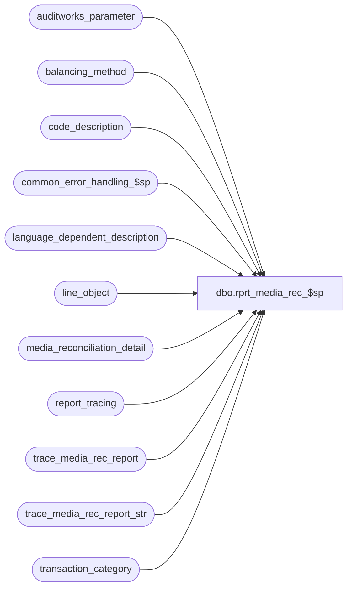

# dbo.rprt_media_rec_$sp

**Database:** auditworks  
**Server:** bedrockdb01  

## Architecture Diagram



## Table Dependencies

| Referenced Table |
|---|
| auditworks_parameter |
| balancing_method |
| code_description |
| common_error_handling_$sp |
| language_dependent_description |
| line_object |
| media_reconciliation_detail |
| report_tracing |
| trace_media_rec_report |
| trace_media_rec_report_str |
| transaction_category |

## Stored Procedure Code

```sql
CREATE proc [dbo].[rprt_media_rec_$sp] 
( @store_group_table_name          nvarchar(40), -- created by foundation, extracted by rdl
  @language_id                     int = 1033,
  @from_date                       smalldatetime,
  @to_date                         smalldatetime,
  @rdl_number                      int,
  @rec_types                       nvarchar(200),
  @bal_methods                     nvarchar(200),
  @bal_ents                        nvarchar(200),
  @combine_all_dates               int,
  @store_no                        int,
  @cashier_no                      int,
  @rec_date                        smalldatetime,
  @run_as_trace_execution_time	   datetime = NULL
) 
AS
DECLARE

   @report_name       nvarchar(50),
   @trace_report      int,
   @trace_counter     int,
   @counter           int,

   @errmsg            nvarchar(2000),
   @errmsg2	          nvarchar(2000),
   @errno             int,
   @message_id        int,
   @object_name       nvarchar(255),
   @operation_name    nvarchar(100),
   @process_name      nvarchar(100),
   @process_no        int,

   @min_store         int,
   @max_store         int,
   @sql               nvarchar(4000),
   
   @execution_datetime datetime


   SELECT @report_name  = 'rprt_media_rec_$sp',
          @process_name = 'rprt_media_rec_$sp',
          @process_no   = 300,
          @message_id   = 201068,
          @trace_report  = 0,
          @trace_counter = 0,
          @execution_datetime = getdate()
   /*
      Proc name: rprt_media_rec_$sp
           Desc: Media Reconciliation Report
                 This proc replaces the SQL in the 4 med rec rdl's. Each rdl now passes in a number which identifies to this
                 proc how it should summarize the data by dynamically changing the group by and order by clauses.

      HISTORY:
      Date     Name              Defect#   Desc
      Sep23,14 Vicci               83768   Added rerunability by execution_datetime.
      Jan14,14 Ian                149327   Use to date instead of from date when calculating unreconciled activity
      Oct15,12 Ian              1-47MZXT   Modify to allow drill down from SOS reports.      
      Aug16,12 Ian              1-47MVOJ   Initial Creation - Replace SQL in 4 rdl's with this procedure.
   */

BEGIN TRY;  --Trace input parameters

  IF @run_as_trace_execution_time IS NOT NULL
  BEGIN  
    SELECT @errmsg         = 'Unable to retrieve trace information. ',
           @object_name    = 'trace_subledger_report',
           @operation_name = 'SELECT';
    SELECT @store_group_table_name = store_group_table_name, @language_id = language_id, @from_date = from_date, @to_date = to_date, 
           @rdl_number = rdl_number, @rec_types = rec_types, @bal_methods = bal_methods, 
           @bal_ents = bal_ents, @combine_all_dates = combine_all_dates, 
           @store_no = store_no, @cashier_no = cashier_no, @rec_date = rec_date, @run_as_trace_execution_time = run_as_trace_execution_time
      FROM trace_media_rec_report
     WHERE execution_datetime = @run_as_trace_execution_time;
  END
  
  SELECT @errmsg         = 'Unable to clean trace information. ',
         @object_name    = 'trace_media_rec_report',
         @operation_name = 'DELETE';
  BEGIN
    DELETE trace_media_rec_report
     WHERE execution_datetime < dateadd(dd, -4, getdate());
  END;   

  IF NOT EXISTS (SELECT 1 FROM sysobjects WHERE type = 'U' AND name = 'trace_media_rec_report_str')
  BEGIN
  CREATE TABLE trace_media_rec_report_str (
         execution_datetime	datetime  DEFAULT getdate() NOT NULL,
         ORG_CHN_NUM		int NULL
  );
  END
  ELSE
  BEGIN
    DELETE trace_media_rec_report_str
     WHERE execution_datetime < dateadd(dd, -4, getdate());
  END;   
  
  IF @run_as_trace_execution_time IS NULL
  BEGIN
    SELECT @sql = '  INSERT INTO trace_media_rec_report_str(execution_datetime, ORG_CHN_NUM) SELECT @execution_datetime, ORG_CHN_NUM FROM ' + @store_group_table_name
    SELECT @errmsg         = 'Unable to execute dynamic sql for populating trace_media_rec_report_str. ',
           @object_name    = '@sql',
           @operation_name = 'EXECUTE';
    EXEC sp_executesql @sql, N'@execution_datetime datetime', @execution_datetime;
  END;
  ELSE
  BEGIN
    SELECT @errmsg         = 'Unable to populate trace_subledger_report_str. ',
           @object_name    = 'trace_subledger_report_str',
           @operation_name = 'INSERT';
    INSERT INTO trace_media_rec_report_str(execution_datetime, ORG_CHN_NUM) 
    SELECT @execution_datetime, ORG_CHN_NUM 
      FROM trace_media_rec_report_str
     WHERE execution_datetime = @run_as_trace_execution_time
  END;
  
  SELECT @errmsg         = 'Unable to log trace information. ',
         @object_name    = 'trace_media_rec_report',
         @operation_name = 'INSERT';
  INSERT into trace_media_rec_report(         
         execution_datetime, 
         store_group_table_name, 
         language_id, 
         from_date, 
         to_date, 
         rdl_number, 
         rec_types, 
         bal_methods, 
         bal_ents, 
         combine_all_dates, 
         store_no, 
         cashier_no, 
         rec_date, 
         run_as_trace_execution_time) 
  VALUES(@execution_datetime,
         @store_group_table_name,
         @language_id,
         @from_date,
         @to_date,
         @rdl_number, 
         @rec_types, 
         @bal_methods, 
         @bal_ents, 
         @combine_all_dates, 
         @store_no, 
         @cashier_no, 
         @rec_date, 
         @run_as_trace_execution_time);
END TRY  --trace input parameters
BEGIN CATCH
  SELECT @errno = ERROR_NUMBER();
  IF @errmsg2 IS NULL
  BEGIN
    SELECT @errmsg2 = @process_name + ':  ' + COALESCE(@errmsg, '') + ' Line: ' + CONVERT(varchar, ERROR_LINE()) + ', ' + ERROR_MESSAGE();
  END;
  SELECT @errmsg = @errmsg2;  
  EXEC common_error_handling_$sp @process_no, @errno, @errmsg2, 3, @message_id, @process_name, @object_name, @operation_name, 0;
END CATCH;  --trace input parameters

   /* Turn on tracing if applicable */

   SELECT @trace_report =  convert(tinyint, par_value)
     FROM auditworks_parameter
    WHERE par_name = 'trace_report'
   SELECT @errno = @@error
   IF @errno <> 0
   BEGIN
     SELECT @errmsg         = 'Unable to retrieve the trace_report option',
            @object_name    = 'auditworks_parameter',
            @operation_name = 'SELECT'
     GOTO error
   END

   IF @rec_types = 'NULL' OR @rec_types = '-1'
      SELECT @rec_types = NULL

   IF @bal_ents = 'NULL' OR @bal_ents = '-1'
      SELECT @bal_ents = NULL

   IF @bal_methods = 'NULL' OR @bal_methods = '-1'
      SELECT @bal_methods = NULL

   IF @cashier_no = -1
      SELECT @cashier_no = NULL

   IF @store_no = -1
      SELECT @store_no = NULL

   /* Convert Balancing Entity list into quoted string as the id's are not numeric */

   IF @bal_ents IS NOT NULL 
      SELECT @bal_ents = "'" + REPLACE(@bal_ents,',',"','") + "'"

   IF @trace_report = 1
   BEGIN

     BEGIN TRAN
     INSERT INTO report_tracing (trace_source, trace_object, trace_timestamp, trace_value, trace_comment)
                         VALUES (@report_name, 'Timing', getdate(), ' ', '(' + RIGHT('000' + convert(varchar,@trace_counter),3) + ') Start of Proc')


     SELECT @errno = @@error
     IF @errno <> 0
     BEGIN
        SELECT @errmsg         = 'Unable to log start of tracing',
               @object_name    = 'report_tracing',
               @operation_name = 'INSERT'
        GOTO error
     END
     COMMIT
   END

   SELECT @sql = 'Start Date = ' + convert(varchar,@from_date) + ' , End Date = ' + convert(varchar,@to_date)

   IF @trace_report = 1
   BEGIN
  
     BEGIN TRAN
     INSERT INTO report_tracing (trace_source, trace_object, trace_timestamp, trace_value, trace_comment)
              VALUES (@report_name, 'Params', getdate(), ' ', '(' + RIGHT('000' + convert(varchar,@trace_counter),3) + ') Report Params : ' + @sql)

         SELECT @trace_counter = @trace_counter + 1

     SELECT @errno = @@error
     IF @errno <> 0
     BEGIN
        SELECT @errmsg         = 'Unable to log start of tracing',
               @object_name    = 'report_tracing',
               @operation_name = 'INSERT'
        GOTO error
     END
     COMMIT
   END  
 
   /* Create work tables */
   BEGIN

   CREATE TABLE #rprt_code_description (code_type          smallint      not null,
                                        code               smallint      not null,
                                        card_type          varchar(1)    null,
                                        code_display_descr nvarchar(255) null,
                                        resource_id        numeric(12,0) null)

   SELECT @errno = @@error
   IF @errno <> 0
   BEGIN
     SELECT @errmsg         = 'Unable to create temporary table #rprt_code_description',
            @object_name    = '#rprt_code_description',
            @operation_name = 'CREATE'
     GOTO error
   END

   CREATE TABLE #rprt_store_list (store_no           int          not null,
                                  store_name         nvarchar(50) not null,
                                  dflt_crncy_code    nchar(3)     null,
                                  crncy_desc         nvarchar(50) null)

   SELECT @errno = @@error
   IF @errno <> 0
   BEGIN
     SELECT @errmsg         = 'Unable to create temporary table #rprt_store_list',
            @object_name    = '#rprt_store_list',
            @operation_name = 'CREATE'
     GOTO error
   END

   CREATE TABLE #rprt_mr_work_list (rec_id               numeric(14,0) not null,
                                    balancing_entity_id  numeric(12,0) not null,
                                    rec_date             smalldatetime null,
                                    store_no             int           null)

   SELECT @errno = @@error
   IF @errno <> 0
   BEGIN
     SELECT @errmsg         = 'Unable to create temporary table #rprt_mr_work_list',
            @object_name    = '#rprt_mr_work_list',
            @operation_name = 'CREATE'
     GOTO error
   END

   CREATE TABLE #rprt_mr_reconciliation_list( rec_id                         numeric(14,0) not null, 
                                              balancing_entity_id            numeric(12,0) not null, 
                                              rec_type                       smallint      not null, 
                                              rec_group_line_object          smallint      not null, 
                                              balancing_method               smallint      not null, 
                                              display_balancing_entity       nvarchar(255) not null, 
                                              display_balancing_entity_descr nvarchar(255) not null, 
                                              store_no                       int           not null, 
                                              register_no                    smallint      not null, 
                                              cashier_no                     int           not null, 
                                              till_no                        int           not null, 
                                              bank_no                        smallint      not null, 
                                              currency_code                  nchar(3)      not null, 
                                              foreign_currency_id            numeric(12,0) null, 
                                              rec_date                       smalldatetime null)

   SELECT @errno = @@error
   IF @errno <> 0
   BEGIN
     SELECT @errmsg         = 'Unable to create temporary table #rprt_mr_reconciliation_list',
            @object_name  = '#rprt_mr_reconciliation_list',
            @operation_name = 'CREATE'
     GOTO error
   END
 
   CREATE TABLE #rprt_mr_reconciliation_detail (currency_code                  nchar(3)      not null, 
                                                store_no                       int           not null, 
                                                rec_group_line_object          smallint      not null, 
                                                rec_type                       smallint      not null, 
                                                opening_balance                numeric(38,4) null, 
                                                trade_amount                   numeric(38,4) null, 
                                                receipts_disb_amount           numeric(38,4) null, 
                                                transfer_amount                numeric(38,4) null, 
                                                actual_amount                  numeric(38,4) null, 
                                                reconciled_actual_carryforward numeric(38,4) null, 
                                                over_short_amount              numeric(38,4) null, 
                                                balance_forward                numeric(38,4) null, 
                                                rec_amount_type                smallint      null, 
                                                transaction_date               smalldatetime null, 
                                                foreign_currency_id            numeric(12,0) null, 
                                                unrec_activity_amount          numeric(38,4) null, 
                                                unrec_opening_balance_amount   numeric(38,4) null, 
                                                balancing_method               smallint      null, 
                                                display_balancing_entity       nvarchar(255) null, 
                                                display_balancing_entity_descr nvarchar(255) null, 
                                                rec_amount_type_desc           nvarchar(255) null)


   SELECT @errno = @@error
   IF @errno <> 0
   BEGIN
     SELECT @errmsg         = 'Unable to create temporary table #rprt_mr_reconciliation_detail',
            @object_name    = '#rprt_mr_reconciliation_detail',
            @operation_name = 'CREATE'
     GOTO error
   END

   CREATE TABLE #rprt_mr_output (store_no                       int           not null, 
                                 store_name                     nvarchar(50)  null, 
                                 transaction_date               smalldatetime not null, 
                                 currency_code                  char(3)       not null, 
                                 currency_desc                  nvarchar(50)  null, 
                                 rec_tender                     nvarchar(255) null, 
                                 rec_type                       nvarchar(255) null, 
                                 bal_method_desc                nvarchar(255) null, 
                                 display_balancing_entity       nvarchar(255) null, 
                                 display_balancing_entity_descr nvarchar(255) null, 
                                 opening_balance                numeric(38,4) null, 
                                 trade_amount                   numeric(38,4) null, 
                                 receipts_disb_amount           numeric(38,4) null, 
                                 transfer_amount                numeric(38,4) null, 
                                 actual_amount                  numeric(38,4) null, 
                                 reconciled_actual_carryforward numeric(38,4) null, 
                             over_short_amount              numeric(38,4) null, 
                                 balance_forward                numeric(38,4) null, 
       rec_amount_type                smallint      null, 
  foreign_currency_id            numeric(12,0) null, 
                                 unrec_activity_amount          numeric(38,4) null, 
                                 unrec_opening_balance_amount   numeric(38,4) null, 
                                 rec_amount_type_desc           nvarchar(255) null)


   SELECT @errno = @@error
   IF @errno <> 0
   BEGIN
     SELECT @errmsg         = 'Unable to create temporary table #rprt_mr_output',
            @object_name    = '#rprt_mr_output',
            @operation_name = 'CREATE'
     GOTO error
   END

   BEGIN

      create index rprt_code_description_x0 on #rprt_code_description ( code_type, code)

      create index rprt_store_list_x0 on #rprt_store_list ( store_no )

      create index rprt_mr_work_list_x0 on #rprt_mr_work_list ( balancing_entity_id )

      create index rprt_mr_reconciliation_list_x0 on #rprt_mr_reconciliation_list ( rec_id, balancing_entity_id, rec_date )
 
      SELECT @errno = @@error
      IF @errno <> 0
      BEGIN
        SELECT @errmsg         = 'Unable to create temporary table indexes',
               @object_name    = '#rprt_mr_......',
               @operation_name = 'CREATE'
        GOTO error
      END

   END

   IF @trace_report = 1
      BEGIN
         BEGIN TRAN
         INSERT INTO report_tracing (trace_source, trace_object, trace_timestamp, trace_value, trace_comment)
              VALUES (@report_name, 'Create', getdate(), ' ', '(' + RIGHT('000' + convert(varchar,@trace_counter),3) + ') End of Create work tables')

         SELECT @trace_counter = @trace_counter + 1

     SELECT @errno = @@error
     IF @errno <> 0
     BEGIN
        SELECT @errmsg         = 'Unable to log start of tracing',
               @object_name    = 'report_tracing',
               @operation_name = 'INSERT'
        GOTO error
     END
     COMMIT
   END   

   /* Create language dependent line objects */
   INSERT INTO #rprt_code_description
        SELECT 2001, lo.line_object, NULL, COALESCE(ldo.display_description, lo.line_object_description),lo.resource_id
          FROM line_object lo
               LEFT JOIN language_dependent_description ldo ON (lo.resource_id = ldo.resource_id AND ldo.language_id = @language_id);


   SELECT @errno = @@error
   IF @errno <> 0
   BEGIN
     SELECT @errmsg         = 'Unable to populate rprt_code_description with line objects',
            @object_name    = '#rprt_code_description',
            @operation_name = 'INSERT'
     GOTO error
   END
 
   /* Create language dependent balancing methods */ 
   INSERT INTO #rprt_code_description
        SELECT 2002, b.balancing_method, NULL, COALESCE(ldb.display_description, b.balancing_method_description),b.resource_id
          FROM balancing_method b
               LEFT JOIN language_dependent_description ldb ON (b.resource_id = ldb.resource_id AND ldb.language_id = @language_id);

   SELECT @errno = @@error
   IF @errno <> 0
   BEGIN
     SELECT @errmsg         = 'Unable to populate rprt_code_description with balancing methods',
            @object_name    = '#rprt_code_description',
            @operation_name = 'INSERT'
     GOTO error
   END

   /* Create language dependent reconciliation types */   
   INSERT INTO #rprt_code_description
        SELECT d.code_type, d.code, NULL, COALESCE(ldd.display_description, d.code_display_descr),d.resource_id
          FROM code_description d 
               LEFT JOIN language_dependent_description ldd ON (d.resource_id = ldd.resource_id AND ldd.language_id = @language_id)
         WHERE code_type IN (82,84);

   SELECT @errno = @@error
   IF @errno <> 0
   BEGIN
     SELECT @errmsg         = 'Unable to populate rprt_code_description with reconciliation types',
            @object_name    = '#rprt_code_description',
            @operation_name = 'INSERT'
     GOTO error
   END

   IF @trace_report = 1
   BEGIN
     BEGIN TRAN
     INSERT INTO report_tracing (trace_source, trace_object, trace_timestamp, trace_value, trace_comment)
                         VALUES (@report_name, 'Build', getdate(), ' ', '(' + RIGHT('000' + convert(varchar,@trace_counter),3) + ') End of language table builds')

         SELECT @trace_counter = @trace_counter + 1

     SELECT @errno = @@error
     IF @errno <> 0
     BEGIN
        SELECT @errmsg         = 'Unable to log start of tracing',
               @object_name    = 'report_tracing',
               @operation_name = 'INSERT'
        GOTO error
     END
     COMMIT
   END   

   /* Create temporary store list table */
   
   SELECT @sql = 'INSERT INTO #rprt_store_list
                  SELECT s.ORG_CHN_NUM, COALESCE(l.ORG_CHN_NAME, s.ORG_CHN_NAME) as ORG_CHN_NAME, 
                         s.DFLT_CRNCY_CODE, COALESCE(ldc.display_description, c.currency_description) AS CRNCY_DESC
             	    FROM ORG_CHN s
	                     LEFT JOIN ORG_CHN_LANG l ON (s.ORG_CHN_NUM = l.ORG_CHN_NUM AND l.LANG_ID = ' + convert(varchar,@language_id) + ')
	                     INNER JOIN currency c ON (s.DFLT_CRNCY_CODE = c.currency_code) 
	                     LEFT JOIN language_dependent_description ldc ON (c.resource_id = ldc.resource_id AND ldc.language_id = ' + convert(varchar,@language_id) + ')'

   IF @store_no IS NOT NULL
      SELECT @sql = @sql + ' WHERE s.ORG_CHN_NUM IN (' + convert(varchar,@store_no) + ',0)' -- Include Bank / settlement recs
   ELSE
      SELECT @sql = @sql + ' WHERE s.ORG_CHN_NUM IN (SELECT ORG_CHN_NUM FROM ' + @store_group_table_name + ' )'

   IF @trace_report = 1
   BEGIN
     BEGIN TRAN

         INSERT INTO report_tracing (trace_source, trace_object, trace_timestamp, trace_value, trace_comment)
              VALUES (@report_name, 'SQL', getdate(), @sql, '(' + RIGHT('000' + convert(varchar,@trace_counter),3) + ') Dynamic SQL to create store list')

         SELECT @trace_counter = @trace_counter + 1

     SELECT @errno = @@error
     IF @errno <> 0
     BEGIN
        SELECT @errmsg         = 'Unable to log start of tracing',
               @object_name    = 'report_tracing',
               @operation_name = 'INSERT'
        GOTO error
     END
     COMMIT
   END   
 
   EXEC sp_executesql @sql

   IF @trace_report = 1
   BEGIN
     BEGIN TRAN

         INSERT INTO report_tracing (trace_source, trace_object, trace_timestamp, trace_value, trace_comment)
              VALUES (@report_name, 'Build', getdate(), ' ', '(' + RIGHT('000' + convert(varchar,@trace_counter),3) + ') End of build store list.')

         SELECT @trace_counter = @trace_counter + 1

     SELECT @errno = @@error
     IF @errno <> 0
     BEGIN
        SELECT @errmsg         = 'Unable to log start of tracing',
               @object_name    = 'report_tracing',
               @operation_name = 'INSERT'
        GOTO error
     END
     COMMIT
   END   

   IF @trace_report = 1
   BEGIN
     BEGIN TRAN


         SELECT @counter = COUNT(*) FROM #rprt_store_list

         INSERT INTO report_tracing (trace_source, trace_object, trace_timestamp, trace_value, trace_comment)
              VALUES (@report_name, 'Count', getdate(), ' ', '(' + RIGHT('000' + convert(varchar,@trace_counter),3) + ') ' + convert(varchar,@counter) +  ' Records in store list.')

         SELECT @trace_counter = @trace_counter + 1

     SELECT @errno = @@error
     IF @errno <> 0
     BEGIN
        SELECT @errmsg         = 'Unable to log start of tracing',
               @object_name    = 'report_tracing',
               @operation_name = 'INSERT'
        GOTO error
     END
     COMMIT
   END   
   
   /* Get min and max stores to help with index selection */

   IF @store_no IS NOT NULL
      SELECT @min_store = @store_no, @max_store = @store_no
   ELSE
      SELECT @min_store = min(store_no), @max_store = MAX(store_no) FROM #rprt_store_list;
   
   SELECT @errno = @@error
   IF @errno <> 0
   BEGIN
     SELECT @errmsg         = 'Unable to select min and max store no',
            @object_name    = '#rprt_store_list',
            @operation_name = 'SELECT'
     GOTO error
   END  
    
   /* 
      This code has been modified from the original to only include store balancing entities
      The reason for this is that the original was a mix of store only in some clauses and
      non store ( bank / settlement service ) in other joins. This may need to be modified
      again to include all entities that a store contributes to
   */

 
   SELECT @sql = 'INSERT INTO #rprt_mr_work_list (rec_id, balancing_entity_id, rec_date, store_no) 
                  /* All transactions ( reconciled or not ) during the requested date range */
                  SELECT DISTINCT m.rec_id, m.balancing_entity_id, m.rec_date, m.store_no
                    FROM media_reconciliation_detail m
                   WHERE m.transaction_date   >= ' + '''' + convert(varchar,@from_date) + '''' + '
                     AND m.transaction_date   <= ' + '''' + convert(varchar,@to_date) +   '''' + '
                     AND m.rec_amount_type     = 1
                     AND m.store_no           >= ' + convert(varchar,@min_store)  +  '
                     AND m.store_no           <= ' + convert(varchar,@max_store)

   IF @cashier_no IS NOT NULL
      SELECT @sql = @sql + ' AND m.cashier_no = ' + convert(varchar,@cashier_no)

   IF @rec_date IS NOT NULL
      SELECT @sql = @sql + ' AND m.rec_date = ' + '''' + convert(varchar,@rec_date) + '''' 


   SELECT @sql = @sql + '
                     UNION  
                     /* All transactions reconciled after the cut off date that occurred before the start date */
                     SELECT DISTINCT m.rec_id, m.balancing_entity_id, m.rec_date, m.store_no
                       FROM media_reconciliation_detail m
                      WHERE m.transaction_date   <  ' + '''' + convert(varchar,@from_date) + '''' +  '
                        AND m.store_no           >= ' + convert(varchar,@min_store) + '' +  '
                        AND m.store_no           <= ' + convert(varchar,@max_store) + '' +  '
                        AND m.rec_date           >  ' + '''' + convert(varchar,@to_date) + ''''

   IF @cashier_no IS NOT NULL
      SELECT @sql = @sql + ' AND m.cashier_no = ' + convert(varchar,@cashier_no)


   SELECT @sql = @sql + '
                  UNION
                  /* All transactions ( reconciled or not ) that posted after the cutoff date but should have occured in the selected range */
                  SELECT DISTINCT m.rec_id, m.balancing_entity_id, m.rec_date, m.store_no
                    FROM media_reconciliation_detail m
                   WHERE m.transaction_date    >  ' + '''' + convert(varchar,@to_date) + '''' +  '
                     AND m.period_to_date_time <= ' + '''' + convert(varchar,@to_date) + '''' +  '
                     AND (
                           m.rec_date IS NULL OR 
                           m.rec_date          >= ' + '''' + convert(varchar,@to_date) + '''' +  '
                         )   
                     AND m.rec_side = 0
                     AND m.rec_amount_type = 1 
                     AND m.store_no            >= ' + convert(varchar,@min_store) +  '
                     AND m.store_no            <= ' + convert(varchar,@max_store)

   IF @rec_date IS NOT NULL
      SELECT @sql = @sql + ' AND m.rec_date = ' + '''' + convert(varchar,@rec_date) + ''''     

   IF @cashier_no IS NOT NULL
      SELECT @sql = @sql + ' AND m.cashier_no = ' + convert(varchar,@cashier_no)

   SELECT @sql = @sql + '
                  UNION
                  /* All non reconciled items */
                  SELECT DISTINCT u.rec_id, u.balancing_entity_id, null, u.store_no
                    FROM  media_unreconciliation u
               WHERE u.transaction_date    <= ' + '''' + convert(varchar,@to_date) + '''' +  '
                     AND u.store_no            >= ' + convert(varchar,@min_store) + '
                     AND u.store_no            <= ' + convert(varchar,@max_store)
          
   IF @trace_report = 1
   BEGIN
     BEGIN TRAN

         INSERT INTO report_tracing (trace_source, trace_object, trace_timestamp, trace_value, trace_comment)
              VALUES (@report_name, 'Build', getdate(), @sql, '(' + RIGHT('000' + convert(varchar,@trace_counter),3) + ') End of create #rprt_mr_work_list')

         SELECT @trace_counter = @trace_counter + 1

     SELECT @errno = @@error
     IF @errno <> 0
     BEGIN
        SELECT @errmsg         = 'Unable to log start of tracing',
               @object_name    = 'report_tracing',
               @operation_name = 'INSERT'
        GOTO error
     END
     COMMIT
   END   

   EXEC sp_executesql @sql

   SELECT @errno = @@error
   IF @errno <> 0
   BEGIN
     SELECT @errmsg         = 'Unable to build #rprt_mr_work_list',
            @object_name    = '#rprt_mr_work_list',
            @operation_name = 'INSERT'
     GOTO error
   END

   IF @trace_report = 1
   BEGIN
     BEGIN TRAN

         SELECT @counter = COUNT(*) FROM #rprt_mr_work_list

         INSERT INTO report_tracing (trace_source, trace_object, trace_timestamp, trace_value, trace_comment)
              VALUES (@report_name, 'Count', getdate(), ' ', '(' + RIGHT('000' + convert(varchar,@trace_counter),3) + ') ' + convert(varchar,@counter) + ' Records in #rprt_mr_work_list')

         SELECT @trace_counter = @trace_counter + 1

     SELECT @errno = @@error
     IF @errno <> 0
     BEGIN
        SELECT @errmsg         = 'Unable to log start of tracing',
               @object_name    = 'report_tracing',
               @operation_name = 'INSERT'
        GOTO error
     END
     COMMIT
   END   
   
   /* Trim down list based on report selection criteria */
    
   SELECT @sql = 'INSERT INTO #rprt_mr_reconciliation_list
                  SELECT DISTINCT m.rec_id, m.balancing_entity_id, s.rec_type, s.rec_group_line_object, 
	                              s.balancing_method, s.display_balancing_entity, s.display_balancing_entity_descr, 
                                  s.store_no, s.register_no, s.cashier_no, s.till_no, s.bank_no, l.dflt_crncy_code, 
	                              s.foreign_currency_id, m.rec_date 
                    FROM #rprt_store_list l,
                         #rprt_mr_work_list m, 
                         media_reconciliation_status s
                   WHERE m.store_no = l.store_no
                     AND m.balancing_entity_id = s.balancing_entity_id'

                
   IF @rec_types IS NOT NULL AND @rec_types <> '' 
       SELECT @sql = @sql + ' AND s.rec_type IN (' + @rec_types + ')'

   IF @bal_methods IS NOT NULL AND @bal_methods <> '' 
       SELECT @sql = @sql + ' AND s.balancing_method IN (' + @bal_methods + ')'

   IF @bal_ents IS NOT NULL AND @bal_ents <> '' 
       SELECT @sql = @sql + ' AND s.display_balancing_entity IN (' + @bal_ents + ')'

   IF @trace_report = 1
   BEGIN
     BEGIN TRAN

         INSERT INTO report_tracing (trace_source, trace_object, trace_timestamp, trace_value, trace_comment)
              VALUES (@report_name, 'SQL', getdate(), ' ', '(' + RIGHT('000' + convert(varchar,@trace_counter),3) + ') Dynamic SQL to create rprt_mr_reconciliation_list')

         SELECT @trace_counter = @trace_counter + 1

     SELECT @errno = @@error
     IF @errno <> 0
     BEGIN
        SELECT @errmsg         = 'Unable to log start of tracing',
               @object_name    = 'report_tracing',
               @operation_name = 'INSERT'
        GOTO error
     END
     COMMIT
   END  

   EXEC sp_executesql @sql

   IF @trace_report = 1
   BEGIN
     BEGIN TRAN

         INSERT INTO report_tracing (trace_source, trace_object, trace_timestamp, trace_value, trace_comment)
              VALUES (@report_name, 'Build', getdate(), @sql, '(' + RIGHT('000' + convert(varchar,@trace_counter),3) + ') End of create #rprt_mr_reconciliation_list')

         SELECT @trace_counter = @trace_counter + 1

     SELECT @errno = @@error
     IF @errno <> 0
     BEGIN
        SELECT @errmsg         = 'Unable to log start of tracing',
               @object_name    = 'report_tracing',
               @operation_name = 'INSERT'
        GOTO error
     END
     COMMIT
   END   

   IF @trace_report = 1
   BEGIN
     BEGIN TRAN


         SELECT @counter = COUNT(*) FROM #rprt_mr_reconciliation_list

         INSERT INTO report_tracing (trace_source, trace_object, trace_timestamp, trace_value, trace_comment)
              VALUES (@report_name, 'Count11', getdate(), ' ', '(' + RIGHT('000' + convert(varchar,@trace_counter),3) + ') ' + convert(varchar,@counter) + ' Records in #rprt_mr_reconciliation_list')

         SELECT @trace_counter = @trace_counter + 1

     SELECT @errno = @@error
     IF @errno <> 0
     BEGIN
        SELECT @errmsg         = 'Unable to log start of tracing',
               @object_name    = 'report_tracing',
               @operation_name = 'INSERT'
        GOTO error
     END
     COMMIT
   END

   /* Build report reconciliation detail */
    
   IF @combine_all_dates = 1
     BEGIN

       INSERT INTO #rprt_mr_reconciliation_detail
            SELECT t.currency_code, t.store_no,
	               t.rec_group_line_object, t.rec_type,
	               sum(m.rec_amount * (1- sign(1- sign(datediff(dd, m.transaction_date,@from_date)))) * sign (sign(datediff(dd,@from_date, COALESCE(m.rec_date, @from_date ))) + 1) * (1- abs(sign(m.rec_side))) ),
                   sum(m.rec_amount * sign(1 - sign(datediff(   dd, m.transaction_date,@from_date))) * abs(sign(m.rec_side -1))  * (1 - abs(sign(m.rec_amount_subtype - 1)))),
                   sum(m.rec_amount * sign(1 - sign(datediff(   dd, m.transaction_date,@from_date))) * abs(sign(m.rec_side -1))  * (1 - abs(sign(m.rec_amount_subtype - 2)))),
                   sum(m.rec_amount * sign(1 - sign(datediff(   dd, m.transaction_date,@from_date))) * abs(sign(m.rec_side -1))  * (1 - abs(sign(m.rec_amount_subtype - 3)))),
                   sum(m.rec_amount * (1 - sign(tc.transaction_category)) * sign(1 - sign(datediff(dd, m.transaction_date,@from_date))) * (1 - abs(sign(m.rec_side -1))) * (1 - datediff(dd,m.rec_date, m.rec_date)) * (1 - (abs(sign(m.rec_amount_subtype - 4)) * abs(sign(m.rec_amount_subtype - 14)) * abs(sign(m.rec_amount_subtype - 24))))),
                   sum(m.rec_amount * (1 - sign(tc.transaction_category)) * sign(1 - sign(datediff(dd, m.transaction_date,@from_date))) * (1 - abs(sign(m.rec_side))) * COALESCE((1 - datediff(dd,m.rec_date, m.rec_date)), 0) * (1-abs(sign(m.rec_amount_subtype)))),
                   sum(m.rec_amount * (1 - sign(tc.transaction_category)) * sign(1 - sign(datediff(dd, m.transaction_date,@from_date))) * (1 - abs(sign(m.rec_side -1))) * (1 - datediff(dd,m.rec_date, m.rec_date)) * (1 - (abs(sign(m.rec_amount_subtype - 5)) * abs(sign(m.rec_amount_subtype - 15)) * abs(sign(m.rec_amount_subtype - 25))))),
                   sum(m.rec_amount * COALESCE((1 - sign(abs(sign(datediff(dd,@to_date, m.rec_date))-1))),1) * (1 - abs(sign(m.rec_side)))), 
                   (((1-m.convert_to_domestic) * m.rec_amount_type) + m.convert_to_domestic),
                   @to_date,
                   t.foreign_currency_id,
	               sum(m.rec_amount * COALESCE(sign(sign(datediff(dd,@to_date, m.rec_date)) -1) + 1, 1) * sign(1 - sign(datediff(dd,m.transaction_date,@from_date))) * abs(sign(m.rec_side -1)) * abs(sign(m.rec_amount_subtype)) ),
       sum(m.rec_amount * COALESCE(sign(datediff(dd,@from_date, m.rec_date)),1) * sign(1 - sign(sign(datediff(dd,@from_date,m.transaction_date))+1)) * abs(sign(abs(m.rec_side) -1)) ),
                   t.balancing_method,
                   t.display_balancing_entity,
                   max(ISNULL(t.display_balancing_entity_descr,'')) as display_balancing_entity_descr,
                   NULL as rec_amount_type_desc
              FROM #rprt_mr_reconciliation_list t
	                 INNER JOIN media_reconciliation_detail m ON (t.rec_id = m.rec_id AND t.balancing_entity_id = m.balancing_entity_id AND (t.rec_date = m.rec_date OR (t.rec_date is null AND m.rec_date is null)))
                   LEFT JOIN transaction_category tc ON (sign(abs(sign(datediff(dd,@to_date,m.rec_date))-1))-1 = tc.transaction_category)
             WHERE 1 = 1
               AND m.transaction_date <= @to_date 
               AND m.rec_amount_type IN (1,3,5)
               AND ( -1 = SIGN(COALESCE(@cashier_no, -1)) OR m.cashier_no = @cashier_no)
             GROUP BY t.store_no, t.foreign_currency_id, t.currency_code, t.rec_group_line_object,
                      t.rec_type, (((1-m.convert_to_domestic) * m.rec_amount_type) + m.convert_to_domestic),
                      t.balancing_method, t.display_balancing_entity

        SELECT @errno = @@error
        IF @errno <> 0
        BEGIN
        SELECT @errmsg         = 'Unable to build #rprt_mr_reconciliation_detail',
               @object_name    = '#rprt_mr_work_list',
               @operation_name = 'INSERT'
          GOTO error
        END
     END

   ELSE
     BEGIN

       INSERT INTO #rprt_mr_reconciliation_detail
            SELECT t.currency_code, t.store_no, 
	               t.rec_group_line_object, t.rec_type, 
   	               sum(m.rec_amount * (1- sign(1 - sign(datediff(dd, m.transaction_date,  m.transaction_date)))) * sign(sign(datediff(dd, m.transaction_date,COALESCE(m.rec_date,  m.transaction_date))) + 1) * (1- abs(sign(m.rec_side))) ),
                   sum(m.rec_amount * sign(1 - sign(datediff(dd, m.transaction_date,  m.transaction_date))) * abs(sign(m.rec_side -1))  * (1-abs(sign(m.rec_amount_subtype - 1)))),
                   sum(m.rec_amount * sign(1 - sign(datediff(dd, m.transaction_date,  m.transaction_date))) * abs(sign(m.rec_side -1))  * (1-abs(sign(m.rec_amount_subtype - 2)))),
                   sum(m.rec_amount * sign(1 - sign(datediff(dd, m.transaction_date,  m.transaction_date))) * abs(sign(m.rec_side -1))  * (1-abs(sign(m.rec_amount_subtype - 3)))),
                   sum(m.rec_amount * (1 - sign(tc.transaction_category)) * sign(1 - sign(datediff(dd, m.transaction_date,  m.transaction_date))) * (1 - abs(sign(m.rec_side -1))) * (1 - datediff(dd, m.rec_date, m.rec_date)) * (1- (abs(sign(m.rec_amount_subtype - 4)) * abs(sign(m.rec_amount_subtype - 14)) * abs(sign(m.rec_amount_subtype - 24)))) ),
                   sum(m.rec_amount * (1 - sign(tc.transaction_category)) * sign(1 - sign(datediff(dd, m.transaction_date,  m.transaction_date))) * (1 - abs(sign(m.rec_side))) * COALESCE((1 - datediff(dd, m.rec_date, m.rec_date)), 0) * (1-abs(sign(m.rec_amount_subtype)))  ),
                   sum(m.rec_amount * (1 - sign(tc.transaction_category)) * sign(1 - sign(datediff(dd, m.transaction_date,  m.transaction_date))) * (1 - abs(sign(m.rec_side -1))) * (1 - datediff(dd, m.rec_date, m.rec_date)) * (1-(abs(sign(m.rec_amount_subtype - 5)) * abs(sign(m.rec_amount_subtype - 15)) * abs(sign(m.rec_amount_subtype - 25)) )) ),
                   sum(m.rec_amount * COALESCE((1-sign(abs(sign(datediff(dd,  m.transaction_date,m.rec_date))-1))), 1)  * (1 - abs(sign(m.rec_side)))), -- balance_forward
                   (((1-m.convert_to_domestic) * m.rec_amount_type) + m.convert_to_domestic),
                    m.transaction_date,
                    t.foreign_currency_id,
                    sum(m.rec_amount * COALESCE(sign(datediff(dd, m.transaction_date,m.rec_date)),1) * (1 - abs(sign(datediff(dd, m.transaction_date, m.transaction_date)))) * abs(sign(m.rec_side -1)) * abs(sign(m.rec_amount_subtype)) ),
                    sum(m.rec_amount * COALESCE(sign(sign(datediff(dd, m.transaction_date,m.rec_date))-1)+1,1) * sign(1 - sign(sign(datediff(dd, m.transaction_date, m.transaction_date))+1)) * abs(sign(abs(m.rec_side) -1)) ),
                    t.balancing_method,
                    t.display_balancing_entity,
                    max(t.display_balancing_entity_descr) as display_balancing_entity_descr,
                    NULL as rec_amount_type_desc
               FROM #rprt_mr_reconciliation_list t
                    INNER JOIN media_reconciliation_detail m ON (t.rec_id = m.rec_id AND t.balancing_entity_id = m.balancing_entity_id AND (t.rec_date = m.rec_date OR (t.rec_date is null AND m.rec_date is null)))
                     LEFT JOIN transaction_category tc ON (-1 * sign(abs(sign(datediff(dd, m.transaction_date,m.rec_date)))) = tc.transaction_category)
              WHERE m.transaction_date <= @to_date
                AND m.rec_amount_type IN (1,3,5)
                  AND ( -1 = SIGN(COALESCE(@cashier_no, -1)) OR m.cashier_no = @cashier_no)
              GROUP BY t.currency_code, t.store_no, t.rec_group_line_object, t.rec_type,
                       (((1-m.convert_to_domestic) * m.rec_amount_type) + m.convert_to_domestic), m.transaction_date,
	                     t.foreign_currency_id, t.balancing_method, t.display_balancing_entity

/*
       INSERT INTO #rprt_mr_reconciliation_detail
            SELECT t.currency_code, t.store_no, 
	               t.rec_group_line_object, t.rec_type, 
   	               sum(ISNULL(m.rec_amount * (1- sign(1 - sign(datediff(dd, m.transaction_date, c.calendar_date)))) * sign(sign(datediff(dd,c.calendar_date,COALESCE(m.rec_date, c.calendar_date))) + 1) * (1- abs(sign(m.rec_side))) ,0)),
                   sum(ISNULL(m.rec_amount * sign(1 - sign(datediff(dd, m.transaction_date, c.calendar_date))) * abs(sign(m.rec_side -1))  * (1-abs(sign(m.rec_amount_subtype - 1))),0)),
                   sum(ISNULL(m.rec_amount * sign(1 - sign(datediff(dd, m.transaction_date, c.calendar_date))) * abs(sign(m.rec_side -1))  * (1-abs(sign(m.rec_amount_subtype - 2))),0)),
                   sum(ISNULL(m.rec_amount * sign(1 - sign(datediff(dd, m.transaction_date, c.calendar_date))) * abs(sign(m.rec_side -1))  * (1-abs(sign(m.rec_amount_subtype - 3))),0)),
                   sum(ISNULL(m.rec_amount * (1 - sign(tc.transaction_category)) * sign(1 - sign(datediff(dd, m.transaction_date, c.calendar_date))) * (1 - abs(sign(m.rec_side -1))) * (1 - datediff(dd, m.rec_date, m.rec_date)) * (1- (abs(sign(m.rec_amount_subtype - 4)) * abs(sign(m.rec_amount_subtype - 14)) * abs(sign(m.rec_amount_subtype - 24)))) ,0)),
                   sum(ISNULL(m.rec_amount * (1 - sign(tc.transaction_category)) * sign(1 - sign(datediff(dd, m.transaction_date, c.calendar_date))) * (1 - abs(sign(m.rec_side))) * COALESCE((1 - datediff(dd, m.rec_date, m.rec_date)), 0) * (1-abs(sign(m.rec_amount_subtype)))  ,0)),
                   sum(ISNULL(m.rec_amount * (1 - sign(tc.transaction_category)) * sign(1 - sign(datediff(dd, m.transaction_date, c.calendar_date))) * (1 - abs(sign(m.rec_side -1))) * (1 - datediff(dd, m.rec_date, m.rec_date)) * (1-(abs(sign(m.rec_amount_subtype - 5)) * abs(sign(m.rec_amount_subtype - 15)) * abs(sign(m.rec_amount_subtype - 25)) )) ,0)),
                   sum(ISNULL(m.rec_amount * COALESCE((1-sign(abs(sign(datediff(dd, c.calendar_date,m.rec_date))-1))), 1)  * (1 - abs(sign(m.rec_side))),0)), -- balance_forward
                   (((1-m.convert_to_domestic) * m.rec_amount_type) + m.convert_to_domestic),
                    m.calendar_date,
                    t.foreign_currency_id,
                    sum(ISNULL(m.rec_amount * COALESCE(sign(datediff(dd, c.calendar_date,m.rec_date)),1) * (1 - abs(sign(datediff(dd,c.calendar_date, m.transaction_date)))) * abs(sign(m.rec_side -1)) * abs(sign(m.rec_amount_subtype)) ,0)),
                    sum(ISNULL(m.rec_amount * COALESCE(sign(sign(datediff(dd, c.calendar_date,m.rec_date))-1)+1,1) * sign(1 - sign(sign(datediff(dd,c.calendar_date, m.transaction_date))+1)) * abs(sign(abs(m.rec_side) -1)) ,0)),
                    t.balancing_method,
                    t.display_balancing_entity,
                    max(t.display_balancing_entity_descr) as display_balancing_entity_descr,
                    NULL as rec_amount_type_desc
               FROM #rprt_mr_reconciliation_list t
                    INNER JOIN media_reconciliation_detail m ON (t.rec_id = m.rec_id AND t.balancing_entity_id = m.balancing_entity_id AND (t.rec_date = m.rec_date OR (t.rec_date is null AND m.rec_date is null)))
--                    INNER JOIN RPT_CALENDAR c ON (m.transaction_date = c.calendar_date)
                     LEFT JOIN transaction_category tc ON (-1 * sign(abs(sign(datediff(dd, c.calendar_date,m.rec_date)))) = tc.transaction_category)
              WHERE m.transaction_date <= @to_date
                AND m.rec_amount_type IN (1,3,5)
--                AND c.calendar_date >= @from_date 
--                AND c.calendar_date <= @to_date
                  AND ( -1 = SIGN(COALESCE(@cashier_no, -1)) OR m.cashier_no = @cashier_no)
              GROUP BY t.currency_code, t.store_no, t.rec_group_line_object, t.rec_type,
                       (((1-m.convert_to_domestic) * m.rec_amount_type) + m.convert_to_domestic), c.calendar_date,
	                     t.foreign_currency_id, t.balancing_method, t.display_balancing_entity
*/
        SELECT @errno = @@error
        IF @errno <> 0
        BEGIN
        SELECT @errmsg         = 'Unable to build #rprt_mr_reconciliation_detail',
               @object_name    = '#rprt_mr_work_list',
               @operation_name = 'INSERT'
          GOTO error
        END
   END

   IF @trace_report = 1
   BEGIN
     BEGIN TRAN

         INSERT INTO report_tracing (trace_source, trace_object, trace_timestamp, trace_value, trace_comment)
              VALUES (@report_name, 'Build1', getdate(), ' ', '(' + RIGHT('000' + convert(varchar,@trace_counter),3) + ') End of create #rprt_mr_reconciliation_detail')

         SELECT @trace_counter = @trace_counter + 1

     SELECT @errno = @@error
     IF @errno <> 0
     BEGIN
        SELECT @errmsg         = 'Unable to log start of tracing',
               @object_name    = 'report_tracing',
               @operation_name = 'INSERT'
        GOTO error
     END
     COMMIT
   END   

   IF @trace_report = 1
   BEGIN
     BEGIN TRAN


         SELECT @counter = COUNT(*) FROM #rprt_mr_reconciliation_detail

         INSERT INTO report_tracing (trace_source, trace_object, trace_timestamp, trace_value, trace_comment)
              VALUES (@report_name, 'Count', getdate(), ' ', '(' + RIGHT('000' + convert(varchar,@trace_counter),3) + ') ' +  convert(varchar,@counter) + ' Records in #rprt_mr_reconciliation_detail')

         SELECT @trace_counter = @trace_counter + 1

     SELECT @errno = @@error
     IF @errno <> 0
     BEGIN
        SELECT @errmsg         = 'Unable to log start of tracing',
               @object_name    = 'report_tracing',
               @operation_name = 'INSERT'
        GOTO error
     END
     COMMIT
   END

   /* Create output table */
  
   IF @rdl_number = 2
   
      /* Detail */
      BEGIN
      
         INSERT INTO #rprt_mr_output 
              SELECT w.store_no,
                     s.store_name,
                     w.transaction_date,
                     s.dflt_crncy_code,
                     s.crncy_desc,
                     d1.code_display_descr,
                     d3.code_display_descr,
                     d2.code_display_descr,
                     w.display_balancing_entity,
                     w.display_balancing_entity_descr,
       w.opening_balance,
                     w.trade_amount,
         w.receipts_disb_amount,
                     w.transfer_amount,
                     w.actual_amount,
                     w.reconciled_actual_carryforward,
                     w.over_short_amount,
                     w.balance_forward,
                     w.rec_amount_type,
                     w.foreign_currency_id,
                     w.unrec_activity_amount,
                     w.unrec_opening_balance_amount,
                     d4.code_display_descr
                FROM #rprt_mr_reconciliation_detail w
                     INNER JOIN #rprt_store_list s         ON (w.store_no = s.store_no)
                     INNER JOIN #rprt_code_description d1  ON (w.rec_group_line_object = d1.code AND d1.code_type = 2001)
                     INNER JOIN #rprt_code_description d2  ON (w.balancing_method      = d2.code AND d2.code_type = 2002) 
                     INNER JOIN #rprt_code_description d3  ON (w.rec_type              = d3.code AND d3.code_type = 82)
                      LEFT JOIN #rprt_code_description d4  ON (w.rec_amount_type       = d4.code AND d4.code_type = 84 AND d4.code in (3,5))
                     
        SELECT @errno = @@error
        IF @errno <> 0
        BEGIN
        SELECT @errmsg         = 'Unable to build #rprt_mr_output',
               @object_name    = '#rprt_mr_work_list',
               @operation_name = 'INSERT'
          GOTO error
        END
     END
   ELSE
   
      /* Summarized */
      BEGIN
     
         INSERT INTO #rprt_mr_output 
              SELECT w.store_no,
                     s.store_name,
                     w.transaction_date,
                     s.dflt_crncy_code,
                     s.crncy_desc,
                     d1.code_display_descr,
                     d3.code_display_descr,
                     d2.code_display_descr,
                     w.display_balancing_entity,
                     w.display_balancing_entity_descr,
                     sum(w.opening_balance),
                     sum(w.trade_amount),
                     sum(w.receipts_disb_amount),
                     sum(w.transfer_amount),
                     sum(w.actual_amount),
                     sum(w.reconciled_actual_carryforward),
                     sum(w.over_short_amount),
                     sum(w.balance_forward),
                     NULL,
                     NULL,
                     sum(w.unrec_activity_amount),
                     sum(w.unrec_opening_balance_amount),
                     NULL
                FROM #rprt_mr_reconciliation_detail w
                     INNER JOIN #rprt_store_list s         ON (w.store_no = s.store_no)
                     INNER JOIN #rprt_code_description d1  ON (w.rec_group_line_object = d1.code AND d1.code_type = 2001)
                     INNER JOIN #rprt_code_description d2  ON (w.balancing_method      = d2.code AND d2.code_type = 2002) 
                     INNER JOIN #rprt_code_description d3  ON (w.rec_type              = d3.code AND d3.code_type = 82) 
               WHERE ((ABS(COALESCE(w.opening_balance, 0)) +
                       ABS(COALESCE(w.trade_amount, 0)) +
                       ABS(COALESCE(w.receipts_disb_amount, 0)) +
                       ABS(COALESCE(w.transfer_amount, 0)) +
                       ABS(COALESCE(w.actual_amount, 0)) +
                       ABS(COALESCE(w.over_short_amount, 0)) +
                       ABS(COALESCE(w.balance_forward, 0)) +
                       ABS(COALESCE(w.unrec_activity_amount, 0))) <> 0 )
              GROUP BY w.store_no,
                       s.store_name,
                       w.transaction_date,
                       s.dflt_crncy_code,
                       s.crncy_desc,
                       d1.code_display_descr,
                       d3.code_display_descr,
       d2.code_display_descr,
                       w.display_balancing_entity,
                       w.display_balancing_entity_descr
                       
        SELECT @errno = @@error
        IF @errno <> 0
        BEGIN
        SELECT @errmsg         = 'Unable to build #rprt_mr_output',
               @object_name    = '#rprt_mr_work_list',
               @operation_name = 'INSERT'
          GOTO error
        END
   END

   IF @trace_report = 1
   BEGIN
     BEGIN TRAN

         INSERT INTO report_tracing (trace_source, trace_object, trace_timestamp, trace_value, trace_comment)
              VALUES (@report_name, 'Build', getdate(), ' ', '(' + RIGHT('000' + convert(varchar,@trace_counter),3) + ') End of create #rprt_mr_output')

         SELECT @trace_counter = @trace_counter + 1

     SELECT @errno = @@error
     IF @errno <> 0
     BEGIN
        SELECT @errmsg         = 'Unable to log start of tracing',
               @object_name    = 'report_tracing',
               @operation_name = 'INSERT'
        GOTO error
     END
     COMMIT
   END   

   IF @trace_report = 1
   BEGIN
     BEGIN TRAN


         SELECT @counter = COUNT(*) FROM #rprt_mr_output

         INSERT INTO report_tracing (trace_source, trace_object, trace_timestamp, trace_value, trace_comment)
              VALUES (@report_name, 'Count', getdate(), ' ', '(' + RIGHT('000' + convert(varchar,@trace_counter),3) + ') ' +  convert(varchar,@counter) + ' Records in #rprt_mr_output')

         SELECT @trace_counter = @trace_counter + 1

     SELECT @errno = @@error
     IF @errno <> 0
     BEGIN
        SELECT @errmsg         = 'Unable to log start of tracing',
               @object_name    = 'report_tracing',
               @operation_name = 'INSERT'
        GOTO error
     END
     COMMIT
   END


   /* Output Data */

   SELECT o.store_no                        AS storeNo,
          o.store_name                      AS storeName,
          o.transaction_date                AS tranDate,
          o.currency_code                   AS currencyCode,
          o.currency_desc                   AS currencyDescr,
          o.rec_tender                      AS recTender,
          o.rec_type                        AS recType,
          o.bal_method_desc                 AS balancingMethod,
          o.display_balancing_entity        AS displayBalancingEntity,
          o.display_balancing_entity_descr  AS displayBalancingEntityDescr,
          o.opening_balance                 AS openingBalance,
          o.trade_amount                    AS tradeAmount,
          o.receipts_disb_amount            AS receipts,
          o.transfer_amount                 AS transfer,
          o.actual_amount                   AS actual,
          o.reconciled_actual_carryforward  AS carryForward,
          o.over_short_amount               AS overShort,
          o.balance_forward                 AS balanceForward,
          o.rec_amount_type                 AS rec_amount_type,
          o.foreign_currency_id             AS foreign_currency_id,
          o.unrec_activity_amount           AS unrecActivity,
          o.unrec_opening_balance_amount    AS unrecOpeningBalance,
          o.rec_amount_type_desc            AS rec_amount_type_desc
     FROM #rprt_mr_output o
    ORDER BY o.store_no,
             o.transaction_date,
             o.rec_type,
             o.bal_method_desc,
             o.display_balancing_entity_descr,
             o.rec_tender

   SELECT @errno = @@error
   IF @errno <> 0
   BEGIN
     SELECT @errmsg         = 'Unable to output data',
            @object_name    = '#rprt_mr_output',
            @operation_name = 'SELECT'
     GOTO error
   END
   
   RETURN
    
error:

   EXEC common_error_handling_$sp @process_no, @errno, @errmsg, 0, @message_id, 
        @process_name, @object_name, @operation_name, 1

   RETURN

END
```

