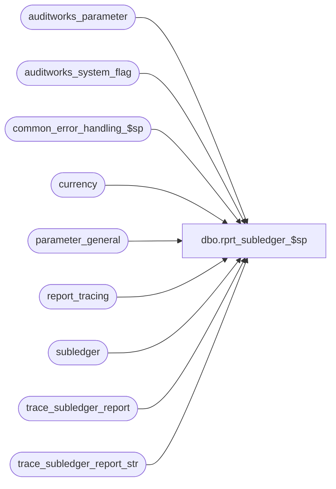

# dbo.rprt_subledger_$sp

**Database:** auditworks  
**Server:** bedrockdb01  

## Architecture Diagram



## Table Dependencies

| Referenced Table |
|---|
| auditworks_parameter |
| auditworks_system_flag |
| common_error_handling_$sp |
| currency |
| parameter_general |
| report_tracing |
| subledger |
| trace_subledger_report |
| trace_subledger_report_str |

## Stored Procedure Code

```sql
create proc dbo.rprt_subledger_$sp ( 
  @store_group_table_name          nvarchar(40) = 'ORG_CHN', 	-- created by foundation, extracted by rdl, contains stores selected or if all  then those to which user's audit group grants access.
  @language_id                     smallint = 1033,
  @from_date                       smalldatetime = null,
  @to_date                         smalldatetime = null,
  @include_date                    tinyint = 0,
  @include_store                   tinyint = 0,
  @include_object_action           tinyint = 0,
  @convert_to_base				   tinyint = 0, 		-- 0=report in base currency, 1=report in store local currency
  @currency_code				   char(3) = null,		-- Any value that does not exist in currency table will be treated as "all";  
  @trans_category_restriction	   varchar(8000) = null,  -- comma delimited value list, or word 'NULL' or '' = All
  @object_action_restriction	   varchar(8000) = null,  -- valid SQL condition
  @gl_account_restriction	       varchar(8000) = null,  -- valid SQL condition
  @unit_of_measure_restriction     varchar(8000) = '1',  -- comma delimited value list (from code_description where code_type = 258, 1=financial monetary amount, etc) or null or word NULL = All
  @run_as_trace_execution_time 	   datetime = null
) 
AS
/*
  Proc name: rprt_subledger_$sp
       Desc: Subledger Report
             Returns data by G/L account to UI, additionally broken out by store and/or date and/or object/action based on format option selected by user.
  Note:  to run report using criteria of prior UI execution, do 
			SELECT execution_datetime, * from trace_subledger_report order by execution_datetime DESC
		 choose the excecution_datetime of interest and run
		    EXEC   dbo.rprt_subledger_$sp @run_as_trace_execution_time = '2014-08-19 11:29:37.140'

  Issue:  if tax rebuilds have occurred, the tax-stripping for the out and in end up in different db/cr columns.
  
  HISTORY:
  Date     Name	      Defect# Desc
  Sep12,14 Vicci       139695 Support unit_of_measure selectivity and grouping.
  Aug14,14 Vicci    TFS-63833 Created to avoid having to fix same code in 9 subledger rdls.
   */

DECLARE
   @errmsg            nvarchar(2000),
   @errmsg2	      nvarchar(2000),
   @errno             int,
   @message_id        int,
   @object_name       nvarchar(255),
   @operation_name    nvarchar(100),
   @process_name      nvarchar(100),
   @process_no        int,

   @min_store         int,
   @max_store         int,
   @sql               nvarchar(max),
   @inner_sql         nvarchar(max),
   @base_currency_code  nvarchar(3),
   @base_currency_id  numeric(12,0),
   @base_currency_desc nvarchar(50),
   @execution_datetime datetime,
   
   @external_archive_in_use numeric(16,4),
   @prefix			nvarchar(5)
   
SELECT @process_name = 'rprt_subledger_$sp',
       @process_no   = 302,
       @message_id   = 201068,
       @execution_datetime = getdate();

BEGIN TRY;  --Trace input parameters

  IF @run_as_trace_execution_time IS NOT NULL
  BEGIN  
    SELECT @errmsg         = 'Unable to retrieve trace information. ',
           @object_name    = 'trace_subledger_report',
           @operation_name = 'SELECT';
    SELECT @store_group_table_name = store_group_table_name, @language_id = language_id, @from_date = from_date, @to_date = to_date, 
           @include_date = include_date, @include_store = include_store, @include_object_action = include_object_action, 
           @convert_to_base = convert_to_base, @currency_code = currency_code, 
           @trans_category_restriction = trans_category_restriction, @object_action_restriction = object_action_restriction, @gl_account_restriction = gl_account_restriction, @unit_of_measure_restriction = unit_of_measure_restriction
      FROM trace_subledger_report
     WHERE execution_datetime = @run_as_trace_execution_time;
  END
  
  SELECT @errmsg         = 'Unable to clean trace information. ',
         @object_name    = 'trace_subledger_report',
         @operation_name = 'DELETE';
  BEGIN
    DELETE trace_subledger_report
     WHERE execution_datetime < dateadd(dd, -4, getdate());
  END;   

  IF NOT EXISTS (SELECT 1 FROM sysobjects WHERE type = 'U' AND name = 'trace_subledger_report_str')
  BEGIN
  CREATE TABLE trace_subledger_report_str (
         execution_datetime	datetime  DEFAULT getdate() NOT NULL,
         ORG_CHN_NUM		int NULL
  );
  END
  ELSE
  BEGIN
    DELETE trace_subledger_report_str
     WHERE execution_datetime < dateadd(dd, -4, getdate());
  END;   
  
  IF @run_as_trace_execution_time IS NULL
  BEGIN
    SELECT @sql = '  INSERT INTO trace_subledger_report_str(execution_datetime, ORG_CHN_NUM) SELECT @execution_datetime, ORG_CHN_NUM FROM ' + @store_group_table_name
    SELECT @errmsg         = 'Unable to execute dynamic sql for populating trace_subledger_report_str. ',
           @object_name    = '@sql',
           @operation_name = 'EXECUTE';
    EXEC sp_executesql @sql, N'@execution_datetime datetime', @execution_datetime;
  END;
  ELSE
  BEGIN
    SELECT @errmsg         = 'Unable to populate trace_subledger_report_str. ',
           @object_name    = 'trace_subledger_report_str',
           @operation_name = 'INSERT';
    INSERT INTO trace_subledger_report_str(execution_datetime, ORG_CHN_NUM) 
    SELECT @execution_datetime, ORG_CHN_NUM 
      FROM trace_subledger_report_str
     WHERE execution_datetime = @run_as_trace_execution_time
  END;
  
  SELECT @errmsg         = 'Unable to log trace information. ',
         @object_name    = 'trace_subledger_report',
         @operation_name = 'INSERT';
  INSERT into trace_subledger_report(         
         execution_datetime, 
         store_group_table_name, 
         language_id, 
         from_date, 
         to_date, 
         include_date, 
         include_store, 
         include_object_action, 
         convert_to_base, 
         currency_code, 
         trans_category_restriction, 
         object_action_restriction, 
         gl_account_restriction,
         unit_of_measure_restriction,
         run_as_trace_execution_time) 
  VALUES(@execution_datetime,
         @store_group_table_name,
         @language_id,
         @from_date,
         @to_date,
         @include_date, 
         @include_store, 
         @include_object_action, 
         @convert_to_base,
         @currency_code,
         @trans_category_restriction, 
         @object_action_restriction, 
         @gl_account_restriction,
         @unit_of_measure_restriction,
         @run_as_trace_execution_time);
END TRY  --trace input parameters
BEGIN CATCH
  SELECT @errno = ERROR_NUMBER();
  IF @errmsg2 IS NULL
  BEGIN
    SELECT @errmsg2 = @process_name + ':  ' + COALESCE(@errmsg, '') + ' Line: ' + CONVERT(varchar, ERROR_LINE()) + ', ' + ERROR_MESSAGE();
  END;
  SELECT @errmsg = @errmsg2;  
  EXEC common_error_handling_$sp @process_no, @errno, @errmsg2, 3, @message_id, @process_name, @object_name, @operation_name, 0;
END CATCH;  --trace input parameters


BEGIN TRY;

  SELECT @errmsg         = 'Unable to create temp store list table. ',
         @object_name    = '#rprt_subledger_store_list',
         @operation_name = 'CREATE TABLE';
  CREATE TABLE #rprt_subledger_store_list (
         store_no           int          not null,
         store_name         nvarchar(50) not null,
         currency_code      nchar(3)     null,
         currency_desc         nvarchar(50) null,
         currency_id        int		 null)

   IF UPPER(@trans_category_restriction) = 'NULL' OR LTRIM(@trans_category_restriction) = ''
     SELECT @trans_category_restriction = NULL
   IF UPPER(@gl_account_restriction) = 'NULL' OR LTRIM(@gl_account_restriction) = ''
     SELECT @gl_account_restriction = NULL
   IF UPPER(@object_action_restriction) = 'NULL' OR LTRIM(@object_action_restriction) = ''
     SELECT @object_action_restriction = NULL
   IF UPPER(@unit_of_measure_restriction) = 'NULL' OR LTRIM(@unit_of_measure_restriction) = ''
     SELECT @unit_of_measure_restriction = NULL
         
   SELECT @errmsg         = 'Unable to determine if external archive is in use. ',
          @object_name    = 'auditworks_system_flag',
          @operation_name = 'SELECT';
   SELECT @external_archive_in_use = flag_numeric_value 
     FROM auditworks_system_flag
    WHERE flag_name = 'external_archive_in_use'

  IF @external_archive_in_use = 1
  BEGIN
    IF EXISTS(SELECT 1 FROM subledger WHERE transaction_date <= @from_date)
      SELECT @external_archive_in_use = 0
  END

   SELECT @errmsg         = 'Unable to retrieve base currency ID. ',
          @object_name    = 'auditworks_parameter',
          @operation_name = 'SELECT';
   SELECT @base_currency_id = par_value
     FROM auditworks_parameter
    WHERE par_name = 'common_currency'
      AND IsNumeric(par_value) = 1;
    
   SELECT @errmsg         = 'Unable to retrieve base currency code. ',
          @object_name    = 'currency',
          @operation_name = 'SELECT';
   SELECT @base_currency_code = currency_code, 
          @base_currency_id = currency_id,
          @base_currency_desc = currency_description
     FROM currency
    WHERE currency_id = @base_currency_id;

   IF @base_currency_code IS NULL
     SELECT @base_currency_code = 'USD',
            @base_currency_id = 141,
            @base_currency_desc = 'U.S. Dollar';
     
   /* Create temporary store list table */
   
   SELECT @errmsg         = 'Unable to set dynamic sql for populating #rprt_subledger_store_list. ',
          @object_name    = '@sql',
          @operation_name = 'SELECT';
   SELECT @sql = 'INSERT INTO #rprt_subledger_store_list ( store_no, store_name, currency_code, currency_desc, currency_id)
                  SELECT s.ORG_CHN_NUM store_no, COALESCE(l.ORG_CHN_NAME, s.ORG_CHN_NAME) store_name, 
                         c.currency_code, COALESCE(ldc.display_description, c.currency_description)currency_desc,
                         c.currency_id
             	    FROM ORG_CHN s
	                     LEFT JOIN ORG_CHN_LANG l ON (s.ORG_CHN_NUM = l.ORG_CHN_NUM AND l.LANG_ID = ' + convert(varchar,@language_id) + ')
	                     INNER JOIN currency c ON COALESCE(s.DFLT_CRNCY_CODE, ''' + @base_currency_code + ''') = c.currency_code 
	                     LEFT JOIN language_dependent_description ldc ON (c.resource_id = ldc.resource_id AND ldc.language_id = ' + convert(varchar,@language_id) + ')';

  IF @currency_code NOT IN (SELECT currency_code FROM currency WHERE currency_code = @currency_code)
    SELECT @currency_code = NULL

  IF @currency_code IS NOT NULL
    SELECT @sql = @sql + ' WHERE c.currency_code = ''' + @currency_code + ''' AND '
  ELSE
    SELECT @sql = @sql + ' WHERE '
       
  IF @run_as_trace_execution_time IS NULL
    SELECT @sql = @sql + 's.ORG_CHN_NUM IN (SELECT ORG_CHN_NUM FROM ' + @store_group_table_name + ' )';
  ELSE
    SELECT @sql = @sql + 's.ORG_CHN_NUM IN (SELECT ORG_CHN_NUM FROM trace_subledger_report_str WHERE execution_datetime = @run_as_trace_execution_time' + ' )';
 
  SELECT @errmsg         = 'Unable to execute dynamic sql for populating #rprt_subledger_store_list. ',
         @object_name    = '@sql',
         @operation_name = 'EXECUTE';
  EXEC sp_executesql @sql, N'@base_currency_code char(3), @run_as_trace_execution_time datetime', @base_currency_code, @run_as_trace_execution_time;
   
  --Get min and max stores to help with index selection
  SELECT @errmsg         = 'Unable to select min and max store no. ',
         @object_name    = '#rprt_subledger_store_list',
         @operation_name = 'SELECT';
  SELECT @min_store = min(store_no), @max_store = MAX(store_no) FROM #rprt_subledger_store_list;
  
  --If no stores meet the selection criteria, exit
   IF @min_store IS NULL
   BEGIN
SELECT ' ' glAccountNo,
            @base_currency_id currencyId,
            @base_currency_desc currency,
            @base_currency_code currencyCode,
            0 dbAmount,
            0 crAmount,
            0 AS "count",
            0 units;
     RETURN;
   END;  

   IF @to_date IS NULL
     SELECT @to_date = CONVERT(smalldatetime, CONVERT(varchar, getdate(), 101))
     
   IF @from_date IS NULL
     SELECT @from_date = dateadd(dd, 1, last_date_closed)
       FROM parameter_general

   SELECT @sql = N'
   SELECT SUBSTRING(g.gl_account_no + '' '' + COALESCE(g.gl_account_description, '' ''), 1, 71) glAccountNo,
          COALESCE(o_ldd.display_description, o.line_object_description) + '' '' + COALESCE(a_ldd.display_description, a.line_action_display_descr) objectAction,
          q.store_no storeNo,
          q.store_name storeName,
          q.transaction_date transDate,
          q.currency_id currencyId,
          CASE WHEN q.currency_id IS NULL 
               THEN UPPER(SUBSTRING(COALESCE(uom_ldd.display_description, q.unit_of_measure_desc), 1, 1)) + SUBSTRING(COALESCE(uom_ldd.display_description, q.unit_of_measure_desc), 2, 255) 
               ELSE q.currency_desc + '' '' + COALESCE(uom_ldd.display_description, q.unit_of_measure_desc) END currency,
          CASE WHEN q.currency_id IS NULL 
               THEN UPPER(SUBSTRING(COALESCE(uom_ldd.display_description, q.unit_of_measure_desc), 1, 1)) + SUBSTRING(COALESCE(uom_ldd.display_description, q.unit_of_measure_desc), 2, 255) 
               ELSE q.currency_code + CASE WHEN q.unit_of_measure <> 1 THEN '' '' + COALESCE(uom_ldd.display_description, q.unit_of_measure_desc) ELSE '' '' END END currencyCode,
          SUM(CASE WHEN q.IsDebit = 1 THEN q.amount ELSE 0 END) dbAmount,
          SUM(CASE WHEN q.IsDebit = 1 THEN 0 ELSE q.amount END) crAmount,
          SUM(q.transaction_qty) AS "count",
          SUM(q.units) unit
     FROM ('

     SELECT @inner_sql = '
     SELECT CASE WHEN COALESCE(cd.alpha_code, convert(nvarchar, cd.code)) IN (''1'', ''2'') THEN ' + CASE WHEN @convert_to_base = 1 THEN CONVERT(nvarchar, @base_currency_id) ELSE 'w.currency_id' END + '  ELSE NULL END' + N' currency_id,
            CASE WHEN COALESCE(cd.alpha_code, convert(nvarchar, cd.code)) IN (''1'', ''2'') THEN ' + CASE WHEN @convert_to_base = 1 THEN '''' + @base_currency_desc + '''' ELSE 'w.currency_desc' END + ' ELSE NULL END' + N' currency_desc,
            CASE WHEN COALESCE(cd.alpha_code, convert(nvarchar, cd.code)) IN (''1'', ''2'') THEN ' + CASE WHEN @convert_to_base = 1 THEN '''' + @base_currency_code + '''' ELSE 'w.currency_code' END + ' ELSE NULL END' + N' currency_code,
                  ' + CASE WHEN @include_date = 1 THEN 's.transaction_date' ELSE '@to_date' END + N' transaction_date,
                  ' + CASE WHEN @include_store = 1 THEN 's.store_no' ELSE '-1' END + N' store_no,
                  ' + CASE WHEN @include_store = 1 THEN 'w.store_name' ELSE '''All''' END + N' store_name,
                  ' + CASE WHEN @include_object_action = 1 THEN 's.line_object' ELSE '-1' END + N' line_object,
                  ' + CASE WHEN @include_object_action = 1 THEN 's.line_action' ELSE '38' END + N' line_action,
                  CASE WHEN s.data_source = 2 AND o.line_object_type <> 5 THEN 1 - SIGN(1 + SIGN(s.amount)) ELSE SIGN(1 + SIGN(s.amount)) END IsDebit,
                  s.gl_account_id,
                  ' + CASE WHEN @convert_to_base = 1 THEN 'SUM(s.amount * cc.exchange_rate)' ELSE 'SUM(s.amount)' END + N' amount,
                  SUM(s.transaction_qty) transaction_qty,
                  SUM(s.units) units,
                  COALESCE(cd.code_display_descr, convert(nvarchar, s.unit_of_measure), ''1'') unit_of_measure_desc,
                  cd.resource_id unit_of_measure_resource_id,
                  COALESCE(s.unit_of_measure, 1) unit_of_measure
             FROM #rprt_subledger_store_list w
                  INNER JOIN subledger s 
                     ON w.store_no = s.store_no
                    AND s.store_no >= ' + CONVERT(nvarchar, @min_store) + N'
                    AND s.store_no <= ' + CONVERT(nvarchar, @max_store) + N'
                    AND s.transaction_date >= @from_date
                    AND s.transaction_date <= @to_date'

IF @unit_of_measure_restriction IS NOT NULL
BEGIN
  SELECT @inner_sql = @inner_sql + '
                    AND COALESCE(s.unit_of_measure, 1) IN (' + @unit_of_measure_restriction + ')'
END
IF @trans_category_restriction IS NOT NULL
BEGIN
  SELECT @inner_sql = @inner_sql + '
                    AND s.transaction_category IN (' + @trans_category_restriction + ')'
END
IF @object_action_restriction IS NOT NULL
BEGIN
  SELECT @inner_sql = @inner_sql + @object_action_restriction
END

SELECT @inner_sql = @inner_sql + '
                  LEFT OUTER JOIN line_object o
                    ON s.line_object = o.line_object
                  LEFT OUTER JOIN code_description cd
                    ON cd.code_type = 258
                   AND COALESCE(s.unit_of_measure, 1) = cd.code'

IF @convert_to_base = 1
BEGIN  
  SELECT @inner_sql = @inner_sql + '                   
                  LEFT OUTER JOIN currency_conversion cc
                    ON cc.currency_conversion_type_id = 1
                   AND cc.currency_id = w.currency_id
                   AND cc.effective_date_from <= s.transaction_date
                   AND (cc.effective_date_to >= s.transaction_date OR cc.effective_date_to IS NULL)'
END

SELECT @inner_sql = @inner_sql + '
                 GROUP BY COALESCE(cd.alpha_code, convert(nvarchar, cd.code)), COALESCE(cd.code_display_descr, convert(nvarchar, s.unit_of_measure), ''1''), cd.resource_id, COALESCE(s.unit_of_measure, 1), ', 
       @prefix = ' '
       
IF @convert_to_base = 0 SELECT @inner_sql = @inner_sql + @prefix + ' CASE WHEN COALESCE(cd.alpha_code, convert(nvarchar, cd.code)) IN (''1'', ''2'') THEN w.currency_id ELSE NULL END, CASE WHEN COALESCE(cd.alpha_code, convert(nvarchar, cd.code)) IN (''1'', ''2'') THEN w.currency_desc ELSE NULL END, CASE WHEN COALESCE(cd.alpha_code, convert(nvarchar, cd.code)) IN (''1'', ''2'') THEN w.currency_code ELSE NULL END',  @prefix = ', '
  
IF @include_date = 1 SELECT @inner_sql = @inner_sql + @prefix + 's.transaction_date', @prefix = ', '

IF @include_store = 1 SELECT @inner_sql = @inner_sql + @prefix + 's.store_no,  w.store_name', @prefix = ', '    
  
IF @include_object_action = 1 SELECT @inner_sql = @inner_sql + @prefix + 's.line_object, s.line_action', @prefix = ', '    

SELECT @inner_sql = @inner_sql + @prefix + '
                  CASE WHEN s.data_source = 2 AND o.line_object_type <> 5 THEN 1 - SIGN(1 + SIGN(s.amount)) ELSE SIGN(1 + SIGN(s.amount)) END,
                  s.gl_account_id '

SELECT @sql = @sql + @inner_sql

IF @external_archive_in_use = 1
  SELECT @sql = @sql + '
         UNION ALL
         ' + REPLACE(@inner_sql, 'subledger s', 'ex_subledger s')
         
SELECT @sql = @sql + ') q
	INNER JOIN gl_account_cross_reference g 
	   ON g.gl_account_id = q.gl_account_id 
	INNER JOIN line_object o
	   ON q.line_object = o.line_object
	INNER JOIN line_action a
	   ON q.line_action = a.line_action
	 LEFT OUTER JOIN language_dependent_description uom_ldd
	   ON uom_ldd.language_id = ' + CONVERT(nvarchar, @language_id) + '
	  AND q.unit_of_measure_resource_id = uom_ldd.resource_id
	 LEFT OUTER JOIN language_dependent_description o_ldd
	   ON o_ldd.language_id = ' + CONVERT(nvarchar, @language_id) + '
	  AND o.resource_id = o_ldd.resource_id
	 LEFT OUTER JOIN language_dependent_description a_ldd
	   ON a_ldd.language_id = ' + CONVERT(nvarchar, @language_id) + '
	  AND a.resource_id = o_ldd.resource_id'

IF @gl_account_restriction IS NOT NULL
BEGIN
  SELECT @sql = @sql + ' WHERE ' + @gl_account_restriction
END
	   
SELECT @sql = @sql + '
    GROUP BY  COALESCE(uom_ldd.display_description, q.unit_of_measure_desc), 
              q.currency_desc,
	      q.currency_id,
	      q.currency_code,
	      q.unit_of_measure,
	      q.unit_of_measure_desc,
	      SUBSTRING(g.gl_account_no + '' '' + COALESCE(g.gl_account_description, '' ''), 1, 71),
	      COALESCE(o_ldd.display_description, o.line_object_description) + '' '' + COALESCE(a_ldd.display_description, a.line_action_display_descr),
	      q.store_no,
	      q.store_name,
	      q.transaction_date
    ORDER BY q.currency_desc,
	      SUBSTRING(g.gl_account_no + '' '' + COALESCE(g.gl_account_description, '' ''), 1, 71),
	      q.store_no,
	      COALESCE(o_ldd.display_description, o.line_object_description) + '' '' + COALESCE(a_ldd.display_description, a.line_action_display_descr),
	      q.transaction_date
'
--PRINT @sql

SELECT @errmsg         = 'Unable to execute dynamic sql for retrieving subledger report data. ',
         @object_name    = '@sql',
         @operation_name = 'EXECUTE';
  EXEC sp_executesql @sql, N'@from_date smalldatetime, @to_date smalldatetime', @from_date, @to_date;


DROP TABLE #rprt_subledger_store_list;

RETURN;

END TRY

BEGIN CATCH
  SELECT @errno = ERROR_NUMBER();
  IF @errmsg2 IS NULL
  BEGIN
    SELECT @errmsg2 = @process_name + ':  ' + COALESCE(@errmsg, '') + ' Line: ' + CONVERT(varchar, ERROR_LINE()) + ', ' + ERROR_MESSAGE();
  END;
  SELECT @errmsg = @errmsg2;  

  IF @object_name = '@sql' AND @operation_name = 'EXECUTE'
  BEGIN
     INSERT INTO report_tracing (trace_source, trace_object, trace_timestamp, trace_value, trace_comment)
     VALUES (@process_name, 'SQL', getdate(), @sql, @errmsg);
     
     SELECT @errmsg2 = @errmsg2 + '  -see report_tracing table for details of failed dynamic sql.'
  END
  
  EXEC common_error_handling_$sp @process_no, @errno, @errmsg2, 0, @message_id, @process_name, @object_name, @operation_name, 0;
  
  RETURN;
END CATCH;
```

