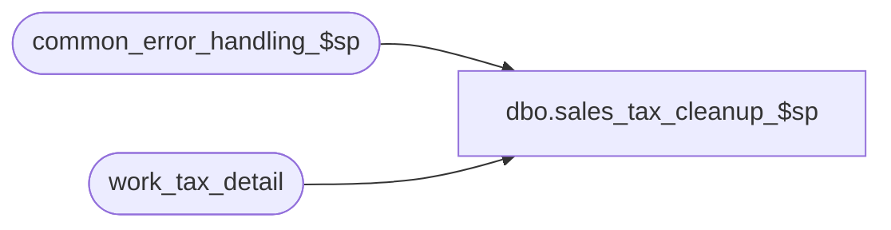

# dbo.sales_tax_cleanup_$sp

**Database:** auditworks  
**Server:** bedrockdb01  

## Architecture Diagram



## Table Dependencies

| Referenced Table |
|---|
| common_error_handling_$sp |
| work_tax_detail |

## Stored Procedure Code

```sql
create proc dbo.sales_tax_cleanup_$sp 
( @process_id                    binary(16),
  @user_id                       int,
  @function_no                   smallint,
  @tax_rounding_method           tinyint,
  @stream_no                     int = 1,
  @errmsg                        nvarchar(255) OUTPUT
)

AS

/*
PROC NAME: sales_tax_cleanup_$sp
     DESC: delete rows in tables work_tax_detail, work_tax_round, work_tax_detail_round.

           Called by sales_tax_main_$sp, sales_tax_rebuild_$sp, pre_audit_tax_$sp, edit_pre_audit_tax_$sp

  HISTORY:
Date     Name		Def#  Desc
Jan05,11 Paul       105313  Use unicode datatypes
Jan22,07 Phu         DV-1354  Apply 81550 to SA5. Remove work_tax_round, work_tax_detail_round tables.
Sep15,04 IanK        DV-1146  Use user_id
Apr28,04 Maryam      DV-1071  Changed @process_id from tinyint to binary(16) and pass to common_error_handling_$sp.
Dec19,02 Phu            5327  cleanup work_tax_detail, work_tax_round, work_tax_detail_round tables

*/

DECLARE
       @errno                            int,
       @message_id                       int,
       @min_store_no                     int,
       @object_name                      nvarchar(255),
       @operation_name                   nvarchar(100),
       @tax_post_type                    smallint,
       @process_name                     nvarchar(100),
       @rows                             int

SELECT @message_id = 201068,
       @process_name = 'sales_tax_cleanup_$sp'

DELETE FROM work_tax_detail
WHERE process_id = @process_id

SELECT @errno = @@error
IF @errno <> 0
BEGIN
  SELECT @errmsg = 'Unable to delete work_tax_detail.',
         @object_name = 'work_tax_detail',
         @operation_name = 'DELETE'
  GOTO error
END

RETURN


error:
       EXEC common_error_handling_$sp @function_no, @errno, @errmsg, 0, @message_id, 
       @process_name, @object_name, @operation_name, 0, @stream_no, 0, null,
       0, null, null, null, null, null, null, 0, @process_id, @user_id
       RETURN
```

