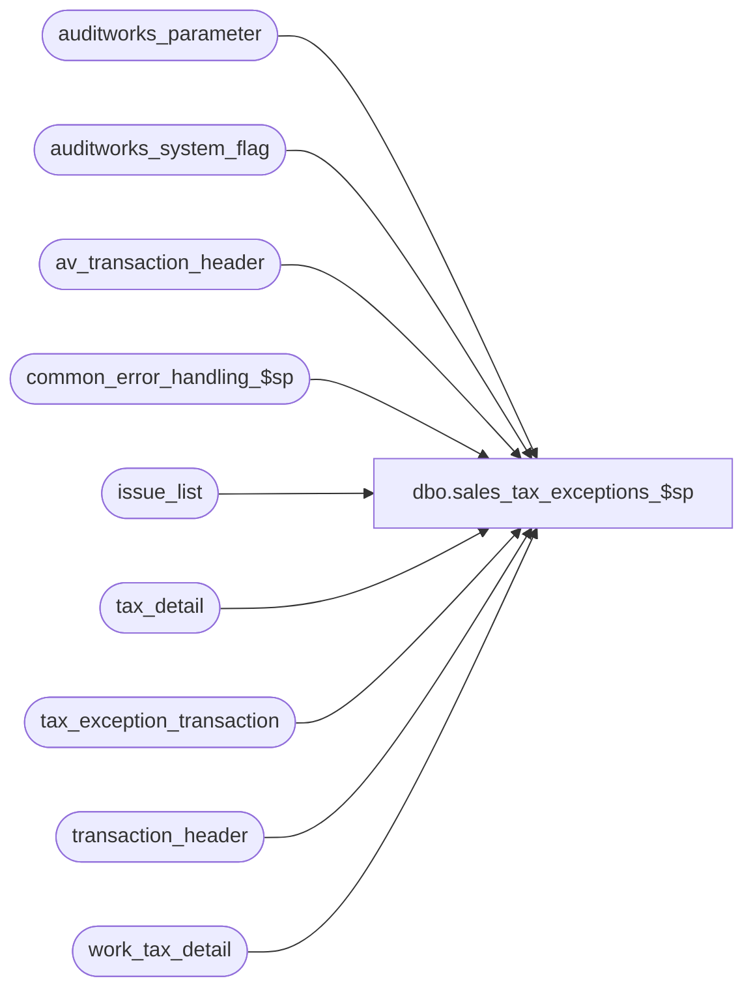

# dbo.sales_tax_exceptions_$sp

**Database:** auditworks  
**Server:** bedrockdb01  

## Architecture Diagram



## Table Dependencies

| Referenced Table |
|---|
| auditworks_parameter |
| auditworks_system_flag |
| av_transaction_header |
| common_error_handling_$sp |
| issue_list |
| tax_detail |
| tax_exception_transaction |
| transaction_header |
| work_tax_detail |

## Stored Procedure Code

```sql
create proc dbo.sales_tax_exceptions_$sp ( @process_id                    binary(16),
  @function_no                   smallint,
  @update_timing                 smallint,
  @tax_rounding_method           tinyint,
  @log_tax_override              tinyint = null,       -- mandatory except for Pre-audit Tax which used #tax_transactions
  @store_no                      int = null,           -- mandatory except for Pre-audit Tax which used #tax_transactions
  @sales_date                    smalldatetime = null, -- mandatory except for Pre-audit Tax which used #tax_transactions
  @errmsg                        nvarchar(2000) OUTPUT
)

AS

/*
PROC NAME: sales_tax_exceptions_$sp
     DESC: Log sales tax exceptions to tax_exception_transaction table.
           Called by sales_tax_main_$sp, sales_tax_rebuild_$sp, edit_pre_audit_tax_$sp, pre_audit_tax_$sp

  HISTORY:
Date     Name		Def#  Desc
Oct31,13 Vicci        147711  When batch includes a store/date for which a tax-issue transaction had previously been posted
                              and the current batch has a tax exception transaction for the same store/date but no tax-issue 
                              for the date, the min_tax_issue_date is set incorrectly, resulting in expired rows no longer
                              being marked as verified.
                              Don't reevaluate store/date for which only exceptions but no discrepancies exist.
Sep14,10 Vicci     116453fix  Since there can be several #tax_exception_list entries for the same transaction, some of
                              which indicate a discrepancy and some not, ensure the transaction_header.tax_override_flag
                              which is still used by the UI is set to the max.
Jul16,10 Vicci        119562  Set verified date in issues_list
Jun07,10 Vicci     109078fix  Log new issues even if no old issues previously existed (end if was positioned incorrectly).
Mar08,10 Vicci        116453  Since UI displays a "tax expected vs collected difference" message when 
			      transaction_header.tax_override_flag = 1, ensure it is set to a different value (2) when
			      the transaction has no such issue but is being kept in the extended archive by virtue of
			      being a send/return from another store/etc.
Sep11,09 Vicci        109078  Avoid double posting tax exceptions.
Jul23,09 Vicci        109078  Add "track_tax" flag to allow UI drill-down to exclude order if fulfilments are being tracked.
                              Log exceptions pre-audit instead of during dayend when tax is pre-audit in order to 
                              give auditor the chance to review the issues prior to accepting the date.
Apr13,07 Phu         DV-1361  Patch 85324 to SA5. Post to tax_exception_transaction table for tax-exempt transactions.
Jan22,07 Phu         DV-1354  Apply 81550 to SA5. Use work_tax_detail instead of obsolete work_tax_detail_round.
Apr29,05 Paul        DV-1234  expand transaction_id to use tran_id_datatype
Dec14,04 David       DV-1191  Improve performance by adding hints.
Oct07,04 David       DV-1146  Use new column issue_list.verified_by_user_id.
May10,04 Maryam      DV-1071  Modified @process_id from int to binary(16).
Jan30,03 Maryam         5842  Add gl_effect to tax_amount_expected when rounding by line.
                              Don't log tax exceptions when discrepancy is 0.01
Dec19,02 Phu            5327  Log tax exceptions from work_tax_detail_round
Apr25,02 Phu         1-C9P5S  Pre Audit tax


SELECT transaction_id, store_no, transaction_date, transaction_category,
       log_tax_override, store_tax_jurisdiction,
       tod_tax_jurisdiction, -- 74673
       header_override_flag, -- 74673
       all_tax_override_flag -- 74673  
INTO #tax_transactions
FROM work_tax_trans_template
  
*/

DECLARE
        @auto_verify_dayend_issues       tinyint,
        @date_time_retrieval             datetime,
 @errno                           int,
        @exception_rows                  int,
        @discrepancy_rows		 int,		--147711
        @discrepancy_del_rows		 int,		--147711
        @message_id                      int,
        @min_transaction_date            smalldatetime,
        @object_name                     nvarchar(255),
        @operation_name                  nvarchar(100),
        @process_name                    nvarchar(100),
        @del_rows			 int,
        @expired_issue_rows		 int,
        @reevaluation_datetime		 datetime,
        @temp_table_created		 tinyint,
        @errmsg2			 nvarchar(2000);

SELECT @message_id = 201068,
       @process_name = 'sales_tax_exceptions_$sp',
       @exception_rows = 0,
       @discrepancy_rows = 0,		--147711
       @discrepancy_del_rows = 0,	--147711
       @del_rows = 0,
       @expired_issue_rows = 0,
       @temp_table_created = 0;

IF (   (@update_timing <> 6 OR @function_no = 161)  --if dayend update timing or rebuild
        AND 
       (@log_tax_override IS NULL OR @log_tax_override <= 0 OR @store_no IS NULL OR @sales_date IS NULL)) -- and mandatory input params not given
    OR (@function_no = 22 AND @update_timing = 6)  -- or this is the dayend but the update timing is Edit therefore pre-audit tax exceptions already logged
  RETURN;

/* flag transactions with mismatched expected/collected as tax_overrides
   providing that the diffence is more than one percent of tax collected and at least one cent.
   or there is a tax category other than standard or when the override_tax_category > 0. 
   
   Note: log_tax_override = 0 means do not retain tax override transactions in extended archive.
         1 = only retain tax override transactions with mismatched expected/collected.
         2 = retain all tax override transactions in extended archive.
*/

BEGIN TRY

SELECT @errmsg = 'Failed to create temp table to hold list of store/dates whose issue_list is impacted by this run. ',
       @object_name = '#discrepancy_store_date',
       @operation_name = 'CREATE';
CREATE TABLE #discrepancy_store_date (
       store_no int not null,
       transaction_date smalldatetime not null,
       insert_delete_flag nvarchar(1) not null);
SELECT @temp_table_created = 1;

SELECT @errmsg = 'Failed to create temp table #tax_exception_list. ',
       @object_name = '#tax_exception_list',
       @operation_name = 'CREATE';
CREATE TABLE #tax_exception_list (
	transaction_id numeric(14,0) not null, -- tran_id_datatype
	tax_level tinyint not null,
	store_no int not null,
	transaction_date smalldatetime not null,
	tax_category tinyint not null, 
	tax_jurisdiction nchar(5) not null,
	tax_rate_code tinyint not null,
	combined_tax_rate numeric(6,4) not null,
	tax_on_tax_level tinyint not null ,
	tax_on_combined_rate numeric(6,4) not null,
	tax_amount_collected float not null,
	tax_amount_expected float not null,
	discrepancy_flag tinyint not null,
	track_tax tinyint default 1 not null );
SELECT @temp_table_created = 2;

SELECT @errmsg = 'Unable to select auto_verify_dayend_issues from auditworks_parameter. ',
       @object_name = 'auditworks_parameter',
       @operation_name = 'SELECT';
SELECT @auto_verify_dayend_issues = CONVERT(tinyint, par_value)
  FROM auditworks_parameter
 WHERE par_name = 'auto_verify_dayend_issues';

SELECT @auto_verify_dayend_issues = ISNULL(@auto_verify_dayend_issues, 0);

IF @update_timing = 6 AND @function_no <> 161 
BEGIN
  IF @tax_rounding_method = 1 -- tax rounding by transaction
  BEGIN
    SELECT @errmsg = 'Failed to insert #tax_exception_list for @tax_rounding_method = 1 (Pre-audit). ',
           @object_name = '#tax_exception_list',
           @operation_name = 'INSERT';
    INSERT #tax_exception_list (
           transaction_id,
           tax_level,
           store_no,
           transaction_date,
           tax_category,
           tax_jurisdiction,
           tax_rate_code,
           combined_tax_rate,
           tax_on_tax_level,
           tax_on_combined_rate,
           tax_amount_collected,
           tax_amount_expected,
           discrepancy_flag,
           track_tax )
    SELECT td.transaction_id,
           tax_level,
           h.store_no,
           h.transaction_date,
           tax_category,
           tax_jurisdiction,
           tax_rate_code,
           combined_rate,
           tax_on_tax_level,
           tax_on_combined_rate,
           SUM(tax_amount * gl_effect),
           ROUND(SUM(tax_amount_expected * gl_effect), 2),
           1 - SIGN ( 1 - (SIGN (ABS (SUM (tax_amount * gl_effect) - ROUND(SUM(tax_amount_expected * gl_effect), 2)) - ROUND((ABS(SUM (tax_amount * gl_effect) )* 0.01 + .00555),2)))),
           MAX(td.track_tax)
      FROM #tax_transactions tt, tax_detail td WITH (NOLOCK), transaction_header h WITH (NOLOCK)
     WHERE tt.transaction_id = h.transaction_id
       AND h.date_reject_id = 0
       AND h.transaction_void_flag IN (0,8)
       AND h.transaction_id = td.transaction_id
     GROUP BY
           td.transaction_id,
           tax_level,
           h.store_no,
           h.transaction_date,
           tax_category,
           tax_jurisdiction,
           tax_rate_code,
           combined_rate,
           tax_on_tax_level,
           tax_on_combined_rate,
           tt.log_tax_override
    HAVING ABS (SUM (tax_amount * gl_effect) - ROUND(SUM(tax_amount_expected * gl_effect), 2))
           > ROUND((ABS(SUM (tax_amount * gl_effect) )* 0.01 + .00555),2)
        OR (MAX(tax_category) <> 0 AND tt.log_tax_override = 2);
    SELECT @exception_rows = @@rowcount;
  END; --IF @tax_rounding_method = 1
  ELSE
  BEGIN
    SELECT @errmsg = 'Failed to insert #tax_exception_list for @tax_rounding_method <> 1 (Pre-audit). ',
           @object_name = '#tax_exception_list',
           @operation_name = 'INSERT';
    INSERT #tax_exception_list (
           transaction_id,
           tax_level,
           store_no,
           transaction_date,
           tax_category,
           tax_jurisdiction,
           tax_rate_code,
           combined_tax_rate,
           tax_on_tax_level,
           tax_on_combined_rate,
           tax_amount_collected,
           tax_amount_expected,
           discrepancy_flag,
           track_tax)
    SELECT td.transaction_id,
           tax_level,
           h.store_no,
           h.transaction_date,
           tax_category,
           tax_jurisdiction,
           tax_rate_code,
           combined_rate,
           tax_on_tax_level,
           tax_on_combined_rate,
           SUM(tax_amount * gl_effect),
           SUM(ROUND(tax_amount_expected * gl_effect, 2)),
           1 - SIGN ( 1 - (SIGN (ABS (SUM (tax_amount * gl_effect) - SUM(ROUND(tax_amount_expected * gl_effect, 2))) - ROUND((ABS(SUM (tax_amount * gl_effect) )* 0.01 + .00555),2)))),
           MAX(td.track_tax) 
      FROM #tax_transactions tt, tax_detail td WITH (NOLOCK), transaction_header h WITH (NOLOCK)
     WHERE tt.transaction_id = h.transaction_id
       AND h.date_reject_id = 0
       AND h.transaction_void_flag IN (0,8)
       AND h.transaction_id = td.transaction_id
     GROUP BY
           td.transaction_id,
           tax_level,
           h.store_no,
           h.transaction_date,
           tax_category,
           tax_jurisdiction,
           tax_rate_code,
           combined_rate,
           tax_on_tax_level,
           tax_on_combined_rate,
           tt.log_tax_override 
    HAVING ABS (SUM (tax_amount * gl_effect) - SUM(ROUND(tax_amount_expected * gl_effect, 2)))
             > ROUND((ABS(SUM (tax_amount * gl_effect) )* 0.01 + .00555),2)
        OR (MAX(tax_category) <> 0 AND tt.log_tax_override = 2);
    SELECT @exception_rows = @@rowcount;
  END; --ELSE of IF @tax_rounding_method = 1
 
  --147711
  IF @exception_rows > 0
  BEGIN
    SELECT @errmsg = 'Failed to count transactions in current batch which are discrepancies. ',
  	   @object_name = '#discrepancy_store_date',
 	   @operation_name = 'INSERT';
    INSERT INTO #discrepancy_store_date(store_no, transaction_date, insert_delete_flag)
    SELECT DISTINCT store_no, transaction_date, 'I'
      FROM #tax_exception_list
     WHERE discrepancy_flag = 1;
    SELECT @discrepancy_rows = @@rowcount;

    IF @discrepancy_rows > 0
    BEGIN
      SELECT @errmsg = 'Failed to determine ealiest date of new discrepancies. ',
    	     @object_name = '#discrepancy_store_date',
	     @operation_name = 'SELECT';
      SELECT @min_transaction_date = MIN(transaction_date) 
        FROM #discrepancy_store_date
       WHERE insert_delete_flag = 'I';
    END; --IF @discrepancy_rows > 0
  END; --IF @exception_rows > 0
     
  --147711
  SELECT @errmsg = 'Failed to count transactions in current batch previously logged as discrepancies in tax_exception_transaction table. ',
	 @object_name = 'tax_exception_transaction',
	 @operation_name = 'SELECT';
  INSERT INTO #discrepancy_store_date(store_no, transaction_date, insert_delete_flag)
  SELECT DISTINCT tx.store_no, tx.transaction_date, 'D'
    FROM #tax_transactions tt
         INNER JOIN tax_exception_transaction tx
            ON tt.transaction_id = tx.av_transaction_id
           AND tx.discrepancy_flag = 1;
  SELECT @discrepancy_del_rows = @@rowcount;
        
  SELECT @errmsg = 'Failed to delete tax_exception_transaction table previously logged. ',
 	 @object_name = 'tax_exception_transaction',
	 @operation_name = 'DELETE';
  DELETE tax_exception_transaction
    FROM #tax_transactions tt
   WHERE tt.transaction_id = tax_exception_transaction.av_transaction_id;
  SELECT @del_rows = @@rowcount;
    
  IF @exception_rows > 0 
  BEGIN
    SELECT @errmsg = 'Failed to insert tax_exception_transaction. Pre-audit. ',
      	   @object_name = 'tax_exception_transaction',
      	   @operation_name = 'INSERT';
    INSERT tax_exception_transaction (
           av_transaction_id,
           transaction_date,
           store_no,
           tax_level,
           tax_category,
           tax_jurisdiction,
           tax_rate_code,
           combined_tax_rate,
           tax_on_tax_level,
           tax_on_combined_rate,
           tax_amount_collected,
           tax_amount_expected,
           discrepancy_flag,
           track_tax )
    SELECT transaction_id,
           transaction_date, 
           store_no, 
           tax_level, 
           tax_category, 
           tax_jurisdiction,
           tax_rate_code,
           combined_tax_rate,
           tax_on_tax_level,
           tax_on_combined_rate,
           tax_amount_collected,
           tax_amount_expected,
           discrepancy_flag,
           track_tax 
      FROM #tax_exception_list WITH (NOLOCK);
  END; --IF @exception_rows > 0

  SELECT @reevaluation_datetime = getdate();
      
  IF @discrepancy_rows > 0 OR @discrepancy_del_rows > 0
  BEGIN
    SELECT @errmsg = 'Failed to select prior flag_datetime_value. ',
	   @object_name = 'auditworks_system_flag',
	   @operation_name = 'SELECT'
    SELECT @date_time_retrieval = flag_datetime_value
      FROM auditworks_system_flag
     WHERE flag_name = 'min_tax_issue_date';

    IF @date_time_retrieval IS NOT NULL
    BEGIN 
      SELECT @errmsg = 'Failed to reset issue_list. ',
	     @object_name = 'issue_list',
	     @operation_name = 'UPDATE';
      UPDATE issue_list
         SET verified = 1,
             verified_by_user_id = NULL, -- system       
             verified_date = @reevaluation_datetime
        FROM (SELECT DISTINCT store_no, transaction_date
                FROM #discrepancy_store_date) tt
       WHERE tt.store_no = issue_list.store_no
         AND tt.transaction_date = issue_list.transaction_date
         AND issue_list.issue_type = 1
         AND issue_list.verified = 0
         AND issue_list.transaction_date >= @date_time_retrieval;
      SELECT @expired_issue_rows = @@rowcount;
    END;  --IF @date_time_retrieval IS NOT NULL

    SELECT @errmsg = 'Failed to rebuild issue_list. Pre-audit. ',
  	   @object_name = 'issue_list',
	   @operation_name = 'INSERT';
    INSERT issue_list (
           issue_type,
           store_no,
           transaction_date,
           detection_datetime,
           tax_level,
           tax_amount_collected,
           tax_amount_expected,
           verified,
           verified_date)
    SELECT 1,
           tt.store_no,
           tt.transaction_date,
           @reevaluation_datetime,
           tx.tax_level,
           SUM(tx.tax_amount_collected),
           SUM(tx.tax_amount_expected),
           SIGN(@auto_verify_dayend_issues),
           CASE WHEN SIGN(@auto_verify_dayend_issues) = 1 THEN @reevaluation_datetime ELSE NULL END
      FROM (SELECT DISTINCT store_no, transaction_date
              FROM #discrepancy_store_date) tt
             INNER JOIN tax_exception_transaction tx WITH (NOLOCK)
                ON tt.store_no = tx.store_no
               AND tt.transaction_date = tx.transaction_date 
               AND tx.discrepancy_flag = 1
     GROUP BY tt.store_no, tt.transaction_date, tx.tax_level;
      
    IF @min_transaction_date < @date_time_retrieval OR @date_time_retrieval IS NULL  --if a new discrepancy is dated ealier than any of the previously existing ones
    BEGIN
      SELECT @errmsg = 'Failed to lower min_tax_issue_date. Pre-audit. ',
  	     @object_name = 'issue_list',
	     @operation_name = 'INSERT';
      UPDATE auditworks_system_flag
         SET flag_datetime_value = @min_transaction_date
       WHERE flag_name = 'min_tax_issue_date'
         AND (flag_datetime_value IS NULL OR @min_transaction_date < flag_datetime_value);
    END;
    ELSE
    BEGIN
      SELECT @errmsg = 'Failed to set min_tax_issue_date in auditworks_system_flag. Pre-audit. ',
    	     @object_name = 'auditworks_system_flag',
  	     @operation_name = 'UPDATE';
      UPDATE auditworks_system_flag
         SET flag_datetime_value = (SELECT MIN(transaction_date)
			              FROM issue_list
			             WHERE issue_type = 1
			               AND verified = 0
			               AND transaction_date >= @date_time_retrieval)
       WHERE flag_name = 'min_tax_issue_date';
    END;-- IF @min_transaction_date < @date_time_retrieval
  END;--IF @del_rows > 0 OR @exception_rows > 0

  SELECT @errmsg = 'Failed to set tax_override_flag = 0 in transaction_header table (pre-audit). ',
	 @object_name = 'transaction_header',
	 @operation_name = 'UPDATE';
  UPDATE transaction_header
     SET tax_override_flag = 0
    FROM #tax_transactions tt
   WHERE tt.transaction_id = transaction_header.transaction_id 
     AND transaction_header.tax_override_flag = 1;
END;  --IF @update_timing = 6 AND @function_no <> 161 
ELSE -- post audit tax or rebuild
BEGIN
  IF @function_no = 22 OR @function_no = 161  --dayend or rebuild
  BEGIN
    IF @tax_rounding_method = 1 -- tax rounding by transaction
    BEGIN
      SELECT @errmsg = 'Failed to insert #tax_exception_list (for @tax_rounding_method = 1) in dayend or rebuild.',
             @object_name = '#tax_exception_list',
             @operation_name = 'INSERT';
      INSERT #tax_exception_list (
             transaction_id,
             tax_level,
             store_no,
             transaction_date,
             tax_category,
             tax_jurisdiction,
             tax_rate_code,
             combined_tax_rate,
             tax_on_tax_level,
             tax_on_combined_rate,
             tax_amount_collected,
             tax_amount_expected,
             discrepancy_flag,
             track_tax  )
      SELECT transaction_id,
             tax_level,
             store_no,
             transaction_date,
             tax_category,
        tax_jurisdiction,
             tax_rate_code,
             combined_tax_rate,
             tax_on_tax_level,
             tax_on_combined_rate,
             SUM((tax_amount_collected * gl_effect) + (tax_amount_paid * gl_effect)),
             ROUND(SUM(tax_amount_expected * gl_effect), 2),
             1-SIGN(1-(SIGN(ABS (SUM ((tax_amount_collected * gl_effect) + (tax_amount_paid * gl_effect)) - ROUND(SUM(tax_amount_expected * gl_effect), 2))
              - ROUND((ABS(SUM ((tax_amount_collected * gl_effect) + (tax_amount_paid * gl_effect)))* 0.01 + .00555),2)))),
             MAX(track_tax) 
        FROM work_tax_detail WITH (NOLOCK)
       WHERE process_id = @process_id
       GROUP BY
             transaction_id,
             tax_level,
             store_no,
             transaction_date,
             tax_category,
             tax_jurisdiction,
             tax_rate_code,
             combined_tax_rate,
             tax_on_tax_level,
             tax_on_combined_rate
      HAVING ABS (SUM ((tax_amount_collected * gl_effect) + (tax_amount_paid * gl_effect)) - ROUND(SUM(tax_amount_expected * gl_effect), 2))
             > ROUND((ABS(SUM ((tax_amount_collected * gl_effect) + (tax_amount_paid * gl_effect)))* 0.01 + .00555),2)
             OR ((MAX(tax_category) <> 0)  AND @log_tax_override = 2 );
      SELECT @exception_rows = @@rowcount;
    END; --IF @tax_rounding_method = 1
    ELSE -- @tax_rounding_method = 2, tax rounding by item
    BEGIN
      SELECT @errmsg = 'Failed to insert #tax_exception_list (for @tax_rounding_method <> 1) in dayend or rebuild.',
             @object_name = '#tax_exception_list',
             @operation_name = 'INSERT';
      INSERT #tax_exception_list (
             transaction_id,
             tax_level,
             store_no,
             transaction_date,
             tax_category,
             tax_jurisdiction,
             tax_rate_code,
             combined_tax_rate,
             tax_on_tax_level,
             tax_on_combined_rate,
             tax_amount_collected,
             tax_amount_expected,
             discrepancy_flag,
             track_tax )
      SELECT transaction_id,
             tax_level,
             store_no,
             transaction_date,
             tax_category,
             tax_jurisdiction,
             tax_rate_code,
             combined_tax_rate,
             tax_on_tax_level,
             tax_on_combined_rate,
                    SUM((tax_amount_collected * gl_effect) + (tax_amount_paid * gl_effect)),
             SUM(ROUND(tax_amount_expected * gl_effect, 2)),
             1 - SIGN ( 1 - (SIGN (ABS (SUM ((tax_amount_collected * gl_effect) + (tax_amount_paid * gl_effect)) - SUM(ROUND(tax_amount_expected * gl_effect, 2))) - ROUND((ABS(SUM ((tax_amount_collected * gl_effect) + (tax_amount_paid * gl_effect)))* 0.01 + .00555),2)))),
             MAX(track_tax) 
        FROM work_tax_detail WITH (NOLOCK)
       WHERE process_id = @process_id
         AND (@tax_rounding_method = 2 OR item_tax_strip_flag = 1)
       GROUP BY
             transaction_id,
             tax_level,
             store_no,
             transaction_date,
             tax_category,
             tax_jurisdiction,
             tax_rate_code,
             combined_tax_rate,
             tax_on_tax_level,
             tax_on_combined_rate
      HAVING ABS (SUM ((tax_amount_collected * gl_effect) + (tax_amount_paid * gl_effect)) - SUM(ROUND(tax_amount_expected * gl_effect, 2)))
             > ROUND((ABS(SUM ((tax_amount_collected * gl_effect) + (tax_amount_paid * gl_effect)))* 0.01 + .00555),2)
          OR (MAX(tax_category) <> 0 AND @log_tax_override = 2);
      SELECT @exception_rows = @@rowcount;
    END; --ELSE of IF @tax_rounding_method = 1    

    SELECT @reevaluation_datetime = getdate();
    
    IF @function_no = 161 -- rebuild
    BEGIN -- cleanup old flag
      SELECT @errmsg = 'Failed to set tax_override_flag = 0 in av_transaction_header table. ',
             @object_name = 'av_transaction_header',
 	     @operation_name = 'UPDATE';
      UPDATE av_transaction_header
         SET tax_override_flag = 0
       WHERE store_no = @store_no
         AND transaction_date = @sales_date
         AND date_reject_id = 0
         AND transaction_void_flag IN (0, 8)
         AND tax_override_flag >= 1;

      SELECT @errmsg = 'Failed to set tax_override_flag = 1 in av_transaction_header. ',
             @object_name = 'av_transaction_header',
             @operation_name = 'UPDATE';
      UPDATE av_transaction_header
         SET tax_override_flag = CASE WHEN te.discrepancy_flag = 1 THEN 1 ELSE 2 END 
        FROM (SELECT transaction_id, MAX(discrepancy_flag) discrepancy_flag
                FROM #tax_exception_list WITH (NOLOCK)
               GROUP BY transaction_id) te
       WHERE av_transaction_header.av_transaction_id = te.transaction_id;

      SELECT @errmsg = 'Failed to select flag_datetime_value. ',
  	     @object_name = 'auditworks_system_flag',
	     @operation_name = 'SELECT';
      SELECT @date_time_retrieval = flag_datetime_value
        FROM auditworks_system_flag
       WHERE flag_name = 'min_tax_issue_date';
        
      IF @date_time_retrieval IS NOT NULL
      BEGIN
        SELECT @errmsg = 'Failed to update issue_list. ',
  	       @object_name = 'issue_list',
	       @operation_name = 'UPDATE';
        UPDATE issue_list
           SET verified = 1,
               verified_by_user_id = NULL, -- system
               verified_date = @reevaluation_datetime
         WHERE store_no = @store_no
           AND transaction_date = @sales_date
           AND issue_type = 1
           AND verified = 0
           AND transaction_date >= @date_time_retrieval;

        SELECT @errmsg = 'Failed to update issue_list. ',
	       @object_name = 'issue_list',
	       @operation_name = 'SELECT';
        SELECT @min_transaction_date = MIN(transaction_date)
          FROM issue_list
         WHERE issue_type = 1
           AND verified = 0
           AND transaction_date >= @date_time_retrieval;

        SELECT @errmsg = 'Failed to update auditworks_system_flag. ',
	       @object_name = 'auditworks_system_flag',
	       @operation_name = 'UPDATE';
        UPDATE auditworks_system_flag
           SET flag_datetime_value = @min_transaction_date
         WHERE flag_name = 'min_tax_issue_date';
      END; --IF @date_time_retrieval IS NOT NULL
    END; -- if @function_no = 161 -- rebuild
    ELSE
    BEGIN
      SELECT @errmsg = 'Failed to set tax_override_flag = 0 in transaction_header table. ',
	     @object_name = 'transaction_header',
	     @operation_name = 'UPDATE';
      UPDATE transaction_header
         SET tax_override_flag = 0
       WHERE store_no = @store_no
         AND transaction_date = @sales_date
         AND date_reject_id = 0
         AND transaction_void_flag IN (0, 8)
         AND tax_override_flag = 1;
    END;  --ELSE of if @function_no = 161

    SELECT @errmsg = 'Failed to delete tax_exception_transaction table. ',
  	   @object_name = 'tax_exception_transaction',
  	   @operation_name = 'DELETE';
    DELETE tax_exception_transaction
     WHERE store_no = @store_no
       AND transaction_date = @sales_date;

    IF @exception_rows > 0
    BEGIN
      SELECT @errmsg = 'Failed to insert tax_exception_transaction. ',
	     @object_name = 'tax_exception_transaction',
  	     @operation_name = 'INSERT';
      INSERT tax_exception_transaction (
             av_transaction_id,
             transaction_date,
             store_no,
             tax_level,
             tax_category,
             tax_jurisdiction,
             tax_rate_code,
             combined_tax_rate,
             tax_on_tax_level,
             tax_on_combined_rate,
             tax_amount_collected,
             tax_amount_expected,
      discrepancy_flag,
             track_tax)
      SELECT transaction_id,
             transaction_date, 
             store_no, 
             tax_level, 
             tax_category, 
             tax_jurisdiction,
             tax_rate_code,
             combined_tax_rate,
             tax_on_tax_level,
             tax_on_combined_rate,
             tax_amount_collected,
             tax_amount_expected,
             discrepancy_flag,
             track_tax 
        FROM #tax_exception_list WITH (NOLOCK);
      
      SELECT @errmsg = 'Failed to insert issue_list. ',
    	     @object_name = 'issue_list',
    	     @operation_name = 'INSERT';
      INSERT issue_list (
             issue_type,
             store_no,
             transaction_date,
             detection_datetime,
             tax_level,
             tax_amount_collected,
             tax_amount_expected,
             verified,
             verified_date)
      SELECT 1,
             store_no,
             transaction_date,
             @reevaluation_datetime,
             tax_level,
             SUM(tax_amount_collected),
             SUM(tax_amount_expected),
             SIGN(@auto_verify_dayend_issues),
             CASE WHEN SIGN(@auto_verify_dayend_issues) = 1 THEN @reevaluation_datetime ELSE NULL END
        FROM #tax_exception_list WITH (NOLOCK)
       WHERE discrepancy_flag = 1
       GROUP BY store_no, transaction_date, tax_level;
      
      SELECT @errmsg = 'Failed to determine earliest transaction_date of new exceptions found in current batch. ',
	     @object_name = '#tax_exception_list',
	     @operation_name = 'SELECT';
      SELECT @min_transaction_date = MIN(transaction_date)
        FROM #tax_exception_list WITH (NOLOCK)
       WHERE discrepancy_flag = 1;
      
      SELECT @errmsg = 'Failed to lower auditworks_system_flag min_tax_issue_date if earlier date found in current batch. ',
	     @object_name = 'auditworks_system_flag',
	     @operation_name = 'UPDATE';
      UPDATE auditworks_system_flag
         SET flag_datetime_value = @min_transaction_date 
       WHERE flag_name = 'min_tax_issue_date'
         AND (flag_datetime_value > @min_transaction_date OR flag_datetime_value IS NULL);

    END; --IF @exception_rows > 0
    
  END; -- IF @function_no = 22 or @function_no = 161 -dayend or rebuild
END; --ELSE of IF @update_timing = 6 AND @function_no <> 161, i.e. if post audit or rebuild

IF @function_no <> 161 AND @exception_rows > 0 -- not rebuild
BEGIN
  SELECT @errmsg = 'Failed to set tax_override_flag = 1 in transaction_header table. ',
	 @object_name = 'transaction_header',
	 @operation_name = 'UPDATE';
  UPDATE transaction_header
     SET tax_override_flag = CASE WHEN te.discrepancy_flag = 1 THEN 1 ELSE 2 END 
    FROM (SELECT transaction_id, MAX(discrepancy_flag) discrepancy_flag
            FROM #tax_exception_list WITH (NOLOCK)
           GROUP BY transaction_id) te
   WHERE te.transaction_id = transaction_header.transaction_id;
END; --IF @function_no <> 161 AND @exception_rows > 0

SELECT @errmsg = 'Failed to drop temp table #discrepancy_store_date. ',
       @object_name = '#discrepancy_store_date',
       @operation_name = 'DROP';
DROP TABLE #discrepancy_store_date;

SELECT @errmsg = 'Failed to drop temp table #tax_exception_list. ',
       @object_name = '#tax_exception_list',
       @operation_name = 'DROP';
DROP TABLE #tax_exception_list;

RETURN;
END TRY

BEGIN CATCH
  SELECT @errno = ERROR_NUMBER();
  IF @errmsg2 IS NULL
  BEGIN
    SELECT @errmsg2 = @process_name + ':  ' + COALESCE(@errmsg, '') + ' Line: ' + CONVERT(nvarchar, ERROR_LINE()) + ', ' + ERROR_MESSAGE();
  END;
  SELECT @errmsg = @errmsg2;  

  IF @temp_table_created >= 1
    DROP TABLE #discrepancy_store_date;
  IF @temp_table_created >= 2
    DROP TABLE #tax_exception_list;
  
  EXEC common_error_handling_$sp @function_no, @errno, @errmsg2, 0, @message_id, @process_name, @object_name, @operation_name, 1;
  
  RETURN;
END CATCH;
```

