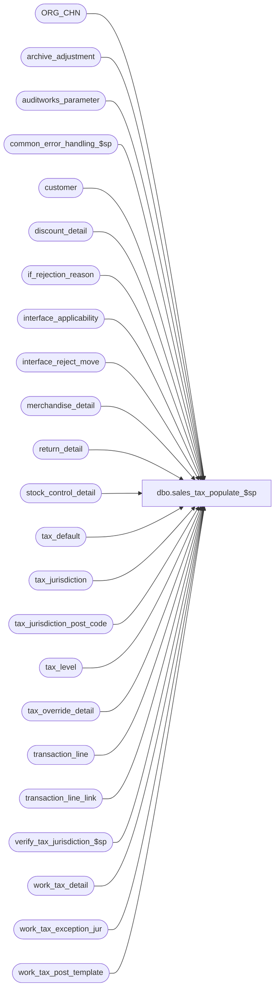

# dbo.sales_tax_populate_$sp

**Database:** auditworks  
**Server:** bedrockdb01  

## Architecture Diagram



## Table Dependencies

| Referenced Table |
|---|
| ORG_CHN |
| archive_adjustment |
| auditworks_parameter |
| common_error_handling_$sp |
| customer |
| discount_detail |
| if_rejection_reason |
| interface_applicability |
| interface_reject_move |
| merchandise_detail |
| return_detail |
| stock_control_detail |
| tax_default |
| tax_jurisdiction |
| tax_jurisdiction_post_code |
| tax_level |
| tax_override_detail |
| transaction_line |
| transaction_line_link |
| verify_tax_jurisdiction_$sp |
| work_tax_detail |
| work_tax_exception_jur |
| work_tax_post_template |

## Stored Procedure Code

```sql
CREATE proc  dbo.sales_tax_populate_$sp (
  @process_id                            binary(16),
  @user_id                               int,
  @function_no                           smallint,
  @applicability_method                  tinyint,
  @class_exception_flag                  tinyint,
  @sku_exception_flag                    tinyint,
  @style_exception_flag                  tinyint,
  @item_group_exception_flag             tinyint,
  @include_expense                       tinyint,
  @include_pickup                        tinyint,
  @unapplied_discounts_exist             tinyint,
  @tax_default_check                     tinyint = 0,
  @exception_jurisdiction_check          tinyint = 0,
  @errmsg                                nvarchar(2000) OUTPUT
)

AS

/*
PROC NAME: sales_tax_populate_$sp
     DESC: Populate tax info into work_tax_detail table from current trans tables.
           Called by sales_tax_main_$sp, pre_audit_tax_$sp (manual functions).
           Tax info will be populated in edit_pre_audit_tax_$sp for the edit.
           Tax info will be populated in sales_tax_rebuild_$sp for tax rebuilt.
     
     Unicode version.

HISTORY:
Date     Name           Def#  Desc
Jun17,16 Vicci      DAOM-937  If a stock_control_detail attachment date is greater than June 2079 (the max supported by a smalldatetime) then it causes error 298 so ignore it if it is future.
Jul15,15 Vicci    TFS-128531  Log UPC to work_tax_detail.
Oct05,11 Vicci       1-47N6AB When not using interface-applicability, don't complain about line-object with a line-object-type of 0 not being in the tax-default table (they shouldn't be...).
Apr20,11 Vicci         64852  Treat function 89 (mass_correct_tax_$sp) the same as function 9 (move) since otherwise the lines that
                              used to be rejected but no longer are get deleted from work_tax_detail given that the if_rejection_reason
                              table has not yet been cleaned up at this stage.
Feb11,11 Paul         105977  use unicode error trap, remove unused variable to allow 5.0 and 5.1 to be the same
Mar03,11 Vicci        125554  Return  @execret (i.e. the status returned by the call to verify_tax_jurisdiction_$sp) so that the
                              calling function (when pre_audit_tax_$sp) can pass it back to transaction modify.  Pass calling
                              function as source function to verify_tax_jurisdiction_$sp to support the requirements of the move.
Jan07,11 Vicci        123998  Set track tax to false on alteration requests/cancellations are fed to Tax in addition to
                              alteration completions.
Dec14,10 Vicci        120654  Set return_from_store to fullfillment store so that its available to send to Avalara. 
Sep15,10 Vicci        120892  Add option to allocate transaction tax to item level on a per-order basis to support ES.
Aug18,10 Vicci        120255  Don't overlay the fulfillment store tax jurisdiction with that of the store in which the 
			      original purchase was made even if the fulfillment store tax jurisdiction matches that of
			      the store in which the return transaction was entered.
Jun10,10 Vicci      109078fix Corrected call to verify_tax_jurisdiction_$sp
Nov23,09 Vicci        114269  Set max_applied_by_line_id on tax line so that if by misfortune there is no merch/fee line to which the tax collected
                              may be applied it will still post to subledger thus avoiding an imbalance.
Sep21,09 Vicci        112842  Compensate for UI bug whereby tax_override_detail.taxable gets set to 100 when the attachment is viewed.
Jul23,09 Vicci        109078  Support having tax calculated on both order creation and fulfillment while only posting
                              one or the other to tax_tracking (in case of applicability_method = 0, if both
                              order and fulfillment have been configured to feed tax in interface applicability, tax will
                              be calculated on both but will feed tax-tracking upon fulfillment only).
                         Add recognition for header-level returns.
                              Add recognition of fulfillment store since tax charged based on store where merch will be picked up.
                              Add recognition for order placement date.
Jan20,09 Paul         106260  refix: remove drop of temp table, corrected call to verify proc
Nov12,08 Vicci        106260  Put back recognition of header-level customer attachment lost on defect DV-1191 and ignore
                              customer.pos_tax_jurisdiction when it is invalid.
May30,08 Vicci        101675  Correct cleanup of work_tax_exception_jur
Mar25,08 Vicci      1-38MDAZ  Log units
Nov14,07 Phu           94993  Log harmonized sales tax.
Aug16,07 Paul        DV-1363  apply 81895, 74673 to SA5. Made SA5 joins resemble SA4.1, added comments re #tax_sent table.
Dec05,06 Paul        DV-1347  update comments for 47390
Oct25,06 Phu           77931  Fix outer join for SQL 2005 Mode 90.
Mar22,05 Maryam      DV-1202  Handle the indirect association via line links. Handle send to customer as from_line_id  is changed to be line_id
Dec14,04 David       DV-1191  Improve performance by adding hints.
Sep15,04 IanK        DV-1146  Change user name to user_id
May18,04 David       DV-1071  Use ORG_CHN table instead of store_salesaudit, @process_id from tinyint to binary(16)
Jan12,07 Vicci         81895  Support sale following loan, sale following rental, repair pickup, alteration pickup
Jul12.06 Vicci         74673  Eliminate "or line_id =0" for join to header level overrides, moved to sales_tax_main's
   (MSQ port by Daphna)       insert into #tax_transactions  ** ANSI STD for outer join
Jan19,05 Vicci	       47390  Support order pickups
Apr30,03 David          5667  Set return_from_date to be av_transaction_date if modifying archived trans.
Mar04,03 Phu            6512  Avoid error: insert NULL into 'discount_amount' in #tax_post_main
Jan23,03 Phu            5933  Retrieve sent tax jurisdiction if zip code is defined
Dec19,02 Phu            5327  Post ordered trans to tax_detail, prorate tax collected to nontaxable if required
Dec10,02 Phu            5292  Retrieve tax override
Dec07,02 Phu         1-GCX2X  Calculate taxes where returned and sold items are in one tran or when modifying archived trans
Aug01,02 Phu         1-E3LUO  Retrieve tax_jurisdiction of sent transaction
Apr25,02 Phu         1-C9P5S  Pre Audit tax

*/

DECLARE
	@errno				int,
	@message_id			int,
	@object_name			nvarchar(255),
	@operation_name			nvarchar(100),
	@process_name			nvarchar(100),
	@rows				int,
	@cursor_open			tinyint,
	@date				datetime,
	@exception_rows			int,
	@min_trans_date			smalldatetime,
	@transaction_count 		numeric(12,0),
	@tax_allocation_by_refno	tinyint,
	@execret			int


SELECT	@message_id = 201068,
	@process_name = 'sales_tax_populate_$sp',
	@execret = 0

IF EXISTS (SELECT * FROM auditworks_parameter WHERE par_name = 'reference_dependent_tax_alloc' AND par_value = '1')
  SELECT @tax_allocation_by_refno = 1
ELSE
  SELECT @tax_allocation_by_refno = 0

/* build temp table of transaction details. Use tax_jurisdiction from
   tax_override_detail if available. Otherwise use default for store.
   Must build table from permanent empty table because of style_ref_id_datatype */

-- columns: transaction_no, register_no, entry_date_time, transaction_series are populated
-- and used by the edit only

SELECT transaction_id, line_id, store_no, transaction_date, line_object_type, line_object,
       class_code, gross_line_amount, discount_amount, amount_sign, gl_effect,
       store_tax_jurisdiction, tax_jurisdiction, style_reference_id, sku_id, upc_lookup_division,
       return_from_store, return_from_date, override_tax_category, tax_paid_flag, header_override_flag,
       all_tax_override_flag, transaction_no, register_no, entry_date_time, transaction_series, units, track_tax, 
       reference_type, reference_no, upc_no
INTO #tax_post_main
FROM work_tax_post_template

SELECT @errno = @@error
IF @errno <> 0
  BEGIN
    SELECT @errmsg = 'Failed to create temp table #tax_post_main.',
	   @object_name = '#tax_post_main',
	   @operation_name = 'CREATE'
  GOTO error
  END

IF (@class_exception_flag = 1 OR @style_exception_flag = 1  OR @sku_exception_flag = 1 OR @item_group_exception_flag = 1)
  BEGIN
    IF @applicability_method = 0    --based on interface_applicability
      INSERT #tax_post_main(
	     transaction_id,
	     line_id,
	     store_no,
	     transaction_date,
	     line_object_type,
	     line_object,
	     class_code,
	     gross_line_amount,
	     discount_amount,
	     amount_sign,
	     gl_effect,
	     store_tax_jurisdiction,
	     tax_jurisdiction,
	     style_reference_id,
	     sku_id,
	     upc_lookup_division,
	     return_from_store,
	     return_from_date,
	     override_tax_category,
	     tax_paid_flag,
	     header_override_flag,  
	     all_tax_override_flag,
	     units,
	     track_tax,
	     reference_type,
	     reference_no,
	     upc_no) 
      SELECT
             tt.transaction_id, 
	     tl.line_id,
	     tt.store_no, 
 	     tt.transaction_date, 
	     tl.line_object_type,
	     tl.line_object,
	     COALESCE(md.class_code, 0),
	     tl.gross_line_amount,
	     tl.pos_discount_amount,
	     ((SIGN(1 + tl.db_cr_none) * 2) - 1) * tl.voiding_reversal_flag, -- amount_sign
	     tl.db_cr_none * -1 * tl.voiding_reversal_flag, -- gl_effect
	     tt.store_tax_jurisdiction,
	     MAX(COALESCE(tod.exception_tax_jurisdiction, todl.exception_tax_jurisdiction, tt.tod_tax_jurisdiction, f.TAX_JRSDCTN_CODE, tt.store_tax_jurisdiction)), -- tax_jurisdiction def 74673
	     COALESCE(md.style_reference_id,0),
	     COALESCE(md.sku_id,0),
	     COALESCE(md.upc_lookup_division,0),
	     CASE WHEN MAX(COALESCE(tod.exception_tax_jurisdiction, todl.exception_tax_jurisdiction, tt.tod_tax_jurisdiction)) IS NULL
	          THEN MAX(COALESCE(f.ORG_CHN_NUM, rd.return_from_store, rdl.return_from_store, rdh.return_from_store))
	          ELSE NULL
	     END return_from_store, 
	     CASE WHEN MAX(COALESCE(o.count_date, ol.count_date, oh.count_date, rd.return_from_date, rdl.return_from_date, rdh.return_from_date)) > dateadd(dd, 1, getdate())
	          THEN NULL
	          ELSE MAX(COALESCE(o.count_date, ol.count_date, oh.count_date, rd.return_from_date, rdl.return_from_date, rdh.return_from_date))
	     END return_from_date,
	     ((1 - SIGN(SIGN(tl.line_sequence) + 1)) * 100), -- override_tax_category
	     (1 - SIGN(ABS(tl.line_object_type - 5 ))) *
	      ((1-SIGN(ABS(tl.line_action - 15))) + (1-SIGN(ABS(tl.line_action - 16))) )
	      + (1 - SIGN(ABS(tl.line_object_type - 7 ))), -- tax_paid_flag
	     COALESCE(tt.header_override_flag, (1 - SIGN (MIN(tod.line_id))), (3 - SIGN(MIN(todl.line_id)))), -- header_override_flag  -- def 74673
	 COALESCE(tt.all_tax_override_flag, (1 - SIGN (MIN(COALESCE(tod.tax_level, todl.tax_level))))), -- all_tax_override_flag  -- def 74673
	     COALESCE(md.units, 1),
	     CASE WHEN ex.line_action IS NOT NULL THEN 0 ELSE 1 END,  --track_tax
	     CASE WHEN @tax_allocation_by_refno = 1 THEN tl.reference_type ELSE 0 END,
             CASE WHEN @tax_allocation_by_refno = 1 THEN COALESCE(tl.reference_no, '0') ELSE '0' END,
             COALESCE(md.upc_no,0)
        FROM #tax_transactions tt WITH (NOLOCK)
             INNER JOIN transaction_line tl WITH (NOLOCK)
                ON tt.transaction_id = tl.transaction_id  
                AND tl.line_object_type IN (1, 2, 5, 7)   /* tax type*/
                AND tl.line_void_flag = 0                 
             INNER JOIN interface_applicability ia
                ON tt.transaction_category = ia.transaction_category        
                AND tl.line_object = ia.line_object
                AND tl.line_action = ia.line_action
                AND ia.interface_id = 12
             LEFT OUTER JOIN merchandise_detail md WITH (NOLOCK)
                ON tl.transaction_id = md.transaction_id
                AND tl.line_id = md.line_id  
             LEFT OUTER JOIN transaction_line_link tll  WITH (NOLOCK)
                ON tl.transaction_id = tll.transaction_id
                AND tl.line_id = tll.line_id  
             LEFT OUTER JOIN tax_override_detail tod WITH (NOLOCK)
                ON tl.transaction_id = tod.transaction_id
                AND tl.line_id = tod.line_id
             LEFT OUTER JOIN tax_override_detail todl WITH (NOLOCK)
                ON tll.transaction_id = todl.transaction_id
                AND tll.linked_line_id = todl.line_id
             LEFT OUTER JOIN return_detail rd  WITH (NOLOCK)
                ON tl.transaction_id = rd.transaction_id
                AND tl.line_id = rd.line_id  
             LEFT OUTER JOIN return_detail rdl  WITH (NOLOCK)
                ON tll.transaction_id = rdl.transaction_id
                AND tll.linked_line_id = rdl.line_id  
             LEFT OUTER JOIN return_detail rdh  WITH (NOLOCK)
                ON tl.transaction_id = rdh.transaction_id
                AND 0 = rdh.line_id  
             LEFT OUTER JOIN stock_control_detail o  WITH (NOLOCK)
                ON tl.transaction_id = o.transaction_id
                AND tl.line_id = o.line_id  
                AND o.display_def_id = 31
                AND o.count_date IS NOT NULL
                AND o.count_date < dateadd(dd, 1, getdate())
             LEFT OUTER JOIN stock_control_detail ol  WITH (NOLOCK)
                ON tll.transaction_id = ol.transaction_id
             AND tll.linked_line_id = ol.line_id  
                AND ol.display_def_id = 31
                AND ol.count_date IS NOT NULL
             LEFT OUTER JOIN stock_control_detail oh  WITH (NOLOCK)
                ON tl.transaction_id = oh.transaction_id
                AND 0 = oh.line_id  
                AND oh.display_def_id = 31
                AND oh.count_date IS NOT NULL
             LEFT OUTER JOIN ORG_CHN f  WITH (NOLOCK)
                ON md.fulfillment_store_no = f.ORG_CHN_NUM
             LEFT OUTER JOIN (SELECT DISTINCT ai1.transaction_category, 
                                     ai1.line_object, 
                                     ai1.line_action
                                FROM interface_applicability ai1
                                     INNER JOIN interface_applicability ai2
                                        ON ai2.interface_id = 12
                                       AND ai1.transaction_category = ai2.transaction_category
                                       AND ai1.line_object = ai2.line_object
                                       AND ai2.line_action in (201, 211, 142, 147, 90, 97, 147, 197, 198)
                                       AND (   (ai1.line_action in (7, 8) AND ai2.line_action in (142, 90))
                                            OR (ai1.line_action in (95, 96) AND ai2.line_action in (147, 97))
                                            OR (ai1.line_action in (101, 102) AND ai2.line_action = 201)
                                            OR (ai1.line_action in (111, 112) AND ai2.line_action = 211)
                                            OR (ai1.line_action in (191, 194) AND ai2.line_action = 197)
                                            OR (ai1.line_action in (192, 195) AND ai2.line_action = 198))
                               WHERE ai1.interface_id = 12
                                 AND ai1.line_action in (7, 8, 95, 96,101, 102, 111, 112, 191, 194, 192, 195) ) ex  --order and layaway creation to be ignore if pickup/delivery also set to feed to avoid double-counting
                ON tt.transaction_category = ex.transaction_category                
                AND tl.line_object = ex.line_object
                AND tl.line_action = ex.line_action
    GROUP BY tt.transaction_id, 
	     tl.line_id,
	     tt.store_no, 
	     tt.transaction_date, 
	     tl.line_object_type,
	     tl.line_object, 
	     COALESCE(md.class_code, 0),
	     tl.gross_line_amount,
	     tl.pos_discount_amount,
	     ((SIGN(1 + tl.db_cr_none) * 2) - 1) * tl.voiding_reversal_flag,
	     tl.db_cr_none * -1 * tl.voiding_reversal_flag,
	     tt.store_tax_jurisdiction,
	     COALESCE(md.style_reference_id,0),
	     COALESCE(md.sku_id,0),
	     COALESCE(md.upc_lookup_division,0),
	     ((1 - SIGN(SIGN(tl.line_sequence) + 1)) * 100),
	     (1 - SIGN(ABS(tl.line_object_type - 5 ))) * 
	     ((1-SIGN(ABS(tl.line_action - 15))) + (1-SIGN(ABS(tl.line_action - 16)))) 
	     + (1 - SIGN(ABS(tl.line_object_type - 7 ))),
	     tt.header_override_flag,  -- def 74673
	     tt.all_tax_override_flag,   -- def 74673
             COALESCE(md.units, 1),
             CASE WHEN ex.line_action IS NOT NULL THEN 0 ELSE 1 END,
             CASE WHEN @tax_allocation_by_refno = 1 THEN tl.reference_type ELSE 0 END,
             CASE WHEN @tax_allocation_by_refno = 1 THEN COALESCE(tl.reference_no, '0') ELSE '0' END,
             COALESCE(md.upc_no,0)
    ELSE 
      INSERT #tax_post_main(
	     transaction_id,
	     line_id,
	     store_no,
	     transaction_date,
  	     line_object_type,
	     line_object,
	     class_code,
	     gross_line_amount,
	     discount_amount,
	     amount_sign,
	     gl_effect,
	     store_tax_jurisdiction,
	     tax_jurisdiction,
	     style_reference_id,
	     sku_id,
	     upc_lookup_division,
	     return_from_store,
	     return_from_date,
	     override_tax_category,
	     tax_paid_flag,
	     header_override_flag,
	     all_tax_override_flag,
	     units,
	     track_tax,
	     reference_type,
	     reference_no,
	     upc_no) 
      SELECT
             tt.transaction_id, 
	     tl.line_id,
	     tt.store_no, 
	     tt.transaction_date, 
	     tl.line_object_type,
	     tl.line_object, 
	     COALESCE(md.class_code, 0),
	     tl.gross_line_amount,
	     tl.pos_discount_amount,
	     ((SIGN(1 + tl.db_cr_none) * 2) - 1) * tl.voiding_reversal_flag, -- amount_sign
	     tl.db_cr_none * -1 * tl.voiding_reversal_flag, -- gl_effect
	     tt.store_tax_jurisdiction,
	     MAX(COALESCE(tod.exception_tax_jurisdiction, todl.exception_tax_jurisdiction, tt.tod_tax_jurisdiction, f.TAX_JRSDCTN_CODE, tt.store_tax_jurisdiction)), -- tax_jurisdiction def 74673
	     COALESCE(md.style_reference_id,0),
	     COALESCE(md.sku_id,0),
	     COALESCE(md.upc_lookup_division,0),
	     CASE WHEN MAX(COALESCE(tod.exception_tax_jurisdiction, todl.exception_tax_jurisdiction, tt.tod_tax_jurisdiction)) IS NULL
	          THEN MAX(COALESCE(f.ORG_CHN_NUM, rd.return_from_store, rdl.return_from_store, rdh.return_from_store))
	          ELSE NULL
	     END,
	     CASE WHEN MAX(COALESCE(o.count_date, ol.count_date, oh.count_date, rd.return_from_date, rdl.return_from_date, rdh.return_from_date)) > dateadd(dd, 1, getdate())
	          THEN NULL
	          ELSE MAX(COALESCE(o.count_date, ol.count_date, oh.count_date, rd.return_from_date, rdl.return_from_date, rdh.return_from_date))
	     END return_from_date,
	     ((1 - SIGN(SIGN(tl.line_sequence) + 1)) * 100), -- override_tax_category
	     (1 - SIGN(ABS(tl.line_object_type - 5 ))) *
	      ((1-SIGN(ABS(tl.line_action - 15))) + (1-SIGN(ABS(tl.line_action - 16))) )
	      + (1 - SIGN(ABS(tl.line_object_type - 7 ))), -- tax_paid_flag
             COALESCE(tt.header_override_flag, (1 - SIGN (MIN(tod.line_id))), (3 - SIGN(MIN(todl.line_id)))), -- header_override_flag  -- def 74673
	     COALESCE(tt.all_tax_override_flag, (1 - SIGN (MIN(COALESCE(tod.tax_level, todl.tax_level))))), -- all_tax_override_flag  -- def 74673	     COALESCE(md.units, 1),
	     COALESCE(md.units, 1),
	     CASE WHEN @include_pickup = 1 AND tl.line_action IN ( 7, 95, 101, 111) THEN 0 ELSE 1 END,
	     CASE WHEN @tax_allocation_by_refno = 1 THEN tl.reference_type ELSE 0 END,
             CASE WHEN @tax_allocation_by_refno = 1 THEN COALESCE(tl.reference_no, '0') ELSE '0' END,
             COALESCE(md.upc_no,0)
        FROM #tax_transactions tt WITH (NOLOCK)
             INNER JOIN transaction_line tl WITH (NOLOCK)
                ON tt.transaction_id = tl.transaction_id
                AND tl.line_object_type IN (1, 2, 5, 7 * @include_expense)   /* tax type*/
                AND tl.line_object_type <> 0
                AND tl.line_action not in (3, 4, 9, 10, 78, 79, 200, 203, 204, 210, 213, 214, 215, 223, 224, 225, 226, 227, 228, 191, 192, 193, 194, 195, 196, 32, 40, 41, 42, 43, 44, 45, 67, 74, 85, 100, 171, 172)
 AND (tl.line_action * @include_pickup) NOT IN ( 8, 96, 102, 112)
                AND (tl.line_action * (1 - @include_pickup)) NOT IN ( 90, 97, 98, 99, 201, 202, 211, 212, 142, 147)
                AND tl.line_void_flag = 0  
LEFT OUTER JOIN merchandise_detail md WITH (NOLOCK)
                ON tl.transaction_id = md.transaction_id
                AND tl.line_id = md.line_id
             LEFT OUTER JOIN transaction_line_link tll  WITH (NOLOCK)
                ON tl.transaction_id = tll.transaction_id
                AND tl.line_id = tll.line_id  
             LEFT OUTER JOIN tax_override_detail tod WITH (NOLOCK)
                ON tl.transaction_id = tod.transaction_id
                AND tl.line_id = tod.line_id
             LEFT OUTER JOIN tax_override_detail todl WITH (NOLOCK)
                ON tll.transaction_id = todl.transaction_id
                AND tll.linked_line_id = todl.line_id
             LEFT OUTER JOIN return_detail rd  WITH (NOLOCK)
                ON tl.transaction_id = rd.transaction_id
                AND tl.line_id = rd.line_id  
             LEFT OUTER JOIN return_detail rdl  WITH (NOLOCK)
                ON tll.transaction_id = rdl.transaction_id
                AND tll.linked_line_id = rdl.line_id  
             LEFT OUTER JOIN return_detail rdh  WITH (NOLOCK)
                ON tl.transaction_id = rdh.transaction_id
                AND 0 = rdh.line_id  
             LEFT OUTER JOIN stock_control_detail o  WITH (NOLOCK)
                ON tl.transaction_id = o.transaction_id
     		AND tl.line_id = o.line_id  
                AND o.display_def_id = 31
                AND o.count_date IS NOT NULL
                AND o.count_date < dateadd(dd, 1, getdate())
             LEFT OUTER JOIN stock_control_detail ol  WITH (NOLOCK)
                ON tll.transaction_id = ol.transaction_id
                AND tll.linked_line_id = ol.line_id  
                AND ol.display_def_id = 31
                AND ol.count_date IS NOT NULL
             LEFT OUTER JOIN stock_control_detail oh  WITH (NOLOCK)
                ON tl.transaction_id = oh.transaction_id
                AND 0 = oh.line_id  
                AND oh.display_def_id = 31
                AND oh.count_date IS NOT NULL
             LEFT OUTER JOIN ORG_CHN f  WITH (NOLOCK)
                ON md.fulfillment_store_no = f.ORG_CHN_NUM
    GROUP BY tt.transaction_id, 
	     tl.line_id,
	     tt.store_no, 
	     tt.transaction_date, 
	     tl.line_object_type,
	     tl.line_object, 
	     COALESCE(md.class_code, 0),
	     tl.gross_line_amount,
	     tl.pos_discount_amount,
	     ((SIGN(1 + tl.db_cr_none) * 2) - 1) * tl.voiding_reversal_flag,
	     tl.db_cr_none * -1 * tl.voiding_reversal_flag,
	     tt.store_tax_jurisdiction,
	     COALESCE(md.style_reference_id,0),
	     COALESCE(md.sku_id,0),
	     COALESCE(md.upc_lookup_division,0),
	     ((1 - SIGN(SIGN(tl.line_sequence) + 1)) * 100),
	     (1 - SIGN(ABS(tl.line_object_type - 5 ))) * 
	     ((1-SIGN(ABS(tl.line_action - 15))) + (1-SIGN(ABS(tl.line_action - 16)))) 
	     + (1 - SIGN(ABS(tl.line_object_type - 7 ))),
	     tt.header_override_flag, -- def  74673
	     tt.all_tax_override_flag, -- def  74673
	     COALESCE(md.units, 1),
	     CASE WHEN @include_pickup = 1 AND tl.line_action IN ( 7, 95, 101, 111) THEN 0 ELSE 1 END,
	     CASE WHEN @tax_allocation_by_refno = 1 THEN tl.reference_type ELSE 0 END,
             CASE WHEN @tax_allocation_by_refno = 1 THEN COALESCE(tl.reference_no, '0') ELSE '0' END,
             COALESCE(md.upc_no,0)
  END --(@class_exception_flag = 1 OR @style_exception_flag = 1  OR @sku_exception_flag = 1 OR @item_group_exception_flag = 1)
ELSE
  BEGIN
    IF @applicability_method = 0 -- based on interface_applicability
      INSERT #tax_post_main(
	     transaction_id,
	     line_id,
	     store_no,
	     transaction_date,
	     line_object_type,
	     line_object,
	     class_code,
	     gross_line_amount,
	     discount_amount,
	     amount_sign,
	     gl_effect,
	     store_tax_jurisdiction,
	     tax_jurisdiction,
	     style_reference_id,
	     sku_id,
	     upc_lookup_division,
	     return_from_store,
	     return_from_date,
	     override_tax_category,
	     tax_paid_flag,
	     header_override_flag,
	     all_tax_override_flag,
	     units,
	     track_tax,
	     reference_type,
	     reference_no,
	     upc_no) 
      SELECT
	     tt.transaction_id, 
	     tl.line_id,
	     tt.store_no, 
	     tt.transaction_date, 
	     tl.line_object_type,
	     tl.line_object, 
	     0, -- class_code
	     tl.gross_line_amount,
	     tl.pos_discount_amount,
	     ((SIGN(1 + tl.db_cr_none) * 2) - 1) * tl.voiding_reversal_flag, -- amount_sign
	     tl.db_cr_none * -1 * tl.voiding_reversal_flag, -- gl_effect
	     tt.store_tax_jurisdiction,
	     MAX(COALESCE(tod.exception_tax_jurisdiction, todl.exception_tax_jurisdiction, tt.tod_tax_jurisdiction, f.TAX_JRSDCTN_CODE, tt.store_tax_jurisdiction)), -- tax_jurisdiction def 74673
	     0, -- style_reference_id
	     0, -- sku_id
	     0, -- upc_lookup_division
	     CASE WHEN MAX(COALESCE(tod.exception_tax_jurisdiction, todl.exception_tax_jurisdiction, tt.tod_tax_jurisdiction)) IS NULL
	          THEN MAX(COALESCE(f.ORG_CHN_NUM, rd.return_from_store, rdl.return_from_store, rdh.return_from_store))
	          ELSE NULL
	     END,
	     CASE WHEN MAX(COALESCE(o.count_date, ol.count_date, oh.count_date, rd.return_from_date, rdl.return_from_date, rdh.return_from_date)) > dateadd(dd, 1, getdate())
	          THEN NULL
	          ELSE MAX(COALESCE(o.count_date, ol.count_date, oh.count_date, rd.return_from_date, rdl.return_from_date, rdh.return_from_date))
	     END return_from_date,
	     ((1 - SIGN(SIGN(tl.line_sequence) + 1)) * 100), -- override_tax_category
	     (1 - SIGN(ABS(tl.line_object_type - 5 ))) *
	      ((1-SIGN(ABS(tl.line_action - 15))) + (1-SIGN(ABS(tl.line_action - 16))) )
	      + (1 - SIGN(ABS(tl.line_object_type - 7 ))), -- tax_paid_flag
	     COALESCE(tt.header_override_flag, (1 - SIGN (MIN(tod.line_id))), (3 - SIGN(MIN(todl.line_id)))), -- header_override_flag  -- def 74673
	     COALESCE(tt.all_tax_override_flag, (1 - SIGN (MIN(COALESCE(tod.tax_level, todl.tax_level))))), -- all_tax_override_flag  -- def 74673
	     COALESCE(md.units, 1),
	     CASE WHEN ex.line_action IS NOT NULL THEN 0 ELSE 1 END,  --track_tax
             CASE WHEN @tax_allocation_by_refno = 1 THEN tl.reference_type ELSE 0 END,
             CASE WHEN @tax_allocation_by_refno = 1 THEN COALESCE(tl.reference_no, '0') ELSE '0' END,
             0 --upc_no
        FROM #tax_transactions tt WITH (NOLOCK)
             INNER JOIN transaction_line tl WITH (NOLOCK)
                 ON tt.transaction_id = tl.transaction_id
                 AND tl.line_object_type IN (1, 2, 5, 7)   /* tax type*/
                 AND tl.line_void_flag = 0
             INNER JOIN interface_applicability ia
                 ON tt.transaction_category = ia.transaction_category
                 AND tl.line_object = ia.line_object
                 AND tl.line_action = ia.line_action
                 AND ia.interface_id = 12
    LEFT OUTER JOIN merchandise_detail md WITH (NOLOCK)
                 ON tl.transaction_id = md.transaction_id
                 AND tl.line_id = md.line_id  
             LEFT OUTER JOIN transaction_line_link tll  WITH (NOLOCK)
                ON tl.transaction_id = tll.transaction_id
                AND tl.line_id = tll.line_id  
             LEFT OUTER JOIN tax_override_detail tod WITH (NOLOCK)
                ON tl.transaction_id = tod.transaction_id
                AND tl.line_id = tod.line_id
             LEFT OUTER JOIN tax_override_detail todl WITH (NOLOCK)
                ON tll.transaction_id = todl.transaction_id
                AND tll.linked_line_id = todl.line_id
             LEFT OUTER JOIN return_detail rd  WITH (NOLOCK)
                ON tl.transaction_id = rd.transaction_id
                AND tl.line_id = rd.line_id  
             LEFT OUTER JOIN return_detail rdl  WITH (NOLOCK)
                ON tll.transaction_id = rdl.transaction_id
                AND tll.linked_line_id = rdl.line_id  
             LEFT OUTER JOIN return_detail rdh  WITH (NOLOCK)
                ON tl.transaction_id = rdh.transaction_id
                AND 0 = rdh.line_id  
             LEFT OUTER JOIN stock_control_detail o  WITH (NOLOCK)
                ON tl.transaction_id = o.transaction_id
                AND tl.line_id = o.line_id  
                AND o.display_def_id = 31
                AND o.count_date IS NOT NULL
                AND o.count_date < dateadd(dd, 1, getdate())
             LEFT OUTER JOIN stock_control_detail ol  WITH (NOLOCK)
                ON tll.transaction_id = ol.transaction_id
                AND tll.linked_line_id = ol.line_id  
                AND ol.display_def_id = 31
                AND ol.count_date IS NOT NULL
             LEFT OUTER JOIN stock_control_detail oh  WITH (NOLOCK)
                ON tl.transaction_id = oh.transaction_id
                AND 0 = oh.line_id  
                AND oh.display_def_id = 31
                AND oh.count_date IS NOT NULL
             LEFT OUTER JOIN ORG_CHN f  WITH (NOLOCK)
                ON md.fulfillment_store_no = f.ORG_CHN_NUM
    LEFT OUTER JOIN (SELECT DISTINCT ai1.transaction_category, 
                                     ai1.line_object, 
                                     ai1.line_action
                                FROM interface_applicability ai1
                                     INNER JOIN interface_applicability ai2
                                        ON ai2.interface_id = 12
                                       AND ai1.transaction_category = ai2.transaction_category
                                       AND ai1.line_object = ai2.line_object
                                       AND ai2.line_action in (201, 211, 142, 147, 90, 97, 147, 197, 198)
                                       AND (   (ai1.line_action in (7, 8) AND ai2.line_action in (142, 90))
                                            OR (ai1.line_action in (95, 96) AND ai2.line_action in (147, 97))
                                            OR (ai1.line_action in (101, 102) AND ai2.line_action = 201)
                                            OR (ai1.line_action in (111, 112) AND ai2.line_action = 211)
                                            OR (ai1.line_action in (191, 194) AND ai2.line_action = 197)
                                            OR (ai1.line_action in (192, 195) AND ai2.line_action = 198))
                               WHERE ai1.interface_id = 12
                                 AND ai1.line_action in (7, 8, 95, 96,101, 102, 111, 112, 191, 194, 192, 195) ) ex  --order and layaway creation to be ignore if pickup/delivery also set to feed to avoid double-counting
                ON tt.transaction_category = ex.transaction_category                
                AND tl.line_object = ex.line_object
                AND tl.line_action = ex.line_action
    GROUP BY tt.transaction_id, 
	     tl.line_id,
	   tt.store_no, 
	     tt.transaction_date, 
	     tl.line_object_type,
	     tl.line_object, 
	     tl.gross_line_amount,
	     tl.pos_discount_amount,
	     ((SIGN(1 + tl.db_cr_none) * 2) - 1) * tl.voiding_reversal_flag,
	     tl.db_cr_none * -1 * tl.voiding_reversal_flag,
	     tt.store_tax_jurisdiction,
	     ((1 - SIGN(SIGN(tl.line_sequence) + 1)) * 100),
	     (1 - SIGN(ABS(tl.line_object_type - 5 ))) * ((1-SIGN(ABS(tl.line_action - 15))) + (1-SIGN(ABS(tl.line_action - 16))))
	     + (1 - SIGN(ABS(tl.line_object_type - 7 ))),
	     tt.header_override_flag, -- def 74673
	     tt.all_tax_override_flag,  -- def 74673
	     COALESCE(md.units, 1),
	     CASE WHEN ex.line_action IS NOT NULL THEN 0 ELSE 1 END,
             CASE WHEN @tax_allocation_by_refno = 1 THEN tl.reference_type ELSE 0 END,
             CASE WHEN @tax_allocation_by_refno = 1 THEN COALESCE(tl.reference_no, '0') ELSE '0' END
    ELSE 
   INSERT #tax_post_main(
	     transaction_id,
	     line_id,
	     store_no,
	     transaction_date,
	     line_object_type,
	     line_object,
	     class_code,
	     gross_line_amount,
	     discount_amount,
	     amount_sign,
	     gl_effect,
	     store_tax_jurisdiction,
	     tax_jurisdiction,
	     style_reference_id,
	     sku_id,
 	     upc_lookup_division,
	     return_from_store,
	     return_from_date,
	     override_tax_category,
	     tax_paid_flag,
	     header_override_flag,
      	     all_tax_override_flag,
      	     units,
      	     track_tax,
      	     reference_type,
      	     reference_no,
      	     upc_no) 
      SELECT
	     tt.transaction_id, 
	     tl.line_id,
	     tt.store_no, 
	     tt.transaction_date, 
	     tl.line_object_type,
	     tl.line_object, 
	     0, -- class_code
	     tl.gross_line_amount,
	     tl.pos_discount_amount,
	     ((SIGN(1 + tl.db_cr_none) * 2) - 1) * tl.voiding_reversal_flag, -- amount_sign
	     tl.db_cr_none * -1 * tl.voiding_reversal_flag, -- gl_effect
	     tt.store_tax_jurisdiction,
	     MAX(COALESCE(tod.exception_tax_jurisdiction, todl.exception_tax_jurisdiction, tt.tod_tax_jurisdiction, f.TAX_JRSDCTN_CODE, tt.store_tax_jurisdiction)), -- tax_jurisdiction def 74673
	     0, -- style_reference_id
	     0, -- sku_id
	     0, -- upc_lookup_division
	     CASE WHEN MAX(COALESCE(tod.exception_tax_jurisdiction, todl.exception_tax_jurisdiction, tt.tod_tax_jurisdiction)) IS NULL
	          THEN MAX(COALESCE(f.ORG_CHN_NUM, rd.return_from_store, rdl.return_from_store, rdh.return_from_store))
	          ELSE NULL
	     END,
	     CASE WHEN MAX(COALESCE(o.count_date, ol.count_date, oh.count_date, rd.return_from_date, rdl.return_from_date, rdh.return_from_date)) > dateadd(dd, 1, getdate())
	          THEN NULL
	          ELSE MAX(COALESCE(o.count_date, ol.count_date, oh.count_date, rd.return_from_date, rdl.return_from_date, rdh.return_from_date))
	     END,
	     ((1 - SIGN(SIGN(tl.line_sequence) + 1)) * 100), -- override_tax_category
	     (1 - SIGN(ABS(tl.line_object_type - 5 ))) *
	      ((1-SIGN(ABS(tl.line_action - 15))) + (1-SIGN(ABS(tl.line_action - 16))) )
	      + (1 - SIGN(ABS(tl.line_object_type - 7 ))), -- tax_paid_flag
	     COALESCE(tt.header_override_flag, (1 - SIGN (MIN(tod.line_id))), (3 - SIGN(MIN(todl.line_id)))), -- header_override_flag  -- def 74673
	     COALESCE(tt.all_tax_override_flag, (1 - SIGN (MIN(COALESCE(tod.tax_level, todl.tax_level))))), -- all_tax_override_flag  -- def 74673
	     COALESCE(md.units, 1),
	     CASE WHEN @include_pickup = 1 AND tl.line_action IN ( 7, 95, 101, 111) THEN 0 ELSE 1 END,
             CASE WHEN @tax_allocation_by_refno = 1 THEN tl.reference_type ELSE 0 END,
             CASE WHEN @tax_allocation_by_refno = 1 THEN COALESCE(tl.reference_no, '0') ELSE '0' END,
             0 --upc_no
        FROM #tax_transactions tt WITH (NOLOCK)
             INNER JOIN transaction_line tl WITH (NOLOCK)
                  ON tt.transaction_id = tl.transaction_id
   AND tl.line_object_type IN (1, 2, 5, 7 * @include_expense)   /* tax type*/
                  AND tl.line_object_type <> 0
                  AND tl.line_action not in (3, 4, 9, 10, 78, 79, 200, 203, 204, 210, 213, 214, 215, 223, 224, 225, 226, 227, 228, 191, 192, 193, 194, 195, 196, 32, 40, 41, 42, 43, 44, 45, 67, 74, 85, 100, 171, 172)
                  AND (tl.line_action * @include_pickup) NOT IN ( 8, 96, 102, 112)
                  AND (tl.line_action * (1 - @include_pickup)) NOT IN ( 90, 97, 98, 99, 201, 202, 211, 212, 142, 147)
                  AND tl.line_void_flag = 0
             LEFT OUTER JOIN transaction_line_link tll  WITH (NOLOCK)
                ON tl.transaction_id = tll.transaction_id
                AND tl.line_id = tll.line_id  
             LEFT OUTER JOIN tax_override_detail tod WITH (NOLOCK)
                ON tl.transaction_id = tod.transaction_id
                AND tl.line_id = tod.line_id
             LEFT OUTER JOIN tax_override_detail todl WITH (NOLOCK)
                ON tll.transaction_id = todl.transaction_id
                AND tll.linked_line_id = todl.line_id
             LEFT OUTER JOIN return_detail rd  WITH (NOLOCK)
                ON tl.transaction_id = rd.transaction_id
                AND tl.line_id = rd.line_id  
             LEFT OUTER JOIN return_detail rdl  WITH (NOLOCK)
                ON tll.transaction_id = rdl.transaction_id
                AND tll.linked_line_id = rdl.line_id  
             LEFT OUTER JOIN return_detail rdh  WITH (NOLOCK)
                ON tl.transaction_id = rdh.transaction_id
                AND 0 = rdh.line_id  
             LEFT OUTER JOIN merchandise_detail md    WITH (NOLOCK)
                  ON tl.transaction_id = md.transaction_id
                  AND tl.line_id = md.line_id  
             LEFT OUTER JOIN stock_control_detail o  WITH (NOLOCK)
                ON tl.transaction_id = o.transaction_id
                AND tl.line_id = o.line_id  
                AND o.display_def_id = 31
               AND o.count_date IS NOT NULL
               AND o.count_date < dateadd(dd, 1, getdate())
             LEFT OUTER JOIN stock_control_detail ol  WITH (NOLOCK)
                ON tll.transaction_id = ol.transaction_id
		AND tll.linked_line_id = ol.line_id  
                AND ol.display_def_id = 31
                AND ol.count_date IS NOT NULL
             LEFT OUTER JOIN stock_control_detail oh  WITH (NOLOCK)
                ON tl.transaction_id = oh.transaction_id
                AND 0 = oh.line_id  
                AND oh.display_def_id = 31
                AND oh.count_date IS NOT NULL
             LEFT OUTER JOIN ORG_CHN f WITH (NOLOCK)
                ON md.fulfillment_store_no = f.ORG_CHN_NUM
    GROUP BY tt.transaction_id, 
	     tl.line_id,
	     tt.store_no, 
	     tt.transaction_date, 
	     tl.line_object_type,
	     tl.line_object, 
	     tl.gross_line_amount,
	     tl.pos_discount_amount,
	     ((SIGN(1 + tl.db_cr_none) * 2) - 1) * tl.voiding_reversal_flag,
	     tl.db_cr_none * -1 * tl.voiding_reversal_flag,
	     tt.store_tax_jurisdiction,
	     ((1 - SIGN(SIGN(tl.line_sequence) + 1)) * 100),
	  (1 - SIGN(ABS(tl.line_object_type - 5 ))) * ((1-SIGN(ABS(tl.line_action - 15))) + (1-SIGN(ABS(tl.line_action - 16))))
	     + (1 - SIGN(ABS(tl.line_object_type - 7 ))),
	     tt.header_override_flag, -- def 74673
	     tt.all_tax_override_flag, -- def 74673
	     COALESCE(md.units, 1),
             CASE WHEN @include_pickup = 1 AND tl.line_action IN ( 7, 95, 101, 111) THEN 0 ELSE 1 END,
             CASE WHEN @tax_allocation_by_refno = 1 THEN tl.reference_type ELSE 0 END,
             CASE WHEN @tax_allocation_by_refno = 1 THEN COALESCE(tl.reference_no, '0') ELSE '0' END
END -- else of if (@class_exception_flag = 1 OR @style_exception_flag = 1  OR @sku_exception_flag = 1 OR @item_group_exception_flag = 1)

SELECT @rows = @@rowcount,
       @errno = @@error
IF @errno <> 0
  BEGIN
   SELECT @errmsg = 'Failed to insert #tax_post_main.',
	   @object_name = '#tax_post_main',
	   @operation_name = 'INSERT'
    GOTO error
END

IF @rows = 0
BEGIN
  DROP TABLE #tax_post_main
  SELECT @errno = @@error
  IF @errno <> 0
  BEGIN
    SELECT @errmsg = 'Failed to drop temp table #tax_post_main.',
	   @object_name = '#tax_post_main',
	   @operation_name = 'DROP'
    GOTO error
  END

  RETURN
END -- If @rows = 0


IF @unapplied_discounts_exist = 1
BEGIN
  UPDATE #tax_post_main
     SET discount_amount = (SELECT SUM(dd.pos_discount_amount)
                              FROM discount_detail dd WITH (NOLOCK)
                             WHERE tpm.transaction_id = dd.transaction_id
                               AND tpm.line_id = dd.line_id)
    FROM #tax_post_main tpm, discount_detail d WITH (NOLOCK)
   WHERE tpm.line_object_type IN (1,2)
     AND tpm.transaction_id = d.transaction_id
     AND tpm.line_id = d.line_id

    SELECT @errno = @@error
    IF @errno <> 0
      BEGIN
	SELECT @errmsg = 'Failed to update #tax_post_main (discount_amount).',
	       @object_name = '#tax_post_main',
	       @operation_name = 'UPDATE'
	GOTO error
      END
END -- if @unapplied_discounts_exist = 1

/* For returns, use tax jurisdiction of return_from_store if no tax_override is present
   override_tax_category is used later to set the tax_category properly. */

UPDATE #tax_post_main
   SET tax_jurisdiction = ssa.TAX_JRSDCTN_CODE,
       override_tax_category = (FLOOR(override_tax_category / 100) * 100) + 2 -- tax_override
  FROM #tax_post_main tpm, ORG_CHN ssa
 WHERE tpm.store_no != tpm.return_from_store
   AND tpm.return_from_store = ssa.ORG_CHN_NUM
   AND tpm.tax_jurisdiction != ssa.TAX_JRSDCTN_CODE
   AND tpm.store_tax_jurisdiction = tpm.tax_jurisdiction  --don't override if already set by tod or fulfillment store
   AND (tpm.override_tax_category % 100) = 0 -- modulus
SELECT @errno = @@error
IF @errno <> 0
  BEGIN
    SELECT @errmsg = 'Failed to update #tax_post_main (tax_jurisdiction).',
	 @object_name = '#tax_post_main',
	   @operation_name = 'UPDATE'
     GOTO error
  END

UPDATE #tax_post_main
   SET override_tax_category = (FLOOR(override_tax_category / 100) * 100) + 2 -- tax_override
 WHERE store_tax_jurisdiction <> tax_jurisdiction 
   AND (override_tax_category % 100) = 0 -- modulus
SELECT @errno = @@error
IF @errno <> 0
BEGIN
  SELECT @errmsg = 'Failed to update #tax_post_main (override_tax_category).',
         @object_name = '#tax_post_main',
         @operation_name = 'UPDATE'
  GOTO error
END
-- 5667: In case of an archived transaction modification AND there is no return detail, 
-- use the original transaction_date to determine the proper tax rate because rates 
-- may have changed since the day the transaction was first entered. 
IF @function_no = 154 
AND EXISTS (SELECT 1 FROM #tax_post_main WITH (NOLOCK)
             WHERE return_from_date IS NULL 
               AND line_object_type <> 5)
BEGIN
  UPDATE #tax_post_main
     SET return_from_date = a.av_transaction_date
    FROM #tax_post_main tpm, archive_adjustment a WITH (NOLOCK)
   WHERE tpm.transaction_id = a.adjustment_transaction_id
     AND tpm.return_from_date IS NULL  
     AND tpm.line_object_type <> 5
     
  SELECT @errno = @@error
  IF @errno <> 0
    BEGIN
      SELECT @errmsg = ' Setting return_from_date in case of archived transaction modification.',
             @object_name = '#tax_post_main',
             @operation_name = 'UPDATE'
      GOTO error
    END  
END -- IF @function_no = 154 AND ...

/* Set tax_jurisdiction based on send-to customer */

--from header level attachment
UPDATE #tax_post_main
   SET tax_jurisdiction = tj.tax_jurisdiction,
       override_tax_category = (FLOOR(override_tax_category / 100) * 100) + 1 -- send
  FROM #tax_post_main tt , customer c WITH (NOLOCK), tax_jurisdiction tj
 WHERE tt.transaction_id = c.transaction_id
   AND 0 = c.line_id
   AND c.customer_role = 2    
   AND c.pos_tax_jurisdiction_code = tj.pos_tax_jurisdiction_code
   AND tj.pos_tax_jurisdiction_code IS NOT NULL --
   AND tt.tax_jurisdiction != tj.tax_jurisdiction
SELECT @errno = @@error
IF @errno <> 0
  BEGIN
    SELECT @errmsg = 'Failed to update #tax_post_main from pos_tax_jurisdiction of header-level send-to customer attachment.',
           @object_name = '#tax_post_main',
           @operation_name = 'UPDATE'
    GOTO error
  END

-- repeat using transaction_line_link attachment
UPDATE #tax_post_main
   SET tax_jurisdiction = tj.tax_jurisdiction,
       override_tax_category = (FLOOR(override_tax_category / 100) * 100) + 1 -- send
  FROM #tax_post_main tt ,
       transaction_line_link k WITH (NOLOCK), 
       customer c WITH (NOLOCK),
       tax_jurisdiction tj
 WHERE tt.transaction_id = k.transaction_id
   AND tt.line_id = k.line_id 
   AND k.transaction_id = c.transaction_id
   AND k.linked_line_id = c.line_id 
   AND c.customer_role = 2    
   AND c.pos_tax_jurisdiction_code = tj.pos_tax_jurisdiction_code
   AND tj.pos_tax_jurisdiction_code IS NOT NULL --
AND tt.tax_jurisdiction != tj.tax_jurisdiction
SELECT @errno = @@error
IF @errno <> 0
BEGIN
  SELECT @errmsg = 'Failed to update #tax_post_main from tax_jurisdiction via transaction line link.',
         @object_name = '#tax_post_main',
 @operation_name = 'UPDATE'
  GOTO error
END

-- repeat using direct attachment
UPDATE #tax_post_main
   SET tax_jurisdiction = tj.tax_jurisdiction,
       override_tax_category = (FLOOR(override_tax_category / 100) * 100) + 1 -- send
  FROM #tax_post_main tt , customer c WITH (NOLOCK), tax_jurisdiction tj
 WHERE tt.transaction_id = c.transaction_id
   AND tt.line_id = c.line_id
   AND c.customer_role = 2    
   AND c.pos_tax_jurisdiction_code = tj.pos_tax_jurisdiction_code
   AND tj.pos_tax_jurisdiction_code IS NOT NULL --
   AND tt.tax_jurisdiction != tj.tax_jurisdiction
SELECT @errno = @@error
IF @errno <> 0
  BEGIN
    SELECT @errmsg = 'Failed to update #tax_post_main from tax_jurisdiction.',
           @object_name = '#tax_post_main',
           @operation_name = 'UPDATE'
    GOTO error
  END

--from header attachment  
UPDATE #tax_post_main
   SET tax_jurisdiction = tjp.tax_jurisdiction,
       override_tax_category = (FLOOR(override_tax_category / 100) * 100) + 1 -- send
  FROM #tax_post_main tt, customer c WITH (NOLOCK), tax_jurisdiction_post_code tjp
 WHERE tt.transaction_id= c.transaction_id
   AND 0 = c.line_id
   AND c.customer_role = 2
   AND c.post_code >= tjp.from_post_code
   AND c.post_code <= tjp.to_post_code
   AND (c.pos_tax_jurisdiction_code IS NULL 
        OR c.pos_tax_jurisdiction_code NOT IN (SELECT tj.pos_tax_jurisdiction_code
                    FROM tax_jurisdiction tj
                                 WHERE tj.pos_tax_jurisdiction_code IS NOT NULL))
AND tt.tax_jurisdiction != tjp.tax_jurisdiction
SELECT @errno = @@error
IF @errno <> 0
  BEGIN
    SELECT @errmsg = 'Failed to update #tax_post_main from postal code of header level send-to customer attachment.',
           @object_name = '#tax_post_main',
           @operation_name = 'UPDATE'
    GOTO error
  END

-- repeat using transaction_line_link
UPDATE #tax_post_main
   SET tax_jurisdiction = tjp.tax_jurisdiction,
       override_tax_category = (FLOOR(override_tax_category / 100) * 100) + 1 -- send
  FROM #tax_post_main tt,
       customer c WITH (NOLOCK),
       transaction_line_link k WITH (NOLOCK),
       tax_jurisdiction_post_code tjp
 WHERE tt.transaction_id = k.transaction_id
   AND tt.line_id = k.line_id 
   AND k.transaction_id = c.transaction_id
   AND k.linked_line_id = c.line_id 
   AND c.customer_role = 2
   AND c.post_code >= tjp.from_post_code
   AND c.post_code <= tjp.to_post_code
   AND (c.pos_tax_jurisdiction_code IS NULL                      
        OR c.pos_tax_jurisdiction_code NOT IN (SELECT tj.pos_tax_jurisdiction_code
                                                 FROM tax_jurisdiction tj
                                                WHERE tj.pos_tax_jurisdiction_code IS NOT NULL))
   AND tt.tax_jurisdiction != tjp.tax_jurisdiction
SELECT @errno = @@error
IF @errno <> 0
  BEGIN
    SELECT @errmsg = 'Failed to update #tax_post_main from tax_jurisdiction_post_code via transaction line link.',
           @object_name = '#tax_post_main',
           @operation_name = 'UPDATE'
    GOTO error
  END

--repeat using direct attachment
UPDATE #tax_post_main
   SET tax_jurisdiction = tjp.tax_jurisdiction,
       override_tax_category = (FLOOR(override_tax_category / 100) * 100) + 1 -- send
  FROM #tax_post_main tt, customer c WITH (NOLOCK), tax_jurisdiction_post_code tjp
 WHERE tt.transaction_id= c.transaction_id
   AND tt.line_id = c.line_id
   AND c.customer_role = 2
   AND c.post_code >= tjp.from_post_code
   AND c.post_code <= tjp.to_post_code
   AND (c.pos_tax_jurisdiction_code IS NULL                
        OR c.pos_tax_jurisdiction_code NOT IN (SELECT tj.pos_tax_jurisdiction_code
                               FROM tax_jurisdiction tj
                                                WHERE tj.pos_tax_jurisdiction_code IS NOT NULL))
   AND tt.tax_jurisdiction != tjp.tax_jurisdiction
SELECT @errno = @@error
IF @errno <> 0
  BEGIN
    SELECT @errmsg = 'Failed to update #tax_post_main from tax_jurisdiction_post_code.',
           @object_name = '#tax_post_main',
           @operation_name = 'UPDATE'
    GOTO error
  END

DELETE work_tax_exception_jur
FROM #tax_post_main tpm WITH (NOLOCK), work_tax_exception_jur wt
WHERE tpm.transaction_id = wt.transaction_id 
AND tpm.line_id = wt.line_id 

SELECT @errno = @@error
IF @errno <> 0
BEGIN
  SELECT @errmsg = 'Unable to delete work_tax_exception_jur table from #tax_post_main.',
         @object_name = 'work_tax_exception_jur',
         @operation_name = 'DELETE'
  GOTO error
END

INSERT work_tax_exception_jur(
  transaction_id, 
  line_id,
  tax_jurisdiction)
SELECT
  transaction_id,
  line_id,
  tax_jurisdiction
FROM #tax_post_main WITH (NOLOCK)
WHERE tax_jurisdiction != store_tax_jurisdiction

SELECT @errno = @@error
IF @errno <> 0
  BEGIN
    SELECT @errmsg = 'Unable to insert work_tax_exception_jur table.',
           @object_name = 'work_tax_exception_jur',
           @operation_name = 'INSERT'
    GOTO error
  END

IF (@exception_jurisdiction_check = 1 OR @tax_default_check = 1) AND @function_no not in (22, 161)
BEGIN
  EXEC @execret = verify_tax_jurisdiction_$sp @process_id, @user_id, NULL, @exception_jurisdiction_check,
       @tax_default_check, 37, @errmsg OUTPUT, @function_no
  SELECT @errno = @@error
  IF @errno <> 0
  BEGIN
    SELECT @errmsg = 'Unable to execute verify_tax_jurisdiction_$sp.',
           @object_name = 'verify_tax_jurisdiction_$sp',
           @operation_name = 'EXECUTE'
    GOTO error
  END
END -- if @exception_jurisdiction_check = 1 OR @tax_default_check = 1

DELETE FROM work_tax_detail
WHERE process_id = @process_id

SELECT @errno = @@error
IF @errno <> 0
BEGIN
  SELECT @errmsg = 'Unable to delete table work_tax_detail.',
       @object_name = 'work_tax_detail',
         @operation_name = 'DELETE'
  GOTO error
END

INSERT INTO work_tax_detail(
  process_id,
  transaction_id,
  line_id,
  transaction_date,
  store_no,
  amount,
  tax_sign,
  gl_effect,
  line_object,
  line_object_type,
  tax_level,
  tax_jurisdiction,
  tax_category,
  tax_rate_code,
  combined_tax_rate,
  threshold_amount,
  tax_on_threshold_excess,
  tax_on_full_amount,
  taxable_merchandise_amount,
  taxable_fee_amount,
  taxable_expense_amount,
  nontaxable_merchandise_amount,
  nontaxable_fee_amount,
  tax_amount_collected,
  tax_amount_expected,
  tax_amount_paid,
  tax_on_tax_level,
  tax_on_tax_rate_code,
  tax_on_combined_rate,
  taxable,
  class_code,
  style_reference_id, 
  sku_id,
  upc_lookup_division,
  below_threshold_combined_rate,
  return_from_date,
  override_tax_category,
  tax_paid_flag,
  header_override_flag,
  item_tax_strip_flag,
  all_tax_override_flag,
  units,
  track_tax,
  max_applied_by_line_id, --114269
  reference_type,
  reference_no,
  fulfillment_store_no,
  upc_no
  )
SELECT
  @process_id,
  tpm.transaction_id,
  tpm.line_id,
  tpm.transaction_date,
  store_no,
  gross_line_amount - discount_amount,
  amount_sign,
  gl_effect,
  tpm.line_object,
  line_object_type,
  COALESCE(td.tax_level, tl.tax_level),
  tpm.tax_jurisdiction,
  COALESCE(COALESCE(tod.tax_category, todl.tax_category) + (FLOOR(tpm.override_tax_category / 100) * 100), tpm.override_tax_category),
  COALESCE(td.tax_rate_code, 0),
  0,
  0,
  0,
  1,
  0,
  0,
  0,
  0,
  0,
  0,
  0,
  0,
  0,
  0,
  0,
  COALESCE(CASE WHEN tod.taxable not in (0,1) THEN NULL ELSE tod.taxable END, CASE WHEN todl.taxable not in (0,1) THEN NULL ELSE todl.taxable END),  --compensate for UI bug
  tpm.class_code,
  tpm.style_reference_id, 
  tpm.sku_id,
  tpm.upc_lookup_division,
  0,
  tpm.return_from_date,
  COALESCE(COALESCE(tod.tax_category, todl.tax_category) + (FLOOR(tpm.override_tax_category / 100) * 100), tpm.override_tax_category),
  tax_paid_flag,
  header_override_flag,
  0,
  all_tax_override_flag,
  CASE WHEN tpm.units = 0 THEN 1 ELSE ABS(tpm.units) END,
 tpm.track_tax,
  CASE WHEN tpm.line_object_type = 5 THEN tpm.line_id ELSE NULL END, --114269
  tpm.reference_type, 
  tpm.reference_no,
  COALESCE(tpm.return_from_store, tpm.store_no),
  tpm.upc_no
FROM #tax_post_main tpm WITH (NOLOCK)
  LEFT JOIN tax_default td
      ON tpm.tax_jurisdiction = td.tax_jurisdiction
      AND tpm.line_object = td.line_object
      AND tpm.transaction_date >= td.effective_from_date
      AND (tpm.transaction_date <= td.effective_until_date OR td.effective_until_date IS NULL)
    LEFT JOIN tax_override_detail tod WITH (NOLOCK) --note this join will fail for link lines since line_id will never = -1
      ON tpm.transaction_id = tod.transaction_id
      AND (tpm.line_id * (1 - header_override_flag)) = tod.line_id  
      AND (td.tax_level * (1 - all_tax_override_flag)) = tod.tax_level
    LEFT JOIN tax_override_detail todl WITH (NOLOCK) --note this join will only happen for link lines
      ON tpm.transaction_id = todl.transaction_id
      AND tpm.header_override_flag = 2
      AND todl.line_id IN (SELECT linked_line_id 
                             FROM transaction_line_link ll
                            WHERE tpm.transaction_id = ll.transaction_id
                              AND tpm.line_id = ll.line_id)
      AND (td.tax_level * (1 - all_tax_override_flag)) = todl.tax_level
    LEFT JOIN tax_level tl ON (tpm.line_object = tl.line_object)
WHERE COALESCE(td.tax_level, tl.tax_level) IS NOT NULL

SELECT @errno = @@error
IF @errno <> 0
  BEGIN
    SELECT @errmsg = 'Failed to insert work_tax_detail.',
	   @object_name = 'work_tax_detail',
	   @operation_name = 'INSERT'
    GOTO error
 END

IF @function_no in (9, 89) -- transaction move, mass_correct_tax_$sp
BEGIN
  DELETE work_tax_detail
  FROM work_tax_detail wt, interface_reject_move ir WITH (NOLOCK)
  WHERE wt.process_id = @process_id
  AND wt.process_id = ir.process_id
  AND wt.transaction_id = ir.transaction_id
  AND wt.line_id = ir.line_id
  AND ir.if_reject_reason IN (7,8)

  SELECT @errno = @@error
  IF @errno <> 0
  BEGIN
    SELECT @errmsg = 'Failed to delete work_tax_detail from interface_reject_move.',
	   @object_name = 'work_tax_detail',
	   @operation_name = 'DELETE'
    GOTO error
  END
END -- if @function_no = 9
ELSE
IF @function_no NOT IN (22, 161)
BEGIN
  DELETE work_tax_detail
  FROM work_tax_detail wt, if_rejection_reason ir WITH (NOLOCK)
  WHERE wt.process_id = @process_id
  AND wt.transaction_id = ir.transaction_id
  AND wt.line_id = ir.line_id
  AND ir.if_reject_reason IN (7,8)

  SELECT @errno = @@error
  IF @errno <> 0
  BEGIN
    SELECT @errmsg = 'Failed to delete work_tax_detail from if_rejection_reason.',
	   @object_name = 'work_tax_detail',
	   @operation_name = 'DELETE'
    GOTO error
  END
END -- if @function_no NOT IN (22, 161)

/* drop table to release space in tempdb */
DROP TABLE #tax_post_main
SELECT @errno = @@error
IF @errno <> 0
  BEGIN
    SELECT @errmsg = 'Failed to drop temp table #tax_post_main.',
	   @object_name = '#tax_post_main',
	   @operation_name = 'DROP'
    GOTO error
  END


RETURN  @execret

error:

	EXEC common_error_handling_$sp @function_no, @errno, @errmsg, 0, @message_id, 
	@process_name, @object_name, @operation_name, 0, 1, 0, null, 0, null, null, null,
	null, null, null, 0, @process_id, @user_id
	
	RETURN
```

