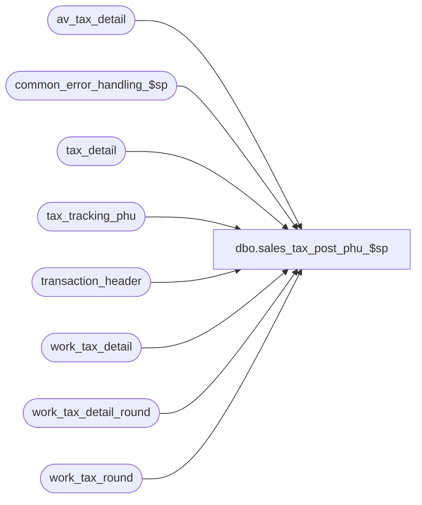

# dbo.sales_tax_post_phu_$sp

**Database:** auditworks  
**Server:** bedrockdb01  

## Architecture Diagram



## Table Dependencies

| Referenced Table |
|---|
| av_tax_detail |
| common_error_handling_$sp |
| tax_detail |
| tax_tracking_phu |
| transaction_header |
| work_tax_detail |
| work_tax_detail_round |
| work_tax_round |

## Stored Procedure Code

```sql
create proc dbo.sales_tax_post_phu_$sp 

( @process_id			int,
  @function_no			smallint,
  @update_timing		smallint,
  @tax_rounding_method		tinyint,
  @log_tax_detail		tinyint,
  @lookup_segment_flag		tinyint,
  @store_no			int = null, -- required only when rebuild or pre audit from dayend
  @transaction_date		smalldatetime = null, -- required only when rebuild or pre audit from dayend
  @stream_no			tinyint = 1,
  @tax_strip_flag		tinyint OUTPUT,
  @trans_count			int OUTPUT,
  @errmsg			varchar(255) OUTPUT
)

AS

/*
PROC NAME: sales_tax_post_$sp
     DESC: Post sales tax info to tax_detail, tax_tracking_phu, av_tax_detail tables,
           depending on the value of @tax_post_type which is determined by
           @update_timing and @function_no:
           @tax_post_type = 1, 4:  post to tax_detail from work_tax_detail
           @tax_post_type = 2:     post to tax_tracking_phu from tax_detail
           @tax_post_type = 3, 4:  post to tax_tracking_phu from work_tax_detail
                          = 3      post to av_tax_detail from work_tax_detail (if log_tax_detail is on)

           @tax_post_type = 11, 14: post to tax_detail from work_tax_round
           @tax_post_type = 13, 14: post to tax_tracking_phu from work_tax_round
                          = 13      post to av_tax_detail from work_tax_round (if log_tax_detail is on)

           Called by sales_tax_main_$sp, sales_tax_rebuild_$sp, pre_audit_tax_$sp, edit_pre_audit_tax_$sp

  HISTORY:
Date     Name		Def#  Desc
Apr23,03 David          7320  Handle even exchange trnx with no return detail when rounding by transaction
Apr07,03 Phu            7461  Correct wrong tax collected/expected due to rounding from tax_detail to tax_tracking_phu
Feb10,03 Phu            6065  Correct error: insert null into #store_date in build_subledger_$sp
Feb04,03 Phu            5933  Exclude tax paid/expenses from tax collected
Dec19,02 Phu            5327  Post ordered trans to tax_detail, prorate tax collected to nontaxable if required
Dec10,02 Phu            5283  Do not create entry in tax_detail if taxable and nontaxable amounts are zeros
Dec07,02 Phu         1-GCX2X  Calculate taxes where returned and sold items are in one tran or when modifying archived trans
Dec03,02 Phu         1-FULQT  Calculate tax amount based on taxable amounts if tax rate is not zero or nontaxable amount if tax rate is zero
Nov28,02 Phu         1-GYY7Y  Fix duplicate key inserted in tax_detail
Aug01,02 Phu         1-E3LUO  Allow one tax_on_tax_level having different tax_on_combined_rate in one transaction
Apr25,02 Phu         1-C9P5S  Pre Audit tax

*/

DECLARE
	@errno				int,
	@message_id			int,
	@min_store_no			int,
	@object_name			varchar(255),
	@operation_name			varchar(100),
	@tax_post_type			smallint,
	@process_name			varchar(100),
	@rows				int

SELECT @message_id = 201068,
       @process_name = 'sales_tax_post_$sp'

IF @tax_rounding_method = 2 -- rounding at line level
BEGIN
  IF @update_timing = 6 -- pre audit tax
    SELECT @tax_post_type = (2 * (1 - SIGN(ABS(@function_no - 22)))) +
                            (3 * (1 - SIGN(ABS(@function_no - 161)))) +
                            (1 * (1 - (SIGN(ABS(@function_no - 37))) * SIGN(ABS(@function_no - 38))))
  ELSE
    SELECT @tax_post_type = (3 * (1 - SIGN(ABS(@function_no - 161)))) +
                            (4 * (1 - SIGN(ABS(@function_no - 22))))
END -- if @tax_rounding_method = 2
ELSE
BEGIN -- rounding at transaction_level
  IF @update_timing = 6 -- pre audit tax
    SELECT @tax_post_type = (2 * (1 - SIGN(ABS(@function_no - 22)))) +
                            (13 * (1 - SIGN(ABS(@function_no - 161)))) +
                            (11 * (1 - (SIGN(ABS(@function_no - 37))) * SIGN(ABS(@function_no - 38))))
  ELSE
    SELECT @tax_post_type = (13 * (1 - SIGN(ABS(@function_no - 161)))) +
                            (14 * (1 - SIGN(ABS(@function_no - 22))))
END -- else of if @tax_rounding_method = 2


IF @tax_post_type IN (1, 4)
BEGIN
  DELETE tax_detail
  FROM work_tax_detail wt, tax_detail td
  WHERE wt.process_id = @process_id
  AND wt.transaction_id = td.transaction_id

  SELECT @errno = @@error
  IF @errno <> 0
  BEGIN
    SELECT @errmsg = 'Unable to delete tax_detail from work_tax_detail.',
           @object_name = 'tax_detail',
           @operation_name = 'DELETE'
    GOTO error
  END

  INSERT INTO tax_detail (
        transaction_id,
        line_id,
        tax_level,
        tax_jurisdiction,
        tax_category,
        tax_rate_code,
        taxable_amount,
        tax_amount,
        combined_rate,
        nontaxable_amount,
        tax_amount_expected,
        tax_on_tax_level,
        tax_on_combined_rate,
        line_object_type,
        tax_strip_flag,
        gl_effect )
  SELECT
        transaction_id,
        line_id,
        tax_level,
        tax_jurisdiction,
        override_tax_category * (1 - SIGN(tax_category) ) + tax_category,
        tax_rate_code,
        taxable_fee_amount + taxable_merchandise_amount + taxable_expense_amount,
        tax_amount_collected + tax_amount_paid,
        combined_tax_rate,
        nontaxable_merchandise_amount + nontaxable_fee_amount,
        tax_amount_expected,
        tax_on_tax_level,
        tax_on_combined_rate,
        line_object_type,
        item_tax_strip_flag,
        gl_effect
  FROM work_tax_detail
  WHERE process_id = @process_id
  AND line_object_type <> 5
  AND (taxable_fee_amount + taxable_merchandise_amount + taxable_expense_amount +
       nontaxable_merchandise_amount + nontaxable_fee_amount <> 0) -- 5283
  AND (item_tax_strip_flag = 1
       OR @log_tax_detail = 1
       OR @lookup_segment_flag = 1
       OR @tax_rounding_method = 2)

  SELECT @errno = @@error
  IF @errno <> 0
  BEGIN
    SELECT @errmsg = 'Unable to insert rows into tax_detail table from work_tax_detail.',
           @object_name = 'tax_detail',
           @operation_name = 'INSERT'
    GOTO error
  END
END -- if @tax_post_type IN (1, 4)

IF @tax_post_type IN (2, 3, 4, 13, 14)
BEGIN
  SELECT @min_store_no = MIN(store_no)
  FROM tax_tracking_phu
  WHERE store_no = @store_no
  AND transaction_date = @transaction_date

  SELECT @errno = @@error
  IF @errno <> 0
  BEGIN
    SELECT @errmsg = 'Unable to select min(store_no) from tax_tracking_phu table.',
           @object_name = 'tax_tracking_phu',
           @operation_name = 'SELECT'
    GOTO error
  END

  IF @min_store_no IS NOT NULL --
  BEGIN
    DELETE FROM tax_tracking_phu
    WHERE store_no = @store_no
    AND transaction_date = @transaction_date

    SELECT @errno = @@error
    IF @errno <> 0
    BEGIN
      SELECT @errmsg = 'Unable to delete from tax_tracking_phu table.',
             @object_name = 'tax_tracking_phu',
             @operation_name = 'DELETE'
      GOTO error
    END
  END
END -- if @tax_post_type IN (2, 3, 4, 13, 14)

IF @tax_post_type = 2
BEGIN
  INSERT tax_tracking_phu (
        tax_level,
        store_no,
        tax_category,
        tax_jurisdiction,
        tax_rate_code,
        combined_rate,
        tax_on_tax_level,
        tax_on_combined_rate,
        transaction_date,
        taxable_merchandise_amount,
        taxable_fee_amount,
        nontaxable_merchandise_amount,
        nontaxable_fee_amount,
        tax_amount_collected,
        tax_amount_expected,
        taxable_expense_amount,
        tax_amount_paid )
  SELECT
        tax_level,
        @store_no,
        tax_category,
        tax_jurisdiction,
        tax_rate_code,
        combined_rate,
        tax_on_tax_level,
        tax_on_combined_rate,
        @transaction_date,
        ROUND(SUM (taxable_amount * gl_effect * (1 - (SIGN(ABS(line_object_type - 1))))), 2),
        ROUND(SUM (taxable_amount * gl_effect * (1 - (SIGN(ABS(line_object_type - 2))))), 2),
        ROUND(SUM (nontaxable_amount * gl_effect * (1 - (SIGN(ABS(line_object_type - 1))))), 2),
        ROUND(SUM (nontaxable_amount * gl_effect * (1 - (SIGN(ABS(line_object_type - 2))))), 2),
        ROUND(SUM (tax_amount * gl_effect * (SIGN(ABS(line_object_type - 7)))), 2),
        ROUND(SUM (tax_amount_expected * gl_effect), 2),
        ROUND(SUM (taxable_amount * gl_effect * (1 - (SIGN(ABS(line_object_type - 7))))), 2),
        ROUND(SUM (tax_amount * gl_effect * (1 - (SIGN(ABS(line_object_type - 7))))), 2)
  FROM tax_detail d, transaction_header h
  WHERE h.store_no = @store_no
  AND h.transaction_date = @transaction_date
  AND h.transaction_void_flag IN (0,8)
  AND h.date_reject_id = 0
  AND h.transaction_id = d.transaction_id
  GROUP BY
        tax_level,
        tax_category,
        tax_jurisdiction,
        tax_rate_code,
        combined_rate,
        tax_on_tax_level,
        tax_on_combined_rate
  HAVING
        ROUND(SUM (taxable_amount * gl_effect * (1 - (SIGN(ABS(line_object_type - 1))))), 2) +
        ROUND(SUM (taxable_amount * gl_effect * (1 - (SIGN(ABS(line_object_type - 2))))), 2) +
        ROUND(SUM (nontaxable_amount * gl_effect * (1 - (SIGN(ABS(line_object_type - 1))))), 2) +
        ROUND(SUM (nontaxable_amount * gl_effect * (1 - (SIGN(ABS(line_object_type - 2))))), 2) +
        ROUND(SUM (tax_amount * gl_effect * (SIGN(ABS(line_object_type - 7)))), 2) +
        ROUND(SUM (tax_amount_expected * gl_effect), 2) +
        ROUND(SUM (taxable_amount * gl_effect * (1 - (SIGN(ABS(line_object_type - 7))))), 2) +
        ROUND(SUM (tax_amount * gl_effect * (1 - (SIGN(ABS(line_object_type - 7))))), 2) <> 0

  SELECT @errno = @@error, @trans_count = @@rowcount
  IF @errno <> 0
  BEGIN
    SELECT @errmsg = 'Unable to insert rows into tax_tracking_phu table from tax_detail.',
           @object_name = 'tax_tracking_phu',
           @operation_name = 'INSERT'
    GOTO error
  END

  SELECT @tax_strip_flag = SIGN(ISNULL(MAX(d.tax_strip_flag), 0))
  FROM tax_detail d, transaction_header h
  WHERE h.store_no = @store_no
  AND h.transaction_date = @transaction_date
  AND h.transaction_void_flag IN (0,8)
  AND h.date_reject_id = 0
  AND h.transaction_id = d.transaction_id

  SELECT @errno = @@error
  IF @errno <> 0
  BEGIN
    SELECT @errmsg = 'Unable to select tax_strip_flag from tax_detail.',
           @object_name = 'tax_detail',
           @operation_name = 'SELECT'
    GOTO error
  END

END -- if i_tax_post_type = 2

IF @tax_post_type IN (3, 13)
BEGIN
  DELETE av_tax_detail
  FROM av_tax_detail t, work_tax_detail wt
  WHERE wt.process_id = @process_id
  AND wt.transaction_id = t.av_transaction_id

  SELECT @errno = @@error
  IF @errno <> 0
  BEGIN
    SELECT @errmsg = 'Unable to delete av_tax_detail table.',
           @object_name = 'av_tax_detail',
           @operation_name = 'DELETE'
    GOTO error
  END

END -- if @tax_post_type IN (3, 13) and @function_no = 161

IF @tax_post_type IN (3, 4, 13, 14)
BEGIN
  SELECT @tax_strip_flag = SIGN(ISNULL(MAX(item_tax_strip_flag), 0))
  FROM work_tax_detail
  WHERE process_id = @process_id

  SELECT @errno = @@error
  IF @errno <> 0
  BEGIN
    SELECT @errmsg = 'Unable to select item_tax_strip_flag from work_tax_detail.',
           @object_name = 'work_tax_detail',
           @operation_name = 'SELECT'
    GOTO error
  END
END -- if @tax_post_type IN (3, 4, 13, 14)

IF @tax_post_type IN (3, 4)
BEGIN
  INSERT tax_tracking_phu (
      tax_level,
      store_no,
      tax_category,
      tax_jurisdiction,
      tax_rate_code,
      combined_rate,
      tax_on_tax_level,
      tax_on_combined_rate,
      transaction_date,
      taxable_merchandise_amount,
      taxable_fee_amount,
      nontaxable_merchandise_amount,
      nontaxable_fee_amount,
      tax_amount_collected,
      tax_amount_expected,
      taxable_expense_amount,
      tax_amount_paid )
  SELECT
      tax_level,
      store_no,
      override_tax_category * (1 - SIGN(tax_category) ) + tax_category,
      tax_jurisdiction,
      tax_rate_code,
      combined_tax_rate,
      tax_on_tax_level,
      tax_on_combined_rate,
      transaction_date,
      ROUND(SUM (taxable_merchandise_amount * gl_effect), 2),
      ROUND(SUM (taxable_fee_amount * gl_effect), 2),
      ROUND(SUM (nontaxable_merchandise_amount * gl_effect), 2),
      ROUND(SUM (nontaxable_fee_amount * gl_effect), 2),
      ROUND(SUM (tax_amount_collected * gl_effect), 2),
      ROUND(SUM (tax_amount_expected * gl_effect), 2),
      ROUND(SUM (taxable_expense_amount * gl_effect), 2),
      ROUND(SUM (tax_amount_paid * gl_effect), 2)
  FROM work_tax_detail
  WHERE process_id = @process_id
  AND line_object_type <> 5
  AND (item_tax_strip_flag = 1 OR @tax_rounding_method = 2 OR @log_tax_detail = 1 OR @lookup_segment_flag = 1)
  GROUP BY
      tax_level,
      store_no,
      override_tax_category * (1 - SIGN(tax_category) ) + tax_category,
      tax_jurisdiction,
      tax_rate_code,
      combined_tax_rate,
      tax_on_tax_level,
      tax_on_combined_rate,
      transaction_date
  HAVING
      ROUND(SUM (taxable_merchandise_amount * gl_effect), 2) +
      ROUND(SUM (taxable_fee_amount * gl_effect), 2) +
      ROUND(SUM (nontaxable_merchandise_amount * gl_effect), 2) +
      ROUND(SUM (nontaxable_fee_amount * gl_effect), 2) +
      ROUND(SUM (tax_amount_collected * gl_effect), 2) +
      ROUND(SUM (tax_amount_expected * gl_effect), 2) +
      ROUND(SUM (taxable_expense_amount * gl_effect), 2) +
      ROUND(SUM (tax_amount_paid * gl_effect), 2) <> 0

  SELECT @errno = @@error, @trans_count = @@rowcount
  IF @errno <> 0
  BEGIN
    SELECT @errmsg = 'Unable to insert rows into tax_tracking_phu table from work_tax_detail.',
           @object_name = 'tax_tracking_phu',
           @operation_name = 'INSERT'
    GOTO error
  END

  IF @tax_post_type = 3
  BEGIN
    INSERT INTO av_tax_detail (
        av_transaction_id,
        line_id,
        tax_level,
        tax_jurisdiction,
        tax_category,
        tax_rate_code,
        taxable_amount,
        tax_amount,
        combined_rate,
        nontaxable_amount,
        tax_amount_expected,
        tax_on_tax_level,
        tax_on_combined_rate,
        line_object_type,
        tax_strip_flag,
        gl_effect )
    SELECT
        transaction_id,
        line_id,
        tax_level,
        tax_jurisdiction,
        override_tax_category * (1 - SIGN(tax_category) ) + tax_category,
        tax_rate_code,
        taxable_fee_amount + taxable_merchandise_amount + taxable_expense_amount,
        tax_amount_collected + tax_amount_paid,
        combined_tax_rate,
        nontaxable_merchandise_amount + nontaxable_fee_amount,
        tax_amount_expected,
        tax_on_tax_level,
        tax_on_combined_rate,
        line_object_type,
        item_tax_strip_flag,
        gl_effect
    FROM work_tax_detail
    WHERE process_id = @process_id
    AND line_object_type <> 5
    AND (taxable_fee_amount + taxable_merchandise_amount + taxable_expense_amount +
         nontaxable_merchandise_amount + nontaxable_fee_amount <> 0) -- 5283
    AND (item_tax_strip_flag = 1
         OR @log_tax_detail = 1
         OR @lookup_segment_flag = 1
         OR @tax_rounding_method = 2)

    SELECT @errno = @@error
    IF @errno <> 0
    BEGIN
      SELECT @errmsg = 'Unable to insert rows into av_tax_detail table from work_tax_detail.',
             @object_name = 'av_tax_detail',
             @operation_name = 'INSERT'
      GOTO error
    END
  END -- if @tax_post_type = 3
END -- if @tax_post_type in (3, 4)

IF @tax_post_type >= 11
BEGIN
  DELETE FROM work_tax_detail_round
  WHERE process_id = @process_id

  SELECT @errno = @@error
  IF @errno <> 0
  BEGIN
    SELECT @errmsg = 'Unable to delete work_tax_detail_round.',
           @object_name = 'work_tax_detail_round',
           @operation_name = 'DELETE'
    GOTO error
  END

  INSERT INTO work_tax_detail_round (
      process_id,
      transaction_id,
      line_id,
      tax_level,
      tax_jurisdiction,
      tax_category,
      tax_rate_code,
      combined_rate,
      tax_on_tax_level,
      tax_on_combined_rate,
      line_object_type,
      tax_strip_flag, 
      taxable_merchandise_amount,
      taxable_fee_amount,
      nontaxable_merchandise_amount,
      nontaxable_fee_amount,
      tax_amount_collected,
      tax_amount_expected,
      taxable_expense_amount,
      tax_amount_paid,
      gl_effect )
  SELECT
      @process_id,
      d.transaction_id,
      d.line_id,
      d.tax_level,
      d.tax_jurisdiction,
      d.override_tax_category * (1 - SIGN(d.tax_category) ) + d.tax_category,
      d.tax_rate_code,
      d.combined_tax_rate,
      d.tax_on_tax_level,
      d.tax_on_combined_rate,
      d.line_object_type,
      d.item_tax_strip_flag,
      d.taxable_merchandise_amount,
      d.taxable_fee_amount,
      d.nontaxable_merchandise_amount,
      d.nontaxable_fee_amount,

-- collected = r.collected * (d.taxable amounts  / r.taxable amounts)
-- if r.taxable amounts is zero then:
--    collected = r.collected * (d.taxable + d.nontaxable amounts)  / r.nontaxable amounts)
-- if r.nontaxable amounts is zero then use 1 to avoid division by zero

      ISNULL(((r.tax_amount_collected *
               (((d.taxable_merchandise_amount + d.taxable_fee_amount + d.taxable_expense_amount + d.nontaxable_merchandise_amount + d.nontaxable_fee_amount) *
                 (1 - SIGN(ABS(r.taxable_merchandise_amount + r.taxable_fee_amount + r.taxable_expense_amount)))
                ) + (SIGN(ABS(r.taxable_merchandise_amount + r.taxable_fee_amount + r.taxable_expense_amount)) * (d.taxable_merchandise_amount + d.taxable_fee_amount + d.taxable_expense_amount))
               )
              ) /
              ((r.taxable_merchandise_amount + r.taxable_fee_amount + r.taxable_expense_amount) +
                ((r.nontaxable_merchandise_amount + r.nontaxable_fee_amount) * (1 - SIGN(ABS(r.taxable_merchandise_amount + r.taxable_fee_amount + r.taxable_expense_amount)))
                ) 
              ) -- Remove code because amounts cannot be zero in this statement anymore
             ), d.tax_amount_collected),

-- expected = r.expected * (d.taxable amounts  / r.taxable amounts)
      ISNULL(((r.tax_amount_expected *
               (d.taxable_merchandise_amount + d.taxable_fee_amount + d.taxable_expense_amount)
              )  /
              ((r.taxable_merchandise_amount + r.taxable_fee_amount + r.taxable_expense_amount) +
               (1 - SIGN(ABS(r.taxable_merchandise_amount + r.taxable_fee_amount + r.taxable_expense_amount)))
              )
             ), d.tax_amount_expected),

      d.taxable_expense_amount,

      ISNULL(((d.taxable_expense_amount) *
              r.tax_amount_paid) / (r.taxable_expense_amount + (1 - SIGN(ABS(r.taxable_expense_amount)))), d.tax_amount_paid ), -- tax_amount_paid
      d.gl_effect
  FROM work_tax_detail d, work_tax_round r
  WHERE d.process_id = @process_id
  AND d.line_object_type <> 5
  AND (d.taxable_fee_amount + d.taxable_merchandise_amount + d.taxable_expense_amount +
       d.nontaxable_merchandise_amount + d.nontaxable_fee_amount <> 0) -- 5283
  AND d.process_id *= r.process_id
  AND d.transaction_id *= r.transaction_id
  AND d.tax_level *= r.tax_level
  AND d.tax_jurisdiction *= r.tax_jurisdiction
  AND d.tax_category *= r.tax_category
  AND d.tax_rate_code *= r.tax_rate_code
  AND d.tax_on_tax_level *= r.tax_on_tax_level
  AND d.combined_tax_rate *= r.combined_tax_rate
  AND d.tax_on_combined_rate *= r.tax_on_combined_rate
  AND d.item_tax_strip_flag *= r.item_tax_strip_flag
  AND r.tax_line = 0
  AND (r.taxable_merchandise_amount + r.taxable_fee_amount +
       r.taxable_expense_amount + r.nontaxable_merchandise_amount +
 r.nontaxable_fee_amount + ISNULL(r.tax_amount_expected,0) <> 0)

  SELECT @errno = @@error
  IF @errno <> 0
  BEGIN
    SELECT @errmsg = 'Unable to insert work_tax_detail_round from work_tax_detail and work_tax_round.',
           @object_name = 'work_tax_detail_round',
           @operation_name = 'INSERT'
    GOTO error
  END

-- 7320: If tax_amount_collected is positive, 
-- tax collected is prorated based on taxable_positive_amt or nontaxable_positive_amt to all positive amounts. 
  UPDATE work_tax_detail_round 
     SET tax_amount_collected = 
      ISNULL( (r.tax_amount_collected 
               * (d.taxable_merchandise_amount + d.taxable_fee_amount + d.taxable_expense_amount + d.nontaxable_merchandise_amount + d.nontaxable_fee_amount) 
              )
              /
              (r.taxable_positive_amt 
               + ( r.nontaxable_positive_amt * (1 - SIGN(ABS(r.taxable_positive_amt)))
                 )
              ) 
             , d.tax_amount_collected)
    FROM work_tax_detail_round d, work_tax_round r
   WHERE d.process_id = @process_id
     AND ((d.taxable_fee_amount + d.taxable_merchandise_amount + d.taxable_expense_amount +
           d.nontaxable_merchandise_amount + d.nontaxable_fee_amount) * d.gl_effect < 0) 
     AND d.process_id = r.process_id
     AND d.transaction_id = r.transaction_id
     AND d.tax_level = r.tax_level
     AND d.tax_jurisdiction = r.tax_jurisdiction
     AND d.tax_category = r.tax_category
     AND d.tax_rate_code = r.tax_rate_code
     AND d.tax_on_tax_level = r.tax_on_tax_level
     AND d.combined_rate = r.combined_tax_rate
     AND d.tax_on_combined_rate = r.tax_on_combined_rate
     AND d.tax_strip_flag = r.item_tax_strip_flag
     AND r.tax_line = 0
     AND (r.taxable_merchandise_amount + r.taxable_fee_amount +
          r.taxable_expense_amount + r.nontaxable_merchandise_amount +
          r.nontaxable_fee_amount + ISNULL(r.tax_amount_expected,0) = 0) 
     AND r.tax_amount_collected + r.tax_amount_paid > 0

  SELECT @errno = @@error
  IF @errno <> 0
  BEGIN
    SELECT @errmsg = 'UPDATE work_tax_detail_round (tax_amount_collected > 0)',
           @object_name = 'work_tax_detail_round',
           @operation_name = 'UPDATE'
    GOTO error
  END

-- 7320: If tax_amount_collected is negative, 
-- tax collected is prorated based on taxable_negative_amt or nontaxable_negative_amt to all negative amounts. 
  UPDATE work_tax_detail_round 
     SET tax_amount_collected = 
      ISNULL( (ABS(r.tax_amount_collected) 
               * (d.taxable_merchandise_amount + d.taxable_fee_amount + d.taxable_expense_amount + d.nontaxable_merchandise_amount + d.nontaxable_fee_amount) 
              )
              /
              (r.taxable_negative_amt 
               + ( r.nontaxable_negative_amt * (1 - SIGN(ABS(r.taxable_negative_amt)))
                 )
              ) 
             , d.tax_amount_collected)
    FROM work_tax_detail_round d, work_tax_round r
   WHERE d.process_id = @process_id
     AND ((d.taxable_fee_amount + d.taxable_merchandise_amount + d.taxable_expense_amount +
           d.nontaxable_merchandise_amount + d.nontaxable_fee_amount) * d.gl_effect > 0) 
     AND d.process_id = r.process_id
     AND d.transaction_id = r.transaction_id
     AND d.tax_level = r.tax_level
     AND d.tax_jurisdiction = r.tax_jurisdiction
     AND d.tax_category = r.tax_category
     AND d.tax_rate_code = r.tax_rate_code
     AND d.tax_on_tax_level = r.tax_on_tax_level
     AND d.combined_rate = r.combined_tax_rate
     AND d.tax_on_combined_rate = r.tax_on_combined_rate
     AND d.tax_strip_flag = r.item_tax_strip_flag
     AND r.tax_line = 0
     AND (r.taxable_merchandise_amount + r.taxable_fee_amount +
          r.taxable_expense_amount + r.nontaxable_merchandise_amount +
          r.nontaxable_fee_amount + ISNULL(r.tax_amount_expected,0) = 0) 
     AND r.tax_amount_collected + r.tax_amount_paid < 0

 SELECT @errno = @@error
  IF @errno <> 0
  BEGIN
    SELECT @errmsg = 'UPDATE work_tax_detail_round (tax_amount_collected < 0)',
           @object_name = 'work_tax_detail_round',
           @operation_name = 'UPDATE'
    GOTO error
  END

  IF @tax_post_type IN (11, 14)
  BEGIN
    DELETE tax_detail
    FROM work_tax_detail wt, tax_detail td
    WHERE wt.process_id = @process_id
    AND wt.transaction_id = td.transaction_id

    SELECT @errno = @@error
    IF @errno <> 0
    BEGIN
      SELECT @errmsg = 'Unable to delete tax_detail from work_tax_detail (2).',
             @object_name = 'tax_detail',
             @operation_name = 'DELETE'
      GOTO error
    END

    INSERT INTO tax_detail (
      transaction_id,
      line_id,
      tax_level,
      tax_jurisdiction,
      tax_category,
      tax_rate_code,
      taxable_amount,
      tax_amount,
      combined_rate,
      nontaxable_amount,
      tax_amount_expected,
      tax_on_tax_level,
      tax_on_combined_rate,
      line_object_type,
      tax_strip_flag,
      gl_effect )
    SELECT
      transaction_id,
      line_id,
      tax_level,
      tax_jurisdiction,
      tax_category,
      tax_rate_code,
      taxable_merchandise_amount + taxable_fee_amount + taxable_expense_amount,
      tax_amount_collected + tax_amount_paid,
      combined_rate,
      nontaxable_merchandise_amount + nontaxable_fee_amount,
      tax_amount_expected,
      tax_on_tax_level,
      tax_on_combined_rate,
      line_object_type,
      tax_strip_flag,
      gl_effect
    FROM work_tax_detail_round
    WHERE process_id = @process_id

    SELECT @errno = @@error
    IF @errno <> 0
    BEGIN
      SELECT @errmsg = 'Unable to insert tax_detail from work_tax_detail_round.',
             @object_name = 'tax_detail',
             @operation_name = 'INSERT'
      GOTO error
    END
  END -- if i_tax_post_type IN (11, 14)

  IF @tax_post_type IN (13, 14)
  BEGIN
    INSERT tax_tracking_phu (
      tax_level,
      store_no,
      tax_category,
      tax_jurisdiction,
      tax_rate_code,
      combined_rate,
      tax_on_tax_level,
      tax_on_combined_rate,
      transaction_date,
      taxable_merchandise_amount,
      taxable_fee_amount,
      nontaxable_merchandise_amount,
      nontaxable_fee_amount,
      tax_amount_collected,
      tax_amount_expected,
      taxable_expense_amount,
      tax_amount_paid )
    SELECT
      tax_level,
      @store_no,
      tax_category,
      tax_jurisdiction,
      tax_rate_code,
      combined_rate,
      tax_on_tax_level,
      tax_on_combined_rate,
      @transaction_date,
      ROUND(SUM(taxable_merchandise_amount * gl_effect), 2),
      ROUND(SUM(taxable_fee_amount * gl_effect), 2),
      ROUND(SUM(nontaxable_merchandise_amount * gl_effect), 2),
      ROUND(SUM(nontaxable_fee_amount * gl_effect), 2),
      ROUND(SUM(tax_amount_collected * gl_effect), 2),
      ROUND(SUM(tax_amount_expected * gl_effect), 2),
      ROUND(SUM(taxable_expense_amount * gl_effect), 2),
      ROUND(SUM(tax_amount_paid * gl_effect), 2)
    FROM work_tax_detail_round
    WHERE process_id = @process_id
    GROUP BY
      tax_level,
      tax_category,
      tax_jurisdiction,
      tax_rate_code,
      combined_rate,
      tax_on_tax_level,
      tax_on_combined_rate
    HAVING
      ROUND(SUM(taxable_merchandise_amount * gl_effect), 2) +
      ROUND(SUM(taxable_fee_amount * gl_effect), 2) +
      ROUND(SUM(nontaxable_merchandise_amount * gl_effect), 2) +
      ROUND(SUM(nontaxable_fee_amount * gl_effect), 2) +
      ROUND(SUM(tax_amount_collected * gl_effect), 2) +
      ROUND(SUM(tax_amount_expected * gl_effect), 2) +
      ROUND(SUM(taxable_expense_amount * gl_effect), 2) +
      ROUND(SUM(tax_amount_paid * gl_effect), 2) <> 0

    SELECT @errno = @@error, @trans_count = @@rowcount
    IF @errno <> 0
    BEGIN
      SELECT @errmsg = 'Unable to insert rows into tax_tracking_phu table from work_tax_detail_round.',
             @object_name = 'tax_tracking_phu',
             @operation_name = 'INSERT'
      GOTO error
    END

    IF @tax_post_type = 13
    BEGIN
      INSERT INTO av_tax_detail (
        av_transaction_id,
        line_id,
        tax_level,
        tax_jurisdiction,
        tax_category,
        tax_rate_code,
        taxable_amount,
        tax_amount,
        combined_rate,
        nontaxable_amount,
        tax_amount_expected,
        tax_on_tax_level,
        tax_on_combined_rate,
        line_object_type,
        tax_strip_flag,
        gl_effect )
      SELECT
        transaction_id,
        line_id,
        tax_level,
        tax_jurisdiction,
        tax_category,
        tax_rate_code,
        taxable_merchandise_amount + taxable_fee_amount + taxable_expense_amount,
        tax_amount_collected + tax_amount_paid,
        combined_rate,
        nontaxable_merchandise_amount + nontaxable_fee_amount,
        tax_amount_expected,
        tax_on_tax_level,
        tax_on_combined_rate,
        line_object_type,
        tax_strip_flag,
        gl_effect
      FROM work_tax_detail_round
      WHERE process_id = @process_id

      SELECT @errno = @@error
      IF @errno <> 0
      BEGIN
        SELECT @errmsg = 'Unable to insert rows into av_tax_detail table from work_tax_detail_round.',
               @object_name = 'av_tax_detail',
               @operation_name = 'INSERT'
        GOTO error
      END
    END -- if @tax_post_type = 13
  END -- if @tax_post_type IN (13, 14)
END -- if @tax_post_type >= 11


RETURN


error:
	EXEC common_error_handling_$sp @function_no, @errno, @errmsg, 0, @message_id, 
	@process_name, @object_name, @operation_name, 0, @stream_no
	RETURN
```

