# dbo.sales_tax_rebuild_$sp

**Database:** auditworks  
**Server:** bedrockdb01  

## Architecture Diagram

```mermaid
flowchart LR
    SP["dbo.sales_tax_rebuild_$sp"]
    ORG_CHN(["ORG_CHN"]) --> SP
    ORG_CHN_TYPE(["ORG_CHN_TYPE"]) --> SP
    auditworks_parameter(["auditworks_parameter"]) --> SP
    auditworks_system_flag(["auditworks_system_flag"]) --> SP
    av_customer(["av_customer"]) --> SP
    av_discount_detail(["av_discount_detail"]) --> SP
    av_interface_control(["av_interface_control"]) --> SP
    av_merchandise_detail(["av_merchandise_detail"]) --> SP
    av_return_detail(["av_return_detail"]) --> SP
    av_stock_control_detail(["av_stock_control_detail"]) --> SP
    av_tax_override_detail(["av_tax_override_detail"]) --> SP
    av_transaction_header(["av_transaction_header"]) --> SP
    av_transaction_line(["av_transaction_line"]) --> SP
    av_transaction_line_link(["av_transaction_line_link"]) --> SP
    check_abort_requested__sp(["check_abort_requested_$sp"]) --> SP
    common_error_handling__sp(["common_error_handling_$sp"]) --> SP
    copy_dayend_summarized_data(["copy_dayend_summarized_data"]) --> SP
    end_process_log__sp(["end_process_log_$sp"]) --> SP
    interface_applicability(["interface_applicability"]) --> SP
    line_object_action_association(["line_object_action_association"]) --> SP
    rebuild_request_detail(["rebuild_request_detail"]) --> SP
    sales_tax_calc__sp(["sales_tax_calc_$sp"]) --> SP
    sales_tax_cleanup__sp(["sales_tax_cleanup_$sp"]) --> SP
    sales_tax_exceptions__sp(["sales_tax_exceptions_$sp"]) --> SP
    sales_tax_post__sp(["sales_tax_post_$sp"]) --> SP
    sales_tax_settings__sp(["sales_tax_settings_$sp"]) --> SP
    start_process_log__sp(["start_process_log_$sp"]) --> SP
    store_audit_status(["store_audit_status"]) --> SP
    tax_default(["tax_default"]) --> SP
    tax_jurisdiction(["tax_jurisdiction"]) --> SP
    tax_jurisdiction_post_code(["tax_jurisdiction_post_code"]) --> SP
    tax_level(["tax_level"]) --> SP
    transaction_category(["transaction_category"]) --> SP
    work_tax_detail(["work_tax_detail"]) --> SP
    work_tax_exception_jur(["work_tax_exception_jur"]) --> SP
    work_tax_post_template(["work_tax_post_template"]) --> SP
    work_tax_trans_template(["work_tax_trans_template"]) --> SP
```



## Table Dependencies

| Referenced Table |
|---|
| ORG_CHN |
| ORG_CHN_TYPE |
| auditworks_parameter |
| auditworks_system_flag |
| av_customer |
| av_discount_detail |
| av_interface_control |
| av_merchandise_detail |
| av_return_detail |
| av_stock_control_detail |
| av_tax_override_detail |
| av_transaction_header |
| av_transaction_line |
| av_transaction_line_link |
| check_abort_requested_$sp |
| common_error_handling_$sp |
| copy_dayend_summarized_data |
| end_process_log_$sp |
| interface_applicability |
| line_object_action_association |
| rebuild_request_detail |
| sales_tax_calc_$sp |
| sales_tax_cleanup_$sp |
| sales_tax_exceptions_$sp |
| sales_tax_post_$sp |
| sales_tax_settings_$sp |
| start_process_log_$sp |
| store_audit_status |
| tax_default |
| tax_jurisdiction |
| tax_jurisdiction_post_code |
| tax_level |
| transaction_category |
| work_tax_detail |
| work_tax_exception_jur |
| work_tax_post_template |
| work_tax_trans_template |

## Stored Procedure Code

```sql
create proc dbo.sales_tax_rebuild_$sp ( @process_id				 binary(16),
  @errmsg                                nvarchar(2000) OUTPUT,
  @excluded_dayend_from_time             int = 0,
  @excluded_dayend_to_time               int = 0
)

AS

/*
PROC NAME: sales_tax_rebuild_$sp
     DESC: Rebuilds sales taxes for store-dates have been dayended.
           Called by sales_tax_main_$sp or run independently.
           If run independently, table rebuild_request_detail containing
           store-dates must be populated prior to running this proc.

  HISTORY:
Date     Name		Def#  Desc
Jul15,15 Vicci    TFS-128531  Log UPC to work_tax_detail.
Jun29,15 Vicci    TFS-128115  Add missing code from 120654 to set fulfillment store;  this is required for consistency with 
                              sales_tax_populate_$sp since otherwise revalidation thinks changes have occurred.
Jan04,12 Vicci      1-47GP4M  Correct setting of rebuild request for subledger-tax-stripping:  mark subledger tax rebuild requests which were 
                              marked as held (waiting for execution of tax-rebuild first) as released.  Recognize request_status 2.  Don't run
                              on consolidated since its requests will be copied over to peripheral mass_auto_revalidate_$sp and run there.
                              Don't issue a "copy from peripheral to consolidated" request unless in a scaleout environment (since nothing will 
                              clean it up).
Mar21,11 Paul         121025  avoid ambiguity on column transaction_date, use unicode for error trap
Jan11,11 Vicci        123998  Set track tax to false on alteration requests/cancellations are fed to Tax in addition to
                              alteration completions.
Dec14,10 Vicci        120654  Set return_from_store to fullfillment store so that its available to send to Avalara. 
Sep15,10 Vicci        120892  Add option to allocate transaction tax to item level on a per-order basis to support ES.
Aug18,10 Vicci        120255  Don't overlay the fulfillment store tax jurisdiction with that of the store in which the 
			      original purchase was made even if the fulfillment store tax jurisdiction matches that of
			      the store in which the return transaction was entered.
Dec09,09 Vicci        114269  Set max_applied_by_line_id on tax line so that if by misfortune there is no merch/fee line to which the tax collected
                              may be applied it will still post to subledger thus avoiding an imbalance.
Sep21,09 Vicci        112842  Compensate for UI bug whereby tax_override_detail.taxable gets set to 100 when the attachment is viewed.
Jul24,08 Vicci        109078  Support having tax calculated on both order creation and fulfillment while only posting
                              one or the other to tax_tracking (in case of applicability_method = 0, if both
                              order and fulfillment have been configured to feed tax in interface applicability, tax will
                              be calculated on both but will feed tax-tracking upon fulfillment only).
                              Add recognition for header-level returns.
                              Add recognition of fulfillment store since tax charged based on store where merch will be picked up.
                              Add recognition for order placement date.
Mar25,08 Vicci      1-38MDAZ  Log units
Aug16,07 Paul        DV-1363  apply 81895 to SA5. added comments re #tax_sent table.
Oct25,06 Phu           77931  Fix outer join for SQL 2005 Mode 90.
Mar28,04 Maryam/Sab  DV-1202  Handle the indirect association via line links. Handle send to customer as from_line_id is changed to be line_id.
                              Support order pickups. Scaleout, insert the str/dates into copy_dayend_summarized_data when rebuilding tax
Dec13,04 David       DV-1191  Improve performance by adding hints.
Oct07,04 David       DV-1146  Pass NULL to parameter user_id.
Jul09,04 David       DV-1071  Use ORG_CHN table as new the Store table, receive @process_id.
Jan12,07 Vicci         81895  Support sale following loan, sale following rental, repair pickup, alteration pickup
Sep18,03 Maryam        13686  Pass two new parameters for excluded dayend time and call check_abort_requested_$sp
                              to check whether abort has been requested either by the system or user. pass
                              @errmsg OUTPUT.
Mar04,03 Phu            6512  Avoid error: insert NULL into 'discount_amount' in #tax_post_main
Jan23,03 Phu            5933  Retrieve sent tax jurisdiction if zip code is defined
Dec19,02 Phu            5327  Post ordered trans to tax_detail, prorate tax collected to nontaxable if required
Dec10,02 Phu            5292  Retrieve tax override
Dec07,02 Phu         1-GCX2X  Remove begin tran
Dec06,02 Phu            5299  Set request_status correctly
Dec05,02 David          5289  Change DROP TABLE #tax_sent to TRUNCATE.
Nov12,02 Phu         1-FOMGT  Retrieve archived trans for rebuild
Aug01,02 Phu         1-E3LUO  Retrieve tax_jurisdiction of sent transaction
May08,02 Winnie	     1-C2Q5L  Add abort logic to dayend.
Apr25,02 Phu         1-C9P5S  Pre audit tax

*/

DECLARE
        @applicability_method           tinyint,
        @class_exception_flag           tinyint,
        @cursor_open                    tinyint,
        @date_reject_id                 tinyint,
        @errno                          int,
        @exception_rows                 int,
        @item_group_exception_flag      tinyint,
        @include_expense                tinyint,
        @include_pickup                 tinyint,
        @lookup_segment_flag            tinyint,
        @log_flag			tinyint,
        @log_tax_detail                 tinyint,
        @log_tax_override               tinyint,
        @message_id                 int,
        @no_full_archive_exist          tinyint,
        @object_name                    nvarchar(255),
        @operation_name                 nvarchar(100),
        @process_log_entry              tinyint,
        @process_name                   nvarchar(100),
        @process_no                     smallint,
        @process_timestamp              float,
        @rows                           int,
        @rebuild_rows                   int,
        @sales_date                     smalldatetime,
        @sku_exception_flag             tinyint,
        @store_no                       int,
        @stream_no			tinyint,
        @style_exception_flag           tinyint,
        @tax_jurisdiction               nchar(5),
        @tax_rounding_method            tinyint,
        @tax_strip_flag                 tinyint,
        @trans_count                    int,
        @transaction_count 		int,  
        @unapplied_discounts_exist      tinyint, 
        @update_timing     		smallint, 
        @abort_flag			tinyint,
	@tax_allocation_by_refno	tinyint,
	@scaleout_flag			int,
	@instance_id			int
	
SELECT @process_no = 161,
       @message_id = 201068,
       @process_name = 'sales_tax_rebuild_$sp',
       @abort_flag = 0,
       @log_flag = 0,
       @no_full_archive_exist = 0,
       @stream_no = 1

SELECT @scaleout_flag = CONVERT(int,flag_numeric_value)
  FROM auditworks_system_flag
 WHERE flag_name = 'scaleout_flag'
SELECT @rows = @@rowcount, @errno = @@error
IF @errno != 0 OR @rows = 0
BEGIN
  SELECT @errmsg = 'Failed to select scaleout_flag from auditworks_system_flag',
         @object_name = 'auditworks_system_flag',
         @operation_name = 'SELECT'
  GOTO error
END
SELECT @instance_id = CONVERT(int,flag_numeric_value)
  FROM auditworks_system_flag
 WHERE flag_name = 'instance_id'
SELECT @rows = @@rowcount, @errno = @@error
IF @errno != 0 or @rows = 0
BEGIN
  SELECT @errmsg = 'Failed to select instance_id from auditworks_system_flag',
         @object_name = 'auditworks_system_flag',
         @operation_name = 'SELECT'
  GOTO error
END

IF EXISTS (SELECT * FROM auditworks_parameter WHERE par_name = 'reference_dependent_tax_alloc' AND par_value = '1')
  SELECT @tax_allocation_by_refno = 1
ELSE
  SELECT @tax_allocation_by_refno = 0

-- Create temp tables at top of proc to reduce recompilation

CREATE TABLE #request_store_date (
	request_id 			numeric(12,0) 	not null,
	store_no 			int 		not null,
	transaction_date		smalldatetime 	not null)

SELECT @errno = @@error
IF @errno <> 0 
BEGIN
  SELECT @errmsg = 'Failed to create temp table.',
         @object_name = '#request_store_date',
         @operation_name = 'CREATE'
  GOTO error  
END

INSERT INTO #request_store_date
	(request_id,
	store_no,
	transaction_date)
SELECT request_id,
       store_no,
       transaction_date
FROM rebuild_request_detail
WHERE rebuild_type = 1
AND request_status = 10

SELECT @transaction_count = @@rowcount,
       @errno = @@error
IF @errno <> 0
BEGIN
  SELECT @errmsg = 'Unable to insert into table #request_store_date',
         @object_name = '#request_store_date',
         @operation_name = 'INSERT'
  GOTO error
END

IF @transaction_count = 0
  BEGIN
   DROP TABLE #request_store_date -- mssql only

   RETURN
  END

SELECT transaction_id, store_no, transaction_date, transaction_category,
       log_tax_override, store_tax_jurisdiction, tod_tax_jurisdiction, header_override_flag, all_tax_override_flag
INTO #tax_transactions
FROM work_tax_trans_template

SELECT @errno = @@error
IF @errno != 0
BEGIN
  SELECT @errmsg = 'Unable to create temp table #tax_transactions.',
         @object_name = '#tax_transactions',
         @operation_name = 'CREATE'
  GOTO error
END

-- columns: transaction_no, register_no, entry_date_time, transaction_series
-- from table work_tax_post_template are NOT required in this proc
SELECT transaction_id, line_id, store_no, transaction_date, line_object_type, line_object,
       class_code, gross_line_amount, discount_amount, amount_sign, gl_effect,
       store_tax_jurisdiction, tax_jurisdiction, style_reference_id, sku_id, upc_lookup_division,
       return_from_store, return_from_date, override_tax_category, tax_paid_flag, header_override_flag,
       all_tax_override_flag, units, track_tax, reference_type, reference_no, upc_no
INTO #tax_post_main
FROM work_tax_post_template

SELECT @errno = @@error
IF @errno != 0
BEGIN
  SELECT @errmsg = 'Unable to create temp table #tax_post_main.',
         @object_name = '#tax_post_main',
         @operation_name = 'CREATE'
  GOTO error
END

CREATE TABLE #store_status (
  store_no int not null,
  sales_date smalldatetime not null,
  date_reject_id tinyint not null,
  tax_jurisdiction nchar(5) not null,
  log_tax_override tinyint null)

SELECT @errno = @@error
IF @errno != 0
BEGIN
  SELECT @errmsg = 'Failed to create temp table #store_status.',
         @object_name = '#store_status',
         @operation_name = 'CREATE'
  GOTO error
END


EXEC sales_tax_settings_$sp @process_id, NULL, @applicability_method OUTPUT, @update_timing OUTPUT,
     @class_exception_flag OUTPUT, @sku_exception_flag OUTPUT,
     @style_exception_flag OUTPUT, @item_group_exception_flag OUTPUT,
     @lookup_segment_flag OUTPUT, @include_expense OUTPUT, @include_pickup OUTPUT, 
     @unapplied_discounts_exist OUTPUT, @tax_rounding_method OUTPUT,
     @log_tax_detail OUTPUT, @errmsg OUTPUT, @process_no

SELECT @errno = @@error
IF @errno <> 0
  BEGIN
    SELECT @errmsg = ISNULL(@errmsg, 'Unable to execute stored proc sales_tax_settings_$sp'),
           @object_name = 'sales_tax_settings_$sp',
           @operation_name = 'EXECUTE'
    GOTO error
  END

IF @applicability_method = 0
  BEGIN
    IF EXISTS (SELECT 1
               FROM transaction_category tc,
                    line_object_action_association l,
         interface_applicability i
               WHERE tc.transaction_category = l.transaction_category
                 AND l.transaction_category = i.transaction_category
                 AND l.line_object = i.line_object
                 AND l.line_action = i.line_action
                 AND archive_handling_method <> 1
                 AND l.line_object_type in (1, 2, 5, 7)
                 AND interface_id = 12)
          SELECT @no_full_archive_exist = 1
  END
ELSE 
  BEGIN
    IF EXISTS (SELECT 1
               FROM transaction_category tc,
                    line_object_action_association l
               WHERE tc.transaction_category = l.transaction_category
                 AND archive_handling_method <> 1
                 AND l.line_object_type in (1, 2, 5, 7 * @include_expense))
      SELECT @no_full_archive_exist = 1
  END

-- table #tax_sent is no longer needed

-- If ORG_CHN_TYPE.SYS_CODE in ('WEB','CTLG'), then log_tax_override = 1,
-- Otherwise log_tax_override = 2.
INSERT #store_status(
  store_no,
  sales_date,
  date_reject_id,
  tax_jurisdiction,
  log_tax_override)
SELECT DISTINCT
  rs.store_no,
  transaction_date,
  date_reject_id,
  TAX_JRSDCTN_CODE,
  (ABS (SIGN (CHARINDEX (T.SYS_CODE, 'WEBCTLG')) - 1)) + 1
FROM #request_store_date rs WITH (NOLOCK), ORG_CHN sa, store_audit_status s, ORG_CHN_TYPE T
WHERE rs.store_no = sa.ORG_CHN_NUM
  AND rs.store_no = s.store_no
  AND rs.transaction_date = s.sales_date
  AND s.date_reject_id = 0
  AND s.archived_flag = 1
  AND sa.ORG_CHN_TYPE_CODE = T.ORG_CHN_TYPE_CODE

SELECT @rows = @@rowcount,
       @errno = @@error
IF @errno <> 0
  BEGIN
    SELECT @errmsg = 'Failed to insert into table #store_status',
  @object_name = '#store_status',
           @operation_name = 'INSERT'
    GOTO error
  END

IF @rows = 0 OR @no_full_archive_exist = 1
  BEGIN
    UPDATE rebuild_request_detail
       SET request_status = 30
      FROM #request_store_date r WITH (NOLOCK), rebuild_request_detail rd
     WHERE r.store_no = rd.store_no
       AND r.transaction_date = rd.transaction_date
       AND rd.rebuild_type in (1,2)  --tax, subledger tax
       AND rd.request_status < 20  --not complete
    SELECT @errno = @@error
    IF @errno <> 0
      BEGIN
        SELECT @errmsg = 'Failed to set request_status to 30 in rebuild_request_detail.',
               @object_name = 'rebuild_request_detail',
               @operation_name = 'UPDATE'
        GOTO error
      END

    DROP TABLE #request_store_date
    SELECT @errno = @@error
    IF @errno <> 0
      BEGIN
        SELECT @errmsg = 'Failed to drop table #request_store_date.',
               @object_name = '#request_store_date',
               @operation_name = 'DROP'
        GOTO error
      END

    DROP TABLE #store_status
    SELECT @errno = @@error
    IF @errno <> 0
      BEGIN
        SELECT @errmsg = 'Failed to drop table #store_status.',
               @object_name = '#store_status',
               @operation_name = 'DROP'
        GOTO error
      END

    DROP TABLE #tax_transactions -- mssql only (no error trap required)
    DROP TABLE #tax_post_main -- mssql only

    RETURN
  END --IF @rows = 0 OR @no_full_archive_exist = 1

SELECT @process_log_entry = 0,
       @process_timestamp = 0,
       @transaction_count = 0

EXEC start_process_log_$sp @process_no, @process_timestamp OUTPUT, @errmsg OUTPUT, 1

SELECT @errno = @@error
IF @errno <> 0
BEGIN
  SELECT @errmsg = ISNULL(@errmsg, 'Failed to execute start_process_log_$sp.'),
         @object_name = 'start_process_log_$sp',
         @operation_name = 'EXECUTE'
  GOTO error
END

SELECT @process_log_entry = 1


DECLARE tax_posting_crsr CURSOR FAST_FORWARD
    FOR
 SELECT store_no,
        sales_date,
        date_reject_id,
        tax_jurisdiction,
        log_tax_override
  FROM #store_status

OPEN tax_posting_crsr

SELECT @errno = @@error
IF @errno != 0
BEGIN
  SELECT @errmsg = 'Failed to open cursor tax_posting_crsr.',
         @object_name = 'tax_posting_crsr',
         @operation_name = 'OPEN'
  GOTO error
END

SELECT @cursor_open = 1

WHILE 1=1
BEGIN

  FETCH tax_posting_crsr INTO
    @store_no,
    @sales_date,
    @date_reject_id,
    @tax_jurisdiction,
    @log_tax_override

  IF @@fetch_status <> 0
    BREAK

  EXEC check_abort_requested_$sp 1, @process_id, @process_no,
                        @excluded_dayend_from_time, @excluded_dayend_to_time, @errmsg OUTPUT
  
  SELECT @errno = @@error
  IF @errno != 0 
  BEGIN
    IF @errmsg IS NULL 
      SELECT @errmsg = 'Failed to execute stored procedure check_abort_requested_$sp'
    SELECT @object_name = 'check_abort_requested_$sp',
           @operation_name = 'EXECUTE'
    GOTO error
  END

  TRUNCATE TABLE #tax_transactions
  SELECT @errno = @@error
  IF @errno != 0
  BEGIN
    SELECT @errmsg = 'Failed to truncate table #tax_transactions.',
           @object_name = '#tax_transactions',
           @operation_name = 'TRUNCATE'
    GOTO error
  END

/* get list of tax transactions to be posted */
  IF @applicability_method = 0  --Based on interface_applicability
    INSERT #tax_transactions(
           transaction_id,
           store_no,
           transaction_date,
           transaction_category,
           log_tax_override,
           store_tax_jurisdiction,
           tod_tax_jurisdiction, -- 74673
           header_override_flag, -- 74673
           all_tax_override_flag) -- 74673  
    SELECT th.av_transaction_id,
           th.store_no,
           th.transaction_date,
           th.transaction_category,
           @log_tax_override,
           @tax_jurisdiction,
           MAX(tod.exception_tax_jurisdiction), -- 74673   
           1 - SIGN(MIN(tod.line_id)), -- 74673   
           1 - SIGN(MIN(tod.tax_level)) -- 74673   
      FROM av_transaction_header th WITH (NOLOCK) 
      INNER JOIN av_interface_control ic
            ON ic.interface_id = 12 
            AND th.av_transaction_id = ic.av_transaction_id
      LEFT OUTER JOIN av_tax_override_detail tod WITH (NOLOCK) -- 74673   
             ON th.av_transaction_id = tod.av_transaction_id
            AND tod.line_id = 0
     WHERE th.store_no = @store_no
       AND th.transaction_date = @sales_date
       AND th.date_reject_id = @date_reject_id
       AND transaction_void_flag IN (0,8)        
     GROUP BY th.av_transaction_id, th.store_no, th.transaction_date, th.transaction_category
  ELSE
    INSERT #tax_transactions(
           transaction_id,
           store_no,
           transaction_date,
           transaction_category,
           log_tax_override,
           store_tax_jurisdiction,
           tod_tax_jurisdiction, -- 74673
           header_override_flag, -- 74673
           all_tax_override_flag) -- 74673   
    SELECT th.av_transaction_id,
           th.store_no,
           th.transaction_date,
           th.transaction_category,
           @log_tax_override,
           @tax_jurisdiction,
         MAX(tod.exception_tax_jurisdiction), -- 74673   
           1 - SIGN(MIN(tod.line_id)), -- 74673   
           1 - SIGN(MIN(tod.tax_level)) -- 74673   
      FROM av_transaction_header th
      LEFT OUTER JOIN  av_tax_override_detail tod
           ON th.av_transaction_id = tod.av_transaction_id
           AND tod.line_id =0
     WHERE th.store_no = @store_no
       AND th.transaction_date = @sales_date
       AND th.date_reject_id = @date_reject_id
       AND transaction_void_flag IN (0,8)
     GROUP BY th.av_transaction_id, th.store_no, th.transaction_date, th.transaction_category
  SELECT @errno = @@error,
         @rows = @@rowcount
  IF @errno <> 0
  BEGIN
    SELECT @errmsg = 'Failed to insert into #tax_transactions.',
           @object_name = '#tax_transactions',
           @operation_name = 'INSERT'
    GOTO error
  END

  IF @rows = 0
  BEGIN
    UPDATE rebuild_request_detail
   SET request_status = 30
     WHERE store_no = @store_no
       AND transaction_date = @sales_date
       AND rebuild_type in (1,2)  --tax, subledger tax
       AND request_status < 20  --not complete
    SELECT @errno = @@error
 IF @errno <> 0
    BEGIN
      SELECT @errmsg = 'Unable to set request_status to 30 in rebuild_request_detail.',
             @object_name = 'rebuild_request_detail',
             @operation_name = 'UPDATE'
      GOTO error
    END
  END
  ELSE -- of if @rows > 0
  BEGIN
    TRUNCATE TABLE #tax_post_main
    SELECT @errno = @@error
    IF @errno != 0
    BEGIN
      SELECT @errmsg = 'Failed to truncate table #tax_post_main.',
             @object_name = '#tax_post_main',
             @operation_name = 'TRUNCATE'
      GOTO error
    END


    IF (@class_exception_flag = 1 OR @style_exception_flag = 1 OR @sku_exception_flag = 1 OR @item_group_exception_flag = 1)
    BEGIN
      IF @applicability_method = 0  -- based on interface_applicability
        INSERT #tax_post_main(
          transaction_id,
          line_id,
          store_no,
          transaction_date,
          line_object_type,
          line_object,
          class_code,
          gross_line_amount,
          discount_amount,
          amount_sign,
          gl_effect,
          store_tax_jurisdiction,
          tax_jurisdiction,
          style_reference_id,
          sku_id,
          upc_lookup_division,
          return_from_store,
          return_from_date,
          override_tax_category,
          tax_paid_flag,
          header_override_flag,
          all_tax_override_flag,
          units,
	  track_tax,
	  reference_type,
	  reference_no,
	  upc_no) 
       SELECT
          tt.transaction_id, 
          tl.line_id,
          tt.store_no, 
          tt.transaction_date, 
          tl.line_object_type,
          tl.line_object, 
          COALESCE(md.class_code, 0),
          tl.gross_line_amount,
          tl.pos_discount_amount,
          ((SIGN(1 + tl.db_cr_none) * 2) - 1) * tl.voiding_reversal_flag, -- amount_sign
          tl.db_cr_none * -1 * tl.voiding_reversal_flag, -- gl_effect
          tt.store_tax_jurisdiction,
	  MAX(COALESCE(tod.exception_tax_jurisdiction, todl.exception_tax_jurisdiction, tt.tod_tax_jurisdiction, f.TAX_JRSDCTN_CODE, tt.store_tax_jurisdiction)), -- tax_jurisdiction def 74673
          COALESCE(md.style_reference_id,0),
          COALESCE(md.sku_id,0),
          COALESCE(md.upc_lookup_division,0),
	     CASE WHEN MAX(COALESCE(tod.exception_tax_jurisdiction, todl.exception_tax_jurisdiction, tt.tod_tax_jurisdiction)) IS NULL
	          THEN MAX(COALESCE(f.ORG_CHN_NUM, rd.return_from_store, rdl.return_from_store, rdh.return_from_store))
	          ELSE NULL
	     END,
	     MAX(COALESCE(o.count_date, ol.count_date, oh.count_date, rd.return_from_date, rdl.return_from_date, rdh.return_from_date)),
          ((1 - SIGN(SIGN(tl.line_sequence) + 1)) * 100), -- override_tax_category
          (1 - SIGN(ABS(tl.line_object_type - 5 ))) *
           ((1-SIGN(ABS(tl.line_action - 15))) + (1-SIGN(ABS(tl.line_action - 16))) )
           + (1 - SIGN(ABS(tl.line_object_type - 7 ))), -- tax_paid_flag
             COALESCE(tt.header_override_flag, (1 - SIGN (MIN(tod.line_id))), (3 - SIGN(MIN(todl.line_id)))), -- header_override_flag  -- def 74673
	     COALESCE(tt.all_tax_override_flag, (1 - SIGN (MIN(COALESCE(tod.tax_level, todl.tax_level))))), -- all_tax_override_flag  -- def 74673	     COALESCE(md.units, 1),
	  COALESCE(md.units, 1),
	  CASE WHEN ex.line_action IS NOT NULL THEN 0 ELSE 1 END,  --track_tax        
	  CASE WHEN @tax_allocation_by_refno = 1 THEN tl.reference_type ELSE 0 END,
          CASE WHEN @tax_allocation_by_refno = 1 THEN COALESCE(tl.reference_no, '0') ELSE '0' END,
          COALESCE(md.upc_no,0)
 FROM #tax_transactions tt
          INNER JOIN av_transaction_line tl
             ON tt.transaction_id = tl.av_transaction_id  
            AND tl.line_object_type IN (1, 2, 5, 7)   /* tax type*/
            AND tl.line_void_flag = 0    
          INNER JOIN interface_applicability ia
             ON tt.transaction_category = ia.transaction_category                
            AND tl.line_object = ia.line_object
            AND tl.line_action = ia.line_action
            AND ia.interface_id = 12
           LEFT OUTER JOIN av_merchandise_detail md   
                ON tl.av_transaction_id = md.av_transaction_id
                AND tl.line_id = md.line_id  
           LEFT OUTER JOIN av_transaction_line_link tll  WITH (NOLOCK)
                ON tl.av_transaction_id = tll.av_transaction_id
                AND tl.line_id = tll.line_id  
           LEFT OUTER JOIN av_tax_override_detail tod 
                ON tl.av_transaction_id = tod.av_transaction_id
                AND tl.line_id = tod.line_id
             LEFT OUTER JOIN av_tax_override_detail todl WITH (NOLOCK)
                ON tll.av_transaction_id = todl.av_transaction_id
                AND tll.linked_line_id = todl.line_id
           LEFT OUTER JOIN av_return_detail rd 
                ON tl.av_transaction_id = rd.av_transaction_id
                AND tl.line_id = rd.line_id  
           LEFT OUTER JOIN av_return_detail rdl  WITH (NOLOCK)
                ON tll.av_transaction_id = rdl.av_transaction_id
                AND tll.linked_line_id = rdl.line_id  
           LEFT OUTER JOIN av_return_detail rdh 
                ON tl.av_transaction_id = rdh.av_transaction_id
                AND 0 = rdh.line_id  
           LEFT OUTER JOIN av_stock_control_detail o 
                ON tl.av_transaction_id = o.av_transaction_id
                AND tl.line_id = o.line_id  
                AND o.display_def_id = 31
                AND o.count_date IS NOT NULL
   LEFT OUTER JOIN av_stock_control_detail ol  WITH (NOLOCK)
                ON tll.av_transaction_id = ol.av_transaction_id
                AND tll.linked_line_id = ol.line_id  
                AND ol.display_def_id = 31
                AND ol.count_date IS NOT NULL
       LEFT OUTER JOIN av_stock_control_detail oh 
                ON tl.av_transaction_id = oh.av_transaction_id
                AND 0 = oh.line_id  
                AND oh.display_def_id = 31
                AND oh.count_date IS NOT NULL
           LEFT OUTER JOIN ORG_CHN f  WITH (NOLOCK)
                ON md.fulfillment_store_no = f.ORG_CHN_NUM
           LEFT OUTER JOIN (SELECT DISTINCT ai1.transaction_category, 
                                     ai1.line_object, 
                                     ai1.line_action
                                FROM interface_applicability ai1
                                     INNER JOIN interface_applicability ai2
                                        ON ai2.interface_id = 12
                                       AND ai1.transaction_category = ai2.transaction_category
                                       AND ai1.line_object = ai2.line_object
                                       AND ai2.line_action in (201, 211, 142, 147, 90, 97, 147, 197, 198)
                                       AND (   (ai1.line_action in (7, 8) AND ai2.line_action in (142, 90))
                                            OR (ai1.line_action in (95, 96) AND ai2.line_action in (147, 97))
                                            OR (ai1.line_action in (101, 102) AND ai2.line_action = 201)
                                            OR (ai1.line_action in (111, 112) AND ai2.line_action = 211)
                                            OR (ai1.line_action in (191, 194) AND ai2.line_action = 197)
                                            OR (ai1.line_action in (192, 195) AND ai2.line_action = 198))
                               WHERE ai1.interface_id = 12
                                 AND ai1.line_action in (7, 8, 95, 96,101, 102, 111, 112, 191, 194, 192, 195) ) ex  --order and layaway creation to be ignore if pickup/delivery also set to feed to avoid double-counting
                ON tt.transaction_category = ex.transaction_category                
                AND tl.line_object = ex.line_object
                AND tl.line_action = ex.line_action
    GROUP BY tt.transaction_id, 
	     tl.line_id,
	     tt.store_no, 
	     tt.transaction_date, 
	     tl.line_object_type,
	     tl.line_object, 
	     COALESCE(md.class_code, 0),
	     tl.gross_line_amount,
	     tl.pos_discount_amount,
	     ((SIGN(1 + tl.db_cr_none) * 2) - 1) * tl.voiding_reversal_flag,
	     tl.db_cr_none * -1 * tl.voiding_reversal_flag,
	     tt.store_tax_jurisdiction,
	     COALESCE(md.style_reference_id,0),
	     COALESCE(md.sku_id,0),
	     COALESCE(md.upc_lookup_division,0),
	     ((1 - SIGN(SIGN(tl.line_sequence) + 1)) * 100),
	     (1 - SIGN(ABS(tl.line_object_type - 5 ))) * 
	     ((1-SIGN(ABS(tl.line_action - 15))) + (1-SIGN(ABS(tl.line_action - 16)))) 
	     + (1 - SIGN(ABS(tl.line_object_type - 7 ))),
	     tt.header_override_flag,  -- def 74673
	     tt.all_tax_override_flag,   -- def 74673
             COALESCE(md.units, 1),
             CASE WHEN ex.line_action IS NOT NULL THEN 0 ELSE 1 END,
             CASE WHEN @tax_allocation_by_refno = 1 THEN tl.reference_type ELSE 0 END,
             CASE WHEN @tax_allocation_by_refno = 1 THEN COALESCE(tl.reference_no, '0') ELSE '0' END,
             COALESCE(md.upc_no,0)
      ELSE -- Controlled by program with/without expense
      INSERT #tax_post_main(
	     transaction_id,
	     line_id,
	     store_no,
	     transaction_date,
  	     line_object_type,
	     line_object,
	     class_code,
	     gross_line_amount,
	     discount_amount,
	     amount_sign,
	     gl_effect,
	     store_tax_jurisdiction,
	     tax_jurisdiction,
	     style_reference_id,
	     sku_id,
	     upc_lookup_division,
	     return_from_store,
	     return_from_date,
	     override_tax_category,
	     tax_paid_flag,
	     header_override_flag,
	     all_tax_override_flag,
	     units,
	     track_tax,
	     reference_type,
   	     reference_no,
   	     upc_no) 
        SELECT
             tt.transaction_id, 
	     tl.line_id,
	     tt.store_no, 
	     tt.transaction_date, 
	     tl.line_object_type,
	     tl.line_object, 
	     COALESCE(md.class_code, 0),
	     tl.gross_line_amount,
	     tl.pos_discount_amount,
	     ((SIGN(1 + tl.db_cr_none) * 2) - 1) * tl.voiding_reversal_flag, -- amount_sign
	     tl.db_cr_none * -1 * tl.voiding_reversal_flag, -- gl_effect
	     tt.store_tax_jurisdiction,
	     MAX(COALESCE(tod.exception_tax_jurisdiction, todl.exception_tax_jurisdiction, tt.tod_tax_jurisdiction, f.TAX_JRSDCTN_CODE, tt.store_tax_jurisdiction)), -- tax_jurisdiction def 74673
	     COALESCE(md.style_reference_id,0),
	     COALESCE(md.sku_id,0),
	     COALESCE(md.upc_lookup_division,0),
	     CASE WHEN MAX(COALESCE(tod.exception_tax_jurisdiction, todl.exception_tax_jurisdiction, tt.tod_tax_jurisdiction)) IS NULL
	          THEN MAX(COALESCE(f.ORG_CHN_NUM, rd.return_from_store, rdl.return_from_store, rdh.return_from_store))
	          ELSE NULL
	     END,
	     MAX(COALESCE(o.count_date, ol.count_date, oh.count_date, rd.return_from_date, rdl.return_from_date, rdh.return_from_date)),
	     ((1 - SIGN(SIGN(tl.line_sequence) + 1)) * 100), -- override_tax_category
	     (1 - SIGN(ABS(tl.line_object_type - 5 ))) *
	      ((1-SIGN(ABS(tl.line_action - 15))) + (1-SIGN(ABS(tl.line_action - 16))) )
	      + (1 - SIGN(ABS(tl.line_object_type - 7 ))), -- tax_paid_flag
             COALESCE(tt.header_override_flag, (1 - SIGN (MIN(tod.line_id))), (3 - SIGN(MIN(todl.line_id)))), -- header_override_flag  -- def 74673
	     COALESCE(tt.all_tax_override_flag, (1 - SIGN (MIN(COALESCE(tod.tax_level, todl.tax_level))))), -- all_tax_override_flag  -- def 74673	     COALESCE(md.units, 1),
	     COALESCE(md.units, 1),
	     CASE WHEN @include_pickup = 1 AND tl.line_action IN ( 7, 95, 101, 111) THEN 0 ELSE 1 END,
	     CASE WHEN @tax_allocation_by_refno = 1 THEN tl.reference_type ELSE 0 END,
             CASE WHEN @tax_allocation_by_refno = 1 THEN COALESCE(tl.reference_no, '0') ELSE '0' END,
             COALESCE(md.upc_no,0)
        FROM #tax_transactions tt WITH (NOLOCK)
             INNER JOIN av_transaction_line tl WITH (NOLOCK)
                ON tt.transaction_id = tl.av_transaction_id
                AND tl.line_object_type IN (1, 2, 5, 7 * @include_expense)   /* tax type*/
                AND tl.line_action not in (3, 4, 9, 10, 78, 79, 200, 203, 204, 210, 213, 214, 215, 223, 224, 225, 226, 227, 228, 191, 192, 193, 194, 195, 196, 32, 40, 41, 42, 43, 44, 45, 67, 74, 85, 100, 171, 172)
                AND (tl.line_action * @include_pickup) NOT IN ( 8, 96, 102, 112)
                AND (tl.line_action * (1 - @include_pickup)) NOT IN ( 90, 97, 98, 99, 201, 202, 211, 212, 142, 147)
                AND tl.line_void_flag = 0  
             LEFT OUTER JOIN av_merchandise_detail md WITH (NOLOCK)
                ON tl.av_transaction_id = md.av_transaction_id
                AND tl.line_id = md.line_id
             LEFT OUTER JOIN av_transaction_line_link tll  WITH (NOLOCK)
                ON tl.av_transaction_id = tll.av_transaction_id
                AND tl.line_id = tll.line_id  
             LEFT OUTER JOIN av_tax_override_detail tod
                ON tl.av_transaction_id = tod.av_transaction_id
                AND tl.line_id = tod.line_id
             LEFT OUTER JOIN av_tax_override_detail todl WITH (NOLOCK)
                ON tll.av_transaction_id = todl.av_transaction_id
                AND tll.linked_line_id = todl.line_id
             LEFT OUTER JOIN av_return_detail rd WITH (NOLOCK)
                ON tl.av_transaction_id = rd.av_transaction_id
                AND tl.line_id = rd.line_id
   LEFT OUTER JOIN av_return_detail rdl  WITH (NOLOCK)
                ON tll.av_transaction_id = rdl.av_transaction_id
                AND tll.linked_line_id = rdl.line_id  
             LEFT OUTER JOIN av_return_detail rdh WITH (NOLOCK)
                ON tl.av_transaction_id = rdh.av_transaction_id
                AND 0 = rdh.line_id  
             LEFT OUTER JOIN av_stock_control_detail o WITH (NOLOCK)
                ON tl.av_transaction_id = o.av_transaction_id
                AND tl.line_id = o.line_id  
                AND o.display_def_id = 31
                AND o.count_date IS NOT NULL
             LEFT OUTER JOIN av_stock_control_detail ol  WITH (NOLOCK)
                ON tll.av_transaction_id = ol.av_transaction_id
                AND tll.linked_line_id = ol.line_id  
                AND ol.display_def_id = 31
                AND ol.count_date IS NOT NULL
             LEFT OUTER JOIN av_stock_control_detail oh 
                ON tl.av_transaction_id = oh.av_transaction_id
                AND 0 = oh.line_id  
                AND oh.display_def_id = 31
                AND oh.count_date IS NOT NULL
             LEFT OUTER JOIN ORG_CHN f  WITH (NOLOCK)
                ON md.fulfillment_store_no = f.ORG_CHN_NUM
   GROUP BY tt.transaction_id, 
            tl.line_id,
            tt.store_no, 
            tt.transaction_date, 
            tl.line_object_type,
            tl.line_object, 
            COALESCE(md.class_code, 0),
            tl.gross_line_amount,
            tl.pos_discount_amount,
            ((SIGN(1 + tl.db_cr_none) * 2) - 1) * tl.voiding_reversal_flag,
            tl.db_cr_none * -1 * tl.voiding_reversal_flag,
            tt.store_tax_jurisdiction,
	     COALESCE(md.style_reference_id,0),
	     COALESCE(md.sku_id,0),
	     COALESCE(md.upc_lookup_division,0),
	     ((1 - SIGN(SIGN(tl.line_sequence) + 1)) * 100),
	     (1 - SIGN(ABS(tl.line_object_type - 5 ))) * 
	     ((1-SIGN(ABS(tl.line_action - 15))) + (1-SIGN(ABS(tl.line_action - 16)))) 
	     + (1 - SIGN(ABS(tl.line_object_type - 7 ))),
	     tt.header_override_flag, -- def  74673
	     tt.all_tax_override_flag, -- def  74673
	     COALESCE(md.units, 1),
	     CASE WHEN @include_pickup = 1 AND tl.line_action IN ( 7, 95, 101, 111) THEN 0 ELSE 1 END,
	     CASE WHEN @tax_allocation_by_refno = 1 THEN tl.reference_type ELSE 0 END,
             CASE WHEN @tax_allocation_by_refno = 1 THEN COALESCE(tl.reference_no, '0') ELSE '0' END,
             COALESCE(md.upc_no,0)
    END --(@class_exception_flag = 1 OR @style_exception_flag = 1 OR @sku_exception_flag = 1 OR @item_group_exception_flag = 1)
    ELSE
    BEGIN
      IF @applicability_method = 0 -- based on interface_applicability
        INSERT #tax_post_main(
          transaction_id,
          line_id,
          store_no,
          transaction_date,
          line_object_type,
          line_object,
          class_code,
          gross_line_amount,
          discount_amount,
          amount_sign,
          gl_effect,
          store_tax_jurisdiction,
          tax_jurisdiction,
          style_reference_id,
          sku_id,
          upc_lookup_division,
          return_from_store,
          return_from_date,
          override_tax_category,
          tax_paid_flag,
          header_override_flag,
          all_tax_override_flag,
          units,
	  track_tax,
	  reference_type,
	  reference_no,
	  upc_no) 
      SELECT
	     tt.transaction_id, 
	     tl.line_id,
	     tt.store_no, 
	     tt.transaction_date, 
	     tl.line_object_type,
	     tl.line_object, 
	     0, -- class_code
	     tl.gross_line_amount,
	     tl.pos_discount_amount,
	     ((SIGN(1 + tl.db_cr_none) * 2) - 1) * tl.voiding_reversal_flag, -- amount_sign
	     tl.db_cr_none * -1 * tl.voiding_reversal_flag, -- gl_effect
	     tt.store_tax_jurisdiction,
	     MAX(COALESCE(tod.exception_tax_jurisdiction, todl.exception_tax_jurisdiction, tt.tod_tax_jurisdiction, f.TAX_JRSDCTN_CODE, tt.store_tax_jurisdiction)), -- tax_jurisdiction def 74673
	     0, -- style_reference_id
	     0, -- sku_id
	     0, -- upc_lookup_division
	     CASE WHEN MAX(COALESCE(tod.exception_tax_jurisdiction, todl.exception_tax_jurisdiction, tt.tod_tax_jurisdiction)) IS NULL
	          THEN MAX(COALESCE(f.ORG_CHN_NUM, rd.return_from_store, rdl.return_from_store, rdh.return_from_store))
	          ELSE NULL
	     END,
	     MAX(COALESCE(o.count_date, ol.count_date, oh.count_date, rd.return_from_date, rdl.return_from_date, rdh.return_from_date)),
	     ((1 - SIGN(SIGN(tl.line_sequence) + 1)) * 100), -- override_tax_category
	     (1 - SIGN(ABS(tl.line_object_type - 5 ))) *
	      ((1-SIGN(ABS(tl.line_action - 15))) + (1-SIGN(ABS(tl.line_action - 16))) )
	      + (1 - SIGN(ABS(tl.line_object_type - 7 ))), -- tax_paid_flag
	     COALESCE(tt.header_override_flag, (1 - SIGN (MIN(tod.line_id))), (3 - SIGN(MIN(todl.line_id)))), -- header_override_flag  -- def 74673
	     COALESCE(tt.all_tax_override_flag, (1 - SIGN (MIN(COALESCE(tod.tax_level, todl.tax_level))))), -- all_tax_override_flag  -- def 74673
	     COALESCE(md.units, 1),
	     CASE WHEN ex.line_action IS NOT NULL THEN 0 ELSE 1 END,  --track_tax
	     CASE WHEN @tax_allocation_by_refno = 1 THEN tl.reference_type ELSE 0 END,
             CASE WHEN @tax_allocation_by_refno = 1 THEN COALESCE(tl.reference_no, '0') ELSE '0' END,
             0 --upc_no
        FROM #tax_transactions tt WITH (NOLOCK)
             INNER JOIN av_transaction_line tl WITH (NOLOCK)
                 ON tt.transaction_id = tl.av_transaction_id
                 AND tl.line_object_type IN (1, 2, 5, 7)   /* tax type*/
                 AND tl.line_void_flag = 0
             INNER JOIN interface_applicability ia
                 ON tt.transaction_category = ia.transaction_category
                 AND tl.line_object = ia.line_object
                 AND tl.line_action = ia.line_action
      AND ia.interface_id = 12
             LEFT OUTER JOIN av_transaction_line_link tll  WITH (NOLOCK)
                ON tl.av_transaction_id = tll.av_transaction_id
                AND tl.line_id = tll.line_id  
             LEFT OUTER JOIN av_tax_override_detail tod	WITH (NOLOCK)
	         ON tl.av_transaction_id = tod.av_transaction_id
	         AND tl.line_id = tod.line_id
             LEFT OUTER JOIN av_tax_override_detail todl WITH (NOLOCK)
                ON tll.av_transaction_id = todl.av_transaction_id
                AND tll.linked_line_id = todl.line_id
	     LEFT OUTER JOIN av_return_detail rd WITH (NOLOCK)
	         ON tl.av_transaction_id = rd.av_transaction_id
                 AND tl.line_id = rd.line_id
             LEFT OUTER JOIN av_return_detail rdl  WITH (NOLOCK)
                ON tll.av_transaction_id = rdl.av_transaction_id
                AND tll.linked_line_id = rdl.line_id  
             LEFT OUTER JOIN av_return_detail rdh WITH (NOLOCK)
                ON tl.av_transaction_id = rdh.av_transaction_id
                AND 0 = rdh.line_id  
             LEFT OUTER JOIN av_merchandise_detail md   
               ON tl.av_transaction_id = md.av_transaction_id
                AND tl.line_id = md.line_id  
             LEFT OUTER JOIN av_stock_control_detail o 
                ON tl.av_transaction_id = o.av_transaction_id
                AND tl.line_id = o.line_id  
                AND o.display_def_id = 31
                AND o.count_date IS NOT NULL
             LEFT OUTER JOIN av_stock_control_detail ol  WITH (NOLOCK)
                ON tll.av_transaction_id = ol.av_transaction_id
                AND tll.linked_line_id = ol.line_id  
                AND ol.display_def_id = 31
                AND ol.count_date IS NOT NULL
             LEFT OUTER JOIN av_stock_control_detail oh 
                ON tl.av_transaction_id = oh.av_transaction_id
                AND 0 = oh.line_id  
                AND oh.display_def_id = 31
                AND oh.count_date IS NOT NULL
       LEFT OUTER JOIN ORG_CHN f  WITH (NOLOCK)
                ON md.fulfillment_store_no = f.ORG_CHN_NUM
       LEFT OUTER JOIN (SELECT DISTINCT ai1.transaction_category, 
                                     ai1.line_object, 
                                     ai1.line_action
                                FROM interface_applicability ai1
                                     INNER JOIN interface_applicability ai2
                                        ON ai2.interface_id = 12
                                       AND ai1.transaction_category = ai2.transaction_category
                                       AND ai1.line_object = ai2.line_object
                                       AND ai2.line_action in (201, 211, 142, 147, 90, 97, 147, 197, 198)
                                       AND (   (ai1.line_action in (7, 8) AND ai2.line_action in (142, 90))
                                            OR (ai1.line_action in (95, 96) AND ai2.line_action in (147, 97))
                                            OR (ai1.line_action in (101, 102) AND ai2.line_action = 201)
                                            OR (ai1.line_action in (111, 112) AND ai2.line_action = 211)
                                            OR (ai1.line_action in (191, 194) AND ai2.line_action = 197)
                                            OR (ai1.line_action in (192, 195) AND ai2.line_action = 198))
                               WHERE ai1.interface_id = 12
                                 AND ai1.line_action in (7, 8, 95, 96,101, 102, 111, 112, 191, 194, 192, 195) ) ex  --order and layaway creation to be ignore if pickup/delivery also set to feed to avoid double-counting
                ON tt.transaction_category = ex.transaction_category                
                AND tl.line_object = ex.line_object
                AND tl.line_action = ex.line_action
    GROUP BY tt.transaction_id, 
	     tl.line_id,
	     tt.store_no, 
	     tt.transaction_date, 
	     tl.line_object_type,
	     tl.line_object, 
	     tl.gross_line_amount,
	     tl.pos_discount_amount,
	     ((SIGN(1 + tl.db_cr_none) * 2) - 1) * tl.voiding_reversal_flag,
	     tl.db_cr_none * -1 * tl.voiding_reversal_flag,
	     tt.store_tax_jurisdiction,
	     ((1 - SIGN(SIGN(tl.line_sequence) + 1)) * 100),
	     (1 - SIGN(ABS(tl.line_object_type - 5 ))) * ((1-SIGN(ABS(tl.line_action - 15))) + (1-SIGN(ABS(tl.line_action - 16))))
	     + (1 - SIGN(ABS(tl.line_object_type - 7 ))),
	     tt.header_override_flag, -- def 74673
	     tt.all_tax_override_flag,  -- def 74673
	     COALESCE(md.units, 1),
	     CASE WHEN ex.line_action IS NOT NULL THEN 0 ELSE 1 END,
	     CASE WHEN @tax_allocation_by_refno = 1 THEN tl.reference_type ELSE 0 END,
             CASE WHEN @tax_allocation_by_refno = 1 THEN COALESCE(tl.reference_no, '0') ELSE '0' END
      ELSE -- of @applicability_method = 0

        INSERT #tax_post_main(
          transaction_id,
          line_id,
          store_no,
          transaction_date,
          line_object_type,
          line_object,
          class_code,
          gross_line_amount,
          discount_amount,
          amount_sign,
          gl_effect,
          store_tax_jurisdiction,
          tax_jurisdiction,
          style_reference_id,
          sku_id,
          upc_lookup_division,
          return_from_store,
	  return_from_date,
          override_tax_category,
          tax_paid_flag,
          header_override_flag,
          all_tax_override_flag,
          units,
      	  track_tax,
	  reference_type,
	  reference_no,
	  upc_no) 
        SELECT
	     tt.transaction_id, 
	     tl.line_id,
	     tt.store_no, 
	     tt.transaction_date, 
	     tl.line_object_type,
	     tl.line_object, 
	     0, -- class_code
	     tl.gross_line_amount,
	     tl.pos_discount_amount,
	     ((SIGN(1 + tl.db_cr_none) * 2) - 1) * tl.voiding_reversal_flag, -- amount_sign
	     tl.db_cr_none * -1 * tl.voiding_reversal_flag, -- gl_effect
	     tt.store_tax_jurisdiction,
	     MAX(COALESCE(tod.exception_tax_jurisdiction, todl.exception_tax_jurisdiction, tt.tod_tax_jurisdiction, f.TAX_JRSDCTN_CODE, tt.store_tax_jurisdiction)), -- tax_jurisdiction def 74673
	     0, -- style_reference_id
	     0, -- sku_id
	     0, -- upc_lookup_division
	     CASE WHEN MAX(COALESCE(tod.exception_tax_jurisdiction, todl.exception_tax_jurisdiction, tt.tod_tax_jurisdiction)) IS NULL
	          THEN MAX(COALESCE(f.ORG_CHN_NUM, rd.return_from_store, rdl.return_from_store, rdh.return_from_store))
	          ELSE NULL
	     END,
	     MAX(COALESCE(o.count_date, ol.count_date, oh.count_date, rd.return_from_date, rdl.return_from_date, rdh.return_from_date)),
	     ((1 - SIGN(SIGN(tl.line_sequence) + 1)) * 100), -- override_tax_category
	     (1 - SIGN(ABS(tl.line_object_type - 5 ))) *
	      ((1-SIGN(ABS(tl.line_action - 15))) + (1-SIGN(ABS(tl.line_action - 16))) )
	      + (1 - SIGN(ABS(tl.line_object_type - 7 ))), -- tax_paid_flag
	     COALESCE(tt.header_override_flag, (1 - SIGN (MIN(tod.line_id))), (3 - SIGN(MIN(todl.line_id)))), -- header_override_flag  -- def 74673
	     COALESCE(tt.all_tax_override_flag, (1 - SIGN (MIN(COALESCE(tod.tax_level, todl.tax_level))))), -- all_tax_override_flag  -- def 74673
	     COALESCE(md.units, 1),
	     CASE WHEN @include_pickup = 1 AND tl.line_action IN ( 7, 95, 101, 111) THEN 0 ELSE 1 END,
	     CASE WHEN @tax_allocation_by_refno = 1 THEN tl.reference_type ELSE 0 END,
             CASE WHEN @tax_allocation_by_refno = 1 THEN COALESCE(tl.reference_no, '0') ELSE '0' END,
             0 --upc_no
        FROM #tax_transactions tt WITH (NOLOCK)
             INNER JOIN av_transaction_line tl WITH (NOLOCK)
                  ON tt.transaction_id = tl.av_transaction_id
                  AND tl.line_object_type IN (1, 2, 5, 7 * @include_expense)   /* tax type*/
  AND tl.line_action not in (3, 4, 9, 10, 78, 79, 200, 203, 204, 210, 213, 214, 215, 223, 224, 225, 226, 227, 228, 191, 192, 193, 194, 195, 196, 32, 40, 41, 42, 43, 44, 45, 67, 74, 85, 100, 171, 172)
                  AND (tl.line_action * @include_pickup) NOT IN ( 8, 96, 102, 112)
                  AND (tl.line_action * (1 - @include_pickup)) NOT IN ( 90, 97, 98, 99, 201, 202, 211, 212, 142, 147)
                  AND tl.line_void_flag = 0
             LEFT OUTER JOIN av_transaction_line_link tll  WITH (NOLOCK)
                ON tl.av_transaction_id = tll.av_transaction_id
                AND tl.line_id = tll.line_id  
	     LEFT OUTER JOIN av_tax_override_detail tod WITH (NOLOCK)
	          ON tl.av_transaction_id = tod.av_transaction_id
                  AND tl.line_id = tod.line_id
             LEFT OUTER JOIN av_tax_override_detail todl WITH (NOLOCK)
                ON tll.av_transaction_id = todl.av_transaction_id
                AND tll.linked_line_id = todl.line_id
	     LEFT OUTER JOIN av_return_detail rd WITH (NOLOCK)
	          ON tl.av_transaction_id = rd.av_transaction_id
                  AND tl.line_id = rd.line_id
             LEFT OUTER JOIN av_return_detail rdl  WITH (NOLOCK)
                ON tll.av_transaction_id = rdl.av_transaction_id
                AND tll.linked_line_id = rdl.line_id  
             LEFT OUTER JOIN av_return_detail rdh WITH (NOLOCK)
                  ON tl.av_transaction_id = rdh.av_transaction_id
                  AND 0 = rdh.line_id  
             LEFT OUTER JOIN av_merchandise_detail md WITH (NOLOCK)
                  ON tl.av_transaction_id = md.av_transaction_id
                  AND tl.line_id = md.line_id  
             LEFT OUTER JOIN av_stock_control_detail o WITH (NOLOCK)
                ON tl.av_transaction_id = o.av_transaction_id
                AND tl.line_id = o.line_id  
                AND o.display_def_id = 31
                AND o.count_date IS NOT NULL
             LEFT OUTER JOIN av_stock_control_detail ol  WITH (NOLOCK)
                ON tll.av_transaction_id = ol.av_transaction_id
            AND tll.linked_line_id = ol.line_id  
                AND ol.display_def_id = 31
                AND ol.count_date IS NOT NULL
          LEFT OUTER JOIN av_stock_control_detail oh WITH (NOLOCK)
                ON tl.av_transaction_id = oh.av_transaction_id
                AND 0 = oh.line_id  
                AND oh.display_def_id = 31
                AND oh.count_date IS NOT NULL
             LEFT OUTER JOIN ORG_CHN f WITH (NOLOCK)
                ON md.fulfillment_store_no = f.ORG_CHN_NUM
    GROUP BY tt.transaction_id, 
	     tl.line_id,
	     tt.store_no, 
	     tt.transaction_date, 
	     tl.line_object_type,
	     tl.line_object, 
	     tl.gross_line_amount,
	     tl.pos_discount_amount,
	     ((SIGN(1 + tl.db_cr_none) * 2) - 1) * tl.voiding_reversal_flag,
	     tl.db_cr_none * -1 * tl.voiding_reversal_flag,
	     tt.store_tax_jurisdiction,
	     ((1 - SIGN(SIGN(tl.line_sequence) + 1)) * 100),
	     (1 - SIGN(ABS(tl.line_object_type - 5 ))) * ((1-SIGN(ABS(tl.line_action - 15))) + (1-SIGN(ABS(tl.line_action - 16))))
	     + (1 - SIGN(ABS(tl.line_object_type - 7 ))),
	     tt.header_override_flag, -- def 74673
	     tt.all_tax_override_flag, -- def 74673
	     COALESCE(md.units, 1),
             CASE WHEN @include_pickup = 1 AND tl.line_action IN ( 7, 95, 101, 111) THEN 0 ELSE 1 END,
             CASE WHEN @tax_allocation_by_refno = 1 THEN tl.reference_type ELSE 0 END,
             CASE WHEN @tax_allocation_by_refno = 1 THEN COALESCE(tl.reference_no, '0') ELSE '0' END
    END -- else of if (@class_exception_flag = 1 OR @style_exception_flag = 1 OR @sku_exception_flag = 1 OR @item_group_exception_flag = 1)

    SELECT @rebuild_rows = @@rowcount,
           @errno = @@error
    IF @errno <> 0
    BEGIN
      SELECT @errmsg = 'Failed to insert #tax_post_main.',
             @object_name = '#tax_post_main',
             @operation_name = 'INSERT'
      GOTO error
    END

    IF @rebuild_rows > 0
    BEGIN
      
      IF @unapplied_discounts_exist = 1
      BEGIN
        UPDATE #tax_post_main 
        SET discount_amount = (SELECT SUM(dd.pos_discount_amount)
                               FROM av_discount_detail dd WITH (NOLOCK)
                               WHERE tpm.transaction_id = dd.av_transaction_id
                               AND tpm.line_id = dd.line_id)
        FROM #tax_post_main tpm, av_discount_detail d WITH (NOLOCK)
        WHERE tpm.line_object_type IN (1,2)
        AND tpm.transaction_id = d.av_transaction_id
        AND tpm.line_id = d.line_id

        SELECT @errno = @@error
        IF @errno <> 0
        BEGIN
          SELECT @errmsg = 'Failed to update #tax_post_main (discount_amount).',
                 @object_name = '#tax_post_main',
                 @operation_name = 'UPDATE'
          GOTO error
        END
      END -- if @unapplied_discounts_exist = 1


/* For returns, use tax jurisdiction of return_from_store if no tax_override is present
   override_tax_category is used later to set the tax_category properly. */

      UPDATE #tax_post_main
      SET tax_jurisdiction = ssa.TAX_JRSDCTN_CODE,
	 override_tax_category = (FLOOR(tpm.override_tax_category / 100) * 100) + 2 -- tax category = 2 (tax_override)
      FROM #tax_post_main tpm, ORG_CHN ssa
      WHERE tpm.store_no != tpm.return_from_store
      AND tpm.return_from_store = ssa.ORG_CHN_NUM
      AND tpm.tax_jurisdiction != ssa.TAX_JRSDCTN_CODE
      AND tpm.store_tax_jurisdiction = tpm.tax_jurisdiction  --don't override if already set by tod or fulfillment store
      AND (tpm.override_tax_category % 100) = 0 -- modulus

      SELECT @errno = @@error
      IF @errno <> 0
      BEGIN
        SELECT @errmsg = 'Failed to update #tax_post_main (tax_jurisdiction).',
               @object_name = '#tax_post_main',
               @operation_name = 'UPDATE'
        GOTO error
      END

      UPDATE #tax_post_main
         SET override_tax_category = (FLOOR(override_tax_category / 100) * 100) + 2 -- tax_override
       WHERE store_tax_jurisdiction <> tax_jurisdiction 
         AND (override_tax_category % 100) = 0 -- modulus
      SELECT @errno = @@error
      IF @errno <> 0
      BEGIN
        SELECT @errmsg = 'Failed to update #tax_post_main (override_tax_category).',
               @object_name = '#tax_post_main',
               @operation_name = 'UPDATE'
        GOTO error
      END
/* Set tax_jurisdiction based on send-to customer */

UPDATE #tax_post_main
   SET tax_jurisdiction = tj.tax_jurisdiction,
       override_tax_category = (FLOOR(override_tax_category / 100) * 100) + 1 -- send
  FROM #tax_post_main tt , av_customer c WITH (NOLOCK), tax_jurisdiction tj
 WHERE tt.transaction_id = c.av_transaction_id
   AND tt.line_id = c.line_id
   AND c.customer_role = 2    
   AND c.pos_tax_jurisdiction_code = tj.pos_tax_jurisdiction_code
   AND tj.pos_tax_jurisdiction_code IS NOT NULL --
   AND tt.tax_jurisdiction != tj.tax_jurisdiction

SELECT @errno = @@error
IF @errno <> 0
  BEGIN
    SELECT @errmsg = 'Failed to update #tax_post_main from tax_jurisdiction.',
           @object_name = '#tax_post_main',
           @operation_name = 'UPDATE'
    GOTO error
  END

-- repeat using transaction_line_link

UPDATE #tax_post_main
   SET tax_jurisdiction = tj.tax_jurisdiction,
       override_tax_category = (FLOOR(override_tax_category / 100) * 100) + 1 -- send
  FROM #tax_post_main tt ,
       av_transaction_line_link k WITH (NOLOCK), 
       av_customer c WITH (NOLOCK),
       tax_jurisdiction tj
 WHERE tt.transaction_id = k.av_transaction_id
   AND tt.line_id = k.line_id 
   AND k.av_transaction_id = c.av_transaction_id
   AND k.linked_line_id = c.line_id 
   AND c.customer_role = 2    
   AND c.pos_tax_jurisdiction_code = tj.pos_tax_jurisdiction_code
   AND tj.pos_tax_jurisdiction_code IS NOT NULL --
   AND tt.tax_jurisdiction != tj.tax_jurisdiction

SELECT @errno = @@error
IF @errno <> 0
  BEGIN
    SELECT @errmsg = 'Failed to update #tax_post_main from tax_jurisdiction via transaction line link.',
           @object_name = '#tax_post_main',
           @operation_name = 'UPDATE'
    GOTO error
  END
  
UPDATE #tax_post_main
   SET tax_jurisdiction = tjp.tax_jurisdiction,
       override_tax_category = (FLOOR(override_tax_category / 100) * 100) + 1 -- send
  FROM #tax_post_main tt, av_customer c WITH (NOLOCK), tax_jurisdiction_post_code tjp
 WHERE tt.transaction_id= c.av_transaction_id
   AND tt.line_id = c.line_id
   AND c.customer_role = 2
   AND c.post_code >= tjp.from_post_code
   AND c.post_code <= tjp.to_post_code
   AND c.pos_tax_jurisdiction_code IS NULL --
 AND tt.tax_jurisdiction != tjp.tax_jurisdiction

SELECT @errno = @@error
IF @errno <> 0
  BEGIN
    SELECT @errmsg = 'Failed to update #tax_post_main from tax_jurisdiction_post_code.',
           @object_name = '#tax_post_main',
           @operation_name = 'UPDATE'
    GOTO error
  END

-- repeat using transaction_line_link

UPDATE #tax_post_main
   SET tax_jurisdiction = tjp.tax_jurisdiction,
       override_tax_category = (FLOOR(override_tax_category / 100) * 100) + 1 -- send
  FROM #tax_post_main tt,
       av_customer c WITH (NOLOCK),
       av_transaction_line_link k WITH (NOLOCK),
       tax_jurisdiction_post_code tjp
 WHERE tt.transaction_id = k.av_transaction_id
   AND tt.line_id = k.line_id 
   AND k.av_transaction_id = c.av_transaction_id
   AND k.linked_line_id = c.line_id 
   AND c.customer_role = 2
   AND c.post_code >= tjp.from_post_code
   AND c.post_code <= tjp.to_post_code
   AND c.pos_tax_jurisdiction_code IS NULL --
   AND tt.tax_jurisdiction != tjp.tax_jurisdiction

SELECT @errno = @@error
IF @errno <> 0
  BEGIN
    SELECT @errmsg = 'Failed to update #tax_post_main from tax_jurisdiction_post_code via transaction line link.',
    @object_name = '#tax_post_main',
     @operation_name = 'UPDATE'
    GOTO error
  END

      DELETE work_tax_exception_jur
      FROM #tax_post_main tpm, work_tax_exception_jur wt
      WHERE tpm.transaction_id = wt.transaction_id 
      AND tpm.line_id = wt.line_id 

      SELECT @errno = @@error
      IF @errno <> 0
      BEGIN
        SELECT @errmsg = 'Unable to delete work_tax_exception_jur table from #tax_post_main.',
               @object_name = 'work_tax_exception_jur',
               @operation_name = 'DELETE'
        GOTO error
      END

      INSERT work_tax_exception_jur(
        transaction_id, 
        line_id,
        tax_jurisdiction)
      SELECT
        transaction_id,
        line_id,
        tax_jurisdiction
       FROM #tax_post_main WITH (NOLOCK)
      WHERE tax_jurisdiction != store_tax_jurisdiction

      SELECT @errno = @@error
      IF @errno <> 0
      BEGIN
        SELECT @errmsg = 'Unable to insert work_tax_exception_jur table.',
               @object_name = 'work_tax_exception_jur',
               @operation_name = 'INSERT'
        GOTO error
      END

      DELETE FROM work_tax_detail
      WHERE process_id = @process_id

      SELECT @errno = @@error
      IF @errno <> 0
      BEGIN
        SELECT @errmsg = 'Unable to delete table work_tax_detail.',
               @object_name = 'work_tax_detail',
               @operation_name = 'DELETE'
        GOTO error
      END

      INSERT INTO work_tax_detail(
        process_id,
        transaction_id,
        line_id,
        transaction_date,
        store_no,
        amount,
        tax_sign,
        gl_effect,
        line_object,
        line_object_type,
        tax_level,
        tax_jurisdiction,
        tax_category,
        tax_rate_code,
        combined_tax_rate,
        threshold_amount,
        tax_on_threshold_excess,
        tax_on_full_amount,
        taxable_merchandise_amount,
     taxable_fee_amount,
        taxable_expense_amount,
        nontaxable_merchandise_amount,
        nontaxable_fee_amount,
        tax_amount_collected,
        tax_amount_expected,
        tax_amount_paid,
        tax_on_tax_level,
        tax_on_tax_rate_code,
        tax_on_combined_rate,
        taxable,
        class_code,
        style_reference_id, 
        sku_id,
        upc_lookup_division,
        below_threshold_combined_rate,
        return_from_date,
        override_tax_category,
        tax_paid_flag,
        header_override_flag,
        item_tax_strip_flag,
        all_tax_override_flag,
        units,
        track_tax,
        max_applied_by_line_id, --114269
        reference_type,
	reference_no,
	fulfillment_store_no,
	upc_no)
      SELECT
        @process_id,
        tpm.transaction_id,
        tpm.line_id,
        tpm.transaction_date,
        store_no,
        gross_line_amount - discount_amount,
        amount_sign,
        gl_effect,
        tpm.line_object,
        line_object_type,
        COALESCE(td.tax_level, tl.tax_level),
       tpm.tax_jurisdiction,
        COALESCE(COALESCE(tod.tax_category, todl.tax_category) + (FLOOR(tpm.override_tax_category / 100) * 100), tpm.override_tax_category),
        COALESCE(td.tax_rate_code, 0),
        0,
        0,
        0,
        1,
        0,
        0,
        0,
        0,
        0,
        0,
        0,
        0,
        0,
        0,
        0,
        COALESCE(CASE WHEN tod.taxable not in (0,1) THEN NULL ELSE tod.taxable END, CASE WHEN todl.taxable not in (0,1) THEN NULL ELSE todl.taxable END),  --compensate for UI bug
        tpm.class_code,
        tpm.style_reference_id, 
        tpm.sku_id,
        tpm.upc_lookup_division,
        0,
        tpm.return_from_date,
        COALESCE(COALESCE(tod.tax_category, todl.tax_category) + (FLOOR(tpm.override_tax_category / 100) * 100), tpm.override_tax_category),
        tax_paid_flag,
        header_override_flag,
        0,
        all_tax_override_flag,
        CASE WHEN tpm.units = 0 THEN 1 ELSE ABS(tpm.units) END,
        tpm.track_tax, 
        CASE WHEN tpm.line_object_type = 5 THEN tpm.line_id ELSE NULL END, --114269
        tpm.reference_type,
	tpm.reference_no,
	COALESCE(tpm.return_from_store, tpm.store_no),
	tpm.upc_no
   FROM #tax_post_main tpm
    LEFT JOIN  tax_default td
      ON tpm.tax_jurisdiction = td.tax_jurisdiction
      AND tpm.line_object = td.line_object
      AND tpm.transaction_date >= td.effective_from_date
      AND (tpm.transaction_date <= td.effective_until_date OR td.effective_until_date IS NULL)
    LEFT JOIN av_tax_override_detail tod
      ON tpm.transaction_id = tod.av_transaction_id
      AND (tpm.line_id * (1 - header_override_flag)) = tod.line_id  
      AND (td.tax_level * (1 - all_tax_override_flag)) = tod.tax_level
    LEFT JOIN av_tax_override_detail todl WITH (NOLOCK) --note this join will only happen for link lines
       ON tpm.transaction_id = todl.av_transaction_id
      AND tpm.header_override_flag = 2
      AND todl.line_id IN (SELECT linked_line_id 
                             FROM av_transaction_line_link ll
                            WHERE tpm.transaction_id = ll.av_transaction_id
                              AND tpm.line_id = ll.line_id)
      AND (td.tax_level * (1 - all_tax_override_flag)) = todl.tax_level
    LEFT JOIN tax_level tl ON (tpm.line_object = tl.line_object)
  WHERE COALESCE(td.tax_level, tl.tax_level) IS NOT NULL

      SELECT @errno = @@error, @rows = @@rowcount
      IF @errno <> 0
      BEGIN
        SELECT @errmsg = 'Failed to insert work_tax_detail.',
               @object_name = 'work_tax_detail',
               @operation_name = 'INSERT'
        GOTO error
      END

      IF @rows > 0
      BEGIN
        EXEC sales_tax_calc_$sp @process_id, NULL, @process_no, @class_exception_flag,
            @sku_exception_flag, @style_exception_flag, @item_group_exception_flag,
             @tax_rounding_method, @log_flag, 1, @errmsg OUTPUT

        SELECT @errno = @@error
        IF @errno <> 0
        BEGIN
          SELECT @errmsg = ISNULL(@errmsg, 'Unable to execute stored proc sales_tax_calc_$sp'),
                 @object_name = 'sales_tax_calc_$sp',
                 @operation_name = 'EXECUTE'
          GOTO error
        END

        SELECT @trans_count = 0, @tax_strip_flag = 0

        EXEC sales_tax_post_$sp @process_id, NULL, @process_no, @update_timing,
             @tax_rounding_method, @log_tax_detail, @lookup_segment_flag,
             @store_no, @sales_date, 1, @tax_strip_flag OUTPUT,
             @trans_count OUTPUT, @errmsg OUTPUT

        SELECT @errno = @@error
        IF @errno <> 0
        BEGIN
          SELECT @errmsg = ISNULL(@errmsg, 'Unable to execute stored proc sales_tax_post_$sp'),
                 @object_name = 'sales_tax_post_$sp',
                 @operation_name = 'EXECUTE'
          GOTO error
        END

        SELECT @transaction_count = @transaction_count + @trans_count

        IF @log_tax_override > 0
        BEGIN
          EXEC sales_tax_exceptions_$sp @process_id, @process_no, @update_timing, @tax_rounding_method,
               @log_tax_override, @store_no, @sales_date, @errmsg OUTPUT

          SELECT @errno = @@error
          IF @errno <> 0
          BEGIN
            SELECT @errmsg = ISNULL(@errmsg, 'Unable to execute stored proc sales_tax_exceptions_$sp'),
                   @object_name = 'sales_tax_exceptions_$sp',
                   @operation_name = 'EXECUTE'
            GOTO error
          END
        END -- if @log_tax_override > 0

        EXEC sales_tax_cleanup_$sp @process_id, NULL, @process_no, @tax_rounding_method,
             @stream_no, @errmsg OUTPUT

        SELECT @errno = @@error
        IF @errno <> 0
        BEGIN
          SELECT @errmsg = ISNULL(@errmsg, 'Unable to execute stored proc sales_tax_cleanup_$sp'),
                 @object_name = 'sales_tax_cleanup_$sp',
                 @operation_name = 'EXECUTE'
          GOTO error
        END

        IF @scaleout_flag = 1 AND @instance_id > 0  --i.e. on peripheral in scaleout environment
        BEGIN        --  request an update of the scaleout consolidated server's copy of the tax tracking data
	  INSERT INTO copy_dayend_summarized_data (
	         store_no,
	         transaction_date,
	         rebuild_type)
  	  VALUES (@store_no,
	  	  @sales_date,
		  'T')
          SELECT @errno = @@error
          IF @errno <> 0
          BEGIN
            SELECT @errmsg = 'Unable to insert into copy_dayend_summarized_data',
                   @object_name = 'copy_dayend_summarized_data',
                   @operation_name = 'INSERT'
            GOTO error
          END
        END  --IF @scaleout_flag = 1 AND @instance_id > 0

        UPDATE rebuild_request_detail
           SET request_status = CASE WHEN rebuild_type = 1 THEN 20 -- mark tax as complete
                                      ELSE 10 END		   -- mark subledger tax as pending
         WHERE store_no = @store_no
           AND transaction_date = @sales_date
           AND (   (rebuild_type = 1 AND request_status = 10)  --tax rebuild pending
                OR (rebuild_type = 2 AND request_status = 2))  --tax subledger rebuild held pending execution of prerequisite tax rebuild
        SELECT @errno = @@error
        IF @errno <> 0
        BEGIN
	  SELECT @errmsg = 'Unable to set request_status to mark tax-rebuild-request as complete and release corresponding held subledger-tax request.',
                 @object_name = 'rebuild_request_detail',
                 @operation_name = 'UPDATE'
          GOTO error
        END
      END -- if @rows > 0
      ELSE
      BEGIN
        UPDATE rebuild_request_detail
           SET request_status = 30
  WHERE store_no = @store_no
  AND transaction_date = @sales_date
           AND rebuild_type in (1,2)      --tax, subledger-tax
           AND request_status < 20  --not complete
        SELECT @errno = @@error
        IF @errno <> 0
        BEGIN
          SELECT @errmsg = 'Unable to set request_status to 30 in rebuild_request_detail.',
                 @object_name = 'rebuild_request_detail',
                 @operation_name = 'UPDATE'
          GOTO error
        END
      END -- else of if @rows > 0
    END -- if @rebuild_rows > 0
  END -- else of if @rows > 0

END /* While 1=1 */

CLOSE tax_posting_crsr
DEALLOCATE tax_posting_crsr

SELECT @cursor_open = 0


IF @process_log_entry = 1
BEGIN
  EXEC end_process_log_$sp @process_no, @process_timestamp, @transaction_count
  SELECT @errno = @@error
  IF @errno != 0
  BEGIN
    SELECT @errmsg = ISNULL(@errmsg, 'Unable to execute stored procedure end_process_log_$sp'),
           @object_name = 'end_process_log_$sp',
           @operation_name = 'EXECUTE'
    GOTO error
  END
END

RETURN


error:
	IF @cursor_open = 1
	BEGIN
	  CLOSE tax_posting_crsr
	  DEALLOCATE tax_posting_crsr
	END

	EXEC common_error_handling_$sp @process_no, @errno, @errmsg, @abort_flag, @message_id, 
	@process_name, @object_name, @operation_name, @log_flag, @stream_no, @process_log_entry, 
	@process_timestamp, @transaction_count 
	RETURN
```

