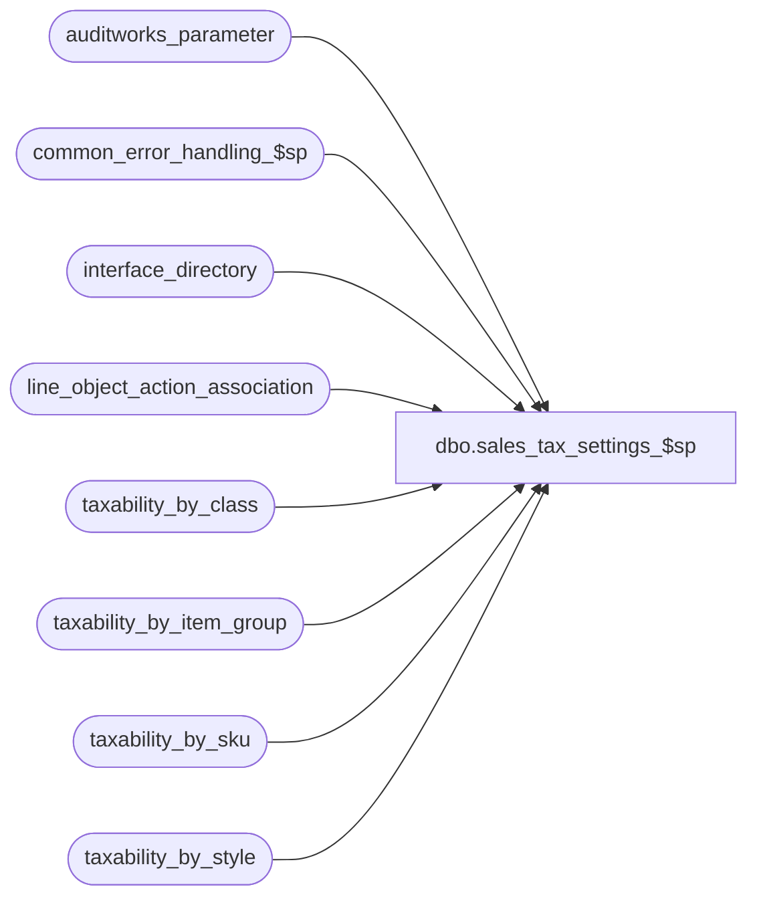

# dbo.sales_tax_settings_$sp

**Database:** auditworks  
**Server:** bedrockdb01  

## Architecture Diagram



## Table Dependencies

| Referenced Table |
|---|
| auditworks_parameter |
| common_error_handling_$sp |
| interface_directory |
| line_object_action_association |
| taxability_by_class |
| taxability_by_item_group |
| taxability_by_sku |
| taxability_by_style |

## Stored Procedure Code

```sql
create proc dbo.sales_tax_settings_$sp 

( @process_id                   binary(16),
  @user_id                      int,
  @applicability_method         tinyint OUTPUT,
  @update_timing                smallint OUTPUT,
  @class_exception_flag         tinyint OUTPUT,
  @sku_exception_flag           tinyint OUTPUT,
  @style_exception_flag         tinyint OUTPUT,
  @item_group_exception_flag    tinyint OUTPUT,
  @lookup_segment_flag          tinyint OUTPUT,
  @include_expense              tinyint OUTPUT,
  @include_pickup               tinyint OUTPUT,
  @unapplied_discounts_exist    tinyint OUTPUT,
  @tax_rounding_method          tinyint OUTPUT,
  @log_tax_detail               tinyint OUTPUT,
  @errmsg                       nvarchar(255) OUTPUT,
  @function_no                  smallint = 22 -- default to sales_tax_main_$sp from dayend
)
AS

/*
PROC NAME: sales_tax_settings_$sp
     DESC: Retrieve sales tax options.
           Called by sales_tax_main_$sp, sales_tax_rebuild_$sp, pre_audit_tax_$sp,
           edit_pre_audit_tax_$sp
HISTORY:
Date     Name           Def#  Desc
Jan05,11 Paul         105313  Use unicode datatypes
Sep09,05 Paul        DV-1312  Update history block
Sep15,04 IanK        DV-1146  Use user_id
Sep02,04 David       DV-1129  apply 29561 to SA5
Arp28,03 Maryam      DV-1071  Receive @process_id and pass it to common_error_handling_$sp.
Jul15,04 Vicci         29561  Handle line_object_type 23 (PLU subtotal discounts)
Apr25,02 Phu         1-C9P5S  Pre Audit tax

*/

DECLARE
  @errno                        int,
  @message_id                   int,
  @object_name                  nvarchar(255),
  @operation_name               nvarchar(100),
  @process_name                 nvarchar(100),
  @rows                         int

SELECT @message_id = 201068,
       @process_name = 'sales_tax_settings_$sp',
       @include_expense = 0,
       @include_pickup = 0,
       @tax_rounding_method = 1,
       @log_tax_detail = 0,
       @lookup_segment_flag = 0,
       @class_exception_flag = 0,
       @style_exception_flag = 0,
       @sku_exception_flag = 0,
       @item_group_exception_flag = 0,
       @unapplied_discounts_exist = 0

SELECT @update_timing = update_timing,
       @applicability_method = applicability_method
FROM interface_directory
WHERE interface_id = 12 

SELECT @errno = @@error
IF @errno <> 0
BEGIN
  SELECT @errmsg = 'Unable to select from interface_directory.',
         @object_name = 'interface_directory',
         @operation_name = 'SELECT'
  GOTO error
END

SELECT @include_expense = 1 - SIGN(ABS(@applicability_method - 6) * ABS(@applicability_method - 7)),
       @include_pickup = 1 - SIGN(ABS(@applicability_method - 7) * ABS(@applicability_method - 9)),
       @update_timing = ISNULL(@update_timing, 0)

IF @update_timing NOT IN (0,3,6)
  SELECT @update_timing = 3

/* Tax will be rounded to nearest penny by transaction in method 1 which is the default setup,
   and will be rounded to nearest penny by line in method 2. */

SELECT @tax_rounding_method = CONVERT(tinyint, par_value)
FROM auditworks_parameter
WHERE par_name = 'tax_rounding_method'

SELECT @errno = @@error
IF @errno <> 0
BEGIN
  SELECT @errmsg = 'Unable to select from auditworks_parameter.',
         @object_name = 'auditworks_parameter',
         @operation_name = 'SELECT'
  GOTO error
END

SELECT @tax_rounding_method = ISNULL(@tax_rounding_method, 1)

/* Tax details will be logged if Tax striping or G/L accounts by taxability
   are used regardless of parameter setting.*/

SELECT @log_tax_detail = CONVERT(tinyint, ISNULL(par_value, '0'))
FROM auditworks_parameter
WHERE par_name = 'log_tax_detail'

SELECT @errno = @@error
IF @errno <> 0
BEGIN
  SELECT @errmsg = 'Unable to select log_tax_detail from auditworks_parameter.',
         @object_name = 'auditworks_parameter',
         @operation_name = 'SELECT'
  GOTO error
END

IF @update_timing = 6
  SELECT @log_tax_detail = 1 -- force log_tax_detail to true if it's pre audit tax

/* If there is any G/L accounts by taxability then create a tax detail record. */
IF EXISTS (SELECT 1
             FROM line_object_action_association
    WHERE lookup_segment1 = 12
               OR lookup_segment2 = 12
               OR lookup_segment3 = 12
               OR lookup_segment4 = 12
               OR lookup_segment5 = 12
       OR lookup_segment6 = 12
               OR lookup_segment7 = 12
               OR lookup_segment8 = 12)
        SELECT @lookup_segment_flag = 1

SELECT @errno = @@error
IF @errno <> 0
BEGIN
  SELECT @errmsg = 'Unable to select from line_object_action_association (1).',
         @object_name = 'line_object_action_association',
         @operation_name = 'SELECT'
  GOTO error
END

IF EXISTS (SELECT class_code FROM taxability_by_class)
  SELECT @class_exception_flag = 1

IF EXISTS (SELECT style_reference_id FROM taxability_by_style)
  SELECT @style_exception_flag = 1

IF EXISTS (SELECT sku_id FROM taxability_by_sku)
  SELECT @sku_exception_flag = 1

IF EXISTS (SELECT tax_item_group_id FROM taxability_by_item_group)
  SELECT @item_group_exception_flag = 1
	
/* If any discounts exist which are not applied to merchandise, tax posting will have to
   recalculate the discount amounts rather than using the pos_discount_amount
   from transaction_line. */

IF EXISTS (SELECT 1
             FROM line_object_action_association
            WHERE line_object_type IN (16,17,18,19,22,23)
              AND db_cr_none != 0)
  SELECT @unapplied_discounts_exist = 1

SELECT @errno = @@error
IF @errno <> 0
BEGIN
  SELECT @errmsg = 'Unable to select from line_object_action_association (2).',
         @object_name = 'line_object_action_association',
         @operation_name = 'SELECT'
  GOTO error
END


RETURN


error:
        EXEC common_error_handling_$sp @function_no, @errno, @errmsg, 0, @message_id, 
        @process_name, @object_name, @operation_name, 0, 1, 0, null, 0, null, null, 
	null, null, null, null, 0, @process_id, @user_id
        RETURN
```

