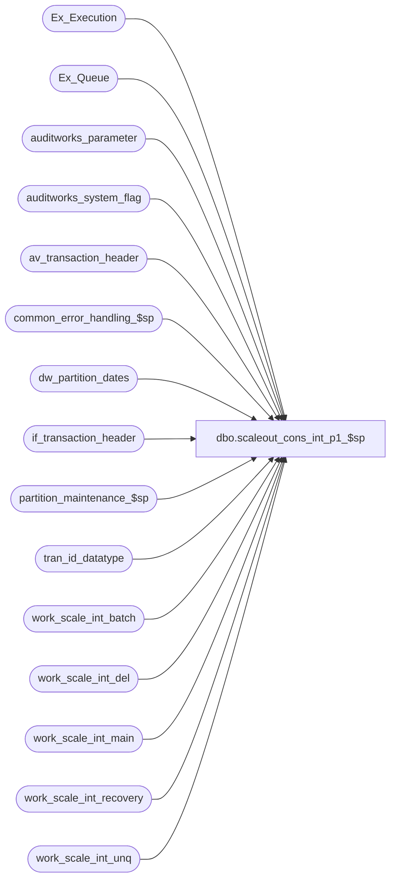

# dbo.scaleout_cons_int_p1_$sp

**Database:** auditworks  
**Server:** bedrockdb01  

## Architecture Diagram



## Table Dependencies

| Referenced Table |
|---|
| Ex_Execution |
| Ex_Queue |
| auditworks_parameter |
| auditworks_system_flag |
| av_transaction_header |
| common_error_handling_$sp |
| dw_partition_dates |
| if_transaction_header |
| partition_maintenance_$sp |
| tran_id_datatype |
| work_scale_int_batch |
| work_scale_int_del |
| work_scale_int_main |
| work_scale_int_recovery |
| work_scale_int_unq |

## Stored Procedure Code

```sql
create proc dbo.scaleout_cons_int_p1_$sp  @i_process_timestamp int OUTPUT
,@i_min_serial_no numeric(14,0) OUTPUT
,@i_max_serial_no numeric(14,0) OUTPUT
,@i_execution_id  integer	OUTPUT
,@corrections_flag smallint OUTPUT
,@status_flag      numeric(16,4) OUTPUT
,@first_date       smalldatetime OUTPUT
,@last_date        smalldatetime OUTPUT
,@first_tran_id    tran_id_datatype OUTPUT
,@last_tran_id     tran_id_datatype OUTPUT


AS 
/*********************************************************************************
Proc name:	scaleout_cons_int_p1_$sp

Description:	Posts transactions in Consolidated Sales Audit db.
		Stored proc runs in Consolidated Sales Audit db.
		Interface transactions are inserted in batches.
		Proc, if aborted, will restart from where it left off 
		
		The following params can be customized.
		Param		Default		Comment
		@instance_id 	1		source instance num representing a store group
		@time_delay	00:00:01	wait cycle between batches

Script with:
  SET ANSI_NULLS ON
  SET ANSI_WARNINGS ON

To monitor the process:
		Value of status_code in table Ex_Execution

To stop the process:
		UPDATE Ex_Execution set verified = getdate() 
		WHERE status_code <> 0
		AND queue_id = @queue_id

HISTORY:
Date     Name           Def# Desc
Jul19,11 Paul         115308 improve error recovery and performance
Apr06,10 Vicci        116601 Port table changes made in Oracle to correct bug introducted in defect 115308 
			     with moving a transaction from one date to another for sake of consistence even
			     though defect 115308 not done for MSSQL yet.  
			     Set object_id to negative for cleanup purposes.
Dec09,09 Paul         114682 return code zero when no work to do 
Jan29,09 Paul         107623 call partitioning logic before posting, improved error handling, added nolock hints
Jun17,05 Sab	     DV-1282 Removed begin tran and handles error recovery cases
Jun03,05 Sab	     DV-1254 Changed output parameters to be @i_
Mar17,05 Sab/Paul    DV-1218 Posts transactions in Consolidated Sales Audit db.

**********************************************************************************/

DECLARE
@batch_size 		integer,
@batch_upper_limit	integer,
@continue_search		tinyint,
@cursor_open		tinyint,
@errmsg			varchar(255),
@errno			integer,
@max_serial_in_table	numeric(14,0),
@object_id		integer,
@object_name		varchar(255),
@operation_name		varchar(100),
@partitioning_in_use	smallint,
@process_name		varchar(100),
@process_no 		smallint,
@queue_id		integer,
@recovery_flag		tinyint,
@ret_flag		int,
@rows			int,
@rowcount		int,
@rows_found		int,
@scaleout_flag		int,
@serial_no		numeric(14,0),
@start_datetime		datetime,
@status			tinyint,
@trace_msg		varchar(255),
@tran_date		smalldatetime

SET NOCOUNT ON

SELECT @status = 0		-- transaction state
	,@serial_no = 0	-- current serial no
	,@i_min_serial_no = 0	-- min serial no
	,@i_max_serial_no = 0	-- max serial no
	,@recovery_flag = 0
	,@status = 0		-- current status code
	,@i_execution_id = DATEDIFF(mi, '1/1/2004', getdate()) 	-- execution id set to # minutes since 01jan04
	,@object_name = ' '
	,@operation_name = 'post'
	,@process_no = 28
	,@process_name = 'scaleout_cons_int_p1_$sp'
	,@start_datetime = getdate()
	,@errno = 0

/* Determine status of previous run of this posting job */

SELECT @status_flag = flag_numeric_value
  FROM auditworks_system_flag
 WHERE flag_name = 'scaleout_cons_posting_status';
SELECT @errno = @@error
IF @errno != 0
  BEGIN
    SELECT @errmsg = 'Failed to set status_flag',
           @object_name = 'auditworks_system_flag',
          @operation_name = 'SELECT'
    GOTO error
  END

IF @status_flag IS NULL
BEGIN
  SELECT @status_flag = 0
  INSERT INTO auditworks_system_flag (flag_name, flag_numeric_value, flag_numeric_initialize_value)
  VALUES ('scaleout_cons_posting_status', 0, 0)
END

IF @status_flag != 0 -- recovering from error
 SELECT @recovery_flag = 1

/* If ABS(@status_flag) >= 10 then try to rollforward the previous batch */

IF ABS(@status_flag) >= 10 
BEGIN
	SELECT @corrections_flag = 0
	IF EXISTS( SELECT 1
		    FROM work_scale_int_main
		   WHERE action_code IN (20,30)) 
	  SELECT @corrections_flag = 1

	-- set variables used to improve performance of delete queries
	SELECT @first_tran_id = MIN(transaction_id)
	  FROM work_scale_int_main

	SELECT @last_tran_id = MAX(transaction_id)
	  FROM work_scale_int_main

	SELECT @first_date = MIN(transaction_date)
	  FROM work_scale_int_main

	SELECT @last_date = MAX(transaction_date)
	  FROM work_scale_int_main

	SELECT @i_process_timestamp = process_timestamp,
		@i_min_serial_no = min_serial_no,
		@i_max_serial_no = max_serial_no,
		@i_execution_id = execution_id
	  FROM work_scale_int_recovery

	SELECT @errno = @@error, @rows = @@rowcount
	IF @errno != 0 OR @rows = 0
	  BEGIN
	    SELECT @errmsg = 'Failed to select from work_scale_int_recovery',
	           @object_name = 'work_scale_int_recovery',
	          @operation_name = 'SELECT'
	    GOTO error
	  END

	-- set status_flag negative to fire deletes in the other procs
	SELECT @status_flag = -1 * ABS(@status_flag)

	RETURN 1

  END -- If ABS(@status_flag) >= 10


SELECT @batch_size = par_value
  FROM auditworks_parameter
 WHERE par_name = 'scaleout_batch_size'

SELECT @rows = @@rowcount, @errno = @@error
IF @errno != 0 OR @rows = 0
  BEGIN
    SELECT @errmsg = 'Failed to select scaleout_batch_size',
           @object_name = 'auditworks_parameter',
          @operation_name = 'SELECT'
    GOTO error
  END

SELECT @queue_id = par_value
  FROM auditworks_parameter
 WHERE par_name = 'scaleout_interface_id'
SELECT @rows = @@rowcount, @errno = @@error, @object_id = @queue_id * -1
IF @errno != 0 OR @rows = 0
BEGIN
  SELECT @errmsg = 'Failed to select scaleout_interface_id',
         @object_name = 'auditworks_parameter',
         @operation_name = 'SELECT'
  GOTO error
END

SELECT @serial_no = Isnull(MAX(to_serial_no),0)
FROM Ex_Execution WITH (NOLOCK)
WHERE queue_id = @queue_id

SELECT @errno = @@error
IF @errno != 0
  BEGIN
    SELECT @errmsg = 'Failed to select to_serial_no',
           @object_name = 'Ex_Execution',
          @operation_name = 'SELECT'
    GOTO error
  END

IF @serial_no > 0 /* check for last status in Ex_Execution */
BEGIN
  SELECT @status = status_code
    FROM Ex_Execution WITH (NOLOCK)
   WHERE queue_id = @queue_id
     AND to_serial_no = @serial_no

  SELECT @errno = @@error
  IF @errno != 0
    BEGIN
     SELECT @errmsg = 'Failed to select status_code',
           @object_name = 'Ex_Execution',
          @operation_name = 'SELECT'
     GOTO error
    END

  SELECT @status = ISNULL(@status,0)
END

TRUNCATE TABLE work_scale_int_batch
SELECT @errno = @@error
IF @errno != 0
  BEGIN
    SELECT @errmsg = 'Failed to truncate work_scale_int_batch',
           @object_name = 'work_scale_int_batch',
          @operation_name = 'TRUNCATE'
    GOTO error
  END

IF @status > 0	/* last batch did not complete */
BEGIN
  SELECT @i_min_serial_no = from_serial_no,
	 @i_max_serial_no = to_serial_no,
	 @i_execution_id = execution_id
    FROM Ex_Execution WITH (NOLOCK)
   WHERE queue_id = @queue_id
     AND to_serial_no = @serial_no

  SELECT @errno = @@error
  IF @errno != 0
    BEGIN
     SELECT @errmsg = 'Failed to select from_serial_no',
           @object_name = 'Ex_Execution',
          @operation_name = 'SELECT'
     GOTO error
    END

  INSERT INTO work_scale_int_batch(serial_no, if_entry_no,action_code,transaction_id)
  SELECT serial_no, key_1, key_2,transaction_id
    FROM Ex_Queue a WITH (NOLOCK), if_transaction_header b WITH (NOLOCK)
   WHERE queue_id = @queue_id
     AND serial_no BETWEEN @i_min_serial_no AND @i_max_serial_no
     AND a.key_1 = b.if_entry_no
  SELECT @errno = @@error, @rowcount = @@rowcount
  IF @errno != 0
  BEGIN
    SELECT @errmsg = 'Failed to recover work_scale_int_batch',
           @object_name = 'work_scale_int_batch',
           @operation_name = 'INSERT'
    GOTO error
  END

  IF @rowcount = 0
    RETURN 0

END

SELECT @i_process_timestamp =  
		DATEPART ( hh, @start_datetime ) * 10000000.0
		+ DATEPART ( mi, @start_datetime ) * 100000.0
		+ DATEPART ( ss, @start_datetime ) * 1000.0
		+ DATEPART ( ms, @start_datetime )

IF @status = 0 
BEGIN /* last batch completed normally, get next set of transactions */
  SELECT @serial_no = ISNULL(@serial_no,0) + 1

  SET ROWCOUNT @batch_size

  INSERT INTO work_scale_int_batch(serial_no, if_entry_no, action_code)
  SELECT a.serial_no, a.key_1, a.key_2
    FROM Ex_Queue a WITH (NOLOCK)
   WHERE a.queue_id = @queue_id
     AND a.serial_no >= @serial_no
   ORDER BY serial_no

  SELECT @errno = @@error, @rowcount = @@rowcount
  IF @errno != 0
    BEGIN
     SELECT @errmsg = 'Failed to insert work_scale_int_batch',
           @object_name = 'work_scale_int_batch',
          @operation_name = 'INSERT'
     GOTO error
    END

  SET ROWCOUNT 0

  IF @rowcount = 0
    RETURN 0

  UPDATE work_scale_int_batch
     SET transaction_id = b.transaction_id,
	transaction_date = b.transaction_date
    FROM work_scale_int_batch a, if_transaction_header b WITH (NOLOCK)
   WHERE a.if_entry_no = b.if_entry_no

  SELECT @errno = @@error
  IF @errno != 0
    BEGIN
     SELECT @errmsg = 'Failed to retrieve transaction_id',
           @object_name = 'work_scale_int_batch',
          @operation_name = 'UPDATE'
     GOTO error
    END

  SELECT @i_max_serial_no = MAX(serial_no)
    FROM work_scale_int_batch WITH (NOLOCK)

  SELECT @errno = @@error
  IF @errno != 0
    BEGIN
     SELECT @errmsg = 'Failed to select i_max_serial_no',
           @object_name = 'work_scale_int_batch',
          @operation_name = 'SELECT'
     GOTO error
    END
	
  SELECT @i_min_serial_no = MIN(serial_no)
    FROM work_scale_int_batch WITH (NOLOCK)

  SELECT @errno = @@error
  IF @errno != 0
    BEGIN
     SELECT @errmsg = 'Failed to select i_min_serial_no',
           @object_name = 'work_scale_int_batch',
          @operation_name = 'SELECT'
     GOTO error
    END
	
  SELECT @status = 5

  INSERT INTO Ex_Execution (queue_id,object_id,execution_id,from_serial_no,to_serial_no,status_code,verified)
  VALUES (@queue_id, @object_id, @i_execution_id, @i_min_serial_no, @i_max_serial_no, @status, null)

  SELECT @errno = @@error
  IF @errno != 0
    BEGIN
     SELECT @errmsg = 'Failed to insert Ex_Execution',
           @object_name = 'Ex_Execution',
          @operation_name = 'INSERT'
     GOTO error
   END

END

SELECT @trace_msg = CHAR(13) + CHAR(10) + ':LOG && scaleout_cons_int_p1_$sp starts: ' + CONVERT(char, @start_datetime, 8)
PRINT @trace_msg

-- determine whether partitioning is turned on
SELECT @partitioning_in_use = flag_numeric_value
FROM auditworks_system_flag WITH (NOLOCK)
WHERE flag_name = 'partitioning_in_use'

SELECT @errno = @@error
IF @errno != 0
BEGIN
  SELECT @errmsg = 'Unable to retrieve partitioning_in_use',
         @object_name = 'auditworks_system_flag',
         @operation_name = 'SELECT'
   GOTO error
END

SELECT @scaleout_flag = CONVERT(int,flag_numeric_value)
  FROM auditworks_system_flag WITH (NOLOCK)
 WHERE flag_name = 'scaleout_flag'

SELECT @rows = @@rowcount, @errno = @@error
IF @errno != 0 OR @rows = 0
  BEGIN
    SELECT @errmsg = 'Failed to select scaleout_flag',
           @object_name = 'auditworks_system_flag',
          @operation_name = 'SELECT'
    GOTO error
  END

IF @partitioning_in_use = 1 AND @scaleout_flag = 2 -- only run on consolidated server
BEGIN
  DECLARE date_crsr CURSOR FAST_FORWARD
  FOR
  SELECT DISTINCT transaction_date
    FROM work_scale_int_batch WITH (NOLOCK)
  ORDER BY transaction_date

  OPEN date_crsr
  SELECT @errno = @@error
  IF @errno != 0
  BEGIN
	SELECT @errmsg = 'Failed to open date_crsr',
		@object_name = 'date_crsr',
		@operation_name = 'OPEN'
	GOTO error
  END

  SELECT @cursor_open = 1

  WHILE 1=1
  BEGIN
  FETCH date_crsr INTO
	@tran_date

  IF @@fetch_status <> 0
    BREAK
	-- insert any newly encountered dates
  IF NOT EXISTS(SELECT 1 FROM dw_partition_dates WITH (NOLOCK)
		WHERE transaction_date = @tran_date)
	BEGIN
	  INSERT INTO dw_partition_dates (transaction_date, partition_exists)
	  VALUES (@tran_date, 0)	

	  SELECT @errno = @@error
	  IF @errno != 0
	  BEGIN
	    SELECT @errmsg = 'Failed to insert dw_partition_dates',
		@object_name = 'dw_partition_dates',
		@operation_name = 'INSERT'
	    GOTO error
	  END
	END

  END -- WHILE 1=1

  CLOSE date_crsr
  DEALLOCATE date_crsr

  SELECT @cursor_open = 0

  IF EXISTS (SELECT 1 FROM dw_partition_dates WITH (NOLOCK)
		WHERE partition_exists = 0)
  BEGIN
    -- allocate any new partitions that will be needed
    EXEC partition_maintenance_$sp

    SELECT @errno = @@error
    IF @errno != 0
    BEGIN
	SELECT @errmsg = 'Unable to execute stored procedure partition_maintenance_$sp',
		@object_name = 'partition_maintenance_$sp',
		@operation_name = 'EXECUTE'
	GOTO error
    END

  END -- exists
END -- If @partitioning_in_use = 1


TRUNCATE TABLE work_scale_int_unq
SELECT @errno = @@error
IF @errno != 0
  BEGIN
    SELECT @errmsg = 'Failed to truncate work_scale_int_unq',
           @object_name = 'work_scale_int_unq',
          @operation_name = 'TRUNCATE'
    GOTO error
  END

TRUNCATE TABLE work_scale_int_main
SELECT @errno = @@error
IF @errno != 0
  BEGIN
    SELECT @errmsg = 'Failed to truncate work_scale_int_main',
           @object_name = 'work_scale_int_main',
          @operation_name = 'TRUNCATE'
    GOTO error
  END

/** get unique transaction ids */
INSERT INTO work_scale_int_unq(if_entry_no,transaction_id,
			       min_transaction_date, max_transaction_date)
SELECT MAX(if_entry_no), transaction_id,
       min(transaction_date), max(transaction_date)  --since a transaction_id can be moved from one date to another and we want to use date in later delete because of partitionning
  FROM work_scale_int_batch WITH (NOLOCK)
 GROUP by transaction_id
SELECT @errno = @@error
IF @errno != 0
BEGIN
  SELECT @errmsg = 'Failed to insert work_scale_int_unq',
	 @object_name = 'work_scale_int_unq',
	 @operation_name = 'INSERT'
  GOTO error
END

/* get rows with unique transaction ids */
INSERT INTO work_scale_int_main(serial_no,if_entry_no,action_code,transaction_id,
			        min_transaction_date, max_transaction_date, transaction_date)
SELECT a.serial_no, a.if_entry_no, a.action_code, a.transaction_id,
       b.min_transaction_date, b.max_transaction_date, a.transaction_date
  FROM work_scale_int_batch a WITH (NOLOCK), work_scale_int_unq b WITH (NOLOCK)
 WHERE a.if_entry_no = b.if_entry_no /* take latest row only */

SELECT @errno = @@error
IF @errno != 0
  BEGIN
	SELECT @errmsg = 'Failed to insert work_scale_int_main',
		@object_name = 'work_scale_int_main',
		@operation_name = 'INSERT'
	GOTO error
  END

UPDATE work_scale_int_recovery
  SET process_timestamp = @i_process_timestamp,
	min_serial_no = @i_min_serial_no,
	max_serial_no = @i_max_serial_no,
	execution_id = @i_execution_id

SELECT @errno = @@error, @rows = @@rowcount
IF @errno != 0
  BEGIN
	SELECT @errmsg = 'Failed to update work_scale_int_recovery',
		@object_name = 'work_scale_int_recovery',
		@operation_name = 'UPDATE'
	GOTO error
  END

IF @rows = 0
BEGIN
  INSERT INTO work_scale_int_recovery (process_timestamp, min_serial_no, max_serial_no, execution_id)
  VALUES (@i_process_timestamp, @i_min_serial_no, @i_max_serial_no, @i_execution_id)
  SELECT @errno = @@error
  IF @errno != 0
    BEGIN
	SELECT @errmsg = 'Failed to insert work_scale_int_recovery',
		@object_name = 'work_scale_int_recovery',
		@operation_name = 'INSERT'
	GOTO error
    END
END -- If @rows = 0


SELECT @corrections_flag = 0
IF EXISTS( SELECT 1
	    FROM work_scale_int_main
	   WHERE action_code IN (20,30)) 
  SELECT @corrections_flag = 1

SELECT @ret_flag = 1

/* If needed, then populate a smaller work table to improve the performance of deletes for corrections */

IF @corrections_flag = 1 OR @recovery_flag != 0
  BEGIN
	INSERT INTO work_scale_int_del (transaction_id, transaction_date, min_transaction_date, max_transaction_date)
	SELECT DISTINCT transaction_id, transaction_date, min_transaction_date, max_transaction_date
	  FROM work_scale_int_main
	 WHERE (@recovery_flag != 0 -- all txns
		    OR (@corrections_flag = 1 AND action_code IN (20, 30)))
		AND transaction_id IS NOT NULL -- safety check
	SELECT @errno = @@error
	IF @errno != 0
	    BEGIN
		SELECT @errmsg = 'Failed to populate work_scale_int_del',
			@object_name = 'work_scale_int_del',
			@operation_name = 'INSERT'
		GOTO error
	    END

	  -- set variables used to improve performance of delete queries
		  SELECT @first_tran_id = MIN(transaction_id)
		  FROM work_scale_int_del

		  SELECT @last_tran_id = MAX(transaction_id)
		  FROM work_scale_int_del

		  SELECT @first_date = MIN(min_transaction_date)
		  FROM work_scale_int_del

		  SELECT @last_date = MAX(max_transaction_date)
		  FROM work_scale_int_del

  END -- If @corrections_flag = 1 OR @recovery_flag != 0


/* insert transaction header */
IF ABS(@status) <= 5
 BEGIN
		   /* delete when reversals exist or when error recovery in order to prevent duplicate key insert */
		IF @corrections_flag = 1 OR @recovery_flag != 0
		  BEGIN
		        UPDATE work_scale_int_del
		           SET transaction_date = h.transaction_date
			  FROM work_scale_int_del w, av_transaction_header h
                         WHERE w.min_transaction_date <> w.max_transaction_date  --move transaction from one date to another
                           AND h.av_transaction_id = w.transaction_id
			   AND h.transaction_date >= @first_date
			   AND h.transaction_date <= @last_date  
			SELECT @errno = @@error
			IF @errno != 0
			   BEGIN
				SELECT @errmsg = 'Failed to correct transaction_date to be that found in av_transaction_header',
					@object_name = 'work_scale_int_del',
					@operation_name = 'UPDATE'
				GOTO error
			   END

			DELETE FROM av_transaction_header
			  FROM av_transaction_header a, work_scale_int_del b WITH (NOLOCK)
		         WHERE a.av_transaction_id = b.transaction_id
			  AND a.av_transaction_id >= @first_tran_id
			  AND a.av_transaction_id <= @last_tran_id
			  AND a.transaction_date >= @first_date
			  AND a.transaction_date <= @last_date

			SELECT @errno = @@error
			IF @errno != 0
			   BEGIN
				SELECT @errmsg = 'Failed to clean up av_transaction_header',
					@object_name = 'av_transaction_header',
					@operation_name = 'DELETE'
				GOTO error
			   END
		  END -- If @corrections_flag = 1 OR @recovery_flag != 0


   /* process action code 10,30 */
   INSERT INTO av_transaction_header(av_transaction_id,store_no,register_no,transaction_date,
		date_reject_id,transaction_series,transaction_no,entry_date_time,cashier_no,transaction_category,
		tender_total,transaction_void_flag,customer_info_exists,exception_flag,sa_rejection_flag,
		if_rejection_flag,deposit_declaration_flag,closeout_flag,media_count_flag,customer_modified_flag,
		tax_override_flag,pos_tax_jurisdiction,edit_progress_flag,edit_timestamp,employee_no,
		transaction_remark,copy_transaction_id,last_modified_date_time,in_use_timestamp,
		updated_by_user_id,till_no)
   SELECT a.transaction_id,store_no,register_no, a.transaction_date,
		date_reject_id,	transaction_series,transaction_no, entry_date_time,cashier_no,transaction_category,
		tender_total,transaction_void_flag,customer_info_exists,exception_flag,0,
		0,deposit_declaration_flag,closeout_flag,media_count_flag,customer_modified_flag,
		tax_override_flag,pos_tax_jurisdiction,0,edit_timestamp,employee_no,
		transaction_remark,0,last_modified_date_time,in_use_timestamp,
		updated_by_user_id,till_no
     FROM work_scale_int_main b WITH (NOLOCK), if_transaction_header a WITH (NOLOCK)
    WHERE b.if_entry_no = a.if_entry_no
      AND b.action_code IN (10,30)

   /* should never get a dup error here due to mssql locking */
   SELECT @errno = @@error
   IF @errno != 0
   BEGIN
	SELECT @errmsg = 'Failed to insert av_transaction_header',
		@object_name = 'av_transaction_header',
		@operation_name = 'INSERT'
	GOTO error
   END

   SELECT @status = 10 -- successful
 END -- If ABS(@status) <= 5

 /* If error recovery, then set status_flag negative to fire deletes in the other procs */
	
  IF @recovery_flag != 0
	SELECT @status_flag = -1 * ABS(@status_flag)

  /* update status for error recovery purposes */
  UPDATE auditworks_system_flag
    SET flag_numeric_value = @status_flag 
   WHERE flag_name = 'scaleout_cons_posting_status'

   SELECT @errno = @@error
   IF @errno != 0
   BEGIN
	SELECT @errmsg = 'Failed to to set i_status_flag',
		@object_name = 'work_scale_int_main',
		@operation_name = 'UPDATE'
	GOTO error
   END

SELECT @trace_msg = CHAR(13) + CHAR(10) + ':LOG && scaleout_cons_int_p1_$sp ends: ' + CONVERT(char, getdate(), 8)
PRINT @trace_msg

RETURN @ret_flag

error:

	SET ROWCOUNT 0

	IF @cursor_open = 1
	 BEGIN
	   CLOSE date_crsr
	   DEALLOCATE date_crsr
	 END

	EXEC common_error_handling_$sp @process_no, @errno, @errmsg, 0, 201068, 
	@process_name, @object_name, @operation_name, 1, 1, 
	0, 0, 0
	RETURN -100
```

