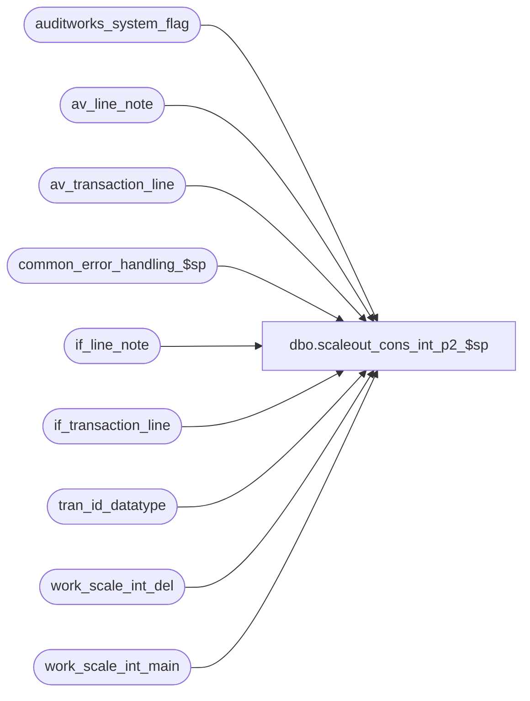

# dbo.scaleout_cons_int_p2_$sp

**Database:** auditworks  
**Server:** bedrockdb01  

## Architecture Diagram



## Table Dependencies

| Referenced Table |
|---|
| auditworks_system_flag |
| av_line_note |
| av_transaction_line |
| common_error_handling_$sp |
| if_line_note |
| if_transaction_line |
| tran_id_datatype |
| work_scale_int_del |
| work_scale_int_main |

## Stored Procedure Code

```sql
create proc dbo.scaleout_cons_int_p2_$sp  @corrections_flag smallint
,@status_flag      numeric(16,4) OUTPUT
,@first_date       smalldatetime
,@last_date        smalldatetime
,@first_tran_id    tran_id_datatype
,@last_tran_id     tran_id_datatype

AS 

/*********************************************************************************
Proc name:	scaleout_cons_int_p2_$sp

Description:	Posts transaction lines in Consolidated Sales Audit db.
		Stored proc runs in Consolidated Sales Audit db.
		Interface transactions are inserted in batches.
		Populates transaction_date column in the av* tables which is needed to support partitioning of archive tables.
		SA5.0 Scaleout and SA5.1 (all configurations) require that the av* tables contain transaction_date.
		Proc, if aborted, will restart from where it left off.
		Called from susm.

To monitor the process:
		Value of status_code in table Ex_Execution

To stop the process:
		UPDATE Ex_Execution set verified = getdate() 
		WHERE status_code <> 0
		AND queue_id = @queue_id
HISTORY:
Date     Name           Def# Desc
Jul09,13 Vicci        139695 Add unit_of_measure logging.
Sep12,11 Paul         115308 improve error recovery, populate transaction_date in av tables (will exist if using SA5.0 scaleout or SA5.1)
Dec09,09 Paul         114682 improved error handling
Jun17,05 Sab	     DV-1282 Removed begin tran and handles error recovery cases
Mar17,05 Sab/Paul    DV-1218 Posts transactions in Consolidated Sales Audit db.

**********************************************************************************/

DECLARE
@errmsg			nvarchar(255),
@errno			integer,
@object_name		nvarchar(255),
@operation_name		nvarchar(100),
@process_name		nvarchar(100),
@process_no 		smallint,
@trace_msg		nvarchar(255)

/* set variables for exported transactions. */
SET NOCOUNT ON

SELECT @object_name = ' ',
	@operation_name = 'post',
	@process_no = 28,
	@process_name = 'scaleout_cons_int_p2_$sp'

IF ABS(@status_flag) < 110 -- THEN
BEGIN
	  /* insert av tran line */
	IF @corrections_flag > 0 OR @status_flag < 0 -- THEN
	BEGIN
		DELETE FROM av_transaction_line
		  FROM work_scale_int_del b WITH (NOLOCK), av_transaction_line a
		 WHERE a.av_transaction_id = b.transaction_id
		   AND a.transaction_date = b.transaction_date
		   AND a.av_transaction_id >= @first_tran_id
		   AND a.av_transaction_id <= @last_tran_id
		   AND a.transaction_date >= @first_date
		   AND a.transaction_date <= @last_date

		SELECT @errno = @@error
		IF @errno != 0
		   BEGIN
			SELECT @errmsg = 'Failed to clean up av_transaction_line',
				@object_name = 'av_transaction_line',
				@operation_name = 'DELETE'
			GOTO error
		   END
	END -- @corrections_flag > 0

	INSERT INTO av_transaction_line(av_transaction_id,line_id,line_sequence,line_object_type,
		line_object,line_action,gross_line_amount,pos_discount_amount,
		db_cr_none,attachment_qty,exception_flag,interface_rejection_flag,line_void_flag,
		voiding_reversal_flag,edit_timestamp,reference_type,reference_no, unit_of_measure, transaction_date)
	 SELECT b.transaction_id,line_id,line_sequence,line_object_type,
		line_object,line_action,gross_line_amount,pos_discount_amount,
		db_cr_none,attachment_qty,exception_flag,interface_rejection_flag,line_void_flag,
		voiding_reversal_flag,edit_timestamp,reference_type,reference_no, a.unit_of_measure, b.transaction_date
	   FROM work_scale_int_main b WITH (NOLOCK), if_transaction_line a WITH (NOLOCK)
	  WHERE b.if_entry_no = a.if_entry_no
	    AND b.action_code IN (10,30)

	SELECT @errno = @@error
	IF @errno != 0
	   BEGIN
		SELECT @errmsg = 'Failed to insert av_transaction_line',
			@object_name = 'av_transaction_line',
			@operation_name = 'INSERT'
		GOTO error
	   END

	SELECT @status_flag = 110

	/* update status for error recovery purposes */
	UPDATE auditworks_system_flag 
	 SET flag_numeric_value = @status_flag
	WHERE flag_name = 'scaleout_cons_posting_status'

	SELECT @errno = @@error
	IF @errno != 0
	   BEGIN
		SELECT @errmsg = 'Failed to set scaleout_cons_posting_status',
			@object_name = 'auditworks_system_flag',
			@operation_name = 'UPDATE'
		GOTO error
	   END
END -- If ABS(@status_flag) < 110


IF ABS(@status_flag) < 115 -- THEN
BEGIN
	IF @corrections_flag > 0 OR @status_flag < 0 -- THEN
	BEGIN
		DELETE av_line_note
		  FROM work_scale_int_del b WITH (NOLOCK), av_line_note l
		 WHERE l.av_transaction_id = b.transaction_id
		   AND b.transaction_date = l.transaction_date
		   AND av_transaction_id >= @first_tran_id
		   AND av_transaction_id <= @last_tran_id
		   AND l.transaction_date >= @first_date
		   AND l.transaction_date <= @last_date

		SELECT @errno = @@error
		IF @errno != 0
		  BEGIN
		    SELECT @errmsg = 'Failed to delete av_line_note',
		           @object_name = 'av_line_note',
		          @operation_name = 'DELETE'
		    GOTO error
		  END
	END -- If @corrections_flag > 0 (line_note)

	INSERT INTO av_line_note (av_transaction_id, line_id, note_type, line_note, transaction_date)
	SELECT b.transaction_id, a.line_id, a.note_type, a.line_note, b.transaction_date
	  FROM work_scale_int_main b WITH (NOLOCK), if_line_note a WITH (NOLOCK)
	 WHERE b.if_entry_no = a.if_entry_no
	   AND b.action_code IN (10,30)

	SELECT @errno = @@error
	IF @errno != 0
	  BEGIN
	    SELECT @errmsg = 'Failed to insert av_line_note',
	           @object_name = 'av_line_note',
	          @operation_name = 'INSERT'
	    GOTO error
	  END

	SELECT @status_flag = 115

	/* update status for error recovery purposes */
	UPDATE auditworks_system_flag 
	 SET flag_numeric_value = @status_flag
	WHERE flag_name = 'scaleout_cons_posting_status'

	SELECT @errno = @@error
	IF @errno != 0
	   BEGIN
		SELECT @errmsg = 'Failed to set scaleout_cons_posting_status',
			@object_name = 'auditworks_system_flag',
			@operation_name = 'UPDATE'
		GOTO error
	   END
END -- If ABS(i_status_flag) < 115


SELECT @trace_msg = NCHAR(13) + NCHAR(10) + ':LOG && scaleout_cons_int_p2_$sp ends: ' + CONVERT(nchar, getdate(), 8)
PRINT @trace_msg

RETURN 1

error:

	EXEC common_error_handling_$sp @process_no, @errno, @errmsg, 0, 201068, 
	@process_name, @object_name, @operation_name, 1, 1, 
	0, 0, 0
	RETURN -115
```

