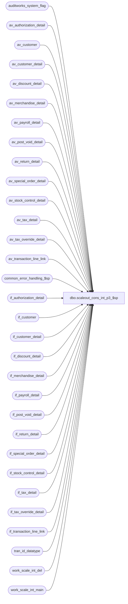

# dbo.scaleout_cons_int_p3_$sp

**Database:** auditworks  
**Server:** bedrockdb01  

## Architecture Diagram



## Table Dependencies

| Referenced Table |
|---|
| auditworks_system_flag |
| av_authorization_detail |
| av_customer |
| av_customer_detail |
| av_discount_detail |
| av_merchandise_detail |
| av_payroll_detail |
| av_post_void_detail |
| av_return_detail |
| av_special_order_detail |
| av_stock_control_detail |
| av_tax_detail |
| av_tax_override_detail |
| av_transaction_line_link |
| common_error_handling_$sp |
| if_authorization_detail |
| if_customer |
| if_customer_detail |
| if_discount_detail |
| if_merchandise_detail |
| if_payroll_detail |
| if_post_void_detail |
| if_return_detail |
| if_special_order_detail |
| if_stock_control_detail |
| if_tax_detail |
| if_tax_override_detail |
| if_transaction_line_link |
| tran_id_datatype |
| work_scale_int_del |
| work_scale_int_main |

## Stored Procedure Code

```sql
CREATE proc  dbo.scaleout_cons_int_p3_$sp  @corrections_flag smallint
,@status_flag      numeric(16,4) OUTPUT
,@first_date       smalldatetime
,@last_date        smalldatetime
,@first_tran_id    tran_id_datatype
,@last_tran_id     tran_id_datatype

AS 

/*********************************************************************************
Proc name:	scaleout_cons_int_p3_$sp

Description:	Posts transaction detail in Consolidated Sales Audit db.
		Stored proc runs in Consolidated Sales Audit db.
		Interface transactions are inserted in batches.
		Populates transaction_date column in the av* tables which is needed to support partitioning of archive tables.
		SA5.0 Scaleout and SA5.1 (all configurations) require that the av* tables contain transaction_date.
		Proc, if aborted, will restart from where it left off.
		Called from susm.
		
To monitor the process:
		Value of status_code in table Ex_Execution

To stop the process:
		UPDATE Ex_Execution set verified = getdate() 
		WHERE status_code <> 0
		AND queue_id = @queue_id
HISTORY:
Date     Name           Def# Desc
Dec07,15 Vicci    TFS-151453 Add missing without_receipt_flag to av_return_detail posting.
Jul04,14 Vicci     TFS-74694 Log cost and other missing merchandise attachment fields (source_store_no, fulfillment_store_no)
Mar06,14 Vicci         61711 Add previously missing tax_detail fields (max_applied_by_line_id, track_tax, tax_item_group_id, fulfillment_store_no, originating_date, above_threshold_flag)
                             as well as new tax_detail.applied_by_line_id.
Sep12,11 Paul         115308 improve error recovery, improve performance, populate transaction_date
Jan29,09 Paul         107623 improved error handling
Jun17,05 Sab	   DV-1282 Removed begin tran and handles error recovery cases
Mar30,05 Maryam      DV-1202 Rename from_line_id to line_id. Insert transaction line link.
Mar17,05 Sab/Paul    DV-1218 Posts transactions in Consolidated Sales Audit db.

**********************************************************************************/
DECLARE
@errmsg			varchar(255),
@errno			integer,
@object_name		varchar(255),
@operation_name		varchar(100),
@process_name		varchar(100),
@process_no 		smallint,
@trace_msg		varchar(255)

SET NOCOUNT ON

SELECT 	@object_name = ' ',
	@operation_name = 'post',
	@process_no = 28,
	@process_name = 'scaleout_cons_int_p3_$sp'


IF ABS(@status_flag) < 140 -- THEN
BEGIN
	  /* insert av tran line */
	IF @corrections_flag > 0 OR @status_flag < 0 -- THEN
	BEGIN
		DELETE FROM av_merchandise_detail
		  FROM work_scale_int_del b WITH (NOLOCK), av_merchandise_detail a
		 WHERE a.av_transaction_id = b.transaction_id
		   AND a.transaction_date = b.transaction_date
		   AND a.av_transaction_id >= @first_tran_id
		   AND a.av_transaction_id <= @last_tran_id
		   AND a.transaction_date >= @first_date
		   AND a.transaction_date <= @last_date

		SELECT @errno = @@error
		IF @errno != 0
		   BEGIN
			SELECT @errmsg = 'Failed to clean up av_merchandise_detail',
				@object_name = 'av_merchandise_detail',
				@operation_name = 'DELETE'
			GOTO error
		   END
	END -- @corrections_flag > 0

	INSERT INTO av_merchandise_detail(av_transaction_id,line_id,merchandise_category,
		upc_lookup_division,upc_no,units,salesperson,salesperson2,sku_id,
		style_reference_id,class_code,subclass_code,price_override,pos_iplu_missing,
		upc_on_file_flag,pos_deptclass,ticket_price,sold_at_price,scanned,pos_identifier,
		pos_identifier_type,plu_price,originating_store_no, transaction_date,
		source_store_no, fulfillment_store_no, 
		cost)
	SELECT b.transaction_id,a.line_id,a.merchandise_category,
		a.upc_lookup_division,a.upc_no,a.units,a.salesperson,a.salesperson2,a.sku_id,
		a.style_reference_id,a.class_code,a.subclass_code,a.price_override,a.pos_iplu_missing,
		a.upc_on_file_flag,a.pos_deptclass,a.ticket_price,a.sold_at_price,a.scanned,a.pos_identifier,
		a.pos_identifier_type,a.plu_price,a.originating_store_no, b.transaction_date,
		a.source_store_no, a.fulfillment_store_no, 
		a.cost
	   FROM work_scale_int_main b WITH (NOLOCK), if_merchandise_detail a WITH (NOLOCK)
	  WHERE b.if_entry_no = a.if_entry_no
	    AND b.action_code IN (10,30)

	SELECT @errno = @@error
	IF @errno != 0
	  BEGIN
	    SELECT @errmsg = 'Failed to insert av_merchandise_detail',
	           @object_name = 'av_merchandise_detail',
	          @operation_name = 'INSERT'
	    GOTO error
	  END

	IF @corrections_flag > 0 OR @status_flag < 0 -- THEN
	BEGIN
		DELETE av_payroll_detail
		  FROM work_scale_int_del b WITH (NOLOCK), av_payroll_detail a
		 WHERE a.av_transaction_id = b.transaction_id
		   AND a.transaction_date = b.transaction_date
		   AND a.av_transaction_id >= @first_tran_id
		   AND a.av_transaction_id <= @last_tran_id
		   AND a.transaction_date >= @first_date
		   AND a.transaction_date <= @last_date

		SELECT @errno = @@error
		IF @errno != 0
		  BEGIN
		    SELECT @errmsg = 'Failed to delete av_payroll_detail',
		           @object_name = 'av_payroll_detail',
		          @operation_name = 'DELETE'
		    GOTO error
		  END
	END -- @corrections_flag > 0

	INSERT INTO av_payroll_detail(av_transaction_id,line_id,employee_no,payroll_date,
		employee_payroll_id,employee_type,payroll_entry_type, transaction_date)
	 SELECT b.transaction_id,line_id,employee_no,payroll_date,
		employee_payroll_id,employee_type,payroll_entry_type, b.transaction_date
	   FROM work_scale_int_main b WITH (NOLOCK), if_payroll_detail a WITH (NOLOCK)
	  WHERE b.if_entry_no = a.if_entry_no
	    AND b.action_code IN (10,30)

	SELECT @errno = @@error
	IF @errno != 0
	  BEGIN
	    SELECT @errmsg = 'Failed to insert av_payroll_detail',
	           @object_name = 'av_payroll_detail',
	          @operation_name = 'INSERT'
	    GOTO error
	  END

	IF @corrections_flag > 0 OR @status_flag < 0 -- THEN
	BEGIN
		DELETE av_special_order_detail
		  FROM work_scale_int_del b WITH (NOLOCK), av_special_order_detail a
		 WHERE a.av_transaction_id = b.transaction_id
		   AND a.transaction_date = b.transaction_date
		   AND a.av_transaction_id >= @first_tran_id
		   AND a.av_transaction_id <= @last_tran_id
		   AND a.transaction_date >= @first_date
		   AND a.transaction_date <= @last_date

		SELECT @errno = @@error
		IF @errno != 0
		  BEGIN
		    SELECT @errmsg = 'Failed to delete av_special_order_detail',
		           @object_name = 'av_special_order_detail',
		          @operation_name = 'DELETE'
		    GOTO error
	  END
	END -- @corrections_flag > 0

	INSERT INTO av_special_order_detail(av_transaction_id,line_id,units,
		salesperson,merchandise_description,expecting_delivery_on,
		color_description,size_description,width_description,vendor_name,
		vendor_style_description,spo_class_description,vendor_no, transaction_date)
	 SELECT b.transaction_id, line_id,units,
		salesperson,merchandise_description,expecting_delivery_on,
		color_description,size_description,width_description,vendor_name,
		vendor_style_description,spo_class_description,vendor_no, b.transaction_date
	   FROM work_scale_int_main b WITH (NOLOCK), if_special_order_detail a WITH (NOLOCK)
	  WHERE b.if_entry_no = a.if_entry_no
	    AND b.action_code IN (10,30)

	SELECT @errno = @@error
	IF @errno != 0
	  BEGIN
	    SELECT @errmsg = 'Failed to insert av_special_order_detail',
	           @object_name = 'av_special_order_detail',
	          @operation_name = 'INSERT'
	    GOTO error
	  END

	IF @corrections_flag > 0 OR @status_flag < 0 -- THEN
	BEGIN
		DELETE av_return_detail
		  FROM work_scale_int_del b WITH (NOLOCK), av_return_detail a
		 WHERE a.av_transaction_id = b.transaction_id
		   AND a.transaction_date = b.transaction_date
		   AND a.av_transaction_id >= @first_tran_id
		   AND a.av_transaction_id <= @last_tran_id
		   AND a.transaction_date >= @first_date
		   AND a.transaction_date <= @last_date

		SELECT @errno = @@error
		IF @errno != 0
		  BEGIN
		    SELECT @errmsg = 'Failed to delete av_return_detail',
		           @object_name = 'av_return_detail',
		          @operation_name = 'DELETE'
		    GOTO error
		  END
	END -- @corrections_flag > 0

	INSERT INTO av_return_detail(av_transaction_id,line_id,return_reason_message,
		return_reason_code,mdse_disposition_code,via_warehouse_flag,original_salesperson,
		original_salesperson2,return_from_store,return_from_reg,return_from_date,return_from_transno, without_receipt_flag, transaction_date)
	 SELECT b.transaction_id, line_id,return_reason_message,
		return_reason_code,mdse_disposition_code,via_warehouse_flag,original_salesperson,
		original_salesperson2,return_from_store,return_from_reg,return_from_date,return_from_transno, without_receipt_flag, b.transaction_date
	   FROM work_scale_int_main b WITH (NOLOCK), if_return_detail a WITH (NOLOCK)
	  WHERE b.if_entry_no = a.if_entry_no
	    AND b.action_code IN (10,30)

	SELECT @errno = @@error
	IF @errno != 0
	  BEGIN
	    SELECT @errmsg = 'Failed to insert av_return_detail',
	           @object_name = 'av_return_detail',
	          @operation_name = 'INSERT'
	    GOTO error
	  END

	SELECT @status_flag = 140

	/* update status for error recovery purposes */
	UPDATE auditworks_system_flag 
	 SET flag_numeric_value = @status_flag
	WHERE flag_name = 'scaleout_cons_posting_status'

	SELECT @errno = @@error
	IF @errno != 0
	   BEGIN
		SELECT @errmsg = 'Failed to set scaleout_cons_posting_status',
			@object_name = 'auditworks_system_flag',
			@operation_name = 'UPDATE'
		GOTO error
	   END
END -- If ABS(@status_flag) < 140


IF ABS(@status_flag) < 145 -- THEN
BEGIN
	IF @corrections_flag > 0 OR @status_flag < 0 -- THEN
	BEGIN
		DELETE av_customer
		  FROM work_scale_int_del b WITH (NOLOCK), av_customer a
		 WHERE a.av_transaction_id = b.transaction_id
		   AND a.transaction_date = b.transaction_date
		   AND a.av_transaction_id >= @first_tran_id
		   AND a.av_transaction_id <= @last_tran_id
		   AND a.transaction_date >= @first_date
		   AND a.transaction_date <= @last_date

		SELECT @errno = @@error
		IF @errno != 0
		  BEGIN
		    SELECT @errmsg = 'Failed to delete av_customer',
		           @object_name = 'av_customer',
		          @operation_name = 'DELETE'
		    GOTO error
		  END
	END -- @corrections_flag > 0

	INSERT INTO av_customer(av_transaction_id,line_id,customer_role,
		title,first_name,last_name,address_1,address_2,city,county,
		state,country,post_code,telephone_no1,telephone_no2,customer_no,
		more_info_flag,pos_tax_jurisdiction_code,fax,email_address, transaction_date)
	 SELECT b.transaction_id, line_id,customer_role,
		title,first_name,last_name,address_1,address_2,city,county,
		state,country,post_code,telephone_no1,telephone_no2,customer_no,
		more_info_flag,pos_tax_jurisdiction_code,fax,email_address, b.transaction_date
	   FROM work_scale_int_main b WITH (NOLOCK), if_customer a WITH (NOLOCK)
	  WHERE b.if_entry_no = a.if_entry_no
	    AND b.action_code IN (10,30)

	SELECT @errno = @@error
	IF @errno != 0
	  BEGIN
	    SELECT @errmsg = 'Failed to insert av_customer',
	           @object_name = 'av_customer',
	          @operation_name = 'INSERT'
	    GOTO error
	  END

	IF @corrections_flag > 0 OR @status_flag < 0 -- THEN
	BEGIN
		DELETE av_customer_detail
		  FROM work_scale_int_del b WITH (NOLOCK), av_customer_detail a
		 WHERE a.av_transaction_id = b.transaction_id
		   AND a.transaction_date = b.transaction_date
		   AND a.av_transaction_id >= @first_tran_id
		   AND a.av_transaction_id <= @last_tran_id
		   AND a.transaction_date >= @first_date
		   AND a.transaction_date <= @last_date

		SELECT @errno = @@error
		IF @errno != 0
		  BEGIN
		    SELECT @errmsg = 'Failed to delete av_customer_detail',
		           @object_name = 'av_customer_detail',
		          @operation_name = 'DELETE'
		    GOTO error
		  END
	END -- @corrections_flag > 0

	INSERT INTO av_customer_detail(av_transaction_id,line_id,customer_role,customer_info_type,customer_info, transaction_date)
	SELECT b.transaction_id,line_id,customer_role,customer_info_type,customer_info, b.transaction_date
	  FROM work_scale_int_main b WITH (NOLOCK), if_customer_detail a WITH (NOLOCK)
	 WHERE b.if_entry_no = a.if_entry_no
	   AND b.action_code IN (10,30)

	SELECT @errno = @@error
	IF @errno != 0
	  BEGIN
	    SELECT @errmsg = 'Failed to insert av_customer_detail',
	           @object_name = 'av_customer_detail',
	          @operation_name = 'INSERT'
	    GOTO error
	  END

	IF @corrections_flag > 0 OR @status_flag < 0 -- THEN
	BEGIN
		DELETE av_discount_detail
		  FROM work_scale_int_del b WITH (NOLOCK), av_discount_detail a
		 WHERE a.av_transaction_id = b.transaction_id
		   AND a.transaction_date = b.transaction_date
		   AND a.av_transaction_id >= @first_tran_id
		   AND a.av_transaction_id <= @last_tran_id
		   AND a.transaction_date >= @first_date
		   AND a.transaction_date <= @last_date

		SELECT @errno = @@error
		IF @errno != 0
		  BEGIN
		    SELECT @errmsg = 'Failed to delete av_discount_detail',
		           @object_name = 'av_discount_detail',
		          @operation_name = 'DELETE'
		    GOTO error
		  END
	END -- @corrections_flag > 0

	INSERT INTO av_discount_detail(av_transaction_id,line_id,
		applied_by_line_id,pos_discount_level,pos_discount_type,
		pos_discount_amount,applied_flag,pos_discount_serial_no, transaction_date)
	 SELECT b.transaction_id,line_id,applied_by_line_id,
		pos_discount_level,pos_discount_type,pos_discount_amount,
		applied_flag,pos_discount_serial_no, b.transaction_date
	   FROM work_scale_int_main b WITH (NOLOCK), if_discount_detail a WITH (NOLOCK)
	  WHERE b.if_entry_no = a.if_entry_no
	    AND b.action_code IN (10,30)

	SELECT @errno = @@error
	IF @errno != 0
	  BEGIN
	    SELECT @errmsg = 'Failed to insert av_discount_detail',
	           @object_name = 'av_discount_detail',
	          @operation_name = 'INSERT'
	    GOTO error
	  END

	IF @corrections_flag > 0 OR @status_flag < 0 -- THEN
	BEGIN
		DELETE av_authorization_detail
		  FROM work_scale_int_del b WITH (NOLOCK), av_authorization_detail a
		 WHERE a.av_transaction_id = b.transaction_id
		   AND a.transaction_date = b.transaction_date
		   AND a.av_transaction_id >= @first_tran_id
		   AND a.av_transaction_id <= @last_tran_id
		   AND a.transaction_date >= @first_date
		   AND a.transaction_date <= @last_date

		SELECT @errno = @@error
		IF @errno != 0
		  BEGIN
		    SELECT @errmsg = 'Failed to delete av_authorization_detail',
		           @object_name = 'av_authorization_detail',
		          @operation_name = 'DELETE'
		    GOTO error
		  END
	END -- @corrections_flag > 0

	INSERT INTO av_authorization_detail(av_transaction_id,line_id,
		card_type,authorization_no,expiry_date,swipe_indicator,
		approval_message,license_no,pos_state_code,other_id_type,
		other_id,deferred_billing_date,deferred_billing_plan,signature,
		customer_signature_obtained, transaction_date)
	 SELECT b.transaction_id,line_id,
		card_type,authorization_no,expiry_date,swipe_indicator,
		approval_message,license_no,pos_state_code,other_id_type,
		other_id,deferred_billing_date,deferred_billing_plan,signature,
		customer_signature_obtained, b.transaction_date
	   FROM  work_scale_int_main b WITH (NOLOCK), if_authorization_detail a WITH (NOLOCK)
	  WHERE b.if_entry_no = a.if_entry_no
	    AND b.action_code IN (10,30)

	SELECT @errno = @@error
	IF @errno != 0
	  BEGIN
	    SELECT @errmsg = 'Failed to insert av_authorization_detail',
	           @object_name = 'av_authorization_detail',
	          @operation_name = 'INSERT'
	    GOTO error
	  END

	SELECT @status_flag = 160

	/* update status for error recovery purposes */
	UPDATE auditworks_system_flag 
	 SET flag_numeric_value = @status_flag
	WHERE flag_name = 'scaleout_cons_posting_status'

	SELECT @errno = @@error
	IF @errno != 0
	   BEGIN
		SELECT @errmsg = 'Failed to set scaleout_cons_posting_status',
			@object_name = 'auditworks_system_flag',
			@operation_name = 'UPDATE'
		GOTO error
	   END
END -- If ABS(@status_flag) < 145


IF ABS(@status_flag) < 165 -- THEN
BEGIN
	IF @corrections_flag > 0 OR @status_flag < 0 -- THEN
	BEGIN
		DELETE av_tax_detail
		  FROM work_scale_int_del b WITH (NOLOCK), av_tax_detail a
		 WHERE a.av_transaction_id = b.transaction_id
		   AND a.transaction_date = b.transaction_date
		   AND a.av_transaction_id >= @first_tran_id
		   AND a.av_transaction_id <= @last_tran_id
		   AND a.transaction_date >= @first_date
		   AND a.transaction_date <= @last_date

		SELECT @errno = @@error
		IF @errno != 0
		  BEGIN
		    SELECT @errmsg = 'Failed to delete av_tax_detail',
		     @object_name = 'av_tax_detail',
		          @operation_name = 'DELETE'
		    GOTO error
		  END
	END -- @corrections_flag > 0

	INSERT INTO av_tax_detail(av_transaction_id,line_id,tax_level,
		tax_jurisdiction,tax_category,tax_rate_code,
		taxable_amount,tax_amount,combined_rate,nontaxable_amount,
		tax_amount_expected,tax_on_tax_level,tax_on_combined_rate,
		line_object_type,tax_strip_flag,gl_effect, 
		max_applied_by_line_id, track_tax, tax_item_group_id, fulfillment_store_no, originating_date, above_threshold_flag,
		applied_by_line_id, transaction_date)
	 SELECT b.transaction_id,a.line_id,a.tax_level,
		a.tax_jurisdiction,a.tax_category,a.tax_rate_code,
		a.taxable_amount,a.tax_amount,a.combined_rate,a.nontaxable_amount,
		a.tax_amount_expected,a.tax_on_tax_level,a.tax_on_combined_rate,
		a.line_object_type,a.tax_strip_flag,a.gl_effect,
		a.max_applied_by_line_id, a.track_tax, a.tax_item_group_id, a.fulfillment_store_no, a.originating_date, a.above_threshold_flag,
		a.applied_by_line_id, b.transaction_date
	   FROM work_scale_int_main b WITH (NOLOCK), if_tax_detail a WITH (NOLOCK)
	  WHERE b.if_entry_no = a.if_entry_no
	    AND action_code IN (10,30)

	SELECT @errno = @@error
	IF @errno != 0
	  BEGIN
	    SELECT @errmsg = 'Failed to insert av_tax_detail',
	           @object_name = 'av_tax_detail',
	          @operation_name = 'INSERT'
	    GOTO error
	  END

	IF @corrections_flag > 0 OR @status_flag < 0 -- THEN
	BEGIN
		DELETE av_tax_override_detail
		  FROM work_scale_int_del b WITH (NOLOCK), av_tax_override_detail a
		 WHERE a.av_transaction_id = b.transaction_id
		   AND a.transaction_date = b.transaction_date
		   AND a.av_transaction_id >= @first_tran_id
		   AND a.av_transaction_id <= @last_tran_id
		   AND a.transaction_date >= @first_date
		   AND a.transaction_date <= @last_date

		SELECT @errno = @@error
		IF @errno != 0
		  BEGIN
		    SELECT @errmsg = 'Failed to delete av_tax_override_detail',
		           @object_name = 'av_tax_override_detail',
		          @operation_name = 'DELETE'
		    GOTO error
		  END
	END -- @corrections_flag > 0

	INSERT INTO av_tax_override_detail(av_transaction_id,line_id,
		tax_level,tax_category,taxable,exception_tax_jurisdiction,
		tax_exempt_no, transaction_date)
	 SELECT b.transaction_id,line_id,tax_level,tax_category,
		taxable,exception_tax_jurisdiction, tax_exempt_no, b.transaction_date
	   FROM work_scale_int_main b WITH (NOLOCK), if_tax_override_detail a WITH (NOLOCK)
	  WHERE b.if_entry_no = a.if_entry_no
	    AND b.action_code IN (10,30)

	SELECT @errno = @@error
	IF @errno != 0
	  BEGIN
	    SELECT @errmsg = 'Failed to insert av_tax_override_detail',
	           @object_name = 'av_tax_override_detail',
	          @operation_name = 'INSERT'
	    GOTO error
	  END

	IF @corrections_flag > 0 OR @status_flag < 0 -- THEN
	BEGIN
		DELETE av_post_void_detail
		  FROM work_scale_int_del b WITH (NOLOCK), av_post_void_detail a
		 WHERE a.av_transaction_id = b.transaction_id
		   AND a.transaction_date = b.transaction_date
		   AND a.av_transaction_id >= @first_tran_id
		   AND a.av_transaction_id <= @last_tran_id
		   AND a.transaction_date >= @first_date
		   AND a.transaction_date <= @last_date

		SELECT @errno = @@error
		IF @errno != 0
		  BEGIN
		    SELECT @errmsg = 'Failed to delete av_post_void_detail',
		           @object_name = 'av_post_void_detail',
		          @operation_name = 'DELETE'
		    GOTO error
		  END
	END -- @corrections_flag > 0

	INSERT INTO av_post_void_detail(av_transaction_id,line_id,
		post_voided_register,post_voided_trans_no,post_void_successful,
		post_void_reason_code,entry_date_time, transaction_date)
	 SELECT b.transaction_id,line_id,
		post_voided_register,post_voided_trans_no,post_void_successful,
		post_void_reason_code, null, b.transaction_date
	   FROM work_scale_int_main b WITH (NOLOCK), if_post_void_detail a WITH (NOLOCK)
	  WHERE b.if_entry_no = a.if_entry_no
	    AND b.action_code IN (10,30)

	SELECT @errno = @@error
	IF @errno != 0
	  BEGIN
	    SELECT @errmsg = 'Failed to insert av_post_void_detail',
	           @object_name = 'av_post_void_detail',
	          @operation_name = 'INSERT'
	    GOTO error
	  END

	IF @corrections_flag > 0 OR @status_flag < 0 -- THEN
	BEGIN
		DELETE av_stock_control_detail
		  FROM work_scale_int_del b WITH (NOLOCK), av_stock_control_detail a
		 WHERE a.av_transaction_id = b.transaction_id
		   AND a.transaction_date = b.transaction_date
		   AND a.av_transaction_id >= @first_tran_id
		   AND a.av_transaction_id <= @last_tran_id
		   AND a.transaction_date >= @first_date
		   AND a.transaction_date <= @last_date

		SELECT @errno = @@error
		IF @errno != 0
		  BEGIN
		    SELECT @errmsg = 'Failed to delete av_stock_control_detail',
		           @object_name = 'av_stock_control_detail',
		          @operation_name = 'DELETE'
		    GOTO error
		  END
	END -- @corrections_flag > 0

	INSERT INTO av_stock_control_detail(av_transaction_id,line_id,
		upc_no,merchandise_key,initiated_by_host,units,other_store_no,
		location_no,vendor_no,count_date,pos_identifier,pos_identifier_type,
		pos_deptclass,upc_lookup_division,originating_store_no,display_def_id,
		sku_id,reason,imrd,style_reference_id, transaction_date)
	 SELECT b.transaction_id,line_id,
		upc_no,merchandise_key,initiated_by_host,units,other_store_no,
		location_no,vendor_no,count_date,pos_identifier,pos_identifier_type,
		pos_deptclass,upc_lookup_division,originating_store_no,display_def_id,
		sku_id,reason,imrd,style_reference_id, b.transaction_date
	   FROM work_scale_int_main b WITH (NOLOCK), if_stock_control_detail a WITH (NOLOCK)
	  WHERE b.if_entry_no = a.if_entry_no
	    AND b.action_code IN (10,30)

	SELECT @errno = @@error
	IF @errno != 0
	  BEGIN
	    SELECT @errmsg = 'Failed to insert av_stock_control_detail',
	           @object_name = 'av_stock_control_detail',
	          @operation_name = 'INSERT'
	    GOTO error
	  END
	
	IF @corrections_flag > 0 OR @status_flag < 0 -- THEN
	BEGIN
		DELETE av_transaction_line_link
		  FROM work_scale_int_del b WITH (NOLOCK), av_transaction_line_link a
		 WHERE a.av_transaction_id = b.transaction_id
		   AND a.transaction_date = b.transaction_date
		   AND a.av_transaction_id >= @first_tran_id
		   AND a.av_transaction_id <= @last_tran_id
		   AND a.transaction_date >= @first_date
		   AND a.transaction_date <= @last_date

		SELECT @errno = @@error
		IF @errno != 0
		  BEGIN
		    SELECT @errmsg = 'Failed to delete av_transaction_line_link',
		           @object_name = 'av_transaction_line_link',
		          @operation_name = 'DELETE'
		    GOTO error
		  END
	END -- @corrections_flag > 0

	INSERT INTO av_transaction_line_link(av_transaction_id, line_id, linked_line_id, transaction_date)
	SELECT b.transaction_id, line_id, linked_line_id, b.transaction_date
	  FROM work_scale_int_main b WITH (NOLOCK), if_transaction_line_link a WITH (NOLOCK)
	 WHERE b.if_entry_no = a.if_entry_no
	   AND b.action_code IN (10,30)

	SELECT @errno = @@error
	IF @errno != 0
	  BEGIN
	    SELECT @errmsg = 'Failed to insert av_transaction_line_link',
	           @object_name = 'av_transaction_line_link',
	          @operation_name = 'INSERT'
	    GOTO error
	  END

	SELECT @status_flag = 185

	/* update status for error recovery purposes */
	UPDATE auditworks_system_flag 
	 SET flag_numeric_value = @status_flag
	WHERE flag_name = 'scaleout_cons_posting_status'

	SELECT @errno = @@error
	IF @errno != 0
	   BEGIN
		SELECT @errmsg = 'Failed to set scaleout_cons_posting_status',
			@object_name = 'auditworks_system_flag',
			@operation_name = 'UPDATE'
		GOTO error
	   END
END -- If ABS(@status_flag) < 165

SELECT @trace_msg = NCHAR(13) + NCHAR(10) + ':LOG && scaleout_cons_int_p3_$sp ends: ' + CONVERT(nchar, getdate(), 8)
PRINT @trace_msg

RETURN 1

error:

	EXEC common_error_handling_$sp @process_no, @errno, @errmsg, 0, 201068, 
	@process_name, @object_name, @operation_name, 1, 1, 
	0, 0, 0
	RETURN -185
```

