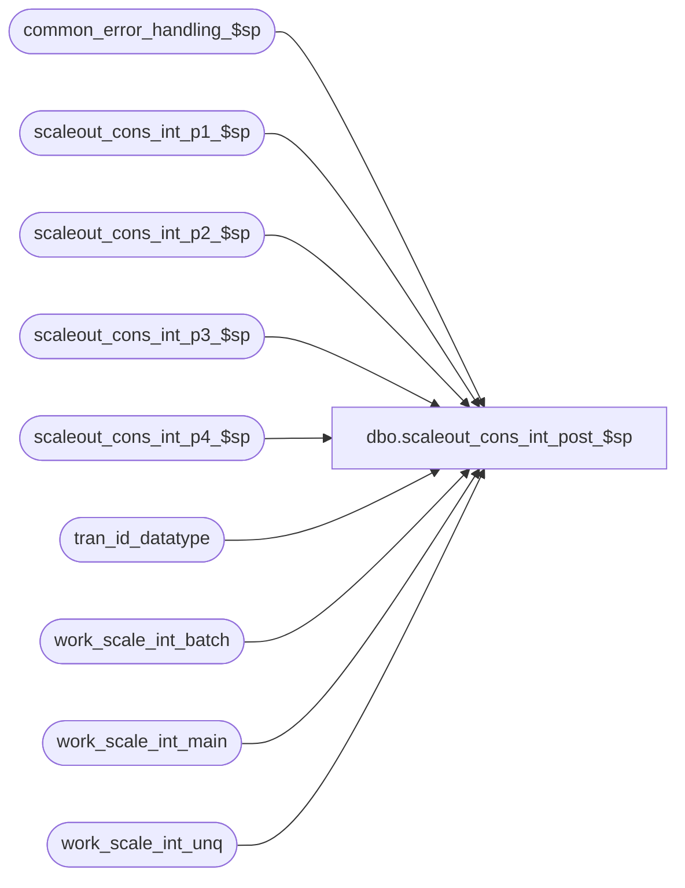

# dbo.scaleout_cons_int_post_$sp

**Database:** auditworks  
**Server:** bedrockdb01  

## Architecture Diagram



## Table Dependencies

| Referenced Table |
|---|
| common_error_handling_$sp |
| scaleout_cons_int_p1_$sp |
| scaleout_cons_int_p2_$sp |
| scaleout_cons_int_p3_$sp |
| scaleout_cons_int_p4_$sp |
| tran_id_datatype |
| work_scale_int_batch |
| work_scale_int_main |
| work_scale_int_unq |

## Stored Procedure Code

```sql
create proc dbo.scaleout_cons_int_post_$sp 
AS 

/*
Proc name:	scaleout_cons_int_post_$sp
Description:	Posts transactions from interface in Consolidated Sales Audit db to transaction archive av_* tables.
		Stored proc runs in Consolidated Sales Audit db.
		Interface transactions are inserted in batches.
		Proc, if aborted, will restart from where it left off

		This proc is optional since SUSM could instead be configured to call the other procs directly 
		and scaleout_cons_int_p2_$sp and scaleout_cons_int_p3_$sp could be called simultaneously (asynchronous) in
		order to maximize performance. The proc scaleout_cons_int_p4_$sp must run after p2 and p3 have completed.
		Called from SUSM.

	To monitor the process:
		check the number of unposted transactions for the queue_id/interface_id (normally 38).

HISTORY:
Date     Name           Def# Desc
Jul19,11 Paul         115308 improve error recovery
Dec09,09 Paul         114682 author
*/

DECLARE
@corrections_flag		smallint,
@errmsg			varchar(255),
@errno			integer,
@execret			integer,
@first_date		smalldatetime,
@first_tran_id		tran_id_datatype,
@last_date		smalldatetime,
@last_tran_id		tran_id_datatype,
@message_id		int,
@object_name		varchar(255),
@operation_name		varchar(100),
@process_name		varchar(100),
@process_no 		smallint,
@i_process_timestamp	int,
@i_min_serial_no		numeric(14,0),
@i_max_serial_no		numeric(14,0),
@i_execution_id		integer,
@status_flag		numeric(16,4)


SET NOCOUNT ON

SELECT @object_name = ' ',
	@operation_name = 'post',
	@process_no = 28,
	@process_name = 'scaleout_cons_int_post_$sp'		

TRUNCATE TABLE work_scale_int_batch
TRUNCATE TABLE work_scale_int_unq
TRUNCATE TABLE work_scale_int_main

-- the returned parameters are used later by scaleout_cons_int_p4_$sp

EXEC @execret = scaleout_cons_int_p1_$sp @i_process_timestamp OUTPUT, @i_min_serial_no OUTPUT,
	@i_max_serial_no OUTPUT, @i_execution_id OUTPUT,
	@corrections_flag OUTPUT, @status_flag OUTPUT, @first_date OUTPUT,
	@last_date OUTPUT, @first_tran_id OUTPUT, @last_tran_id OUTPUT

SELECT @errno = @@error
IF @errno <> 0
BEGIN
  SELECT @errmsg = 'Failed to exec scaleout_int_p1_$sp',
   	@object_name = 'scaleout_cons_int_p1_$sp',
	@operation_name = 'EXECUTE'
  GOTO error
END

IF @execret <= 0 -- THEN
  RETURN @execret

EXEC @execret = scaleout_cons_int_p2_$sp @corrections_flag, @status_flag OUTPUT, @first_date,
	@last_date, @first_tran_id, @last_tran_id

SELECT @errno = @@error
IF @errno <> 0
BEGIN
  SELECT @errmsg = 'Failed to exec scaleout_int_p2_$sp',
   	@object_name = 'scaleout_cons_int_p2_$sp',
	@operation_name = 'EXECUTE'
  GOTO error
END

IF @execret <= 0 -- THEN
  RETURN @execret

EXEC @execret = scaleout_cons_int_p3_$sp @corrections_flag, @status_flag OUTPUT, @first_date,
	@last_date, @first_tran_id, @last_tran_id

SELECT @errno = @@error
IF @errno <> 0
BEGIN
  SELECT @errmsg = 'Failed to exec scaleout_int_p3_$sp',
   	@object_name = 'scaleout_cons_int_p3_$sp',
	@operation_name = 'EXECUTE'
  GOTO error
END

IF @execret <= 0 -- THEN
  RETURN @execret

EXEC @execret = scaleout_cons_int_p4_$sp @i_min_serial_no, @i_max_serial_no, @i_execution_id

SELECT @errno = @@error
IF @errno <> 0
BEGIN
  SELECT @errmsg = 'Failed to exec scaleout_int_p4_$sp',
   	@object_name = 'scaleout_cons_int_p4_$sp',
	@operation_name = 'EXECUTE'
  GOTO error
END

IF @execret <= 0 -- THEN
  RETURN @execret

RETURN 0

error:

	EXEC common_error_handling_$sp @process_no, @errno, @errmsg, 0, 201068, 
	@process_name, @object_name, @operation_name, 1, 1, 
	0, 0, 0
	RETURN -100
```

