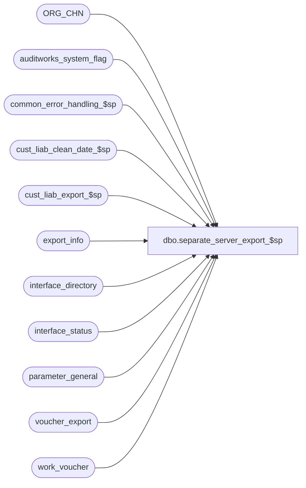

# dbo.separate_server_export_$sp

**Database:** auditworks  
**Server:** bedrockdb01  

## Architecture Diagram



## Table Dependencies

| Referenced Table |
|---|
| ORG_CHN |
| auditworks_system_flag |
| common_error_handling_$sp |
| cust_liab_clean_date_$sp |
| cust_liab_export_$sp |
| export_info |
| interface_directory |
| interface_status |
| parameter_general |
| voucher_export |
| work_voucher |

## Stored Procedure Code

```sql
create proc dbo.separate_server_export_$sp 

(@interface_id		tinyint)

AS

/* 
PROC NAME:   separate_server_export_$sp
PROC DESC:   Updates parameter_general, auditworks_system_flag
             Executes cust_liab_export_$sp to populate work_voucher and then export via voucher_export.
             Called by ICT_EXPORT as an AD-HOC export

HISTORY
Date      Name          Def#	 Desc
Dec07/12  Vicci          140321  Recognize that any non-zero value of glc_export_used means Do not export (since UI offers option 2 indicating stores
                                 are using remote voucher lookup).
Feb04,10 Paul            115308  avoid updating glc_export_used when not needed (avoids updating audit trail)
Nov17,09  Vicci          114243  Recognize that VCHR_CNFG_TYPE of N/A does not mean "offline"
May25,05  Paul          DV-1254  use the new values in VCHR_CNFG_TYPE
Sep15,04  IanK          DV-1146  Change user name to user_id
May25,04  David         DV-1071  Use ORG_CHN table as new the Store table.
Mar04,04  Phu           1-UN8TL  voucher_export is not truncated causing duplicate in export_glc_pos_$sp and export_interstore_tracking_$sp.
Apr02,03  David         1-JVR21  Remove @errmsg from call to cust_liab_export_$sp.
Feb11,02  Daphna                 author

*/

DECLARE
  @current_export_time            datetime,
  @errmsg                         nvarchar(255),
  @errno                          int,
  @glc_export_used                tinyint,
  @immediate_posting_requested    tinyint,
  @log_error_flag                 tinyint,
  @message_id                     int,
  @object_name                    nvarchar(255),
  @operation_name                 nvarchar(100),
  @process_id 			  binary(16),  
  @process_no                     int,
  @process_name                   nvarchar(100),
  @rows                           int,
  @user_id 			  int

SELECT @log_error_flag = 1, -- called by smartload
       @process_no = 240,
       @process_name = 'separate_server_export_$sp',
       @message_id = 201068,
       @process_id = @@spid,
       @user_id    = null;

       
IF (SELECT update_timing FROM interface_directory 
    WHERE interface_id = @interface_id) <> 5  
  RETURN

SELECT @immediate_posting_requested = ISNULL(immediate_posting_requested,0)
  FROM interface_status
 WHERE interface_id = @interface_id

SELECT @errno = @@error
IF @errno <> 0
  BEGIN
    SELECT @errmsg = 'Unable to select immediate_posting_request from interface status',
           @object_name = 'interface_status',
           @operation_name = 'SELECT'
    GOTO error
  END

IF @immediate_posting_requested = 0
  RETURN

-- determine if any stores are online
SELECT @glc_export_used = 0  --variable reused of other purpose
IF EXISTS(SELECT 1
          FROM ORG_CHN
          WHERE VCHR_CNFG_TYPE = 'RMT')
  SELECT @glc_export_used = 1

UPDATE auditworks_system_flag
   SET flag_numeric_value = @glc_export_used
 WHERE flag_name = 'auditworks_cleandate_used'
   
SELECT @errno = @@error
IF @errno != 0
BEGIN
  SELECT @errmsg = 'SET auditworks_cleandate_used FROM ORG_CHN',
         @object_name = 'auditworks_system_flag',
         @operation_name = 'UPDATE'
  GOTO error
END

-- determine if any stores are offline
SELECT @glc_export_used = 0
IF EXISTS(SELECT 1
          FROM ORG_CHN
          WHERE VCHR_CNFG_TYPE = 'LCL')
  SELECT @glc_export_used = 1

-- Note:  TM values 0 and 2 are equivalent.  They both mean do not export.
UPDATE parameter_general
   SET glc_export_used = @glc_export_used
 WHERE (glc_export_used = 1 AND @glc_export_used <> 1)
    OR (glc_export_used <> 1 AND @glc_export_used = 1)
    OR glc_export_used IS NULL
SELECT @errno = @@error
IF @errno != 0
BEGIN
  SELECT @errmsg = 'SET glc_export_used FROM ORG_CHN',
         @object_name = 'parameter_general',
         @operation_name = 'UPDATE'
  GOTO error
END

-- calculate cleandate 

EXEC cust_liab_clean_date_$sp @process_id, @user_id, @process_no, @log_error_flag, @errmsg OUTPUT 

SELECT @errno = @@error
IF @errno !=0 
BEGIN
  SELECT @errmsg='determine clean date for synch',
         @object_name = 'cust_liab_clean_date_$sp',	
         @operation_name = 'EXECUTE'           
  GOTO error
END

SELECT @current_export_time = getdate()  

-- to populate work_voucher table
EXEC cust_liab_export_$sp @process_no
  
SELECT @errno=@@error
IF @errno != 0
BEGIN
  SELECT @errmsg = 'to populate work_voucher table',
 @operation_name = 'EXECUTE',
         @object_name = 'cust_liab_export_$sp'
  GOTO error
END

SELECT @rows = COUNT(reference_no) 
FROM work_voucher

SELECT @errno=@@error
IF @errno != 0
BEGIN
  SELECT @errmsg = 'count rows in work_voucher table',
         @operation_name = 'SELECT',
 @object_name = 'work_voucher'
  GOTO error
END

-- if no rows to export, turn off immediate_request
IF @rows = 0
BEGIN
 UPDATE interface_status
     SET immediate_posting_requested = 0
   WHERE interface_id = 30

  SELECT @errno=@@error
  IF @errno != 0
  BEGIN
    SELECT @errmsg = 'no rows to export, SET immediate_posting_requested = 0',
           @operation_name = 'UPDATE',
           @object_name = 'interface_status'
    GOTO error
  END   
  
  DELETE export_info
  WHERE interface_id = 30
  
  SELECT @errno=@@error
  IF @errno != 0
  BEGIN
    SELECT @errmsg = 'WHERE interface_id = 30',
           @operation_name = 'DELETE',
           @object_name = 'export_info'
    GOTO error
  END   
END  
ELSE
BEGIN
  BEGIN TRAN
    INSERT INTO voucher_export (
      reference_type,
      reference_no,
      key_store_no,
      issuing_store_no,
      date_issued,
      title,
      first_name,
      last_name,
      address_1,
      address_2,
      city,
      county,
      state,
      post_code,
      telephone_no1,
      telephone_no2,
      customer_no,
      pos_tax_jurisdiction_code,
      fax,
      email_address,
      synch_flag,
      pos_status,
      pos_amount_1,
      pos_amount_2,
      pos_amount_3,
      as_of_date,
      entry_type )
    SELECT
      reference_type,
      reference_no,
      key_store_no,
      issuing_store_no,
      date_issued,
      title,
      first_name,
      last_name,
      address_1,
      address_2,
      city,
      county,
      state,
      post_code,
      telephone_no1,
      telephone_no2,
      customer_no,
      pos_tax_jurisdiction_code,
      fax,
      email_address,
      synch_flag,
      pos_status,
      pos_amount_1,
      pos_amount_2,
      pos_amount_3,
      as_of_date,
      entry_type
    FROM work_voucher

    SELECT @errno = @@error
    IF @errno != 0
    BEGIN
      SELECT @errmsg = 'Unable to insert voucher_export from work_voucher',
             @object_name = 'voucher_export',
             @operation_name = 'INSERT'
      GOTO error
    END   

    UPDATE auditworks_system_flag
    SET flag_datetime_value = @current_export_time       
    WHERE flag_name = 'voucher_last_exported'
 
    SELECT @errno = @@error
    IF @errno <> 0
    BEGIN
      SELECT @errmsg = 'Unable to set voucher_last_exported with current datetime in auditworks_system_flag',
             @object_name = 'auditworks_system_flag',
             @operation_name = 'UPDATE'
      GOTO error
    END
  COMMIT
END -- else of if @rows = 0

RETURN

error:   /* Common error handler. */

  EXEC common_error_handling_$sp @process_no, @errno, @errmsg, 0, @message_id, 
       @process_name, @object_name, @operation_name, @log_error_flag , 1, 0, null,
       0, null, null, null, null, null, null, 0, @process_id, @user_id
  RETURN
```

