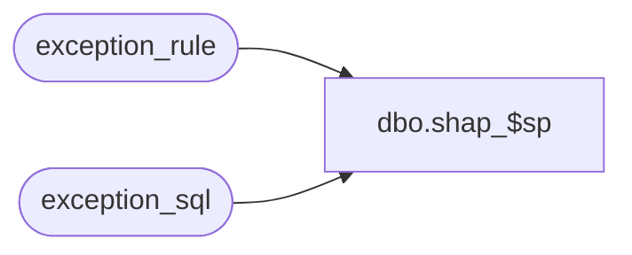

# dbo.shap_$sp

**Database:** auditworks  
**Server:** bedrockdb01  

## Architecture Diagram



## Table Dependencies

| Referenced Table |
|---|
| exception_rule |
| exception_sql |

## Stored Procedure Code

```sql
CREATE proc  dbo.shap_$sp AS

/* Procedure Name: exception_post_$sp

HISTORY
Date          Name            Defect  Desc
Jul 06,2000   Phu             6428    Ported from Oracle for MS SQL

*/


DECLARE
        @cursor_open            tinyint,
        @errno                  int,
        @errnum                 int,
        @exception_rule         smallint,
        @execution_order        int,
        @previous_rule          smallint,
        @process_id             int,
        @sql_command            varchar(2000),
        @sql_type               smallint


SELECT @process_id = @@spid


SELECT @cursor_open = 0

DECLARE user_exception_crsr CURSOR
FOR
SELECT es.exception_rule,
       es.execution_order,
       es.sql_command,
       es.sql_type
FROM exception_rule er, exception_sql es
WHERE er.query_id > 0
AND er.active_exception >= 1
AND er.exception_rule = es.exception_rule
ORDER BY es.exception_rule, es.execution_order

OPEN user_exception_crsr
SELECT @cursor_open = 1,
       @previous_rule = -1

WHILE 1 = 1
  BEGIN
      FETCH user_exception_crsr INTO
        @exception_rule,
        @execution_order,
        @sql_command,
        @sql_type

      IF @@fetch_status <> 0
        BREAK


SELECT @sql_command
/*
      IF @previous_rule <> @exception_rule
        SELECT @previous_rule = @exception_rule,
               @errnum = 0

      IF ((@errnum = 0) OR (@sql_type = 2))
        BEGIN
          BEGIN TRAN
            EXEC sp_executesql @sql_command

            SELECT @errno = @@error
            IF @errno <> 0
              BEGIN
                ROLLBACK TRAN
                SELECT @errmsg = 'Unable to execute dynamically SQL: ' + @sql_command,
                       @errnum = 1
                EXEC update_error_log_$sp 5, @errno, @errmsg
              END
            ELSE
              COMMIT TRAN
        END
*/
  END -- while 1 = 1

CLOSE user_exception_crsr
DEALLOCATE user_exception_crsr
SELECT @cursor_open = 0

/* Only exceptions where active_exception_flag = 1 (Guided Audit) will
   be reflected in the exception_qty in audit_status
*/
/*
BEGIN TRAN
     UPDATE transaction_header
     SET exception_flag = 1
     FROM work_exceptions we,
          exception_reason er,
          exception_rule el,
          transaction_header h
      WHERE we.process_id = @process_id
      AND we.transaction_id = er.transaction_id
      AND we.transaction_id = h.transaction_id
      AND er.violated_exception_rule = el.exception_rule
      AND el.active_exception = 1
      AND h.exception_flag = 0

     SELECT @errno = @@error
     IF @errno <> 0
       BEGIN
         SELECT @errmsg = 'Unable to set exception_flag in transaction_header'
         GOTO error
       END

COMMIT

BEGIN TRAN
     UPDATE transaction_line
     SET exception_flag = 1
     FROM work_exceptions we,
          exception_reason er,
          exception_rule el,
          transaction_line l
      WHERE we.process_id = @process_id
      AND we.transaction_id = er.transaction_id
      AND we.transaction_id = l.transaction_id
      AND er.violated_exception_rule = el.exception_rule
      AND el.active_exception = 1
      AND er.line_id <> 0
      AND er.line_id = l.line_id
      AND l.exception_flag = 0

     SELECT @errno = @@error
     IF @errno <> 0
       BEGIN
         SELECT @errmsg = 'Unable to set exception_flag in transaction_line'
         GOTO error
       END
*/
COMMIT

RETURN


error:   /* Common error handler */

        IF @@trancount > 0
          ROLLBACK TRANSACTION


        IF @cursor_open > 0
          BEGIN
                CLOSE user_exception_crsr
                DEALLOCATE user_exception_crsr
          END


        RETURN
```

