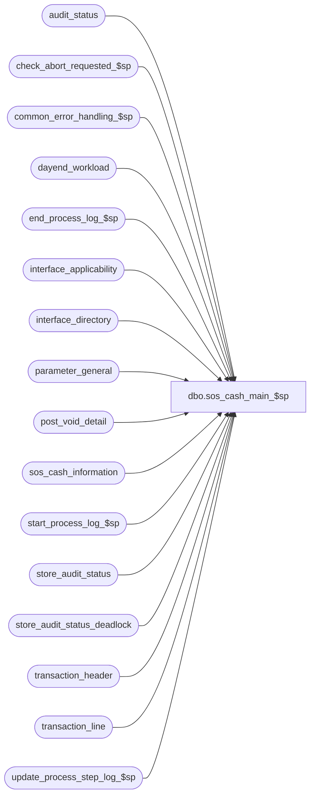

# dbo.sos_cash_main_$sp

**Database:** auditworks  
**Server:** bedrockdb01  

## Architecture Diagram



## Table Dependencies

| Referenced Table |
|---|
| audit_status |
| check_abort_requested_$sp |
| common_error_handling_$sp |
| dayend_workload |
| end_process_log_$sp |
| interface_applicability |
| interface_directory |
| parameter_general |
| post_void_detail |
| sos_cash_information |
| start_process_log_$sp |
| store_audit_status |
| store_audit_status_deadlock |
| transaction_header |
| transaction_line |
| update_process_step_log_$sp |

## Stored Procedure Code

```sql
create proc dbo.sos_cash_main_$sp 
@process_id				binary(16),
@dayend_process_id 			tinyint = NULL,
@errmsg 				nvarchar(255) OUTPUT,
@excluded_dayend_from_time              int = 0,
@excluded_dayend_to_time                int = 0

AS

/* Proc name: sos_cash_main_$sp
   Desc: Post to sos tracking tables.
         Called by day_end_posting_$sp.

HISTORY
Date     Name            Def#  Desc
Jan05,11 Paul          105313  Use unicode datatypes
Sep09,05 Paul         DV-1312  apply 46240 to SA5
Dec14,04 David        DV-1191  Improve performance by adding hints.
Oct07,04 David        DV-1146  Remove user name.
May10,04 Maryam       DV-1071  Receive @process_id and pass it to check_abort_requested_$sp.
Dec20/04 Daphna         46240  use correct tran_no in update to POST-VOIDING cashier_no
Sep18/03 Maryam         13686  Pass two new parameters for excluded dayend time 
                                        and call check_abort_requested_$sp to check 
                                        whether abort has been requested either by the system or user. 
May08/02 Winnie	     1-C2Q5L 	Add abort logic to dayend.
Nov30/01 Phu		8931	Progress monitor and error handling
Apr24/01 David M		7589	Missing transactions by transaction series Version 1.0.
Mar05/01 Bayani		4026	Modified cash_post_void_amount calculation to include post void amount only.
Sep12/00 Shapoor		6663    Facilitate Multi Stream Dayend.
Jul05/00 Sab		6446	Must include th.transaction_no in join to update statement
May25/00 John G		5864 	Change '= NULL' to 'IS NULL' where applicable to mirror Oracle.
May12/00 Daphna          5085    Include petty cash open/close (action 31,32) so that 
                                        petty cash receipts/disbursements are netted out
Mar22/00 Henry		5456	Update to track the POST-VOIDING cashier_no, instead
					of using the POST-VOIDED cashier_no.
Mar01,00 Phu		5900	Change @@fetch_status > 0 to @@fetch_status <> 0 for MS SQL compatibility
Oct26/99 Paul		5531	Add batching logic, remove redundant code
May27/98 Paul
         David			author

*/

DECLARE
	@cursor_open			tinyint,
	@date_reject_id			tinyint,
	@errno				int,
	@message_id			int,
	@object_name			nvarchar(255),
	@operation_name			nvarchar(100),
	@process_name			nvarchar(100),
	@process_log_entry 		tinyint,
	@process_no 			smallint,
	@process_start_time		datetime,
	@process_timestamp	 	float,
	@rows				int,
	@sos_cash_days 			smallint,
	@sos_cash_flag 			tinyint,
	@sales_date			smalldatetime,
	@store_no			int,
	@transaction_count 		numeric(12,0),
	@abort_flag			tinyint

IF @dayend_process_id IS NULL  
  RETURN

SELECT	@message_id = 201068,
	@process_name = 'sos_cash_main_$sp',
	@process_no = 25,
	@process_log_entry = 0,
	@transaction_count = 0,
	@process_start_time = getdate(),
	@process_timestamp = 0,
	@rows = 0,
	@abort_flag = 0

SELECT @sos_cash_days = sos_cash_days
  FROM parameter_general

SELECT @errno = @@error
IF @errno <> 0
  BEGIN
       	SELECT @errmsg = 'Failed to SELECT sos_cash_days from parameter_general',
	       @object_name = 'parameter_general',
	       @operation_name = 'SELECT'
	GOTO error
  END

IF EXISTS (SELECT 1
             FROM interface_directory
            WHERE interface_id = 13
              AND update_timing = 3)
  SELECT @sos_cash_flag = 1
ELSE
  SELECT @sos_cash_flag = 0

SELECT @errno = @@error
IF @errno <> 0
  BEGIN
       	SELECT @errmsg = 'Failed to select update_timing from interface_directory',
	       @object_name = 'interface_directory',
	       @operation_name = 'SELECT'
	GOTO error
  END

IF (@sos_cash_days = 0 OR @sos_cash_flag = 0) -- sos tracking not turned on
  BEGIN
	BEGIN TRAN

	UPDATE store_audit_status_deadlock
	SET function_no = @process_no,
		status_date = getdate()

	SELECT @errno = @@error
	IF @errno <> 0
	  BEGIN
		SELECT @errmsg = 'Failed to update store_audit_status_deadlock',
		 @object_name = 'store_audit_status_deadlock',
		       @operation_name = 'UPDATE'
		GOTO error
	  END

	UPDATE audit_status 
	 SET audit_status = 340
	  FROM dayend_workload d WITH (NOLOCK), audit_status a
	 WHERE d.dayend_process_id = @dayend_process_id
	   AND d.store_audit_status = 335
	   AND d.store_audit_status = a.audit_status
	   AND d.store_no = a.store_no
	   AND d.sales_date = a.sales_date
	   AND d.date_reject_id = a.date_reject_id

	SELECT @errno = @@error
	IF @errno <> 0
	  BEGIN
		SELECT @errmsg = 'Failed to update audit_status with status 340',
		       @object_name = 'audit_status',
		       @operation_name = 'UPDATE'
		GOTO error
	  END

	UPDATE store_audit_status 
	 SET store_audit_status = 340
	  FROM dayend_workload d WITH (NOLOCK), store_audit_status s
	 WHERE d.dayend_process_id = @dayend_process_id
	   AND d.store_audit_status = 335
	   AND d.store_audit_status = s.store_audit_status
	   AND d.store_no = s.store_no
	   AND d.sales_date = s.sales_date
	   AND d.date_reject_id = s.date_reject_id

	SELECT @errno = @@error
	IF @errno <> 0
	  BEGIN
		SELECT @errmsg = 'Failed to update store_audit_status with status 340',
		       @object_name = 'store_audit_status',
		       @operation_name = 'UPDATE'
		GOTO error
	  END

	UPDATE dayend_workload
	   SET store_audit_status = 340
	 WHERE dayend_process_id = @dayend_process_id
	   AND store_audit_status = 335

	SELECT @errno = @@error
	IF @errno <> 0
	  BEGIN
		SELECT @errmsg = 'Failed to update dayend_workload with status 340',
		       @object_name = 'dayend_workload',
		       @operation_name = 'UPDATE'
		GOTO error
	  END

	COMMIT
	RETURN
  END /* If @sos_cash_days = 0 OR @sos_cash_flag = 0 */

-- Need the work table to contain the transaction_no, to track the POST-VOIDING cashier of the POST-VOIDED trxn.
CREATE TABLE #work_sos_cash (
	cashier_no  			int 		null, 
	transaction_date  		smalldatetime 	null, 
	store_no  			int 		null, 
	transaction_no			numeric		null,
	cash_sales_amount		money  		DEFAULT   0 null, 
	cash_return_amount  		money  		DEFAULT   0 null,
	cash_post_void_amount		money		DEFAULT   0 null,
	net_petty_cash_disbursements	money		DEFAULT   0 null,
	transaction_series		nchar(1)		null,
	register_no			int		null)

SELECT @errno = @@error
IF @errno <> 0
  BEGIN
	SELECT @errmsg = 'Failed to create table #work_sos_cash',
	       @object_name = '#work_sos_cash',
	       @operation_name = 'CREATE'
	GOTO error
  END

/* Look for store-dates to process. Use temp table to minimize locking. */
CREATE TABLE #sos_cash_sas (
	store_no 			int 		not null,
	sales_date 			smalldatetime 	not null,
	date_reject_id 			tinyint 	not null )

SELECT @errno = @@error
IF @errno <> 0 
BEGIN
  SELECT @errmsg = 'Failed to create temp table.',
         @object_name = '#sos_cash_sas',
         @operation_name = 'CREATE'
  GOTO error  
END

INSERT INTO #sos_cash_sas
 SELECT store_no,
	sales_date,
	date_reject_id
  FROM dayend_workload WITH (NOLOCK)
 WHERE dayend_process_id = @dayend_process_id
   AND store_audit_status = 335

SELECT @errno = @@error,
	@rows = @@rowcount
IF @errno <> 0
  BEGIN
        SELECT @errmsg = 'Cannot build temp table #store_audit_status',
	       @object_name = '#sos_cash_sas',
	       @operation_name = 'INSERT'
	GOTO error
  END

IF @rows <= 0
  RETURN

DECLARE store_date_crsr CURSOR FAST_FORWARD
    FOR
 SELECT store_no,
	sales_date,
	date_reject_id
   FROM #sos_cash_sas WITH (NOLOCK)

OPEN store_date_crsr

SELECT @errno = @@error
IF @errno <> 0
  BEGIN
	SELECT @errmsg = 'Failed to open cursor store_date_crsr',
	       @object_name = 'store_date_crsr',
	       @operation_name = 'OPEN'
	GOTO error
  END

SELECT @cursor_open = 1

EXEC start_process_log_$sp @process_no, @process_timestamp OUTPUT,
	@errmsg OUTPUT, @dayend_process_id, @process_start_time

SELECT @errno = @@error
IF @errno <> 0
  BEGIN
	SELECT @object_name = 'start_process_log_$sp',
	      @operation_name = 'EXECUTE'
	IF @errmsg IS NULL  
	  SELECT 	@errmsg = 'Failed to execute start_process_log_$sp'
	GOTO error
  END

SELECT @process_log_entry = 1

WHILE 1=1
BEGIN
  FETCH store_date_crsr INTO
	@store_no,
	@sales_date,
	@date_reject_id

  IF @@fetch_status <> 0
	BREAK
  EXEC check_abort_requested_$sp @dayend_process_id, @process_id, @process_no,
 @excluded_dayend_from_time, @excluded_dayend_to_time, @errmsg OUTPUT
        
  SELECT @errno = @@error
  IF @errno != 0 
    BEGIN
      IF @errmsg IS NULL
        SELECT @errmsg = 'Failed to execute stored procedure check_abort_requested_$sp'
      SELECT @object_name = 'check_abort_requested_$sp',
             @operation_name = 'EXECUTE'
      GOTO error
    END


  TRUNCATE TABLE #work_sos_cash

  SELECT @errno = @@error
  IF @errno <> 0
    BEGIN
	SELECT @errmsg = 'Failed to TRUNCATE work table #work_sos_cash',
	       @object_name = '#work_sos_cash',
	       @operation_name = 'TRUNCATE'
	GOTO error
    END

  BEGIN TRANSACTION

  INSERT #work_sos_cash (
	cashier_no,
	transaction_date,
	store_no,
	transaction_no,
	cash_sales_amount,
	cash_return_amount,
	cash_post_void_amount,
	net_petty_cash_disbursements,
	transaction_series,
	register_no)
  SELECT
	th.cashier_no,
	th.transaction_date,
	th.store_no,
	th.transaction_no,
 	cash_sales_amount = SUM(((tl.gross_line_amount - tl.pos_discount_amount) * db_cr_none * voiding_reversal_flag)
			   *	((1-SIGN(ABS(tl.line_action - 18 ))) |
			    	(1-SIGN(ABS(tl.line_action - 28  ))) |
			    	(1-SIGN(ABS(tl.line_action - 245 ))))
			   * 	(1-SIGN(ABS(transaction_void_flag * (transaction_void_flag - 8)))) /* nonvoids */
			   ),
 	cash_return_amount = SUM(((tl.gross_line_amount - tl.pos_discount_amount) * db_cr_none * voiding_reversal_flag)
			   *	(1-SIGN(ABS(tl.line_action - 12 )))
			   * 	(1-SIGN(ABS(transaction_void_flag * (transaction_void_flag - 8)))) /* nonvoids */
			   ),
 	cash_post_void_amount = SUM(((tl.gross_line_amount - tl.pos_discount_amount) * db_cr_none * voiding_reversal_flag)
			   *	((1-SIGN(ABS(tl.line_action - 18 ))) |
			    	(1-SIGN(ABS(tl.line_action - 28  ))) |
			    	(1-SIGN(ABS(tl.line_action - 245 ))))
			   *	(1-SIGN(ABS(transaction_void_flag - 1 ))) ),
-- Defect 4026		   * 	(SIGN(ABS(transaction_void_flag * (transaction_void_flag - 8) * (transaction_void_flag - 5)))) /* voids only */			   ),
 	net_petty_cash_disbursements = 
			SUM(((tl.gross_line_amount - tl.pos_discount_amount) * db_cr_none * voiding_reversal_flag)
			   *	((1-SIGN(ABS(tl.line_action - 29 ))) |  -- disb
			    	(1-SIGN(ABS(tl.line_action - 201 ))) |  -- pickup
			    	(1-SIGN(ABS(tl.line_action - 204 ))) | -- loaned out
				(1-SIGN(ABS(tl.line_action - 14  ))) | -- change recd
			    	(1-SIGN(ABS(tl.line_action - 202 ))) | -- pickup retn
			    	(1-SIGN(ABS(tl.line_action - 31 ))) | -- open
			    	(1-SIGN(ABS(tl.line_action - 32 ))) | -- close
			    	(1-SIGN(ABS(tl.line_action - 203 )))) -- loaned in
			   * 	(1-SIGN(ABS(transaction_void_flag * (transaction_void_flag - 8)))) /* nonvoids */
			   ),
	th.transaction_series,
	th.register_no
    FROM  transaction_header th WITH (NOLOCK), transaction_line tl WITH (NOLOCK), interface_applicability ia
   WHERE th.store_no = @store_no
     AND th.transaction_date = @sales_date
     AND th.date_reject_id = @date_reject_id
     AND th.transaction_id = tl.transaction_id
     AND line_void_flag = 0
     AND th.transaction_category = ia.transaction_category
     AND tl.line_object = ia.line_object
     AND tl.line_action = ia.line_action
     AND ia.interface_id = 13
   GROUP BY th.cashier_no, th.transaction_date,	th.store_no, th.transaction_no, th.transaction_series, th.register_no

  SELECT @errno = @@error,
	@transaction_count = @transaction_count + @@rowcount

  IF @errno <> 0
    BEGIN
	SELECT 	@errmsg = 'Failed to insert rows into work_sos_cash table',
		@object_name = '#work_sos_cash',
		@operation_name = 'INSERT'
	GOTO error
    END

  -- Assign the POST-VOIDING cashier_no here, overlay the POST-VOIDED cashier_no.

  UPDATE #work_sos_cash
     SET cashier_no = th.cashier_no
    FROM #work_sos_cash sc,
         transaction_header th WITH (NOLOCK),
         post_void_detail pv WITH (NOLOCK)
   WHERE sc.cash_post_void_amount <> 0
     AND sc.store_no = th.store_no
     AND sc.transaction_date = th.transaction_date
     AND th.transaction_id = pv.transaction_id
     AND sc.register_no = pv.post_voided_register
     AND sc.transaction_no = pv.post_voided_trans_no
     AND sc.transaction_series = th.transaction_series

  SELECT @errno = @@error
  IF @errno <> 0
    BEGIN
        SELECT @errmsg = 'Cannot UPDATE #work_sos_cash',
	       @object_name = '#work_sos_cash',
	       @operation_name = 'UPDATE'
	GOTO error
    END

  INSERT sos_cash_information
  SELECT transaction_date,
         cashier_no,
         store_no,
         SUM(cash_sales_amount),
         SUM(cash_return_amount),
         SUM(cash_post_void_amount),
         SUM(net_petty_cash_disbursements)
    FROM #work_sos_cash WITH (NOLOCK)
   GROUP BY transaction_date, cashier_no, store_no

  SELECT @errno = @@error
  IF @errno <> 0
    BEGIN
        SELECT @errmsg = 'Cannot INSERT sos_cash_information',
	       @object_name = 'sos_cash_information',
	       @operation_name = 'INSERT'
	GOTO error
    END

  UPDATE store_audit_status_deadlock
   SET function_no = @process_no,
	status_date = getdate()

  SELECT @errno = @@error
  IF @errno <> 0
    BEGIN
	SELECT @errmsg = 'Failed to update store_audit_status_deadlock',
	       @object_name = 'store_audit_status_deadlock',
	       @operation_name = 'UPDATE'
	GOTO error
    END

  UPDATE audit_status 
   SET	audit_status = 340
   WHERE store_no = @store_no
     AND sales_date = @sales_date
     AND date_reject_id = @date_reject_id
     AND audit_status = 335

  SELECT @errno = @@error
  IF @errno <> 0
    BEGIN
	SELECT 	@errmsg = 'Failed to update audit_status with status 340',
		@object_name = 'audit_status',
		@operation_name = 'UPDATE'
	GOTO error
    END

  UPDATE store_audit_status 
    SET store_audit_status = 340
   WHERE store_no = @store_no
     AND sales_date = @sales_date
     AND date_reject_id = @date_reject_id
     AND store_audit_status = 335

  SELECT @errno = @@error
  IF @errno <> 0
    BEGIN
	SELECT 	@errmsg = 'Failed to update store_audit_status with status 340',
		@object_name = 'store_audit_status',
		@operation_name = 'UPDATE'
	GOTO error
    END

  UPDATE dayend_workload
    SET store_audit_status = 340
   WHERE dayend_process_id = @dayend_process_id
     AND store_no = @store_no
     AND sales_date = @sales_date
     AND date_reject_id = @date_reject_id
     AND store_audit_status = 335

  SELECT @errno = @@error
  IF @errno <> 0
    BEGIN
	SELECT @errmsg = 'Failed to update dayend_workload with status 340',
	       @object_name = 'dayend_workload',
	       @operation_name = 'UPDATE'
	GOTO error
    END

    EXEC update_process_step_log_$sp 18, @dayend_process_id, 40, NULL, NULL, NULL  
    SELECT @errno = @@error
    IF @errno != 0
      BEGIN
        IF @errmsg IS NULL      
         SELECT @errmsg = 'Failed to execute stored proc update_process_step_log_$sp for step 40'
        SELECT @object_name = 'update_process_step_log_$sp',
	       @operation_name = 'EXECUTE'
       GOTO error
      END

  COMMIT TRANSACTION

END /* While 1=1 */

CLOSE store_date_crsr
DEALLOCATE store_date_crsr
SELECT @cursor_open = 0

IF @process_log_entry = 1
  BEGIN
    EXEC end_process_log_$sp @process_no, @process_timestamp, @transaction_count
    SELECT @errno = @@error
    IF @errno != 0
      BEGIN
        SELECT @errmsg = 'Unable to execute stored procedure end_process_log_$sp',
               @object_name = 'end_process_log_$sp',
  	       @operation_name = 'EXECUTE'
        GOTO error
    END
  END

RETURN

error:
	IF @cursor_open = 1
	  BEGIN
		CLOSE store_date_crsr
		DEALLOCATE store_date_crsr
	  END

	EXEC common_error_handling_$sp @process_no, @errno, @errmsg, @abort_flag, @message_id, 
	@process_name, @object_name, @operation_name, 1, @dayend_process_id, @process_log_entry,
	@process_timestamp, @transaction_count
	RETURN
```

