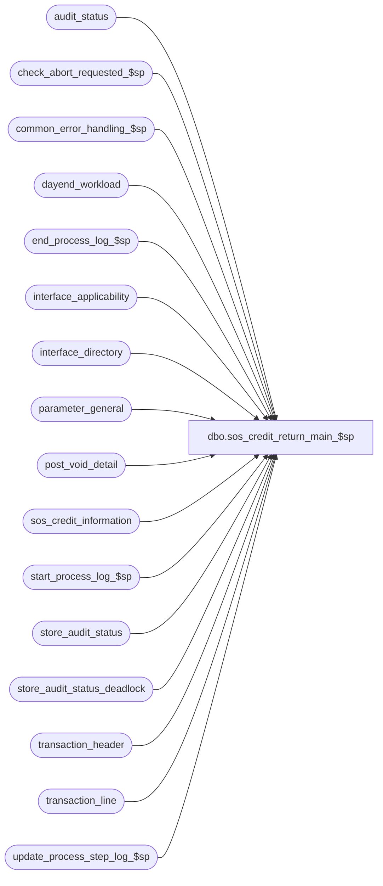

# dbo.sos_credit_return_main_$sp

**Database:** auditworks  
**Server:** bedrockdb01  

## Architecture Diagram



## Table Dependencies

| Referenced Table |
|---|
| audit_status |
| check_abort_requested_$sp |
| common_error_handling_$sp |
| dayend_workload |
| end_process_log_$sp |
| interface_applicability |
| interface_directory |
| parameter_general |
| post_void_detail |
| sos_credit_information |
| start_process_log_$sp |
| store_audit_status |
| store_audit_status_deadlock |
| transaction_header |
| transaction_line |
| update_process_step_log_$sp |

## Stored Procedure Code

```sql
CREATE proc [dbo].[sos_credit_return_main_$sp] 
( @process_id				binary(16),
  @dayend_process_id 			tinyint = NULL,
  @errmsg 				nvarchar(255) OUTPUT,
  @excluded_dayend_from_time            int = 0,
  @excluded_dayend_to_time              int = 0
)

AS

/* Proc name: sos_credit_return_main_$sp.
   Called by day_end_posting_$sp.

HISTORY
Date     Name		Def# Desc
Jul21,15 Daphna		131151  Expand the length of the column for tender total and amounts
Jan20,11 Paul         124176 avoid implicit conversion in COALESCE(reference_no)
Jan22,08 Paul          94350 populate tran id and series in sos_credit_information
Mar03,06 Paul          68197 apply 68154 to SA5
Jul08,05 Paul        DV-1295 expand account_no to 80 characters
Feb10,05 David       DV-1206 Expand column account_no.
Dec14,04 David       DV-1191 Improve performance by adding hints.
Oct07,04 David       DV-1146 Use user_id.
May10,04 Maryam      DV-1071 Receive @process_id and pass it to check_abort_requested_$sp.
May07,05 Sab	     DV-1071 Changed datatype for account_no from numeric to nvarchar(32) for encrypted credit cards
Feb23,06 Daphna        68154 Insert ISNULL(ref-no,0) to #work_sos_credit, ISNULL accidentally removed in DV1298
Sep18,03 Maryam        13686 Pass two new parameters for excluded dayend time and call check_abort_requested_$sp
                             to check whether abort has been requested either by the system or user. 
Aug16,02 David       1-ETJSL Add extra where clause when getting voiding cashier
May08,02 Winnie	     1-C2Q5L Add abort logic to dayend.
Feb28,02 Sab	     1-BARLV Change data type column entry_date_time in #work_sos_credit from
				 smalldatetime to datetime. also retrofitted to 2.50.
Nov30,01 Phu		8931 Progress monitor and error handling
Sep27,01 Paul		8797 clean up code to match Oracle
Apr24,01 David M	7589 Missing transactions by transaction series Version 1.0.
Mar05,01 Bayani		4026 Modified post_void_amount calculation to include post void amount only.
Sep12,00 Shapoor	6663 Facilitate Multi Stream Dayend.
Aug25,00 Phu		6644 Correct MS SQL bug where float negative times zero is not equal to zero
Jul 5,00 Sab		6446 Must include th.transaction_no in join to update statement
May25,00 John G		5864 Change '= NULL' to 'IS NULL' where applicable to mirror Oracle.
Mar22,00 Henry		5456 Update to track the POST-VOIDING cashier_no, instead
				using the POST-VOIDED cashier_no.
Mar01,00 Phu		5900 Change @@fetch_status > 0 to @@fetch_status <> 0 for MS SQL compatibility
Nov09,99 Daphna		5599 Add brackets to SUM in insert to sos_credit_information to 
			    	prevent duplicate row on insert error	
Oct26,99 Sab		5531 Add batching logic, remove redundant code
*/

DECLARE
@cursor_open			tinyint,
@date_reject_id			tinyint,
@errno				int,
@message_id			int,
@object_name			nvarchar(255),
@operation_name			nvarchar(100),
@process_name			nvarchar(100),
@process_log_entry 		tinyint,
@process_no 			smallint,
@process_start_time		datetime,
@process_timestamp		float,
@rows				int,
@sales_date			smalldatetime,
@sos_credit_days 		smallint,
@sos_credit_return_flag		tinyint,
@store_no			int,
@transaction_count 		numeric(12,0),
@abort_flag			tinyint


IF @dayend_process_id IS NULL     
   RETURN

SELECT	@cursor_open = 0,
	@process_log_entry = 0,
	@process_no = 26,
	@transaction_count =  0,
	@rows = 0,
	@process_timestamp = 0,
	@process_start_time = getdate(),
	@message_id = 201068,
	@process_name = 'sos_credit_return_main_$sp',
	@abort_flag = 0

SELECT @sos_credit_days = sos_credit_days
FROM parameter_general

IF EXISTS (SELECT interface_id
	     FROM interface_directory
	    WHERE interface_id = 6
	      AND update_timing = 3)
  SELECT @sos_credit_return_flag = 1
ELSE
  SELECT @sos_credit_return_flag = 0

IF @sos_credit_days = 0 OR @sos_credit_return_flag = 0
  BEGIN
	BEGIN TRAN
	UPDATE store_audit_status_deadlock
	SET function_no = 18,
		status_date = getdate()

	SELECT @errno = @@error
	IF @errno <> 0
	  BEGIN
		SELECT @errmsg = 'Unable to update store_audit_status_deadlock',
		       @object_name = 'store_audit_status_deadlock',
		       @operation_name = 'UPDATE'
		GOTO error
	  END

	UPDATE audit_status 
	 SET audit_status = 350
	  FROM audit_status a, dayend_workload d WITH (NOLOCK)
	 WHERE d.dayend_process_id = @dayend_process_id
	  AND d.store_no = a.store_no
	   AND d.sales_date = a.sales_date
	   AND d.date_reject_id = a.date_reject_id
	   AND a.audit_status = 340

	SELECT @errno = @@error
	IF @errno <> 0
	  BEGIN
		SELECT @errmsg = 'Failed to update audit_status with status 350',
		       @object_name = 'audit_status',
		       @operation_name = 'UPDATE'
		GOTO error
	  END

	UPDATE store_audit_status 
	 SET store_audit_status = 350
	  FROM store_audit_status s, dayend_workload d WITH (NOLOCK)
	 WHERE d.dayend_process_id = @dayend_process_id
	   AND d.store_no = s.store_no
	   AND d.sales_date = s.sales_date
	   AND d.date_reject_id = s.date_reject_id
	   AND s.store_audit_status = 340

	SELECT @errno = @@error
	IF @errno <> 0
	  BEGIN
		SELECT @errmsg = 'Failed to update store_audit_status with status 350',
		       @object_name = 'store_audit_status',
		       @operation_name = 'UPDATE'
		GOTO error
	  END

	UPDATE dayend_workload
           SET store_audit_status = 350
	 WHERE dayend_process_id = @dayend_process_id
	   AND store_audit_status = 340

	SELECT @errno = @@error
	IF @errno <> 0
	  BEGIN
		SELECT @errmsg = 'Failed to update dayend_workload with status 350',
		       @object_name = 'dayend_workload',
		       @operation_name = 'UPDATE'
		GOTO error
	  END

	COMMIT TRAN
	RETURN
  END -- If @sos_credit_days = 0 OR @sos_credit_return_flag = 0


/* Look for store-dates to process. Use temp table to minimize locking */
CREATE TABLE #sos_credit_sas (
	store_no 			int 		not null,
	sales_date 			smalldatetime 	not null,
	date_reject_id 			tinyint 	not null )

SELECT @errno = @@error
IF @errno <> 0 
BEGIN
  SELECT @errmsg = 'Failed to create temp table.',
         @object_name = '#sos_credit_sas',
         @operation_name = 'CREATE'
  GOTO error  
END

INSERT INTO #sos_credit_sas (store_no,
	sales_date,
	date_reject_id)
 SELECT store_no,
	sales_date,
	date_reject_id
  FROM dayend_workload WITH (NOLOCK)
 WHERE dayend_process_id = @dayend_process_id
   AND store_audit_status = 340

SELECT @errno = @@error,
	@rows = @@rowcount
IF @errno <> 0
  BEGIN
	SELECT @errmsg = 'Cannot build temp table #sos_credit_sas',
	       @object_name = '#sos_credit_sas',
	       @operation_name = 'INSERT'
	GOTO error
  END

IF @rows <= 0
  BEGIN
	DROP TABLE #sos_credit_sas
	RETURN
  END

-- Need the work table to contain the transaction_no, to track the POST-VOIDING cashier of the POST-VOIDED trxn.
CREATE TABLE #work_sos_credit (
	 account_no		nvarchar(80),
	 transaction_date	smalldatetime,
	 cashier_no		int,
	 store_no		int,
	 register_no		smallint,
	 transaction_no		numeric,
	 entry_date_time	datetime,
	 line_object		smallint,
	 return_amount		money,
	 post_void_amount	money,
	 transaction_series	nchar(1),
	 transaction_id		numeric(14,0) null) -- tran_id_datatype
	
SELECT @errno = @@error
IF @errno <> 0
  BEGIN
	SELECT @errmsg = 'Cannot build temp table #work_sos_credit',
	       @object_name = '#work_sos_credit',
	       @operation_name = 'CREATE'
	GOTO error
  END

DECLARE store_date_crsr CURSOR FAST_FORWARD
    FOR
 SELECT store_no,
	sales_date,
	date_reject_id
   FROM #sos_credit_sas WITH (NOLOCK)

OPEN store_date_crsr

SELECT @errno = @@error
IF @errno <> 0
  BEGIN
	SELECT @errmsg = 'Failed to open cursor store_date_crsr',
	       @object_name = 'store_date_crsr',
	       @operation_name = 'OPEN'
	GOTO error
  END

SELECT @cursor_open = 1

EXEC start_process_log_$sp @process_no, @process_timestamp OUTPUT,
	@errmsg OUTPUT, @dayend_process_id, @process_start_time

SELECT @errno = @@error
IF @errno <> 0
 BEGIN
   SELECT @object_name = 'start_process_log_$sp',
	  @operation_name = 'EXECUTE'
   IF @errmsg IS NULL  
      SELECT @errmsg = 'Failed to execute start_process_log_$sp'
   GOTO error
 END

SELECT @process_log_entry = 1
	
WHILE 1=1
BEGIN
  FETCH store_date_crsr INTO
	@store_no,
	@sales_date,
	@date_reject_id

  IF @@fetch_status <> 0
	BREAK

  EXEC check_abort_requested_$sp @dayend_process_id, @process_id, @process_no,
      @excluded_dayend_from_time, @excluded_dayend_to_time, @errmsg OUTPUT
    
  SELECT @errno = @@error
  IF @errno != 0 
    BEGIN
      IF @errmsg IS NULL
        SELECT @errmsg = 'Failed to execute stored procedure check_abort_requested_$sp'
      SELECT @object_name = 'check_abort_requested_$sp',
             @operation_name = 'EXECUTE'
      GOTO error
    END

  TRUNCATE TABLE #work_sos_credit

  SELECT @errno = @@error
  IF @errno <> 0
    BEGIN
	SELECT @errmsg = 'Failed to TRUNCATE work table #work_sos_credit.',
	       @object_name = '#work_sos_credit',
	     @operation_name = 'TRUNCATE'
	GOTO error
    END

  /* To accomodate register bug whereby can't distinguish between debit and credit card */
  INSERT #work_sos_credit (
	 transaction_id,
	 account_no,
	 transaction_date,
	 cashier_no,
	 store_no,
	 register_no,
	 transaction_no,
	 entry_date_time,
	 transaction_series,
	 line_object,
	 return_amount,
	 post_void_amount)
  SELECT th.transaction_id,
	 COALESCE(tl.reference_no,'0'),
	 th.transaction_date, 
	 th.cashier_no,
	 th.store_no,
	 th.register_no,
	 th.transaction_no,
	 th.entry_date_time,
	 th.transaction_series,
	 MAX(tl.line_object), 
	 SUM( (tl.gross_line_amount - tl.pos_discount_amount) * db_cr_none * voiding_reversal_flag
		* (1-SIGN(ABS(transaction_void_flag * (transaction_void_flag - 8))))), /* nonvoids */
	 SUM( (tl.gross_line_amount - tl.pos_discount_amount) * db_cr_none * voiding_reversal_flag
		* (1-SIGN(ABS(transaction_void_flag -1)))) -- post-voided only
    FROM transaction_header th WITH (NOLOCK),
	 transaction_line tl WITH (NOLOCK),
	 interface_applicability i
   WHERE th.store_no = @store_no
     AND th.transaction_date = @sales_date
     AND th.date_reject_id = @date_reject_id
     AND th.transaction_id = tl.transaction_id
     AND tl.line_void_flag = 0
     AND transaction_void_flag * (transaction_void_flag - 1) * (transaction_void_flag - 8) = 0
     AND ( (CONVERT(NUMERIC(18,4), (tl.gross_line_amount - tl.pos_discount_amount) * db_cr_none) < 0
	AND transaction_void_flag IN (0,8))
	OR (CONVERT(NUMERIC(18,4), (tl.gross_line_amount - tl.pos_discount_amount) * db_cr_none) > 0 AND transaction_void_flag = 1) )
     AND i.interface_id = 6
     AND tl.line_object = i.line_object
     AND tl.line_action = i.line_action
     AND th.transaction_category = i.transaction_category
   GROUP BY th.transaction_id, COALESCE(tl.reference_no,'0'), th.transaction_date, th.cashier_no, th.store_no,
	 th.register_no, th.transaction_no, th.entry_date_time, th.transaction_series

  SELECT @errno = @@error, @transaction_count = @transaction_count + @@rowcount
  IF @errno <> 0
   BEGIN
	SELECT @errmsg = 'Failed to populate work_sos_credit',
	       @object_name = '#work_sos_credit',
	       @operation_name = 'INSERT'
	GOTO error
   END

  -- Assign the POST-VOIDING cashier_no to the post-voided transaction.
  
  UPDATE #work_sos_credit
     SET cashier_no = th.cashier_no
    FROM #work_sos_credit sc,
         transaction_header th WITH (NOLOCK),
         post_void_detail pv WITH (NOLOCK)
   WHERE sc.post_void_amount <> 0
     AND sc.store_no = th.store_no
     AND sc.transaction_date = th.transaction_date
     AND th.transaction_id = pv.transaction_id
     AND th.transaction_no = pv.post_voided_trans_no
     AND sc.register_no = pv.post_voided_register
     AND sc.transaction_series = th.transaction_series

 SELECT @errno = @@error
  IF @errno <> 0
    BEGIN
	SELECT @errmsg = 'Failed to UPDATE work table #work_sos_credit.',
	       @object_name = '#work_sos_credit',
	       @operation_name = 'UPDATE'
	GOTO error
    END

  BEGIN TRAN

  INSERT sos_credit_information (
	 account_no,
	 transaction_date,
	 cashier_no,
	 store_no,
	 register_no,
	 transaction_no,
	 entry_date_time,
	 transaction_id,
	 transaction_series,
	 line_object,
	 return_amount,
	 post_void_amount)
  SELECT account_no,
	 transaction_date,
	 cashier_no,
	 store_no,
	 register_no,
	 transaction_no,
	 entry_date_time,
	 transaction_id,
	 transaction_series,
	 line_object,
	 return_amount,
	 post_void_amount
    FROM #work_sos_credit WITH (NOLOCK)

  SELECT @errno = @@error
  IF @errno <> 0
    BEGIN
	SELECT @errmsg = 'Failed to INSERT sos_credit_information',
	       @object_name = 'sos_credit_information',
	       @operation_name = 'INSERT'
	GOTO error
    END

   UPDATE store_audit_status_deadlock
      SET function_no = 18,
	  status_date = getdate()

   SELECT @errno = @@error
   IF @errno <> 0
     BEGIN
	SELECT @errmsg = 'Unable to update store_audit_status_deadlock',
	       @object_name = 'store_audit_status_deadlock',
	       @operation_name = 'UPDATE'
	GOTO error
     END

   UPDATE audit_status 
      SET audit_status = 350
    WHERE store_no = @store_no
      AND sales_date = @sales_date
      AND date_reject_id = @date_reject_id
      AND audit_status = 340

   SELECT @errno = @@error
   IF @errno <> 0
    BEGIN
	SELECT 	@errmsg = 'Failed to update audit_status with status 350',
		@object_name = 'audit_status',
		@operation_name = 'UPDATE'
	GOTO error
    END

   UPDATE store_audit_status 
      SET store_audit_status = 350
    WHERE store_no = @store_no
      AND sales_date = @sales_date
      AND date_reject_id = @date_reject_id
      AND store_audit_status = 340

   SELECT @errno = @@error
   IF @errno <> 0
    BEGIN
	SELECT @errmsg = 'Failed to update store_audit_status with status 350',
	       @object_name = 'store_audit_status',
	       @operation_name = 'UPDATE'
	GOTO error
    END

   UPDATE dayend_workload
      SET store_audit_status = 350
    WHERE dayend_process_id = @dayend_process_id
      AND store_audit_status = 340
      AND store_no = @store_no
      AND sales_date = @sales_date
      AND date_reject_id = @date_reject_id

   SELECT @errno = @@error
   IF @errno <> 0
    BEGIN
	SELECT @errmsg = 'Failed to update dayend_workload with status 350',
	       @object_name = 'dayend_workload',
	       @operation_name = 'UPDATE'
	GOTO error
    END

   COMMIT TRAN

   EXEC update_process_step_log_$sp 18, @dayend_process_id, 41, NULL, NULL, NULL  

   SELECT @errno = @@error
   IF @errno != 0
      BEGIN
        IF @errmsg IS NULL
	    SELECT @errmsg = 'Failed to execute stored proc update_process_step_log_$sp for step 41'
	SELECT @object_name = 'update_process_step_log_$sp',
	       @operation_name = 'EXECUTE'
       GOTO error
      END

END /* 1=1 */

CLOSE store_date_crsr
DEALLOCATE store_date_crsr
SELECT @cursor_open = 0

IF @process_log_entry = 1
  BEGIN
    EXEC end_process_log_$sp @process_no, @process_timestamp, @transaction_count
    SELECT @errno = @@error
    IF @errno != 0
      BEGIN
        SELECT @errmsg = 'Unable to execute stored procedure end_process_log_$sp',
               @object_name = 'end_process_log_$sp',
	    @operation_name = 'EXECUTE'
	         
        GOTO error
    END
  END

DROP TABLE #work_sos_credit

RETURN

error:
	IF @cursor_open = 1
	BEGIN
	  CLOSE store_date_crsr
	  DEALLOCATE store_date_crsr
	END

	EXEC common_error_handling_$sp @process_no, @errno, @errmsg, @abort_flag, @message_id, 
	@process_name, @object_name, @operation_name, 1, @dayend_process_id, @process_log_entry,
	@process_timestamp, @transaction_count
	RETURN
```

