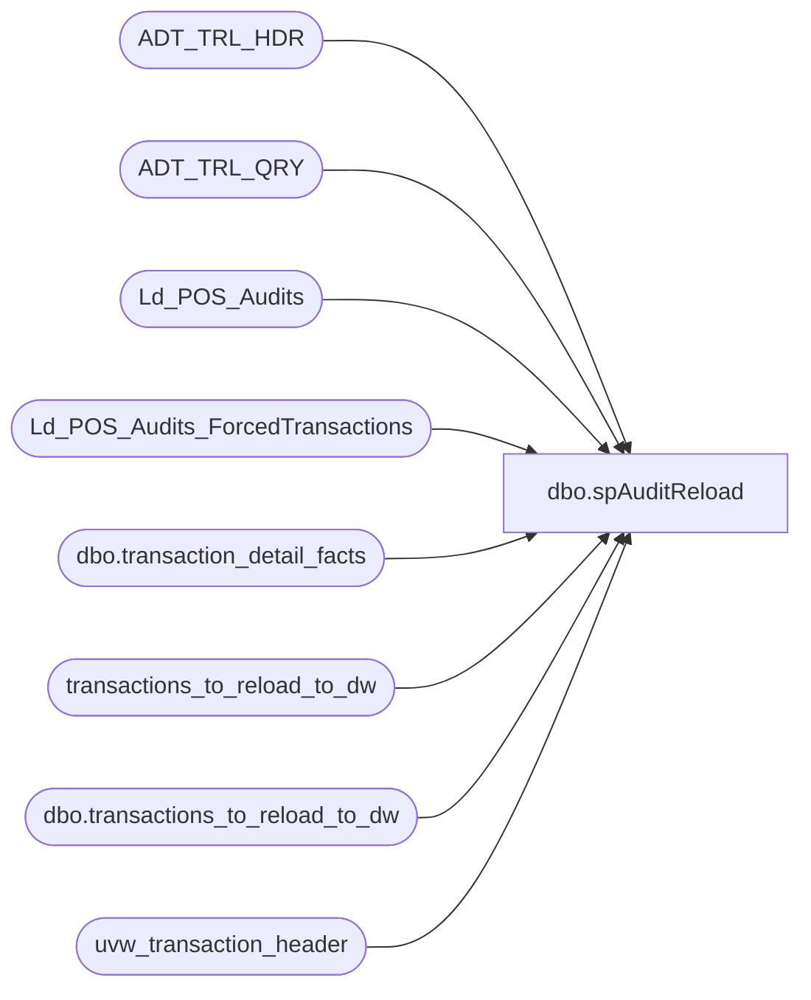

# dbo.spAuditReload

**Database:** auditworks  
**Server:** bedrockdb01  

## Architecture Diagram



## Table Dependencies

| Referenced Table |
|---|
| ADT_TRL_HDR |
| ADT_TRL_QRY |
| Ld_POS_Audits |
| Ld_POS_Audits_ForcedTransactions |
| dbo.transaction_detail_facts |
| transactions_to_reload_to_dw |
| dbo.transactions_to_reload_to_dw |
| uvw_transaction_header |

## Stored Procedure Code

```sql
CREATE PROCEDURE [dbo].[spAuditReload]
    @last_mod_date DATETIME
AS
	-- =====================================================================================================
	-- Name: spAuditReload
	--
	-- Description:	
	--
	-- Input:	
	--			Starting date.  Last date is current date.
	--
	-- Output: Resultset with the following columns:
	--			N/A
	--
	-- Dependencies: None
	--
	--GRANT  SELECT ,  UPDATE ,  INSERT ,  DELETE  ON [dbo].[transactions_to_reload_to_dw]  TO [pm_repo]
	--GRANT  SELECT ,  UPDATE ,  INSERT ,  DELETE  ON [dbo].[transactions_to_reload_to_dw]  TO [link_readonly]
	--
	-- Revision History
	--		Name:			Date:			Comments:
	--		Gary Murrish	11/6/2012		Added a block to stop the cycle of deleting transactions which were
	--										mass deleted and readded into Auditworks for store 2063 for 10/12-14/2012
	--		Gary Murrish	7/13/2012		Added a table to allow the forcing of transactions to be processed
	--		Gary Murrish	12/27/2011		Fixed to detect transaction_id from Audit so that deletes flow across
	--		?				08/24/2010		Initial version source control
	--		dave			11/02/2010		shifted to aw 5.0
	-- =====================================================================================================

	/*
01/06/2010 dave
not sure why we have the Ld_POS_Audits and transactions_to_reload_to_dw tables, both get 
populated, but only the Ld_POS_Audits table is used to pull the transactions for the
wf_History_Load_wTax_Audits workflow.  BUT, the transactions_to_reload_to_dw is used by 
the papamart spAuditReload proc to delete transactions.  really odd, since they aren't 
explicitly reloaded.  not going to delve too deep because it's been like this for ages.

I did add the delete where the the max tranid can't be higher than what is currently in the
warehouse.  otherwise, since the main pos load doesn't delete transactions, we could end
up with dups.

11/6/2012	Gary Murrish
	I concur with Dave. This is really cludgy. This SP is used in conjunction with a SP over on 
	papamart which determines which transactions have been changed, deletes them from the DW and then readds them.
	The delete is done based upon the register, transacton_no, store, and date. This means that the
	mass delete and readd process for auditworks means that the transactions are deleted and readded. For some reason,
	the readd process is not triggered in AuditWorks, so they don't come back.
*/


	--declare @last_mod_date datetime
	--set @last_mod_date = '11/24/2009'

	TRUNCATE TABLE Ld_POS_Audits
	TRUNCATE TABLE transactions_to_reload_to_dw

	-- Get the "Changed" transactions
	INSERT INTO [auditworks].[dbo].[transactions_to_reload_to_dw] ([entry_date]
																 , [store_no]
																 , [register_no]
																 , [transaction_date]
																 , [transaction_no]
																 , [transaction_id])
	SELECT DISTINCT ENTRY_DATE_TIME
				  , KEY_PART_VAL_1 store_no
				  , KEY_PART_VAL_2 register_no
				  , KEY_PART_VAL_3 transaction_date
				  , KEY_PART_VAL_5 transaction_no
				  , KEY_PART_VAL_8 transaction_id
	FROM
		ADT_TRL_QRY q
		JOIN ADT_TRL_HDR h
			ON h.ENTRY_ID = q.ENTRY_ID
	--select * from dbo.sv_function
	WHERE
		FNCTN_NUM IN (9 --transaction move
		, 35 --delete single transaction
		, 40 --mass delete all transactions for register
		, 80 --mass correction -- UPC
		, 100 --transaction modification
		, 109 --Transaction Move: Incorrect POS Time
		, 110 --mass transaction void
		, 111 --mass correction -- user defined IF rejects
		, 150 --transaction addition
		--, 224 --duplicate transaction	GM-Removed because there is no transaction in AW for this record
		)
		AND ENTRY_DATE_TIME BETWEEN @last_mod_date AND getdate()

	-- Add the forced transactions, if any exist
	INSERT INTO [auditworks].[dbo].[transactions_to_reload_to_dw] ([entry_date]
																 , [store_no]
																 , [register_no]
																 , [transaction_date]
																 , [transaction_no]
																 , [transaction_id])
	SELECT uth.entry_date_time
		 , uth.store_no
		 , uth.register_no
		 , uth.transaction_date
		 , uth.transaction_no
		 , uth.transaction_id
	FROM
		uvw_transaction_header uth WITH (NOLOCK)
		INNER JOIN Ld_POS_Audits_ForcedTransactions f WITH (NOLOCK)
			ON f.transaction_id = uth.transaction_id
		LEFT JOIN transactions_to_reload_to_dw mstr WITH (NOLOCK)
			ON mstr.transaction_id = uth.transaction_id
	WHERE
		mstr.transaction_id IS NULL

	-- Remove the requests for the forced transactions
	TRUNCATE TABLE Ld_POS_Audits_ForcedTransactions

	-- One-time block for store 2063 for 10/12-13/2012 to make sure that they
	--	don't get inadvertantly deleted.
	DELETE FROM transactions_to_reload_to_dw
		WHERE store_no = 2063
		AND transaction_date BETWEEN '10/12/2012' AND '10/14/2012'
	DELETE FROM transactions_to_reload_to_dw WHERE transaction_id = 237819132	-- Discount Problems		
	DELETE FROM transactions_to_reload_to_dw WHERE transaction_id = 237812201	-- Discount Problems
	--	END OF BLOCK	G Murrish 11/6/2012
	
	
	-- Now copy them over to the Ld_POS_Audits table
	INSERT INTO Ld_POS_Audits (transaction_id
							 , modified_date)
	-- join with current tables for specific transaction numbers
	SELECT mt.transaction_id
		 , mt.entry_date
	FROM
		transactions_to_reload_to_dw mt
	WHERE
		mt.transaction_no IS NOT NULL
		AND mt.transaction_no > 0

	DELETE
	FROM
		Ld_POS_Audits
	WHERE
		transaction_id > (
						  SELECT max(transaction_id)
						  FROM
							  PAPAMART.dw.dbo.transaction_detail_facts)
```

