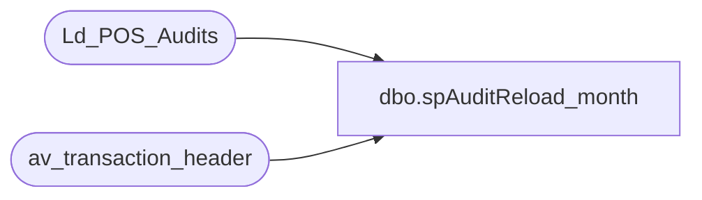

# dbo.spAuditReload_month

**Database:** auditworks  
**Server:** bedrockdb01  

## Architecture Diagram



## Table Dependencies

| Referenced Table |
|---|
| Ld_POS_Audits |
| av_transaction_header |

## Stored Procedure Code

```sql
CREATE  procedure [dbo].[spAuditReload_month] @date_beg datetime, @date_end datetime
as
-- =====================================================================================================
-- Name: spAuditReload_month
--
-- Description:	
--
-- Input:	
--			date range
--
-- Output: Resultset with the following columns:
--			N/A
--
-- Dependencies: None
--
-- Revision History
--		Name:			Date:			Comments:
--		?				08/24/2010		Initial version source control
-- =====================================================================================================

truncate table Ld_POS_Audits


--BUILD THE LIST OF TRANSACTION_IDs to DELETE/RELOAD--
INSERT INTO Ld_POS_Audits(transaction_id, modified_date)
select av_transaction_id, last_modified_date_time 
	from av_transaction_header 
	where transaction_date between @date_beg and @date_end
```

