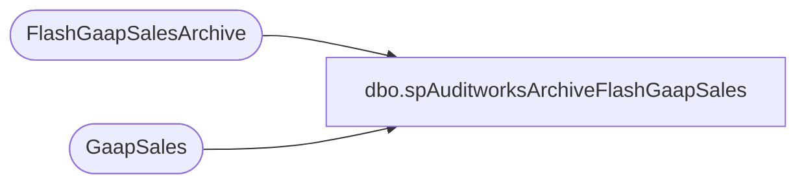

# dbo.spAuditworksArchiveFlashGaapSales

**Database:** auditworks  
**Server:** bedrockdb01  

## Architecture Diagram



## Table Dependencies

| Referenced Table |
|---|
| FlashGaapSalesArchive |
| GaapSales |

## Stored Procedure Code

```sql
create proc spAuditworksArchiveFlashGaapSales

as 

-- =====================================================================================================
-- Name: spAuditworksArchiveFlashGaapSales
--
-- Description:	Archives the flash gaap sales per store that was captured from the stores and/or auditworks by another process that runs daily 
--
--
-- Revision History
--		Name:			Date:			Comments:
--		Dan Tweedie		04/02/2015		Created proc.	
-- =====================================================================================================


set nocount on

insert FlashGaapSalesArchive
select *, getdate() 
from GaapSales
```

