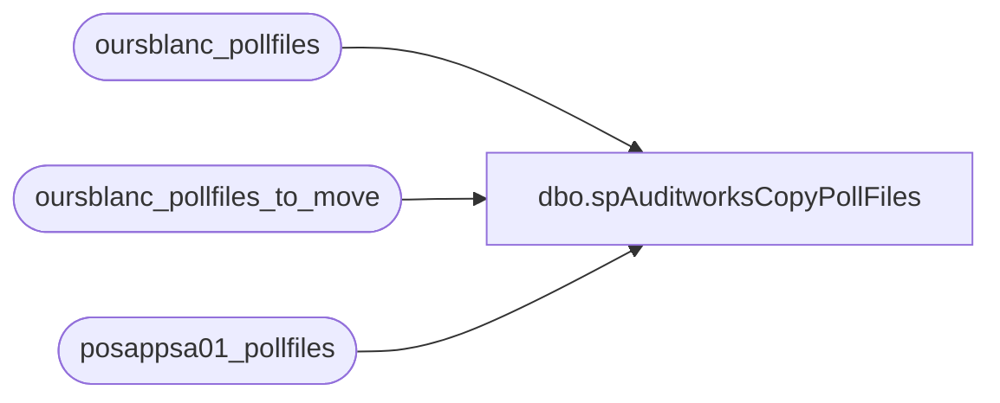

# dbo.spAuditworksCopyPollFiles

**Database:** auditworks  
**Server:** bedrockdb01  

## Architecture Diagram



## Table Dependencies

| Referenced Table |
|---|
| oursblanc_pollfiles |
| oursblanc_pollfiles_to_move |
| posappsa01_pollfiles |

## Stored Procedure Code

```sql
CREATE proc [dbo].[spAuditworksCopyPollFiles]

as 

-- =====================================================================================================
-- Name: spAuditworksCopyPollFiles
--
-- Description:	Copies foldes with .TR extension from \\Oursblanc\sybwork\POLLFILES_LIVE 
--				to \\posappsa01\sybwork\POLLFILES_LIVE if the file does not already exist on \\posappsa01\sybwork\POLLFILES_LIVE.
--				Deletes SRDW.DONE file from each copied folder, remove file extension from files, renames folder from .TR to .IP
--
-- Input:	NA
--
-- Output: Files output to \\posappsa01\sybwork\POLLFILES_LIVE
--
-- Dependencies: 
--
-- Revision History
--		Name:			Date:			Comments:
--		Dan Tweedie		09/28/2010		Created proc.	
-- =====================================================================================================

set nocount on 

--capture directory data from oursblanc 
if (object_id('auditworks..oursblanc_pollfiles') is not null) drop table oursblanc_pollfiles
create table oursblanc_pollfiles
(pollfiles varchar(1000))

insert oursblanc_pollfiles
EXEC master..xp_cmdshell "dir \\Oursblanc\sybwork\POLLFILES_LIVE"

--capture directory data from posappsa01
if (object_id('auditworks..posappsa01_pollfiles') is not null) drop table posappsa01_pollfiles
create table posappsa01_pollfiles
(pollfiles varchar(1000))

insert posappsa01_pollfiles
EXEC master..xp_cmdshell "dir \\posappsa01\sybwork\POLLFILES_LIVE"

---------
--cleanup capture tables to only show pollfiles directories
delete from oursblanc_pollfiles
where substring(pollfiles, 40, 3) not in ('AWC','AWL')
or pollfiles is null

update oursblanc_pollfiles
set pollfiles = substring(pollfiles, 40, 15)

delete from posappsa01_pollfiles
where substring(pollfiles, 40, 3) not in ('AWC','AWL')
or pollfiles is null

update posappsa01_pollfiles
set pollfiles = substring(pollfiles, 40, 15)

---------------------------
--compare oursblanc and posappsa01 to find TR records on oursblanc which are not on posappsa01
if (object_id('auditworks..oursblanc_pollfiles_to_move') is not null) drop table oursblanc_pollfiles_to_move
create table oursblanc_pollfiles_to_move
(pollfiles varchar(20))

insert oursblanc_pollfiles_to_move
select o.pollfiles
from oursblanc_pollfiles o 
--left join posappsa01_pollfiles p on substring(o.pollfiles, 5,8) = substring(p.pollfiles, 5,8)
left join posappsa01_pollfiles p on substring(o.pollfiles, 1,12) = substring(p.pollfiles, 1,12)
where p.pollfiles is null
and substring(o.pollfiles, 13,3) = '.TR'

---these are the directories that need to move
--select * from oursblanc_pollfiles_to_move
--------------------------------------------
------------------------------------------------------------------------------------------------------------------------------------
--now its time to get busy moving files, deleting files, renaming files, renaming folders

declare @counter int,
		@total int,
		@folder varchar(52),
		@copy varchar(1000),
		@delete varchar(1000),
		@rename_files varchar(1000),
		@rename_folder varchar(1000),
		@IP varchar(52)
		
select @counter = 1
select @total = count(pollfiles) from oursblanc_pollfiles_to_move

declare movie cursor for
	select pollfiles from oursblanc_pollfiles_to_move

open movie
	while @counter <= @total
		begin
			fetch next from movie into @folder
			
			set @copy = 'xcopy \\Oursblanc\sybwork\POLLFILES_LIVE\' + @folder +  ' \\posappsa01\sybwork\POLLFILES_LIVE\' + @folder + ' /e /i'
			exec master..xp_cmdshell @copy
			
			set @delete = 'del \\posappsa01\sybwork\POLLFILES_LIVE\' + @folder + '\SRDW.DONE'
			exec master..xp_cmdshell @delete
			
			set @rename_files = 'ren \\posappsa01\sybwork\POLLFILES_LIVE\' + @folder + '\*.TR *.'
			exec master..xp_cmdshell @rename_files
			
			set @IP = left(@folder, 13) + 'IP'
			set @rename_folder = 'ren \\posappsa01\sybwork\POLLFILES_LIVE\' + @folder + ' ' + @IP
			exec master..xp_cmdshell @rename_folder
			
			set @counter = @counter + 1
		end
close movie
deallocate movie
```

