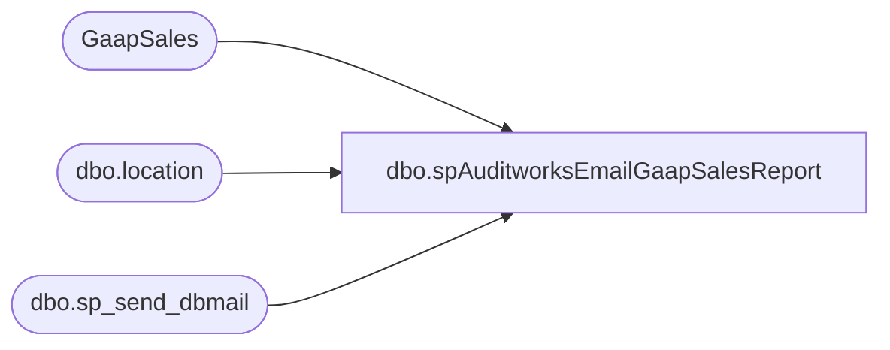

# dbo.spAuditworksEmailGaapSalesReport

**Database:** auditworks  
**Server:** bedrockdb01  

## Architecture Diagram



## Table Dependencies

| Referenced Table |
|---|
| GaapSales |
| dbo.location |
| dbo.sp_send_dbmail |

## Stored Procedure Code

```sql
CREATE proc [dbo].[spAuditworksEmailGaapSalesReport]
as

-- =====================================================================================================
-- Name: spAuditworksEmailGaapSalesReport
--
-- Description:	Gaptures GaapSales summary and details, emails report to Maxine and Tina.
--				This procedure is part of a larger SSIS process that captures the sales from the stores, web cart and Sales Audit.
--
-- Input:	na
--
-- Output: 
--
-- Dependencies: na
--				 
-- Revision History
--		Name:			Date:			Comments:
--		Dan Tweedie		10/30/2010		Created proc.	
--		Dan Tweedie		01/06/2011		Added Pop-Up stores (stores in 0600 range) to US total (@US_Total)
--		Dan Tweedie		01/11/2013		Commented out header record for France store summary (no longer have France stores), modified footer to show that job is run from Papamart
--		Dan Tweedie		02/21/2014		Added Santiago Beltran, removed Mark Geldemacher to/from the distribution list, see SD Incident 271935
--		Dan Tweedie		09/17/2014		Added Brian Popp to distribution
--		Dan Tweedie		10/14/2015		Added Chad Vitale to distribution
--		Dan Tweedie		11/23/2015		Altered schedule logic so report goes out at 8am, then from 9:45am and every 2 hours onward
--		Dan Tweedie		12/03/2015		Resumed original schedule logic so report goes out at 3:45pm and every 2 hours onward
--		Dan Tweedie		11/09/2016		Updated VAT, added VAT for China and Denmark
-- =====================================================================================================
set nocount on

--if (select datepart(hh, getdate())) in (7, 9, 11, 13, 15, 17, 19, 21, 23)
--	and
--   (select datepart(mi, getdate())) >= 45

if (select datepart(hh, getdate())) in (15, 17, 19, 21, 23)
	and
   (select datepart(mi, getdate())) >= 45

BEGIN 


	declare @email varchar(1000),
			@bc varchar(1000),
			@emailsubject varchar(1000),
			@text nvarchar(max),
			@US_Total as decimal(20,2),
			@CA_Total as decimal(20,2),
			@UK_Total as decimal(20,2),
			@FR_Total as decimal(20,2),
			@IR_Total as decimal(20,2),
			@UK_VAT as decimal(8,4),
			@IR_VAT as decimal(8,4),
			@FR_VAT as decimal(8,4),
			@DK_VAT as decimal(8,4),
			@CN_VAT as decimal(8,4)

	set @email = 'jeffk@buildabear.com;santiagob@buildabear.com;BrianP@buildabear.com;chadv@buildabear.com'
	set @bc = 'biadmin@buildabear.com'
	set @emailsubject = 'Flash GAAP Sales Report as of ' + convert(varchar(20),getdate(),100) 
	set @UK_VAT = 1.2
	set @IR_VAT = 1.23
	set @FR_VAT = 1.196
	set @DK_VAT = 1.25
	set @CN_VAT = 1.17

	IF (OBJECT_ID('tempdb..#location') IS NOT NULL ) DROP TABLE #location
	create table #location
	(location_code varchar(4),
	jurisdiction_id varchar(20),
	location_name varchar(100))

	insert #location
	select location_code, jurisdiction_id, location_name
	from BEDROCKDB02.me_01.dbo.location

	IF ( OBJECT_ID('tempdb..#GaaoSales') IS NOT NULL ) DROP TABLE #GaapSales

	SELECT 	l.location_code,
       		l.location_name,
       		case when jurisdiction_id = 5 and source = 'Coalition' then cast(isnull(net_sales,0.00)/@IR_VAT as decimal(10,2))
		when jurisdiction_id = 4  and source = 'Coalition' then cast(isnull(net_sales,0.00)/@FR_VAT as decimal(10,2))
		when jurisdiction_id = 2  and source = 'Coalition' and gs.location_code <> 2013 then cast(isnull(net_sales,0.00)/@UK_VAT as decimal(10,2))
		when jurisdiction_id = 7 and source = 'Coalition' then cast(isnull(net_sales,0.00)/@DK_VAT as decimal(10,2))
		when jurisdiction_id = 8 and source = 'Coalition' then cast(isnull(net_sales,0.00)/@CN_VAT as decimal(10,2))
		else cast(isnull(net_sales,0.00) as decimal(10,2))
		end as net_sales,
		entry_date,
		gs.source
	into #GaapSales
	from GaapSales gs
	join #location l on	gs.location_code = l.location_code
	order by gs.location_code

	set @US_Total = isnull((select sum(net_sales) 
	from #GaapSales
	where location_code in (select location_code from #location where jurisdiction_id = 1) and (location_code < '0400' or location_code between '0600' and '0699')),0.00)

	set @CA_Total = isnull((select sum(net_sales) 
	from #GaapSales
	where location_code in (select location_code from #location where jurisdiction_id = 3)) ,0.00)

	set @UK_Total = isnull((select sum(net_sales) 
	from #GaapSales
	where location_code in (select location_code from #location where jurisdiction_id in (2,5))),0.00)

	set @FR_Total = isnull((select sum(net_sales) 
	from #GaapSales
	where location_code in (select location_code from #location where jurisdiction_id in (4))) ,0.00)

	set @IR_Total = isnull((select sum(net_sales) 
	from #GaapSales
	where location_code in (select location_code from #location where jurisdiction_id in (5))),0.00)

	set @text = '
	<font face =arial size = 2> USA Stores Total (excluding RZ and Corporate Sales)- <b>$' + cast(@US_Total as varchar(20)) + 
	'</b></p> Canada Stores Total - <b>$' + cast(@CA_Total as varchar(20)) +
	'</b></p> UK Stores Total - <b>£' + cast(@UK_Total as varchar(20)) +
	--'</b></p> France Stores Total - <b>€' + cast(@FR_Total as varchar(20)) +
	'</b></p> Ireland Store Total - <b>€' + cast(@IR_Total as varchar(20)) +

		'</b><H1>Flash GAAP Sales Report</H1>' +
		'<table border="1">' +
		'<tr><th>Store #</th><th>Store Name</th>' +
		'<th>Flash Sales</th><th>Entry Date/Time</th><th>Data Source</th></tr><font face =arial size = 2>' +
		CAST ( ( SELECT td = location_code,'',
						td = location_name, '',
						td = net_sales, '',
						td = entry_date, '',
						td = source, ''
				  from #GaapSales order by location_code
				  FOR XML PATH('tr'), TYPE 
		) AS NVARCHAR(MAX) ) +
		'</font></table></font></p></p>
		<br>
		<font face =arial size = 1>This report was run from Papamart SQL Agent: GaapSalesFlashEmail.</font>
		<br>
		<br>
	<font face =arial size = 1><i>The information in this message may be privileged, “confidential” and protected from disclosure and/or intended only for the addressee(s) named above.  If the reader of this message is not the intended recipient, or an employee or agent responsible for delivering this message to the intended recipient, you are hereby notified that any dissemination, distribution or copying of the communication is strictly prohibited.  If you have received this communication in error, please notify us immediately by replying to the message and deleting it from your computer.  Thank you beary much.</i></font>'

	exec msdb.dbo.sp_send_dbmail
		@profile_name = 'SQLServices',
		@recipients = @email,
		@blind_copy_recipients = @bc,
		@body = @text,
		@subject = @emailsubject,
	@body_format = 'HTML'


END
```

