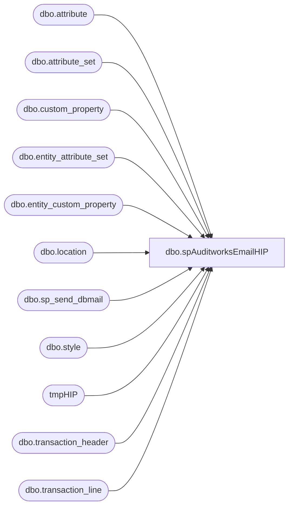

# dbo.spAuditworksEmailHIP

**Database:** auditworks  
**Server:** bedrockdb01  

## Architecture Diagram



## Table Dependencies

| Referenced Table |
|---|
| dbo.attribute |
| dbo.attribute_set |
| dbo.custom_property |
| dbo.entity_attribute_set |
| dbo.entity_custom_property |
| dbo.location |
| dbo.sp_send_dbmail |
| dbo.style |
| tmpHIP |
| dbo.transaction_header |
| dbo.transaction_line |

## Stored Procedure Code

```sql
CREATE proc [dbo].[spAuditworksEmailHIP]
as 
-- =====================================================================================================
-- Name: spAuditworksEmailHIP
--
-- Description:	Captures sales data for electronic sounds, sends email to HIP Digital. 
--
-- Input:	n/a
--
-- Output: 2 csv files to: \\kermode\FileRepository\AUDITWORKS\SQLFiles\HIP\ (one for UMG, one for WMG)
--
-- Dependencies: n/a
--
-- Revision History
--		Name:			Date:			Comments:
--		Dan Tweedie		1/10/2011		Created proc.	
--		Dan Tweedie		02/18/2013		Changed file output directory, added code to delete the files after being emailed
--		Dan Tweedie		05/10/2013		Added code at end of procedures to move the files from kermode server (instead of deleting them) to \\kermode\FileRepository\MERCHANDISING\hip\ so the Physical Inventory team can access the files. They don't want to get an email, they just want the files as their convenience.
--		Dan Tweedie		1/13/2015		Removed UMG sales by request of Lisa Waggoner. See notations marked '--danT - 1/13/2015'
-- =====================================================================================================

set nocount on 

---capture all sales data for UMG and WMG into temp table

IF ( OBJECT_ID('auditworks..tmpHIP') IS NOT NULL ) DROP TABLE tmpHIP
SELECT	ecp.custom_property_value AS track_id, --<< Track ID linking
		CONVERT(VARCHAR,DATEADD(HOUR,+(cast(att.attribute_set_label as int)),th.entry_date_time),120) AS transaction_datetime_GMT,
		th.store_no,
		th.transaction_no,
		th.register_no,
		tl.reference_no,
		case when tl.line_action = 1
			then 'Sale'
			else 'Return'
		end TransType, 
		att_HV.attribute_set_code Vendor
into tmpHIP
FROM	auditworks.dbo.transaction_line tl (nolock) 
join	auditworks.dbo.transaction_header th (nolock) on tl.transaction_id = th.transaction_id
join	BEDROCKDB02.me_01.dbo.style s on tl.reference_no COLLATE SQL_Latin1_General_CP1_CI_AS = s.style_code
join	BEDROCKDB02.me_01.dbo.entity_custom_property ecp  on s.style_id = ecp.parent_id
join	BEDROCKDB02.me_01.dbo.custom_property cp  on ecp.custom_property_id = cp.custom_property_id
join	BEDROCKDB02.me_01.dbo.location l  on right('0000' + cast(th.store_no as varchar(4)),4) COLLATE SQL_Latin1_General_CP1_CI_AS = l.location_code 
join	BEDROCKDB02.me_01.dbo.entity_attribute_set eas  on l.location_id = eas.parent_id
join	BEDROCKDB02.me_01.dbo.attribute_set att  on eas.attribute_set_id = att.attribute_set_id
join	BEDROCKDB02.me_01.dbo.attribute a  on att.attribute_id = a.attribute_id
join	BEDROCKDB02.me_01.dbo.entity_attribute_set eas_HV  on s.style_id = eas_HV.parent_id
join	BEDROCKDB02.me_01.dbo.attribute_set att_HV  on eas_HV.attribute_set_id = att_HV.attribute_set_id
join	BEDROCKDB02.me_01.dbo.attribute a_HV  on att_HV.attribute_id = a_HV.attribute_id
WHERE	th.transaction_date BETWEEN CONVERT(VARCHAR,DATEADD(DAY,-7,GETDATE()),111) AND CONVERT(VARCHAR,DATEADD(DAY,-1,GETDATE()),111)
AND		a.attribute_code = 'TMZN' 
AND		a.parent_type = 2
AND		cp.cust_prop_code = 'TRK ID'
AND		th.transaction_void_flag = 0 
AND		tl.line_void_flag = 0
AND		tl.line_object = 100
AND		a_HV.attribute_code = 'HIPVEN'
AND		att_HV.attribute_set_code in ('WMG')
ORDER BY 2

if (select count(*) from tmpHIP) > 0

Begin
---export csv file for UMG data
	declare @fileU varchar(100),
			@fileW varchar(100),
			@query varchar(1000),
			@date varchar(200),
			@file_name varchar(100),
			@file_location varchar(100),
			@server varchar(20),
			@database varchar(20),
			@sqlcmd varchar(1000)


	set @date = convert(varchar, datepart(yyyy, getdate())) + '-' + convert(varchar, datepart(mm, getdate())) + '-' +  convert(varchar, datepart(dd, getdate()))
	set @query = 'set nocount on select * from tmpHIP where Vendor = ''UMG'''
	set @file_location = '\\kermode\FileRepository\AUDITWORKS\HIP\'  
	set @file_name = 'BABW_HIP_UMG_' + @date + '.csv'
	set @server = 'BEDROCKDB01'
	set @database = 'auditworks'
	set @sqlcmd = 'sqlcmd -S' + @server + ' -d' + @database + ' -Q' + '"' + @query + '"' + ' -o' + '"' + @file_location + @file_name + '"' + ' -s"," -w100 -W'
	--exec master..xp_cmdshell @sqlcmd ----danT - 1/13/2015

	set @fileU = @file_location + @file_name
---export csv file for WMG data

	set @query = 'set nocount on select * from tmpHIP where Vendor = ''WMG'''
	set @file_name = 'BABW_HIP_WMG_' + @date + '.csv'
	set @sqlcmd = 'sqlcmd -S' + @server + ' -d' + @database + ' -Q' + '"' + @query + '"' + ' -o' + '"' + @file_location + @file_name + '"' + ' -s"," -w100 -W'
	
	exec master..xp_cmdshell @sqlcmd

	set @fileW = @file_location + @file_name

	
	---generate email
	declare @text varchar(4000),
			@subj varchar(100),
			@attach varchar(1000)
			
	set @text = 'Please see attached HIP report from Build-A-Bear Workshop for WMG.'
			+ char(10) + char(13)+
			'Replies to this email are not being monitored.'
			+ char(10) + char(13)+
			+ char(10) + char(13)+
			'*Technical Reference:'
			+ char(10) + char(13)+	
			'	SQL Agent: Auditworks.PROCESS-HIP-REPORTS'
			+ char(10) + char(13)+
			'	Procedure: spAuditworksEmailHIP'
			+ char(10) + char(13)
			
	set @subj = 'Build-A-Bear Workshop HIP Report: ' + @date
	--set @attach = @fileU + ';' + @fileW --danT - 1/13/2015
	set @attach = @fileW --danT - 1/13/2015
	
	exec msdb.dbo.sp_send_dbmail
		@profile_name = 'MerchAdmin',
		@recipients = 'awilson@hipdigital.com;josh@hipdigital.com;cwalker@hipdigital.com',
		@blind_copy_recipients = 'merchadmin@buildabear.com',
		@body = @text,
		@subject = @subj,
		@file_attachments = @attach

		-------------------------------------------------------------------
		--added 5/10/2013
		--move files to merch share for phsical inventory to access
		declare @move varchar(1000)

		--set @move = 'move ' + @fileU + ' \\kermode\FileRepository\MERCHANDISING\hip\HIP_Reports\' --danT - 1/13/2015
		--exec master..xp_cmdshell @move --danT - 1/13/2015

		set @move = 'move ' + @fileW + ' \\kermode\FileRepository\MERCHANDISING\HIP\HIP_Reports\'
		exec master..xp_cmdshell @move


end
```

