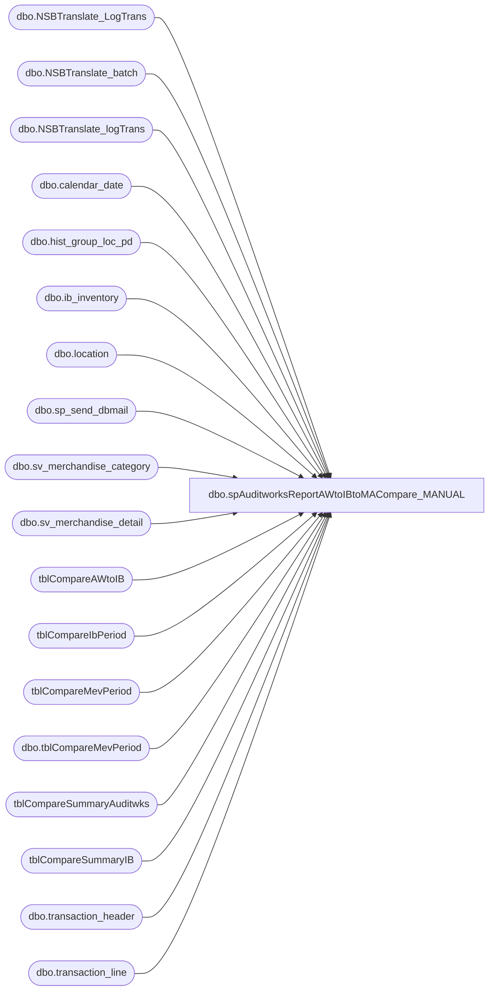

# dbo.spAuditworksReportAWtoIBtoMACompare_MANUAL

**Database:** auditworks  
**Server:** bedrockdb01  

## Architecture Diagram



## Table Dependencies

| Referenced Table |
|---|
| dbo.NSBTranslate_LogTrans |
| dbo.NSBTranslate_batch |
| dbo.NSBTranslate_logTrans |
| dbo.calendar_date |
| dbo.hist_group_loc_pd |
| dbo.ib_inventory |
| dbo.location |
| dbo.sp_send_dbmail |
| dbo.sv_merchandise_category |
| dbo.sv_merchandise_detail |
| tblCompareAWtoIB |
| tblCompareIbPeriod |
| tblCompareMevPeriod |
| dbo.tblCompareMevPeriod |
| tblCompareSummaryAuditwks |
| tblCompareSummaryIB |
| dbo.transaction_header |
| dbo.transaction_line |

## Stored Procedure Code

```sql
CREATE proc [dbo].[spAuditworksReportAWtoIBtoMACompare_MANUAL]

as

-- =====================================================================================================
-- Name: spAuditworksReportAWtoIBtoMACompare
--
-- Description:	Validates data between Auditworks, Merchandising and Merchandise Analytics
--				Replaces Beehive DTS job: Daily_03_AW_IB_MA_Balance V9.0 (MERCH 4.2 LIVE)
--
-- Input:	na
--
-- Output: If discrepancies are found, results are emailed.
--
-- Dependencies: na
--				 
-- Revision History
--		Name:			Date:			Comments:
--		Dan Tweedie		08/17/2010		Created proc.	
--		Dan Tweedie		06/11/2013		Updated proc to add step at the end to delete any files (if they exist from the previous run)
--      Keith Lee		7/15/2015		Modified proc to compare by specific day, will also need to update various areas.
--		Paul Beckman	09/07/2017		Updated Subject and Message Body for directory check
-- =====================================================================================================

set nocount on


---Process is broken into 3 major steps:
--- 1) Gather data from BEDROCKDB01.Auditworks & BEARWEBDB.WebCart_Commerce
--- 2) Gather data from ME_01 (Merchandising)
--- 3) Compare data and send emails

--- STEP 1 --- Gather data from BEDROCKDB01.Auditworks & BEARWEBDB.WebCart_Commerce

IF (Object_ID('tempdb..#AWlog') IS NOT NULL) DROP TABLE #AWlog
IF (Object_ID('tempdb..#exported') IS NOT NULL) DROP TABLE #exported

	declare @startDate datetime, @endDate datetime
		
	set @startDate = CONVERT(char,DATEADD(day,-1,GETDATE()),101) 
	set @endDate = CONVERT(char,DATEADD(day,-1,GETDATE()),101)

	select t.sOrderNumber
		, t.iAWTransID as AWtrans 
	into #AWlog
	from BEARWEBDB.WebCart_commerce.dbo.NSBTranslate_logTrans t 
		INNER join BEARWEBDB.WebCart_commerce.dbo.NSBTranslate_batch b 
			on t.sBatchID=b.sBatchID
	where b.bSentToAW = 1 
		AND b.dTimeStamp between @startDate and @endDate

	select lt.sStore as WC_store_no
		, awl.sOrderNumber as WC_order_number
		, awl.AWtrans as WC_transaction_no
		, CONVERT(char,lt.dTimeStamp,101) as WC_exported_date
		, lt.iUnits as WC_Units
		, lt.mAmount as WC_Net_Sales
	INTO #exported
	from BEARWEBDB.WebCart_commerce.dbo.NSBTranslate_LogTrans lt
		INNER join #AWlog awl 
			ON awl.AWtrans = lt.iAWTransID
	where lt.dTimeStamp between @startDate and @endDate
	order by awl.AWtrans desc
------------------------------------------------------------------------------------------------------------------

IF (Object_ID('auditworks..tblCompareSummaryAuditwks') IS NOT NULL) DROP TABLE tblCompareSummaryAuditwks

	CREATE TABLE [tblCompareSummaryAuditwks] (
	[aw_store] [int] NOT NULL,
	[aw_date] [smalldatetime] NOT NULL,
	[aw_units] [int] NULL,
	[aw_sales] [int] NULL ) 
	ON [PRIMARY]


	-- Builds Store Net Sales

	IF (Object_ID('tempdb..#SVWORK0') IS NOT NULL) DROP TABLE #SVWORK0

		SELECT a.store_no
			, a.transaction_date
			, SUM(b.gross_line_amount * b.db_cr_none * b.voiding_reversal_flag) as Net_Sales 
		INTO #SVWORK0  
		FROM auditworks.dbo.transaction_header a
			INNER JOIN auditworks.dbo.transaction_line b 
				ON a.transaction_id=b.transaction_id
		WHERE (a.transaction_date Between @startDate and @endDate
			AND (a.store_no Between 1 and 990 or a.store_no between 1500 and 1599 or a.store_no between 2000 and 3000)
			AND a.transaction_void_flag = 0 
			AND b.line_void_flag=0 
			AND b.line_object IN (100,101,400,405)
			and b.interface_rejection_flag = 0 
			and a.sa_rejection_flag = 0
		) 
		GROUP BY a.store_no,a.transaction_date 
		order by store_no

	-- Builds Store Units
	IF (Object_ID('tempdb..#SVWORK1') IS NOT NULL) DROP TABLE #SVWORK1

		SELECT 	a.store_no, 
			a.transaction_date, 
			SUM(c.units * c.db_cr_none*-1 * c.voiding_reversal_flag) as Units 
		INTO #SVWORK1  
		FROM auditworks.dbo.transaction_header a
			INNER JOIN auditworks.dbo.transaction_line b
				ON a.transaction_id=b.transaction_id 
			INNER JOIN auditworks.dbo.sv_merchandise_detail c 
				ON b.transaction_id=c.transaction_id 
					AND b.line_id=c.line_id
		WHERE (a.transaction_date Between @startDate and @endDate
			AND (a.store_no Between 1 and 990 or a.store_no between 1500 and 1599 or a.store_no between 2000 and 3000)
			AND a.transaction_void_flag = 0 
			AND b.line_void_flag=0 
			AND b.line_object IN (100,101,400,405)
		and b.interface_rejection_flag = 0 
		and a.sa_rejection_flag = 0
		) 
		GROUP BY a.store_no,a.transaction_date 

	-- Builds Gift Card Units
	IF (Object_ID('tempdb..#SVWORK2') IS NOT NULL) DROP TABLE #SVWORK2

		SELECT c.store_no
			, c.transaction_date
			, sum(cast(d.units as int)) as GiftCardsUnits
		INTO #SVWORK2
		FROM auditworks.dbo.sv_merchandise_category b 
			INNER JOIN auditworks.dbo.sv_merchandise_detail d
				ON b.code = d.merchandise_category
			INNER JOIN auditworks.dbo.transaction_header c
				ON c.transaction_id = d.transaction_id
			INNER JOIN auditworks.dbo.transaction_line e 
				ON e.transaction_id=d.transaction_id
					AND e.line_id=d.line_id
					AND c.transaction_id=e.transaction_id  
		WHERE  c.transaction_date Between @startDate and @endDate
			AND c.transaction_void_flag = 0 
			AND e.line_object in (405)
		GROUP BY 
			c.store_no,c.transaction_date
		order by c.store_no

	-- Merges Units Together (not including stores that didn't have Gift Cards)
	IF (Object_ID('tempdb..#SVWORK3') IS NOT NULL) DROP TABLE #SVWORK3

		select 	a.store_no, a.transaction_date, (a.Units + isnull(b.GiftCardsUnits,0)) as Units
		into	#SVWORK3
		from	#SVWORK1 a
		left join #SVWORK2 b on	a.store_no = b.store_no	and	a.transaction_date = b.transaction_date
		order by a.store_no

	-- Finds Missing Stores that didn't have Gift Cards
	IF (Object_ID('tempdb..#SVWORK4') IS NOT NULL) DROP TABLE #SVWORK4

		select a.store_no, a.transaction_date, a.Units
		into	#SVWORK4
		from	#SVWORK1 a
		where	not exists 	(select * 
					from #SVWORK3 b
					where a.store_no = b.store_no)
		order by a.store_no

	-- Insert missing Stores

	insert into #SVWORK3
	select * from #SVWORK4

	-- Build final table; tblCompareSummaryAuditwks

	insert into tblCompareSummaryAuditwks
	SELECT DISTINCT #SVWORK0.store_no, 
			#SVWORK0.transaction_date, 
			#SVWORK3.Units, 
			#SVWORK0.Net_Sales
	FROM #SVWORK0
		LEFT OUTER JOIN #SVWORK3 
			ON #SVWORK0.store_no = #SVWORK3.store_no
				AND #SVWORK0.transaction_date = #SVWORK3.transaction_date
	order by 	#SVWORK0.store_no, 
			#SVWORK0.transaction_date

------------------------------------------------------------------------------------------------------------------

------------------------------------------------------------------------------------------------------------------
--- STEP 2 --- Gather data from ME_01 & MA_01 (Merchandising)

IF (Object_ID('auditworks..tblCompareIbPeriod') IS NOT NULL) DROP TABLE tblCompareIbPeriod

	CREATE TABLE [tblCompareIbPeriod] (
	[ib_store] [varchar] (20) NOT NULL ,
	[ib_sales] [int] NULL ) 
	ON [PRIMARY]

	declare @mindate datetime, @maxdate datetime

	select @mindate = min(c1.calendar_date), @maxdate = max(c1.calendar_date)
	from BEDROCKDB02.me_01.dbo.calendar_date c1 
		inner join BEDROCKDB02.me_01.dbo.calendar_date c2 
			on c1.merch_year=c2.merch_year 
				and c1.merch_period=c2.merch_period
	where c2.calendar_date = cast(cast(Month(getdate())
							as varchar(2)) + '/' + cast(Day(getdate()-1) 
							as varchar(2)) + '/' + cast(Year(getdate()) 
							as varchar(4)) as datetime)

	insert into tblCompareIbPeriod
	select l.location_code, isnull(sum(b.transaction_units),0)
	from BEDROCKDB02.me_01.dbo.ib_inventory b
		INNER JOIN BEDROCKDB02.me_01.dbo.location l
			ON b.location_id = l.location_id
	where b.transaction_date between @mindate and @maxdate
		and b.transaction_type_code = '600'
		and l.location_type = 2
	group by l.location_code
	order by l.location_code

------------------------------------------------------------------------------------------------------------------
IF (Object_ID('auditworks..tblCompareSummaryIB') IS NOT NULL) DROP TABLE tblCompareSummaryIB

	CREATE TABLE [tblCompareSummaryIB] (
	[ib_store] [int] NOT NULL ,
	[ib_date] [smalldatetime] NOT NULL ,
	[ib_units] [int] NULL ,
	[ib_sales] [int] NULL ) 
	ON [PRIMARY]
	
	insert into tblCompareSummaryIB
	SELECT b.location_code
		, a.transaction_date, 
		ABS(SUM(a.transaction_units)) as Units, SUM(a.transaction_selling_retail) as Retail
	FROM BEDROCKDB02.me_01.dbo.ib_inventory a
		INNER JOIN BEDROCKDB02.me_01.dbo.location b 
			ON a.location_id = b.location_id 
	WHERE (a.transaction_date Between @startDate and @endDate
		AND a.transaction_type_code Between 599 and 651)
	GROUP BY b.location_code,a.transaction_date
	order by b.location_code,a.transaction_date

----------------------------------------------------------------------------------------------
IF (Object_ID('auditworks..tblCompareAWtoIB') IS NOT NULL) DROP TABLE tblCompareAWtoIB
	
	CREATE TABLE [tblCompareAWtoIB] (
	[aw_store] [int] NOT NULL ,
	[ib_store] [int] NULL ,
	[aw_date] [smalldatetime] NOT NULL ,
	[aw_units] [int] NULL , 
	[ib_units] [int] NULL ,
	[aw_ib_diff] [int] NULL) 

	insert into tblCompareAWtoIB
	select Distinct a.aw_store, b.ib_store, a.aw_date, a.aw_units, b.ib_units, (a.aw_units-b.ib_units) as aw_ib_diff        
	from tblCompareSummaryAuditwks a (nolock)
	left outer join tblCompareSummaryIB b (nolock) on a.aw_store = b.ib_store AND a.aw_date = b.ib_date
----------------------------------------------------------------------------------------------
IF (Object_ID('auditworks..tblCompareMevPeriod') IS NOT NULL) DROP TABLE tblCompareMevPeriod
	
	CREATE TABLE [tblCompareMevPeriod] (
	mev_store varchar(20) NOT NULL,
	mev_sales int NULL )
	
	insert tblCompareMevPeriod
	select l.location_code, sum(h.sales_total_units) as sales
	from BEDROCKDB02.ma_01.dbo.hist_group_loc_pd h
		INNER JOIN BEDROCKDB02.ma_01.dbo.calendar_date c
			ON h.merch_year_pd = (convert(varchar,c.merch_year) + REPLICATE('0', 2 - LEN(convert(varchar,c.merch_period)))+ convert(varchar,c.merch_period))
		INNER JOIN BEDROCKDB02.ma_01.dbo.location l
			ON h.location_id = l.location_id
				and l.location_type = 2
	where c.calendar_date =  cast(convert(varchar,getdate()-1,1) as smalldatetime)
	group by l.location_code
	having sum(h.sales_total_units) > 0
	order by l.location_code
----------------------------------------------------------------------------------------------

----------------------------------------------------------------------------------------------
--STEP 3 --- Compare data and send emails

		declare @subject varchar(100),
				@query varchar(1000),
				@body varchar(4000),
				@foot varchar(500)
				
				
		if (select count(*) from tblCompareAWtoIB where aw_ib_diff > 20 or ib_store is null) <> 0
			begin
				set @subject = 'AW to IB comparison - PROBLEM'
				set @body = 'Discrepancies exist between Auditworks and Merchandising.'
							+ char(10) + char(13) 
				set @query = 'set nocount on 
								select aw_store STORE, aw_units AW_UNITS, ib_units IB_UNITS, aw_ib_diff DIFF 
								from auditworks.dbo.tblCompareAWtoIB 
								where aw_ib_diff > 20 or ib_store is null
								order by aw_store 
								select ''Controlled by stored procedure: BEDROCKDB01.Auditworks.spAuditworksReportAWtoIBtoMACompare'''
			end
		ELSE
			begin
				set @subject = 'AW to IB comparison - NO PROBLEM'
				set @body = 'Discrepancies DO NOT exist between Auditworks and Merchandising.'
							+ char(10) + char(13) 
				set @query = 'set nocount on 
								select ''Controlled by stored procedure: BEDROCKDB01.Auditworks.spAuditworksReportAWtoIBtoMACompare'''
				
			end
			
		begin					
			EXEC msdb.dbo.sp_send_dbmail
			@recipients = 'poll@buildabear.com',
			@body = @body,
			@query = @query,
			@subject = @subject,
			@profile_name = 'SQLServices' 
		end
		
-----------

		if (select count(*) from tblCompareIbPeriod b, dbo.tblCompareMevPeriod m where b.ib_store = m.mev_store	and ABS(b.ib_sales) <> m.mev_sales) <> 0
			begin
				set @subject = 'Mev to IB comparison - PROBLEM'
				set @body = 'Discrepancies exist between Merchandising and Merchandise Analytics.'
				set @query = 'set nocount on 
								select b.ib_store, b.ib_sales, m.mev_sales 
								from auditworks.dbo.tblCompareIbPeriod b
									INNER JOIN auditworks.dbo.tblCompareMevPeriod m 
										ON b.ib_store = m.mev_store
								where ABS(b.ib_sales) <> m.mev_sales
								order by b.ib_store 
								select ''Controlled by stored procedure: BEDROCKDB01.Auditworks.spAuditworksReportAWtoIBtoMACompare'''
			end
						
		ELSE
		
			begin
				set @subject = 'Mev to IB comparison - NO PROBLEM'
				set @body = 'Discrepancies DO NOT exist between Merchandising and Merchandise Analytics.'
				set @query = 'set nocount on 
								select ''Controlled by stored procedure: BEDROCKDB01.Auditworks.spAuditworksReportAWtoIBtoMACompare'''
			end
			
		begin					
			EXEC msdb.dbo.sp_send_dbmail 
			@recipients = 'poll@buildabear.com',
			@body = @body,
			@query = @query,
			@subject = @subject,
			@profile_name = 'SQLServices'
		end
-----------------------------------------------------------------------------------------------------------------------------
		--produce the files in case email is down, we can still see the file.
		------------------------------------
		--produce the file in case email is down, we can still see the file.
		----****UPDATED 06/11/2013**** 
		-----Check to make sure the file directory exists, send an alert to call posAdmin if directory does not exist
			IF (Object_ID('tempdb..#DIR_') IS NOT NULL) DROP TABLE #DIR_
			create table #DIR_ (output varchar(1000))
			insert #DIR_ exec master..xp_cmdshell 'dir \\kermode\FileRepository\AUDITWORKS /B'
			delete from #DIR_ where output is null or output = 'File Not Found' or output <> 'SQLFiles'
			if (select count(*) from #DIR_ where output = 'SQLFiles') = 0

			begin
				EXEC msdb.dbo.sp_send_dbmail
				@recipients = 'poll@buildabear.com',
				@body = 'PLEASE CALL Merch Admin On-Call:  314-423-8000 x1008 AND ADVISE THAT DIRECTORY DOES NOT EXIST -> \\kermode\FileRepository\AUDITWORKS\SQLFiles',
				@subject = 'Directory does not exist -PROBLEM - CALL Merch Admin On-Call',
				@profile_name = 'SQLServices' 
			end

		if (select count(*) from #DIR_ where output = 'SQLFiles') > 0
		begin

			----DELETE FILES IN THE DIRECTORY BEFORE CREATING NEW FILES, THIS WAY IF NO FILES EXIST IN THE DIRECTORY, WE KNOW THEY DIDN'T GET CREATED AT RUN TIME
				IF (Object_ID('tempdb..#DIR') IS NOT NULL) DROP TABLE #DIR
				create table #DIR (output varchar(1000))
				insert #DIR exec master..xp_cmdshell 'dir \\kermode\FileRepository\AUDITWORKS\SQLFiles\*.csv /B'
				delete from #DIR where output is null or output = 'File Not Found'
			
				if (select count(*) from #DIR) > 0
					BEGIN
						declare @deleteFiles varchar(52)
						select @deleteFiles = 'del \\kermode\FileRepository\AUDITWORKS\SQLFiles\*.csv'
						exec master..xp_cmdshell @deleteFiles
					END


		begin	
			declare @file_name2 varchar(100),
					@file_location2 varchar(100),
					@osql2 varchar(1000),
					@database2 varchar(52),
					@query3 varchar(4000)

			set @file_location2 = '\\kermode\FileRepository\AUDITWORKS\SQLFiles\'
			set @file_name2 = 'IB_MA_CompResults.csv'
			set @database2 = 'auditworks'
			set @query3 = 'set nocount on select b.ib_store STORE, b.ib_sales IB_SALES, m.mev_sales MEV_SALES from auditworks.dbo.tblCompareIbPeriod b INNER JOIN auditworks.dbo.tblCompareMevPeriod m ON b.ib_store = m.mev_store where ABS(b.ib_sales) <> m.mev_sales order by b.ib_store'
			set @osql2 = 'sqlcmd' + ' -d' + @database2 + ' -Q' + '"' + @query3 + '"'  + ' -s"," ' + ' -o' + '"' + @file_location2 + @file_name2 + '"' + ' -w1000'
			exec master..xp_cmdshell @osql2
		end

		begin	
				declare @file_name varchar(100),
						@file_location varchar(100),
						@osql varchar(1000),
						@database varchar(52),
						@query2 varchar(4000)

				set @file_location = '\\kermode\FileRepository\AUDITWORKS\SQLFiles\'
				set @file_name = 'aw_ibCompResults.csv'
				set @database = 'auditworks'
				set @query2 = 'set nocount on select aw_store STORE, aw_units AW_UNITS, ib_units IB_UNITS, aw_ib_diff DIFF from auditworks.dbo.tblCompareAWtoIB where aw_ib_diff > 20 or ib_store is null order by aw_store'
				set @osql = 'sqlcmd' + ' -d' + @database + ' -Q' + '"' + @query2 + '"'  + ' -s"," ' + ' -o' + '"' + @file_location + @file_name + '"' + ' -w1000'
				exec master..xp_cmdshell @osql	
			end


END
```

