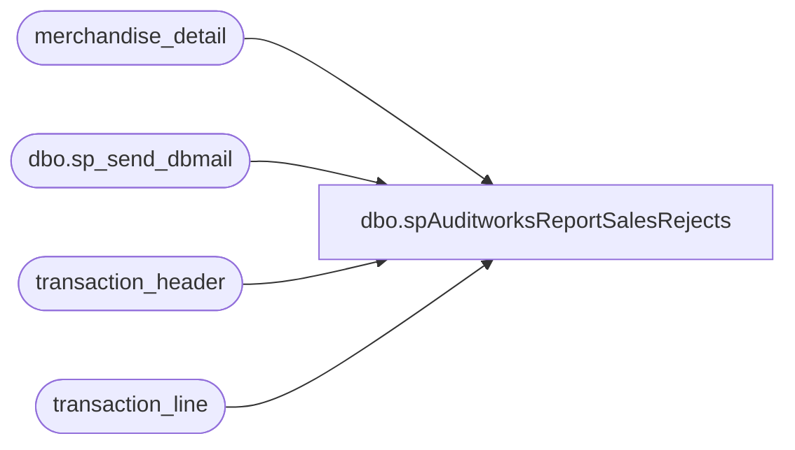

# dbo.spAuditworksReportSalesRejects

**Database:** auditworks  
**Server:** bedrockdb01  

## Architecture Diagram



## Table Dependencies

| Referenced Table |
|---|
| merchandise_detail |
| dbo.sp_send_dbmail |
| transaction_header |
| transaction_line |

## Stored Procedure Code

```sql
CREATE proc [dbo].[spAuditworksReportSalesRejects]

as


-- =====================================================================================================
-- Name: spAuditworksReportSalesRejects
--
-- Description:	Captures SA and IF rejects from Auditworks, sends emails.
--				Replaces Beehive DTS job: Auditworks Sales Rejects Check V.1.1
--
-- Input:	na
--
-- Output: If discrepancies are found, results are emailed.
--
-- Dependencies: na
--				 
-- Revision History
--		Name:			Date:			Comments:
--		Dan Tweedie		08/18/2010		Created proc.	
-- =====================================================================================================

set nocount on
--Process has 2 steps:
	--1) Look for SA Rejects, produce file, send email
	--2) Look for IF Rejects, produce file, send email
	
---STEP 1

BEGIN
	declare @subject varchar(100),
			@query varchar(1000),
			@body varchar(4000)

		if (select count(*)
			FROM transaction_header a, transaction_line b, merchandise_detail c
			WHERE sa_rejection_flag<>0
			AND transaction_date Between CONVERT(char,DATEADD(day,-1,GETDATE()),101) and   CONVERT(char,DATEADD(day,-1,GETDATE()),101)
			AND a.transaction_id=b.transaction_id
			AND a.transaction_id=c.transaction_id
			AND transaction_category in (1,2)
			AND line_object in (100,404)
			AND line_action in (1,2)
			AND b.line_id=c.line_id
			AND transaction_void_flag=0
			AND line_void_flag=0) <> 0 

			begin
				set @subject = 'SA Reject Check - PROBLEM (AW v5)'
				set @body = 'There are SA Rejects in Auditworks for today.'
							+ char(10) + char(13)
				set @query = 'set nocount on 
								SELECT store_no STORE,sum(c.units) UNITS
								FROM auditworks.dbo.transaction_header a, auditworks.dbo.transaction_line b, auditworks.dbo.merchandise_detail c
								WHERE sa_rejection_flag<>0
								AND transaction_date Between CONVERT(char,DATEADD(day,-1,GETDATE()),101) and CONVERT(char,DATEADD(day,-1,GETDATE()),101)
								AND a.transaction_id=b.transaction_id
								AND a.transaction_id=c.transaction_id
								AND transaction_category in (1,2)
								AND line_object in (100,404)
								AND line_action in (1,2)
								AND b.line_id=c.line_id
								AND transaction_void_flag=0
								AND line_void_flag=0
								GROUP BY store_no
								order by store_no 
								select ''Controlled by stored procedure: BEDROCKDB01.Auditworks.spAuditworksReportSalesRejects'''
								
			end
		
		ELSE
			
			begin
				set @subject = 'SA Reject Check - NO PROBLEM (AW v5)'
				set @body = 'There are NO SA Rejects in Auditworks for today.'
							+ char(10) + char(13)
				set @query = 'set nocount select ''Controlled by stored procedure: BEDROCKDB01.Auditworks.spAuditworksReportSalesRejects'''
			end
		

	begin
		EXEC msdb.dbo.sp_send_dbmail 
		@recipients = 'poll@buildabear.com', 
		@body = @body,
		@query = @query,
		@subject = @subject,
		@profile_name = 'SQLServices' 
	end	

	--produce the file in case email is down, we can still see the file.
	begin 
		declare @file_name varchar(100),
				@file_location varchar(100),
				@osql varchar(1000),
				@database varchar(52),
				@query2 varchar(4000)

		set @file_location = '\\kermode\FileRepository\AUDITWORKS\SQLFiles\'
		set @file_name = 'sa_rejects.csv'
		set @database = 'auditworks'
		set @query2 = 'set nocount on SELECT store_no STORE, sum(c.units) as UNITS FROM auditworks.dbo.transaction_header a, auditworks.dbo.transaction_line b, auditworks.dbo.merchandise_detail c	WHERE sa_rejection_flag<>0 AND transaction_date Between CONVERT(char,DATEADD(day,-1,GETDATE()),101) and CONVERT(char,DATEADD(day,-1,GETDATE()),101) AND a.transaction_id=b.transaction_id AND a.transaction_id=c.transaction_id AND transaction_category in (1,2) AND line_object in (100,404) AND line_action in (1,2) AND b.line_id=c.line_id AND transaction_void_flag=0 AND line_void_flag=0 GROUP BY store_no order by store_no'
		set @osql = 'sqlcmd' + ' -d' + @database + ' -Q' + '"' + @query2 + '"'  + ' -s"," ' + ' -o' + '"' + @file_location + @file_name + '"' + ' -w1000'
		exec master..xp_cmdshell @osql	
	
	end

END

--------------------------------------------------------------------------------------------------------------------------------------------
--STEP 2
BEGIN
		if (select count(*)
			FROM transaction_header a, transaction_line b, merchandise_detail c
			WHERE interface_rejection_flag<>0
			AND transaction_date Between CONVERT(char,DATEADD(day,-1,GETDATE()),101) and CONVERT(char,DATEADD(day,-1,GETDATE()),101)
			AND a.transaction_id=b.transaction_id
			AND a.transaction_id=c.transaction_id
			AND transaction_category in (1,2)
			AND line_object in (100,404)
			AND line_action in (1,2)
			AND b.line_id=c.line_id
			AND transaction_void_flag=0
			AND line_void_flag=0) <> 0
			
			begin
				set @subject = 'IF Rejects Check - PROBLEM (AW v5)'
				set @body = 'There are IF Rejects in Auditworks for today.'
							+ char(10) + char(13)
				set @query = 'set nocount on 
								SELECT store_no,c.units
								FROM auditworks.dbo.transaction_header a, auditworks.dbo.transaction_line b, auditworks.dbo.merchandise_detail c
								WHERE interface_rejection_flag<>0
									AND transaction_date Between   CONVERT(char,DATEADD(day,-1,GETDATE()),101) and   CONVERT(char,DATEADD(day,-1,GETDATE()),101)
									AND a.transaction_id=b.transaction_id
									AND a.transaction_id=c.transaction_id
									AND transaction_category in (1,2)
									AND line_object in (100,404)
									AND line_action in (1,2)
									AND b.line_id=c.line_id
									AND transaction_void_flag=0
									AND line_void_flag=0
								GROUP BY store_no, c.units
								order by store_no
								select ''Controlled by stored procedure: BEDROCKDB01.Auditworks.spAuditworksReportSalesRejects'''
			end
		
		ELSE
		
			begin
				set @subject = 'IF Rejects Check - NO PROBLEM (AW v5)'
				set @body = 'There are NO IF Rejects in Auditworks for today.'
							+ char(10) + char(13)
				set @query = 'set nocount on select ''Controlled by stored procedure: BEDROCKDB01.Auditworks.spAuditworksReportSalesRejects'' '
			end
		
			
	begin
		EXEC msdb.dbo.sp_send_dbmail
		@recipients = 'poll@buildabear.com',
		@body = @body,
		@query = @query,
		@subject = @subject,
		@profile_name = 'SQLServices' 
	end
	
	--produce the file in case email is down, we can still see the file.
	begin
		set @file_location = '\\kermode\FileRepository\AUDITWORKS\SQLFiles\'
		set @file_name = 'if_rejects.csv'
		set @database = 'auditworks'
		set @query2 = 'set nocount on SELECT store_no STORE, c.units UNITS FROM transaction_header a, transaction_line b, merchandise_detail c WHERE interface_rejection_flag<>0 AND transaction_date Between   CONVERT(char,DATEADD(day,-1,GETDATE()),101) and   CONVERT(char,DATEADD(day,-1,GETDATE()),101) AND a.transaction_id=b.transaction_id AND a.transaction_id=c.transaction_id AND transaction_category in (1,2) AND line_object in (100,404) AND line_action in (1,2) AND b.line_id=c.line_id AND transaction_void_flag=0 AND line_void_flag=0 GROUP BY store_no, c.units order by store_no'
		set @osql = 'sqlcmd' + ' -d' + @database + ' -Q' + '"' + @query2 + '"'  + ' -s"," ' + ' -o' + '"' + @file_location + @file_name + '"' + ' -w1000'
		exec master..xp_cmdshell @osql
	end
END
```

