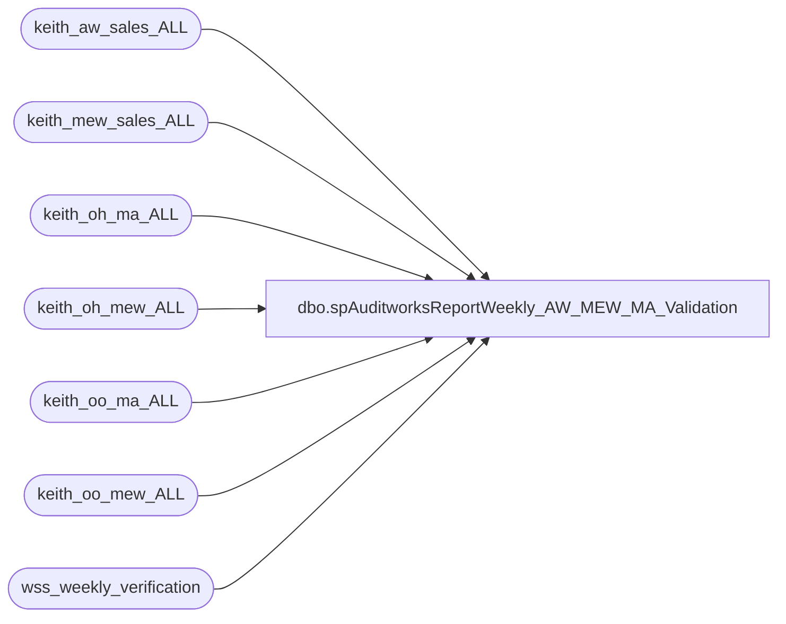

# dbo.spAuditworksReportWeekly_AW_MEW_MA_Validation

**Database:** auditworks  
**Server:** bedrockdb01  

## Architecture Diagram



## Table Dependencies

| Referenced Table |
|---|
| keith_aw_sales_ALL |
| keith_mew_sales_ALL |
| keith_oh_ma_ALL |
| keith_oh_mew_ALL |
| keith_oo_ma_ALL |
| keith_oo_mew_ALL |
| wss_weekly_verification |

## Stored Procedure Code

```sql
create proc [dbo].[spAuditworksReportWeekly_AW_MEW_MA_Validation]

as

-- =====================================================================================================
-- Name: spAuditworksReportWeekly_AW_MEW_MA_Validation
--
-- Description:	Validates data replication between AW, MEW & MA. Generates files and emails
--
-- Input:	na
--
--
-- Dependencies: spAuditworksSelectWeekly_AW_MEW_MA_Validation
--				 
-- Revision History
--		Name:			Date:			Comments:
--		Dan Tweedie		09/09/2010		Created proc.	
--		Dan Tweedie		01/22/2015		Consolidated queries into *all* instead of by divisions
-- =====================================================================================================

set nocount on 
BEGIN
		IF (Object_ID('auditworks..wss_weekly_verification') IS NOT NULL) DROP TABLE wss_weekly_verification

		create table wss_weekly_verification
		(division varchar(10) not null,
		data_type varchar(40) not null,
		status varchar(10) not null,
		file_path varchar(100) not null)

		--insert wss_weekly_verification values ('Division', 'Catergory', 'Status', 'File Path')
------------------------------------------------------------------------------------------------------------------------------------------------------------------------

		declare @file_location varchar(100),
				@file_name varchar(100),
				@database varchar(52),
				@query varchar(4000),
				@osql varchar(1000)		
				
		set @file_location = '\\sharebear1\groups\IT\Retail Systems\StyleSummaryValidation\'
		set @database = 'auditworks'
------------------------------------------------------------------------------------------------------------------------------------------------------------------------
------------
--AW vs MEW |
------------
		---ALL Styles
		if (select count(*)
			from keith_aw_sales_ALL a 
			join keith_mew_sales_ALL b on a.style_code = b.style_code and a.color_code = b.color_code
			where ABS(a.MTD - (b.MTD * -1)) > 1
				or ABS(a.ThreeW - (b.ThreeW * -1)) > 1
				or ABS(a.PR - (b.PR * -1)) > 1
				or ABS(a.LW - (b.LW * -1)) > 1) = 0
				
			begin
				insert into wss_weekly_verification
				select	'ALL' as "division",
						'Auditworks vs Merchandising Sales' as "data_type",
						'NO PROBLEM' as "status",
						'' as "file_path"
			end
		else
			begin 
				set @file_name = 'AW_vs_MEW.csv'
				set @query = 'select a.style_code, a.color_code, (a.MTD - (b.MTD * -1)) as MTDDiff, (a.ThreeW - (b.ThreeW * -1)) as ThreeWDiff, (a.PR - (b.PR * -1)) as PRDiff, (a.LW - (b.LW * -1)) as LWDiff from keith_aw_sales_ALL a join keith_mew_sales_ALL b on	a.style_code = b.style_code and	a.color_code = b.color_code where 	ABS(a.MTD - (b.MTD * -1)) > 1 or ABS(a.ThreeW - (b.ThreeW * -1)) > 1 or ABS(a.PR - (b.PR * -1)) > 1 or ABS(a.LW - (b.LW * -1)) > 1 '
				set @osql = 'sqlcmd' + ' -d' + @database + ' -Q' + '"' + @query + '"'  + ' -s"," ' + ' -o' + '"' + @file_location + @file_name + '"' + ' -w1000'
				exec master..xp_cmdshell @osql
				
				insert into wss_weekly_verification
				select	'ALL' as "division",
						'Auditworks vs Merchandising Sales' as "data_type",
						'PROBLEM' as "status",
						@file_location + @file_name as "file_path"
			end
		------------------------------------------------------------------------------------------------------------------------------------------------------------------------

------------------------------------------------------------------------------------------------------------------------------------------------------------------------
-------------------
--MEW vs MA OnHand |
-------------------

--US
		if (select count(*)
			from keith_oh_mew_ALL a 
			join keith_oh_ma_ALL b on a.style_code = b.style_code and a.color_code = b.color_code
			where ABS(a.TotalOH - (b.TOTAL_OH)) > 1) = 0

			begin
				insert into wss_weekly_verification
				select	'ALL' as "division",
						'On Hand' as "data_type",
						'NO PROBLEM' as "status",
						'' as "file_path"
			end
		else
			begin
				set @file_name = 'MEW_vs_MA_OH.csv'
				set @query = 'select a.style_code, b.color_code, a.TotalOH as MEW_OH, b.TOTAL_OH as MA_OH, (a.TotalOH - (b.TOTAL_OH)) as OHDiff from keith_oh_mew_ALL a join keith_oh_ma_ALL b on a.style_code = b.style_code and a.color_code = b.color_code where ABS(a.TotalOH - (b.TOTAL_OH)) > 1 '
				set @osql = 'sqlcmd' + ' -d' + @database + ' -Q' + '"' + @query + '"'  + ' -s"," ' + ' -o' + '"' + @file_location + @file_name + '"' + ' -w1000'
				exec master..xp_cmdshell @osql

				insert into wss_weekly_verification
				select	'ALL' as "division",
						'On Hand' as "data_type",
						'PROBLEM' as "status",
						@file_location + @file_name as "file_path"
			end
		------------------------------------------------------------------------------------------------------------------------------------------------------------------------
------------------------------------------------------------------------------------------------------------------------------------------------------------------------
---------------
--MEW vs MA OO |
---------------
--US		
		if (select count(*)
			from keith_oo_mew_ALL a 
			join keith_oo_ma_ALL b on a.style_code = b.style_code and a.color_code = b.color_code
			where ABS(a.TotalOO - (b.TOTAL_OO)) > 1) = 0

			begin
				insert into wss_weekly_verification
				select	'ALL' as "division",
						'On Order' as "data_type",
						'NO PROBLEM' as "status",
						'' as "file_path"
			end
		else
			begin
				set @file_name = 'MEW_vs_MA_OO.csv'
				set @query = 'select a.style_code, b.color_code, a.TotalOO as MEW_OO, b.TOTAL_OO as MA_OO, (a.TotalOO - (b.TOTAL_OO)) as OODiff from keith_oo_mew_ALL a join keith_oo_ma_ALL b on a.style_code = b.style_code and a.color_code = b.color_code where ABS(a.TotalOO - (b.TOTAL_OO)) > 1'
				set @osql = 'sqlcmd' + ' -d' + @database + ' -Q' + '"' + @query + '"'  + ' -s"," ' + ' -o' + '"' + @file_location + @file_name + '"' + ' -w1000'
				exec master..xp_cmdshell @osql

				insert into wss_weekly_verification
				select	'ALL' as "division",
						'On Order' as "data_type",
						'PROBLEM' as "status",
						@file_location + @file_name as "file_path"
			end
END
```

