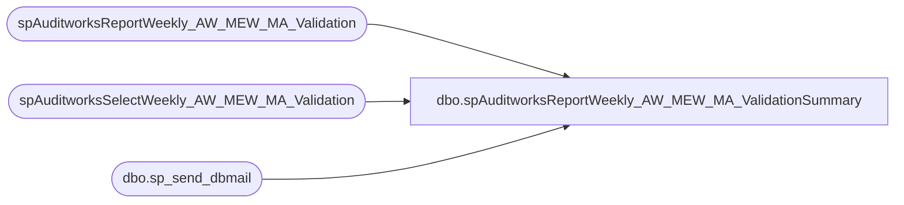

# dbo.spAuditworksReportWeekly_AW_MEW_MA_ValidationSummary

**Database:** auditworks  
**Server:** bedrockdb01  

## Architecture Diagram



## Table Dependencies

| Referenced Table |
|---|
| spAuditworksReportWeekly_AW_MEW_MA_Validation |
| spAuditworksSelectWeekly_AW_MEW_MA_Validation |
| dbo.sp_send_dbmail |

## Stored Procedure Code

```sql
create proc [dbo].[spAuditworksReportWeekly_AW_MEW_MA_ValidationSummary]
as

-- =====================================================================================================
-- Name: spAuditworksReportWeekly_AW_MEW_MA_ValidationSummary
--
-- Description:	Validates data replication between AW, MEW & MA. Generates email
--
-- Input:	na
--
-- Output: file output to \\posdbssa\c$\SQLFiles\WeeklyValidation\
--
-- Dependencies: spAuditworksSelectWeekly_AW_MEW_MA_Validation
--				 spAuditworksReportWeekly_AW_MEW_MA_Validation
--				 
-- Revision History
--		Name:			Date:			Comments:
--		Dan Tweedie		09/13/2010		Created proc.	
-- =====================================================================================================
set nocount on

----------------------------------
--WSS Weekly Verification Summary |
----------------------------------
begin
	exec spAuditworksSelectWeekly_AW_MEW_MA_Validation
end

begin
	exec spAuditworksReportWeekly_AW_MEW_MA_Validation
end

begin
		declare @file_location varchar(100),
				@file_name varchar(52),
				@query varchar(4000),
				@database varchar(52),
				@osql varchar(1000),
				@file_attachments varchar(100),
				@body varchar(1000)
				
		set @file_location = '\\sharebear1\groups\IT\Retail Systems\StyleSummaryValidation\'
		set @file_name = 'wss_verification_report.csv'
		set @file_attachments = @file_location + @file_name
		set @database = 'auditworks'
		set @query = 'set nocount on select division DIVISION, data_type DATATYPE, status STATUS, file_path FILEPATH from auditworks.dbo.wss_weekly_verification'
		set @osql = 'sqlcmd' + ' -d' + @database + ' -Q' + '"' + @query + '"'  + ' -s"," ' + ' -o' + '"' + @file_location + @file_name + '"' + ' -w1000'
		exec master..xp_cmdshell @osql

		set @body = 'WSS Weekly Validation Summary'
					+ char(10) + char(13) + 
					'Please see the attached file (or see below...) to view the WSS Weekly Validation Summary.'
					+ char(10) + char(13) + 
					+ char(10) + char(13) + 
					'Process: BEDROCKDB01.Auditworks.dbo.spAuditworksReportWeekly_AW_MEW_MA_ValidationSummary'
					+ char(10) + char(13) + 
					+ char(10) + char(13) + 
					+ char(10) + char(13) 

		EXEC msdb.dbo.sp_send_dbmail 
			@recipients = 'POLL@buildabear.com',
			@subject = 'WSS Weekly Validation Summary',
			@body = @body,
			@query = @query,
			@file_attachments = @file_attachments,
			@profile_name = 'SQLServices'
	
end
```

