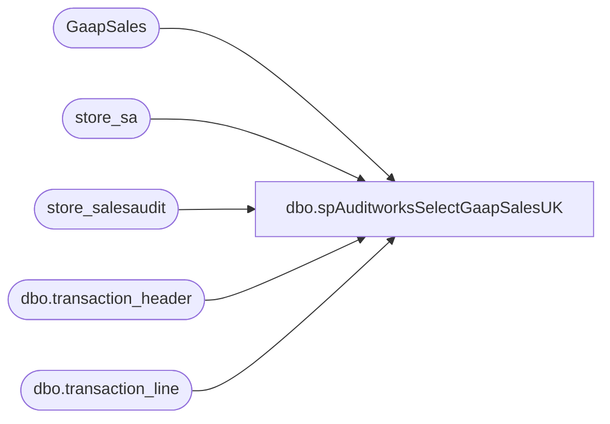

# dbo.spAuditworksSelectGaapSalesUK

**Database:** auditworks  
**Server:** bedrockdb01  

## Architecture Diagram



## Table Dependencies

| Referenced Table |
|---|
| GaapSales |
| store_sa |
| store_salesaudit |
| dbo.transaction_header |
| dbo.transaction_line |

## Stored Procedure Code

```sql
CREATE proc [dbo].[spAuditworksSelectGaapSalesUK]
as

-- =============================================================================================================
-- Name: spAuditworksGaapSalesUK
--
-- Description:	captures Gaap Sales from Auditworks for US stores.
--				Modified version of usp_GAAPSales_UK, which called sv_store view. 
--				This sv_store view is different in AW5 than in AW4, so this new proc does not use sv_view, but instead joins to the tables from that view (store_sa and store_salesaudit).
--
-- Input:		
--
-- Output: 
--
-- Dependencies: 
--
-- Revision History
--		Name:			Date:			Comments:
--		Dan Tweedie		10/29/2010      Sales Audit upgrade to version 5
--		Dan Tweedie		11/2/2010		Modified joins to ensure we capture stores with no sales
--										Modified #tmp_VAT to set VAT datatype as VAT numeric(12,4)
--		Dan Tweedie		02/21/2011		Added inclusion of Line Object 104
-- =============================================================================================================
set nocount on

IF (Object_ID('tempdb..#UKGaapSalesAW') IS NOT NULL) DROP TABLE #UKGaapSalesAW
	create table #UKGaapSalesAW
(
	location_code varchar(4),
	location_name varchar(50),
	net_sales decimal (14,2),
	entry_date varchar(50)
)


insert #UKGaapSalesAW
    SELECT  sa.store_no location_code, 
			sa.store_name location_name,
            isnull(d.total, 0) net_sales,
            CASE WHEN d.[time of last transaction polled] IS NULL
                 THEN 'No transactions polled'
                 ELSE d.[time of last transaction polled]
            END entry_date
        FROM store_sa sa (nolock)
        join store_salesaudit ss (nolock) on ss.store_no = sa.store_no
		left join 
           ( SELECT    a.store_no,
                        SUM(( (b.gross_line_amount - b.pos_discount_amount) )
                            * b.db_cr_none * b.voiding_reversal_flag) * -1 AS total,
                        LEFT(MAX(a.entry_date_time), 19) AS [time of last transaction polled]
              FROM      auditworks.dbo.transaction_header a WITH ( NOLOCK )
                        JOIN auditworks.dbo.transaction_line b WITH ( NOLOCK ) ON a.transaction_id = b.transaction_id
              WHERE     ( a.transaction_date BETWEEN CONVERT(CHAR, GETDATE(), 101)
                                             AND     CONVERT(CHAR, GETDATE(), 101)
                          AND a.transaction_void_flag = 0
                          AND a.transaction_category IN ( 1, 2 )
                          AND b.line_void_flag = 0 
		AND b.line_object IN (100,102,103,104,200,202,203,204,206,210,250,290,291,293,295,296,623,640,690,691, 1630, 1631)) 
              GROUP BY  a.store_no
            ) d on d.store_no = sa.store_no
    WHERE   ss.gl_company IN ( 700, 2101, 2102 ) -- UK stores only
    ORDER BY sa.store_no
    

--CALCULATE TOTAL VAT FOR STORES' SALES
IF (Object_ID('tempdb..#tmp_VAT') IS NOT NULL) DROP TABLE #tmp_VAT
	create table #tmp_VAT
(
	StoreNo varchar(4),
	VAT numeric(12,4)
)

insert #tmp_VAT
    SELECT  h.store_no AS 'StoreNo',
            SUM(( l.gross_line_amount * CASE [line_action]
                                          WHEN 13 THEN -1
                                          WHEN 21 THEN 1
                                        END )) AS 'VAT'
    FROM    auditworks.dbo.transaction_header h
            JOIN auditworks.dbo.transaction_line l ON h.transaction_id = l.transaction_id
    WHERE   ( h.transaction_date BETWEEN CONVERT(CHAR, GETDATE(), 101)
                                 AND     CONVERT(CHAR, GETDATE(), 101)
              AND h.transaction_void_flag = 0
              AND h.transaction_category IN ( 1, 2 )
            )
            AND l.line_object IN ( 1150 )
            AND l.line_void_flag = 0
			AND h.store_no in (select location_code from  #UKGaapSalesAW)
    GROUP BY h.store_no
    ORDER BY h.store_no
    

--UPDATE GAAP SALES BY STRIPPING OUT VAT
    UPDATE  #UKGaapSalesAW
    SET     net_sales = net_sales + VAT
    FROM    #UKGaapSalesAW gs
            INNER JOIN #tmp_VAT v ON v.StoreNo = gs.location_code


select right(('0000' + location_code), 4) as location_code,
		location_name,
		net_sales,
		entry_date,
        'Auditworks' as source
from	#UKGaapSalesAW
where	location_code in (select location_code from GaapSales where location_name = 'UTC')
order by 1
```

