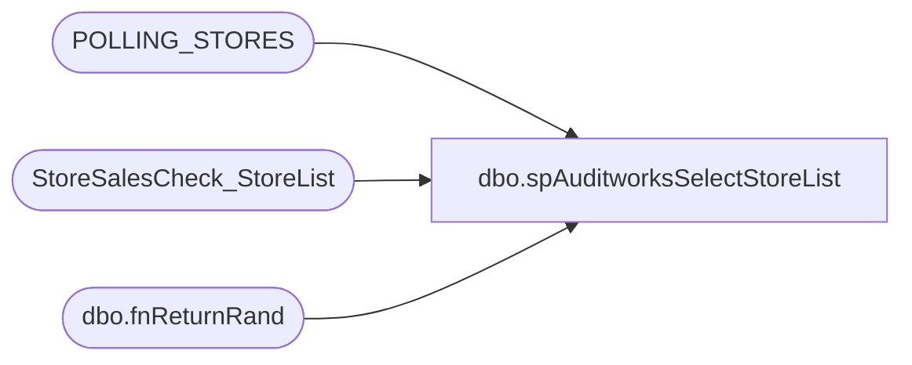

# dbo.spAuditworksSelectStoreList

**Database:** auditworks  
**Server:** bedrockdb01  

## Architecture Diagram



## Table Dependencies

| Referenced Table |
|---|
| POLLING_STORES |
| StoreSalesCheck_StoreList |
| dbo.fnReturnRand |

## Stored Procedure Code

```sql
CREATE proc [dbo].[spAuditworksSelectStoreList]

as

-- =====================================================================================================
-- Name: spAuditworksSelectStoreList
--
-- Description:	Captures a list of stores for which we can capture Gaap Sales.
--
-- Input:	NA
-- Output: NA
-- Dependencies: Process is called by SSIS package GaapSales
--
-- Revision History
--		Name:			Date:			Comments:
--		Dan Tweedie		10/19/2010		Created proc.	
--		Dan Tweedie		05/31/2016		Increased StoreID range to include China
--		Dan TWeedie		20171009		Pointed query to new table that Paul Beckman setup for this purpose

-- =====================================================================================================

set nocount on

IF (Object_ID('auditworks..StoreSalesCheck_StoreList') IS NOT NULL) DROP TABLE StoreSalesCheck_StoreList
create table StoreSalesCheck_StoreList 
(store_id int,
store_ip varchar(15),
store_group int)

insert into StoreSalesCheck_StoreList(store_id, store_ip, store_group)
SELECT 
	cast(STORE_NUM as int) AS istoreid,
	'10.' +
	cast(
	case when cast(STORE_NUM as int) between 1 and 99 then '0' 
		else cast(cast(STORE_NUM as int)/100 as varchar) 
	end as varchar) + '.' + 
	cast(cast(STORE_NUM as int) - cast(STORE_NUM as int)/100*100 as varchar) + 
	'.101' store_ip,
	NTILE(6) OVER(ORDER BY dbo.fnReturnRand() ASC) StoreGroup
FROM POLLING_STORES
WHERE POLLING_VLDTN = 1
AND POLLING_VLDTN_DATE <= GETDATE()

--select s.iStoreID,
--	'10.' +
--	cast(
--	case when s.iStoreID between 1 and 99 then '0' 
--		else cast(s.iStoreID/100 as varchar) 
--	end as varchar) + '.' + 
--	cast(s.iStoreID - s.iStoreID/100*100 as varchar) + 
--	'.101' store_ip,
--	NTILE(6) OVER(ORDER BY dbo.fnReturnRand() ASC) StoreGroup
--from KODIAK.bearhouse.dbo.tblStore s
--where iCoalitionStore = 1 
--	and s.iStoreID < 4000 -- previously said < 3000
--	and dCoalitionDate IS NOT NULL
```

