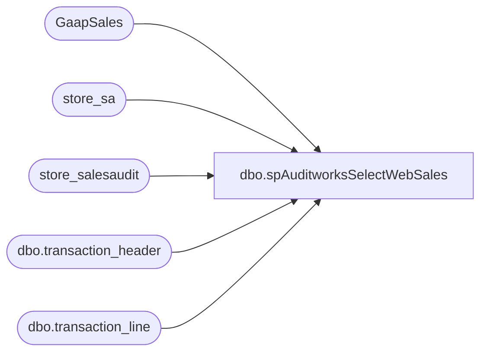

# dbo.spAuditworksSelectWebSales

**Database:** auditworks  
**Server:** bedrockdb01  

## Architecture Diagram



## Table Dependencies

| Referenced Table |
|---|
| GaapSales |
| store_sa |
| store_salesaudit |
| dbo.transaction_header |
| dbo.transaction_line |

## Stored Procedure Code

```sql
CREATE proc [dbo].[spAuditworksSelectWebSales]
as

-- =====================================================================================================
-- Name: spAuditworksSelectWebSales
--
-- Description:	Captures today's web sales from web cart settlement log tables.
--
-- Input: NA
-- Output: NA
-- Dependencies: Procedure is called from SSIS package GaapSales to insert web sales into GaapSales table, along with store sales.
--
-- Revision History
--		Name:					Date:			Comments:
--		Dan Tweedie				10/19/2010		Created proc.	
--		Dan	Tweedie/Brad A		11/07/2010		filter dates to exclude old sales due to reused batch id's
--		Dan Tweedie				02/20/2012		New code is at bottom the bottom.
--												This procedure is specifically designed for use with a specific SSIS package (GaapSales),
--												and has been tested to confirm it works properly within the context of the package.
-- =====================================================================================================

set nocount on 

insert into GaapSales
select	right(('0000' + cast(sa.store_no as varchar)), 4) as store_no,
		sa.store_name location_name, 
		isnull(d.total, 0) net_sales,
		case when d.[time of last transaction polled] IS NULL 
				then 'No transactions polled' 
				else d.[time of last transaction polled]
			 end entry_date,
		'Auditworks' as 'source'
    
    FROM store_sa sa (nolock)
    join store_salesaudit ss (nolock) on ss.store_no = sa.store_no
    left join
		( SELECT    a.store_no,
                        SUM(( (b.gross_line_amount - b.pos_discount_amount) )
                            * b.db_cr_none * b.voiding_reversal_flag) * -1 AS total,
                        LEFT(MAX(a.entry_date_time), 19) AS [time of last transaction polled]
              FROM      auditworks.dbo.transaction_header a WITH ( NOLOCK )
                        JOIN auditworks.dbo.transaction_line b WITH ( NOLOCK ) ON a.transaction_id = b.transaction_id
              WHERE     ( a.transaction_date BETWEEN CONVERT(CHAR, GETDATE(), 101)
                                             AND     CONVERT(CHAR, GETDATE(), 101)
											 and datepart(hh, entry_date_time) > 2
                          AND a.transaction_void_flag = 0
                          AND a.transaction_category IN ( 1, 2 )
                          AND b.line_void_flag = 0
                          AND b.line_object IN ( 100, 102, 103, 104, 200, 202, 203, 204, 206,
                                                 210, 250, 290, 291, 293, 295,
                                                 296, 623, 640, 690, 691, 1630,
                                                 1631 )
                          AND a.store_no = 13
                          --and a.register_no <> 3
                        ) 
            
			GROUP BY  a.store_no
			union all
			SELECT    a.store_no,
                        SUM(( (b.gross_line_amount - b.pos_discount_amount) )
                            * b.db_cr_none * b.voiding_reversal_flag) * -1 AS total,
                        LEFT(MAX(a.entry_date_time), 19) AS [time of last transaction polled]
              FROM      auditworks.dbo.transaction_header a WITH ( NOLOCK )
                        JOIN auditworks.dbo.transaction_line b WITH ( NOLOCK ) ON a.transaction_id = b.transaction_id
              WHERE     ( a.transaction_date BETWEEN CONVERT(CHAR, GETDATE(), 101)
                                             AND     CONVERT(CHAR, GETDATE(), 101)
											 and datepart(hh, entry_date_time) > 2
                          AND a.transaction_void_flag = 0
                          AND a.transaction_category IN ( 1, 2 )
                          AND b.line_void_flag = 0 
						  AND b.line_object IN (100,102,103,104,200,202,203,204,206,210,250,290,291,293,295,296,623,640,690,691, 1630, 1631))
						  and a.store_no = 2013 
              GROUP BY  a.store_no
            ) d on d.store_no = sa.store_no
    WHERE   ss.gl_company IN ( 100, 700, 2101, 2102 ) -- US stores only
    and sa.store_no in (13, 2013)
    ORDER BY sa.store_no
```

