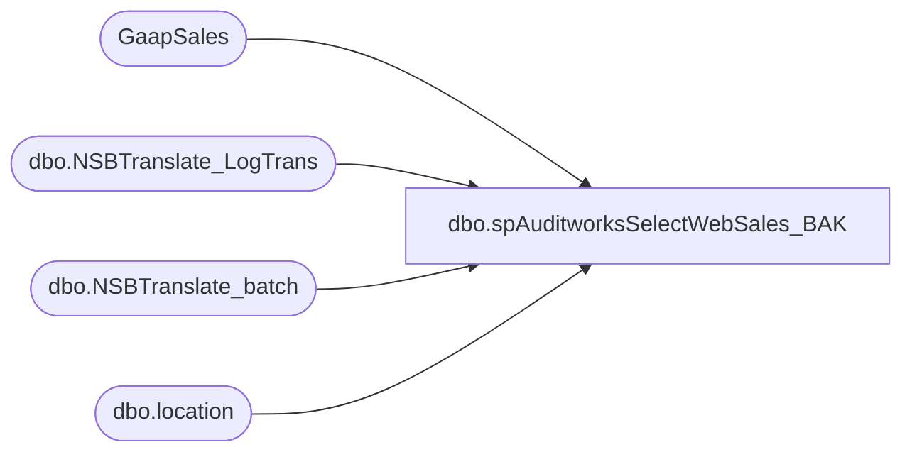

# dbo.spAuditworksSelectWebSales_BAK

**Database:** auditworks  
**Server:** bedrockdb01  

## Architecture Diagram



## Table Dependencies

| Referenced Table |
|---|
| GaapSales |
| dbo.NSBTranslate_LogTrans |
| dbo.NSBTranslate_batch |
| dbo.location |

## Stored Procedure Code

```sql
create proc [dbo].[spAuditworksSelectWebSales_BAK]
as

-- =====================================================================================================
-- Name: spAuditworksSelectWebSales
--
-- Description:	Captures today's web sales from web cart settlement log tables.
--
-- Input: NA
-- Output: NA
-- Dependencies: Procedure is called from SSIS package GaapSales to insert web sales into GaapSales table, along with store sales.
--
-- Revision History
--		Name:			Date:			Comments:
--		Dan Tweedie		10/19/2010		Created proc.	
-- =====================================================================================================

set nocount on 

if datepart(hh, getdate()) > 6

		insert into GaapSales
		SELECT	right(('0000' + cast(t.iStoreID as varchar(4))),4) as location_code, 
				location_name as location_name, 
				Sum(t.mGAAP) as net_sales, 
				convert(varchar(20),max(b.dTimeStamp),100) as entry_date,
				'WebCart' as 'source'
		FROM BEARWEBDB.WebCart_Commerce.dbo.NSBTranslate_batch b
		join BEARWEBDB.WebCart_Commerce.dbo.NSBTranslate_LogTrans t on t.sBatchID=b.sBatchID
		join OURSMERCHDB01.me_01.dbo.location l on	right(('0000' + cast(t.iStoreID as varchar(4))),4) = l.location_code
		where datediff(dd, b.[dTimeStamp], getdate()) = 0
		and datepart(hh, b.[dTimeStamp]) > 2
		and [sCreatedBy] <> 'PartyAWT'
		group by t.iStoreID, location_name,  b.[bSentToAW],[sCreatedBy]
		ORDER BY t.iStoreID

	else
	
		insert into GaapSales
		SELECT	right(('0000' + cast(t.iStoreID as varchar(4))),4) as location_code, 
				location_name as location_name, 
				Sum(t.mGAAP) as net_sales, 
				convert(varchar(20),max(b.dTimeStamp),100) as entry_date,
				'WebCart' as 'source'
		FROM BEARWEBDB.WebCart_Commerce.dbo.NSBTranslate_batch b
		join BEARWEBDB.WebCart_Commerce.dbo.NSBTranslate_LogTrans t on t.sBatchID=b.sBatchID
		join OURSMERCHDB01.me_01.dbo.location l on	right(('0000' + cast(t.iStoreID as varchar(4))),4) = l.location_code
		where datediff(dd, b.[dTimeStamp], getdate()-1) = 0
		and datepart(hh, b.[dTimeStamp]) > 2
		and [sCreatedBy] <> 'PartyAWT'
		group by t.iStoreID, location_name,  b.[bSentToAW],[sCreatedBy]
		ORDER BY t.iStoreID
```

