# dbo.spAuditworksSelectWeekly_AW_MEW_MA_Validation

**Database:** auditworks  
**Server:** bedrockdb01  

## Architecture Diagram

```mermaid
flowchart LR
    SP["dbo.spAuditworksSelectWeekly_AW_MEW_MA_Validation"]
    ALL_STYLES(["ALL_STYLES"]) --> SP
    DTSJOB_1(["DTSJOB_1"]) --> SP
    DTSJOB_2(["DTSJOB_2"]) --> SP
    DTSJOB_3(["DTSJOB_3"]) --> SP
    DTSJOB_4(["DTSJOB_4"]) --> SP
    DTSJOB_5(["DTSJOB_5"]) --> SP
    DTSJOB_6(["DTSJOB_6"]) --> SP
    DTSJOB_7(["DTSJOB_7"]) --> SP
    DTSJOB_8(["DTSJOB_8"]) --> SP
    DTSJOB_9(["DTSJOB_9"]) --> SP
    DTSJOB_LW(["DTSJOB_LW"]) --> SP
    dbo_attribute_set(["dbo.attribute_set"]) --> SP
    av_merchandise_detail(["av_merchandise_detail"]) --> SP
    av_transaction_header(["av_transaction_header"]) --> SP
    av_transaction_line(["av_transaction_line"]) --> SP
    dbo_calendar_date(["dbo.calendar_date"]) --> SP
    dbo_calendar_merch_week(["dbo.calendar_merch_week"]) --> SP
    dbo_color(["dbo.color"]) --> SP
    dbo_entity_attribute_set(["dbo.entity_attribute_set"]) --> SP
    dbo_hierarchy_group(["dbo.hierarchy_group"]) --> SP
    dbo_hist_oh_style_chn_li(["dbo.hist_oh_style_chn_li"]) --> SP
    dbo_hist_oh_styleclr_chn_wk(["dbo.hist_oh_styleclr_chn_wk"]) --> SP
    dbo_hist_styleclr_chn_pd(["dbo.hist_styleclr_chn_pd"]) --> SP
    dbo_hist_styleclr_chn_wk(["dbo.hist_styleclr_chn_wk"]) --> SP
    dbo_hist_styleclr_chn_yr(["dbo.hist_styleclr_chn_yr"]) --> SP
    dbo_ib_inventory(["dbo.ib_inventory"]) --> SP
    dbo_ib_inventory_total(["dbo.ib_inventory_total"]) --> SP
    dbo_ib_on_order(["dbo.ib_on_order"]) --> SP
    keith_MTD(["keith_MTD"]) --> SP
    dbo_keith_MTD(["dbo.keith_MTD"]) --> SP
    dbo_keith_hierarchy_exclusions(["dbo.keith_hierarchy_exclusions"]) --> SP
    keith_ma_sales_ALL(["keith_ma_sales_ALL"]) --> SP
    keith_ma_sales_temp(["keith_ma_sales_temp"]) --> SP
    keith_oh_mew(["keith_oh_mew"]) --> SP
    keith_oo_mew(["keith_oo_mew"]) --> SP
    dbo_merchandise_detail(["dbo.merchandise_detail"]) --> SP
    dbo_oo_all_styleclr_chn_li(["dbo.oo_all_styleclr_chn_li"]) --> SP
    dbo_oo_all_styleclr_chn_pd(["dbo.oo_all_styleclr_chn_pd"]) --> SP
    dbo_sku(["dbo.sku"]) --> SP
    dbo_style(["dbo.style"]) --> SP
    dbo_style_color(["dbo.style_color"]) --> SP
    dbo_style_group(["dbo.style_group"]) --> SP
    dbo_style_parent(["dbo.style_parent"]) --> SP
    dbo_sv_merchandise_category(["dbo.sv_merchandise_category"]) --> SP
    tblAWUPC(["tblAWUPC"]) --> SP
    tblAWUPC_distinct(["tblAWUPC_distinct"]) --> SP
    tblCompareUPC(["tblCompareUPC"]) --> SP
    tblMEWSKU(["tblMEWSKU"]) --> SP
    dbo_transaction_header(["dbo.transaction_header"]) --> SP
    dbo_transaction_line(["dbo.transaction_line"]) --> SP
    dbo_upc(["dbo.upc"]) --> SP
    dbo_view_style_attribute_outer(["dbo.view_style_attribute_outer"]) --> SP
```



## Table Dependencies

| Referenced Table |
|---|
| ALL_STYLES |
| DTSJOB_1 |
| DTSJOB_2 |
| DTSJOB_3 |
| DTSJOB_4 |
| DTSJOB_5 |
| DTSJOB_6 |
| DTSJOB_7 |
| DTSJOB_8 |
| DTSJOB_9 |
| DTSJOB_LW |
| dbo.attribute_set |
| av_merchandise_detail |
| av_transaction_header |
| av_transaction_line |
| dbo.calendar_date |
| dbo.calendar_merch_week |
| dbo.color |
| dbo.entity_attribute_set |
| dbo.hierarchy_group |
| dbo.hist_oh_style_chn_li |
| dbo.hist_oh_styleclr_chn_wk |
| dbo.hist_styleclr_chn_pd |
| dbo.hist_styleclr_chn_wk |
| dbo.hist_styleclr_chn_yr |
| dbo.ib_inventory |
| dbo.ib_inventory_total |
| dbo.ib_on_order |
| keith_MTD |
| dbo.keith_MTD |
| dbo.keith_hierarchy_exclusions |
| keith_ma_sales_ALL |
| keith_ma_sales_temp |
| keith_oh_mew |
| keith_oo_mew |
| dbo.merchandise_detail |
| dbo.oo_all_styleclr_chn_li |
| dbo.oo_all_styleclr_chn_pd |
| dbo.sku |
| dbo.style |
| dbo.style_color |
| dbo.style_group |
| dbo.style_parent |
| dbo.sv_merchandise_category |
| tblAWUPC |
| tblAWUPC_distinct |
| tblCompareUPC |
| tblMEWSKU |
| dbo.transaction_header |
| dbo.transaction_line |
| dbo.upc |
| dbo.view_style_attribute_outer |

## Stored Procedure Code

```sql
CREATE proc [dbo].[spAuditworksSelectWeekly_AW_MEW_MA_Validation]

as

-- =====================================================================================================
-- Name: spAuditworksSelectWeekly_AW_MEW_MA_Validation
--
-- Description:	Captures data from AW, MEW & MA for the purpose of validating replication between systems.
--				Another process will validate and generate files and emails
--
-- Input:	na
--
-- Output: na
--
-- Dependencies: spAuditworksReportWeekly_AW_MEW_MA_Validation
--				 
-- Revision History
--		Name:			Date:			Comments:
--		Dan Tweedie		09/09/2010		Created proc.
--		Dan Tweedie		01/22/2015		Consolidated queries into *all* instead of by divisions
-- =====================================================================================================

set nocount on
----------------------------------------------------------------------------------------------------------
--BEGIN STEP ONE - CAPTURE DATA FROM BEDROCKDB02.MA_01- dts steps 1-21
----------------------------------------------------------------------------------------------------------

BEGIN

		----------------------------------------------------------------------------------------------------------
		IF (Object_ID('auditworks..DTSJOB_LW') IS NOT NULL) DROP TABLE DTSJOB_LW

		SELECT max(m.merch_year*100+m.merch_week) this_week, 
		0 l1_wk,
		0 l2_wk, 
		0 l3_wk, 
		0 this_period, 
		0 bop,
		0 boy,
		0 n1_pd, 
		0 n2_pd, 
		0 n3_pd, 
		max(merch_year) this_year 
		into DTSJOB_LW
		FROM BEDROCKDB02.ma_01.dbo.calendar_date m 
		WHERE m.calendar_date<getdate()
		----------------------------------------------------------------------------------------------------------

		if cast(convert(varchar, getdate(),101) as datetime)= (select min (calendar_date)as date
 				from BEDROCKDB02.ma_01.dbo.calendar_date
 				where merch_year = (select merch_year
 				from BEDROCKDB02.ma_01.dbo.calendar_date
 				where convert(char, getdate(),111) = convert(char, calendar_date, 111))
 				and merch_period = (select merch_period
 				from BEDROCKDB02.ma_01.dbo.calendar_date
 				where convert(char, getdate(),111) = convert(char, calendar_date, 111)))
		begin
			update DTSJOB_LW set this_period = 
			(select convert(varchar(4),merch_year,4) + right('00' + convert(varchar(2),merch_period),2) as current_period
			from BEDROCKDB02.ma_01.dbo.calendar_date 
			where cast(convert(varchar, calendar_date,101) as datetime) = cast(convert(varchar, getdate()-1,101) as datetime))
		end
		else
		begin
			update DTSJOB_LW set this_period = 
			(select convert(varchar(4),merch_year,4) + right('00' + convert(varchar(2),merch_period),2) as current_period
			from BEDROCKDB02.ma_01.dbo.calendar_date 
			where cast(convert(varchar, calendar_date,101) as datetime) = cast(convert(varchar, getdate(),101) as datetime))
		end
		----------------------------------------------------------------------------------------------------------

		UPDATE DTSJOB_LW 
		SET l1_wk = ( 
		SELECT MAX(merch_year * 100 + merch_week) 
		FROM BEDROCKDB02.ma_01.dbo.calendar_merch_week m, DTSJOB_LW  
		WHERE this_week > ((m.merch_year * 100 ) + m.merch_week) ) 

		UPDATE DTSJOB_LW 
		SET l2_wk = ( 
		SELECT MAX(merch_year * 100 + merch_week) 
		FROM BEDROCKDB02.ma_01.dbo.calendar_merch_week m, DTSJOB_LW  
		WHERE l1_wk > ((m.merch_year * 100 ) + m.merch_week) ) 

		UPDATE DTSJOB_LW 
		SET l3_wk  = ( 
		SELECT MAX(merch_year * 100 + merch_week) 
		FROM BEDROCKDB02.ma_01.dbo.calendar_merch_week m, DTSJOB_LW  
		WHERE l2_wk > ((m.merch_year * 100 ) + m.merch_week) ) 

		UPDATE DTSJOB_LW 
		SET n1_pd = ( 
		SELECT MIN(merch_year * 100 + merch_period) 
		FROM BEDROCKDB02.ma_01.dbo.calendar_merch_week m, DTSJOB_LW  
		WHERE this_period < ((m.merch_year * 100 ) + m.merch_period) ) 

		UPDATE DTSJOB_LW 
		SET n2_pd = ( 
		SELECT MIN(merch_year * 100 + merch_period) 
		FROM BEDROCKDB02.ma_01.dbo.calendar_merch_week m, DTSJOB_LW  
		WHERE n1_pd < ((m.merch_year * 100 ) + m.merch_period) ) 

		UPDATE DTSJOB_LW 
		SET n3_pd = ( 
		SELECT MIN(merch_year * 100 + merch_period) 
		FROM BEDROCKDB02.ma_01.dbo.calendar_merch_week m, DTSJOB_LW
		WHERE n2_pd < ((m.merch_year * 100 ) + m.merch_period) ) 
		----------------------------------------------------------------------------------------------------------
		IF (Object_ID('auditworks..ALL_STYLES') IS NOT NULL) DROP TABLE ALL_STYLES

		SELECT DISTINCT a.style_id AS Field_a , a.color_id AS Field_b 
		into ALL_STYLES
		FROM BEDROCKDB02.ma_01.dbo.style_color a, 
			BEDROCKDB02.ma_01.dbo.hierarchy_group b, 
			BEDROCKDB02.ma_01.dbo.style_parent c,
			BEDROCKDB02.ma_01.dbo.entity_attribute_set eas,--
			BEDROCKDB02.ma_01.dbo.attribute_set att--
		WHERE a.style_id = c.style_id
			and a.style_id = eas.parent_id--
			and eas.attribute_set_id = att.attribute_set_id--
			and att.attribute_set_id = 820001--
			AND c.hierarchy_level_id = 6      
			AND c.parent_hierarchy_group_id = b.hierarchy_group_id       
			AND b.hierarchy_group_code not in (select * from BEDROCKDB02.ma_01.dbo.keith_hierarchy_exclusions)
		----------------------------------------------------------------------------------------------------------
		IF (Object_ID('auditworks..DTSJOB_1') IS NOT NULL) DROP TABLE DTSJOB_1

		SELECT SUM((a.sales_total_units-a.return_units) * (1 - ABS (SIGN (merch_year_wk - p.l2_wk )))) AS Field_o, 
		SUM((ISNULL(a.sales_total_units-a.return_units,0)) * (1 - ABS (SIGN (merch_year_wk -p.l1_wk )))) AS Field_p, 
		SUM((ISNULL(a.sales_total_units-a.return_units,0)) * (1 - ABS (SIGN (merch_year_wk -p.this_week)))) AS Field_q,
		SUM((a.sales_total_retail-a.return_retail) * (1 - ABS (SIGN (merch_year_wk -p.this_week)))) AS Field_q1,
		SUM((a.sales_total_units-a.return_units) * (1 - ABS (SIGN (merch_year_wk - p.l3_wk )))) AS Field_o1, 
		Q1.Field_a AS QField_a, Q1.Field_b AS QField_b    
		into DTSJOB_1
		FROM BEDROCKDB02.ma_01.dbo.hist_styleclr_chn_wk a,
			ALL_STYLES Q1, 
			DTSJOB_LW p 
		WHERE Q1.Field_a = a.style_id  
		AND Q1.Field_b = a.color_id
		GROUP BY Q1.Field_a , Q1.Field_b 
		----------------------------------------------------------------------------------------------------------
		IF (Object_ID('auditworks..DTSJOB_2') IS NOT NULL) DROP TABLE DTSJOB_2

		SELECT SUM((a.sales_total_units-a.return_units) * (1 - ABS(SIGN (merch_year_pd -p.this_period)))) AS Field_n, 
		Q1.Field_a AS QField_a  , Q1.Field_b AS QField_b
		into DTSJOB_2
		FROM BEDROCKDB02.ma_01.dbo.hist_styleclr_chn_pd a,
			ALL_STYLES Q1  , 
			DTSJOB_LW p 
		WHERE Q1.Field_a = a.style_id
		AND Q1.Field_b = a.color_id  
		GROUP BY Q1.Field_a, Q1.Field_b  
		----------------------------------------------------------------------------------------------------------
		IF (Object_ID('auditworks..DTSJOB_3') IS NOT NULL) DROP TABLE DTSJOB_3

		SELECT SUM((a.sales_total_units-a.return_units) * (1 - ABS(SIGN (merch_year - p.this_year)))) AS Field_m, 
		SUM((a.sales_total_retail-a.return_retail) * (1 - ABS (SIGN (merch_year- p.this_year)))) AS Field_y, 
		Q1.Field_a AS QField_a, Q1.Field_b AS QField_b   
		into DTSJOB_3 
		FROM BEDROCKDB02.ma_01.dbo.hist_styleclr_chn_yr a,
			ALL_STYLES Q1, 
			DTSJOB_LW p  
		WHERE Q1.Field_a = a.style_id  
		AND Q1.Field_b = a.color_id
		GROUP BY Q1.Field_a , Q1.Field_b 
		----------------------------------------------------------------------------------------------------------
		IF (Object_ID('auditworks..DTSJOB_4') IS NOT NULL) DROP TABLE DTSJOB_4

		SELECT SUM((a.on_hand_units)* (1 - ABS (SIGN (a.merch_year_wk - p.this_week)))) AS Field_s, 
		SUM((a.on_hand_retail)* (1 - ABS (SIGN (a.merch_year_wk - p.this_week)))) AS Field_z,
		SUM((a.on_hand_units)* (1 - ABS (SIGN (a.merch_year_wk - p.l1_wk)))) AS Field_s_lw, 
		SUM((a.on_hand_retail)* (1 - ABS (SIGN (a.merch_year_wk - p.l1_wk)))) AS Field_z_lw,
		Q1.Field_a AS QField_a  , Q1.Field_b AS  QField_b  
		into DTSJOB_4
		FROM BEDROCKDB02.ma_01.dbo.hist_oh_styleclr_chn_wk a,
			ALL_STYLES Q1, 
			DTSJOB_LW p 
		WHERE Q1.Field_a = a.style_id  
		AND Q1.Field_b = a.color_id
		GROUP BY Q1.Field_a , Q1.Field_b
		----------------------------------------------------------------------------------------------------------
		IF (Object_ID('auditworks..DTSJOB_5') IS NOT NULL) DROP TABLE DTSJOB_5

		SELECT SUM(a.on_hand_units) AS Field_31,
		SUM(a.on_hand_cost) AS Field_3,    
		a.style_id AS QField_a  
		into DTSJOB_5
		FROM BEDROCKDB02.ma_01.dbo.hist_oh_style_chn_li a
		WHERE a.style_id IN (SELECT DISTINCT Q1.Field_a FROM ALL_STYLES Q1)
		GROUP BY a.style_id
		----------------------------------------------------------------------------------------------------------
		IF (Object_ID('auditworks..DTSJOB_6') IS NOT NULL) DROP TABLE DTSJOB_6

		SELECT SUM(a.on_order_units) AS Field_t, 
		SUM(a.on_order_retail) AS Field_0, Q1.Field_a AS QField_a, Q1.Field_b AS QField_b
		into DTSJOB_6   
		FROM BEDROCKDB02.ma_01.dbo.oo_all_styleclr_chn_li a,
			ALL_STYLES Q1  
		WHERE Q1.Field_a = a.style_id  
		AND Q1.Field_b = a.color_id
		GROUP BY Q1.Field_a, Q1.Field_b  
		----------------------------------------------------------------------------------------------------------
		IF (Object_ID('auditworks..DTSJOB_7') IS NOT NULL) DROP TABLE DTSJOB_7

		SELECT SUM(a.on_order_units * (sign (1-SIGN (merch_year_pd -p.this_period)))) AS Field_u,
		SUM(a.on_order_units * (1 - ABS (SIGN (merch_year_pd - p.n1_pd)))) AS Field_v, 
		SUM(a.on_order_units *(1 - ABS(SIGN (merch_year_pd - p.n2_pd)))) AS Field_w, 
		SUM(a.on_order_units * (1 - ABS (SIGN (merch_year_pd -p.n3_pd)))) AS Field_x, Q1.Field_a 
		AS QField_a , Q1.Field_b AS QField_b
		into DTSJOB_7
		FROM BEDROCKDB02.ma_01.dbo.oo_all_styleclr_chn_pd a,
			ALL_STYLES Q1, 
			DTSJOB_LW p  
		WHERE Q1.Field_a = a.style_id  
		AND Q1.Field_b = a.color_id
		GROUP BY Q1.Field_a   , Q1.Field_b
		----------------------------------------------------------------------------------------------------------
		IF (Object_ID('auditworks..DTSJOB_8') IS NOT NULL) DROP TABLE DTSJOB_8

		SELECT QField_a  , QField_b
		into DTSJOB_8
		FROM DTSJOB_1 
		UNION 
		SELECT QField_a, QField_b FROM DTSJOB_2 
		UNION 
		SELECT QField_a, QField_b FROM DTSJOB_3 
		UNION 
		SELECT QField_a, QField_b FROM DTSJOB_4 
		UNION 
		SELECT QField_a, QField_b FROM DTSJOB_6 
		UNION 
		SELECT QField_a, QField_b FROM DTSJOB_7 
		----------------------------------------------------------------------------------------------------------
		IF (Object_ID('auditworks..DTSJOB_9') IS NOT NULL) DROP TABLE DTSJOB_9

		SELECT DISTINCT e.hierarchy_group_code AS Field_a, 
		e.hierarchy_group_label AS Field_b, d.hierarchy_group_code AS Field_c, 
		d.hierarchy_group_short_label AS Field_d, c.hierarchy_group_code AS 
		Field_e, c.hierarchy_group_short_label AS Field_f, a.style_code AS 
		Field_g, a.short_desc AS Field_h, a.primary_vendor_code AS Field_i, 
		b01.attribute_set_code AS Field_j, a.current_retail AS Field_k, col.color_code, col.color_short_description,
		a.style_id AS Field_l, col.color_id AS color_id   
		into DTSJOB_9
		FROM BEDROCKDB02.ma_01.dbo.style a, 
			BEDROCKDB02.ma_01.dbo.view_style_attribute_outer b01, 
			BEDROCKDB02.ma_01.dbo.hierarchy_group c, 
			BEDROCKDB02.ma_01.dbo.hierarchy_group d, 
			BEDROCKDB02.ma_01.dbo.hierarchy_group e, 
			BEDROCKDB02.ma_01.dbo.style_parent f, 
			BEDROCKDB02.ma_01.dbo.style_parent g, 
			BEDROCKDB02.ma_01.dbo.style_parent h, 
			BEDROCKDB02.ma_01.dbo.color col, 
			DTSJOB_8 U1   
		WHERE a.style_id =b01.style_id 
			AND  b01.attribute_id = 38       
			AND a.style_id = f.style_id 
			AND f.hierarchy_level_id = 8      
			AND f.parent_hierarchy_group_id = c.hierarchy_group_id        
			AND a.style_id = g.style_id 
			AND g.hierarchy_level_id = 7      
			AND g.parent_hierarchy_group_id = d.hierarchy_group_id        
			AND a.style_id = h.style_id 
			AND h.hierarchy_level_id = 6      
			AND h.parent_hierarchy_group_id = e.hierarchy_group_id       
			AND (a.style_id = U1.QField_a
		AND col.color_id = U1.QField_b) 
		----------------------------------------------------------------------------------------------------------
		IF (Object_ID('auditworks..keith_ma_sales_temp') IS NOT NULL) DROP TABLE keith_ma_sales_temp

		SELECT 
		V1_1.Field_a as Hierarchy_Group,
		V1_1.Field_g as Style_Code, 
		V1_1.color_code as Color_Code, 
		b.Field_n as MTD, 
		a.Field_o1 as ThreeWA_Qty, 
		a.Field_o as PR_Qty, 
		a.Field_p as LW_Qty, 
		a.Field_q as Curr_W_Qty,
		d.Field_s as TOTAL_OH,
		e.Field_t  as TOTAL_OO
		into keith_ma_sales_temp
		FROM DTSJOB_8 U1, DTSJOB_9  V1_1 , DTSJOB_1 a, 
		DTSJOB_2 b, DTSJOB_3 c, DTSJOB_4 d, DTSJOB_6 e, 
		DTSJOB_7 f,  DTSJOB_5 i
		WHERE U1.QField_a = V1_1.Field_l
		AND U1.QField_b = V1_1.color_id        
		AND U1.QField_a = a.QField_a 
		AND U1.QField_b = a.QField_b        
		AND U1.QField_a = b.QField_a 
		AND U1.QField_b = b.QField_b        
		AND U1.QField_a = c.QField_a        
		AND U1.QField_b = c.QField_b 
		AND U1.QField_a = d.QField_a 
		AND U1.QField_b = d.QField_b        
		AND U1.QField_a = e.QField_a 
		AND U1.QField_b = e.QField_b        
		AND U1.QField_a = f.QField_a 
		AND U1.QField_b = f.QField_b  
		AND U1.QField_a = i.QField_a 
		ORDER BY 1, 3, 5, 7
		
-----------------------------------------------------------------------------------------------------------

--dts step 'Insert into keith_ma_sales'
-- Build and format MA Sales table
		IF (Object_ID('auditworks..keith_ma_sales_ALL') IS NOT NULL) DROP TABLE keith_ma_sales_ALL

		select 	Hierarchy_Group,
			right('000000'+ltrim(rtrim(convert(varchar(6),Style_Code))),6) as style_code,
			right('000'+ltrim(rtrim(convert(varchar(3),Color_Code))),3) as color_code,
			isnull(convert(integer,MTD),0) as MTD,
			isnull(convert(integer,ThreeWA_Qty),0) as ThreeW,
			isnull(convert(integer,PR_Qty),0) as PR,
			isnull(convert(integer,LW_Qty),0) as LW,
			isnull(convert(integer,TOTAL_OH),0) as TOTAL_OH,
			isnull(convert(integer,TOTAL_OO),0) as TOTAL_OO
		into keith_ma_sales_ALL
		from keith_ma_sales_temp

		
----------------------------------------------------------------------------------------------------------

		--dts step 'get mtd'
		IF (Object_ID('auditworks..keith_MTD') IS NOT NULL) DROP TABLE keith_MTD

		create table keith_MTD
		(date smalldatetime null,
		flag int not null)


		if cast(convert(varchar, getdate(),101) as datetime)= (select min (calendar_date)as date
 				from BEDROCKDB02.me_01.dbo.calendar_date
 				where merch_year = (select merch_year
 				from BEDROCKDB02.me_01.dbo.calendar_date
 				where convert(char, getdate(),111) = convert(char, calendar_date, 111))
 				and merch_period = (select merch_period
 				from BEDROCKDB02.me_01.dbo.calendar_date
 				where convert(char, getdate(),111) = convert(char, calendar_date, 111)))
			begin
			-- -- Get BOM date
				insert into keith_MTD
				select min (calendar_date)as date, 1 as flag
 				from BEDROCKDB02.me_01.dbo.calendar_date
 				where merch_year = (select merch_year
 				from BEDROCKDB02.me_01.dbo.calendar_date
 				where convert(char, getdate()-1,111) = convert(char, calendar_date, 111))
 				and merch_period = (select merch_period
 				from BEDROCKDB02.me_01.dbo.calendar_date
 				where convert(char, getdate()-1,111) = convert(char, calendar_date, 111))
			 
			-- -- Get EOM date
				insert into keith_MTD
				select max (calendar_date) as date, 2 as flag
				from BEDROCKDB02.me_01.dbo.calendar_date
				where merch_year = (select merch_year
				from BEDROCKDB02.me_01.dbo.calendar_date
				where convert(char, getdate()-1,111) = convert(char, calendar_date, 111))
				and merch_period = (select merch_period
				from BEDROCKDB02.me_01.dbo.calendar_date
				where convert(char, getdate()-1,111) = convert(char, calendar_date, 111))
			end
		else
			begin
			-- -- Get BOM date
				insert into keith_MTD
				select min (calendar_date)as date, 1 as flag
				from BEDROCKDB02.me_01.dbo.calendar_date
				where merch_year = (select merch_year
				from BEDROCKDB02.me_01.dbo.calendar_date
				where convert(char, getdate(),111) = convert(char, calendar_date, 111))
				and merch_period = (select merch_period
				from BEDROCKDB02.me_01.dbo.calendar_date
				where convert(char, getdate(),111) = convert(char, calendar_date, 111))
			 
			-- -- Get EOM date
				insert into keith_MTD
				select max (calendar_date) as date, 2 as flag
				from BEDROCKDB02.me_01.dbo.calendar_date
				where merch_year = (select merch_year
				from BEDROCKDB02.me_01.dbo.calendar_date
				where convert(char, getdate(),111) = convert(char, calendar_date, 111))
				and merch_period = (select merch_period
				from BEDROCKDB02.me_01.dbo.calendar_date
				where convert(char, getdate(),111) = convert(char, calendar_date, 111))
			end
----------------------------------------------------------------------------------------------------------

		--dts step 'Insert keith_mew_sales'
		IF (Object_ID('auditworks..tblMEWSKU') IS NOT NULL) DROP TABLE tblMEWSKU

		SELECT distinct sku_id,
			sum (MTD) MTD,
			sum(ThreeW) ThreeW,	
			sum(PR) PR,  
			sum(LW) LW
		into tblMEWSKU
		FROM 	(
			select sku_id, SUM(transaction_units) MTD, 0 LW, 0 PR, 0 ThreeW
			from BEDROCKDB02.me_01.dbo.ib_inventory 
			where transaction_date Between (select date from keith_MTD 
							where flag = 1)
						and (select date from keith_MTD 
							where flag = 2)
			AND transaction_type_code Between 599 and 651
			group by sku_id
			union
			select sku_id, 0 MTD, SUM(transaction_units) LW, 0 PR, 0 ThreeW
			from BEDROCKDB02.me_01.dbo.ib_inventory 
			where transaction_date Between CONVERT(char,DATEADD(day,-7,GETDATE()),101) and CONVERT(char,DATEADD(day,-1,GETDATE()),101)
			AND transaction_type_code Between 599 and 651
			group by sku_id
			union
			select sku_id, 0 MTD, 0 LW, SUM(transaction_units) PR, 0 ThreeW
			from BEDROCKDB02.me_01.dbo.ib_inventory 
			where transaction_date Between CONVERT(char,DATEADD(day,-14,GETDATE()),101) and CONVERT(char,DATEADD(day,-8,GETDATE()),101)
			AND transaction_type_code Between 599 and 651
			group by sku_id
			union
			select sku_id, 0 MTD, 0 LW, 0 PR, SUM(transaction_units) ThreeW
			from BEDROCKDB02.me_01.dbo.ib_inventory 
			where transaction_date Between CONVERT(char,DATEADD(day,-21,GETDATE()),101) and CONVERT(char,DATEADD(day,-15,GETDATE()),101)
			AND transaction_type_code Between 599 and 651
			group by sku_id
		) d
		GROUP BY	sku_id 
		order by	sku_id 
----------------------------------------------------------------------------------------------------------

--dts step 'build tables mew'

		IF (Object_ID('auditworks..keith_mew_sales_ALL') IS NOT NULL) DROP TABLE keith_mew_sales_ALL

		-- US Styles
		select 	a.style_code,
			b.color_code,
			x.MTD,
			x.ThreeW,
			x.PR,
			x.LW
		into keith_mew_sales_ALL
		from BEDROCKDB02.me_01.dbo.style a,
			BEDROCKDB02.me_01.dbo.color b,
			BEDROCKDB02.me_01.dbo.style_color d,
			tblMEWSKU x,
			BEDROCKDB02.me_01.dbo.sku e,
			BEDROCKDB02.me_01.dbo.hierarchy_group hg, 
			BEDROCKDB02.me_01.dbo.style_group sg,
			BEDROCKDB02.me_01.dbo.entity_attribute_set eas,--
			BEDROCKDB02.me_01.dbo.attribute_set att--
		where	x.sku_id = e.sku_id
		and	e.style_id = a.style_id
		and	e.style_id = sg.style_id
		and 	e.style_color_id = d.style_color_id
		and 	d.color_id = b.color_id
			and a.style_id = eas.parent_id--
			and eas.attribute_set_id = att.attribute_set_id--
			and att.attribute_set_id = 10800002--
			AND sg.hierarchy_group_id = hg.hierarchy_group_id       
			AND left(hg.hierarchy_group_code,8) not in (select * from BEDROCKDB02.ma_01.dbo.keith_hierarchy_exclusions)
		order by a.style_code


		
----------------------------------------------------------------------------------------------------------

--dts step 'build mew oh table'
		IF (Object_ID('auditworks..keith_oh_mew') IS NOT NULL) DROP TABLE keith_oh_mew
		
		select 	distinct a.sku_id, 
			sum(b.total_on_hand_units) as TotalOH
		into keith_oh_mew
		from 	BEDROCKDB02.me_01.dbo.ib_inventory_total b,
			tblMEWSKU a
		where 	a.sku_id = b.sku_id
		group by a.sku_id
----------------------------------------------------------------------------------------------------------

--dts step 'build mew oh dept tables'
---US 
		IF (Object_ID('auditworks..keith_oh_mew_ALL') IS NOT NULL) DROP TABLE keith_oh_mew_ALL
		select 	a.style_code, 
			b.color_code,
			x.TotalOH
		into 	keith_oh_mew_ALL
		from	BEDROCKDB02.me_01.dbo.style a,
			BEDROCKDB02.me_01.dbo.color b,
			BEDROCKDB02.me_01.dbo.style_color d,
			keith_oh_mew x,
			BEDROCKDB02.me_01.dbo.sku e,
			BEDROCKDB02.me_01.dbo.hierarchy_group hg, 
			BEDROCKDB02.me_01.dbo.style_group sg,
			BEDROCKDB02.me_01.dbo.entity_attribute_set eas,--
			BEDROCKDB02.me_01.dbo.attribute_set att--
		where	x.sku_id = e.sku_id
		and	e.style_id = a.style_id	
		and 	e.style_color_id = d.style_color_id
		and 	d.color_id = b.color_id
		and	e.style_id = sg.style_id
			and a.style_id = eas.parent_id--
			and eas.attribute_set_id = att.attribute_set_id--
			and att.attribute_set_id = 10800002--
			AND sg.hierarchy_group_id = hg.hierarchy_group_id       
			AND left(hg.hierarchy_group_code,8) not in (select * from BEDROCKDB02.ma_01.dbo.keith_hierarchy_exclusions)
		order by style_code


----------------------------------------------------------------------------------------------------------
--dts 'build ma oh dept tables'

		-- USA
		IF (Object_ID('auditworks..keith_oh_ma_ALL') IS NOT NULL) DROP TABLE keith_oh_ma_ALL

		select 
		style_code,
		color_code,
		TOTAL_OH
		into keith_oh_ma_ALL
		from keith_ma_sales_ALL
		order by style_code

----------------------------------------------------------------------------------------------------------

		--dts step 'build mew oo table
		IF (Object_ID('auditworks..keith_oo_mew') IS NOT NULL) DROP TABLE keith_oo_mew
		select sku_id, sum(on_order_units) as TotalOO
		into keith_oo_mew
		from BEDROCKDB02.me_01.dbo.ib_on_order
		group by sku_id
----------------------------------------------------------------------------------------------------------
		--dts step 'build oo mew dept tables'
		-- USA
		IF (Object_ID('auditworks..keith_oo_mew_ALL') IS NOT NULL) DROP TABLE keith_oo_mew_ALL
		select 	a.style_code, 
			b.color_code,
			x.TotalOO
		into 	keith_oo_mew_ALL
		from	BEDROCKDB02.me_01.dbo.style a,
			BEDROCKDB02.me_01.dbo.color b,
			BEDROCKDB02.me_01.dbo.style_color d,
			keith_oo_mew x,
			BEDROCKDB02.me_01.dbo.sku e,
			BEDROCKDB02.me_01.dbo.hierarchy_group hg, 
			BEDROCKDB02.me_01.dbo.style_group sg,
			BEDROCKDB02.me_01.dbo.entity_attribute_set eas,--
			BEDROCKDB02.me_01.dbo.attribute_set att--
		where	x.sku_id = e.sku_id
		and	e.style_id = a.style_id	
		and 	e.style_color_id = d.style_color_id
		and 	d.color_id = b.color_id
		and	e.style_id = sg.style_id
			and a.style_id = eas.parent_id--
			and eas.attribute_set_id = att.attribute_set_id--
			and att.attribute_set_id = 10800002--
			AND sg.hierarchy_group_id = hg.hierarchy_group_id       
			AND left(hg.hierarchy_group_code,8) not in (select * from BEDROCKDB02.ma_01.dbo.keith_hierarchy_exclusions)
		order by style_code


----------------------------------------------------------------------------------------------------------

		--dts step 'Build MA OO Dept Tables'
		-- USA
		IF (Object_ID('auditworks..keith_oo_ma_ALL') IS NOT NULL) DROP TABLE keith_oo_ma_ALL

		select 
		style_code,
		color_code,
		TOTAL_OO
		into keith_oo_ma_ALL
		from keith_ma_sales_ALL

----------------------------------------------------------------------------------------------------------
		--dts step 'Insert keith_aw_sales tables'
		
		DECLARE
			@start_date datetime,
			@end_date	datetime
		SELECT
			@start_date = dateadd(day,-36,getdate()),
			@end_date = dateadd(day,-1,getdate())

		IF (Object_ID('tempdb..#SVWORK0') IS NOT NULL) DROP TABLE #SVWORK0
		SELECT 	CASE WHEN a.store_no in (470, 480, 990) THEN 0 
			WHEN a.store_no in (473) THEN 13 
			ELSE a.store_no END AS store_no,
			b.reference_no, 
			a.transaction_date, 
			SUM(c.units * b.db_cr_none*-1 * b.voiding_reversal_flag) as Units 
		INTO #SVWORK0  
		FROM 	auditworks.dbo.transaction_header a, 
			auditworks.dbo.transaction_line b, 
			auditworks.dbo.merchandise_detail c 
		WHERE 	a.transaction_id=b.transaction_id  
			AND b.transaction_id=c.transaction_id 
			AND b.line_id=c.line_id 
			AND a.transaction_date Between CONVERT(char,@start_date,101) and CONVERT(char,@end_date,101)
			AND a.store_no Between 1 and 990
			AND a.transaction_void_flag = 0 
			AND b.line_void_flag=0 
			AND b.line_object IN (100,400)
		GROUP BY CASE WHEN a.store_no in (470, 480, 990) THEN 0 
			WHEN a.store_no in (473) THEN 13 
			ELSE a.store_no END,b.reference_no,a.transaction_date 


		IF (Object_ID('tempdb..#SVWORK4') IS NOT NULL) DROP TABLE #SVWORK4
		select av_transaction_id, store_no, transaction_date into #SVWORK4
		from av_transaction_header
		where transaction_date Between CONVERT(char,@start_date,101) and CONVERT(char,@end_date,101)	
			and transaction_void_flag = 0
			and store_no Between 1 and 990

		IF (Object_ID('tempdb..#SVWORK1') IS NOT NULL) DROP TABLE #SVWORK1
		SELECT 	CASE WHEN a.store_no in (470, 480, 990) THEN 0 
			WHEN a.store_no in (473) THEN 13 
			ELSE a.store_no END AS store_no,
			b.reference_no, 
			a.transaction_date, 
			SUM(c.units * b.db_cr_none*-1 * b.voiding_reversal_flag) as Units
		INTO #SVWORK1
		FROM 	
			#SVWORK4 a, 
			av_transaction_line b, 
			av_merchandise_detail c 
		WHERE 	a.av_transaction_id=b.av_transaction_id  
			AND b.av_transaction_id=c.av_transaction_id 
			AND b.line_id=c.line_id 
			AND b.line_void_flag=0 
			AND b.line_object IN (100,400) 
		GROUP BY CASE WHEN a.store_no in (470, 480, 990) THEN 0 
			WHEN a.store_no in (473) THEN 13 
			ELSE a.store_no END,b.reference_no,a.transaction_date

		IF (Object_ID('tempdb..#SVWORK2') IS NOT NULL) DROP TABLE #SVWORK2
		SELECT 	CASE WHEN c.store_no in (470, 480, 990) THEN 0 
			WHEN c.store_no in (473) THEN 13 
			ELSE c.store_no END AS store_no,
			e.reference_no, 
			c.transaction_date, 
			SUM(d.units) as Units 
		INTO #SVWORK2
		FROM 
				auditworks.dbo.sv_merchandise_category b, 
				auditworks.dbo.transaction_header c, 
				auditworks.dbo.merchandise_detail d, 
				auditworks.dbo.transaction_line e 
		WHERE 	b.code = d.merchandise_category 
				AND e.transaction_id=d.transaction_id 
				AND e.line_id=d.line_id  
				AND c.transaction_id=e.transaction_id   
				AND c.transaction_id = d.transaction_id 
				AND c.transaction_date Between CONVERT(char,@start_date,101) and CONVERT(char,@end_date,101)
				AND c.transaction_void_flag = 0 
				AND e.line_object in (405)
		GROUP BY CASE WHEN c.store_no in (470, 480, 990) THEN 0 
			WHEN c.store_no in (473) THEN 13 
			ELSE c.store_no END,e.reference_no,c.transaction_date 

		IF (Object_ID('tblCompareUPC') IS NOT NULL) DROP TABLE tblCompareUPC
		BEGIN
		CREATE TABLE [tblCompareUPC] (
			[aw_store] [int] NOT NULL ,
			[aw_reference] [varchar] (20) NULL,
			[aw_date] [smalldatetime] NOT NULL ,
			[aw_units] [int] NULL 
		) ON [PRIMARY]
		END

		insert into  tblCompareUPC
		SELECT DISTINCT store_no as aw_date, 
				reference_no as aw_reference,
				transaction_date as aw_date, 
				Units as aw_units
		FROM 		#SVWORK2

		insert into  tblCompareUPC
		SELECT DISTINCT store_no as aw_date, 
				reference_no as aw_reference,
				transaction_date as aw_date, 
				Units as aw_units
		FROM 		#SVWORK0
				
		insert into  tblCompareUPC
		SELECT DISTINCT store_no, 
				reference_no,
				transaction_date, 
				Units
		FROM 		#SVWORK1
----------------------------------------------------------------------------------------------------------

		--dts step 'Build AW Tables Part 2'
		-- Step 2
		-- Exact UPC and Units from all stores and format UPC
		IF (Object_ID('auditworks..tblAWUPC') IS NOT NULL) DROP TABLE tblAWUPC
		select 	distinct right('000000'+ltrim(rtrim(convert(char(20),aw_reference))),12) upc, aw_reference, 
			sum(MTD) MTD,
			sum(ThreeW) ThreeW,	
			sum(PR) PR,  
			sum(LW) LW
		into tblAWUPC
		from (
			select aw_store, aw_reference, sum(aw_units) MTD, 0 LW, 0 PR, 0 ThreeW
			from tblCompareUPC 
			where aw_date Between (select date from  BEDROCKDB02.me_01.dbo.keith_MTD 
						where flag = 1)
						and (select date from  BEDROCKDB02.me_01.dbo.keith_MTD 
						where flag = 2)
			group by aw_store,aw_reference
			union
			select aw_store, aw_reference, 0 MTD, sum(aw_units) LW, 0 PR, 0 ThreeW
			from tblCompareUPC 
			where aw_date Between CONVERT(char,DATEADD(day,-7,GETDATE()),101) and CONVERT(char,DATEADD(day,-1,GETDATE()),101)
			group by aw_store,aw_reference
			union
			select aw_store, aw_reference, 0 MTD, 0 LW, sum (aw_units) PR, 0 ThreeW
			from tblCompareUPC 
			where aw_date Between CONVERT(char,DATEADD(day,-14,GETDATE()),101) and CONVERT(char,DATEADD(day,-8,GETDATE()),101)
			group by aw_store,aw_reference
			union
			select aw_store, aw_reference, 0 MTD, 0 LW, 0 PR, sum(aw_units) ThreeW
			from tblCompareUPC 
			where aw_date Between CONVERT(char,DATEADD(day,-21,GETDATE()),101) and CONVERT(char,DATEADD(day,-15,GETDATE()),101)
			group by aw_store,aw_reference
		) d
		group by aw_reference
		order by aw_reference
----------------------------------------------------------------------------------------------------------
--dts step 'Build AW Tables Part 3'
-- Step 3
-- Get distinct UPCs only...
		IF (Object_ID('auditworks..tblAWUPC_distinct') IS NOT NULL) DROP TABLE tblAWUPC_distinct
		select 	distinct upc, 
			sum (MTD) MTD,
			sum(ThreeW) ThreeW,	
			sum(PR) PR,  
			sum(LW) LW
		into tblAWUPC_distinct
		from tblAWUPC
		group by upc
		order by upc
----------------------------------------------------------------------------------------------------------
--dts step Build AW Tables Part 4
-- Step 4
-- Compare Translate UPC to Style + Color

-- US Styles
		IF (Object_ID('auditworks..keith_aw_sales_ALL') IS NOT NULL) DROP TABLE keith_aw_sales_ALL
		select 	a.style_code, 
			b.color_code,
			c.upc_number,
			x.MTD,
			x.ThreeW,
			x.PR,
			x.LW
		into 	keith_aw_sales_ALL
		from	BEDROCKDB02.me_01.dbo.style a,
			BEDROCKDB02.me_01.dbo.color b,
			BEDROCKDB02.me_01.dbo.upc c,
			BEDROCKDB02.me_01.dbo.style_color d,
			tblAWUPC_distinct x,
			BEDROCKDB02.me_01.dbo.sku e,
			BEDROCKDB02.me_01.dbo.hierarchy_group hg, 
			BEDROCKDB02.me_01.dbo.style_group sg,
			BEDROCKDB02.me_01.dbo.entity_attribute_set eas,--
			BEDROCKDB02.me_01.dbo.attribute_set att--
		where 	x.upc COLLATE SQL_Latin1_General_CP1_CI_AS = c.upc_number
		and	c.sku_id = e.sku_id
		and	e.style_id = a.style_id
		and	a.style_id = sg.style_id
		and 	e.style_color_id = d.style_color_id
		and 	d.color_id = b.color_id
			and a.style_id = eas.parent_id--
			and eas.attribute_set_id = att.attribute_set_id--
			and att.attribute_set_id = 10800002--
			AND sg.hierarchy_group_id = hg.hierarchy_group_id       
			AND left(hg.hierarchy_group_code,8) not in (select * from BEDROCKDB02.ma_01.dbo.keith_hierarchy_exclusions)
		order by style_code

----------------------------------------------------------------------------------------------------------

END
```

