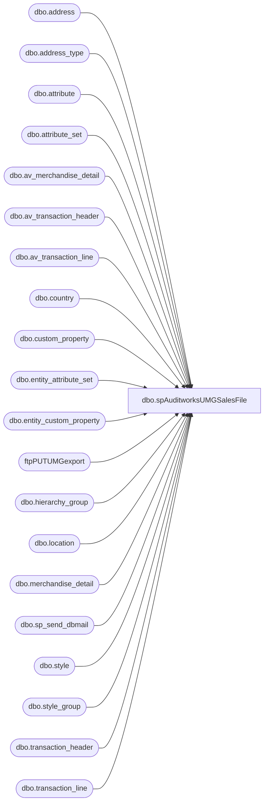

# dbo.spAuditworksUMGSalesFile

**Database:** auditworks  
**Server:** bedrockdb01  

## Architecture Diagram



## Table Dependencies

| Referenced Table |
|---|
| dbo.address |
| dbo.address_type |
| dbo.attribute |
| dbo.attribute_set |
| dbo.av_merchandise_detail |
| dbo.av_transaction_header |
| dbo.av_transaction_line |
| dbo.country |
| dbo.custom_property |
| dbo.entity_attribute_set |
| dbo.entity_custom_property |
| ftpPUTUMGexport |
| dbo.hierarchy_group |
| dbo.location |
| dbo.merchandise_detail |
| dbo.sp_send_dbmail |
| dbo.style |
| dbo.style_group |
| dbo.transaction_header |
| dbo.transaction_line |

## Stored Procedure Code

```sql
CREATE proc [dbo].[spAuditworksUMGSalesFile]

-- =====================================================================================================
-- Name: spAuditworksUMGSalesFile
--
-- Description:	Captures UMG digital sound sales data, uploads files to UMG company.
--				 
-- Revision History
--		Name:			Date:			Comments:
--		Dan Tweedie		11/12/2013		Created proc.
--		Dan Tweedie		01/17/2014		Updated Auditworks query to filter by transaction_date instead of entry_date_time, and to reference transaction_no instead of transaction_id	
-- =====================================================================================================

as 

set nocount on


--get locations and timezones
IF (Object_ID('tempdb..#GMT') IS NOT NULL) DROP TABLE #GMT
select l.location_code, att.attribute_set_label HoursGMT, c.country_code
into #GMT
from BEDROCKDB02.me_01.dbo.location l
join	BEDROCKDB02.me_01.dbo.entity_attribute_set eas on l.location_id = eas.parent_id
join	BEDROCKDB02.me_01.dbo.attribute_set att on eas.attribute_set_id = att.attribute_set_id
join	BEDROCKDB02.me_01.dbo.attribute a on att.attribute_id = a.attribute_id
join	BEDROCKDB02.me_01.dbo.address ad on l.location_id = ad.parent_id
join	BEDROCKDB02.me_01.dbo.address_type at on ad.address_type_id = at.address_type_id
join	BEDROCKDB02.me_01.dbo.country c on ad.country_id = c.country_id
where a.attribute_code = 'TMZN'
and ad.parent_type = 2
and ad.address_type_id = 1


--capture the HIPVEN styles and necessary custom properties and attributes
IF (Object_ID('tempdb..#styles') IS NOT NULL) DROP TABLE #styles
select a.style_code, a.short_desc,
max(a.Artist) artist, max(a.Title) title, max(a.ISRC) isrc, max(a.HIPVEN) HIPVEN
into #styles
from 
	(select distinct s.style_code, s.short_desc,
	case when cp.cust_prop_code = 'ARTIST' then ecp.custom_property_value end as Artist,
	case when cp.cust_prop_code = 'TITLE' then ecp.custom_property_value end as Title,
	case when cp.cust_prop_code = 'TRK ID' then ecp.custom_property_value end as ISRC,
	case when att.attribute_set_code = 'UMG' then 'UMG' else 'WMG' end as HIPVEN
	from BEDROCKDB02.me_01.dbo.style s (nolock) 
	join BEDROCKDB02.me_01.dbo.style_group sg (nolock) on s.style_id = sg.style_id
	join BEDROCKDB02.me_01.dbo.hierarchy_group hg (nolock) on sg.hierarchy_group_id = hg.hierarchy_group_id
	left join BEDROCKDB02.me_01.dbo.entity_custom_property ecp on s.style_id = ecp.parent_id and ecp.parent_type = 1
	left join BEDROCKDB02.me_01.dbo.custom_property cp (nolock) on cp.custom_property_id = ecp.custom_property_id
	left join BEDROCKDB02.me_01.dbo.entity_attribute_set eas (nolock) on s.style_id = eas.parent_id
	left join BEDROCKDB02.me_01.dbo.attribute_set att (nolock) on eas.attribute_set_id = att.attribute_set_id
	left join BEDROCKDB02.me_01.dbo.attribute a (nolock) on att.attribute_id = a.attribute_id and a.parent_type = 1
	where cp.cust_prop_code in ('ARTIST','TITLE','TRK ID')
	and a.attribute_code = 'HIPVEN') as a
group by a.style_code, a.short_desc
order by 6,a.style_code

----
DECLARE @StartDate DATETIME, @EndDate DATETIME
SET @StartDate = DATEADD(mm, DATEDIFF(mm,0,getdate())-1, 0)
SET @EndDate = DATEADD(mm, 1, @StartDate)-1

IF (Object_ID('tempdb..#transactions') IS NOT NULL) DROP TABLE #transactions
SELECT	th.store_no,
		th.transaction_no transaction_id,
		th.entry_date_time,
		CONVERT(VARCHAR,DATEADD(HOUR,+(cast(g.HoursGMT as int)),th.entry_date_time),120) AS transaction_datetime_GMT,
		tl.reference_no as style_code,
		case when tl.line_action = 1
			then 'S'
			else 'R'
		end TransType,
		md.sold_at_price as RetailPrice,
		cast(units as int) units,
		g.country_code
into #transactions
FROM	auditworks.dbo.transaction_line tl (nolock) 
join	auditworks.dbo.transaction_header th (nolock) on th.transaction_id = tl.transaction_id
join	auditworks.dbo.merchandise_detail md (nolock) on th.transaction_id = md.transaction_id and tl.line_id = md.line_id
join	#GMT g on g.location_code = right(('0000' + cast(th.store_no as varchar)), 4)
WHERE	th.transaction_void_flag = 0 
AND		tl.line_void_flag = 0
AND		tl.line_object = 100
AND		tl.reference_no in (select style_code from #styles where hipven = 'UMG')
--and DATEADD(HOUR,+(cast(g.HoursGMT as int)),th.transaction_date) between @StartDate and @EndDate
AND     th.transaction_date between @StartDate and @EndDate
UNION ALL 
SELECT	th.store_no,
		th.transaction_no transaction_id,
		th.entry_date_time,
		CONVERT(VARCHAR,DATEADD(HOUR,+(cast(g.HoursGMT as int)),th.entry_date_time),120) AS transaction_datetime_GMT,
		tl.reference_no as style_code,
		case when tl.line_action = 1
			then 'S'
			else 'R'
		end TransType,
		md.sold_at_price as RetailPrice,
		cast(units as int) units,
		g.country_code
FROM	auditworks.dbo.av_transaction_line tl (nolock) 
join	auditworks.dbo.av_transaction_header th (nolock) on th.av_transaction_id = tl.av_transaction_id
join	auditworks.dbo.av_merchandise_detail md (nolock) on th.av_transaction_id = md.av_transaction_id and tl.line_id = md.line_id
join	#GMT g on g.location_code = right(('0000' + cast(th.store_no as varchar)), 4)
WHERE	th.transaction_void_flag = 0 
AND		tl.line_void_flag = 0
AND		tl.line_object = 100
AND		tl.reference_no in (select style_code from #styles where hipven = 'UMG')
--and DATEADD(HOUR,+(cast(g.HoursGMT as int)),th.transaction_date) between @StartDate and @EndDate
AND     th.transaction_date between @StartDate and @EndDate
order by CONVERT(VARCHAR,DATEADD(HOUR,+(cast(g.HoursGMT as int)),th.entry_date_time),120), th.store_no, th.transaction_no, tl.reference_no


--join transactions with attributes & custom properties so it's all in one table
IF (Object_ID('tempdb..#data') IS NOT NULL) DROP TABLE #data
select t.*, s.artist, s.title, s.isrc, s.hipven
into #data
from #transactions t
join #styles s on t.style_code = s.style_code
order by transaction_datetime_GMT

--header
IF (Object_ID('tempdb..##header') IS NOT NULL) DROP TABLE ##header
select '142803' as AccountNumber,
	   convert(varchar, @StartDate, 112) as StartDate,
	   convert(varchar, @EndDate, 112) as EndDate,
	   sum(units) as Units,
	   sum(units) * 1.00 as ExtendedAmount,
	   count(transaction_id) as RecordCount, --number of records in the detail file
	   NULL as UserDefinedData
into ##header
from #data

--detail
IF (Object_ID('tempdb..##detail') IS NOT NULL) DROP TABLE ##detail
select '142803' as AccountNumber, --
       '20' as SalesChannel,
	   'T' as AlbumOrTrack,
	   isrc as ISRC,
	   NULL as SourceUPC,
	   NULL as CatalogNo,
	   artist as TrackArtist,
	   title as TrackTitle,
	   NULL as AlbumArtist,
	   NULL as AlbumTitle,
	   convert(varchar, @StartDate, 112) as StartDate,
	   convert(varchar, @EndDate, 112) as EndDate,
	   TransType as SaleOrRefund,
	   units as Units,
	   RetailPrice as RetailPrice,
	   NULL as Filler,
	   '1.00' as NetPriceUnit,
	   units * 1.00 as ExtendedAmount,
	   NULL as UserDefinedData,
	   NULL as PriceCode,
	   NULL as Promotiontype,
	   NULL as UpgradeType,
	   country_code as TerritoryCode, --if not U.S. needs to be GB, etc 
	   NULL as Affiliate 
into ##detail
from #data

--produce pipe | delimited header and detail files --need to change this to BCP so there's no headers...
---HEADER FILE

		declare @query varchar(1000),
		@date varchar(52),
		@file_name varchar(100),
		@file_location varchar(100),
		@server varchar(20),
		@database varchar(20),
		@bcp varchar(1000)

		set @query = 'set nocount on select * from ##header'
		select @date = convert(varchar, datepart(yyyy, getdate())) + convert(varchar, datepart(mm, getdate())) + convert(varchar, datepart(dd, getdate()))
		set @file_location = '\\kermode\FileRepository\AUDITWORKS\UMG\'
		set @file_name = 'Build-A-Bear' + @date + 'header.txt'
		set @server = 'BEDROCKDB01'
		set @database = 'auditworks'
		--set @bcp = 'bcp "' + @query + '" queryout "' + @file_location + @file_name + '"  -T -c -S' + @server 
		set @bcp = 'bcp "' + @query + '" queryout "' + @file_location + @file_name + '"  -t"|" -T -c -S' + @server 

		exec master..xp_cmdshell @bcp
		

---DETAIL FILE

		declare @query2 varchar(1000),
		@date2 varchar(52),
		@file_name2 varchar(100),
		@file_location2 varchar(100),
		@server2 varchar(20),
		@database2 varchar(20),
		@bcp2 varchar(1000)

		set @query2 = 'set nocount on select * from ##detail'
		select @date2 = convert(varchar, datepart(yyyy, getdate())) + convert(varchar, datepart(mm, getdate())) + convert(varchar, datepart(dd, getdate()))
		set @file_location2 = '\\kermode\FileRepository\AUDITWORKS\UMG\'
		set @file_name2 = 'Build-A-Bear' + @date2 + 'detail.txt'
		set @server2 = 'BEDROCKDB02'
		set @database2 = 'auditworks'
		--set @bcp = 'bcp "' + @query + '" queryout "' + @file_location + @file_name + '"  -T -c -S' + @server 
		set @bcp2 = 'bcp "' + @query2 + '" queryout "' + @file_location2 + @file_name2 + '"  -t"|" -T -c -S' + @server2 

		exec master..xp_cmdshell @bcp2

-----FTP to UMG
declare @ftpPUT varchar(1000),
		@Log_query varchar(1000),
		@Log_filename varchar(100),
		@Log_file_location varchar(100),
		@Log_bcp varchar(1000),
		@body varchar(4000)
							
set @ftpPUT = 'ftp -d -s:\\kermode\FileRepository\AUDITWORKS\UMG\FTP\ftpPUT.txt' 

--create temp tables for ftp logs
IF (Object_ID('auditworks..ftpPUTUMGexport') IS NOT NULL) DROP TABLE ftpPUTUMGexport
create table ftpPUTUMGexport
(ftpLog varchar(4000))


--execute sql/ftp
----connect to ftp server, if connection unsuccessful, send email
insert ftpPUTUMGexport exec master..xp_cmdshell @ftpPUT
if (select count(*) from ftpPUTUMGexport where ftpLog like '%Transfer complete%') < 1
	begin
		set @Log_query = 'select * from auditworks.dbo.ftpPUTUMGexport'
		set @Log_filename = 'ftpPUTLog.txt'
		set @Log_file_location = '\\kermode\FileRepository\AUDITWORKS\UMG\FTP\'
		set @Log_bcp = 'bcp "' + @Log_query + '" queryout "' + @Log_file_location + @Log_filename + '" -t, -T -c -SBEDROCKDB01'

		exec master..xp_cmdshell @Log_bcp
															
		set @body =	'An attempt to FTP a File from BABW to UMG has failed. This is file is a monthly report of digital UMG sales.' 
					+ char(10) + char(13) + 
					'See the attached log for details.'
					+ char(10) + char(13) + 
					+ char(10) + char(13) + 
					'This process is managed by BEDROCKDB01.Auditworks.dbo.spAuditworksUMGSalesFile controlled by SQL Agent Job PROCESS - UMG SALES REPORT on BEDROCKDB01.'
							
		EXEC msdb.dbo.sp_send_dbmail
		@profile_name = 'MerchAdmin',
		@recipients = 'merchadmin@buildabear.com',
		@subject = 'FTP Failure: UMG Digital Sales File',
		@body = @body,
		@file_attachments = '\\kermode\FileRepository\AUDITWORKS\UMG\FTP\ftpPUT.txt',
		@importance = 'HIGH'
	end
else
	begin
		EXEC master..xp_cmdshell 'move \\kermode\FileRepository\AUDITWORKS\UMG\* \\kermode\FileRepository\MERCHANDISING\HIP\UMG_Reports\'
	end
```

