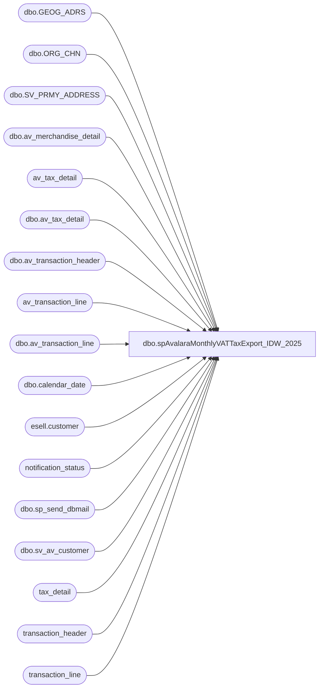

# dbo.spAvalaraMonthlyVATTaxExport_IDW_2025

**Database:** auditworks  
**Server:** bedrockdb01  

## Architecture Diagram



## Table Dependencies

| Referenced Table |
|---|
| dbo.GEOG_ADRS |
| dbo.ORG_CHN |
| dbo.SV_PRMY_ADDRESS |
| dbo.av_merchandise_detail |
| av_tax_detail |
| dbo.av_tax_detail |
| dbo.av_transaction_header |
| av_transaction_line |
| dbo.av_transaction_line |
| dbo.calendar_date |
| esell.customer |
| notification_status |
| dbo.sp_send_dbmail |
| dbo.sv_av_customer |
| tax_detail |
| transaction_header |
| transaction_line |

## Stored Procedure Code

```sql
CREATE procedure [dbo].[spAvalaraMonthlyVATTaxExport_IDW_2025]
--@TransactionStartDate as int
--,@TransactionEndDate as int

AS
-- =====================================================================================================
-- Name: spAvalaraMonthlyVATTaxExport
--
-- Description:	Monthly Sales Tax Export for manual upload to Avalara by the Tax department	
--	
--
-- Input:  n/a
--			
--
-- Output: .multitxt (tab delimited)
--			
--
-- Schedule: Daily
--    		
--
-- Dependencies: Period End successful completion	
--	
--
-- Revision History
--		Name:				Date:			Comments:
--		Paul Beckman		02/07/2019		Created stored proc
--		Keith Lee			09/24/2021		Updated stored proc in collaboration with Accounting tested and completed
--      Ian Wallace			02/29/2024		Added fix for round-up donation VAT overstating
-- exec spAvalaraMonthlyVATTaxExport
-- 
-- =====================================================================================================

SET NOCOUNT ON


--####################################
-- Check for same day job completion
--####################################

--IF (SELECT COUNT(*) FROM notification_status WHERE reported = 1 AND CONVERT(VARCHAR(19),first_reported,101) = CONVERT(VARCHAR(19),GETDATE(),101) AND notification_name = 'Avalara VAT Tax file generated' AND reported_cleared IS NULL) = 1
--GOTO FINISH

--IF (SELECT COUNT(*) FROM notification_status WHERE reported = 1 AND CONVERT(VARCHAR(19),first_reported,101) != CONVERT(VARCHAR(19),GETDATE(),101) AND notification_name = 'Avalara VAT Tax file generated' AND reported_cleared IS NULL) = 1
--BEGIN
--	UPDATE notification_status
--	SET reported = 0,reported_cleared = CONVERT(VARCHAR(19),GETDATE(),120)
--	WHERE CONVERT(VARCHAR(19),first_reported,101) != CONVERT(VARCHAR(19),GETDATE(),101)
--	AND notification_name = 'Avalara VAT Tax file generated'
--END


--####################################
-- Temp Tables
--####################################

IF (Object_ID('tempdb..##StartJobCheck') IS NOT NULL) DROP TABLE ##StartJobCheck
IF (Object_ID('tempdb..##TaxStoreData') IS NOT NULL) DROP TABLE ##TaxStoreData
IF (Object_ID('tempdb..##TaxCountryList') IS NOT NULL) DROP TABLE ##TaxCountryList
--IF (Object_ID('tempdb..##TaxCodes') IS NOT NULL) DROP TABLE ##TaxCodes
IF (Object_ID('tempdb..##TaxLineCounts') IS NOT NULL) DROP TABLE ##TaxLineCounts
IF (Object_ID('tempdb..##TaxSalesDetail') IS NOT NULL) DROP TABLE ##TaxSalesDetail
IF (Object_ID('tempdb..##TaxExemptSalesDetail') IS NOT NULL) DROP TABLE ##TaxExemptSalesDetail
IF (Object_ID('tempdb..##TaxESSalesDetail') IS NOT NULL) DROP TABLE ##TaxESSalesDetail
IF (Object_ID('tempdb..##TaxSendSaleSalesDetail') IS NOT NULL) DROP TABLE ##TaxSendSaleSalesDetail
IF (Object_ID('tempdb..##TaxDetailResults') IS NOT NULL) DROP TABLE ##TaxDetailResults
IF (Object_ID('tempdb..##TaxDetailResultsFinal') IS NOT NULL) DROP TABLE ##TaxDetailResultsFinal
IF (Object_ID('tempdb..##TaxSummaryResults') IS NOT NULL) DROP TABLE ##TaxSummaryResults
IF (Object_ID('tempdb..##TaxSummaryOutput') IS NOT NULL) DROP TABLE ##TaxSummaryOutput
IF (Object_ID('tempdb..##TaxExportHeaders') IS NOT NULL) DROP TABLE ##TaxExportHeaders
IF (Object_ID('tempdb..##merchyearweek') IS NOT NULL) DROP TABLE ##merchyearweek
IF (Object_ID('tempdb..##taxedDonations') IS NOT NULL) DROP TABLE ##taxedDonations

--####################################
-- Declare script variables
--####################################

DECLARE @SQL VARCHAR(8000)
DECLARE @CMD VARCHAR(4000)
DECLARE @FileDate VARCHAR(14)
DECLARE @FileName VARCHAR(60)
DECLARE @FilePath VARCHAR(90)
DECLARE @AvalaraFilePath VARCHAR(90)
DECLARE @BackupFilePath VARCHAR(90)
DECLARE @TempFilePath VARCHAR(90)
DECLARE @TransactionStartDate DATE
DECLARE @TransactionEndDate DATE

DECLARE @ChkFileDrive VARCHAR(5)  
DECLARE @ChkFileCMD VARCHAR(200)
DECLARE @ChkFileCount VARCHAR(5)

DECLARE @Recipients VARCHAR(4000)
DECLARE @Copy_Recipients VARCHAR(4000)
DECLARE @Subject VARCHAR(80)
DECLARE @Query VARCHAR(8000)
DECLARE @Text NVARCHAR(MAX)
DECLARE @EmailAttachment VARCHAR(100)


--####################################
-- Set Date range used by schedule
--####################################


--SELECT CONVERT(VARCHAR(10), clp.STRT_DATE_TIME, 121) AS STRT_DATE_TIME
--	,CONVERT(VARCHAR(10), DATEADD(DAY,-1,clp.END_DATE_TIME), 121) AS END_DATE_TIME
--INTO ##StartJobCheck
--FROM CLNDR_PRD clp
--JOIN CRDM_PRMTRS cp ON clp.CLNDR_ID = cp.PRMTR_VAL_BIN
--WHERE clp.CLNDR_PRD_NAME LIKE 'Period%'
--AND clp.STRT_DATE_TIME < (SELECT DATEADD(DAY,-1,clp.STRT_DATE_TIME) 
--		FROM CLNDR_PRD clp
--		JOIN CRDM_PRMTRS cp ON clp.CLNDR_ID = cp.PRMTR_VAL_BIN
--		WHERE clp.CLNDR_PRD_NAME LIKE 'Period%'
--		AND clp.STRT_DATE_TIME < GETDATE()
--		AND clp.END_DATE_TIME > GETDATE())
--AND clp.END_DATE_TIME > (SELECT DATEADD(DAY,-1,STRT_DATE_TIME) 
--		FROM CLNDR_PRD clp
--		JOIN CRDM_PRMTRS cp ON clp.CLNDR_ID = cp.PRMTR_VAL_BIN
--		WHERE clp.CLNDR_PRD_NAME LIKE 'Period%'
--		AND clp.STRT_DATE_TIME < GETDATE()
--		AND clp.END_DATE_TIME > GETDATE())
--AND (SELECT COUNT(*)
--		FROM period_end_status
--		WHERE period_end_status = 0
--		AND CONVERT(VARCHAR(10), process_end_time, 120) = CONVERT(VARCHAR(10), GETDATE(), 120)) = 1  ----- Add -# of days to back date
--AND (SELECT COUNT(*)
--		FROM parameter_general
--		WHERE period_end_date = (SELECT DATEADD(DAY,-1,STRT_DATE_TIME) 
--			FROM CLNDR_PRD clp
--			JOIN CRDM_PRMTRS cp ON clp.CLNDR_ID = cp.PRMTR_VAL_BIN
--			WHERE clp.CLNDR_PRD_NAME LIKE 'Period%'
--			AND STRT_DATE_TIME < GETDATE()
--			AND END_DATE_TIME > GETDATE())
--		AND dayend_in_progress = 0
--		AND period_end_in_progress = 0
--		AND period_end_date < (SELECT process_end_time FROM period_end_status)) = 1


		


--IF (SELECT COUNT(*) FROM ##StartJobCheck) = 0
--GOTO FINISH


--####################################
-- Set dates 
--####################################

--SET @TransactionStartDate = (SELECT STRT_DATE_TIME FROM ##StartJobCheck)
--SET @TransactionEndDate = (SELECT END_DATE_TIME FROM ##StartJobCheck)

-->>>>>>   Set dates then uncomment these two SET statements when running manually   <<<<<<--
--SET @TransactionStartDate = '2024-02-04'
--SET @TransactionEndDate = '2024-03-02'

SET @TransactionStartDate = '2024-05-05'
SET @TransactionEndDate = '2024-06-24'
 

--####################################
-- Build Store info
--####################################

SELECT oc.ORG_CHN_NUM
	,oc.TAX_JRSDCTN_CODE
	,CASE WHEN ga.ADRS_LINE_2 IS NULL THEN ga.ADRS_LINE_1 ELSE ga.ADRS_LINE_1 + ' ' + ga.ADRS_LINE_2
		END AS StrAddress
	,ga.CITY AS StrCity
	,ga.TRTRY_CODE AS StrRegion -- state
	,CONVERT(VARCHAR(10),ga.POST_CODE) AS StrPostalCode
	,ga.CNTRY_CODE_ISO3 AS StrCountry
	,oc.DFLT_CRNCY_CODE
	,CASE WHEN len(oc.ORG_CHN_NUM) < 4 THEN '1' + RIGHT('000' + CAST(oc.ORG_CHN_NUM AS VARCHAR(4)),3)
			WHEN len(oc.ORG_CHN_NUM) = 4 THEN CAST(CONVERT(CHAR,oc.ORG_CHN_NUM,4) AS VARCHAR(4))
			END AS CustomerCode
INTO ##TaxStoreData
FROM	auditworks.dbo.ORG_CHN oc WITH (NOLOCK)
	JOIN	auditworks.dbo.SV_PRMY_ADDRESS spa WITH (NOLOCK) ON oc.PRTY_ID = spa.PRTY_ID
	JOIN	auditworks.dbo.GEOG_ADRS ga WITH (NOLOCK) ON spa.ADRS_ID = ga.ADRS_ID
WHERE oc.ORG_CHN_NUM BETWEEN 1 AND 3100
AND oc.ORG_CHN_TYPE_CODE !='WH'
--AND oc.TAX_JRSDCTN_CODE IS NOT NULL\
--and  oc.ORG_CHN_NUM = 2010
ORDER BY oc.ORG_CHN_NUM

INSERT INTO ##TaxStoreData VALUES('9999',NULL,'2nd Floor Aquasulis House 10-14 Bath Road','Slough','','SL1 3SA','GBR','GBP','9999')

UPDATE ##TaxStoreData
SET StrAddress = REPLACE(StrAddress, ',', '')
WHERE CHARINDEX(',', StrAddress) > 0


--####################################
-- Build Country info
--####################################

SELECT ROW_NUMBER() OVER(ORDER BY StrCountry ASC) AS CountryID
	,StrCountry
	,CASE WHEN StrCountry = 'USA' THEN 'US'
		WHEN StrCountry = 'CAN' THEN 'CA'
		WHEN StrCountry = 'GBR' THEN 'GB'
		WHEN StrCountry = 'IRL' THEN 'IE'
		WHEN StrCountry = 'DNK' THEN 'DK'
		WHEN StrCountry = 'DEU' THEN 'DE'
		WHEN StrCountry = 'CHN' THEN 'CN'
			END AS ISO2
INTO ##TaxCountryList
FROM ##TaxStoreData
WHERE StrCountry IN ('GBR') --<< Add new countries here
GROUP BY StrCountry

--####################################
-- Build Tax Item Groups -- not needed since we are separating the taxable and non-tax transactions separately
--####################################

--SELECT tax_item_group_id
--	,CASE WHEN tax_item_group_id = 10 THEN 'UK-ZEROS'
--		WHEN tax_item_group_id = 20 THEN 'UK-STDS'
--		WHEN tax_item_group_id = 21 THEN 'UK-STDS'
--		WHEN tax_item_group_id = 22 THEN 'UK-STDS'
--		WHEN tax_item_group_id = 41 THEN 'UK-STDS'
----		WHEN tax_item_group_id = CANDY THEN 'PF050300'
--		ELSE tax_item_group_description
--			END AS 'TaxCode'
--INTO ##TaxCodes
--FROM auditworks.dbo.tax_item_group WITH (NOLOCK)


--####################################
-- donations with tax to be excluded from final output
--####################################

select 
tl.transaction_id, 
tl.line_id
, td.tax_amount
into ##taxedDonations
from transaction_line tl (nolock)
join tax_detail td (nolock) on td.transaction_id = tl.transaction_id 
				and tl.line_id = td.line_id
where 1=1
and tl.line_object in ('101','292') -- Donation Line Objects 
and td.tax_amount <> 0.00 -- Performance Purposes 
group by
tl.transaction_id, 
td.line_id, 
tl.line_id
, td.tax_amount
union 
select 
tl.av_transaction_id, 
tl.line_id
, td.tax_amount
from av_transaction_line tl (nolock) 
join av_tax_detail td (nolock) on td.av_transaction_id = tl.av_transaction_id 
				and tl.line_id = td.line_id
left join transaction_header th (nolock) on tl.av_transaction_id = th.transaction_id
where 1=1
and th.transaction_id is null  -- Transaction Is Not In current Period 
and tl.line_object in ('101','292') -- Donation Line Objects 
and td.tax_amount <> 0.00 -- Performance Purposes 
group by
tl.av_transaction_id, 
td.line_id, 
tl.line_id
, td.tax_amount


--####################################
-- Build Taxable Sales Detail
--####################################

SELECT	tl.line_id
		,th.av_transaction_id AS Ref2
		,CASE WHEN tl.db_cr_none = -1 THEN '0'
			ELSE '2'
				END AS DocumentType
		,CONVERT(VARCHAR(10),th.transaction_date,120) AS TransactionDate
		,CASE WHEN tl.db_cr_none = -1 THEN 'S' + CONVERT(VARCHAR(4),sd.CustomerCode) + CONVERT(VARCHAR(8),th.transaction_date,112) + RIGHT('0' + CAST(th.register_no AS VARCHAR(3)),2) + RIGHT('0000000' + CAST(transaction_no AS VARCHAR(15)),8) 
			ELSE 'R' + CONVERT(VARCHAR(4),sd.CustomerCode) + CONVERT(VARCHAR(8),th.transaction_date,112) + RIGHT('0' + CAST(th.register_no AS VARCHAR(3)),2) + RIGHT('0000000' + CAST(transaction_no AS VARCHAR(15)),8)
				END AS InvoiceNumber
		,CONVERT(VARCHAR(10),th.transaction_date,120) AS InvoiceDate
		,sd.DFLT_CRNCY_CODE AS Currency
		,'UK-STDS ' AS VATCode
		,'2110' AS SupplierID
		,'BABWUK' AS 'SupplierName'
		,'GB' AS SupplierCountry
		,'GB880982284' AS SupplierVATNumberUsed
		,'GB' AS SupplierCountryVATNumberUsed
		,CASE WHEN LEN(th.store_no) < 4 THEN '1' + RIGHT('000' + CAST(th.store_no AS VARCHAR(4)),3)
			ELSE th.store_no
				END AS CustomerID
		,CASE WHEN LEN(th.store_no) < 4 THEN '1' + RIGHT('000' + CAST(th.store_no AS VARCHAR(4)),3)
			ELSE th.store_no
				END AS CustomerName
		,CASE WHEN sd.StrCountry = 'GBR' THEN 'GB'
				END AS CustomerCountry
		,'GB' + CONVERT(VARCHAR(4),sd.CustomerCode) AS CustomerVATNumberUsed
		,CASE WHEN sd.StrCountry = 'GBR' THEN 'GB'
				END AS CustomerCountryVATNumberUsed
		--,CASE WHEN tl.db_cr_none = -1 THEN  td.taxable_amount else  (-1 *  td.taxable_amount) end AS TaxableBasis
		--,CASE WHEN tl.db_cr_none = -1 THEN  td.tax_amount_expected else  (-1 *  td.tax_amount_expected) end	AS ValueVAT
		--,CASE WHEN tl.db_cr_none = -1 THEN  td.tax_amount_expected + td.taxable_amount else  (-1 *  (td.tax_amount_expected + td.taxable_amount)) end AS 'TotalValueLine'		
		,td.taxable_amount AS TaxableBasis
		,td.tax_amount_expected	AS ValueVAT
		,td.tax_amount_expected + td.taxable_amount AS 'TotalValueLine'	
		
		,CASE WHEN tl.db_cr_none = -1 THEN '0'
			ELSE '0'
				END AS AmountVATDeducted		
		,0 as AmountVATReverseCharged

INTO	##TaxSalesDetail
FROM 	auditworks.dbo.av_transaction_header th WITH (NOLOCK)
JOIN	auditworks.dbo.av_transaction_line tl WITH (NOLOCK) ON th.av_transaction_id=tl.av_transaction_id 
--JOIN	auditworks.dbo.av_merchandise_detail smd WITH (NOLOCK) ON th.transaction_id = smd.transaction_id AND tl.line_id = smd.line_id -- unlinked as per Dawn on 5/10 so we included non-merch transactions
LEFT JOIN	auditworks.dbo.av_tax_detail td WITH (NOLOCK) ON th.av_transaction_id = td.av_transaction_id AND tl.line_id = td.line_id
JOIN	##TaxStoreData sd WITH (NOLOCK) ON th.store_no = sd.ORG_CHN_NUM
left join ##taxedDonations tdo on  tl.av_transaction_id = tdo.transaction_id and tl.line_id = tdo.line_id 
--JOIN	##TaxCodes tc WITH (NOLOCK) ON tc.tax_item_group_id = td.tax_item_group_id
WHERE	sd.StrCountry IN ('GBR')
AND		th.store_no BETWEEN 1 AND 3100
--and		th.store_no = 2001
AND		th.transaction_void_flag = 0   
AND		tl.line_void_flag = 0 
--AND		tl.line_object IN (100)
AND		tl.interface_rejection_flag = 0 
AND		th.sa_rejection_flag = 0
AND		th.store_no NOT IN (13)
AND		td.tax_category NOT IN (1,3)
AND		td.tax_level NOT IN (4,10,15)
and	td.applied_by_line_id is null
and     tdo.line_id is null
AND		th.transaction_date BETWEEN @TransactionStartDate AND @TransactionEndDate

SELECT DISTINCT *
INTO ##TaxDetailResults
FROM ##TaxSalesDetail
WHERE TaxableBasis + ValueVAT != 0


--####################################
-- Build Tax Exempt Sales Detail
--####################################

SELECT	tl.line_id
		,th.av_transaction_id AS Ref2
		,CASE WHEN tl.db_cr_none = -1 THEN '0'
			ELSE '2'
				END AS DocumentType
		,CONVERT(VARCHAR(10),th.transaction_date,120) AS TransactionDate
		,CASE WHEN tl.db_cr_none = -1 THEN 'S' + CONVERT(VARCHAR(4),sd.CustomerCode) + CONVERT(VARCHAR(8),th.transaction_date,112) + RIGHT('0' + CAST(th.register_no AS VARCHAR(3)),2) + RIGHT('0000000' + CAST(transaction_no AS VARCHAR(15)),8) 
			ELSE 'R' + CONVERT(VARCHAR(4),sd.CustomerCode) + CONVERT(VARCHAR(8),th.transaction_date,112) + RIGHT('0' + CAST(th.register_no AS VARCHAR(3)),2) + RIGHT('0000000' + CAST(transaction_no AS VARCHAR(15)),8)
				END AS InvoiceNumber
		,CONVERT(VARCHAR(10),th.transaction_date,120) AS InvoiceDate
		,sd.DFLT_CRNCY_CODE AS Currency
		,'UK-ZEROS' AS VATCode
		,'2110' AS SupplierID
		,'BABWUK' AS 'SupplierName'
		,'GB' AS SupplierCountry
		,'GB880982284' AS SupplierVATNumberUsed
		,'GB' AS SupplierCountryVATNumberUsed
		,CASE WHEN LEN(th.store_no) < 4 THEN '1' + RIGHT('000' + CAST(th.store_no AS VARCHAR(4)),3)
			ELSE th.store_no
				END AS CustomerID
		,CASE WHEN LEN(th.store_no) < 4 THEN '1' + RIGHT('000' + CAST(th.store_no AS VARCHAR(4)),3)
			ELSE th.store_no
				END AS CustomerName
		,CASE WHEN sd.StrCountry = 'GBR' THEN 'GB'
				END AS CustomerCountry
		,'GB' + CONVERT(VARCHAR(4),sd.CustomerCode) AS CustomerVATNumberUsed
		,CASE WHEN sd.StrCountry = 'GBR' THEN 'GB'
				END AS CustomerCountryVATNumberUsed
		,tl.gross_line_amount - tl.pos_discount_amount  AS TaxableBasis -- Changed to gross_line_amount as per Dawn on 5/10
		,td.tax_amount AS ValueVAT
		,tl.gross_line_amount - tl.pos_discount_amount AS 'TotalValueLine' -- Changed to gross_line_amount as per Dawn on 5/10
		,CASE WHEN tl.db_cr_none = -1 THEN '0'
			ELSE '0'
				END AS AmountVATDeducted
		,0 as AmountVATReverseCharged -- Changed to hard code zero as per Dawn on 5/11 since this is already provided in D365

INTO	##TaxExemptSalesDetail
FROM 	auditworks.dbo.av_transaction_header th WITH (NOLOCK)
JOIN	auditworks.dbo.av_transaction_line tl WITH (NOLOCK) ON th.av_transaction_id=tl.av_transaction_id
LEFT JOIN	auditworks.dbo.av_tax_detail td WITH (NOLOCK) ON th.av_transaction_id = td.av_transaction_id AND tl.line_id = td.line_id
--JOIN	##Taxable t WITH (NOLOCK) ON tl.line_object_type = t.line_object_type AND tl.line_object = t.line_object 
JOIN	##TaxStoreData sd WITH (NOLOCK) ON th.store_no = sd.ORG_CHN_NUM
--JOIN	##TaxCodes tc WITH (NOLOCK) ON tc.tax_item_group_id = td.tax_item_group_id
WHERE	sd.StrCountry IN ('GBR')
AND		th.store_no BETWEEN 1 AND 3100
--and	th.store_no = 2001
AND		th.transaction_void_flag = 0   
AND		tl.line_void_flag = 0
--AND		(td.tax_category = 3 OR td.tax_rate_code = 4)
AND		td.nontaxable_amount <> 0
and		td.taxable_amount = 0
--AND		td.tax_level NOT IN (4,10,15)
--AND		(tl.line_object IN (101,292) OR td.tax_category = 3)
--and	t.TAXABLE = 'NOTAX'
and tl.line_action = 1
AND		tl.interface_rejection_flag = 0
AND		th.sa_rejection_flag = 0
AND		th.store_no NOT IN (13)
and		(tl.line_object not between 400 and 499 and tl.line_object <> 101) -- excludes Gift Cards and Donations as per Christian Cook
AND		th.transaction_date BETWEEN @TransactionStartDate AND @TransactionEndDate

INSERT INTO ##TaxDetailResults
SELECT DISTINCT *
FROM ##TaxExemptSalesDetail
WHERE TaxableBasis + ValueVAT != 0


--####################################
-- Build ES Sale Taxable Sales Detail
--####################################

SELECT	tl.line_id
		,th.av_transaction_id AS Ref2
		,CASE WHEN tl.db_cr_none = -1 THEN '0'
			ELSE '2'
				END AS DocumentType
		,CONVERT(VARCHAR(10),th.transaction_date,120) AS TransactionDate
		,CASE WHEN tl.db_cr_none = -1 THEN 'S' + CONVERT(VARCHAR(4),sd.CustomerCode) + CONVERT(VARCHAR(8),th.transaction_date,112) + RIGHT('0' + CAST(th.register_no AS VARCHAR(3)),2) + RIGHT('0000000' + CAST(transaction_no AS VARCHAR(15)),8) 
			ELSE 'R' + CONVERT(VARCHAR(4),sd.CustomerCode) + CONVERT(VARCHAR(8),th.transaction_date,112) + RIGHT('0' + CAST(th.register_no AS VARCHAR(3)),2) + RIGHT('0000000' + CAST(transaction_no AS VARCHAR(15)),8)
				END AS InvoiceNumber
		,CONVERT(VARCHAR(10),th.transaction_date,120) AS InvoiceDate
		,sd.DFLT_CRNCY_CODE AS Currency
		,'UK-STDS ' AS VATCode
		,'2110' AS SupplierID
		,'BABWUK' AS 'SupplierName'
		,'GB' AS SupplierCountry
		,'GB880982284' AS SupplierVATNumberUsed
		,'GB' AS SupplierCountryVATNumberUsed
		,CASE WHEN LEN(th.store_no) < 4 THEN '1' + RIGHT('000' + CAST(th.store_no AS VARCHAR(4)),3)
			ELSE th.store_no
				END AS CustomerID
		,CASE WHEN LEN(th.store_no) < 4 THEN '1' + RIGHT('000' + CAST(th.store_no AS VARCHAR(4)),3)
			ELSE th.store_no
				END AS CustomerName
		,CASE WHEN sd.StrCountry = 'GBR' THEN 'GB'
				END AS CustomerCountry
		,'GB' + CONVERT(VARCHAR(4),sd.CustomerCode) AS CustomerVATNumberUsed
		,CASE WHEN sd.StrCountry = 'GBR' THEN 'GB'
				END AS CustomerCountryVATNumberUsed
		,CASE WHEN tl.db_cr_none = -1 THEN ABS(td.nontaxable_amount * tl.db_cr_none * tl.voiding_reversal_flag)
			ELSE ABS(td.nontaxable_amount * tl.db_cr_none * tl.voiding_reversal_flag)
				END AS TaxableBasis
		 ,td.tax_amount_expected	AS ValueVAT
		,CASE WHEN tl.db_cr_none = -1 THEN ABS((td.nontaxable_amount + td.tax_amount_expected) * tl.db_cr_none * tl.voiding_reversal_flag)
			ELSE ABS((td.nontaxable_amount + td.tax_amount_expected) * tl.db_cr_none * tl.voiding_reversal_flag)
				END AS 'TotalValueLine'
		,CASE WHEN tl.db_cr_none = -1 THEN '0'
			ELSE '0'
				END AS AmountVATDeducted
		,0 as AmountVATReverseCharged

INTO	##TaxESSalesDetail
FROM 	auditworks.dbo.av_transaction_header th WITH (NOLOCK)
JOIN	auditworks.dbo.av_transaction_line tl WITH (NOLOCK) ON th.av_transaction_id=tl.av_transaction_id 
JOIN	auditworks.dbo.av_merchandise_detail smd WITH (NOLOCK) ON th.av_transaction_id = smd.av_transaction_id AND tl.line_id = smd.line_id
LEFT JOIN	auditworks.dbo.av_tax_detail td WITH (NOLOCK) ON th.av_transaction_id = td.av_transaction_id AND tl.line_id = td.line_id
JOIN	BEDROCKDB02.esell.esell.customer cs WITH (NOLOCK) ON CONVERT(VARCHAR(20),cs.order_id)COLLATE SQL_Latin1_General_CP1_CI_AS = CONVERT(VARCHAR(20),'U' + tl.reference_no)
JOIN	##TaxStoreData sd WITH (NOLOCK) ON th.store_no = sd.ORG_CHN_NUM
--JOIN	##TaxCodes tc WITH (NOLOCK) ON tc.tax_item_group_id = td.tax_item_group_id
WHERE	sd.StrCountry IN ('GBR')
AND		th.store_no BETWEEN 1 AND 3100
AND		th.transaction_void_flag = 0   
AND		tl.line_void_flag = 0 
--AND		tl.line_object IN (106)
AND		td.tax_category = 1
AND		td.tax_level NOT IN (4,10,15)
AND		tl.interface_rejection_flag = 0
AND		cs.cust_type = 'FULFILL-0'
AND		th.sa_rejection_flag = 0
AND		th.store_no NOT IN (13)
--and	th.store_no = 2001
AND		th.transaction_date BETWEEN @TransactionStartDate AND @TransactionEndDate
ORDER BY 2

INSERT INTO ##TaxDetailResults
SELECT DISTINCT *
FROM ##TaxESSalesDetail
WHERE TaxableBasis + ValueVAT != 0

--####################################
-- Build Send Sale Taxable Sales Detail
--####################################

SELECT	tl.line_id
		,th.av_transaction_id AS Ref2
		,CASE WHEN tl.db_cr_none = -1 THEN '0'
			ELSE '2'
				END AS DocumentType
		,CONVERT(VARCHAR(10),th.transaction_date,120) AS TransactionDate
		,CASE WHEN tl.db_cr_none = -1 THEN 'S' + CONVERT(VARCHAR(4),sd.CustomerCode) + CONVERT(VARCHAR(8),th.transaction_date,112) + RIGHT('0' + CAST(th.register_no AS VARCHAR(3)),2) + RIGHT('0000000' + CAST(transaction_no AS VARCHAR(15)),8) 
			ELSE 'R' + CONVERT(VARCHAR(4),sd.CustomerCode) + CONVERT(VARCHAR(8),th.transaction_date,112) + RIGHT('0' + CAST(th.register_no AS VARCHAR(3)),2) + RIGHT('0000000' + CAST(transaction_no AS VARCHAR(15)),8)
				END AS InvoiceNumber
		,CONVERT(VARCHAR(10),th.transaction_date,120) AS InvoiceDate
		,sd.DFLT_CRNCY_CODE AS Currency
		,'UK-STDS' AS VATCode
		,'2110' AS SupplierID
		,'BABWUK' AS 'SupplierName'
		,'GB' AS SupplierCountry
		,'GB880982284' AS SupplierVATNumberUsed
		,'GB' AS SupplierCountryVATNumberUsed
		,CASE WHEN LEN(th.store_no) < 4 THEN '1' + RIGHT('000' + CAST(th.store_no AS VARCHAR(4)),3)
			ELSE th.store_no
				END AS CustomerID
		,CASE WHEN LEN(th.store_no) < 4 THEN '1' + RIGHT('000' + CAST(th.store_no AS VARCHAR(4)),3)
			ELSE th.store_no
				END AS CustomerName
		,CASE WHEN sd.StrCountry = 'GBR' THEN 'GB'
				END AS CustomerCountry
		,'GB' + CONVERT(VARCHAR(4),sd.CustomerCode) AS CustomerVATNumberUsed
		,CASE WHEN sd.StrCountry = 'GBR' THEN 'GB'
				END AS CustomerCountryVATNumberUsed
		,CASE WHEN tl.db_cr_none = -1 THEN ABS(td.nontaxable_amount * tl.db_cr_none * tl.voiding_reversal_flag)
			ELSE ABS(td.nontaxable_amount * tl.db_cr_none * tl.voiding_reversal_flag)
				END AS TaxableBasis
		,td.tax_amount_expected AS ValueVAT
		,CASE WHEN tl.db_cr_none = -1 THEN ABS((td.nontaxable_amount + td.tax_amount_expected) * tl.db_cr_none * tl.voiding_reversal_flag)
			ELSE ABS((td.nontaxable_amount + td.tax_amount_expected) * tl.db_cr_none * tl.voiding_reversal_flag)
				END AS 'TotalValueLine'
		,CASE WHEN tl.db_cr_none = -1 THEN '0'
			ELSE '0'
				END AS AmountVATDeducted
		,0 as AmountVATReverseCharged

INTO	##TaxSendSaleSalesDetail
FROM 	auditworks.dbo.av_transaction_header th WITH (NOLOCK)
JOIN	auditworks.dbo.av_transaction_line tl WITH (NOLOCK) ON th.av_transaction_id=tl.av_transaction_id 
JOIN	auditworks.dbo.av_merchandise_detail smd WITH (NOLOCK) ON th.av_transaction_id = smd.av_transaction_id AND tl.line_id = smd.line_id
LEFT JOIN	auditworks.dbo.av_tax_detail td WITH (NOLOCK) ON th.av_transaction_id = td.av_transaction_id AND tl.line_id = td.line_id
JOIN	auditworks.dbo.sv_av_customer cs WITH (NOLOCK) ON cs.transaction_id = th.av_transaction_id
JOIN	##TaxStoreData sd WITH (NOLOCK) ON th.store_no = sd.ORG_CHN_NUM
--JOIN	##TaxCodes tc WITH (NOLOCK) ON tc.tax_item_group_id = td.tax_item_group_id
WHERE	sd.StrCountry IN ('GBR')
AND		th.store_no BETWEEN 1 AND 3100
AND		th.transaction_void_flag = 0   
AND		tl.line_void_flag = 0
AND		td.tax_category = 1
AND		td.tax_level NOT IN (4,10,15)
AND		tl.interface_rejection_flag = 0
AND		(cs.customer_role = 2 AND cs.line_id = 0)
AND		th.sa_rejection_flag = 0
AND		th.store_no NOT IN (13)
--and	th.store_no = 2001
AND		th.transaction_date BETWEEN @TransactionStartDate AND @TransactionEndDate
ORDER BY 2

INSERT INTO ##TaxDetailResults
SELECT DISTINCT *
FROM ##TaxSendSaleSalesDetail
WHERE TaxableBasis + ValueVAT != 0


--####################################
-- Add Row Counts to Tax Summary
--####################################

--SELECT Ref2 AS transaction_id
--	,line_id
--	,COUNT(line_id) AS line_count
--INTO ##TaxLineCounts
--FROM ##TaxDetailResults
--GROUP BY Ref2,line_id


--####################################
-- Use Row Count for calculation
-- for Final Detail Results
--####################################

SELECT tdr.DocumentType
	,tdr.TransactionDate
	,tdr.InvoiceNumber
	,tdr.InvoiceDate
	,tdr.Currency
	,tdr.VATCode
	,tdr.SupplierID
	,tdr.SupplierName
	,tdr.SupplierCountry
	,tdr.SupplierVATNumberUsed
	,tdr.SupplierCountryVATNumberUsed
	,tdr.CustomerID
	,tdr.CustomerName
	,tdr.CustomerCountry
	,tdr.CustomerVATNumberUsed
	,tdr.CustomerCountryVATNumberUsed
	,tdr.TaxableBasis
	,tdr.ValueVAT
	,tdr.TotalValueLine
	,tdr.AmountVATDeducted
	,tdr.AmountVATReverseCharged
	--,CASE WHEN tlc.line_count > 1 THEN CONVERT(DECIMAL(10,2),tdr.Amount/tlc.line_count)
	--	ELSE CONVERT(DECIMAL(10,2),tdr.Amount)
	--	END AS Amount
INTO ##TaxDetailResultsFinal
FROM ##TaxDetailResults tdr WITH(NOLOCK)
--JOIN ##TaxLineCounts tlc WITH(NOLOCK) ON tlc.transaction_id = tdr.Ref2 AND tlc.line_id = tdr.line_id


--####################################
-- Build Tax Summary
--####################################

SELECT	tsd.DocumentType
	,tsd.TransactionDate
	,tsd.InvoiceNumber
	,tsd.InvoiceDate
	,tsd.Currency
	,tsd.VATCode
	,tsd.SupplierID
	,tsd.SupplierName
	,tsd.SupplierCountry
	,tsd.SupplierVATNumberUsed
	,tsd.SupplierCountryVATNumberUsed
	,tsd.CustomerID
	,tsd.CustomerName
	,tsd.CustomerCountry
	,tsd.CustomerVATNumberUsed
	,tsd.CustomerCountryVATNumberUsed
	,SUM(tsd.TaxableBasis) AS TaxableBasis
	,SUM(tsd.ValueVAT) AS ValueVAT
	,SUM(tsd.TotalValueLine) AS TotalValueLine
	,tsd.AmountVATDeducted
	,SUM(tsd.AmountVATReverseCharged) AS AmountVATReverseCharged
INTO	##TaxSummaryResults
FROM 	##TaxDetailResultsFinal tsd
GROUP BY tsd.DocumentType
	,tsd.TransactionDate
	,tsd.InvoiceNumber
	,tsd.InvoiceDate
	,tsd.Currency
	,tsd.VATCode
	,tsd.SupplierID
	,tsd.SupplierName
	,tsd.SupplierCountry
	,tsd.SupplierVATNumberUsed
	,tsd.SupplierCountryVATNumberUsed
	,tsd.CustomerID
	,tsd.CustomerName
	,tsd.CustomerCountry
	,tsd.CustomerVATNumberUsed
	,tsd.CustomerCountryVATNumberUsed
	,tsd.AmountVATDeducted
ORDER BY tsd.TransactionDate
		,tsd.InvoiceNumber

--UPDATE ##TaxSummaryResults
--SET DestAddress = REPLACE(DestAddress, ',', '')
--WHERE CHARINDEX(',', DestAddress) > 0

--UPDATE ##TaxSummaryResults
--SET DestCity = REPLACE(DestCity, ',', '')
--WHERE CHARINDEX(',', DestCity) > 0


----####################################
---- Set variables
----####################################

SET @FileDate = (SELECT CONVERT(VARCHAR(8), GETDATE(), 112) + REPLACE(CONVERT(VARCHAR(8),GETDATE(), 108),':',''))


---- testing paths
--SET @FilePath = '\\saapp01\HostData\Avalara_TEST'  --<< File path
--SET @TempFilePath = '\\saapp01\HostData\Avalara_TEST'  
--SET @BackupFilePath = '\\saapp01\HostData\Avalara_TEST'
----

SET @FilePath = '\\saapp01\Financials\Avalara'  --<< File path
SET @TempFilePath = '\\saapp01\Financials\Avalara\Work'
SET @BackupFilePath = '\\saapp01\Financials\Avalara\Backup'

SET @AvalaraFilePath = '\\saapp01\Financials\Avalara\Test'  --<< TEST build path
--SET @AvalaraFilePath = '\\stl-avalap-t-01\d$\Inbox'  --<< TEST Avalara file destination path
--SET @AvalaraFilePath = '\\stl-avalap-p-01\AvalaraInbox'  --<< PROD Avalara file destination path

--SET @Recipients = 'sahilaq@buildabear.co.uk;christianc@buildabear.co.uk'
SET @Recipients = 'ianw@buildabear.com'
--SET @Copy_Recipients = 'SAAdmin@buildabear.com;BIadmin@buildabear.com'
SET @Copy_Recipients = 'ianw@buildabear.com'


--####################################
-- Create Headers file
--####################################

SELECT 
		'DocumentType' AS 'DocumentType'
		,'TransactionDate' AS 'TransactionDate'
		,'InvoiceNumber' AS 'InvoiceNumber'
		,'InvoiceDate' AS 'InvoiceDate'
		,'Currency' AS 'Currency'
		,'VATCode' AS 'VATCode'
		,'SupplierID' AS 'SupplierID'
		,'SupplierName' AS 'SupplierName'
		,'SupplierCountry' AS 'SupplierCountry'
		,'SupplierVATNumberUsed' AS 'SupplierVATNumberUsed'
		,'SupplierCountryVATNumberUsed' AS 'SupplierCountryVATNumberUsed'
		,'CustomerID' AS 'CustomerID'
		,'CustomerName' AS 'CustomerName'
		,'CustomerCountry' AS 'CustomerCountry'
		,'CustomerVATNumberUsed' AS 'CustomerVATNumberUsed'
		,'CustomerCountryVATNumberUsed' AS 'CustomerCountryVATNumberUsed'
		,'TaxableBasis' AS 'TaxableBasis'
		,'ValueVAT' AS 'ValueVAT'
		,'TotalValueLine' AS 'TotalValueLine'
		,'AmountVATDeducted' AS 'AmountVATDeducted'
		,'AmountVATReverseCharged' AS 'AmountVATReverseCharged'
INTO ##TaxExportHeaders

SET @SQL = 'SELECT * FROM ##TaxExportHeaders'

SELECT  @CMD = 'bcp "' + @SQL + '" queryout "' + @TempFilePath + '\AVALARA_VAT_TAX_EXPORT_HEADERS.multitxt" -T -c'
    SELECT  @CMD
    exec master..xp_cmdshell @CMD
	

--####################################
-- Create file for each country
--   loops through each country code
--   to create results & file output
--####################################

--DECLARE @cntrycode VARCHAR(3)
DECLARE @merchyearweek VARCHAR(6)

--DECLARE cntrycode CURSOR FOR
--SELECT ISO2
--FROM ##TaxCountryList
--ORDER BY CountryID    

DECLARE merchyearweek CURSOR FOR
select	distinct cast(cd.merch_year as varchar(4)) + cast(cd.merch_week as varchar(2)) 
from	##TaxSummaryResults tsr
join	BEDROCKDB02.me_01.dbo.calendar_date cd on tsr.TransactionDate = cd.calendar_date
order by cast(cd.merch_year as varchar(4)) + cast(cd.merch_week as varchar(2)) 


select	distinct cast(cd.merch_year as varchar(4)) + cast(cd.merch_week as varchar(2)) as merchyearweek
into	##merchyearweek
from	##TaxSummaryResults tsr
join	BEDROCKDB02.me_01.dbo.calendar_date cd on tsr.TransactionDate = cd.calendar_date
order by cast(cd.merch_year as varchar(4)) + cast(cd.merch_week as varchar(2)) 

  
--open cursor  

--OPEN cntrycode  
  
--FETCH next  
-- FROM cntrycode  
-- INTO @cntrycode  

OPEN merchyearweek  
  
FETCH next  
 FROM merchyearweek  
 INTO @merchyearweek  

WHILE @@fetch_status = 0  

BEGIN

IF (Object_ID('tempdb..##TaxSummaryOutput') IS NOT NULL) DROP TABLE ##TaxSummaryOutput

SELECT tsr.*
INTO ##TaxSummaryOutput
FROM ##TaxSummaryResults tsr WITH (NOLOCK)
join	BEDROCKDB02.me_01.dbo.calendar_date cd on tsr.TransactionDate = cd.calendar_date
WHERE 1=1 -- tsr.CustomerCountry = @cntrycode  -- not used anymore - KL
and		cast(cd.merch_year as varchar(4)) + cast(cd.merch_week as varchar(2)) = @merchyearweek


SET @FileName = '\AVALARA_VAT_EXPORT_' + 'GB' + '_' + @FileDate + '_' + @merchyearweek + '.multitxt'

SET @SQL = 'SELECT * FROM ##TaxSummaryOutput'

SELECT  @CMD = 'bcp "' + @SQL + '" queryout "' + @TempFilePath + '\AVALARA_VAT_TAX_EXPORT_RESULTS_' + 'GB' + '_' + @FileDate + '_' + @merchyearweek + '.multitxt" -T -c'
    select  @CMD
    exec master..xp_cmdshell @CMD

SET @CMD = 'echo Build-a-Bear transaction data > ' + @FilePath + @FileName
    select  @CMD
    exec master..xp_cmdshell @CMD

SET @CMD = 'type ' + @TempFilePath + '\AVALARA_VAT_TAX_EXPORT_HEADERS.multitxt >> ' + @FilePath + @FileName
    select  @CMD
    exec master..xp_cmdshell @CMD

SET @CMD = 'type ' + @TempFilePath + '\AVALARA_VAT_TAX_EXPORT_RESULTS_' + 'GB' + '_' + @FileDate + '_' + @merchyearweek + '.multitxt >> ' + @FilePath + @FileName
    select  @CMD
    exec master..xp_cmdshell @CMD

--FETCH next  
 --FROM cntrycode  
 --INTO @cntrycode  
--END  
  
--CLOSE cntrycode
--DEALLOCATE cntrycode

FETCH next  
 FROM merchyearweek  
 INTO @merchyearweek  
END  
  
CLOSE merchyearweek
DEALLOCATE merchyearweek


--SET @EmailAttachment = @BackupFilePath + @FileName


--####################################
-- File cleanup
--####################################

SET @CMD = 'del /Q ' + @TempFilePath + '\AVALARA_VAT_TAX_EXPORT_*.multitxt'
    select  @CMD
    exec master..xp_cmdshell @CMD

SET @CMD = 'move /Y ' + @FilePath + '\*.multitxt ' + @BackupFilePath
    select  @CMD
    exec master..xp_cmdshell @CMD

WAITFOR DELAY '00:00:15'

SET @CMD = 'xcopy /y /v /f /r  ' + @BackupFilePath + '\AVALARA_VAT_EXPORT_*_' + @FileDate + '*.multitxt' + ' ' + @AvalaraFilePath
    select  @CMD
    exec master..xp_cmdshell @CMD

WAITFOR DELAY '00:00:20'


--####################################
-- File check and email completion
--####################################

IF (Object_ID('tempdb..#filecheck') IS NOT NULL) DROP TABLE #filecheck
CREATE TABLE #filecheck (dirtext VARCHAR(60))

SET @ChkFileDrive = 'v:'  
SET @ChkFileCMD = 'net use ' + @ChkFileDrive + ' /d'  
--EXEC master..xp_cmdshell @ChkFileCMD  
SET @ChkFileCMD = 'net use ' + @ChkFileDrive + ' ' + @AvalaraFilePath  
EXEC master..xp_cmdshell @ChkFileCMD  

SET @ChkFileCMD = 'dir /B ' + @ChkFileDrive +  + ' ' + @AvalaraFilePath + 'AVALARA_VAT_EXPORT_*_' + @FileDate + '*.multitxt' 

--print @ChkFileCMD

INSERT INTO #filecheck (dirtext)
EXEC master..xp_cmdshell @ChkFileCMD 
DELETE FROM #filecheck WHERE dirtext IS NULL OR dirtext = 'File Not Found'

SET @CMD = 'forfiles /p ' + @ChkFileDrive + ' /s /m *.multitxt /D -400 /C "cmd /c del @path"'
    select  @CMD
    exec master..xp_cmdshell @CMD

SET @ChkFileCMD = 'net use ' + @ChkFileDrive + ' /d'
EXEC master..xp_cmdshell @ChkFileCMD

SET @ChkFileCount = (SELECT COUNT(*) FROM #filecheck)

----IF (SELECT COUNT(*) FROM #filecheck) != (SELECT COUNT(*) from ##merchyearweek) 

----GOTO ERROREMAIL

SET @Text = 
		'<font face =arial size = 2>' +
		'Avalara VAT Tax export file has been created for import to Avalara. <br>' +
		'Transaction date range... <br>' +
		'From: ' + CONVERT(VARCHAR(10),@TransactionStartDate) + '<br>' +
		'To: ' + CONVERT(VARCHAR(10),@TransactionEndDate) + ' <br>' +
		'<br>' +
		'(' + @ChkFileCount + ') AVALARA_VAT_EXPORT_*_' + @FileDate + '*.multitxt files found in ' + @AvalaraFilePath + '. <br>' +
		'<br>' +
		'<table border="1">' + 
		'<font face =arial size = 2>' +
		'<tr bgcolor=#D5D5F7><th>Avalara VAT Tax export file name</th></tr>' +
		CAST ( ( SELECT [td/@align]='left',
						td = dirtext, ''
				FROM #filecheck
				FOR xml path ('tr'), type
		) AS NVARCHAR(MAX) ) +
		'</table>' +
		'<font face =arial size = 2>' +
		'<br>' +
		'<font face =arial size = 1 color="#C0C0C0">' +
		'<br><br><br><br>' +
		'Server:  BEDROCKDB01 <br>' +
		'Job Name:  Avalara_Sales_Tax_File_Export <br>' +
		'Stored Proc:  BEDROCKDB01.auditworks.dbo.spAvalaraMonthlyVATTaxExport_IDW <br>' +
		'Created by:  IDW <br>' +
		'Team Ownership:  SAadmin <br>'

SET @Subject = 'Avalara VAT Tax export file created'
	EXEC msdb.dbo.sp_send_dbmail  
	@profile_name = 'SAAdmin',
	@recipients = @Recipients,
	@copy_recipients = @Copy_Recipients,
	@subject=@Subject, 
	@body = @Text,
	@body_format = 'HTML'


--####################################
-- Log job completion for the day
--####################################

UPDATE notification_status
SET reported = 1,first_reported = CONVERT(VARCHAR(19),GETDATE(),120),reported_cleared = NULL
WHERE notification_name = 'Avalara VAT Tax file generated'

GOTO FINISH


--####################################
-- Error Email for Missing files
--####################################

ERROREMAIL:

IF (SELECT COUNT(*) FROM #filecheck) = 0
BEGIN
SET @Text = 
		'<font face =arial size = 2 color="Red">' +
		'** ACTION REQUIRED **  <br>' +
		'<br>' +
		'SA export files Missing for Avalara. <br>' +
		'<br>' +
		'(' + @ChkFileCount + ') AVALARA_VAT_EXPORT_*_' + @FileDate + '*.multitxt files found in ' + @AvalaraFilePath + '. <br>' +
		'<br>' +
		'Please check on status of SQL job execution. <br>' +
		'<br>' +
		'<font face =arial size = 1 color="#C0C0C0">' +
		'<br><br><br><br>' +
		'Server:  BEDROCKDB01 <br>' +
		'Job Name:  Avalara_Sales_Tax_File_Export <br>' +
		'Stored Proc:  BEDROCKDB01.auditworks.dbo.spAvalaraMonthlyVATTaxExport <br>' +
		'Created by:  Paul Beckman/Keith Lee <br>' +
		'Team Ownership:  Enterprise Systems <br>'

SET @Subject = 'WARNING - Missing all (' + CONVERT(VARCHAR(1),(SELECT COUNT(*) from ##merchyearweek)-@ChkFileCount) + ') Avalara VAT Tax export files'
	EXEC msdb.dbo.sp_send_dbmail  
	@profile_name = 'SAAdmin',
	@recipients = @Copy_Recipients,
	@copy_recipients = @Recipients,
	@subject=@Subject, 
	@body = @Text,
	@body_format = 'HTML'
END
ELSE
BEGIN
SET @Text = 
		'<font face =arial size = 2 color="Red">' +
		'** ACTION REQUIRED **  <br>' +
		'<br>' +
		'SA export files Missing for Avalara. <br>' +
		'<br>' +
		'(' + @ChkFileCount + ') AVALARA_VAT_EXPORT_*_' + @FileDate + '*.multitxt files found in ' + @AvalaraFilePath + '. <br>' +
		'<br>' +
		'Please check on status of SQL job execution. <br>' +
		'<br>' +
		'Transaction date range... <br>' +
		'From: ' + CONVERT(VARCHAR(10),@TransactionStartDate) + '<br>' +
		'To: ' + CONVERT(VARCHAR(10),@TransactionEndDate) + ' <br>' +
		'<br>' +
		'<table border="1">' + 
		'<font face =arial size = 2>' +
		'<tr bgcolor=#D5D5F7><th>Avalara VAT Tax export file name</th></tr>' +
		CAST ( ( SELECT [td/@align]='left',
						td = dirtext, ''
				FROM #filecheck
				FOR xml path ('tr'), type
		) AS NVARCHAR(MAX) ) +
		'</table>' +
		'<font face =arial size = 1 color="#C0C0C0">' +
		'<br><br><br><br>' +
		'Server:  BEDROCKDB01 <br>' +
		'Job Name:  Avalara_Sales_Tax_File_Export <br>' +
		'Stored Proc:  BEDROCKDB01.auditworks.dbo.spAvalaraMonthlyVATTaxExport <br>' +
		'Created by:  Paul Beckman/Keith Lee <br>' +
		'Team Ownership:  Enterprise Systems <br>'

SET @Subject = 'ALERT - Missing (' + CONVERT(VARCHAR(1),(SELECT COUNT(*) FROM ##TaxCountryList)-@ChkFileCount) + ') Avalara VAT Tax export files'
	EXEC msdb.dbo.sp_send_dbmail  
	@profile_name = 'SAAdmin',
	@recipients = @Copy_Recipients,
	@copy_recipients = @Recipients,
	@subject=@Subject, 
	@body = @Text,
	@body_format = 'HTML'
END


FINISH:
--####################################
-- Temp Table Cleanup
--####################################

IF (Object_ID('tempdb..##StartJobCheck') IS NOT NULL) DROP TABLE ##StartJobCheck
IF (Object_ID('tempdb..##TaxStoreData') IS NOT NULL) DROP TABLE ##TaxStoreData
IF (Object_ID('tempdb..##TaxCountryList') IS NOT NULL) DROP TABLE ##TaxCountryList
----IF (Object_ID('tempdb..##TaxCodes') IS NOT NULL) DROP TABLE ##TaxCodes
IF (Object_ID('tempdb..##Taxable') IS NOT NULL) DROP TABLE ##Taxable
IF (Object_ID('tempdb..##TaxLineCounts') IS NOT NULL) DROP TABLE ##TaxLineCounts
IF (Object_ID('tempdb..##TaxSalesDetail') IS NOT NULL) DROP TABLE ##TaxSalesDetail
IF (Object_ID('tempdb..##TaxExemptSalesDetail') IS NOT NULL) DROP TABLE ##TaxExemptSalesDetail
IF (Object_ID('tempdb..##TaxESSalesDetail') IS NOT NULL) DROP TABLE ##TaxESSalesDetail
IF (Object_ID('tempdb..##TaxSendSaleSalesDetail') IS NOT NULL) DROP TABLE ##TaxSendSaleSalesDetail
IF (Object_ID('tempdb..##TaxDetailResults') IS NOT NULL) DROP TABLE ##TaxDetailResults
IF (Object_ID('tempdb..##TaxDetailResultsFinal') IS NOT NULL) DROP TABLE ##TaxDetailResultsFinal
IF (Object_ID('tempdb..##TaxSummaryResults') IS NOT NULL) DROP TABLE ##TaxSummaryResults
IF (Object_ID('tempdb..##TaxSummaryOutput') IS NOT NULL) DROP TABLE ##TaxSummaryOutput
IF (Object_ID('tempdb..##TaxExportHeaders') IS NOT NULL) DROP TABLE ##TaxExportHeaders
IF (Object_ID('tempdb..##merchyearweek') IS NOT NULL) DROP TABLE ##merchyearweek
IF (Object_ID('tempdb..##taxedDonations') IS NOT NULL) DROP TABLE ##taxedDonations


--####################################
-- Misc Manual Run Queries
--####################################

/*

SELECT * FROM ##StartJobCheck
SELECT * FROM ##TaxStoreData
SELECT * FROM ##TaxCountryList
SELECT * FROM ##TaxCodes
SELECT * FROM ##TaxLineCounts
SELECT * FROM ##TaxSalesDetail
SELECT * FROM ##TaxExemptSalesDetail
SELECT * FROM ##TaxESSalesDetail
SELECT * FROM ##TaxSendSaleSalesDetail
SELECT * FROM ##TaxDetailResults where InvoiceNumber = '20012019010602104096'
SELECT * FROM ##TaxDetailResultsFinal
SELECT * FROM ##TaxSummaryResults
SELECT * FROM ##TaxSummaryOutput
SELECT * FROM ##TaxExportHeaders

SELECT * FROM ##TaxDetailResults where InvoiceNumber = '20012019010602104096'

SELECT * FROM ##TaxDetailResults 
WHERE DocumentType = 2


SELECT * FROM ##TaxStoreData ORDER BY CustomerCode
SELECT * FROM ##TaxCountryList
SELECT * FROM ##TaxCodes

SELECT TOP 20000 * FROM ##TaxSalesDetail ORDER BY 1,3 --where Ref2 = 365002815
SELECT TOP 20000 * FROM ##TaxSalesDetail WHERE CustomerCode = '1255' ORDER BY 1,3,9,10
SELECT * FROM ##TaxExemptSalesDetail order by 1,3 --where Ref2 in (364823299,364823307,364839354,364839360)
SELECT * FROM ##TaxExemptSalesDetail order by 1,3 --where CustomerCode = '1001'
SELECT * FROM ##TaxESSalesDetail order by 1,3 --where Ref2 = 365002815
SELECT * FROM ##TaxSendSaleSalesDetail order by 1,3 --where Ref2 = 365002815

SELECT * FROM ##TaxDetailResults
WHERE CustomerCode = '2001'
ORDER BY 1,3,9,10

SELECT * FROM ##TaxSummaryResults
ORDER BY 2,4,6,9,10

SELECT * FROM ##StartJobCheck

SELECT * FROM ##TaxSummaryOutput
GROUP BY DoCode
	,Doc

SELECT DISTINCT * FROM ##TaxSummaryOutput

SELECT * FROM ##TaxExportHeaders

SELECT COUNT(*) FROM ##TaxDetailResults

SELECT tdr.*
	,tlc.line_count
	,CASE WHEN tlc.line_count > 1 THEN CONVERT(DECIMAL(10,2),tdr.Amount/tlc.line_count)
		ELSE CONVERT(DECIMAL(10,2),tdr.Amount)
		END AS Final_Amount
INTO ##TaxDetailResultsFinal
FROM ##TaxLineCounts tlc WITH(NOLOCK)
JOIN ##TaxDetailResults tdr WITH(NOLOCK) ON tlc.transaction_id = tdr.Ref2 AND tlc.line_id = tdr.line_id
WHERE CustomerCode = '2001'
ORDER BY 1,3,9

SELECT * FROM ##TaxDetailResultsFinal
WHERE CustomerCode = '1990'
ORDER BY 1,3,9,10

*/
```

