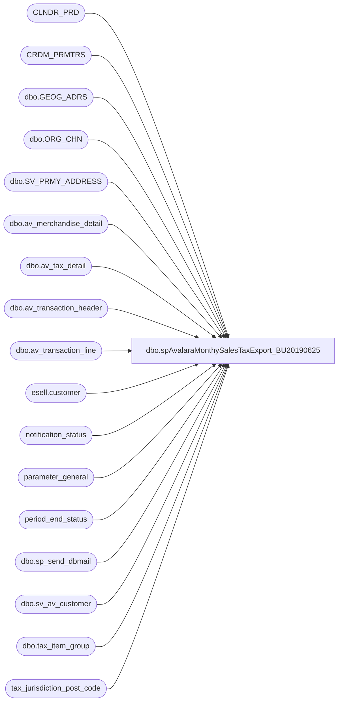

# dbo.spAvalaraMonthySalesTaxExport_BU20190625

**Database:** auditworks  
**Server:** bedrockdb01  

## Architecture Diagram



## Table Dependencies

| Referenced Table |
|---|
| CLNDR_PRD |
| CRDM_PRMTRS |
| dbo.GEOG_ADRS |
| dbo.ORG_CHN |
| dbo.SV_PRMY_ADDRESS |
| dbo.av_merchandise_detail |
| dbo.av_tax_detail |
| dbo.av_transaction_header |
| dbo.av_transaction_line |
| esell.customer |
| notification_status |
| parameter_general |
| period_end_status |
| dbo.sp_send_dbmail |
| dbo.sv_av_customer |
| dbo.tax_item_group |
| tax_jurisdiction_post_code |

## Stored Procedure Code

```sql
CREATE   procedure [dbo].[spAvalaraMonthySalesTaxExport_BU20190625]
--@TransactionStartDate as int
--,@TransactionEndDate as int

AS
-- =====================================================================================================
-- Name: spAvalaraMonthySalesTaxExport
--
-- Description:	Monthly Sales Tax Export for manual upload to Avalara by the Tax department	
--	
--
-- Input:  n/a
--			
--
-- Output: .csv
--			
--
-- Schedule: Daily
--    		
--
-- Dependencies: Period End successful completion	
--	
--
-- Revision History
--		Name:				Date:			Comments:
--		Paul Beckman		02/20/2018		Created stored proc
--		Paul Beckman		05/30/2018		Added file seperation by country
--		Paul Beckman		05/31/2018		Added Amount calculation for when multiple taxes per line_id
--		Paul Beckman		05/31/2018		Added State abbreviation
--		Paul Beckman		02/06/2019		Relaced LauraSc@buildabear.com with Zoem@buildabear.com
--		Paul Beckman		04/04/2019		Corrected issue with State codes by using UPPER in Send Sales
--		Paul Beckman		04/08/2019		Update USA zip codes by restricting to 5 digits
--		Paul Beckman		04/08/2019		Removed 990 ES order transactions
--		Paul Beckman		04/09/2019		Added code to remove '-' in DestPostalCode in ##TaxSummaryResults
--		Paul Beckman		06/04/2019		Added backup file cleanup section
--		
-- 
-- exec spAvalaraMonthySalesTaxExport
-- 
-- =====================================================================================================

SET NOCOUNT ON


--####################################
-- Check for same day job completion
--####################################

IF (SELECT COUNT(*) FROM notification_status WHERE reported = 1 AND CONVERT(VARCHAR(19),first_reported,101) = CONVERT(VARCHAR(19),GETDATE(),101) AND notification_name = 'Avalara Tax file generated' AND reported_cleared IS NULL) = 1
GOTO FINISH

IF (SELECT COUNT(*) FROM notification_status WHERE reported = 1 AND CONVERT(VARCHAR(19),first_reported,101) != CONVERT(VARCHAR(19),GETDATE(),101) AND notification_name = 'Avalara Tax file generated' AND reported_cleared IS NULL) = 1
BEGIN
	UPDATE notification_status
	SET reported = 0,reported_cleared = CONVERT(VARCHAR(19),GETDATE(),120)
	WHERE CONVERT(VARCHAR(19),first_reported,101) != CONVERT(VARCHAR(19),GETDATE(),101)
	AND notification_name = 'Avalara Tax file generated'
END


--####################################
-- Temp Tables
--####################################

IF (Object_ID('tempdb..##StartJobCheck') IS NOT NULL) DROP TABLE ##StartJobCheck
IF (Object_ID('tempdb..##TaxStoreData') IS NOT NULL) DROP TABLE ##TaxStoreData
IF (Object_ID('tempdb..##TaxCountryList') IS NOT NULL) DROP TABLE ##TaxCountryList
IF (Object_ID('tempdb..##TaxCodes') IS NOT NULL) DROP TABLE ##TaxCodes
IF (Object_ID('tempdb..##TaxLineCounts') IS NOT NULL) DROP TABLE ##TaxLineCounts
IF (Object_ID('tempdb..##TaxSalesDetail') IS NOT NULL) DROP TABLE ##TaxSalesDetail
IF (Object_ID('tempdb..##TaxExemptSalesDetail') IS NOT NULL) DROP TABLE ##TaxExemptSalesDetail
IF (Object_ID('tempdb..##TaxESSalesDetail') IS NOT NULL) DROP TABLE ##TaxESSalesDetail
IF (Object_ID('tempdb..##TaxSendSaleSalesDetail') IS NOT NULL) DROP TABLE ##TaxSendSaleSalesDetail
IF (Object_ID('tempdb..##TaxDetailResults') IS NOT NULL) DROP TABLE ##TaxDetailResults
IF (Object_ID('tempdb..##TaxDetailResultsFinal') IS NOT NULL) DROP TABLE ##TaxDetailResultsFinal
IF (Object_ID('tempdb..##TaxSummaryResults') IS NOT NULL) DROP TABLE ##TaxSummaryResults
IF (Object_ID('tempdb..##TaxSummaryOutput') IS NOT NULL) DROP TABLE ##TaxSummaryOutput
IF (Object_ID('tempdb..##TaxExportHeaders') IS NOT NULL) DROP TABLE ##TaxExportHeaders


--####################################
-- Declare script variables
--####################################

DECLARE @SQL VARCHAR(8000)
DECLARE @CMD VARCHAR(4000)
DECLARE @FileDate VARCHAR(14)
DECLARE @FileName VARCHAR(50)
DECLARE @FilePath VARCHAR(90)
DECLARE @AvalaraFilePath VARCHAR(90)
DECLARE @BackupFilePath VARCHAR(90)
DECLARE @TempFilePath VARCHAR(90)
DECLARE @TransactionStartDate DATE
DECLARE @TransactionEndDate DATE

DECLARE @ChkFileDrive VARCHAR(5)  
DECLARE @ChkFileCMD VARCHAR(200)
DECLARE @ChkFileCount VARCHAR(5)

DECLARE @Recipients VARCHAR(4000)
DECLARE @Copy_Recipients VARCHAR(4000)
DECLARE @Subject VARCHAR(80)
DECLARE @Query VARCHAR(8000)
DECLARE @Text NVARCHAR(MAX)
DECLARE @EmailAttachment VARCHAR(100)


--####################################
-- Set Date range used by schedule
--####################################

SELECT CONVERT(VARCHAR(10), clp.STRT_DATE_TIME, 121) AS STRT_DATE_TIME
	,CONVERT(VARCHAR(10), DATEADD(DAY,-1,clp.END_DATE_TIME), 121) AS END_DATE_TIME
INTO ##StartJobCheck
FROM CLNDR_PRD clp
JOIN CRDM_PRMTRS cp ON clp.CLNDR_ID = cp.PRMTR_VAL_BIN
WHERE clp.CLNDR_PRD_NAME LIKE 'Period%'
AND clp.STRT_DATE_TIME < (SELECT DATEADD(DAY,-1,clp.STRT_DATE_TIME) 
		FROM CLNDR_PRD clp
		JOIN CRDM_PRMTRS cp ON clp.CLNDR_ID = cp.PRMTR_VAL_BIN
		WHERE clp.CLNDR_PRD_NAME LIKE 'Period%'
		AND clp.STRT_DATE_TIME < GETDATE()
		AND clp.END_DATE_TIME > GETDATE())
AND clp.END_DATE_TIME > (SELECT DATEADD(DAY,-1,STRT_DATE_TIME) 
		FROM CLNDR_PRD clp
		JOIN CRDM_PRMTRS cp ON clp.CLNDR_ID = cp.PRMTR_VAL_BIN
		WHERE clp.CLNDR_PRD_NAME LIKE 'Period%'
		AND clp.STRT_DATE_TIME < GETDATE()
		AND clp.END_DATE_TIME > GETDATE())
AND (SELECT COUNT(*)
		FROM period_end_status
		WHERE period_end_status = 0
		AND CONVERT(VARCHAR(10), process_end_time, 120) = CONVERT(VARCHAR(10), GETDATE(), 120)) = 1
AND (SELECT COUNT(*)
		FROM parameter_general
		WHERE period_end_date = (SELECT DATEADD(DAY,-1,STRT_DATE_TIME) 
			FROM CLNDR_PRD clp
			JOIN CRDM_PRMTRS cp ON clp.CLNDR_ID = cp.PRMTR_VAL_BIN
			WHERE clp.CLNDR_PRD_NAME LIKE 'Period%'
			AND STRT_DATE_TIME < GETDATE()
			AND END_DATE_TIME > GETDATE())
		AND dayend_in_progress = 0
		AND period_end_in_progress = 0
		AND period_end_date < (SELECT process_end_time FROM period_end_status)) = 1

IF (SELECT COUNT(*) FROM ##StartJobCheck) = 0
GOTO FINISH


--####################################
-- Set dates 
--####################################

SET @TransactionStartDate = (SELECT STRT_DATE_TIME FROM ##StartJobCheck)
SET @TransactionEndDate = (SELECT END_DATE_TIME FROM ##StartJobCheck)

-->>>>>>   Set dates then uncomment these two SET statements when running manually   <<<<<<--
--SET @TransactionStartDate = '2018-04-08'
--SET @TransactionEndDate = '2018-05-05'


--####################################
-- Build Store info
--####################################

SELECT oc.ORG_CHN_NUM
	,oc.TAX_JRSDCTN_CODE
	,CASE WHEN ga.ADRS_LINE_2 IS NULL THEN ga.ADRS_LINE_1 ELSE ga.ADRS_LINE_1 + ' ' + ga.ADRS_LINE_2
		END AS StrAddress
	,ga.CITY AS StrCity
	,ga.TRTRY_CODE AS StrRegion -- state
	,CASE WHEN ga.CNTRY_CODE_ISO3 = 'USA' THEN CONVERT(VARCHAR(5),ga.POST_CODE)
		ELSE CONVERT(VARCHAR(10),ga.POST_CODE)
			END AS StrPostalCode
	,ga.CNTRY_CODE_ISO3 AS StrCountry
	,oc.DFLT_CRNCY_CODE
	,CASE WHEN len(oc.ORG_CHN_NUM) < 4 THEN '1' + RIGHT('000' + CAST(oc.ORG_CHN_NUM AS VARCHAR(4)),3)
			WHEN len(oc.ORG_CHN_NUM) = 4 THEN CAST(CONVERT(CHAR,oc.ORG_CHN_NUM,4) AS VARCHAR(4))
			END AS CustomerCode
INTO ##TaxStoreData
FROM	auditworks.dbo.ORG_CHN oc WITH (NOLOCK)
	JOIN	auditworks.dbo.SV_PRMY_ADDRESS spa WITH (NOLOCK) ON oc.PRTY_ID = spa.PRTY_ID
	JOIN	auditworks.dbo.GEOG_ADRS ga WITH (NOLOCK) ON spa.ADRS_ID = ga.ADRS_ID
WHERE oc.ORG_CHN_NUM BETWEEN 1 AND 3100
AND oc.ORG_CHN_TYPE_CODE !='WH'
--AND oc.TAX_JRSDCTN_CODE IS NOT NULL
ORDER BY oc.ORG_CHN_NUM

INSERT INTO ##TaxStoreData VALUES('9999',NULL,'1954 Innerbelt Business Center Drive','St Louis','MO','63114','USA','USD','9999')

UPDATE ##TaxStoreData
SET StrAddress = REPLACE(StrAddress, ',', '')
WHERE CHARINDEX(',', StrAddress) > 0


--####################################
-- Build Country info
--####################################

SELECT ROW_NUMBER() OVER(ORDER BY StrCountry ASC) AS CountryID
	,StrCountry
INTO ##TaxCountryList
FROM ##TaxStoreData
WHERE StrCountry IN ('CAN','USA') --<< Add new countries here
GROUP BY StrCountry


--####################################
-- Build Tax Item Groups
--####################################

SELECT tax_item_group_id
	,CASE WHEN tax_item_group_id = 10 THEN 'NT'
		WHEN tax_item_group_id = 20 THEN 'T'
		WHEN tax_item_group_id = 21 THEN 'PC040500'
		WHEN tax_item_group_id = 22 THEN 'T'
		WHEN tax_item_group_id = 41 THEN 'PF050073'
		WHEN tax_item_group_id = 41 THEN 'PF050073'
--		WHEN tax_item_group_id = CANDY THEN 'PF050300'
		ELSE tax_item_group_description
			END AS 'TaxCode'
INTO ##TaxCodes
FROM auditworks.dbo.tax_item_group WITH (NOLOCK)


--####################################
-- Build Taxable Sales Detail
--####################################

SELECT	CASE WHEN LEN(th.store_no) < 4 THEN '1' + RIGHT('000' + CAST(th.store_no AS VARCHAR(4)),3)
			ELSE th.store_no
				END AS CustomerCode
		,CASE WHEN len(th.store_no) < 4 THEN '1' + RIGHT('000' + CAST(th.store_no AS VARCHAR(4)),3) + CAST(CONVERT(CHAR,th.transaction_date,112) AS VARCHAR(8))
			WHEN len(th.store_no) = 4 THEN CAST(CONVERT(CHAR,th.store_no,4) AS VARCHAR(4)) + CAST(CONVERT(CHAR,th.transaction_date,112) AS VARCHAR(8))
				END AS DocCode
		,CONVERT(CHAR,th.transaction_date,101) AS transaction_date
		,CASE WHEN sd.StrCountry = 'USA' THEN 'BAB'
			WHEN sd.StrCountry = 'CAN' THEN 'BABCAN'
				END AS CompanyCode
		,tc.TaxCode AS TaxCode
		,CONVERT(CHAR,td.originating_date,101) AS TaxDate
		,CASE WHEN tl.db_cr_none = -1 THEN ABS(td.taxable_amount * tl.db_cr_none * tl.voiding_reversal_flag)
			ELSE (td.taxable_amount * tl.db_cr_none * tl.voiding_reversal_flag)*(-1)
				END AS Amount
		,td.tax_jurisdiction AS Ref1
		,th.av_transaction_id AS Ref2
		,tl.line_id
		,sd.DFLT_CRNCY_CODE AS CurrencyCode  --<< Need to get for Canada stores
--		,'' AS ExchangeRate  --<< Need to get for Canada stores
		,CASE WHEN tl.db_cr_none = -1 THEN ABS(td.tax_amount_expected)
			ELSE (td.tax_amount_expected)*(-1)
				END AS TotalTax
		,sd.StrAddress AS DestAddress  --<< Store's address unless enterprise selling
		,sd.StrCity AS DestCity
		,sd.StrRegion AS DestRegion  --<< State
		,sd.StrPostalCode AS DestPostalCode
		,sd.StrCountry AS DestCountry
		,sd.StrRegion AS OrigRegion  --<< State
		,sd.StrPostalCode AS OrigPostalCode
INTO	##TaxSalesDetail
FROM 	auditworks.dbo.av_transaction_header th WITH (NOLOCK)
JOIN	auditworks.dbo.av_transaction_line tl WITH (NOLOCK) ON th.av_transaction_id=tl.av_transaction_id 
JOIN	auditworks.dbo.av_merchandise_detail smd WITH (NOLOCK) ON th.av_transaction_id = smd.av_transaction_id AND tl.line_id = smd.line_id
LEFT JOIN	auditworks.dbo.av_tax_detail td WITH (NOLOCK) ON th.av_transaction_id = td.av_transaction_id AND tl.line_id = td.line_id
JOIN	##TaxStoreData sd WITH (NOLOCK) ON th.store_no = sd.ORG_CHN_NUM
JOIN	##TaxCodes tc WITH (NOLOCK) ON tc.tax_item_group_id = td.tax_item_group_id
WHERE	sd.StrCountry IN ('CAN','USA')
AND		th.store_no BETWEEN 1 AND 3100
AND		th.transaction_void_flag = 0   
AND		tl.line_void_flag = 0 
AND		tl.line_object IN (100)
AND		tl.interface_rejection_flag = 0 
AND		th.sa_rejection_flag = 0
AND		th.store_no NOT IN (13)
AND		td.tax_category NOT IN (1,3)
AND		td.tax_level NOT IN (4,10,15)
AND		th.transaction_date BETWEEN @TransactionStartDate AND @TransactionEndDate

SELECT DISTINCT *
INTO ##TaxDetailResults
FROM ##TaxSalesDetail
WHERE Amount + TotalTax != 0


--####################################
-- Build Tax Exempt Sales Detail
--####################################

SELECT	CASE WHEN LEN(th.store_no) < 4 THEN '1' + RIGHT('000' + CAST(th.store_no AS VARCHAR(4)),3)
			ELSE th.store_no
				END AS CustomerCode
		,CASE WHEN len(th.store_no) < 4 THEN '1' + RIGHT('000' + CAST(th.store_no AS VARCHAR(4)),3) + CAST(CONVERT(CHAR,th.transaction_date,112) AS VARCHAR(8))
			WHEN len(th.store_no) = 4 THEN CAST(CONVERT(CHAR,th.store_no,4) AS VARCHAR(4)) + CAST(CONVERT(CHAR,th.transaction_date,112) AS VARCHAR(8))
				END AS DocCode
		,CONVERT(CHAR,th.transaction_date,101) AS transaction_date
		,CASE WHEN sd.StrCountry = 'USA' THEN 'BAB'
			WHEN sd.StrCountry = 'CAN' THEN 'BABCAN'
				END AS CompanyCode
		,'NT' AS TaxCode
		,CONVERT(CHAR,td.originating_date,101) AS TaxDate
		,CASE WHEN tl.db_cr_none = -1 THEN ABS(td.nontaxable_amount * tl.db_cr_none * tl.voiding_reversal_flag)
			ELSE (td.nontaxable_amount * tl.db_cr_none * tl.voiding_reversal_flag)*(-1)
				END AS Amount
		,td.tax_jurisdiction AS Ref1
		,th.av_transaction_id AS Ref2
		,tl.line_id
		,sd.DFLT_CRNCY_CODE AS CurrencyCode  --<< Need to get for Canada stores
--		,'' AS ExchangeRate  --<< Need to get for Canada stores
		,CASE WHEN tl.db_cr_none = -1 THEN ABS(td.tax_amount_expected)
			ELSE (td.tax_amount_expected)*(-1)
				END AS TotalTax
		,sd.StrAddress AS DestAddress  --<< Store's address unless enterprise selling
		,sd.StrCity AS DestCity
		,sd.StrRegion AS DestRegion  --<< State
		,sd.StrPostalCode AS DestPostalCode
		,sd.StrCountry AS DestCountry
		,sd.StrRegion AS OrigRegion  --<< State
		,sd.StrPostalCode AS OrigPostalCode
INTO	##TaxExemptSalesDetail
FROM 	auditworks.dbo.av_transaction_header th WITH (NOLOCK)
JOIN	auditworks.dbo.av_transaction_line tl WITH (NOLOCK) ON th.av_transaction_id=tl.av_transaction_id
LEFT JOIN	auditworks.dbo.av_tax_detail td WITH (NOLOCK) ON th.av_transaction_id = td.av_transaction_id AND tl.line_id = td.line_id
JOIN	##TaxStoreData sd WITH (NOLOCK) ON th.store_no = sd.ORG_CHN_NUM
WHERE	sd.StrCountry IN ('CAN','USA')
AND		th.store_no BETWEEN 1 AND 3100
AND		th.transaction_void_flag = 0   
AND		tl.line_void_flag = 0
AND		(td.tax_category = 3 OR td.tax_rate_code = 4)
AND		td.nontaxable_amount > 0
AND		td.tax_level NOT IN (4,10,15)
--AND		(tl.line_object IN (101,292) OR td.tax_category = 3)
AND		tl.interface_rejection_flag = 0
AND		th.sa_rejection_flag = 0
AND		th.store_no NOT IN (13)
AND		th.transaction_date BETWEEN @TransactionStartDate AND @TransactionEndDate

INSERT INTO ##TaxDetailResults
SELECT DISTINCT *
FROM ##TaxExemptSalesDetail
WHERE Amount + TotalTax != 0


--####################################
-- Build ES Sale Taxable Sales Detail
--####################################

SELECT	CASE WHEN LEN(th.store_no) < 4 THEN '1' + RIGHT('000' + CAST(th.store_no AS VARCHAR(4)),3)
			ELSE th.store_no
				END AS CustomerCode
		,CASE WHEN len(th.store_no) < 4 THEN '1' + RIGHT('000' + CAST(th.store_no AS VARCHAR(4)),3) + CAST(CONVERT(CHAR,th.transaction_date,112) AS VARCHAR(8))
			WHEN len(th.store_no) = 4 THEN CAST(CONVERT(CHAR,th.store_no,4) AS VARCHAR(4)) + CAST(CONVERT(CHAR,th.transaction_date,112) AS VARCHAR(8))
				END AS DocCode
		,CONVERT(CHAR,th.transaction_date,101) AS transaction_date
		,CASE WHEN sd.StrCountry = 'USA' THEN 'BAB'
			WHEN sd.StrCountry = 'CAN' THEN 'BABCAN'
				END AS CompanyCode
		,tc.TaxCode AS TaxCode
		,CONVERT(CHAR,td.originating_date,101) AS TaxDate
		,CASE WHEN tl.db_cr_none = -1 THEN ABS(td.taxable_amount * tl.db_cr_none * tl.voiding_reversal_flag)
			ELSE (td.taxable_amount * tl.db_cr_none * tl.voiding_reversal_flag)*(-1)
				END AS Amount
		,td.tax_jurisdiction AS Ref1
		,th.av_transaction_id AS Ref2
		,tl.line_id
		,sd.DFLT_CRNCY_CODE AS CurrencyCode  --<< Need to get for Canada stores
--		,'' AS ExchangeRate  --<< Need to get for Canada stores
		,CASE WHEN tl.db_cr_none = -1 THEN ABS(td.tax_amount_expected)
			ELSE (td.tax_amount_expected)*(-1)
				END AS TotalTax
		,cs.address1 AS DestAddress  --<< Store's address unless enterprise selling
		,cs.city AS DestCity
		,CASE WHEN UPPER(cs.state) = 'ALABAMA' THEN 'AL'
			WHEN UPPER(cs.state) = 'ALASKA' THEN 'AK'
			WHEN UPPER(cs.state) = 'ARIZONA' THEN 'AZ'
			WHEN UPPER(cs.state) = 'ARKANSAS' THEN 'AR'
			WHEN UPPER(cs.state) = 'CALIFORNIA' THEN 'CA'
			WHEN UPPER(cs.state) = 'COLORADO' THEN 'CO'
			WHEN UPPER(cs.state) = 'CONNECTICUT' THEN 'CT'
			WHEN UPPER(cs.state) = 'DELAWARE' THEN 'DE'
			WHEN UPPER(cs.state) = 'FLORIDA' THEN 'FL'
			WHEN UPPER(cs.state) = 'GEORGIA' THEN 'GA'
			WHEN UPPER(cs.state) = 'HAWAII' THEN 'HI'
			WHEN UPPER(cs.state) = 'IDAHO' THEN 'ID'
			WHEN UPPER(cs.state) = 'ILLINOIS' THEN 'IL'
			WHEN UPPER(cs.state) = 'INDIANA' THEN 'IN'
			WHEN UPPER(cs.state) = 'IOWA' THEN 'IA'
			WHEN UPPER(cs.state) = 'KANSAS' THEN 'KS'
			WHEN UPPER(cs.state) = 'KENTUCKY' THEN 'KY'
			WHEN UPPER(cs.state) = 'LOUISIANA' THEN 'LA'
			WHEN UPPER(cs.state) = 'MAINE' THEN 'ME'
			WHEN UPPER(cs.state) = 'MARYLAND' THEN 'MD'
			WHEN UPPER(cs.state) = 'MASSACHUSETTS' THEN 'MA'
			WHEN UPPER(cs.state) = 'MICHIGAN' THEN 'MI'
			WHEN UPPER(cs.state) = 'MINNESOTA' THEN 'MN'
			WHEN UPPER(cs.state) = 'MISSISSIPPI' THEN 'MS'
			WHEN UPPER(cs.state) = 'MISSOURI' THEN 'MO'
			WHEN UPPER(cs.state) = 'MONTANA' THEN 'MT'
			WHEN UPPER(cs.state) = 'NEBRASKA' THEN 'NE'
			WHEN UPPER(cs.state) = 'NEVADA' THEN 'NV'
			WHEN UPPER(cs.state) = 'NEW HAMPSHIRE' THEN 'NH'
			WHEN UPPER(cs.state) = 'NEW JERSEY' THEN 'NJ'
			WHEN UPPER(cs.state) = 'NEW MEXICO' THEN 'NM'
			WHEN UPPER(cs.state) = 'NEW YORK' THEN 'NY'
			WHEN UPPER(cs.state) = 'NORTH CAROLINA' THEN 'NC'
			WHEN UPPER(cs.state) = 'NORTH DAKOTA' THEN 'ND'
			WHEN UPPER(cs.state) = 'OHIO' THEN 'OH'
			WHEN UPPER(cs.state) = 'OKLAHOMA' THEN 'OK'
			WHEN UPPER(cs.state) = 'OREGON' THEN 'OR'
			WHEN UPPER(cs.state) = 'PENNSYLVANIA' THEN 'PA'
			WHEN UPPER(cs.state) = 'RHODE ISLAND' THEN 'RI'
			WHEN UPPER(cs.state) = 'SOUTH CAROLINA' THEN 'SC'
			WHEN UPPER(cs.state) = 'SOUTH DAKOTA' THEN 'SD'
			WHEN UPPER(cs.state) = 'TENNESSEE' THEN 'TN'
			WHEN UPPER(cs.state) = 'TEXAS' THEN 'TX'
			WHEN UPPER(cs.state) = 'UTAH' THEN 'UT'
			WHEN UPPER(cs.state) = 'VERMONT' THEN 'VT'
			WHEN UPPER(cs.state) = 'VIRGINIA' THEN 'VA'
			WHEN UPPER(cs.state) = 'WASHINGTON' THEN 'WA'
			WHEN UPPER(cs.state) = 'WEST VIRGINIA' THEN 'WV'
			WHEN UPPER(cs.state) = 'WISCONSIN' THEN 'WI'
			WHEN UPPER(cs.state) = 'WYOMING' THEN 'WY'
			ELSE LEFT(cs.state,2)
			END AS DestRegion  --<< State
		,CASE WHEN cs.postal_code LIKE '_____-____' THEN LEFT(cs.postal_code,5)
			ELSE cs.postal_code
				END AS DestPostalCode
		,CASE WHEN cs.country IS NULL THEN ''
			ELSE cs.country
				END AS DestCountry
		,sd.StrRegion AS OrigRegion  --<< State
		,sd.StrPostalCode AS OrigPostalCode
INTO	##TaxESSalesDetail
FROM 	auditworks.dbo.av_transaction_header th WITH (NOLOCK)
JOIN	auditworks.dbo.av_transaction_line tl WITH (NOLOCK) ON th.av_transaction_id=tl.av_transaction_id 
JOIN	auditworks.dbo.av_merchandise_detail smd WITH (NOLOCK) ON th.av_transaction_id = smd.av_transaction_id AND tl.line_id = smd.line_id
LEFT JOIN	auditworks.dbo.av_tax_detail td WITH (NOLOCK) ON th.av_transaction_id = td.av_transaction_id AND tl.line_id = td.line_id
JOIN	BEDROCKDB02.esell.esell.customer cs WITH (NOLOCK) ON CONVERT(VARCHAR(20),cs.order_id)COLLATE SQL_Latin1_General_CP1_CI_AS = CONVERT(VARCHAR(20),'U' + tl.reference_no)
JOIN	##TaxStoreData sd WITH (NOLOCK) ON th.store_no = sd.ORG_CHN_NUM
JOIN	##TaxCodes tc WITH (NOLOCK) ON tc.tax_item_group_id = td.tax_item_group_id
WHERE	sd.StrCountry IN ('CAN','USA')
AND		th.store_no BETWEEN 1 AND 3100
AND		th.transaction_void_flag = 0   
AND		tl.line_void_flag = 0 
--AND		tl.line_object IN (106)
AND		td.tax_category = 1
AND		td.tax_level NOT IN (4,10,15)
AND		tl.interface_rejection_flag = 0
AND		cs.cust_type = 'FULFILL-0'
AND		th.sa_rejection_flag = 0
AND		th.store_no NOT IN (13,990)
AND		th.transaction_date BETWEEN @TransactionStartDate AND @TransactionEndDate
ORDER BY 2

INSERT INTO ##TaxDetailResults
SELECT DISTINCT *
FROM ##TaxESSalesDetail
WHERE Amount + TotalTax != 0


--####################################
-- Build Send Sale Taxable Sales Detail
--####################################

SELECT	CASE WHEN LEN(th.store_no) < 4 THEN '1' + RIGHT('000' + CAST(th.store_no AS VARCHAR(4)),3)
			ELSE th.store_no
				END AS CustomerCode
		,CASE WHEN len(th.store_no) < 4 THEN '1' + RIGHT('000' + CAST(th.store_no AS VARCHAR(4)),3) + CAST(CONVERT(CHAR,th.transaction_date,112) AS VARCHAR(8))
			WHEN len(th.store_no) = 4 THEN CAST(CONVERT(CHAR,th.store_no,4) AS VARCHAR(4)) + CAST(CONVERT(CHAR,th.transaction_date,112) AS VARCHAR(8))
				END AS DocCode
		,CONVERT(CHAR,th.transaction_date,101) AS transaction_date
		,CASE WHEN sd.StrCountry = 'USA' THEN 'BAB'
			WHEN sd.StrCountry = 'CAN' THEN 'BABCAN'
				END AS CompanyCode
		,tc.TaxCode AS TaxCode
		,CONVERT(CHAR,td.originating_date,101) AS TaxDate
		,CASE WHEN tl.db_cr_none = -1 THEN ABS(td.taxable_amount * tl.db_cr_none * tl.voiding_reversal_flag)
			ELSE (td.taxable_amount * tl.db_cr_none * tl.voiding_reversal_flag)*(-1)
				END AS Amount
		,td.tax_jurisdiction AS Ref1
		,th.av_transaction_id AS Ref2
		,tl.line_id
		,sd.DFLT_CRNCY_CODE AS CurrencyCode  --<< Need to get for Canada stores
--		,'' AS ExchangeRate  --<< Need to get for Canada stores
		,CASE WHEN tl.db_cr_none = -1 THEN ABS(td.tax_amount_expected)
			ELSE (td.tax_amount_expected)*(-1)
				END AS TotalTax
		,cs.address_1 AS DestAddress  --<< Store's address unless enterprise selling
		,cs.city AS DestCity
		,CASE WHEN UPPER(cs.state) = 'ALABAMA' THEN 'AL'
			WHEN UPPER(cs.state) = 'ALASKA' THEN 'AK'
			WHEN UPPER(cs.state) = 'ARIZONA' THEN 'AZ'
			WHEN UPPER(cs.state) = 'ARKANSAS' THEN 'AR'
			WHEN UPPER(cs.state) = 'CALIFORNIA' THEN 'CA'
			WHEN UPPER(cs.state) = 'COLORADO' THEN 'CO'
			WHEN UPPER(cs.state) = 'CONNECTICUT' THEN 'CT'
			WHEN UPPER(cs.state) = 'DELAWARE' THEN 'DE'
			WHEN UPPER(cs.state) = 'FLORIDA' THEN 'FL'
			WHEN UPPER(cs.state) = 'GEORGIA' THEN 'GA'
			WHEN UPPER(cs.state) = 'HAWAII' THEN 'HI'
			WHEN UPPER(cs.state) = 'IDAHO' THEN 'ID'
			WHEN UPPER(cs.state) = 'ILLINOIS' THEN 'IL'
			WHEN UPPER(cs.state) = 'INDIANA' THEN 'IN'
			WHEN UPPER(cs.state) = 'IOWA' THEN 'IA'
			WHEN UPPER(cs.state) = 'KANSAS' THEN 'KS'
			WHEN UPPER(cs.state) = 'KENTUCKY' THEN 'KY'
			WHEN UPPER(cs.state) = 'LOUISIANA' THEN 'LA'
			WHEN UPPER(cs.state) = 'MAINE' THEN 'ME'
			WHEN UPPER(cs.state) = 'MARYLAND' THEN 'MD'
			WHEN UPPER(cs.state) = 'MASSACHUSETTS' THEN 'MA'
			WHEN UPPER(cs.state) = 'MICHIGAN' THEN 'MI'
			WHEN UPPER(cs.state) = 'MINNESOTA' THEN 'MN'
			WHEN UPPER(cs.state) = 'MISSISSIPPI' THEN 'MS'
			WHEN UPPER(cs.state) = 'MISSOURI' THEN 'MO'
			WHEN UPPER(cs.state) = 'MONTANA' THEN 'MT'
			WHEN UPPER(cs.state) = 'NEBRASKA' THEN 'NE'
			WHEN UPPER(cs.state) = 'NEVADA' THEN 'NV'
			WHEN UPPER(cs.state) = 'NEW HAMPSHIRE' THEN 'NH'
			WHEN UPPER(cs.state) = 'NEW JERSEY' THEN 'NJ'
			WHEN UPPER(cs.state) = 'NEW MEXICO' THEN 'NM'
			WHEN UPPER(cs.state) = 'NEW YORK' THEN 'NY'
			WHEN UPPER(cs.state) = 'NORTH CAROLINA' THEN 'NC'
			WHEN UPPER(cs.state) = 'NORTH DAKOTA' THEN 'ND'
			WHEN UPPER(cs.state) = 'OHIO' THEN 'OH'
			WHEN UPPER(cs.state) = 'OKLAHOMA' THEN 'OK'
			WHEN UPPER(cs.state) = 'OREGON' THEN 'OR'
			WHEN UPPER(cs.state) = 'PENNSYLVANIA' THEN 'PA'
			WHEN UPPER(cs.state) = 'RHODE ISLAND' THEN 'RI'
			WHEN UPPER(cs.state) = 'SOUTH CAROLINA' THEN 'SC'
			WHEN UPPER(cs.state) = 'SOUTH DAKOTA' THEN 'SD'
			WHEN UPPER(cs.state) = 'TENNESSEE' THEN 'TN'
			WHEN UPPER(cs.state) = 'TEXAS' THEN 'TX'
			WHEN UPPER(cs.state) = 'UTAH' THEN 'UT'
			WHEN UPPER(cs.state) = 'VERMONT' THEN 'VT'
			WHEN UPPER(cs.state) = 'VIRGINIA' THEN 'VA'
			WHEN UPPER(cs.state) = 'WASHINGTON' THEN 'WA'
			WHEN UPPER(cs.state) = 'WEST VIRGINIA' THEN 'WV'
			WHEN UPPER(cs.state) = 'WISCONSIN' THEN 'WI'
			WHEN UPPER(cs.state) = 'WYOMING' THEN 'WY'
			ELSE LEFT(cs.state,2)
			END AS DestRegion  --<< State
		,CASE WHEN cs.post_code LIKE '_____-____' THEN LEFT(cs.post_code,5)
			ELSE cs.post_code
				END AS DestPostalCode
		,CASE WHEN cs.country IS NULL THEN ''
			ELSE cs.country
				END AS DestCountry
		,sd.StrRegion AS OrigRegion  --<< State
		,sd.StrPostalCode AS OrigPostalCode
INTO	##TaxSendSaleSalesDetail
FROM 	auditworks.dbo.av_transaction_header th WITH (NOLOCK)
JOIN	auditworks.dbo.av_transaction_line tl WITH (NOLOCK) ON th.av_transaction_id=tl.av_transaction_id 
JOIN	auditworks.dbo.av_merchandise_detail smd WITH (NOLOCK) ON th.av_transaction_id = smd.av_transaction_id AND tl.line_id = smd.line_id
LEFT JOIN	auditworks.dbo.av_tax_detail td WITH (NOLOCK) ON th.av_transaction_id = td.av_transaction_id AND tl.line_id = td.line_id
JOIN	auditworks.dbo.sv_av_customer cs WITH (NOLOCK) ON cs.transaction_id = th.av_transaction_id
JOIN	##TaxStoreData sd WITH (NOLOCK) ON th.store_no = sd.ORG_CHN_NUM
JOIN	##TaxCodes tc WITH (NOLOCK) ON tc.tax_item_group_id = td.tax_item_group_id
WHERE	sd.StrCountry IN ('CAN','USA')
AND		th.store_no BETWEEN 1 AND 3100
AND		th.transaction_void_flag = 0   
AND		tl.line_void_flag = 0
AND		td.tax_category = 1
AND		td.tax_level NOT IN (4,10,15)
AND		tl.interface_rejection_flag = 0
AND		(cs.customer_role = 2 AND cs.line_id = 0)
AND		th.sa_rejection_flag = 0
AND		th.store_no NOT IN (13)
AND		th.transaction_date BETWEEN @TransactionStartDate AND @TransactionEndDate
ORDER BY 2

INSERT INTO ##TaxDetailResults
SELECT DISTINCT *
FROM ##TaxSendSaleSalesDetail
WHERE Amount + TotalTax != 0


--####################################
-- Add Row Counts to Tax Summary
--####################################

SELECT Ref2 AS transaction_id
	,line_id
	,COUNT(line_id) AS line_count
INTO ##TaxLineCounts
FROM ##TaxDetailResults
GROUP BY Ref2,line_id


--####################################
-- Use Row Count for calculation
-- for Final Detail Results
--####################################

SELECT tdr.CustomerCode
	,tdr.DocCode
	,tdr.transaction_date
	,tdr.CompanyCode
	,tdr.TaxCode
	,tdr.TaxDate
	,CASE WHEN tlc.line_count > 1 THEN CONVERT(DECIMAL(10,2),tdr.Amount/tlc.line_count)
		ELSE CONVERT(DECIMAL(10,2),tdr.Amount)
		END AS Amount
	,tdr.Ref1
	,tdr.Ref2
	,tdr.line_id
	,tdr.CurrencyCode
	,tdr.TotalTax
	,tdr.DestAddress
	,tdr.DestCity
	,tdr.DestRegion
	,tdr.DestPostalCode
	,tdr.DestCountry
	,tdr.OrigRegion
	,tdr.OrigPostalCode
INTO ##TaxDetailResultsFinal
FROM ##TaxDetailResults tdr WITH(NOLOCK)
JOIN ##TaxLineCounts tlc WITH(NOLOCK) ON tlc.transaction_id = tdr.Ref2 AND tlc.line_id = tdr.line_id


--####################################
-- Build Tax Summary
--####################################

SELECT	'1' AS ProcessCode
		,tsd.DocCode
		,'1' AS DocType  --<< 4 = Return invoice
		,CASE WHEN tsd.transaction_date > DATEADD(MONTH, DATEDIFF(MONTH, -1, @TransactionEndDate)-1, -1) THEN CONVERT(CHAR,DATEADD(MONTH, DATEDIFF(MONTH, -1, @TransactionEndDate)-1, -1),101)
			WHEN tsd.transaction_date < DATEADD(MONTH, DATEDIFF(MONTH, 0, @TransactionStartDate)+1, 0) AND DATEADD(MONTH, DATEDIFF(MONTH, 0, @TransactionStartDate)+1, 0) < DATEADD(MONTH, DATEDIFF(MONTH, -1, @TransactionEndDate)-1, -1) THEN CONVERT(CHAR,DATEADD(MONTH, DATEDIFF(MONTH, 0, @TransactionStartDate)+1, 0),101)
			ELSE CONVERT(CHAR,tsd.transaction_date,101)
				END AS DocDate
		,tsd.CompanyCode
		,CASE WHEN tsd.CustomerCode IN ('1990') THEN '9999'
			ELSE tsd.CustomerCode
				END AS CustomerCode
		,'' AS EntityUseCode
		,ROW_NUMBER() OVER(PARTITION BY DocCode ORDER BY DocCode ASC) AS 'LineNo'
		,tsd.TaxCode AS TaxCode
		,'' AS TaxDate
		,'' AS ItemCode
		,'' AS Description
		,'' AS Qty
		,SUM(tsd.Amount) AS Amount
		,'' AS Discount
		,'' AS Ref1
		,'' AS Ref2
		,'' AS ExemptionNo
		,'' AS RevAcct
		,tsd.DestAddress  --<< Store's address unless enterprise selling
		,tsd.DestCity
		,CASE WHEN tsd.CustomerCode = '1255' AND (tsd.DestRegion IS NULL OR tsd.DestRegion = '  ') AND tsd.DestPostalCode = '00918' THEN 'PR'
			WHEN tsd.CustomerCode IN ('1990') THEN (SELECT SUBSTRING(tax_jurisdiction,2,2) FROM tax_jurisdiction_post_code WHERE tsd.DestPostalCode BETWEEN from_post_code AND to_post_code)
			ELSE CONVERT(VARCHAR(2),tsd.DestRegion)
				END AS DestRegion  --<< State
		,tsd.DestPostalCode
		,tsd.DestCountry
		,'' AS OrigAddress
		,'' AS OrigCity
		,CASE WHEN tsd.CustomerCode = '1255' AND (tsd.OrigRegion IS NULL OR tsd.OrigRegion = '  ') AND tsd.OrigPostalCode = '00918' THEN 'PR'
			ELSE CONVERT(VARCHAR(2),tsd.OrigRegion)
				END AS OrigRegion  --<< State
		,tsd.OrigPostalCode
		,'' AS OrigCountry
		,CASE WHEN tsd.CustomerCode IN ('1990') THEN '9999'
			ELSE tsd.CustomerCode
				END AS LocationCode
		,'' AS SalesPersonCode
		,'' AS PurchaseOrderNo
		,'' AS CurrencyCode  --<< Need to get for Canada stores
		,'' AS ExchangeRate  --<< Need to get for Canada stores
		,'' AS ExchangeRateEffDate
		,'' AS PaymentDate
		,'' AS TaxIncluded
		,'' AS DestTaxRegion
		,'' AS OrigTaxRegion
		,'' AS Taxable
		,'' AS TaxType
		,SUM(tsd.TotalTax) AS TotalTax
		,'' AS CountryName
		,'' AS CountryCode
		,'' AS CountryRate
		,'' AS CountryTax
		,'' AS StateName
		,'' AS StateCode
		,'' AS StateRate
		,'' AS StateTax
		,'' AS CountyName
		,'' AS CountyCode
		,'' AS CountyRate
		,'' AS CountyTax
		,'' AS CityName
		,'' AS CityCode
		,'' AS CityRate
		,'' AS CityTax
		,'' AS Other1Name
		,'' AS Other1Code
		,'' AS Other1Rate
		,'' AS Other1Tax
		,'' AS Other2Name
		,'' AS Other2Code
		,'' AS Other2Rate
		,'' AS Other2Tax
		,'' AS Other3Name
		,'' AS Other3Code
		,'' AS Other3Rate
		,'' AS Other3Tax
		,'' AS Other4Name
		,'' AS Other4Code
		,'' AS Other4Rate
		,'' AS Other4Tax
		,'' AS ReferenceCode
		,'' AS BuyersVATNo
		,'' AS IsSellerImporterOfRecord
		,'' AS BRBuyerType
		,'' AS BRBuyer_IsExemptOrCannotWH_IRRF
		,'' AS BRBuyer_IsExemptOrCannotWH_PISRF
		,'' AS BRBuyer_IsExemptOrCannotWH_COFINSRF
		,'' AS BRBuyer_IsExemptOrCannotWH_CSLLRF
		,'' AS BRBuyer_IsExempt_PIS
		,'' AS BRBuyer_IsExempt_COFINS
		,'' AS BRBuyer_IsExempt_CSLL
		,'' AS Header_Description
		,'' AS Email
INTO	##TaxSummaryResults
FROM 	##TaxDetailResultsFinal tsd
GROUP BY tsd.DocCode
		,tsd.TaxCode
		,tsd.transaction_date
		,tsd.CompanyCode
		,tsd.CustomerCode
		,tsd.DestAddress
		,tsd.DestCity
		,tsd.DestRegion
		,tsd.DestPostalCode
		,tsd.DestCountry
		,tsd.OrigRegion
		,tsd.OrigPostalCode
ORDER BY tsd.DocCode
		,tsd.transaction_date
		,tsd.TaxCode

UPDATE ##TaxSummaryResults
SET DestAddress = REPLACE(DestAddress, ',', '')
WHERE CHARINDEX(',', DestAddress) > 0

UPDATE ##TaxSummaryResults
SET DestCity = REPLACE(DestCity, ',', '')
WHERE CHARINDEX(',', DestCity) > 0

UPDATE ##TaxSummaryResults
SET DestPostalCode = REPLACE(DestPostalCode, '-', '')
WHERE CHARINDEX('-', DestPostalCode) > 0


--####################################
-- Set variables
--####################################

SET @FileDate = (SELECT CONVERT(VARCHAR(8), GETDATE(), 112) + REPLACE(CONVERT(VARCHAR(8),GETDATE(), 108),':',''))

SET @FilePath = '\\saapp01\Financials\Avalara'  --<< File path
SET @TempFilePath = '\\saapp01\Financials\Avalara\Work'
SET @BackupFilePath = '\\saapp01\Financials\Avalara\Backup'

--SET @AvalaraFilePath = '\\saapp01\Financials\Avalara\Test'  --<< TEST build path
--SET @AvalaraFilePath = '\\ShareBear1\Shared\Accounting\Avalara'  --<< TEST Avalara file destination path
SET @AvalaraFilePath = '\\ShareBear1\Shared\Accounting\Avalara'  --<< PROD Avalara file destination path

SET @Recipients = 'Zoem@buildabear.com;CindyMi@buildabear.com'
--SET @Recipients = 'paulb@buildabear.com'
SET @Copy_Recipients = 'SAAdmin@buildabear.com'


--####################################
-- Create Headers file
--####################################

SELECT 
		'ProcessCode' AS 'ProcessCode'
		,'DocCode' AS 'DocCode'
		,'DocType' AS 'DocType'
		,'DocDate' AS 'DocDate'
		,'CompanyCode' AS 'CompanyCode'
		,'CustomerCode' AS 'CustomerCode'
		,'EntityUseCode' AS 'EntityUseCode'
		,'LineNo' AS 'LineNo'
		,'TaxCode' AS 'TaxCode'
		,'TaxDate' AS 'TaxDate'
		,'ItemCode' AS 'ItemCode'
		,'Description' AS 'Description'
		,'Qty' AS 'Qty'
		,'Amount' AS 'Amount'
		,'Discount' AS 'Discount'
		,'Ref1' AS 'Ref1'
		,'Ref2' AS 'Ref2'
		,'ExemptionNo' AS 'ExemptionNo'
		,'RevAcct' AS 'RevAcct'
		,'DestAddress' AS 'DestAddress'
		,'DestCity' AS 'DestCity'
		,'DestRegion' AS 'DestRegion'
		,'DestPostalCode' AS 'DestPostalCode'
		,'DestCountry' AS 'DestCountry'
		,'OrigAddress' AS 'OrigAddress'
		,'OrigCity' AS 'OrigCity'
		,'OrigRegion' AS 'OrigRegion'
		,'OrigPostalCode' AS 'OrigPostalCode'
		,'OrigCountry' AS 'OrigCountry'
		,'LocationCode' AS 'LocationCode'
		,'SalesPersonCode' AS 'SalesPersonCode'
		,'PurchaseOrderNo' AS 'PurchaseOrderNo'
		,'CurrencyCode' AS 'CurrencyCode'
		,'ExchangeRate' AS 'ExchangeRate'
		,'ExchangeRateEffDate' AS 'ExchangeRateEffDate'
		,'PaymentDate' AS 'PaymentDate'
		,'TaxIncluded' AS 'TaxIncluded'
		,'DestTaxRegion' AS 'DestTaxRegion'
		,'OrigTaxRegion' AS 'OrigTaxRegion'
		,'Taxable' AS 'Taxable'
		,'TaxType' AS 'TaxType'
		,'TotalTax' AS 'TotalTax'
		,'CountryName' AS 'CountryName'
		,'CountryCode' AS 'CountryCode'
		,'CountryRate' AS 'CountryRate'
		,'CountryTax' AS 'CountryTax'
		,'StateName' AS 'StateName'
		,'StateCode' AS 'StateCode'
		,'StateRate' AS 'StateRate'
		,'StateTax' AS 'StateTax'
		,'CountyName' AS 'CountyName'
		,'CountyCode' AS 'CountyCode'
		,'CountyRate' AS 'CountyRate'
		,'CountyTax' AS 'CountyTax'
		,'CityName' AS 'CityName'
		,'CityCode' AS 'CityCode'
		,'CityRate' AS 'CityRate'
		,'CityTax' AS 'CityTax'
		,'Other1Name' AS 'Other1Name'
		,'Other1Code' AS 'Other1Code'
		,'Other1Rate' AS 'Other1Rate'
		,'Other1Tax' AS 'Other1Tax'
		,'Other2Name' AS 'Other2Name'
		,'Other2Code' AS 'Other2Code'
		,'Other2Rate' AS 'Other2Rate'
		,'Other2Tax' AS 'Other2Tax'
		,'Other3Name' AS 'Other3Name'
		,'Other3Code' AS 'Other3Code'
		,'Other3Rate' AS 'Other3Rate'
		,'Other3Tax' AS 'Other3Tax'
		,'Other4Name' AS 'Other4Name'
		,'Other4Code' AS 'Other4Code'
		,'Other4Rate' AS 'Other4Rate'
		,'Other4Tax' AS 'Other4Tax'
		,'ReferenceCode' AS 'ReferenceCode'
		,'BuyersVATNo' AS 'BuyersVATNo'
		,'IsSellerImporterOfRecord' AS 'IsSellerImporterOfRecord'
		,'BRBuyerType' AS 'BRBuyerType'
		,'BRBuyer_IsExemptOrCannotWH_IRRF' AS 'BRBuyer_IsExemptOrCannotWH_IRRF'
		,'BRBuyer_IsExemptOrCannotWH_PISRF' AS 'BRBuyer_IsExemptOrCannotWH_PISRF'
		,'BRBuyer_IsExemptOrCannotWH_COFINSRF' AS 'BRBuyer_IsExemptOrCannotWH_COFINSRF'
		,'BRBuyer_IsExemptOrCannotWH_CSLLRF' AS 'BRBuyer_IsExemptOrCannotWH_CSLLRF'
		,'BRBuyer_IsExempt_PIS' AS 'BRBuyer_IsExempt_PIS'
		,'BRBuyer_IsExempt_COFINS' AS 'BRBuyer_IsExempt_COFINS'
		,'BRBuyer_IsExempt_CSLL' AS 'BRBuyer_IsExempt_CSLL'
		,'Header_Description' AS 'Header_Description'
		,'Email' AS 'Email'
INTO ##TaxExportHeaders

SET @SQL = 'SELECT * FROM ##TaxExportHeaders'

SELECT  @CMD = 'bcp "' + @SQL + '" queryout "' + @TempFilePath + '\AVALARA_TAX_EXPORT_HEADERS.csv" -T -c -t,'
    SELECT  @CMD
    exec master..xp_cmdshell @CMD
	

--####################################
-- Create file for each country
--   loops through each country code
--   to create results & file output
--####################################

DECLARE @cntrycode VARCHAR(3)
DECLARE cntrycode CURSOR FOR  
SELECT StrCountry
FROM ##TaxCountryList
ORDER BY CountryID  
  
--open cursor  
OPEN cntrycode  
  
FETCH next  
 FROM cntrycode  
 INTO @cntrycode  

WHILE @@fetch_status = 0  

BEGIN

IF (Object_ID('tempdb..##TaxSummaryOutput') IS NOT NULL) DROP TABLE ##TaxSummaryOutput

SELECT tsr.*
INTO ##TaxSummaryOutput
FROM ##TaxSummaryResults tsr WITH (NOLOCK)
JOIN ##TaxStoreData tsd WITH (NOLOCK) ON tsr.CustomerCode = tsd.CustomerCode
WHERE tsd.StrCountry = @cntrycode
ORDER BY DocCode
		,[LineNo]

SET @FileName = '\AVALARA_EXPORT_' + @cntrycode + '_' + @FileDate + '.csv'

SET @SQL = 'SELECT * FROM ##TaxSummaryOutput'

SELECT  @CMD = 'bcp "' + @SQL + '" queryout "' + @TempFilePath + '\AVALARA_TAX_EXPORT_RESULTS_' + @cntrycode + '.csv" -T -c -t,'
    select  @CMD
    exec master..xp_cmdshell @CMD

SET @CMD = 'type ' + @TempFilePath + '\AVALARA_TAX_EXPORT_HEADERS.csv > ' + @FilePath + @FileName
    select  @CMD
    exec master..xp_cmdshell @CMD

SET @CMD = 'type ' + @TempFilePath + '\AVALARA_TAX_EXPORT_RESULTS_' + @cntrycode + '.csv >> ' + @FilePath + @FileName
    select  @CMD
    exec master..xp_cmdshell @CMD

FETCH next  
 FROM cntrycode  
 INTO @cntrycode  
END  
  
CLOSE cntrycode
DEALLOCATE cntrycode

--SET @EmailAttachment = @BackupFilePath + @FileName


--####################################
-- File cleanup
--####################################

SET @CMD = 'del /Q ' + @TempFilePath + '\AVALARA_TAX_EXPORT_*.csv'
    select  @CMD
    exec master..xp_cmdshell @CMD

SET @CMD = 'move /Y ' + @FilePath + '\*.csv ' + @BackupFilePath
    select  @CMD
    exec master..xp_cmdshell @CMD

WAITFOR DELAY '00:00:15'

SET @CMD = 'xcopy /y /v /f /r  ' + @BackupFilePath + '\AVALARA_EXPORT_*_' + @FileDate + '.csv' + ' ' + @AvalaraFilePath
    select  @CMD
    exec master..xp_cmdshell @CMD

WAITFOR DELAY '00:00:20'


--####################################
-- File check and email completion
--####################################

IF (Object_ID('tempdb..#filecheck') IS NOT NULL) DROP TABLE #filecheck
CREATE TABLE #filecheck (dirtext VARCHAR(50))

SET @ChkFileDrive = 'v:'  
SET @ChkFileCMD = 'net use ' + @ChkFileDrive + ' /d'  
EXEC master..xp_cmdshell @ChkFileCMD  
SET @ChkFileCMD = 'net use ' + @ChkFileDrive + ' ' + @AvalaraFilePath  
EXEC master..xp_cmdshell @ChkFileCMD  
SET @ChkFileCMD = 'dir /B ' + @ChkFileDrive + 'AVALARA_EXPORT_*_' + @FileDate + '.csv'  
INSERT INTO #filecheck (dirtext)
EXEC master..xp_cmdshell @ChkFileCMD 
DELETE FROM #filecheck WHERE dirtext IS NULL OR dirtext = 'File Not Found'

SET @CMD = 'forfiles /p ' + @ChkFileDrive + ' /s /m *.csv /D -400 /C "cmd /c del @path"'
    select  @CMD
    exec master..xp_cmdshell @CMD

SET @ChkFileCMD = 'net use ' + @ChkFileDrive + ' /d'
EXEC master..xp_cmdshell @ChkFileCMD

SET @ChkFileCount = (SELECT COUNT(*) FROM #filecheck)

IF (SELECT COUNT(*) FROM #filecheck) != (SELECT COUNT(*) FROM ##TaxCountryList)
GOTO ERROREMAIL

SET @Text = 
		'<font face =arial size = 2>' +
		'Avalara Sales Tax export file has been created for import to Avalara. <br>' +
		'Transaction date range... <br>' +
		'From: ' + CONVERT(VARCHAR(10),@TransactionStartDate) + '<br>' +
		'To: ' + CONVERT(VARCHAR(10),@TransactionEndDate) + ' <br>' +
		'<br>' +
		'(' + @ChkFileCount + ') AVALARA_EXPORT_*_' + @FileDate + '.csv files found in ' + @AvalaraFilePath + '. <br>' +
		'<br>' +
		'<table border="1">' + 
		'<font face =arial size = 2>' +
		'<tr bgcolor=#D5D5F7><th>Avalara Sales Tax export file name</th></tr>' +
		CAST ( ( SELECT [td/@align]='left',
						td = dirtext, ''
				FROM #filecheck
				FOR xml path ('tr'), type
		) AS NVARCHAR(MAX) ) +
		'</table>' +
		'<font face =arial size = 2>' +
		'<br>' +
		'<font face =arial size = 1>' +
		'<br><br><br><br>' +
		'Server:  BEDROCKDB01 <br>' +
		'Job Name:  Avalara_Sales_Tax_File_Export <br>' +
		'Stored Proc:  BEDROCKDB01.auditworks.dbo.spAvalaraMonthySalesTaxExport <br>' +
		'Created by:  Paul Beckman <br>' +
		'Team Ownership:  SAadmin <br>'

SET @Subject = 'Avalara Sales Tax export file created'
	EXEC msdb.dbo.sp_send_dbmail  
	@profile_name = 'SAAdmin',
	@recipients = @Recipients,
	@copy_recipients = @Copy_Recipients,
	@subject=@Subject, 
	@body = @Text,
	@body_format = 'HTML'


--####################################
-- Log job completion for the day
--####################################

UPDATE notification_status
SET reported = 1,first_reported = CONVERT(VARCHAR(19),GETDATE(),120),reported_cleared = NULL
WHERE notification_name = 'Avalara Tax file generated'

GOTO FINISH


--####################################
-- Error Email for Missing files
--####################################

ERROREMAIL:

IF (SELECT COUNT(*) FROM #filecheck) = 0
BEGIN
SET @Text = 
		'<font face =arial size = 2 color="Red">' +
		'** ACTION REQUIRED **  <br>' +
		'<br>' +
		'SA export files Missing for Avalara. <br>' +
		'<br>' +
		'(' + @ChkFileCount + ') AVALARA_EXPORT_*_' + @FileDate + '.csv files found in ' + @AvalaraFilePath + '. <br>' +
		'<br>' +
		'Please check on status of SQL job execution. <br>' +
		'<br>' +
		'<font face =arial size = 1 color="Black">' +
		'<br><br><br><br>' +
		'Server:  BEDROCKDB01 <br>' +
		'Job Name:  Avalara_Sales_Tax_File_Export <br>' +
		'Stored Proc:  BEDROCKDB01.auditworks.dbo.spAvalaraMonthySalesTaxExport <br>' +
		'Created by:  Paul Beckman <br>' +
		'Team Ownership:  SAadmin <br>'

SET @Subject = 'WARNING - Missing all (' + CONVERT(VARCHAR(1),(SELECT COUNT(*) FROM ##TaxCountryList)-@ChkFileCount) + ') Avalara Sales Tax export files'
	EXEC msdb.dbo.sp_send_dbmail  
	@profile_name = 'SAAdmin',
	@recipients = @Copy_Recipients,
	@copy_recipients = @Recipients,
	@subject=@Subject, 
	@body = @Text,
	@body_format = 'HTML'
END
ELSE
BEGIN
SET @Text = 
		'<font face =arial size = 2 color="Red">' +
		'** ACTION REQUIRED **  <br>' +
		'<br>' +
		'SA export files Missing for Avalara. <br>' +
		'<br>' +
		'(' + @ChkFileCount + ') AVALARA_EXPORT_*_' + @FileDate + '.csv files found in ' + @AvalaraFilePath + '. <br>' +
		'<br>' +
		'Please check on status of SQL job execution. <br>' +
		'<br>' +
		'Transaction date range... <br>' +
		'From: ' + CONVERT(VARCHAR(10),@TransactionStartDate) + '<br>' +
		'To: ' + CONVERT(VARCHAR(10),@TransactionEndDate) + ' <br>' +
		'<br>' +
		'<table border="1">' + 
		'<font face =arial size = 2>' +
		'<tr bgcolor=#D5D5F7><th>Avalara Sales Tax export file name</th></tr>' +
		CAST ( ( SELECT [td/@align]='left',
						td = dirtext, ''
				FROM #filecheck
				FOR xml path ('tr'), type
		) AS NVARCHAR(MAX) ) +
		'</table>' +
		'<font face =arial size = 1 color="Black">' +
		'<br><br><br><br>' +
		'Server:  BEDROCKDB01 <br>' +
		'Job Name:  Avalara_Sales_Tax_File_Export <br>' +
		'Stored Proc:  BEDROCKDB01.auditworks.dbo.spAvalaraMonthySalesTaxExport <br>' +
		'Created by:  Paul Beckman <br>' +
		'Team Ownership:  SAadmin <br>'

SET @Subject = 'ALERT - Missing (' + CONVERT(VARCHAR(1),(SELECT COUNT(*) FROM ##TaxCountryList)-@ChkFileCount) + ') Avalara Sales Tax export files'
	EXEC msdb.dbo.sp_send_dbmail  
	@profile_name = 'SAAdmin',
	@recipients = @Copy_Recipients,
	@copy_recipients = @Recipients,
	@subject=@Subject, 
	@body = @Text,
	@body_format = 'HTML'
END


--####################################
-- Backup File Cleanup
--####################################

SET @ChkFileDrive = 'v:'  
SET @ChkFileCMD = 'net use ' + @ChkFileDrive + ' /d'  
EXEC master..xp_cmdshell @ChkFileCMD  
SET @ChkFileCMD = 'net use ' + @ChkFileDrive + ' ' + @BackupFilePath  
EXEC master..xp_cmdshell @ChkFileCMD  

SET @CMD = 'forfiles /p ' + @ChkFileDrive + ' /s /m *.csv /D -400 /C "cmd /c del @path"'
    select  @CMD
    exec master..xp_cmdshell @CMD

SET @ChkFileCMD = 'net use ' + @ChkFileDrive + ' /d'
EXEC master..xp_cmdshell @ChkFileCMD


FINISH:
--####################################
-- Temp Table Cleanup
--####################################

IF (Object_ID('tempdb..##StartJobCheck') IS NOT NULL) DROP TABLE ##StartJobCheck
IF (Object_ID('tempdb..##TaxStoreData') IS NOT NULL) DROP TABLE ##TaxStoreData
IF (Object_ID('tempdb..##TaxCountryList') IS NOT NULL) DROP TABLE ##TaxCountryList
IF (Object_ID('tempdb..##TaxCodes') IS NOT NULL) DROP TABLE ##TaxCodes
IF (Object_ID('tempdb..##TaxLineCounts') IS NOT NULL) DROP TABLE ##TaxLineCounts
IF (Object_ID('tempdb..##TaxSalesDetail') IS NOT NULL) DROP TABLE ##TaxSalesDetail
IF (Object_ID('tempdb..##TaxExemptSalesDetail') IS NOT NULL) DROP TABLE ##TaxExemptSalesDetail
IF (Object_ID('tempdb..##TaxESSalesDetail') IS NOT NULL) DROP TABLE ##TaxESSalesDetail
IF (Object_ID('tempdb..##TaxSendSaleSalesDetail') IS NOT NULL) DROP TABLE ##TaxSendSaleSalesDetail
IF (Object_ID('tempdb..##TaxDetailResults') IS NOT NULL) DROP TABLE ##TaxDetailResults
IF (Object_ID('tempdb..##TaxDetailResultsFinal') IS NOT NULL) DROP TABLE ##TaxDetailResultsFinal
IF (Object_ID('tempdb..##TaxSummaryResults') IS NOT NULL) DROP TABLE ##TaxSummaryResults
IF (Object_ID('tempdb..##TaxSummaryOutput') IS NOT NULL) DROP TABLE ##TaxSummaryOutput
IF (Object_ID('tempdb..##TaxExportHeaders') IS NOT NULL) DROP TABLE ##TaxExportHeaders


--####################################
-- Misc Manual Run Queries
--####################################

/*

SELECT * FROM ##TaxStoreData ORDER BY CustomerCode
SELECT * FROM ##TaxCountryList
SELECT * FROM ##TaxCodes

SELECT TOP 20000 * FROM ##TaxSalesDetail ORDER BY 1,3 --where Ref2 = 365002815
SELECT TOP 20000 * FROM ##TaxSalesDetail WHERE CustomerCode = '1255' ORDER BY 1,3,9,10
SELECT * FROM ##TaxExemptSalesDetail order by 1,3 --where Ref2 in (364823299,364823307,364839354,364839360)
SELECT * FROM ##TaxExemptSalesDetail order by 1,3 --where CustomerCode = '1001'
SELECT * FROM ##TaxESSalesDetail order by 1,3 --where Ref2 = 365002815
SELECT * FROM ##TaxSendSaleSalesDetail order by 1,3 --where Ref2 = 365002815


SELECT *
FROM ##TaxESSalesDetail 
WHERE DestAddress = '1954 Innerbelt Busincess Center Drive 1954 Innerbelt Busincess Center Drive'   --'31891 Pleasant Glen Rd'
ORDER by 1,3

SELECT * FROM ##TaxDetailResults
WHERE DestAddress = '1954 Innerbelt Busincess Center Drive 1954 Innerbelt Busincess Center Drive'

SELECT * FROM ##TaxDetailResults
WHERE CustomerCode = '1991'
ORDER BY 1,3,9,10

SELECT * FROM ##TaxSummaryResults
ORDER BY 2,4,6,9,10

SELECT * FROM ##StartJobCheck

SELECT * FROM ##TaxSummaryOutput
GROUP BY DoCode
	,Doc

SELECT DISTINCT * FROM ##TaxSummaryOutput

SELECT * FROM ##TaxExportHeaders

SELECT COUNT(*) FROM ##TaxDetailResults

SELECT tdr.*
	,tlc.line_count
	,CASE WHEN tlc.line_count > 1 THEN CONVERT(DECIMAL(10,2),tdr.Amount/tlc.line_count)
		ELSE CONVERT(DECIMAL(10,2),tdr.Amount)
		END AS Final_Amount
INTO ##TaxDetailResultsFinal
FROM ##TaxLineCounts tlc WITH(NOLOCK)
JOIN ##TaxDetailResults tdr WITH(NOLOCK) ON tlc.transaction_id = tdr.Ref2 AND tlc.line_id = tdr.line_id
WHERE CustomerCode = '1177'
ORDER BY 1,3,9

SELECT * FROM ##TaxDetailResultsFinal
WHERE CustomerCode = '1990'
ORDER BY 1,3,9,10

*/
```

