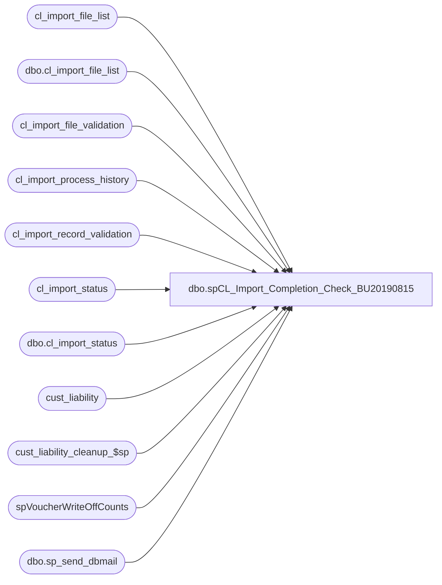

# dbo.spCL_Import_Completion_Check_BU20190815

**Database:** auditworks  
**Server:** bedrockdb01  

## Architecture Diagram



## Table Dependencies

| Referenced Table |
|---|
| cl_import_file_list |
| dbo.cl_import_file_list |
| cl_import_file_validation |
| cl_import_process_history |
| cl_import_record_validation |
| cl_import_status |
| dbo.cl_import_status |
| cust_liability |
| cust_liability_cleanup_$sp |
| spVoucherWriteOffCounts |
| dbo.sp_send_dbmail |

## Stored Procedure Code

```sql
--DROP PROC [dbo].[spCL_Import_Completion_Check]
--GO

CREATE PROC [dbo].[spCL_Import_Completion_Check_BU20190815]
-- =============================================================================================================
-- Name: [dbo].[spCL_Import_Completion_Check]
--
-- Description:	Checks CL import status for completion and notifies via email accordingly
--
--
-- Output: N/A
--
-- Dependencies: 
--
-- Revision History
--		Name:			Date:			Comments:
--		Paul Beckman	12/08/2010		Created SP
--		Edin Pehilj		12/08/2010		Approved SP
--		Paul Beckman	12/13/2011		Added completion check to include Voucher write-off process completion
--		Paul Beckman	07/19/2015		Updated from POSDBSSA to BEDROCKDB01
--		Paul Beckman	08/31/2016		Updated profile_name from 'POSadmin' to 'SAAdmin'
--		Paul Beckman	01/18/2017		Updated Alert email body to HTML
--		Paul Beckman	10/27/2017		Removed old non-HTML code for email body
--		Paul Beckman	10/27/2017		Added summary of counts to import completion
--		Paul Beckman	06/25/2018		Added 20 day file cleanup step
--		Paul Beckman	06/06/2019		Added .tab file cleanup steps for \\saapp01\CL_IMPORT\Backup
--		Paul Beckman	08/15/2019		Change Net Use drive letter from z: to w: due to conflict in other SPs
--
-- exec spCL_Import_Completion_Check
-- =============================================================================================================
AS
SET NOCOUNT ON

DECLARE @drive VARCHAR(5)  
DECLARE @command VARCHAR(200)
DECLARE @backupfolder VARCHAR(20)

DECLARE @sql VARCHAR(8000)
DECLARE @recipients VARCHAR(4000)
DECLARE @copy_recipients VARCHAR(4000)
DECLARE @Subject VARCHAR(120)
DECLARE @query VARCHAR(8000)
DECLARE @text nvarchar(max)


--####################################################
-- Validate if cl_import_status table has data

IF (SELECT COUNT(*) FROM cl_import_status) = 0
GOTO FINISH


--####################################################
-- 

IF (SELECT COUNT(*) FROM cl_import_status WHERE backup_folder LIKE 'WriteOff%') = 1
GOTO WRITEOFFCHECK


--####################################################
-- Update how many records match in SA from import files
IMPORTCHECK:

UPDATE cl_import_status
SET records_match_sa =
(select count('se.*') as Records_in_SA from cl_import_record_validation se (nolock)
left join cust_liability cl (nolock) on cl.reference_no = (se.reference_no)
where cl.reference_no = se.reference_no)


--####################################################
-- Update how many import records are NOT in SA

UPDATE cl_import_status
SET not_in_sa =
(select records_to_load-records_match_sa from cl_import_status)


--####################################################
-- Decision path based on records NOT in SA

IF (SELECT SUM(not_in_sa) FROM cl_import_status) > 0
GOTO FINISH


--####################################################
-- Process complete - Update status table

UPDATE cl_import_status
SET import_end = CONVERT(VARCHAR(19), GETDATE(), 120)

UPDATE cl_import_status
SET cl_load_status = 'completed with errors'
WHERE failed_files > 0
AND not_in_sa = 0

UPDATE cl_import_status
SET cl_load_status = 'completed'
WHERE failed_files = 0
AND not_in_sa = 0


--####################################################
-- Move .gz files to backup folder

SET NOCOUNT ON  

SET @backupfolder = (SELECT backup_folder FROM cl_import_status)

SET @drive = 'w:'  
SET @command = 'net use ' + @drive + ' /d'  
EXEC master..xp_cmdshell @command  
SET @command = 'net use ' + @drive + ' \\saapp01\d$\EPICOR\auditworks\ICT_IMPORT\BK'  
EXEC master..xp_cmdshell @command  

SET @command = 'move /Y ' + @drive + '\CL20*.gz ' + @drive + '\Backup\'
EXEC master..xp_cmdshell @command 

SET @command = 'net use ' + @drive + ' /d'
EXEC master..xp_cmdshell @command


--####################################################
-- Create Discount Number counts

IF (Object_ID('tempdb..##DiscountNumberCounts') IS NOT NULL) DROP TABLE ##DiscountNumberCounts

SELECT CASE WHEN Col011 = 'CPN'
	THEN LEFT(reference_no,7)
	ELSE 'Bonus Club CPN'
	END AS Discount_num
		,COUNT(reference_no) AS Total
INTO ##DiscountNumberCounts
FROM cl_import_file_validation
GROUP BY LEFT(reference_no,7),Col011
ORDER BY LEFT(reference_no,7)


--####################################################
-- Send voucher import completion email
VOUCHERIMPORTEMAIL:

--SET @recipients = 'paulb@buildabear.com'
SET @recipients = 'VoucherImport@buildabear.com'
--SET @copy_recipients = 'posadmin@buildabear.com'

--IF (SELECT COUNT(*) FROM auditworks.dbo.cl_import_status WHERE failed_files > 0) > 0
--GOTO COMPLETEDERROR

SET @text = 
		'<font face =arial size = 2>' +
		'Voucher upload process has completed. <br>' +
		'<br>' +
		'<table border="1">' + 
		'<font face =arial size = 2>' +
		'<tr bgcolor=#D5D5F7><th>Process Status</th><th>Records Imported</th><th>Import Start</th><th>Import End</th></tr>' +
		CAST ( ( SELECT td = cl_load_status, '',
						[td/@align]='right',
						td = FORMAT(records_to_load,'#,###'), '',
						td = CONVERT(VARCHAR(19),import_start,120), '',
						td = CONVERT(VARCHAR(19),import_end,120), ''
				FROM auditworks.dbo.cl_import_status
				FOR xml path ('tr'), type
		) AS NVARCHAR(MAX) ) +
		'</table>' +
		'<br><br>' +
		'The following files have been imported to Sales Audit <br>' +
		'The records in these files have been validated to be in Sales Audit <br>' +
		'<br>' +
		'<table border="1">' + 
		'<font face =arial size = 2>' +
		'<tr bgcolor=#D5D5F7><th>File ID</th><th>Record Count</th><th>File Name</th></tr>' +
		CAST ( ( SELECT [td/@align]='center',
						td = file_id, '',
						[td/@align]='right',
						td = FORMAT(record_count,'#,###'), '',
						td = file_name, ''
				FROM auditworks.dbo.cl_import_file_list
				WHERE validate_status = 'Passed'
				FOR xml path ('tr'), type
		) AS NVARCHAR(MAX) ) +
		'</table>' +
		'<br><br>' +
		'The following Counts imported to Sales Audit <br>' +
		'<br>' +
		'<table border="1">' + 
		'<font face =arial size = 2>' +
		'<tr bgcolor=#D5D5F7><th>Discount Event</th><th>Record Count</th></tr>' +
		CAST ( ( SELECT [td/@align]='left',
						td = Discount_num, '',
						[td/@align]='right',
						td = FORMAT(SUM(Total),'#,###'), ''
				FROM ##DiscountNumberCounts
				GROUP BY Discount_num
				ORDER BY Discount_num
				FOR xml path ('tr'), type
		) AS NVARCHAR(MAX) ) +
		'</table>' +
		'<font face =arial size = 1 color="#C0C0C0">' +
		'<br><br><br><br>' +
		'Server:  BEDROCKDB01 <br>' +
		'Job Name:  CL_Import_Completion_Check <br>' +
		'Stored Proc:  BEDROCKDB01.auditworks.dbo.spCL_Import_Completion_Check <br>' +
		'Created by:  Paul Beckman <br>' +
		'Team Ownership:  SAadmin <br>'


SET @Subject = 'Voucher Upload process COMPLETED - ' + @backupfolder
	EXEC msdb.dbo.sp_send_dbmail  
		@profile_name = 'SAAdmin',
		@recipients = @recipients,
		@copy_recipients = @copy_recipients,
		@subject=@Subject, 
		@body = @text,
		@body_format = 'HTML'

GOTO FINALSTEP


--####################################################
WRITEOFFCHECK:
--####################################################
-- Update how many records show as written off in SA from import files

UPDATE cl_import_status
SET records_match_sa =
(select count('se.*') as Records_in_SA from cl_import_record_validation se (nolock)
left join cust_liability cl (nolock) on cl.reference_no = (se.reference_no)
where cl.reference_no = se.reference_no
and cl.forfeited_flag = 1
and cl.liability_amount = 0
--and cl.pos_amount_1 = 0
and cl.amount_4 = 0
and cl.amount_3 = cl.amount_7
--and cl.pos_amount_1 = cl.liability_amount
and cl.pos_status = 50
)

--####################################################
-- Update how many import records are NOT in SA

UPDATE cl_import_status
SET not_in_sa =
(select records_to_load-records_match_sa from cl_import_status)


--####################################################
-- Decision path based on records NOT in SA

IF (SELECT SUM(not_in_sa) FROM cl_import_status) > 0
GOTO FINISH


--####################################################
-- Update vouchers last_modified_by_aw date

IF (SELECT COUNT(*) FROM cl_import_status WHERE backup_folder = 'WriteOff_SerialCpn') = 1
BEGIN
	UPDATE cust_liability
	SET last_modified_by_aw = CONVERT(char,DATEADD(day,-400,GETDATE()),101)
	WHERE reference_no IN (SELECT se.reference_no FROM cl_import_record_validation se (nolock)
	LEFT JOIN cust_liability cl (nolock) on cl.reference_no = (se.reference_no)
	WHERE cl.reference_no = se.reference_no)

	-- Run exec cust_liability_cleanup_$sp
	exec cust_liability_cleanup_$sp
END

--####################################################
-- Process complete - Update status table

UPDATE cl_import_status
SET import_end = CONVERT(VARCHAR(19), GETDATE(), 120)

UPDATE cl_import_status
SET cl_load_status = 'completed with errors'
WHERE failed_files > 0
AND not_in_sa = 0

UPDATE cl_import_status
SET cl_load_status = 'completed'
WHERE failed_files = 0
AND not_in_sa = 0


--####################################################
-- Move .gz files to backup folder

SET NOCOUNT ON  

SET @backupfolder = (SELECT backup_folder FROM cl_import_status)

SET @drive = 'w:'  
SET @command = 'net use ' + @drive + ' /d'  
EXEC master..xp_cmdshell @command  
SET @command = 'net use ' + @drive + ' \\saapp01\d$\EPICOR\auditworks\ICT_IMPORT\BK'  
EXEC master..xp_cmdshell @command  

SET @command = 'move /Y ' + @drive + '\CL20*.gz ' + @drive + '\Backup\'
EXEC master..xp_cmdshell @command 

SET @command = 'net use ' + @drive + ' /d'
EXEC master..xp_cmdshell @command


--####################################################
-- Send voucher write-off completion email
WRITEOFFEMAIL:

--SET @recipients = 'paulb@buildabear.com'
SET @recipients = 'VoucherWriteOff@buildabear.com'
--SET @copy_recipients = 'posadmin@buildabear.com'

SET @text = 
		'<font face =arial size = 2>' +
		'Voucher write-off process has completed. <br>' +
		'<br>' +
		'<table border="1">' + 
		'<font face =arial size = 2>' +
		'<tr bgcolor=#D5D5F7><th>Process Status</th><th>Records Written off</th><th>Import Start</th><th>Import End</th></tr>' +
		CAST ( ( SELECT td = cl_load_status, '',
						[td/@align]='right',
						td = FORMAT(records_to_load,'#,###'), '',
						td = CONVERT(VARCHAR(19),import_start,120), '',
						td = CONVERT(VARCHAR(19),import_end,120), ''
				FROM auditworks.dbo.cl_import_status
				FOR xml path ('tr'), type
		) AS NVARCHAR(MAX) ) +
		'</table>' +
		'<br><br>' +
		'The following files have been processed and records written off in Sales Audit. <br>' +
		'If this was a Serialized Coupon write off, they have also been removed from Sales Audit <br>' +
		'<br>' +
		'<table border="1">' + 
		'<font face =arial size = 2>' +
		'<tr bgcolor=#D5D5F7><th>File ID</th><th>Record Count</th><th>File Name</th></tr>' +
		CAST ( ( SELECT [td/@align]='center',
						td = file_id, '',
						[td/@align]='right',
						td = FORMAT(record_count,'#,###'), '',
						td = file_name, ''
				FROM auditworks.dbo.cl_import_file_list
				WHERE validate_status = 'Passed'
				FOR xml path ('tr'), type
		) AS NVARCHAR(MAX) ) +
		'</table>' +
		'<font face =arial size = 1 color="#C0C0C0">' +
		'<br><br><br><br>' +
		'Server:  BEDROCKDB01 <br>' +
		'Job Name:  CL_Import_Completion_Check <br>' +
		'Stored Proc:  BEDROCKDB01.auditworks.dbo.spCL_Import_Completion_Check <br>' +
		'Created by:  Paul Beckman <br>' +
		'Team Ownership:  SAadmin <br>'


IF (SELECT COUNT(*) FROM cl_import_status WHERE backup_folder LIKE 'WriteOff_SerialCpn') = 1
	SET @Subject = 'Voucher write-off process COMPLETED - Serialized Coupon'
IF (SELECT COUNT(*) FROM cl_import_status WHERE backup_folder LIKE 'WriteOff_SFS_Certs') = 1
	SET @Subject = 'Voucher write-off process COMPLETED - SFS Certificates'
	
--SET @Subject = 'Voucher write-off process COMPLETED'
	EXEC msdb.dbo.sp_send_dbmail  
		@profile_name = 'SAAdmin',
		@recipients = @recipients,
		@copy_recipients = @copy_recipients,
		@subject=@Subject, 
		@body = @text,
		@body_format = 'HTML'


--####################################################
-- Check vouchers removed

EXEC spVoucherWriteOffCounts


--####################################################
-- Insert status table record into process history table
FINALSTEP:

INSERT INTO cl_import_process_history select * from cl_import_status

TRUNCATE TABLE cl_import_status
TRUNCATE TABLE cl_import_file_list


--####################################################
FINISH:

SET @drive = 'w:'  
SET @command = 'net use ' + @drive + ' /d'  
EXEC master..xp_cmdshell @command  
SET @command = 'net use ' + @drive + ' \\saapp01\d$\EPICOR\auditworks\ICT_IMPORT\BK\Backup'  
EXEC master..xp_cmdshell @command  

SET @command = 'forfiles /p ' + @drive + ' /s /m *.gz /D -20 /C "cmd /c del @path"'
    select  @command
    exec master..xp_cmdshell @command


SET @drive = 'w:'  
SET @command = 'net use ' + @drive + ' /d'  
EXEC master..xp_cmdshell @command  
SET @command = 'net use ' + @drive + ' \\saapp01\CL_IMPORT\Backup\WriteOff_SerialCpn'  
EXEC master..xp_cmdshell @command  

SET @command = 'forfiles /p ' + @drive + ' /s /m *.tab /D -90 /C "cmd /c del @path"'
    select  @command
    exec master..xp_cmdshell @command

SET @command = 'net use ' + @drive + ' /d'  
EXEC master..xp_cmdshell @command


SET @drive = 'w:'  
SET @command = 'net use ' + @drive + ' /d'  
EXEC master..xp_cmdshell @command  
SET @command = 'net use ' + @drive + ' \\saapp01\CL_IMPORT\Backup\Import'  
EXEC master..xp_cmdshell @command  

SET @command = 'forfiles /p ' + @drive + ' /s /m *.tab /D -90 /C "cmd /c del @path"'
    select  @command
    exec master..xp_cmdshell @command

SET @command = 'net use ' + @drive + ' /d'  
EXEC master..xp_cmdshell @command
```

