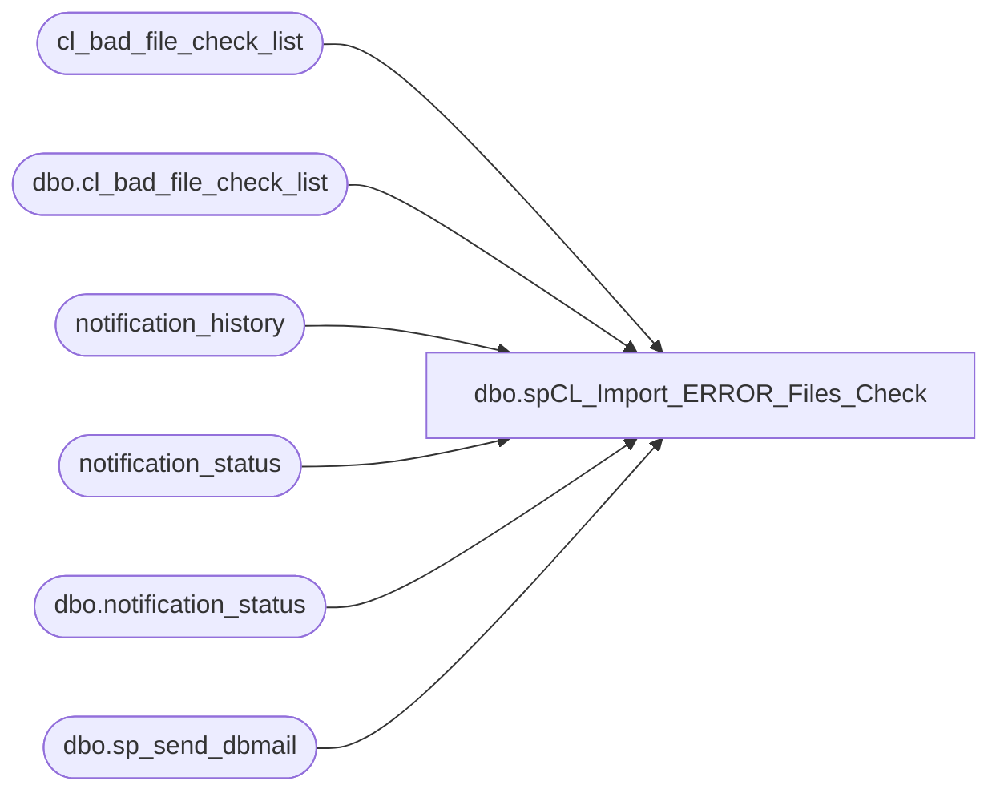

# dbo.spCL_Import_ERROR_Files_Check

**Database:** auditworks  
**Server:** bedrockdb01  

## Architecture Diagram



## Table Dependencies

| Referenced Table |
|---|
| cl_bad_file_check_list |
| dbo.cl_bad_file_check_list |
| notification_history |
| notification_status |
| dbo.notification_status |
| dbo.sp_send_dbmail |

## Stored Procedure Code

```sql
--DROP PROC [dbo].[spCL_Import_ERROR_Files_Check]
--GO

CREATE PROC [dbo].[spCL_Import_ERROR_Files_Check]
-- =============================================================================================================
-- Name: [dbo].[spCL_Import_ERROR_Files_Check]
--
-- Description:	Checks for ERROR files & notifies via email accordingly
--
--
-- Output: N/A
--
-- Dependencies: 
--
-- Revision History
--		Name:			Date:			Comments:
--		Paul Beckman	12/12/2010		Created SP
--		Paul Beckman	07/19/2015		Updated from POSDBSSA to BEDROCKDB01
--		Paul Beckman	09/11/2015		Updated to log to notification_status table
--		Paul Beckman	08/31/2016		Updated profile_name from 'POSadmin' to 'SAAdmin'
--		Paul Beckman	01/19/2017		Updated email body to HTML
--		Paul Beckman	01/18/2018		Removed old plain text email body
--		Paul Beckman	09/23/2019		Updated recipient from 'VoucherImport' to 'EntSysSupport'
--		Paul Beckman	10/17/2019		Updated to use notification_history table
--		Paul Beckman	02/05/2020		Updated email profile to 'EntSysSupport'
--
-- exec spCL_Import_ERROR_Files_Check
-- =============================================================================================================
AS
SET NOCOUNT ON


--####################################################

TRUNCATE TABLE cl_bad_file_check_list


--####################################################

DECLARE @drive VARCHAR(5)  
DECLARE @command VARCHAR(200)

DECLARE @sql VARCHAR(8000)
DECLARE @recipients VARCHAR(4000)
DECLARE @copy_recipients VARCHAR(4000)
DECLARE @Subject VARCHAR(80)
DECLARE @query VARCHAR(8000)
DECLARE @text nvarchar(max)


--####################################################

--SET @recipients = 'paulb@buildabear.com'
SET @recipients = 'EntSysSupport@buildabear.com'
--SET @copy_recipients = 'SAadmin@buildabear.com'


--####################################################


SET @drive = 'z:'  
SET @command = 'net use ' + @drive + ' /d'  
EXEC master..xp_cmdshell @command  
SET @command = 'net use ' + @drive + ' \\saapp01\CL_IMPORT\Voucher_Import'  
EXEC master..xp_cmdshell @command  
SET @command = 'dir /B ' + @drive + '\*.ERROR'  
INSERT INTO cl_bad_file_check_list (file_name)
EXEC master..xp_cmdshell @command  
DELETE FROM cl_bad_file_check_list WHERE file_name IS NULL OR file_name IN ('File Not Found','The system cannot find the path specified.')
--DELETE FROM cl_bad_file_check_list WHERE file_name IS NULL OR file_name = 'File Not Found'

SET @command = 'net use ' + @drive + ' /d'
EXEC master..xp_cmdshell @command


--####################################################

IF (SELECT COUNT(*) FROM cl_bad_file_check_list) > 0
GOTO CHECKALERTSTATUS


--####################################################

CLEARALERTSTATUS:
	IF (SELECT COUNT(*) FROM notification_status WHERE reported = 1 AND notification_name = 'CL error files found') = 1
	BEGIN
		UPDATE notification_status
		SET reported = 0,reported_cleared = CONVERT(VARCHAR(19),GETDATE(),120)
		WHERE notification_name = 'CL error files found'

		SET @text = 
		'<font face =arial size = 2>' +
		'.ERROR Voucher upload files have been cleared <br>' +
		'<br>' +
		'<table border="1">' + 
		'<font face =arial size = 2>' +
		'<tr bgcolor=#D5D5F7><th>Notification Name</th><th>First Reported</th><th>Reported Cleared</th></tr>' +
		CAST ( ( SELECT td = notification_name, '',
						td = CONVERT(VARCHAR(19),first_reported,120), '',
						td = CONVERT(VARCHAR(19),reported_cleared,120), ''
				FROM auditworks.dbo.notification_status
				WHERE notification_name = 'CL error files found'
				FOR xml path ('tr'), type
		) AS NVARCHAR(MAX) ) +
		'</table>' +
		'<font face =arial size = 1 color="#C0C0C0">' +
		'<br><br><br><br>' +
		'Server:  BEDROCKDB01 <br>' +
		'Job Name:  CL_Import_ERROR_Files_Check <br>' +
		'Stored Proc:  BEDROCKDB01.auditworks.dbo.spCL_Import_ERROR_Files_Check <br>' +
		'Created by:  Paul Beckman <br>' +
		'Team Ownership:  Enterprise Systems <br>'

SET @Subject = 'UPDATE - Voucher Upload ERROR files cleared'
	EXEC msdb.dbo.sp_send_dbmail  
	@profile_name = 'EntSysSupport',
	@recipients = @recipients,
	@copy_recipients = @copy_recipients,
	@subject=@Subject, 
	@body = @text,
	@body_format = 'HTML'
	
	INSERT INTO notification_history
	(stored_proc_name,
	record_logged_datetime,
	issues_found,
	action_required,
	notification_sent,
	email_type,
	email_to,
	email_cc,
	email_subject,
	comment
	)
	VALUES (
	'spCL_Import_ERROR_Files_Check', --<< Stored Proc name
	GETDATE(),
	'No', --<< Issues found - Yes / No
	'No', --<< Action required - Yes / No
	'Yes', --<< Notification sent - Yes / No
	'Notification Only', --<< Email type - Notification Only / Alert / Warning
	@recipients, --<< Email TO
	NULL, --<< Email CC
	@Subject, --<< Email Subject
	'ERROR Voucher upload files have been cleared' --<< Comment
	)

END
	
GOTO CHECKCOMPLETE


--##############################################

CHECKALERTSTATUS:
	IF (SELECT COUNT(*) FROM notification_status WHERE reported = 0 AND notification_name = 'CL error files found') = 1
	BEGIN
		UPDATE notification_status
		SET reported = 1,first_reported = CONVERT(VARCHAR(19),GETDATE(),120),reported_cleared = NULL
		WHERE notification_name = 'CL error files found'

		SET @text = 
		'<font face =arial size = 2 color="Red">' +
		N'<H3>** ACTION REQUIRED **</H3>' +
		'.ERROR Voucher upload files have been found in \\saapp01\CL_IMPORT\Voucher_Import and need to be corrected and resubmitted or removed from the folder. <br>' +
		'These need to be resolved for the CL import process to begin. <br>' +
		'<br>' +
		'<table border="1">' + 
		'<font face =arial size = 2 color="Black">' +
		'<tr bgcolor=#D5D5F7><th>File Name</th></tr>' +
		CAST ( ( SELECT td = file_name, ''
				FROM auditworks.dbo.cl_bad_file_check_list
				FOR xml path ('tr'), type
		) AS NVARCHAR(MAX) ) +
		'</table>' +
		'<font face =arial size = 1 color="#C0C0C0">' +
		'<br><br><br><br>' +
		'Server:  BEDROCKDB01 <br>' +
		'Job Name:  CL_Import_ERROR_Files_Check <br>' +
		'Stored Proc:  BEDROCKDB01.auditworks.dbo.spCL_Import_ERROR_Files_Check <br>' +
		'Created by:  Paul Beckman <br>' +
		'Team Ownership:  Enterprise Systems <br>'

SET @Subject = 'ALERT - Voucher Upload ERROR files found'
	EXEC msdb.dbo.sp_send_dbmail  
	@profile_name = 'EntSysSupport',
	@recipients = @recipients,
	@copy_recipients = @copy_recipients,
	@subject=@Subject, 
	@body = @text,
	@body_format = 'HTML'
	
	INSERT INTO notification_history
	(stored_proc_name,
	record_logged_datetime,
	issues_found,
	action_required,
	notification_sent,
	email_type,
	email_to,
	email_cc,
	email_subject,
	comment
	)
	VALUES (
	'spCL_Import_ERROR_Files_Check', --<< Stored Proc name
	GETDATE(),
	'Yes', --<< Issues found - Yes / No
	'Yes', --<< Action required - Yes / No
	'Yes', --<< Notification sent - Yes / No
	'Alert', --<< Email type - Notification Only / Alert / Warning
	@recipients, --<< Email TO
	NULL, --<< Email CC
	@Subject, --<< Email Subject
	'ERROR Voucher upload files have been found' --<< Comment
	)

END

--####################################################

CHECKCOMPLETE:
```

