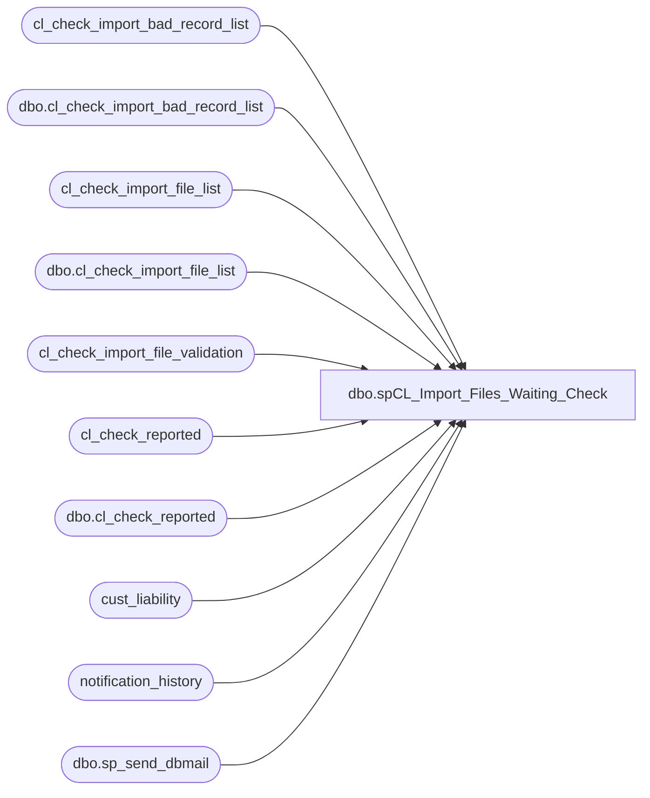

# dbo.spCL_Import_Files_Waiting_Check

**Database:** auditworks  
**Server:** bedrockdb01  

## Architecture Diagram



## Table Dependencies

| Referenced Table |
|---|
| cl_check_import_bad_record_list |
| dbo.cl_check_import_bad_record_list |
| cl_check_import_file_list |
| dbo.cl_check_import_file_list |
| cl_check_import_file_validation |
| cl_check_reported |
| dbo.cl_check_reported |
| cust_liability |
| notification_history |
| dbo.sp_send_dbmail |

## Stored Procedure Code

```sql
--DROP PROC [dbo].[spCL_Import_Files_Waiting_Check]
--GO

CREATE PROC [dbo].[spCL_Import_Files_Waiting_Check]
-- =============================================================================================================
-- Name: [dbo].[spCL_Import_Files_Waiting_Check]
--
-- Description:	Checks for files and starts CL import validation and import process & notifies via email accordingly
--
--
-- Output: N/A
--
-- Dependencies: 
--
-- Revision History
--		Name:			Date:			Comments:
--		Paul Beckman	12/10/2010		Created SP
--		Paul Beckman	12/13/2010		Updated to include validation that email_address is not > 50 characters
--		Paul Beckman	01/20/2011		Updated to include validation that expiry_date is < today's date
--		Paul Beckman	04/15/2011		Updated to include validation that voucher already exists in SA and added
--										reason code to why voucher number failed
--		Paul Beckman	12/27/2011		Modified file checking to account for if/when Marketing removes the .tab
--										files for processing or the start.upload file has changed
--		Paul Beckman	06/12/2013		Removed validation section for Serialized Coupons that validated the 
--										voucher numbers started with a 6.  This is related to the new Discount
--										Manager and reformatted Serialized Coupons.
--		Paul Beckman	07/19/2015		Updated from POSDBSSA to BEDROCKDB01
--		Paul Beckman	08/31/2016		Updated profile_name from 'POSadmin' to 'SAAdmin'
--		Paul Beckman	01/24/2017		Updated email body to HTML
--		Paul Beckman	10/17/2019		Updated to use notification_history table
--		Paul Beckman	02/05/2020		Updated email profile to 'EntSysSupport'
--
--
-- exec spCL_Import_Files_Waiting_Check
-- =============================================================================================================
AS
SET NOCOUNT ON


--####################################################

DECLARE @drive VARCHAR(5)  
DECLARE @command VARCHAR(200)

IF (Object_ID('tempdb..#startupload') IS NOT NULL) DROP TABLE #startupload
IF (Object_ID('tempdb..#filetext') IS NOT NULL) DROP TABLE #filetext
CREATE TABLE #startupload (dirtext VARCHAR(25))
CREATE TABLE #filetext (dirtext VARCHAR(90))

SET @drive = 'y:'  
SET @command = 'net use ' + @drive + ' /d'  
EXEC master..xp_cmdshell @command  
SET @command = 'net use ' + @drive + ' \\saapp01\CL_IMPORT\Voucher_Import'  
EXEC master..xp_cmdshell @command  
SET @command = 'dir /B ' + @drive + '\start.upload'  
INSERT INTO #startupload (dirtext)
EXEC master..xp_cmdshell @command 
DELETE FROM #startupload WHERE dirtext IS NULL OR dirtext = 'File Not Found'

IF (SELECT COUNT(*) FROM #startupload) = 1
	BULK INSERT #filetext FROM '\\saapp01\CL_IMPORT\Voucher_Import\start.upload'

TRUNCATE TABLE cl_check_import_file_list
SET @command = 'dir /B ' + @drive + '\*.tab'  
INSERT INTO cl_check_import_file_list (file_name)
EXEC master..xp_cmdshell @command  
DELETE FROM cl_check_import_file_list WHERE file_name IS NULL OR file_name = 'File Not Found'

IF (SELECT COUNT(*) FROM cl_check_reported cl,#filetext ft WHERE cl.startupload_text = ft.dirtext) = 0
	TRUNCATE TABLE cl_check_reported
	
/*
SELECT (SELECT COUNT(*) FROM cl_check_reported cl,#filetext ft WHERE cl.startupload_text = ft.dirtext)
SELECT * FROM cl_check_reported
SELECT * FROM cl_check_import_file_list
SELECT * FROM #startupload
SELECT * FROM #filetext
*/

IF (SELECT COUNT(*) FROM #startupload) = 1 AND (SELECT COUNT(*) FROM cl_check_import_file_list) = 0
SET @command = 'del /Q ' + @drive + '\start.upload'  
EXEC master..xp_cmdshell @command

IF (SELECT COUNT(*) FROM #startupload) = 0 OR (SELECT COUNT(*) FROM cl_check_import_file_list) = 0
BEGIN
	TRUNCATE TABLE cl_check_reported
	TRUNCATE TABLE cl_check_import_file_list
	GOTO FINISH
END


--####################################################
STARTCHECKREPORT:
--####################################################

IF (SELECT COUNT(*) FROM cl_check_reported) > 0
GOTO FINISH

--####################################################

TRUNCATE TABLE cl_check_import_bad_record_list
TRUNCATE TABLE cl_check_import_file_validation

--####################################################

--declare cursor  
DECLARE @filename VARCHAR(80)
DECLARE @fileid VARCHAR(2)
DECLARE fileid CURSOR FOR  
SELECT file_id
FROM cl_check_import_file_list 
ORDER BY file_id  
  
--open cursor  
OPEN fileid  
  
FETCH next  
 FROM fileid  
 INTO @fileid  

WHILE @@fetch_status = 0  

BEGIN  

--#########

TRUNCATE TABLE cl_check_import_file_validation

DECLARE @cmd varchar(4000)

SET @filename = 
(SELECT file_name FROM cl_check_import_file_list 
WHERE file_id = @fileid)

    select  @cmd = 'bcp auditworks.dbo.cl_check_import_file_validation in "\\saapp01\CL_IMPORT\Voucher_Import\' + @filename + '" -T -c'
    exec master..xp_cmdshell @cmd

--#########

UPDATE cl_check_import_file_list
SET record_count =
(SELECT COUNT(*)
FROM cl_check_import_file_validation)
WHERE file_id = @fileid

--#########

UPDATE cl_check_import_file_validation
SET reference_no = '0' + reference_no
WHERE reference_no like '1%'
AND type = 'R'
AND LEN(reference_no) = 15

--#########

INSERT INTO cl_check_import_bad_record_list (reference_no)
SELECT reference_no
FROM cl_check_import_file_validation
WHERE type = 'S'
AND LEN(reference_no) <> 17
UPDATE cl_check_import_bad_record_list
SET error_reason = 'Voucher Num length'
WHERE error_reason IS NULL

--INSERT INTO cl_check_import_bad_record_list (reference_no)
--SELECT reference_no
--FROM cl_check_import_file_validation
--WHERE type = 'S'
--AND reference_no NOT LIKE '6%'
--UPDATE cl_check_import_bad_record_list
--SET error_reason = 'Bad Srlzd Cpn format'
--WHERE error_reason IS NULL

INSERT INTO cl_check_import_bad_record_list (reference_no)
SELECT reference_no
FROM cl_check_import_file_validation
WHERE type = 'R'
AND LEN(reference_no) <> 16
UPDATE cl_check_import_bad_record_list
SET error_reason = 'Voucher Num length'
WHERE error_reason IS NULL

INSERT INTO cl_check_import_bad_record_list (reference_no)
SELECT reference_no
FROM cl_check_import_file_validation
WHERE type = 'R'
AND reference_no LIKE '0000%'
UPDATE cl_check_import_bad_record_list
SET error_reason = 'Bad SFS format'
WHERE error_reason IS NULL

INSERT INTO cl_check_import_bad_record_list (reference_no)
SELECT reference_no
FROM cl_check_import_file_validation
WHERE expiry_date IS NULL
UPDATE cl_check_import_bad_record_list
SET error_reason = 'Expiry date missing'
WHERE error_reason IS NULL

INSERT INTO cl_check_import_bad_record_list (reference_no)
SELECT reference_no
FROM cl_check_import_file_validation
WHERE LEN(email_address) > 50
UPDATE cl_check_import_bad_record_list
SET error_reason = 'Email too long'
WHERE error_reason IS NULL

INSERT INTO cl_check_import_bad_record_list (reference_no)
SELECT se.reference_no
FROM cl_check_import_file_validation se (NOLOCK)
LEFT JOIN cust_liability cl (NOLOCK) ON cl.reference_no = (se.reference_no)
WHERE cl.reference_no = se.reference_no
UPDATE cl_check_import_bad_record_list
SET error_reason = 'Already in SA'
WHERE error_reason IS NULL

INSERT INTO cl_check_import_bad_record_list (reference_no)
SELECT se.reference_no
FROM cl_check_import_file_validation se (NOLOCK)
LEFT JOIN cust_liability cl (NOLOCK) ON cl.reference_no = (se.reference_no)
WHERE substring(cl.reference_no,2,9) = substring(se.reference_no,2,9)
AND cl.reference_type = '31'
AND LEN(cl.reference_no) = 16
UPDATE cl_check_import_bad_record_list
SET error_reason = 'Cert Num in SA'
WHERE error_reason IS NULL

INSERT INTO cl_check_import_bad_record_list (reference_no)
SELECT reference_no
FROM cl_check_import_file_validation
WHERE expiry_date < CONVERT(char,DATEADD(day,-0,GETDATE()),111)
UPDATE cl_check_import_bad_record_list
SET error_reason = 'Bad Expiry date'
WHERE error_reason IS NULL

IF (SELECT COUNT(*) FROM cl_check_import_bad_record_list WHERE file_name IS NULL) > 0
GOTO BADFILEDATA

--#########

UPDATE cl_check_import_file_list
SET validate_status = 'Passed'
WHERE file_id = @fileid

GOTO PASSED

BADFILEDATA:

UPDATE cl_check_import_bad_record_list
SET file_name = @filename
WHERE file_name IS NULL

UPDATE cl_check_import_file_list
SET validate_status = 'Failed'
WHERE file_id = @fileid
--AND LEN(file_id) = 1

SET @command = 'rename "' + @drive + '\' + @filename + '" "' + @filename + '.ERROR"'
EXEC master..xp_cmdshell @command 

PASSED:

FETCH next  
 FROM fileid  
 INTO @fileid  
END  
  
CLOSE fileid  
DEALLOCATE fileid

--####################################################

INSERT INTO cl_check_reported VALUES ('reported',NULL)

UPDATE cl_check_reported
SET startupload_text = (SELECT *
FROM #filetext)

--####################################################

DECLARE @sql VARCHAR(8000)
DECLARE @recipients VARCHAR(4000)
DECLARE @copy_recipients VARCHAR(4000)
DECLARE @Subject VARCHAR(80)
DECLARE @query VARCHAR(8000)
DECLARE @text nvarchar(max)

IF (SELECT COUNT(*) FROM cl_check_import_file_list WHERE validate_status = 'Failed') > 0
GOTO ERROREMAIL

--SET @recipients = 'paulb@buildabear.com'
SET @recipients = 'VoucherImport@buildabear.com'
--SET @copy_recipients = 'posadmin@buildabear.com'

--SELECT COUNT(*) FROM cl_check_import_file_list
--SELECT SUM(record_count) AS record_count FROM cl_check_import_file_list
--SELECT COUNT(*) FROM cl_check_import_file_list WHERE validate_status = 'Failed'

SET @text = 
		'<font face =arial size = 2>' +
		'Voucher upload files have been found and the validation process has been completed. <br>' +
		'<br>' +
		'Files found in \\saapp01\CL_IMPORT\Voucher_Import ... <br>' +
		'<br>' +
		'<table border="1">' + 
		'<font face =arial size = 2>' +
		'<tr bgcolor=#D5D5F7><th>File ID</th><th>Record Count</th><th>Validation Status</th><th>File Name</th></tr>' +
		CAST ( ( SELECT [td/@align]='center',
						td = file_id, '',
						[td/@align]='right',
						td = FORMAT(record_count,'#,###'), '',
						td = validate_status, '',
						td = file_name, ''
				FROM auditworks.dbo.cl_check_import_file_list
				FOR xml path ('tr'), type
		) AS NVARCHAR(MAX) ) +
		'</table>' +
		'<br><br>' +
		'<font face =arial size = 2>' +
		'Total Records PASSED for Import <br>' +
		'<table border="1">' + 
		'<font face =arial size = 2>' +
		'<tr bgcolor=#D5D5F7><th>Total Records</th></tr>' +
		CAST ( ( SELECT [td/@align]='right',
						td = FORMAT(SUM(record_count),'#,###'), ''
				FROM auditworks.dbo.cl_check_import_file_list
				WHERE validate_status = 'Passed'
				FOR xml path ('tr'), type
		) AS NVARCHAR(MAX) ) +
		'</table>' +
		'<br>' +
		'<table border="1">' + 
		'<font face =arial size = 2>' +
		'<tr bgcolor=#D5D5F7><th>File generation</th></tr>' +
		CAST ( ( SELECT td = startupload_text, ''
				FROM auditworks.dbo.cl_check_reported
				GROUP BY startupload_text
				FOR xml path ('tr'), type
		) AS NVARCHAR(MAX) ) +
		'</table>' +
		'<font face =arial size = 1 color="#C0C0C0">' +
		'<br><br><br><br>' +
		'Server:  BEDROCKDB01 <br>' +
		'Job Name:  CL_Import_Files_Waiting_Check <br>' +
		'Stored Proc:  BEDROCKDB01.auditworks.dbo.spCL_Import_Files_Waiting_Check <br>' +
		'Created by:  Paul Beckman <br>' +
		'Team Ownership:  Enterprise Systems <br>'

SET @Subject = 'Voucher Upload Files waiting to process'
	EXEC msdb.dbo.sp_send_dbmail  
	@profile_name = 'EntSysSupport',
	@recipients = @recipients,
	--@copy_recipients = @copy_recipients,
	@subject=@Subject, 
	@body = @text,
	@body_format = 'HTML'
	
	INSERT INTO notification_history
	(stored_proc_name,
	record_logged_datetime,
	issues_found,
	action_required,
	notification_sent,
	email_type,
	email_to,
	email_cc,
	email_subject,
	comment
	)
	VALUES (
	'spCL_Import_Files_Waiting_Check', --<< Stored Proc name
	GETDATE(),
	'No', --<< Issues found - Yes / No
	'No', --<< Action required - Yes / No
	'Yes', --<< Notification sent - Yes / No
	'Notification Only', --<< Email type - Notification Only / Alert / Warning
	@recipients, --<< Email TO
	NULL, --<< Email CC
	@Subject, --<< Email Subject
	'Voucher upload files have been found and the validation process has been completed' --<< Comment
	)

GOTO SKIPERROREMAIL

ERROREMAIL:

--SET @recipients = 'paulb@buildabear.com'
SET @recipients = 'VoucherImport@buildabear.com'
--SET @copy_recipients = 'posadmin@buildabear.com'

IF (SELECT COUNT(*) FROM cl_check_import_file_list WHERE validate_status = 'Passed') > 0
SET @text = 
		'<font face =arial size = 2>' +
		'Voucher upload files have been found and the validation and upload process has been initiated. <br>' +
		'<br>' +
		'<table border="1">' + 
		'<font face =arial size = 2>' +
		'<tr bgcolor=#D5D5F7><th>File generation</th></tr>' +
		CAST ( ( SELECT td = startupload_text, ''
				FROM auditworks.dbo.cl_check_reported
				FOR xml path ('tr'), type
		) AS NVARCHAR(MAX) ) +
		'</table>' +
		'<br><br>' +
		'<font face =arial size = 2>' +
		'Files found in \\saapp01\CL_IMPORT\Voucher_Import ... <br>' +
		'<table border="1">' + 
		'<font face =arial size = 2>' +
		'<tr bgcolor=#D5D5F7><th>File ID</th><th>Record Count</th><th>Validation Status</th><th>File Name</th></tr>' +
		CAST ( ( SELECT [td/@align]='center',
						td = file_id, '',
						[td/@align]='right',
						td = FORMAT(record_count,'#,###'), '',
						td = validate_status, '',
						td = file_name, ''
				FROM auditworks.dbo.cl_check_import_file_list
				FOR xml path ('tr'), type
		) AS NVARCHAR(MAX) ) +
		'</table>' +
		'<br><br>' +
		'<font face =arial size = 2>' +
		'Files that PASSED validation... <br>' +
		'<table border="1">' + 
		'<font face =arial size = 2>' +
		'<tr bgcolor=#D5D5F7><th>File ID</th><th>Record Count</th><th>File Name</th></tr>' +
		CAST ( ( SELECT [td/@align]='center',
						td = file_id, '',
						[td/@align]='right',
						td = FORMAT(record_count,'#,###'), '',
						td = file_name, ''
				FROM auditworks.dbo.cl_check_import_file_list
				WHERE validate_status = 'Passed'
				FOR xml path ('tr'), type
		) AS NVARCHAR(MAX) ) +
		'</table>' +
		'<br>' +
		'<table border="1">' + 
		'<font face =arial size = 2>' +
		'<tr bgcolor=#D5D5F7><th>Total Records PASSED</th></tr>' +
		CAST ( ( SELECT [td/@align]='right',
						td = FORMAT(SUM(record_count),'#,###'), ''
				FROM auditworks.dbo.cl_check_import_file_list
				WHERE validate_status = 'Passed'
				FOR xml path ('tr'), type
		) AS NVARCHAR(MAX) ) +
		'</table>' +
		'<br><br>' +
		'<font face =arial size = 2 color="Red">' +
		'Files that FAILED validation and will NOT be imported until corrected. <br>' +
		'These files have been renamed to .ERROR and can be found in \\saapp01\CL_IMPORT\Voucher_Import for correction <br>' +
		'<br>' +
		'<table border="1">' + 
		'<font face =arial size = 2>' +
		'<tr bgcolor=#D5D5F7><th>File ID</th><th>Record Count</th><th>File Name</th></tr>' +
		CAST ( ( SELECT [td/@align]='center',
						td = file_id, '',
						[td/@align]='right',
						td = FORMAT(record_count,'#,###'), '',
						td = file_name, ''
				FROM auditworks.dbo.cl_check_import_file_list
				WHERE validate_status = 'Failed'
				FOR xml path ('tr'), type
		) AS NVARCHAR(MAX) ) +
		'</table>' +
		'<br>' +
		'<table border="1">' + 
		'<font face =arial size = 2>' +
		'<tr bgcolor=#D5D5F7><th>Reference Num</th><th>Error Reason</th><th>File Name</th></tr>' +
		CAST ( ( SELECT TOP (100) td = reference_no, '',
						td = error_reason, '',
						td = file_name, ''
				FROM auditworks.dbo.cl_check_import_bad_record_list
				FOR xml path ('tr'), type
		) AS NVARCHAR(MAX) ) +
		'</table>' +
		'<br>' +
		'<table border="1">' + 
		'<font face =arial size = 2>' +
		'<tr bgcolor=#D5D5F7><th>Total Records FAILED</th></tr>' +
		CAST ( ( SELECT [td/@align]='right',
						td = FORMAT(SUM(record_count),'#,###'), ''
				FROM auditworks.dbo.cl_check_import_file_list
				WHERE validate_status = 'Failed'
				FOR xml path ('tr'), type
		) AS NVARCHAR(MAX) ) +
		'</table>' +
		'<font face =arial size = 1 color="#C0C0C0">' +
		'<br><br><br><br>' +
		'Server:  BEDROCKDB01 <br>' +
		'Job Name:  CL_Import_Files_Waiting_Check <br>' +
		'Stored Proc:  BEDROCKDB01.auditworks.dbo.spCL_Import_Files_Waiting_Check <br>' +
		'Created by:  Paul Beckman <br>' +
		'Team Ownership:  Enterprise Systems <br>'
ELSE
SET @text = 
		'<font face =arial size = 2 color="Red">' +
		'Files that FAILED validation and will NOT be imported until corrected. <br>' +
		'These files have been renamed to .ERROR and can be found in \\saapp01\CL_IMPORT\Voucher_Import for correction <br>' +
		'<br>' +
		'<table border="1">' + 
		'<font face =arial size = 2>' +
		'<tr bgcolor=#D5D5F7><th>File ID</th><th>Record Count</th><th>File Name</th></tr>' +
		CAST ( ( SELECT [td/@align]='center',
						td = file_id, '',
						[td/@align]='right',
						td = FORMAT(record_count,'#,###'), '',
						td = file_name, ''
				FROM auditworks.dbo.cl_check_import_file_list
				WHERE validate_status = 'Failed'
				FOR xml path ('tr'), type
		) AS NVARCHAR(MAX) ) +
		'</table>' +
		'<br>' +
		'<table border="1">' + 
		'<font face =arial size = 2>' +
		'<tr bgcolor=#D5D5F7><th>Reference Num</th><th>Error Reason</th><th>File Name</th></tr>' +
		CAST ( ( SELECT TOP (100) td = reference_no, '',
						td = error_reason, '',
						td = file_name, ''
				FROM auditworks.dbo.cl_check_import_bad_record_list
				FOR xml path ('tr'), type
		) AS NVARCHAR(MAX) ) +
		'</table>' +
		'<br>' +
		'<table border="1">' + 
		'<font face =arial size = 2>' +
		'<tr bgcolor=#D5D5F7><th>Total Records FAILED</th></tr>' +
		CAST ( ( SELECT [td/@align]='right',
						td = FORMAT(SUM(record_count),'#,###'), ''
				FROM auditworks.dbo.cl_check_import_file_list
				WHERE validate_status = 'Failed'
				FOR xml path ('tr'), type
		) AS NVARCHAR(MAX) ) +
		'</table>' +
		'<font face =arial size = 1 color="#C0C0C0">' +
		'<br><br><br><br>' +
		'Server:  BEDROCKDB01 <br>' +
		'Job Name:  CL_Import_Files_Waiting_Check <br>' +
		'Stored Proc:  BEDROCKDB01.auditworks.dbo.spCL_Import_Files_Waiting_Check <br>' +
		'Created by:  Paul Beckman <br>' +
		'Team Ownership:  Enterprise Systems <br>'

SET @Subject = 'ALERT - Voucher Upload Files waiting to process - Errors found'
	EXEC msdb.dbo.sp_send_dbmail  
	@profile_name = 'EntSysSupport',
	@recipients = @recipients,
	--@copy_recipients = @copy_recipients,
	@subject=@Subject, 
	@body = @text,
	@body_format = 'HTML'

	INSERT INTO notification_history
	(stored_proc_name,
	record_logged_datetime,
	issues_found,
	action_required,
	notification_sent,
	email_type,
	email_to,
	email_cc,
	email_subject,
	comment
	)
	VALUES (
	'spCL_Import_Files_Waiting_Check', --<< Stored Proc name
	GETDATE(),
	'Yes', --<< Issues found - Yes / No
	'Yes', --<< Action required - Yes / No
	'Yes', --<< Notification sent - Yes / No
	'Alert', --<< Email type - Notification Only / Alert / Warning
	@recipients, --<< Email TO
	NULL, --<< Email CC
	@Subject, --<< Email Subject
	'Voucher upload files have been found and the validation process has found errors' --<< Comment
	)

SKIPERROREMAIL:

--####################################################

SET @command = 'net use ' + @drive + ' /d'
EXEC master..xp_cmdshell @command

--####################################################
FINISH:
```

