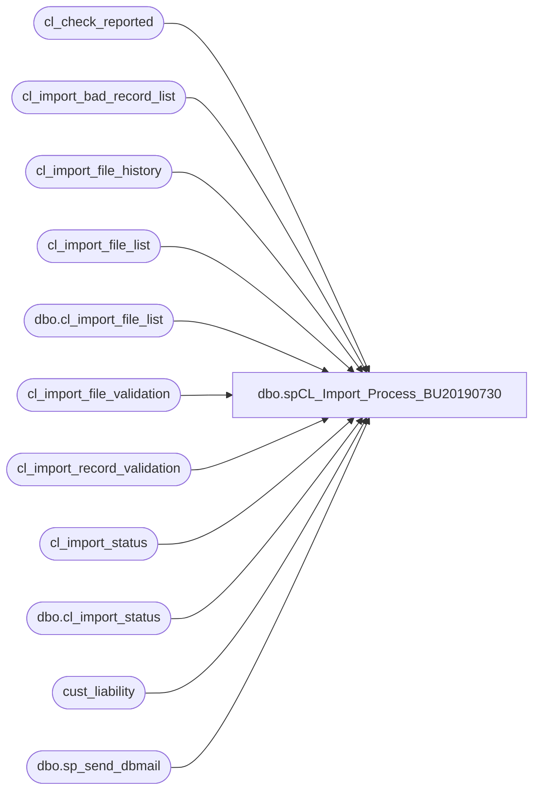

# dbo.spCL_Import_Process_BU20190730

**Database:** auditworks  
**Server:** bedrockdb01  

## Architecture Diagram



## Table Dependencies

| Referenced Table |
|---|
| cl_check_reported |
| cl_import_bad_record_list |
| cl_import_file_history |
| cl_import_file_list |
| dbo.cl_import_file_list |
| cl_import_file_validation |
| cl_import_record_validation |
| cl_import_status |
| dbo.cl_import_status |
| cust_liability |
| dbo.sp_send_dbmail |

## Stored Procedure Code

```sql
--DROP PROC [dbo].[spCL_Import_Process]
--GO

CREATE PROC [dbo].[spCL_Import_Process_BU20190730]
-- =============================================================================================================
-- Name: [dbo].[spCL_Import_Process]
--
-- Description:	Checks for files and starts CL import validation and import process & notifies via email accordingly
--
--
-- Output: N/A
--
-- Dependencies: 
--
-- Revision History
--		Name:			Date:			Comments:
--		Paul Beckman	12/08/2010		Created SP
--		Edin Pehilj		12/08/2010		Approved SP
--		Paul Beckman	12/13/2010		Updated to include validation that email_address is not > 50 characters
--		Paul Beckman	01/20/2011		Updated to include validation that expiry_date is < today's date
--		Paul Beckman	04/15/2011		Updated to include validation that voucher already exists in SA and added
--										reason code to why voucher number failed
--		Paul Beckman	06/12/2013		Removed validation section for Serialized Coupons that validated the 
--										voucher numbers started with a 6.  This is related to the new Discount
--										Manager and reformatted Serialized Coupons.
--		Paul Beckman	07/19/2015		Updated from POSDBSSA to BEDROCKDB01
--		Paul Beckman	08/31/2016		Updated profile_name from 'POSadmin' to 'SAAdmin'
--		Paul Beckman	07/14/2017		Updated email body to HTML
--		Paul Beckman	08/15/2017		Removed old non-HTML code for email body
--		Paul Beckman	10/27/2017		Added summary of counts to import process
--		Paul Beckman	06/25/2018		Removed backup folder step
--
-- exec spCL_Import_Process
-- =============================================================================================================
AS
SET NOCOUNT ON


--##########################
-- CL IMPORT PROCESS STEPS
--##########################


--####################################################
-- Confirm cl_load_status NOT IN "importinprogress" status AND import_end IS NOT NULL in cl_import_status table

IF (Object_ID('tempdb..#status') IS NOT NULL) DROP TABLE #status

SELECT cl_load_status
INTO #status
FROM cl_import_status
WHERE cl_load_status = 'import in progress' OR cl_load_status = 'validating files' OR import_end IS NULL

IF (SELECT COUNT(*) FROM #status) = 1
GOTO FINISH


--####################################################
-- Confirm start.upload flag file exists to start the process

IF (Object_ID('tempdb..#startupload') IS NOT NULL) DROP TABLE #startupload
IF (Object_ID('tempdb..#filetext') IS NOT NULL) DROP TABLE #filetext
CREATE TABLE #startupload (dirtext VARCHAR(25))
CREATE TABLE #filetext (dirtext VARCHAR(90))

SET NOCOUNT ON  
DECLARE @drive VARCHAR(5)  
DECLARE @command VARCHAR(200)
DECLARE @backupfolder VARCHAR(20)

SET @drive = 'z:'  
SET @command = 'net use ' + @drive + ' /d'  
EXEC master..xp_cmdshell @command  
SET @command = 'net use ' + @drive + ' \\saapp01\CL_IMPORT\Voucher_Import'  
EXEC master..xp_cmdshell @command  
SET @command = 'dir /B ' + @drive + '\start.upload'  
INSERT INTO #startupload (dirtext)
EXEC master..xp_cmdshell @command 

DELETE FROM #startupload WHERE dirtext IS NULL OR dirtext = 'File Not Found'

IF (SELECT COUNT(*) FROM #startupload) = 0
GOTO FINISH

SET @command = 'dir /B ' + @drive + '\*.tab'  
INSERT INTO cl_import_file_list (file_name)
EXEC master..xp_cmdshell @command  
DELETE FROM cl_import_file_list WHERE file_name IS NULL OR file_name = 'File Not Found'

IF (SELECT COUNT(*) FROM cl_import_file_list) = 0
GOTO FINISH
 
BULK INSERT #filetext
    FROM '\\saapp01\CL_IMPORT\Voucher_Import\start.upload'


--####################################################
-- Create data in cl_import_status

TRUNCATE TABLE cl_import_status

INSERT INTO cl_import_status VALUES ('process started',CONVERT(VARCHAR(19),GETDATE(),120),NULL,NULL,NULL,NULL,0,0,NULL,NULL)

UPDATE cl_import_status
SET startupload_text = (SELECT *
FROM #filetext)

UPDATE cl_import_status
SET backup_folder = 'CL' + CONVERT(CHAR(8), GETDATE(), 112) + REPLACE(CONVERT(CHAR(8), GETDATE(), 108), ':', '')


--####################################################
-- Delete start.upload flag file

SET @command = 'del /Q ' + @drive + '\start.upload'  
EXEC master..xp_cmdshell @command  


--####################################################
-- Copy files from Files_for_Upload on SAapp01 to backup folder on SAapp01

SET @command = 'xcopy /y /v /f ' + @drive + '\*.tab' + ' \\saapp01\CL_IMPORT\Backup\Import\'
EXEC master..xp_cmdshell @command 


--####################################################
-- Truncate tables for incoming records for validation

TRUNCATE TABLE cl_import_file_list
TRUNCATE TABLE cl_import_bad_record_list
TRUNCATE TABLE cl_import_file_validation
TRUNCATE TABLE cl_import_record_validation


--####################################################
-- Change cl_load_status

UPDATE cl_import_status
SET cl_load_status = 'validating files'


--####################################################
-- Log file names into cl_import_file_list table

SET @backupfolder = (select backup_folder from cl_import_status)

SET @command = 'dir /B ' + @drive + '\*.tab'  
INSERT INTO cl_import_file_list (file_name)
EXEC master..xp_cmdshell @command  
DELETE FROM cl_import_file_list WHERE file_name IS NULL OR file_name = 'File Not Found'

UPDATE cl_import_file_list
SET backup_folder = @backupfolder


--####################################################
-- Update file count in cl_import_status table

UPDATE cl_import_status
SET file_count = 
(select count(*) from cl_import_file_list)


--#################################################### - TESTED OK 12/6/2010 (Paul Beckman)
-- Loop through files in cl_import_file_list to perform validations and file renames

--declare cursor  
DECLARE @filename VARCHAR(80)
DECLARE @clfilename VARCHAR(20)
DECLARE @fileid VARCHAR(2)
DECLARE fileid CURSOR FOR  
SELECT file_id
FROM cl_import_file_list 
ORDER BY file_id  
  
--open cursor  
OPEN fileid  
  
FETCH next  
 FROM fileid  
 INTO @fileid  

WHILE @@fetch_status = 0  

BEGIN  

--Sub-Step

UPDATE cl_import_file_list
SET ict_import_filename = 'CL' + CONVERT(VARCHAR(8), GETDATE(), 112) + '000' + @fileid
FROM cl_import_file_list 
WHERE file_id = @fileid
AND LEN(file_id) = 1

UPDATE cl_import_file_list
SET ict_import_filename = 'CL' + CONVERT(VARCHAR(8), GETDATE(), 112) + '00' + @fileid
FROM cl_import_file_list 
WHERE file_id = @fileid
AND LEN(file_id) = 2

--Sub-Step

TRUNCATE TABLE cl_import_file_validation

DECLARE @cmd varchar(4000)

SET @filename = 
(SELECT file_name FROM cl_import_file_list 
WHERE file_id = @fileid)

SET @clfilename = 
(SELECT ict_import_filename FROM cl_import_file_list 
WHERE file_id = @fileid)

    select  @cmd = 'bcp auditworks.dbo.cl_import_file_validation in "\\saapp01\CL_IMPORT\Voucher_Import\' + @filename + '" -T -c'
    exec master..xp_cmdshell @cmd

--Sub-Step

UPDATE cl_import_file_list
SET record_count =
(SELECT COUNT(*)
FROM cl_import_file_validation)
WHERE file_id = @fileid

--Sub-Step

UPDATE cl_import_file_validation
SET reference_no = '0' + reference_no
WHERE reference_no like '1%'
AND type = 'R'
AND LEN(reference_no) = 15

--Sub-Step

INSERT INTO cl_import_bad_record_list (reference_no)
SELECT reference_no
FROM cl_import_file_validation
WHERE type = 'S'
AND LEN(reference_no) <> 17
UPDATE cl_import_bad_record_list
SET error_reason = 'Voucher Num length'
WHERE error_reason IS NULL

--INSERT INTO cl_import_bad_record_list (reference_no)
--SELECT reference_no
--FROM cl_import_file_validation
--WHERE type = 'S'
--AND reference_no NOT LIKE '6%'
--UPDATE cl_import_bad_record_list
--SET error_reason = 'Bad Srlzd Cpn format'
--WHERE error_reason IS NULL

INSERT INTO cl_import_bad_record_list (reference_no)
SELECT reference_no
FROM cl_import_file_validation
WHERE type = 'R'
AND LEN(reference_no) <> 16
UPDATE cl_import_bad_record_list
SET error_reason = 'Voucher Num length'
WHERE error_reason IS NULL

INSERT INTO cl_import_bad_record_list (reference_no)
SELECT reference_no
FROM cl_import_file_validation
WHERE type = 'R'
AND reference_no LIKE '0000%'
UPDATE cl_import_bad_record_list
SET error_reason = 'Bad SFS format'
WHERE error_reason IS NULL

INSERT INTO cl_import_bad_record_list (reference_no)
SELECT reference_no
FROM cl_import_file_validation
WHERE expiry_date IS NULL
UPDATE cl_import_bad_record_list
SET error_reason = 'Expiry date missing'
WHERE error_reason IS NULL

INSERT INTO cl_import_bad_record_list (reference_no)
SELECT reference_no
FROM cl_import_file_validation
WHERE LEN(email_address) > 50
UPDATE cl_import_bad_record_list
SET error_reason = 'Email too long'
WHERE error_reason IS NULL

INSERT INTO cl_import_bad_record_list (reference_no)
SELECT se.reference_no
FROM cl_import_file_validation se (NOLOCK)
LEFT JOIN cust_liability cl (NOLOCK) ON cl.reference_no = (se.reference_no)
WHERE cl.reference_no = se.reference_no
UPDATE cl_import_bad_record_list
SET error_reason = 'Already in SA'
WHERE error_reason IS NULL

INSERT INTO cl_import_bad_record_list (reference_no)
SELECT se.reference_no
FROM cl_import_file_validation se (NOLOCK)
LEFT JOIN cust_liability cl (NOLOCK) ON cl.reference_no = (se.reference_no)
WHERE substring(cl.reference_no,2,9) = substring(se.reference_no,2,9)
AND cl.reference_type = '31'
AND LEN(cl.reference_no) = 16
UPDATE cl_import_bad_record_list
SET error_reason = 'Cert Num in SA'
WHERE error_reason IS NULL

INSERT INTO cl_import_bad_record_list (reference_no)
SELECT reference_no
FROM cl_import_file_validation
WHERE expiry_date < CONVERT(char,DATEADD(day,-0,GETDATE()),101)
UPDATE cl_import_bad_record_list
SET error_reason = 'Bad Expiry date'
WHERE error_reason IS NULL

IF (SELECT COUNT(*) FROM cl_import_bad_record_list WHERE file_name IS NULL) > 0
GOTO BADFILEDATA

--Sub-Step

UPDATE cl_import_file_list
SET validate_status = 'Passed'
WHERE file_id = @fileid

INSERT INTO cl_import_record_validation SELECT * FROM cl_import_file_validation

SET @command = 'rename "' + @drive + '\' + @filename + '" ' + @clfilename + '.tab'
EXEC master..xp_cmdshell @command 

SET @command = 'echo.> "' + @drive + '\' + @clfilename + '.GO"'
--SET @command = 'echo.> "\\saapp01\CL_IMPORT\Voucher_Import\' + @clfilename + '.GO"'
EXEC master..xp_cmdshell @command 

GOTO PASSED

BADFILEDATA:

UPDATE cl_import_bad_record_list
SET file_name = @filename
WHERE file_name IS NULL

UPDATE cl_import_file_list
SET validate_status = 'Failed'
WHERE file_id = @fileid
--AND LEN(file_id) = 1

SET @command = 'rename "' + @drive + '\' + @filename + '" "' + @filename + '.ERROR"'
EXEC master..xp_cmdshell @command 

PASSED:

FETCH next  
 FROM fileid  
 INTO @fileid  
END  
  
CLOSE fileid  
DEALLOCATE fileid


--####################################################
-- Update Failed Files Count in Status

UPDATE cl_import_status
SET failed_files =
(SELECT COUNT(*)
FROM cl_import_file_list
WHERE validate_status = 'Failed')


--####################################################
-- Insert cl_import_file_list into History table

INSERT INTO cl_import_file_history SELECT * FROM cl_import_file_list


--####################################################
-- Update records_to_load in cl_import_status table

UPDATE cl_import_status
SET records_to_load =
(SELECT COUNT(*)
FROM cl_import_record_validation)


--####################################################
-- Update cl_import_status status

UPDATE cl_import_status
SET cl_load_status = 'import in progress'


--####################################################
-- Move .tab & .GO files for importing

SET @command = 'move /Y "' + @drive + '\CL20*.tab" \\saapp01\d$\EPICOR\auditworks\ICT_IMPORT\'
EXEC master..xp_cmdshell @command 

SET @command = 'move /Y "' + @drive + '\CL20*.GO" \\saapp01\d$\EPICOR\auditworks\ICT_IMPORT\'
EXEC master..xp_cmdshell @command 


--####################################################
-- Create Discount Number counts

IF (Object_ID('tempdb..##DiscountNumberCounts') IS NOT NULL) DROP TABLE ##DiscountNumberCounts

SELECT CASE WHEN Col011 = 'CPN'
	THEN LEFT(reference_no,7)
	ELSE 'Bonus Club CPN'
	END AS Discount_num
		,COUNT(reference_no) AS Total
INTO ##DiscountNumberCounts
FROM cl_import_file_validation
GROUP BY LEFT(reference_no,7),Col011
ORDER BY LEFT(reference_no,7)


--####################################################
-- Send Emails

DECLARE @sql VARCHAR(8000)
DECLARE @recipients VARCHAR(4000)
DECLARE @copy_recipients VARCHAR(4000)
DECLARE @Subject VARCHAR(80)
DECLARE @query VARCHAR(8000)
DECLARE @text nvarchar(max)

--SET @recipients = 'paulb@buildabear.com'
SET @recipients = 'VoucherImport@buildabear.com'
--SET @copy_recipients = 'posadmin@buildabear.com'

SET @text = 
		'<font face =arial size = 2>' +
		'Voucher upload files have been found and the validation and upload process has been initiated. <br>' +
		'<br>' +
		'<table border="1">' + 
		'<font face =arial size = 2>' +
		'<tr bgcolor=#D5D5F7><th>Import Started</th><th>Total Vouchers</th><th>From Disc Mgr</th></tr>' +
		CAST ( ( SELECT [td/@align]='center',
						td = CONVERT(VARCHAR(19), import_start, 120), '',
						[td/@align]='right',
						td = FORMAT(SUM(records_to_load),'#,###'), '',
						td = startupload_text, ''
				FROM auditworks.dbo.cl_import_status
				GROUP BY import_start,startupload_text
				FOR xml path ('tr'), type
		) AS NVARCHAR(MAX) ) +
		'</table>' +
		'<br><br>' +
		'Files found for processing in \\saapp01\CL_IMPORT\Voucher_Import <br>' +
		'The following files are being imported to Sales Audit... <br>' +
		'<br>' +
		'<table border="1">' + 
		'<font face =arial size = 2>' +
		'<tr bgcolor=#D5D5F7><th>File ID</th><th>Record Count</th><th>Validation Status</th><th>File Name</th></tr>' +
		CAST ( ( SELECT [td/@align]='center',
						td = file_id, '',
						[td/@align]='right',
						td = FORMAT(record_count,'#,###'), '',
						td = validate_status, '',
						td = file_name, ''
				FROM auditworks.dbo.cl_import_file_list
				FOR xml path ('tr'), type
		) AS NVARCHAR(MAX) ) +
		'</table>' +
		'<br><br>' +
		'The following Counts imported to Sales Audit <br>' +
		'<br>' +
		'<table border="1">' + 
		'<font face =arial size = 2>' +
		'<tr bgcolor=#D5D5F7><th>Discount Event</th><th>Record Count</th></tr>' +
		CAST ( ( SELECT [td/@align]='left',
						td = Discount_num, '',
						[td/@align]='right',
						td = FORMAT(SUM(Total),'#,###'), ''
				FROM ##DiscountNumberCounts
				GROUP BY Discount_num
				ORDER BY Discount_num
				FOR xml path ('tr'), type
		) AS NVARCHAR(MAX) ) +
		'</table>' +
		'<br>' +
		'Files backed up to \\saapp01\CL_IMPORT\Backup\Import <br>' +
		'<font face =arial size = 1 color="#C0C0C0">' +
		'<br><br><br><br>' +
		'Server:  BEDROCKDB01 <br>' +
		'Job Name:  CL_Import_Process <br>' +
		'Stored Proc:  BEDROCKDB01.auditworks.dbo.spCL_Import_Process <br>' +
		'Created by:  Paul Beckman <br>' +
		'Team Ownership:  SAadmin <br>'

SET @Subject = 'Voucher Upload process STARTED - ' + @backupfolder
	EXEC msdb.dbo.sp_send_dbmail  
	@profile_name = 'SAAdmin',
	@recipients = @recipients,
	@copy_recipients = @copy_recipients,
	@subject=@Subject, 
	@body = @text,
	@body_format = 'HTML'


IF (SELECT COUNT(*) FROM auditworks.dbo.cl_import_status WHERE failed_files > 0) = 0
GOTO SKIPERROREMAIL

--SET @recipients = 'paulb@buildabear.com'
SET @recipients = 'VoucherImport@buildabear.com'
--SET @copy_recipients = 'posadmin@buildabear.com;lindak@buildabear.com'

SET @query = 
'
SET NOCOUNT ON
PRINT ''Voucher upload files have been found and the validation and upload process has been initiated.''
PRINT ''''
PRINT ''''
PRINT ''#################################''
PRINT ''''
PRINT ''Files that failed validation and will NOT be imported and need to be corrected.''
PRINT ''These files have been renamed to .ERROR and can be found in \\saapp01\CL_IMPORT\Voucher_Import for correction''
PRINT ''''
PRINT ''''
SELECT file_id,record_count,''  '',file_name FROM auditworks.dbo.cl_import_file_list WHERE validate_status = ''Failed''
PRINT ''''
PRINT ''''
SELECT TOP(100)* FROM auditworks.dbo.cl_import_bad_record_list
PRINT ''''
PRINT ''''
SELECT SUM(record_count) AS Record_count_NOT_being_imported FROM auditworks.dbo.cl_import_file_list WHERE validate_status = ''Failed''
PRINT ''''
PRINT ''''
PRINT ''#################################''
PRINT ''''
PRINT ''''
PRINT ''Server:  BEDROCKDB01''
PRINT ''Job Name:  CL_Import_Process''
PRINT ''Stored Proc:  BEDROCKDB01.auditworks.dbo.spCL_Import_Process''
PRINT ''Created by:  Paul Beckman''
PRINT ''Team Ownership:  SAadmin''
'

SET @Subject = 'ALERT - Voucher Upload process files failed - ' + @backupfolder
	EXEC msdb.dbo.sp_send_dbmail  
		@profile_name = 'SAAdmin',
		@recipients = @recipients,
		@copy_recipients = @copy_recipients,
		@subject=@Subject, 
		@query_result_width = 250,
		@query= @query

SKIPERROREMAIL:

--####################################################
-- Delete Mapped drive

SET @command = 'net use ' + @drive + ' /d'
EXEC master..xp_cmdshell @command


--####################################################
-- Truncate reported table

TRUNCATE TABLE cl_check_reported


--####################################################
FINISH:
```

